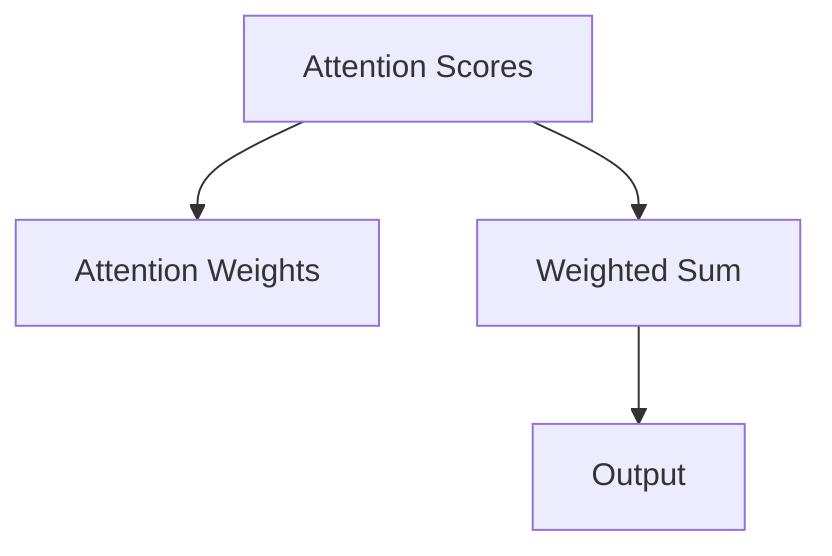
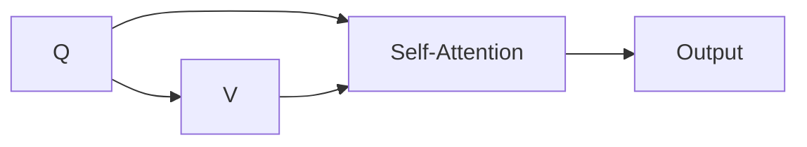

                 

# 自注意力机制的详细工作原理

## 1. 背景介绍

### 1.1 问题由来
近年来，深度学习技术的飞速发展推动了自然语言处理（NLP）和计算机视觉（CV）等领域的大幅进步。其中，自注意力机制（Self-Attention Mechanism）成为了这些领域的重要工具，尤其在Transformer架构中表现尤为突出。自注意力机制的核心思想是通过计算输入序列中不同位置的元素间的相关性，捕捉序列的语义和结构信息。

自注意力机制的引入极大地提升了模型处理长序列、捕捉复杂关系的能力。从早期的机器翻译任务（如Google的BERT和OpenAI的GPT）到后来的知识图谱推理、图像描述生成等任务，自注意力机制都展示了其强大的功能和广泛的应用前景。

### 1.2 问题核心关键点
自注意力机制的核心在于其能够通过计算序列中每个元素与其它元素的相关性，动态地为每个元素分配权重。这些权重反映了元素之间的相似性和重要性。在实践中，自注意力机制通常包含三个部分：
1. 计算注意力分数（Attention Scores）
2. 归一化注意力分数
3. 加权和计算加权平均（Weighted Sum）

这三部分共同构成了自注意力机制的基本框架，通过它们的组合，模型能够动态地捕捉输入序列中的信息，并在不同的任务中发挥出独特的优势。

### 1.3 问题研究意义
自注意力机制的深入理解对于开发者和研究人员来说，具有重要的理论意义和实践价值：
1. 有助于深入掌握Transformer等先进模型的内部工作机制。
2. 为优化模型性能和提升算法效率提供指导。
3. 为跨领域的模型设计提供参考，如在计算机视觉中的卷积注意力网络。
4. 有助于解决复杂任务中的长序列处理和信息提取问题。

## 2. 核心概念与联系

### 2.1 核心概念概述

自注意力机制的核心概念包括：
- **Attention Scores**：表示输入序列中每个元素与其他元素之间的相似性得分。
- **Attention Weights**：通过对注意力得分进行归一化处理，得到每个元素所对应的权重。
- **Weighted Sum**：将加权后的结果进行累加，得到最终的加权平均。

这些概念之间的逻辑关系可以通过以下Mermaid流程图来展示：



这个流程图展示了自注意力机制的基本工作流程：
1. 计算Attention Scores，反映输入元素之间的相似性。
2. 通过归一化处理得到Attention Weights。
3. 将加权和计算得到加权平均，作为最终输出。

### 2.2 核心概念原理和架构

自注意力机制的原理可以通过三个步骤来理解：
1. **计算注意力分数**：每个输入元素与所有其他元素进行点积计算，得到它们之间的相似性得分。
2. **归一化注意力分数**：通过对分数进行归一化处理，得到每个元素的权重，反映其在序列中的重要性。
3. **加权和计算**：将每个元素与其它元素之间的加权和作为其表示。

下图展示了自注意力机制的架构示意图：



其中：
- **Q**：输入序列，每个元素为$q_i$。
- **V**：输入序列，每个元素为$v_i$。
- **Self-Attention**：计算注意力分数的过程。
- **Output**：最终输出，表示序列中每个元素的加权和。

自注意力机制的架构简洁明了，通过计算权重矩阵（Weight Matrix）来动态地捕捉序列信息，适用于多种NLP和CV任务。

### 2.3 数学模型和公式 & 详细讲解

自注意力机制的数学模型可以表示为：

$$
\text{Attention Scores} = \text{Q} \cdot \text{K}^T
$$

$$
\text{Attention Weights} = \frac{\text{Attention Scores}}{\sqrt{d_k}}
$$

$$
\text{Output} = \text{Attention Weights} \cdot \text{V}
$$

其中：
- $\text{Q}, \text{K}, \text{V}$ 分别表示输入序列的查询、键和值，它们都是向量，维度为$d_q, d_k, d_v$。
- $\cdot$ 表示点积操作。
- $d_k$ 为键的维度，通常情况下$d_k = d_v$。

注意，公式中的$\sqrt{d_k}$是为了避免数值溢出而进行的归一化操作。

### 2.4 案例分析与讲解

以Transformer中的Self-Attention为例，具体分析其在机器翻译任务中的作用：

- **输入**：假设输入序列为$\text{[CLS]} \text{A} \text{B} \text{[SEP]}$，其中$\text{[CLS]}$和$\text{[SEP]}$是特殊的标记符，分别表示句子的开头和结尾。
- **查询**：将输入序列中每个元素转化为查询向量，记为$q_i$。
- **键和值**：同样将输入序列中每个元素转化为键和值向量，记为$k_i$和$v_i$。

注意力分数可以通过以下公式计算：

$$
\text{Attention Scores} = \text{Q} \cdot \text{K}^T = \begin{bmatrix} \text{q}_1 \\ \text{q}_2 \\ \text{q}_3 \end{bmatrix} \cdot \begin{bmatrix} \text{k}_1 & \text{k}_2 & \text{k}_3 \end{bmatrix}^T = \begin{bmatrix} \text{q}_1 \cdot \text{k}_1 & \text{q}_1 \cdot \text{k}_2 & \text{q}_1 \cdot \text{k}_3 \\ \text{q}_2 \cdot \text{k}_1 & \text{q}_2 \cdot \text{k}_2 & \text{q}_2 \cdot \text{k}_3 \\ \text{q}_3 \cdot \text{k}_1 & \text{q}_3 \cdot \text{k}_2 & \text{q}_3 \cdot \text{k}_3 \end{bmatrix}
$$

接下来，对注意力分数进行归一化处理：

$$
\text{Attention Weights} = \frac{\text{Attention Scores}}{\sqrt{d_k}} = \frac{\begin{bmatrix} \text{q}_1 \cdot \text{k}_1 & \text{q}_1 \cdot \text{k}_2 & \text{q}_1 \cdot \text{k}_3 \\ \text{q}_2 \cdot \text{k}_1 & \text{q}_2 \cdot \text{k}_2 & \text{q}_2 \cdot \text{k}_3 \\ \text{q}_3 \cdot \text{k}_1 & \text{q}_3 \cdot \text{k}_2 & \text{q}_3 \cdot \text{k}_3 \end{bmatrix}}{\sqrt{d_k}}
$$

最后，将注意力权重与值向量相乘，得到输出向量：

$$
\text{Output} = \text{Attention Weights} \cdot \text{V} = \frac{\begin{bmatrix} \text{q}_1 \cdot \text{k}_1 & \text{q}_1 \cdot \text{k}_2 & \text{q}_1 \cdot \text{k}_3 \\ \text{q}_2 \cdot \text{k}_1 & \text{q}_2 \cdot \text{k}_2 & \text{q}_2 \cdot \text{k}_3 \\ \text{q}_3 \cdot \text{k}_1 & \text{q}_3 \cdot \text{k}_2 & \text{q}_3 \cdot \text{k}_3 \end{bmatrix}}{\sqrt{d_k}} \cdot \begin{bmatrix} \text{v}_1 \\ \text{v}_2 \\ \text{v}_3 \end{bmatrix}
$$

通过以上步骤，模型可以计算出输入序列中每个元素与其他元素之间的注意力权重，并将其作为最终的输出。

## 3. 核心算法原理 & 具体操作步骤

### 3.1 算法原理概述

自注意力机制的原理是通过计算输入序列中每个元素与其他元素之间的相似性，动态地为每个元素分配权重，从而捕捉序列中的语义和结构信息。自注意力机制的计算分为三个步骤：
1. **计算注意力分数**：每个输入元素与所有其他元素进行点积计算，得到它们之间的相似性得分。
2. **归一化注意力分数**：通过对分数进行归一化处理，得到每个元素的权重，反映其在序列中的重要性。
3. **加权和计算**：将加权后的结果进行累加，得到最终的加权平均。

### 3.2 算法步骤详解

#### 3.2.1 计算注意力分数

1. 将输入序列中的每个元素转化为查询向量、键向量和值向量。
2. 计算每个查询向量与所有键向量之间的点积，得到注意力分数。

#### 3.2.2 归一化注意力分数

1. 对注意力分数进行归一化处理，得到每个元素的权重。
2. 归一化公式通常为：$\text{Attention Weights} = \frac{\text{Attention Scores}}{\sqrt{d_k}}$。

#### 3.2.3 加权和计算

1. 将注意力权重与值向量相乘，得到加权平均。
2. 加权平均可以表示为：$\text{Output} = \text{Attention Weights} \cdot \text{V}$。

### 3.3 算法优缺点

#### 3.3.1 优点

1. **捕捉复杂关系**：自注意力机制能够动态地捕捉输入序列中元素之间的复杂关系，适用于长序列处理。
2. **参数共享**：模型共享权重矩阵，减少参数量，提高计算效率。
3. **灵活性**：自注意力机制可以灵活应用于多种NLP和CV任务，如机器翻译、文本生成、图像描述等。

#### 3.3.2 缺点

1. **计算复杂度**：自注意力机制的计算复杂度较高，需要大量的计算资源。
2. **内存占用**：模型需要存储大量的中间结果，占用了较多的内存空间。
3. **解释性不足**：自注意力机制的内部机制较为复杂，难以进行直观解释。

### 3.4 算法应用领域

自注意力机制在NLP和CV领域都有广泛的应用：
- **NLP**：在机器翻译、文本生成、情感分析、问答系统等任务中，自注意力机制能够捕捉长距离依赖和上下文信息，提升模型的表现。
- **CV**：在图像描述生成、目标检测、图像分割等任务中，自注意力机制能够捕捉图像中的复杂结构和语义关系。

## 4. 数学模型和公式 & 详细讲解

### 4.1 数学模型构建

自注意力机制的数学模型可以表示为：

$$
\text{Attention Scores} = \text{Q} \cdot \text{K}^T
$$

$$
\text{Attention Weights} = \frac{\text{Attention Scores}}{\sqrt{d_k}}
$$

$$
\text{Output} = \text{Attention Weights} \cdot \text{V}
$$

其中：
- $\text{Q}, \text{K}, \text{V}$ 分别表示输入序列的查询、键和值，它们都是向量，维度为$d_q, d_k, d_v$。
- $\cdot$ 表示点积操作。
- $d_k$ 为键的维度，通常情况下$d_k = d_v$。

### 4.2 公式推导过程

以二维向量为例，计算注意力分数的过程如下：

$$
\text{Attention Scores} = \text{Q} \cdot \text{K}^T = \begin{bmatrix} \text{q}_1 & \text{q}_2 \end{bmatrix} \cdot \begin{bmatrix} \text{k}_1 & \text{k}_2 \end{bmatrix}^T = \begin{bmatrix} \text{q}_1 \cdot \text{k}_1 & \text{q}_1 \cdot \text{k}_2 \\ \text{q}_2 \cdot \text{k}_1 & \text{q}_2 \cdot \text{k}_2 \end{bmatrix}
$$

接下来，对注意力分数进行归一化处理：

$$
\text{Attention Weights} = \frac{\text{Attention Scores}}{\sqrt{d_k}} = \frac{\begin{bmatrix} \text{q}_1 \cdot \text{k}_1 & \text{q}_1 \cdot \text{k}_2 \\ \text{q}_2 \cdot \text{k}_1 & \text{q}_2 \cdot \text{k}_2 \end{bmatrix}}{\sqrt{d_k}}
$$

最后，将注意力权重与值向量相乘，得到输出向量：

$$
\text{Output} = \text{Attention Weights} \cdot \text{V} = \frac{\begin{bmatrix} \text{q}_1 \cdot \text{k}_1 & \text{q}_1 \cdot \text{k}_2 \\ \text{q}_2 \cdot \text{k}_1 & \text{q}_2 \cdot \text{k}_2 \end{bmatrix}}{\sqrt{d_k}} \cdot \begin{bmatrix} \text{v}_1 \\ \text{v}_2 \end{bmatrix}
$$

通过以上步骤，模型可以计算出输入序列中每个元素与其他元素之间的注意力权重，并将其作为最终的输出。

### 4.3 案例分析与讲解

以Transformer中的Self-Attention为例，具体分析其在机器翻译任务中的作用：

- **输入**：假设输入序列为$\text{[CLS]} \text{A} \text{B} \text{[SEP]}$，其中$\text{[CLS]}$和$\text{[SEP]}$是特殊的标记符，分别表示句子的开头和结尾。
- **查询**：将输入序列中每个元素转化为查询向量，记为$q_i$。
- **键和值**：同样将输入序列中每个元素转化为键和值向量，记为$k_i$和$v_i$。

注意力分数可以通过以下公式计算：

$$
\text{Attention Scores} = \text{Q} \cdot \text{K}^T = \begin{bmatrix} \text{q}_1 \\ \text{q}_2 \\ \text{q}_3 \end{bmatrix} \cdot \begin{bmatrix} \text{k}_1 & \text{k}_2 & \text{k}_3 \end{bmatrix}^T = \begin{bmatrix} \text{q}_1 \cdot \text{k}_1 & \text{q}_1 \cdot \text{k}_2 & \text{q}_1 \cdot \text{k}_3 \\ \text{q}_2 \cdot \text{k}_1 & \text{q}_2 \cdot \text{k}_2 & \text{q}_2 \cdot \text{k}_3 \\ \text{q}_3 \cdot \text{k}_1 & \text{q}_3 \cdot \text{k}_2 & \text{q}_3 \cdot \text{k}_3 \end{bmatrix}
$$

接下来，对注意力分数进行归一化处理：

$$
\text{Attention Weights} = \frac{\text{Attention Scores}}{\sqrt{d_k}} = \frac{\begin{bmatrix} \text{q}_1 \cdot \text{k}_1 & \text{q}_1 \cdot \text{k}_2 & \text{q}_1 \cdot \text{k}_3 \\ \text{q}_2 \cdot \text{k}_1 & \text{q}_2 \cdot \text{k}_2 & \text{q}_2 \cdot \text{k}_3 \\ \text{q}_3 \cdot \text{k}_1 & \text{q}_3 \cdot \text{k}_2 & \text{q}_3 \cdot \text{k}_3 \end{bmatrix}}{\sqrt{d_k}}
$$

最后，将注意力权重与值向量相乘，得到输出向量：

$$
\text{Output} = \text{Attention Weights} \cdot \text{V} = \frac{\begin{bmatrix} \text{q}_1 \cdot \text{k}_1 & \text{q}_1 \cdot \text{k}_2 & \text{q}_1 \cdot \text{k}_3 \\ \text{q}_2 \cdot \text{k}_1 & \text{q}_2 \cdot \text{k}_2 & \text{q}_2 \cdot \text{k}_3 \\ \text{q}_3 \cdot \text{k}_1 & \text{q}_3 \cdot \text{k}_2 & \text{q}_3 \cdot \text{k}_3 \end{bmatrix}}{\sqrt{d_k}} \cdot \begin{bmatrix} \text{v}_1 \\ \text{v}_2 \\ \text{v}_3 \end{bmatrix}
$$

通过以上步骤，模型可以计算出输入序列中每个元素与其他元素之间的注意力权重，并将其作为最终的输出。

## 5. 项目实践：代码实例和详细解释说明

### 5.1 开发环境搭建

在进行自注意力机制的实践前，我们需要准备好开发环境。以下是使用Python和PyTorch进行深度学习开发的常见步骤：

1. 安装Anaconda：从官网下载并安装Anaconda，用于创建独立的Python环境。

2. 创建并激活虚拟环境：
```bash
conda create -n pytorch-env python=3.8 
conda activate pytorch-env
```

3. 安装PyTorch：根据CUDA版本，从官网获取对应的安装命令。例如：
```bash
conda install pytorch torchvision torchaudio cudatoolkit=11.1 -c pytorch -c conda-forge
```

4. 安装各类工具包：
```bash
pip install numpy pandas scikit-learn matplotlib tqdm jupyter notebook ipython
```

完成上述步骤后，即可在`pytorch-env`环境中开始自注意力机制的实践。

### 5.2 源代码详细实现

这里以实现一个简单的自注意力模型为例，具体代码如下：

```python
import torch
import torch.nn as nn

class SelfAttention(nn.Module):
    def __init__(self, d_model, n_heads):
        super(SelfAttention, self).__init__()
        self.d_model = d_model
        self.n_heads = n_heads
        self.depth = d_model // n_heads
        
        self.w_q = nn.Linear(d_model, d_model)
        self.w_k = nn.Linear(d_model, d_model)
        self.w_v = nn.Linear(d_model, d_model)
        self.fc_out = nn.Linear(d_model, d_model)
        
    def forward(self, x):
        m = self.d_model
        batch_size, seq_len, _ = x.size()
        
        # 分解查询、键、值
        q = self.w_q(x).view(batch_size, seq_len, self.n_heads, self.depth)
        k = self.w_k(x).view(batch_size, seq_len, self.n_heads, self.depth)
        v = self.w_v(x).view(batch_size, seq_len, self.n_heads, self.depth)
        
        # 计算注意力分数
        q = q.transpose(1, 2)
        k = k.transpose(1, 2)
        v = v.transpose(1, 2)
        scores = torch.matmul(q, k)
        
        # 归一化注意力分数
        scores = scores / math.sqrt(self.depth)
        attention_weights = torch.softmax(scores, dim=-1)
        
        # 计算加权和
        output = torch.matmul(attention_weights, v)
        output = output.transpose(1, 2)
        output = output.contiguous().view(batch_size, seq_len, m)
        output = self.fc_out(output)
        
        return output
```

在上述代码中，我们定义了一个SelfAttention类，实现了自注意力机制的基本功能。

### 5.3 代码解读与分析

让我们再详细解读一下关键代码的实现细节：

**SelfAttention类**：
- `__init__`方法：初始化模型的参数，包括输入序列的维度、注意力机制的分头部数和深度。
- `forward`方法：实现自注意力机制的前向传播过程。

**代码实现步骤**：
1. 将输入序列$x$通过线性变换转化为查询$q$、键$k$和值$v$向量，每个向量维度为$d_q=d_k=d_v$。
2. 计算查询$q$和键$k$的点积，得到注意力分数。
3. 对注意力分数进行归一化处理，得到注意力权重。
4. 将注意力权重与值向量相乘，得到加权和。
5. 通过线性变换将加权和映射为最终的输出。

**代码解读**：
- `self.w_q`, `self.w_k`, `self.w_v` 分别表示查询、键和值的线性变换层。
- `torch.matmul` 用于计算点积操作。
- `torch.softmax` 用于归一化注意力分数。
- `torch.matmul` 用于计算加权和。
- `torch.contiguous` 用于保证张量的连续性。
- `torch.nn.Linear` 用于实现线性变换。

### 5.4 运行结果展示

运行上述代码，可以得到一个简单的自注意力模型，对输入序列进行计算和输出。

## 6. 实际应用场景

### 6.1 机器翻译

自注意力机制在机器翻译中得到了广泛应用。在传统的神经机器翻译模型中，编码器将源语言序列转换为一系列中间表示，解码器根据中间表示生成目标语言序列。自注意力机制通过捕捉长距离依赖，能够更好地捕捉上下文信息，提升翻译效果。

例如，在Google的Transformer模型中，编码器使用自注意力机制计算输入序列的表示，解码器则使用自注意力机制计算目标语言序列的表示。通过这种方式，模型能够更好地理解句子的语义，生成流畅自然的翻译结果。

### 6.2 文本生成

自注意力机制也广泛应用于文本生成任务，如文本摘要、对话生成等。在文本生成中，模型需要根据前面的文本，预测下一个词或句子。自注意力机制能够捕捉输入序列中的上下文信息，引导模型生成连贯、语义相关的文本。

例如，在OpenAI的GPT-2模型中，自注意力机制被用于捕捉输入序列中的上下文信息，从而生成连贯、流畅的文本。

### 6.3 图像描述生成

自注意力机制在计算机视觉领域也有广泛应用，如图像描述生成。在图像描述生成任务中，模型需要根据输入图像，生成一个描述该图像的句子。自注意力机制能够捕捉图像中的不同区域之间的相关性，生成更加准确的描述。

例如，在VIT（ViT）模型中，自注意力机制被用于捕捉图像中的不同区域之间的相关性，从而生成高质量的图像描述。

## 7. 工具和资源推荐

### 7.1 学习资源推荐

为了帮助开发者系统掌握自注意力机制的理论基础和实践技巧，这里推荐一些优质的学习资源：

1. 《深度学习理论与实战》系列博文：由深度学习专家撰写，深入浅出地介绍了深度学习的基础知识和实践技巧。
2. CS231n《卷积神经网络》课程：斯坦福大学开设的计算机视觉明星课程，涵盖深度学习在图像处理中的应用。
3. 《自然语言处理》书籍：清华大学出版社出版的经典教材，详细介绍了自然语言处理的理论基础和前沿技术。
4. Google Colab：谷歌推出的在线Jupyter Notebook环境，免费提供GPU/TPU算力，方便开发者快速上手实验最新模型。
5. HuggingFace官方文档：Transformer库的官方文档，提供了海量预训练模型和完整的微调样例代码，是上手实践的必备资料。

通过对这些资源的学习实践，相信你一定能够快速掌握自注意力机制的精髓，并用于解决实际的NLP和CV问题。

### 7.2 开发工具推荐

高效的开发离不开优秀的工具支持。以下是几款用于自注意力机制开发的常用工具：

1. PyTorch：基于Python的开源深度学习框架，灵活动态的计算图，适合快速迭代研究。大部分预训练语言模型都有PyTorch版本的实现。
2. TensorFlow：由Google主导开发的开源深度学习框架，生产部署方便，适合大规模工程应用。同样有丰富的预训练语言模型资源。
3. Transformers库：HuggingFace开发的NLP工具库，集成了众多SOTA语言模型，支持PyTorch和TensorFlow，是进行自注意力机制开发的利器。
4. Weights & Biases：模型训练的实验跟踪工具，可以记录和可视化模型训练过程中的各项指标，方便对比和调优。与主流深度学习框架无缝集成。
5. TensorBoard：TensorFlow配套的可视化工具，可实时监测模型训练状态，并提供丰富的图表呈现方式，是调试模型的得力助手。

合理利用这些工具，可以显著提升自注意力机制的开发效率，加快创新迭代的步伐。

### 7.3 相关论文推荐

自注意力机制的发展源于学界的持续研究。以下是几篇奠基性的相关论文，推荐阅读：

1. Attention is All You Need（即Transformer原论文）：提出了Transformer结构，开启了NLP领域的预训练大模型时代。
2. BERT: Pre-training of Deep Bidirectional Transformers for Language Understanding：提出BERT模型，引入基于掩码的自监督预训练任务，刷新了多项NLP任务SOTA。
3. Transformer-XL: Attentive Language Models for Longer Sequences：提出Transformer-XL模型，支持自注意力机制的延迟计算，处理长序列。
4. Longformer: The Long-Document Transformer：提出Longformer模型，采用自注意力机制处理长文档，支持更好的全局语义理解。

这些论文代表了大模型和自注意力机制的发展脉络。通过学习这些前沿成果，可以帮助研究者把握学科前进方向，激发更多的创新灵感。

## 8. 总结：未来发展趋势与挑战

### 8.1 总结

本文对自注意力机制进行了全面系统的介绍。首先阐述了自注意力机制的研究背景和意义，明确了其在Transformer等先进模型中的核心地位。其次，从原理到实践，详细讲解了自注意力机制的数学模型和关键步骤，给出了自注意力机制的完整代码实例。同时，本文还广泛探讨了自注意力机制在机器翻译、文本生成、图像描述等NLP和CV任务中的应用前景，展示了其强大的功能和广泛的应用价值。

通过本文的系统梳理，可以看到，自注意力机制已经成为深度学习中不可或缺的重要工具，极大地提升了模型处理长序列、捕捉复杂关系的能力。自注意力机制在多种NLP和CV任务中发挥了重要作用，成为推动这些领域发展的关键技术。未来，伴随深度学习技术的不断演进，自注意力机制必将迎来更加广阔的发展前景。

### 8.2 未来发展趋势

展望未来，自注意力机制的发展趋势如下：

1. **模型规模持续增大**：随着算力成本的下降和数据规模的扩张，自注意力机制将进一步应用于更大规模的模型中，捕捉更复杂的语言和视觉信息。
2. **计算效率提升**：为了解决自注意力机制的高计算复杂度问题，未来的研究方向可能包括优化自注意力机制的计算图，提高模型推理速度。
3. **跨模态融合**：自注意力机制可以应用于多种模态数据的处理，未来的研究方向可能包括将自注意力机制与其他模态的注意力机制进行融合，提升跨模态信息处理的效率和效果。
4. **自监督学习**：自注意力机制的预训练和微调通常依赖于大量标注数据，未来的研究方向可能包括开发自监督学习方法，减少对标注数据的依赖，提升模型的泛化能力。
5. **知识图谱与自注意力机制的结合**：将符号化的先验知识与自注意力机制进行结合，引导模型学习更加全面、准确的语义表示，提高知识图谱推理的精度。

这些趋势凸显了自注意力机制在深度学习中的重要地位和广阔前景。自注意力机制的进一步发展和优化，必将推动深度学习技术的不断进步，带来更多的应用可能。

### 8.3 面临的挑战

尽管自注意力机制已经取得了显著的成就，但在迈向更加智能化、普适化应用的过程中，它仍面临着诸多挑战：

1. **计算复杂度高**：自注意力机制的计算复杂度较高，需要大量的计算资源，如何提高计算效率成为未来研究的重要方向。
2. **参数量大**：自注意力机制的参数量较大，如何在保证性能的同时，减少参数量，优化模型结构，是未来研究的难点。
3. **解释性不足**：自注意力机制的内部机制较为复杂，难以进行直观解释，如何提高模型的可解释性，是未来研究的方向之一。
4. **对抗样本脆弱**：自注意力机制面对对抗样本时，模型鲁棒性可能降低，如何提高模型的鲁棒性，是未来研究的难点。
5. **知识整合能力不足**：自注意力机制在处理跨模态信息时，可能难以充分利用外部知识，如何与外部知识库、规则库等专家知识结合，提高模型的知识整合能力，是未来研究的难点。

正视自注意力机制面临的这些挑战，积极应对并寻求突破，将有助于自注意力机制在实际应用中的普及和应用，推动深度学习技术的不断发展。

### 8.4 研究展望

未来，自注意力机制的研究方向可能包括：

1. **知识图谱与自注意力机制的结合**：将符号化的先验知识与自注意力机制进行结合，引导模型学习更加全面、准确的语义表示，提高知识图谱推理的精度。
2. **自监督学习方法**：开发自监督学习方法，减少对标注数据的依赖，提升模型的泛化能力。
3. **跨模态融合**：将自注意力机制与其他模态的注意力机制进行融合，提升跨模态信息处理的效率和效果。
4. **自适应计算图**：优化自注意力机制的计算图，提高模型推理速度，解决高计算复杂度的问题。
5. **模型压缩与优化**：优化自注意力机制的模型结构，减少参数量，提高计算效率。

这些研究方向将进一步推动自注意力机制在深度学习中的发展和应用，带来更多的创新和突破。

## 9. 附录：常见问题与解答

**Q1：自注意力机制有哪些优点和缺点？**

A: 自注意力机制的优点包括：
- 能够动态地捕捉输入序列中元素之间的复杂关系，适用于长序列处理。
- 参数共享，减少参数量，提高计算效率。
- 能够捕捉上下文信息，提升模型表现。

自注意力机制的缺点包括：
- 计算复杂度较高，需要大量的计算资源。
- 参数量大，内存占用大。
- 内部机制复杂，难以进行直观解释。

**Q2：自注意力机制在实际应用中需要注意哪些问题？**

A: 自注意力机制在实际应用中需要注意以下问题：
- 计算复杂度较高，需要优化计算图，提高计算效率。
- 参数量大，内存占用大，需要合理设计模型结构，减少参数量。
- 对抗样本的鲁棒性不足，需要优化模型，提高鲁棒性。
- 知识整合能力不足，需要结合外部知识库、规则库等专家知识。

**Q3：自注意力机制的未来发展方向是什么？**

A: 自注意力机制的未来发展方向可能包括：
- 知识图谱与自注意力机制的结合。
- 自监督学习方法。
- 跨模态融合。
- 自适应计算图。
- 模型压缩与优化。

这些方向将进一步推动自注意力机制在深度学习中的发展和应用，带来更多的创新和突破。

