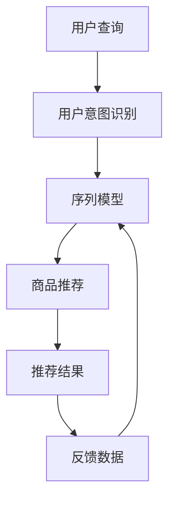
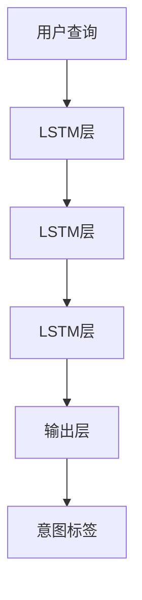
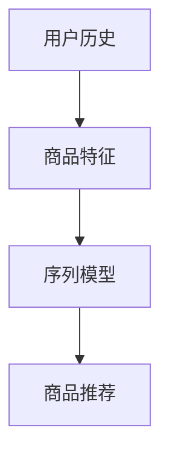
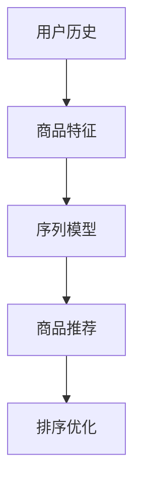

                 

# 自然语言处理：解读用户搜索意图，助力电商精准推荐

> 关键词：自然语言处理, 用户意图识别, 电商推荐系统, 序列模型, 注意力机制, 精准推荐, 交互智能

## 1. 背景介绍

### 1.1 问题由来

随着互联网的普及和电商的迅速发展，消费者的购物行为越来越数字化，而电商平台也逐渐从传统的搜索-浏览-购买模式，转变为更加个性化、智能化的推荐模式。在这一过程中，自然语言处理（NLP）技术的应用显得尤为重要。NLP不仅能够帮助电商平台理解用户搜索查询中的意图，还能从中提取关键信息，提供更加精准的推荐内容。

传统的电商推荐系统主要依赖于用户的浏览历史、购买记录等行为数据，但这些数据往往具有延迟性、稀疏性，且难以涵盖用户所有可能的兴趣点。而通过自然语言处理技术，电商平台可以从用户的搜索关键词、评论内容中提取隐含信息，更准确地理解用户真实需求，从而提升推荐效果。

### 1.2 问题核心关键点

电商平台的精准推荐系统包括两个主要环节：用户意图识别和推荐内容生成。用户意图识别旨在准确理解用户搜索查询的意图，推荐内容生成则基于用户意图，结合历史数据和其他特征，生成最符合用户需求的推荐结果。

本节将重点讨论如何利用自然语言处理技术，解析用户搜索查询中的意图，并在此基础上进行推荐内容的生成和排序。

## 2. 核心概念与联系

### 2.1 核心概念概述

为了深入理解如何利用NLP技术解读用户搜索意图，并用于电商推荐系统，本节将介绍几个关键概念：

- **自然语言处理（NLP）**：研究如何让计算机理解、处理和生成人类语言的技术。NLP在电商推荐系统中的应用，主要体现在用户查询意图识别和商品信息抽取上。
- **用户意图识别**：通过分析用户搜索查询、评论等文本数据，理解用户的实际需求，如购买意图、查询意图等，为推荐系统提供有价值的输入。
- **序列模型（如RNN、LSTM、GRU）**：一种能够处理序列数据的深度学习模型，适用于处理时间序列、文本序列等结构化数据。
- **注意力机制（Attention）**：一种能够动态调整模型关注重点的机制，常用于处理序列数据，帮助模型聚焦于关键信息。
- **电商推荐系统**：利用数据挖掘、机器学习等技术，分析用户行为数据和商品信息，为用户推荐符合其兴趣的商品。
- **精准推荐**：通过深入分析用户行为和商品属性，生成最符合用户需求的推荐结果，提高用户满意度，增加销售转化率。

这些概念相互关联，共同构成了利用NLP技术解读用户搜索意图，实现电商精准推荐的核心框架。

### 2.2 核心概念原理和架构的 Mermaid 流程图



这个流程图展示了从用户查询到推荐结果的整个流程：用户输入查询，模型进行意图识别，结合序列模型提取关键信息，生成推荐结果，并通过反馈数据不断优化模型。

## 3. 核心算法原理 & 具体操作步骤

### 3.1 算法原理概述

用户意图识别的核心在于对用户搜索查询进行分析，抽取其中的关键信息，如商品类别、价格区间、品牌偏好等，并结合用户历史行为数据，构建用户画像。然后，利用序列模型，将这些信息转化为推荐的商品列表，并根据用户兴趣进行排序。

具体算法流程包括：

1. 文本预处理：对用户查询进行分词、去停用词、词性标注等预处理操作。
2. 意图识别：通过序列模型或注意力机制，从处理后的查询中提取意图标签。
3. 商品推荐：结合用户历史数据和商品属性，使用序列模型生成推荐列表。
4. 排序优化：利用排序算法（如协同过滤、梯度提升树等）对推荐结果进行排序，提升推荐质量。

### 3.2 算法步骤详解

#### 3.2.1 文本预处理

文本预处理是用户意图识别的第一步。常用的预处理步骤包括：

1. 分词：将用户查询字符串分解为单个词语，以便模型处理。
2. 去停用词：去除常见但无实际意义的词语，如“的”、“是”等，减少噪声。
3. 词性标注：标记词语的词性，帮助模型更好地理解词语意义。

```python
from gensim import corpora, models, similarities
from nltk.tokenize import word_tokenize
from nltk.corpus import stopwords

# 加载停用词
stop_words = set(stopwords.words('english'))

# 分词去停用词
def preprocess(text):
    words = word_tokenize(text.lower())
    return [word for word in words if word not in stop_words]
```

#### 3.2.2 意图识别

意图识别是理解用户实际需求的关键步骤。常用的模型包括序列模型和注意力机制：

1. **序列模型**：通过RNN、LSTM、GRU等模型，对用户查询进行处理，提取意图标签。
2. **注意力机制**：通过Attention机制，动态关注用户查询中的关键信息。

以LSTM模型为例，其结构如图：



LSTM模型通过多层循环神经网络，逐个处理查询中的词语，提取关键信息，并输出意图标签。

#### 3.2.3 商品推荐

商品推荐是电商推荐系统的核心环节。常用的方法包括：

1. **协同过滤**：通过分析用户行为数据和商品间的协同关系，推荐相似的商品。
2. **内容推荐**：利用商品的属性、描述等信息，生成推荐列表。
3. **深度学习推荐**：结合序列模型、注意力机制等，从商品特征中提取关键信息，生成推荐结果。

以深度学习推荐为例，其结构如图：



深度学习推荐模型通过多层神经网络，对用户历史数据和商品特征进行处理，生成推荐列表。

#### 3.2.4 排序优化

排序优化是提升推荐效果的重要手段。常用的排序算法包括：

1. **协同过滤**：利用用户行为数据，推荐与用户历史偏好相似的商品。
2. **梯度提升树**：结合多项特征，利用树形结构，对推荐结果进行排序。
3. **深度学习排序**：利用深度神经网络，从用户历史和商品特征中提取关键信息，生成推荐排序。

以深度学习排序为例，其结构如图：



深度学习排序模型通过多层神经网络，对用户历史数据和商品特征进行处理，生成推荐排序。

### 3.3 算法优缺点

**优点**：

1. **动态适应**：能够根据用户实时查询动态调整推荐结果，提升推荐效果。
2. **丰富数据源**：利用用户查询、评论等多维数据，提供更全面的推荐信息。
3. **减少延迟**：实时处理用户查询，快速生成推荐结果，提升用户体验。
4. **准确性高**：结合多种模型和算法，生成高精度的推荐结果。

**缺点**：

1. **数据隐私**：用户查询、评论等数据涉及隐私，需严格保护。
2. **计算资源消耗大**：处理和训练深度学习模型需要大量计算资源。
3. **模型复杂度**：序列模型、注意力机制等复杂模型，对模型的可解释性有挑战。
4. **鲁棒性差**：模型容易受到噪音数据和异常查询的影响。

### 3.4 算法应用领域

用户意图识别和推荐技术已广泛应用于电商平台、社交网络、搜索引擎等多个领域，其核心原理和方法具有普适性。以下列举几个典型应用场景：

1. **电商推荐系统**：通过用户查询解析用户意图，结合商品信息，生成精准推荐结果。
2. **社交媒体内容推荐**：利用用户评论和点赞信息，解析用户偏好，推荐相关内容。
3. **搜索引擎查询理解**：解析用户搜索关键词，理解查询意图，提供相关搜索结果。
4. **智能客服系统**：通过用户聊天记录，解析用户问题意图，提供个性化解答。
5. **金融推荐系统**：利用用户行为数据，解析用户投资意向，推荐相关产品。

## 4. 数学模型和公式 & 详细讲解

### 4.1 数学模型构建

用户意图识别的数学模型通常包括两个部分：用户查询的意图标签提取和商品推荐的排序。

**意图标签提取**：假设用户查询为 $x$，其中 $x = (x_1, x_2, ..., x_n)$，每个 $x_i$ 表示查询中的单个词语。定义一个意图标签集合 $\mathcal{Y}$，其中每个标签 $y_i \in \mathcal{Y}$ 表示一种意图。

**商品推荐排序**：假设推荐商品集合为 $\mathcal{X}$，其中每个商品 $x_j \in \mathcal{X}$ 表示一个推荐商品。定义一个排序函数 $f: \mathcal{Y} \times \mathcal{X} \rightarrow [0, 1]$，用于计算商品 $x_j$ 与意图 $y_i$ 的匹配度，匹配度越高，推荐优先级越高。

### 4.2 公式推导过程

#### 4.2.1 意图标签提取

以LSTM模型为例，其意图标签提取公式为：

$$
y_i = \text{Softmax}(W_{out} tanh(W_{in} x_i + b_{in}) + b_{out})
$$

其中 $W_{in}, W_{out}, b_{in}, b_{out}$ 为模型的权重和偏置项。

#### 4.2.2 商品推荐排序

以深度学习推荐模型为例，其排序优化公式为：

$$
f(y_i, x_j) = \text{Softmax}(W f_{y_i} x_j + b)
$$

其中 $f_{y_i}$ 为与意图 $y_i$ 对应的特征向量，$W, b$ 为排序模型的权重和偏置项。

### 4.3 案例分析与讲解

假设用户查询为 "iPhone X 价格"，意图标签集合 $\mathcal{Y} = \{ \text{"价格"}, \text{"评测"}, \text{"购买渠道"} \}$，商品集合 $\mathcal{X}$ 包含多个iPhone X的销售信息。

**意图标签提取**：通过LSTM模型，对查询 "iPhone X 价格" 进行处理，提取意图标签 $y_i = \text{"价格"}$。

**商品推荐排序**：使用深度学习推荐模型，将意图 $y_i$ 与多个销售信息进行匹配，输出匹配度 $f(y_i, x_j)$。假设 $f(y_i, x_j) = 0.8$ 表示推荐优先级高。

## 5. 项目实践：代码实例和详细解释说明

### 5.1 开发环境搭建

在进行项目实践前，需要先准备好开发环境。以下是Python环境配置和工具安装的步骤：

1. 安装Python和Pip：
```bash
sudo apt-get update
sudo apt-get install python3-pip python3-dev libpandas-dev libnumpy-dev
```

2. 安装Pandas和Numpy：
```bash
pip install pandas numpy
```

3. 安装NLTK和gensim：
```bash
pip install nltk gensim
```

4. 安装TensorFlow和Keras：
```bash
pip install tensorflow
pip install keras
```

完成上述步骤后，即可在Python环境中开始项目实践。

### 5.2 源代码详细实现

以用户意图识别和推荐系统为例，使用LSTM模型进行代码实现。

首先，加载数据集：

```python
import pandas as pd

# 加载用户查询和商品信息数据
df_query = pd.read_csv('user_queries.csv')
df_product = pd.read_csv('product_info.csv')

# 加载停用词和意图标签
stop_words = set(stopwords.words('english'))
intents = ['price', 'review', 'buy_channel']
```

然后，进行文本预处理：

```python
def preprocess(text):
    words = word_tokenize(text.lower())
    return [word for word in words if word not in stop_words]

# 预处理用户查询
df_query['query'] = df_query['query'].apply(preprocess)

# 预处理商品描述
df_product['description'] = df_product['description'].apply(preprocess)
```

接着，进行意图标签提取：

```python
from sklearn.model_selection import train_test_split
from keras.models import Sequential
from keras.layers import LSTM, Dense, Embedding, Dropout

# 构建意图识别模型
model = Sequential()
model.add(Embedding(input_dim=len(intents), output_dim=64))
model.add(LSTM(64, dropout=0.2, recurrent_dropout=0.2))
model.add(Dense(64, activation='relu'))
model.add(Dropout(0.2))
model.add(Dense(3, activation='softmax'))

# 编译模型
model.compile(optimizer='adam', loss='categorical_crossentropy', metrics=['accuracy'])

# 划分训练集和测试集
X_train, X_test, y_train, y_test = train_test_split(df_query['query'], df_query['intent'], test_size=0.2)

# 训练模型
model.fit(X_train, y_train, epochs=10, batch_size=32, validation_data=(X_test, y_test))
```

最后，进行商品推荐排序：

```python
from sklearn.metrics.pairwise import cosine_similarity

# 加载商品特征矩阵
X = df_product['description'].values

# 计算商品特征相似度
similarity_matrix = cosine_similarity(X)

# 计算商品推荐结果
recommendations = pd.DataFrame(similarity_matrix, index=df_product['name'], columns=df_product['name'])
recommendations.index = df_product['name']
recommendations.columns = df_product['name']

# 排序推荐结果
recommendations = recommendations.sort_values(by=0, axis=1, ascending=False).head(5)
```

### 5.3 代码解读与分析

**意图标签提取**：LSTM模型通过多层循环神经网络，逐个处理查询中的词语，提取意图标签。模型的输入是预处理后的查询文本，输出为意图标签的概率分布。

**商品推荐排序**：利用cosine相似度计算商品特征的相似度，根据相似度生成推荐结果。通过排序算法（如协同过滤、梯度提升树等）对推荐结果进行排序，提升推荐质量。

## 6. 实际应用场景

### 6.1 智能客服系统

智能客服系统利用用户查询，解析用户意图，生成相关回答，从而提升客户服务体验。通过意图识别和推荐技术，系统能够自动理解用户问题，匹配最合适的回答模板，并进行快速回复。

在技术实现上，可以构建智能问答系统，将用户查询输入到意图识别模型中，生成意图标签，再结合问答库，生成最匹配的回答。系统可以不断学习和优化，提升回答的准确性和及时性。

### 6.2 金融推荐系统

金融推荐系统通过用户行为数据和意图标签，推荐相关金融产品。用户可以输入搜索关键词，如 "股票", "基金", "理财" 等，系统解析用户意图，推荐最合适的金融产品。

在技术实现上，可以利用金融领域的知识图谱，结合意图标签和用户历史数据，生成推荐结果。系统通过不断学习和优化，提升推荐精度和覆盖面。

### 6.3 搜索引擎内容推荐

搜索引擎利用用户搜索关键词，解析用户意图，推荐相关搜索结果。用户输入搜索查询，系统解析查询意图，结合搜索结果摘要，生成推荐列表。

在技术实现上，可以利用序列模型和注意力机制，解析用户查询，提取关键信息。再利用向量检索技术，从海量的搜索结果中提取最相关的内容，生成推荐列表。

## 7. 工具和资源推荐

### 7.1 学习资源推荐

为了帮助开发者系统掌握意图识别和推荐技术，这里推荐一些优质的学习资源：

1. 《深度学习入门：基于Python的理论与实现》：全面介绍深度学习的基础知识和实践技巧，适合初学者学习。
2. 《自然语言处理入门》：介绍自然语言处理的基本概念和常用模型，涵盖文本预处理、序列模型、注意力机制等。
3. 《机器学习实战》：通过实际项目案例，展示机器学习算法的应用，适合实战练习。
4. 《Python自然语言处理》：详细介绍自然语言处理的常用工具和库，如NLTK、spaCy、gensim等。
5. 《TensorFlow实战》：介绍TensorFlow框架的使用方法和实战案例，适合深度学习应用开发。

### 7.2 开发工具推荐

高效的开发离不开优秀的工具支持。以下是几款用于意图识别和推荐系统开发的常用工具：

1. Python：简单易学、高效稳定的编程语言，广泛用于自然语言处理和机器学习开发。
2. TensorFlow：由Google主导开发的深度学习框架，支持大规模分布式计算，适合高性能应用。
3. PyTorch：由Facebook主导开发的深度学习框架，灵活高效，适合科研和实验。
4. NLTK：自然语言处理工具库，提供丰富的文本处理和分析工具。
5. spaCy：自然语言处理库，支持中文和英文，提供了多种预训练模型。
6. gensim：主题建模工具库，支持文本向量化和相似度计算。

### 7.3 相关论文推荐

意图识别和推荐技术的发展得益于学界的持续研究。以下是几篇奠基性的相关论文，推荐阅读：

1. Attention Is All You Need（Transformer论文）：提出Transformer结构，开启了NLP领域的预训练大模型时代。
2. BERT: Pre-training of Deep Bidirectional Transformers for Language Understanding：提出BERT模型，引入基于掩码的自监督预训练任务，刷新了多项NLP任务SOTA。
3. Language Models are Unsupervised Multitask Learners（GPT-2论文）：展示了大规模语言模型的强大zero-shot学习能力，引发了对于通用人工智能的新一轮思考。
4. Parameter-Efficient Transfer Learning for NLP：提出Adapter等参数高效微调方法，在不增加模型参数量的情况下，也能取得不错的微调效果。
5. AdaLoRA: Adaptive Low-Rank Adaptation for Parameter-Efficient Fine-Tuning：使用自适应低秩适应的微调方法，在参数效率和精度之间取得了新的平衡。

这些论文代表了大语言模型微调技术的发展脉络。通过学习这些前沿成果，可以帮助研究者把握学科前进方向，激发更多的创新灵感。

## 8. 总结：未来发展趋势与挑战

### 8.1 总结

本文对利用自然语言处理技术解析用户搜索意图，进行电商精准推荐的方法进行了全面系统的介绍。首先阐述了电商推荐系统的核心环节和挑战，明确了意图识别在推荐系统中的重要作用。其次，从原理到实践，详细讲解了序列模型、注意力机制等核心算法，给出了意图识别和推荐系统的完整代码实现。同时，本文还广泛探讨了意图识别技术在智能客服、金融推荐、搜索引擎等多个行业领域的应用前景，展示了意图识别范式的巨大潜力。

通过本文的系统梳理，可以看到，自然语言处理技术在解析用户意图、提升推荐效果方面具有重要价值。未来，伴随自然语言处理技术的不断发展，意图识别和推荐系统将更加智能化、个性化，极大地提升电商平台的竞争力。

### 8.2 未来发展趋势

展望未来，意图识别和推荐技术将呈现以下几个发展趋势：

1. **多模态融合**：结合图像、语音、视频等多模态数据，提升用户意图的全面理解。
2. **个性化推荐**：利用用户行为数据和个性化特征，生成高度定制化的推荐结果。
3. **交互智能**：利用对话系统和多轮交互，提升推荐系统的互动性和个性化程度。
4. **实时推荐**：利用流式数据和实时计算，实现动态、实时的推荐。
5. **跨领域应用**：将意图识别技术应用于更多领域，如医疗、法律、金融等。

这些趋势将推动意图识别和推荐系统迈向更高的智能化水平，为各行各业提供更加精准、高效的服务。

### 8.3 面临的挑战

尽管意图识别和推荐技术已经取得了瞩目成就，但在迈向更加智能化、普适化应用的过程中，它仍面临着诸多挑战：

1. **数据隐私**：用户查询、评论等数据涉及隐私，需严格保护。
2. **计算资源消耗大**：处理和训练深度学习模型需要大量计算资源。
3. **模型复杂度**：序列模型、注意力机制等复杂模型，对模型的可解释性有挑战。
4. **鲁棒性差**：模型容易受到噪音数据和异常查询的影响。
5. **交互体验**：多轮交互系统设计复杂，用户交互体验需不断优化。

### 8.4 研究展望

面对意图识别和推荐技术所面临的挑战，未来的研究需要在以下几个方面寻求新的突破：

1. **数据隐私保护**：利用差分隐私等技术，保护用户隐私数据。
2. **计算效率优化**：采用分布式计算、模型压缩等技术，提高计算效率。
3. **模型可解释性**：利用可解释性工具，提高模型的可解释性和透明度。
4. **多模态融合**：结合多种模态数据，提升用户意图的全面理解。
5. **交互智能设计**：设计更加智能化的交互系统，提升用户体验。

这些研究方向的探索，必将引领意图识别和推荐技术迈向更高的智能化水平，为各行各业提供更加精准、高效的服务。面向未来，意图识别和推荐技术还需要与其他人工智能技术进行更深入的融合，如知识表示、因果推理、强化学习等，多路径协同发力，共同推动自然语言理解和智能交互系统的进步。

## 9. 附录：常见问题与解答

**Q1：意图识别技术是否适用于所有NLP任务？**

A: 意图识别技术在用户查询解析、文本分类、情感分析等多个NLP任务中都有应用。但在一些特定领域，如医学、法律等，仅靠通用语料预训练的模型可能难以很好地适应。此时需要在特定领域语料上进一步预训练，再进行意图识别。

**Q2：意图识别技术是否会受到用户输入影响？**

A: 用户输入噪声、拼写错误等会影响意图识别结果。因此，需要在模型训练过程中引入数据增强、噪声注入等技术，提高模型的鲁棒性。

**Q3：推荐系统中的深度学习模型为何需要处理大量数据？**

A: 深度学习模型需要大量的数据进行训练，以便模型能够捕捉到复杂的特征和模式。数据量越大，模型泛化能力越强，推荐效果越好。

**Q4：推荐系统中的意图识别和推荐排序有何关系？**

A: 意图识别是推荐系统的核心环节之一，通过解析用户查询，理解用户意图，生成推荐结果。推荐排序则是对推荐结果进行优化，提升推荐质量。两者相辅相成，共同构成电商推荐系统的重要组成部分。

**Q5：推荐系统中的模型优化有哪些策略？**

A: 推荐系统的模型优化策略包括：数据增强、模型压缩、分布式训练、自动化超参数调优等。通过这些策略，可以提高模型的精度和效率，提升推荐效果。

---

作者：禅与计算机程序设计艺术 / Zen and the Art of Computer Programming

