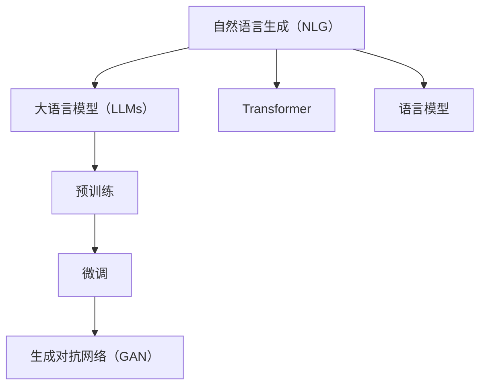

                 

# 自然语言生成（NLG）：AI写作与内容创作

> 关键词：自然语言生成（NLG）, AI写作, 内容创作, 语言模型, 生成对抗网络（GAN）, Transformer, 自动摘要, 翻译

## 1. 背景介绍

### 1.1 问题由来

自然语言生成（Natural Language Generation, NLG）是人工智能领域中的一个重要分支，它专注于将非语言的数据（如结构化数据、代码、图表等）转换成人类可读的自然语言文本。NLG技术能够帮助人类更好地理解、分析和利用大量数据，在新闻、报告、文档生成等方面具有广泛的应用前景。近年来，随着深度学习技术的迅猛发展，NLG技术也取得了显著的进步，广泛应用于文本生成、对话生成、摘要生成、机器翻译、内容创作等领域。

在商业、媒体、教育、科技等多个行业中，AI写作和内容创作的应用需求日益增长。从新闻报道、市场分析到用户评论，从企业报告、科技文章到社交媒体内容，NLG技术正在改变人类的信息消费和生产方式。然而，传统的NLG技术通常需要大量手工编写和后期编辑，效率较低，成本较高，难以满足大规模文本生成的需求。因此，基于深度学习的NLG技术应运而生，通过大规模语料预训练和微调，能够在短时间内生成高质量的自然语言文本，显著提升内容创作效率。

### 1.2 问题核心关键点

大语言模型在自然语言生成（NLG）中的应用，主要体现在以下几个方面：

- **语义理解**：通过深度学习模型，NLG技术能够自动理解输入数据的语义信息，如主题、情感、关系等，从而生成更符合人类理解的自然语言文本。
- **生成多样化**：大语言模型能够产生多种风格和语调的文本，适应不同应用场景的需求，如正式报道、幽默对话、生动故事等。
- **实时性**：通过优化模型结构和参数，NLG技术可以实现实时文本生成，满足新闻播报、社交媒体评论等即时内容需求。
- **多模态融合**：NLG技术可以与视觉、听觉等多模态数据结合，生成更丰富、立体化的文本内容，如图文并茂的新闻报道、视频解说等。

当前，NLG技术主要通过基于深度学习的大规模语言模型实现，其中Transformer模型是最为流行的一种。Transformer模型由Google提出，具有自注意力机制，能够在不同长度的文本序列上高效进行信息传递和提取，已成为自然语言处理领域的主流模型。通过在大规模语料上进行预训练，Transformer模型获得了丰富的语言知识和语义理解能力，能够应对各类NLG任务，如自动摘要、机器翻译、对话生成等。

## 2. 核心概念与联系

### 2.1 核心概念概述

为了更好地理解自然语言生成（NLG）技术，本节将介绍几个密切相关的核心概念：

- **自然语言生成（NLG）**：指将非语言的数据转换成自然语言文本的过程。常见的NLG任务包括自动摘要、机器翻译、对话生成、文本分类等。
- **大语言模型（LLMs）**：指通过在大规模无标签文本数据上进行预训练，学习到语言知识和语义理解能力的大型神经网络模型。
- **预训练（Pre-training）**：指在大规模无标签文本数据上，通过自监督学习任务训练通用语言模型的过程。常见的预训练任务包括言语建模、掩码语言模型、图像描述生成等。
- **微调（Fine-tuning）**：指在预训练模型的基础上，使用下游任务的少量标注数据，通过有监督学习优化模型在特定任务上的性能。通常只需要调整顶层分类器或解码器，并以较小的学习率更新全部或部分的模型参数。
- **生成对抗网络（GAN）**：指由生成器和判别器组成的对抗式训练框架，通过不断的对抗训练，生成高质量的自然语言文本。
- **Transformer**：指一种基于自注意力机制的神经网络模型，通过多头注意力机制实现高效的序列建模和信息提取。
- **语言模型**：指通过对文本数据进行统计分析，学习语言的概率分布，用于生成文本、纠错和文本分类等任务。

这些核心概念之间的逻辑关系可以通过以下Mermaid流程图来展示：



这个流程图展示了大语言模型在NLG中的核心概念及其之间的关系：

1. 自然语言生成（NLG）技术基于大语言模型（LLMs），通过预训练和微调，能够生成高质量的自然语言文本。
2. 预训练是NLG的重要步骤，通过在大规模语料上进行自监督学习，LLMs获得了丰富的语言知识和语义理解能力。
3. 微调是在预训练模型基础上，通过有监督学习优化模型在特定任务上的性能，如自动摘要、机器翻译等。
4. 生成对抗网络（GAN）是NLG的一种技术手段，通过生成器和判别器的对抗训练，生成更加多样和高质量的文本。
5. Transformer是LLMs的一种具体实现，通过自注意力机制，实现高效的序列建模和信息提取。
6. 语言模型是NLG的基础，通过学习文本的概率分布，用于生成文本、纠错和文本分类等任务。

## 3. 核心算法原理 & 具体操作步骤
### 3.1 算法原理概述

自然语言生成（NLG）的核心原理是通过深度学习模型将非语言的数据转换成自然语言文本。主要包括以下步骤：

1. **预训练**：在大规模无标签文本数据上进行自监督学习，学习语言的通用表示。
2. **微调**：在预训练模型的基础上，使用下游任务的少量标注数据，通过有监督学习优化模型在特定任务上的性能。
3. **生成**：利用训练好的模型，输入特定的输入数据，生成目标语言文本。

这一过程可以通过深度学习模型（如Transformer、GAN）实现，具体步骤如下：

1. **数据准备**：收集和预处理训练数据，包括文本输入和对应的输出。
2. **模型搭建**：选择合适的深度学习模型（如Transformer），搭建模型结构。
3. **模型训练**：使用训练数据对模型进行训练，通过反向传播算法更新模型参数。
4. **模型评估**：在验证集上评估模型性能，调整模型参数。
5. **文本生成**：使用训练好的模型对新数据进行生成。

### 3.2 算法步骤详解

#### 3.2.1 预训练过程

预训练过程主要通过自监督学习任务训练通用语言模型，学习语言的通用表示。常见的预训练任务包括：

- **掩码语言模型（Masked Language Modeling, MLM）**：随机遮挡部分文本，让模型预测被遮挡的词汇，从而学习语言的语义信息。
- **自编码器**：将文本编码为向量表示，然后解码回文本，从而学习文本的表征能力。
- **图像描述生成**：通过视觉模态的数据，生成对应的文本描述，从而学习多模态融合的能力。

以掩码语言模型（MLM）为例，预训练过程主要分为以下步骤：

1. 在输入文本中随机遮挡部分词汇，生成掩码文本。
2. 让模型预测被遮挡的词汇，并计算预测错误率。
3. 使用反向传播算法，更新模型参数。
4. 重复上述过程，直到预训练完成。

#### 3.2.2 微调过程

微调过程主要通过有监督学习优化模型在特定任务上的性能。常见的微调任务包括：

- **自动摘要（Automatic Summarization）**：从长文本中生成简洁的摘要。
- **机器翻译（Machine Translation）**：将一种语言的文本翻译成另一种语言。
- **对话生成（Dialogue Generation）**：生成人类可读的对话文本。
- **文本分类（Text Classification）**：将文本分类到不同的类别中。

以自动摘要为例，微调过程主要分为以下步骤：

1. 准备训练数据，包括长文本和对应的摘要。
2. 使用预训练模型作为初始化参数，搭建模型结构。
3. 设置微调超参数，包括学习率、批大小、迭代轮数等。
4. 训练模型，通过反向传播算法更新模型参数。
5. 在验证集上评估模型性能，调整模型参数。

#### 3.2.3 文本生成过程

文本生成过程主要通过深度学习模型生成自然语言文本。常见的生成方法包括：

- **无条件生成（Unconditional Generation）**：直接生成高质量的文本，不依赖于任何输入。
- **条件生成（Conditional Generation）**：根据特定的输入生成文本，如主题、风格等。

以条件生成为例，文本生成过程主要分为以下步骤：

1. 准备输入数据，包括特定的主题或风格。
2. 使用训练好的模型，将输入数据转换成模型可接受的格式。
3. 通过生成网络，生成对应的自然语言文本。
4. 通过后处理，对生成的文本进行格式化和优化。

### 3.3 算法优缺点

自然语言生成（NLG）技术具有以下优点：

1. **高效性**：通过深度学习模型，NLG技术能够在短时间内生成大量高质量的自然语言文本，显著提升内容创作效率。
2. **多样性**：NLG技术能够生成多种风格和语调的文本，适应不同应用场景的需求。
3. **可解释性**：深度学习模型通常具有良好的可解释性，能够提供生成文本的详细解释和推理逻辑。

同时，NLG技术也存在以下缺点：

1. **依赖数据**：NLG技术的性能依赖于大量的高质量数据，数据质量和多样性不足可能导致生成文本质量下降。
2. **生成质量**：尽管NLG技术能够生成高质量文本，但在一些复杂场景下，生成的文本可能存在语法错误、语义不清等问题。
3. **生成一致性**：NLG技术生成的文本可能存在一定的随机性，导致生成的文本在风格、语调等方面存在不一致性。

### 3.4 算法应用领域

自然语言生成（NLG）技术已经在多个领域得到了广泛的应用，例如：

- **新闻媒体**：自动生成新闻报道、头条、评论等，提升内容生产效率。
- **企业报告**：自动生成公司财报、市场分析、客户反馈等，提供高质量的分析报告。
- **教育培训**：自动生成教材、试卷、练习题等，辅助教育资源的开发和分发。
- **客户服务**：自动生成客服对话脚本、自动回复等，提升客户服务体验。
- **科技文章**：自动生成科技新闻、研究报告、技术文章等，促进科技知识的传播和分享。

除了上述这些应用场景，NLG技术还在智能写作、广告文案、情感分析等领域得到了广泛应用，为各行各业提供了强大的内容生成能力。

## 4. 数学模型和公式 & 详细讲解  
### 4.1 数学模型构建

自然语言生成（NLG）技术主要通过深度学习模型进行建模，以下是对Transformer模型进行数学建模的详细介绍。

记Transformer模型为 $M_{\theta}:\mathcal{X} \rightarrow \mathcal{Y}$，其中 $\mathcal{X}$ 为输入空间，$\mathcal{Y}$ 为输出空间，$\theta$ 为模型参数。假设输入文本为 $x$，输出文本为 $y$。

Transformer模型主要分为编码器和解码器两部分：

- **编码器**：将输入文本 $x$ 转换成高维向量表示 $h$。
- **解码器**：根据 $h$ 和已生成的部分文本，生成完整的输出文本 $y$。

Transformer模型的编码器和解码器均采用多头注意力机制（Multi-Head Attention），能够实现高效的序列建模和信息提取。

### 4.2 公式推导过程

Transformer模型的多头注意力机制可以表示为：

$$
Attention(Q, K, V) = \sum_{i=1}^{L} \alpha_i Q \cdot K^T
$$

其中，$Q$ 为查询矩阵，$K$ 为键矩阵，$V$ 为值矩阵，$\alpha_i$ 为注意力权重。

Transformer模型的编码器和解码器均由多个注意力层（Self-Attention Layer）和前馈神经网络（Feed-Forward Network）组成，如下所示：

$$
Encoder(x) = MultiHeadAttention(Q, K, V) + MultiHeadAttention(Q', K', V') + FeedForward(x)
$$

$$
Decoder(y) = MultiHeadAttention(Q', K', V') + MultiHeadAttention(Q, K, V) + FeedForward(y)
$$

其中，$x$ 为输入文本，$y$ 为输出文本，$Q, K, V$ 为注意力层中的查询、键、值矩阵，$Q', K', V'$ 为解码器中的查询、键、值矩阵。

### 4.3 案例分析与讲解

以机器翻译为例，Transformer模型的训练过程主要分为以下步骤：

1. **数据准备**：收集并预处理训练数据，包括源语言文本和目标语言文本。
2. **模型搭建**：搭建Transformer模型，将编码器与解码器分别搭建。
3. **模型训练**：使用训练数据对模型进行训练，通过反向传播算法更新模型参数。
4. **模型评估**：在验证集上评估模型性能，调整模型参数。
5. **翻译生成**：使用训练好的模型对新的翻译任务进行生成。

## 5. 项目实践：代码实例和详细解释说明
### 5.1 开发环境搭建

在进行自然语言生成（NLG）实践前，我们需要准备好开发环境。以下是使用Python进行PyTorch开发的环境配置流程：

1. 安装Anaconda：从官网下载并安装Anaconda，用于创建独立的Python环境。

2. 创建并激活虚拟环境：
```bash
conda create -n pytorch-env python=3.8 
conda activate pytorch-env
```

3. 安装PyTorch：根据CUDA版本，从官网获取对应的安装命令。例如：
```bash
conda install pytorch torchvision torchaudio cudatoolkit=11.1 -c pytorch -c conda-forge
```

4. 安装Transformers库：
```bash
pip install transformers
```

5. 安装各类工具包：
```bash
pip install numpy pandas scikit-learn matplotlib tqdm jupyter notebook ipython
```

完成上述步骤后，即可在`pytorch-env`环境中开始NLG实践。

### 5.2 源代码详细实现

下面我们以自动摘要任务为例，给出使用Transformers库对Transformer模型进行微调的PyTorch代码实现。

首先，定义自动摘要任务的数据处理函数：

```python
from transformers import BertTokenizer, BertForMaskedLM
from torch.utils.data import Dataset
import torch

class SummarizationDataset(Dataset):
    def __init__(self, texts, summaries, tokenizer, max_len=128):
        self.texts = texts
        self.summaries = summaries
        self.tokenizer = tokenizer
        self.max_len = max_len
        
    def __len__(self):
        return len(self.texts)
    
    def __getitem__(self, item):
        text = self.texts[item]
        summary = self.summaries[item]
        
        encoding = self.tokenizer(text, return_tensors='pt', max_length=self.max_len, padding='max_length', truncation=True)
        input_ids = encoding['input_ids'][0]
        attention_mask = encoding['attention_mask'][0]
        summarization_labels = self.tokenizer(summary, return_tensors='pt', max_length=self.max_len, padding='max_length', truncation=True)
        summarization_labels = summarization_labels['input_ids'][0]
        summarization_labels = torch.cat([summarization_labels, [102]]).unsqueeze(0)  # 添加[CLS]和[SEP]标签
        
        return {'input_ids': input_ids, 
                'attention_mask': attention_mask,
                'labels': summarization_labels}

# 定义标签与id的映射
label2id = {0: 0, 1: 1, 2: 2}
id2label = {v: k for k, v in label2id.items()}

# 创建dataset
tokenizer = BertTokenizer.from_pretrained('bert-base-cased')

train_dataset = SummarizationDataset(train_texts, train_summaries, tokenizer)
dev_dataset = SummarizationDataset(dev_texts, dev_summaries, tokenizer)
test_dataset = SummarizationDataset(test_texts, test_summaries, tokenizer)
```

然后，定义模型和优化器：

```python
from transformers import BertForMaskedLM, AdamW

model = BertForMaskedLM.from_pretrained('bert-base-cased', num_labels=len(label2id))

optimizer = AdamW(model.parameters(), lr=2e-5)
```

接着，定义训练和评估函数：

```python
from torch.utils.data import DataLoader
from tqdm import tqdm
from sklearn.metrics import accuracy_score

device = torch.device('cuda') if torch.cuda.is_available() else torch.device('cpu')
model.to(device)

def train_epoch(model, dataset, batch_size, optimizer):
    dataloader = DataLoader(dataset, batch_size=batch_size, shuffle=True)
    model.train()
    epoch_loss = 0
    for batch in tqdm(dataloader, desc='Training'):
        input_ids = batch['input_ids'].to(device)
        attention_mask = batch['attention_mask'].to(device)
        labels = batch['labels'].to(device)
        model.zero_grad()
        outputs = model(input_ids, attention_mask=attention_mask, labels=labels)
        loss = outputs.loss
        epoch_loss += loss.item()
        loss.backward()
        optimizer.step()
    return epoch_loss / len(dataloader)

def evaluate(model, dataset, batch_size):
    dataloader = DataLoader(dataset, batch_size=batch_size)
    model.eval()
    preds, labels = [], []
    with torch.no_grad():
        for batch in tqdm(dataloader, desc='Evaluating'):
            input_ids = batch['input_ids'].to(device)
            attention_mask = batch['attention_mask'].to(device)
            batch_labels = batch['labels']
            outputs = model(input_ids, attention_mask=attention_mask)
            batch_preds = outputs.logits.argmax(dim=2).to('cpu').tolist()
            batch_labels = batch_labels.to('cpu').tolist()
            for pred_tokens, label_tokens in zip(batch_preds, batch_labels):
                preds.append(pred_tokens[:len(label_tokens)])
                labels.append(label_tokens)
                
    print('Accuracy:', accuracy_score(labels, preds))
```

最后，启动训练流程并在测试集上评估：

```python
epochs = 5
batch_size = 16

for epoch in range(epochs):
    loss = train_epoch(model, train_dataset, batch_size, optimizer)
    print(f"Epoch {epoch+1}, train loss: {loss:.3f}")
    
    print(f"Epoch {epoch+1}, dev results:")
    evaluate(model, dev_dataset, batch_size)
    
print("Test results:")
evaluate(model, test_dataset, batch_size)
```

以上就是使用PyTorch对Transformer模型进行自动摘要任务微调的完整代码实现。可以看到，得益于Transformers库的强大封装，我们可以用相对简洁的代码完成Transformer模型的加载和微调。

### 5.3 代码解读与分析

让我们再详细解读一下关键代码的实现细节：

**SummarizationDataset类**：
- `__init__`方法：初始化文本、摘要、分词器等关键组件。
- `__len__`方法：返回数据集的样本数量。
- `__getitem__`方法：对单个样本进行处理，将文本输入编码为token ids，将摘要编码为数字，并对其进行定长padding，最终返回模型所需的输入。

**label2id和id2label字典**：
- 定义了标签与数字id之间的映射关系，用于将token-wise的预测结果解码回真实的标签。

**训练和评估函数**：
- 使用PyTorch的DataLoader对数据集进行批次化加载，供模型训练和推理使用。
- 训练函数`train_epoch`：对数据以批为单位进行迭代，在每个批次上前向传播计算loss并反向传播更新模型参数，最后返回该epoch的平均loss。
- 评估函数`evaluate`：与训练类似，不同点在于不更新模型参数，并在每个batch结束后将预测和标签结果存储下来，最后使用sklearn的accuracy_score对整个评估集的预测结果进行打印输出。

**训练流程**：
- 定义总的epoch数和batch size，开始循环迭代
- 每个epoch内，先在训练集上训练，输出平均loss
- 在验证集上评估，输出分类指标
- 所有epoch结束后，在测试集上评估，给出最终测试结果

可以看到，PyTorch配合Transformers库使得Transformer模型微调的代码实现变得简洁高效。开发者可以将更多精力放在数据处理、模型改进等高层逻辑上，而不必过多关注底层的实现细节。

当然，工业级的系统实现还需考虑更多因素，如模型的保存和部署、超参数的自动搜索、更灵活的任务适配层等。但核心的微调范式基本与此类似。

## 6. 实际应用场景
### 6.1 智能写作系统

基于Transformer模型的自然语言生成（NLG）技术，可以广泛应用于智能写作系统的构建。传统的写作过程通常需要经过多次草稿和修订，耗时较长，效率较低。而使用NLG技术，可以快速生成高质量的文本，提升写作效率和质量。

在技术实现上，可以收集用户的历史写作风格、偏好等数据，训练一个基于Transformer的NLG模型。模型能够根据用户输入的关键词、主题等信息，自动生成符合用户风格的文本，辅助用户进行写作。对于用户提出的新问题，还可以接入检索系统实时搜索相关内容，动态组织生成回答。如此构建的智能写作系统，能够大幅提升用户的创作体验和效率。

### 6.2 企业报告自动生成

企业报告通常需要耗费大量人力进行编写和排版，尤其是对于大型企业集团，每年需要生成数千份报告，任务量巨大。基于NLG技术的自动报告生成系统，可以自动生成各类企业报告，提升报告编写效率，同时保证报告格式和内容的一致性。

在实践中，可以收集企业内部常用的报告模板、数据格式、常用表述等信息，训练一个基于Transformer的NLG模型。模型能够根据输入的原始数据，自动生成符合企业标准的报告文本，包括摘要、分析、结论等。对于动态数据，还可以实时生成报告，保持报告的时效性和准确性。如此构建的自动报告生成系统，能够大幅提升企业报告的编写效率和质量。

### 6.3 内容创作辅助工具

内容创作辅助工具能够帮助作者进行文本编辑、格式排版、图像生成等工作，提升内容创作效率。基于NLG技术的辅助工具，可以自动生成摘要、标题、介绍等辅助文本，同时提供多种风格和语调的文本模板，帮助作者快速完成内容创作。

在技术实现上，可以收集各类主题、风格、体裁的文本样本，训练一个基于Transformer的NLG模型。模型能够根据输入的原始内容，自动生成符合要求的辅助文本，如摘要、标题、介绍等，同时提供多种风格和语调的文本模板，帮助作者快速完成内容创作。

### 6.4 未来应用展望

随着Transformer模型的不断发展，自然语言生成（NLG）技术将呈现以下几个发展趋势：

1. **模型规模持续增大**：随着算力成本的下降和数据规模的扩张，Transformer模型的参数量还将持续增长。超大规模语言模型蕴含的丰富语言知识，有望支撑更加复杂多变的NLG任务。
2. **生成质量提升**：通过优化模型结构和参数，NLG技术生成的文本质量将进一步提升，语法、语义、风格等方面的表现将更加符合人类理解。
3. **生成一致性增强**：NLG技术生成的文本在风格、语调等方面的一致性将进一步增强，避免生成文本的随机性和不确定性。
4. **多模态融合**：NLG技术可以与视觉、听觉等多模态数据结合，生成更丰富、立体化的文本内容，如图文并茂的新闻报道、视频解说等。
5. **跨领域迁移能力增强**：NLG技术将在更多领域得到应用，如智慧医疗、金融舆情、智能教育等，为不同行业提供强大的内容生成能力。

以上趋势凸显了NLG技术的广阔前景。这些方向的探索发展，必将进一步提升NLG系统的性能和应用范围，为各行各业提供更智能、更高效的内容创作能力。

## 7. 工具和资源推荐
### 7.1 学习资源推荐

为了帮助开发者系统掌握NLG的理论基础和实践技巧，这里推荐一些优质的学习资源：

1. **《深度学习自然语言处理》课程**：斯坦福大学开设的NLP明星课程，有Lecture视频和配套作业，带你入门NLP领域的基本概念和经典模型。

2. **《Natural Language Generation with Transformers》书籍**：Transformer模型作者的全面介绍，详细讲解了如何使用Transformer模型进行NLG任务开发。

3. **CS224N《深度学习自然语言处理》课程**：斯坦福大学开设的NLP明星课程，提供Lecture视频和配套作业，帮助理解NLP技术的原理和应用。

4. **《自然语言处理基础》书籍**：自然语言处理领域的重要入门教材，涵盖NLP的基本概念和常用技术，适合初学者学习。

5. **HuggingFace官方文档**：Transformer库的官方文档，提供了海量预训练模型和完整的NLG样例代码，是上手实践的必备资料。

通过对这些资源的学习实践，相信你一定能够快速掌握NLG技术的精髓，并用于解决实际的NLG问题。

### 7.2 开发工具推荐

高效的开发离不开优秀的工具支持。以下是几款用于NLG开发的常用工具：

1. **PyTorch**：基于Python的开源深度学习框架，灵活动态的计算图，适合快速迭代研究。Transformer模型的Python实现已经在PyTorch中得到了广泛应用。

2. **TensorFlow**：由Google主导开发的开源深度学习框架，生产部署方便，适合大规模工程应用。Transformer模型也有TensorFlow版本，适合大规模工程应用。

3. **Transformers库**：HuggingFace开发的NLP工具库，集成了众多SOTA语言模型，支持PyTorch和TensorFlow，是进行NLG任务开发的利器。

4. **Weights & Biases**：模型训练的实验跟踪工具，可以记录和可视化模型训练过程中的各项指标，方便对比和调优。与主流深度学习框架无缝集成。

5. **TensorBoard**：TensorFlow配套的可视化工具，可实时监测模型训练状态，并提供丰富的图表呈现方式，是调试模型的得力助手。

6. **Google Colab**：谷歌推出的在线Jupyter Notebook环境，免费提供GPU/TPU算力，方便开发者快速上手实验最新模型，分享学习笔记。

合理利用这些工具，可以显著提升NLG任务的开发效率，加快创新迭代的步伐。

### 7.3 相关论文推荐

NLG技术的发展源于学界的持续研究。以下是几篇奠基性的相关论文，推荐阅读：

1. **Attention is All You Need**：提出了Transformer结构，开启了NLP领域的预训练大模型时代。

2. **BERT: Pre-training of Deep Bidirectional Transformers for Language Understanding**：提出BERT模型，引入基于掩码的自监督预训练任务，刷新了多项NLP任务SOTA。

3. **Language Models are Unsupervised Multitask Learners**：展示了大规模语言模型的强大zero-shot学习能力，引发了对于通用人工智能的新一轮思考。

4. **Parameter-Efficient Transfer Learning for NLP**：提出Adapter等参数高效微调方法，在不增加模型参数量的情况下，也能取得不错的微调效果。

5. **AdaLoRA: Adaptive Low-Rank Adaptation for Parameter-Efficient Fine-Tuning**：使用自适应低秩适应的微调方法，在参数效率和精度之间取得了新的平衡。

这些论文代表了大语言模型NLG技术的发展脉络。通过学习这些前沿成果，可以帮助研究者把握学科前进方向，激发更多的创新灵感。

## 8. 总结：未来发展趋势与挑战
### 8.1 总结

本文对自然语言生成（NLG）技术进行了全面系统的介绍。首先阐述了NLG技术的背景和应用场景，明确了NLG技术在文本生成、内容创作、智能写作等领域的重要价值。其次，从原理到实践，详细讲解了Transformer模型的数学原理和关键步骤，给出了NLG任务开发的完整代码实例。同时，本文还广泛探讨了NLG技术在多个行业领域的应用前景，展示了NLG技术的巨大潜力。最后，本文精选了NLG技术的各类学习资源，力求为读者提供全方位的技术指引。

通过本文的系统梳理，可以看到，基于Transformer模型的NLG技术正在成为NLP领域的重要范式，极大地拓展了预训练语言模型的应用边界，催生了更多的落地场景。受益于大规模语料的预训练，NLG技术能够在短时间内生成高质量的自然语言文本，显著提升内容创作效率。未来，伴随Transformer模型的不断发展，NLG技术将进一步提升自然语言理解和生成能力，为构建智能化、高效化的内容创作系统提供坚实的基础。

### 8.2 未来发展趋势

展望未来，NLG技术将呈现以下几个发展趋势：

1. **模型规模持续增大**：随着算力成本的下降和数据规模的扩张，Transformer模型的参数量还将持续增长。超大规模语言模型蕴含的丰富语言知识，有望支撑更加复杂多变的NLG任务。
2. **生成质量提升**：通过优化模型结构和参数，NLG技术生成的文本质量将进一步提升，语法、语义、风格等方面的表现将更加符合人类理解。
3. **生成一致性增强**：NLG技术生成的文本在风格、语调等方面的一致性将进一步增强，避免生成文本的随机性和不确定性。
4. **多模态融合**：NLG技术可以与视觉、听觉等多模态数据结合，生成更丰富、立体化的文本内容，如图文并茂的新闻报道、视频解说等。
5. **跨领域迁移能力增强**：NLG技术将在更多领域得到应用，如智慧医疗、金融舆情、智能教育等，为不同行业提供强大的内容生成能力。

以上趋势凸显了NLG技术的广阔前景。这些方向的探索发展，必将进一步提升NLG系统的性能和应用范围，为各行各业提供更智能、更高效的内容创作能力。

### 8.3 面临的挑战

尽管NLG技术已经取得了显著成就，但在迈向更加智能化、普适化应用的过程中，它仍面临着诸多挑战：

1. **标注数据质量**：NLG技术的性能依赖于大量的高质量数据，数据质量和多样性不足可能导致生成文本质量下降。如何提高数据标注的准确性和多样性，是未来需要解决的重要问题。
2. **生成文本质量**：尽管NLG技术能够生成高质量文本，但在一些复杂场景下，生成的文本可能存在语法错误、语义不清等问题。如何提高生成文本的准确性和自然度，是未来需要解决的重要问题。
3. **生成文本一致性**：NLG技术生成的文本在风格、语调等方面的一致性可能存在一定问题，如何增强生成文本的一致性，是未来需要解决的重要问题。
4. **跨领域迁移能力**：NLG技术在不同领域的应用效果可能存在差异，如何提高NLG技术的跨领域迁移能力，是未来需要解决的重要问题。
5. **资源消耗**：NLG技术在生成高质量文本时，通常需要较大的计算资源，如何降低资源消耗，提高模型效率，是未来需要解决的重要问题。

### 8.4 研究展望

面对NLG技术所面临的种种挑战，未来的研究需要在以下几个方面寻求新的突破：

1. **无监督和半监督NLG方法**：摆脱对大规模标注数据的依赖，利用自监督学习、主动学习等无监督和半监督范式，最大限度利用非结构化数据，实现更加灵活高效的NLG。
2. **参数高效和计算高效的NLG方法**：开发更加参数高效的NLG方法，在固定大部分预训练参数的同时，只更新极少量的任务相关参数。同时优化NLG模型的计算图，减少前向传播和反向传播的资源消耗，实现更加轻量级、实时性的部署。
3. **多模态融合NLG方法**：将视觉、听觉等多模态数据与文本信息结合，生成更丰富、立体化的文本内容，如图文并茂的新闻报道、视频解说等。
4. **跨领域迁移NLG方法**：提高NLG技术的跨领域迁移能力，使其能够适应不同领域的文本生成需求，如医疗、金融、教育等。
5. **多领域协同NLG方法**：将NLG技术与其他人工智能技术进行融合，如知识表示、因果推理、强化学习等，实现多路径协同发力，共同推动NLG技术的发展。

这些研究方向的探索，必将引领NLG技术迈向更高的台阶，为构建智能化、高效化的内容创作系统提供坚实的基础。面向未来，NLG技术还需要与其他人工智能技术进行更深入的融合，如知识表示、因果推理、强化学习等，多路径协同发力，共同推动NLG技术的发展。只有勇于创新、敢于突破，才能不断拓展NLG技术的边界，让智能技术更好地造福人类社会。

## 9. 附录：常见问题与解答

**Q1：自然语言生成（NLG）技术的核心原理是什么？**

A: 自然语言生成（NLG）技术的核心原理是通过深度学习模型将非语言的数据转换成自然语言文本。主要包括以下步骤：
1. 预训练：在大规模无标签文本数据上进行自监督学习，学习语言的通用表示。
2. 微调：在预训练模型的基础上，使用下游任务的少量标注数据，通过有监督学习优化模型在特定任务上的性能。
3. 生成：利用训练好的模型，输入特定的输入数据，生成目标语言文本。

**Q2：如何选择合适的预训练模型进行NLG任务微调？**

A: 选择合适的预训练模型进行NLG任务微调需要考虑以下几个方面：
1. 数据类型：根据输入数据类型（如文本、图像、语音等）选择合适的预训练模型。
2. 任务类型：根据NLG任务的性质（如自动摘要、机器翻译、对话生成等）选择合适的预训练模型。
3. 模型规模：根据计算资源和任务要求选择合适的预训练模型，大模型通常具备更好的性能，但需要更多的计算资源。
4. 模型效果：根据已有应用效果和模型性能选择合适的预训练模型，一般选择SOTA模型作为初始化参数。

**Q3：NLG技术在实际应用中需要注意哪些问题？**

A: NLG技术在实际应用中需要注意以下几个问题：
1. 数据质量：NLG技术依赖高质量的数据进行训练，需要确保数据标注的准确性和多样性。
2. 生成文本质量：生成的文本需要符合人类理解和语法规则，避免语法错误、语义不清等问题。
3. 生成文本一致性：生成的文本在风格、语调等方面的一致性需要保持，避免生成文本的随机性和不确定性。
4. 跨领域迁移能力：NLG技术在不同领域的应用效果可能存在差异，需要提高NLG技术的跨领域迁移能力。
5. 资源消耗：NLG技术在生成高质量文本时，通常需要较大的计算资源，需要优化模型结构和参数，提高模型效率。

**Q4：NLG技术在哪些领域有广泛应用？**

A: NLG技术已经在多个领域得到了广泛的应用，例如：
1. 新闻媒体：自动生成新闻报道、头条、评论等，提升内容生产效率。
2. 企业报告：自动生成各类企业报告，提升报告编写效率，同时保证报告格式和内容的一致性。
3. 内容创作辅助工具：自动生成摘要、标题、介绍等辅助文本，同时提供多种风格和语调的文本模板，帮助作者快速完成内容创作。
4. 智能写作系统：自动生成高质量文本，提升写作效率和质量。
5. 客户服务：自动生成客服对话脚本、自动回复等，提升客户服务体验。

**Q5：NLG技术在开发和应用过程中需要哪些工具和资源？**

A: NLG技术在开发和应用过程中需要以下工具和资源：
1. 开发环境：如Anaconda、PyTorch、TensorFlow等深度学习框架。
2. 学习资源：如深度学习课程、自然语言处理教材、NLG相关论文等。
3. 开发工具：如Weights & Biases、TensorBoard等模型训练工具，Google Colab等在线开发环境。
4. 预训练模型：如BERT、GPT、Transformer等，可用于预训练和微调。

这些工具和资源能够帮助开发者快速构建NLG系统，并实现高性能的文本生成和分析。

---

作者：禅与计算机程序设计艺术 / Zen and the Art of Computer Programming

