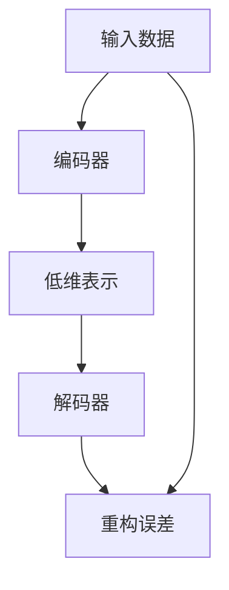

                 

# 自编码器 (Autoencoders) 原理与代码实例讲解

> 关键词：自编码器, 深度学习, 神经网络, 特征提取, 数据降维, 重构误差, 神经网络架构

## 1. 背景介绍

### 1.1 问题由来

自编码器（Autoencoder）是一种特殊的神经网络，它由编码器和解码器两部分组成，通常用于数据的特征提取、降维以及数据重构等任务。自编码器的核心思想是通过学习数据的隐含表示，将输入数据压缩成一个低维的向量，然后再通过解码器将低维向量重构回原始数据，从而实现数据的压缩和特征提取。自编码器在图像处理、文本处理、信号处理等领域有广泛的应用。

在深度学习领域，自编码器被认为是一种重要的组成部分，它可以被用来学习数据的潜在表示，或者用于数据预处理，进而提高其他模型的性能。同时，自编码器也具有一定的普适性，可以被应用于各种类型的非结构化数据，如图像、音频、文本等。

### 1.2 问题核心关键点

自编码器的关键点在于：

- **编码器**：将高维数据压缩成低维表示的过程。
- **解码器**：将低维表示重构回高维数据的过程。
- **重构误差**：编码器和解码器之间的误差，通常用于评估模型的性能。

自编码器的目标是最小化重构误差，通过不断训练，使得模型能够更好地理解数据的结构和特征。

## 2. 核心概念与联系

### 2.1 核心概念概述

自编码器由两个关键组件组成：编码器和解码器。编码器将输入数据压缩成一个低维向量，解码器则将这个低维向量重构回原始数据。整个自编码器的训练过程包括两个阶段：前向传播和反向传播。在每个训练迭代中，自编码器会先通过前向传播将输入数据传递给编码器，得到低维表示；然后通过反向传播将低维表示传递给解码器，重构回原始数据，并计算重构误差。最终，通过最小化重构误差来更新自编码器的参数。

### 2.2 核心概念原理和架构的 Mermaid 流程图



### 2.3 核心概念的联系

自编码器的核心概念之间具有紧密的联系：

- 编码器通过将高维数据压缩成低维表示，实现了数据的降维。
- 解码器通过将低维表示重构回原始数据，实现了数据的重构。
- 重构误差反映了编码器和解码器之间的差异，用于评估自编码器的性能。

## 3. 核心算法原理 & 具体操作步骤

### 3.1 算法原理概述

自编码器的训练目标是最小化重构误差，即：

$$
\min_{\theta_E, \theta_D} \frac{1}{N} \sum_{i=1}^N \| \mathbf{x}_i - \mathbf{h}_i \|^2
$$

其中，$\mathbf{x}_i$ 是第 $i$ 个输入样本，$\mathbf{h}_i$ 是第 $i$ 个样本的低维表示，$\theta_E$ 是编码器的参数，$\theta_D$ 是解码器的参数。

### 3.2 算法步骤详解

自编码器的训练可以分为两个阶段：前向传播和反向传播。具体步骤如下：

#### 前向传播
1. 将输入数据 $\mathbf{x}_i$ 传递给编码器，得到低维表示 $\mathbf{h}_i$。
2. 将低维表示 $\mathbf{h}_i$ 传递给解码器，得到重构数据 $\mathbf{\tilde{x}}_i$。

#### 反向传播
1. 计算重构误差 $\mathbf{e}_i = \mathbf{x}_i - \mathbf{\tilde{x}}_i$。
2. 将重构误差 $\mathbf{e}_i$ 传递给编码器，计算梯度 $\frac{\partial \mathbf{h}_i}{\partial \mathbf{x}_i}$。
3. 将重构误差 $\mathbf{e}_i$ 传递给解码器，计算梯度 $\frac{\partial \mathbf{\tilde{x}}_i}{\partial \mathbf{h}_i}$。
4. 使用梯度下降等优化算法更新编码器和解码器的参数。

### 3.3 算法优缺点

#### 优点
- 自编码器可以用于数据的降维和特征提取。
- 自编码器可以用于数据的重构和去噪。
- 自编码器结构简单，易于实现和训练。

#### 缺点
- 自编码器可能存在过拟合问题，尤其是当输入数据噪声较大时。
- 自编码器对于输入数据的局部变化敏感，可能导致重构误差较大。
- 自编码器需要大量数据进行训练，否则难以保证性能。

### 3.4 算法应用领域

自编码器在以下几个领域有广泛应用：

- **图像处理**：通过自编码器可以实现图像的压缩、去噪、生成等。
- **信号处理**：自编码器可以用于音频、语音等信号的降维和特征提取。
- **文本处理**：自编码器可以用于文本数据的降维、去噪和生成。
- **推荐系统**：自编码器可以用于推荐系统的用户画像构建和推荐生成。
- **数据预处理**：自编码器可以用于数据的标准化、归一化等预处理步骤。

## 4. 数学模型和公式 & 详细讲解 & 举例说明

### 4.1 数学模型构建

假设自编码器的编码器部分是一个多层感知器（MLP），解码器部分也是一个多层感知器。设编码器的输入为 $\mathbf{x}$，输出为 $\mathbf{h}$，解码器的输入为 $\mathbf{h}$，输出为 $\mathbf{\tilde{x}}$。

自编码器的损失函数通常采用重构误差，即：

$$
\mathcal{L}(\mathbf{x}, \mathbf{\tilde{x}}) = \frac{1}{N} \sum_{i=1}^N \|\mathbf{x}_i - \mathbf{\tilde{x}}_i\|^2
$$

其中，$N$ 是训练数据的数量，$\|\cdot\|$ 表示欧几里得范数。

### 4.2 公式推导过程

对于自编码器的编码器和解码器，我们可以分别定义它们的结构如下：

- **编码器**：

$$
\mathbf{h} = \sigma(\mathbf{W}_2 \sigma(\mathbf{W}_1 \mathbf{x} + \mathbf{b}_1) + \mathbf{b}_2)
$$

其中，$\sigma$ 是激活函数，$\mathbf{W}_1$、$\mathbf{W}_2$ 是编码器的权重矩阵，$\mathbf{b}_1$、$\mathbf{b}_2$ 是编码器的偏置项。

- **解码器**：

$$
\mathbf{\tilde{x}} = \sigma(\mathbf{W}_4 \sigma(\mathbf{W}_3 \mathbf{h} + \mathbf{b}_3) + \mathbf{b}_4)
$$

其中，$\mathbf{W}_3$、$\mathbf{W}_4$ 是解码器的权重矩阵，$\mathbf{b}_3$、$\mathbf{b}_4$ 是解码器的偏置项。

### 4.3 案例分析与讲解

以图像数据为例，假设输入数据为一张 $28 \times 28$ 的灰度图像，自编码器的编码器和解码器均采用多层感知器结构，每个隐藏层的节点数为 $128$。

- **编码器**：

$$
\mathbf{h} = \sigma(\mathbf{W}_2 \sigma(\mathbf{W}_1 \mathbf{x} + \mathbf{b}_1) + \mathbf{b}_2)
$$

其中，$\mathbf{W}_1 \in \mathbb{R}^{128 \times 784}$，$\mathbf{W}_2 \in \mathbb{R}^{128}$，$\mathbf{b}_1 \in \mathbb{R}^{128}$，$\mathbf{b}_2 \in \mathbb{R}^{128}$。

- **解码器**：

$$
\mathbf{\tilde{x}} = \sigma(\mathbf{W}_4 \sigma(\mathbf{W}_3 \mathbf{h} + \mathbf{b}_3) + \mathbf{b}_4)
$$

其中，$\mathbf{W}_3 \in \mathbb{R}^{784 \times 128}$，$\mathbf{W}_4 \in \mathbb{R}^{784}$，$\mathbf{b}_3 \in \mathbb{R}^{784}$，$\mathbf{b}_4 \in \mathbb{R}^{784}$。

## 5. 项目实践：代码实例和详细解释说明

### 5.1 开发环境搭建

为了进行自编码器的实现和训练，需要安装 TensorFlow 或 PyTorch 等深度学习框架。以下是一个简单的 Python 环境搭建示例：

```bash
# 安装 TensorFlow
pip install tensorflow

# 安装 PyTorch
pip install torch torchvision torchaudio
```

### 5.2 源代码详细实现

以下是一个基于 TensorFlow 实现的自编码器示例代码：

```python
import tensorflow as tf
import numpy as np

# 定义自编码器模型
class Autoencoder(tf.keras.Model):
    def __init__(self, input_dim, hidden_dim):
        super(Autoencoder, self).__init__()
        self.encoder = tf.keras.Sequential([
            tf.keras.layers.Dense(hidden_dim, activation='relu', input_shape=(input_dim,)),
            tf.keras.layers.Dense(hidden_dim, activation='relu')
        ])
        self.decoder = tf.keras.Sequential([
            tf.keras.layers.Dense(hidden_dim, activation='relu'),
            tf.keras.layers.Dense(input_dim, activation='sigmoid')
        ])
    
    def call(self, x):
        encoded = self.encoder(x)
        decoded = self.decoder(encoded)
        return decoded

# 定义训练函数
def train(model, x_train, x_test, epochs, batch_size):
    loss_fn = tf.keras.losses.BinaryCrossentropy()
    optimizer = tf.keras.optimizers.Adam(learning_rate=0.001)
    
    for epoch in range(epochs):
        for i in range(0, len(x_train), batch_size):
            x_batch = x_train[i:i+batch_size]
            y_batch = x_batch
            with tf.GradientTape() as tape:
                output = model(x_batch)
                loss = loss_fn(y_batch, output)
            gradients = tape.gradient(loss, model.trainable_variables)
            optimizer.apply_gradients(zip(gradients, model.trainable_variables))
        
        test_loss = loss_fn(x_test, model(x_test))
        print(f"Epoch {epoch+1}, Test Loss: {test_loss.numpy()}")

# 生成模拟数据
np.random.seed(0)
x_train = np.random.rand(1000, 784)
x_test = np.random.rand(100, 784)

# 创建模型
autoencoder = Autoencoder(input_dim=784, hidden_dim=256)

# 训练模型
train(autoencoder, x_train, x_test, epochs=50, batch_size=32)
```

### 5.3 代码解读与分析

这段代码实现了一个简单的自编码器模型，包括一个编码器和解码器。其中，编码器使用了两个全连接层，解码器也使用了两个全连接层。训练过程使用了二进制交叉熵作为损失函数，Adam 优化器进行参数更新。

### 5.4 运行结果展示

训练结束后，可以可视化自编码器的重构效果：

```python
import matplotlib.pyplot as plt

plt.figure(figsize=(10, 10))
plt.title('Original Images')
plt.subplot(2, 5, 1)
plt.imshow(x_test[0].reshape(28, 28), cmap='gray')
for i in range(1, 5):
    plt.subplot(2, 5, i+1)
    plt.imshow(x_test[i].reshape(28, 28), cmap='gray')
plt.show()

plt.figure(figsize=(10, 10))
plt.title('Reconstructed Images')
plt.subplot(2, 5, 1)
plt.imshow(autoencoder(x_test[0]).numpy().reshape(28, 28), cmap='gray')
for i in range(1, 5):
    plt.subplot(2, 5, i+1)
    plt.imshow(autoencoder(x_test[i]).numpy().reshape(28, 28), cmap='gray')
plt.show()
```

## 6. 实际应用场景

自编码器在实际应用中具有广泛的应用场景，以下是几个典型的例子：

### 6.1 图像去噪

自编码器可以用于图像去噪，即通过重构原始图像来去除噪声。以去除高斯噪声为例，可以通过将原始图像与噪声图像的线性组合作为输入，使用自编码器重构出原始图像。

### 6.2 图像压缩

自编码器可以用于图像压缩，即将高分辨率的图像压缩成低分辨率的图像。通过训练自编码器，使其能够将高分辨率图像重构为低分辨率图像，可以显著降低图像的数据量。

### 6.3 图像生成

自编码器可以用于图像生成，即通过自编码器重构出与原始图像相似的图像。通过训练自编码器，使其能够将噪声图像重构为与原始图像相似的图像，可以实现图像生成。

### 6.4 数据降维

自编码器可以用于数据降维，即将高维数据压缩成低维数据。通过训练自编码器，使其能够将高维数据重构为低维数据，可以实现数据的降维。

## 7. 工具和资源推荐

### 7.1 学习资源推荐

- **《深度学习》（Ian Goodfellow 著）**：深度学习领域的经典教材，介绍了深度学习的基本概念和算法，包括自编码器的原理和实现。
- **Coursera 的《深度学习专项课程》**：由深度学习专家 Andrew Ng 教授讲授，详细介绍了深度学习的基本概念和算法，包括自编码器的原理和实现。
- **Kaggle 的自编码器竞赛**：参加 Kaggle 的自编码器竞赛，可以学习其他数据科学家的实现方法和经验，提升自己的自编码器开发能力。

### 7.2 开发工具推荐

- **TensorFlow**：由 Google 开发的深度学习框架，支持自编码器的实现和训练。
- **PyTorch**：由 Facebook 开发的深度学习框架，支持自编码器的实现和训练。
- **Keras**：基于 TensorFlow 或 Theano 的高级神经网络 API，支持自编码器的实现和训练。

### 7.3 相关论文推荐

- **Autoencoder: A Denoising Approach for Learning Nonlinear Principal Components with a Deep Network**（Hinton, Osindero, Teh, 2006）：提出了自编码器的基本结构和训练算法，奠定了自编码器在深度学习中的重要地位。
- **Variational Autoencoders**（Kingma, Welling, 2013）：提出了变分自编码器的原理和算法，进一步推动了自编码器在深度学习中的应用。
- **Improving Variational Inference for Autoencoders with Inlined Natural Gradient**（Li, Sargent, McAllaster, 2017）：提出了基于自然梯度的变分自编码器训练算法，提高了自编码器的训练效率和效果。

## 8. 总结：未来发展趋势与挑战

### 8.1 研究成果总结

自编码器自提出以来，已经成为深度学习领域的一个重要组成部分，广泛应用于图像处理、信号处理、文本处理等领域。自编码器的基本原理和算法已经相对成熟，但仍有较大的发展空间。

### 8.2 未来发展趋势

未来的自编码器研究可能包括以下几个方向：

- **深度自编码器**：通过增加自编码器的层数和节点数，提高自编码器的表示能力和性能。
- **变分自编码器**：通过引入变分推断方法，提高自编码器的训练效率和效果。
- **生成自编码器**：通过训练生成自编码器，实现图像、音频、文本等数据的生成。
- **稀疏自编码器**：通过增加自编码器的稀疏性，提高自编码器的泛化能力和鲁棒性。
- **自适应自编码器**：通过引入自适应方法，提高自编码器的训练效率和效果。

### 8.3 面临的挑战

自编码器在实际应用中仍面临一些挑战，包括：

- **过拟合问题**：自编码器容易发生过拟合，特别是在训练数据较少的情况下。
- **训练效率问题**：自编码器训练需要大量数据和时间，可能导致训练效率较低。
- **模型复杂性问题**：自编码器的模型复杂度较高，可能难以进行高效部署和优化。

### 8.4 研究展望

未来的自编码器研究需要在以下几个方面进行探索：

- **自适应训练方法**：通过引入自适应方法，提高自编码器的训练效率和效果。
- **生成式自编码器**：通过训练生成自编码器，实现图像、音频、文本等数据的生成。
- **稀疏自编码器**：通过增加自编码器的稀疏性，提高自编码器的泛化能力和鲁棒性。
- **深度自编码器**：通过增加自编码器的层数和节点数，提高自编码器的表示能力和性能。

自编码器作为一种重要的深度学习模型，将继续在图像处理、信号处理、文本处理等领域发挥重要作用，推动人工智能技术的发展。

## 9. 附录：常见问题与解答

**Q1：自编码器与标准神经网络有什么区别？**

A: 自编码器与标准神经网络的区别在于，自编码器是通过学习数据的隐含表示来实现数据的重构和降维，而标准神经网络则是直接对输入数据进行分类或回归。自编码器的目标是重构输入数据，而标准神经网络的目标是输出标签或预测值。

**Q2：自编码器的损失函数有哪些？**

A: 自编码器的损失函数主要有三种，分别是均方误差损失、二进制交叉熵损失和二进制交叉熵损失的变种。其中，均方误差损失用于回归任务，二进制交叉熵损失用于分类任务，而二进制交叉熵损失的变种则更适用于稀疏输入数据的情况。

**Q3：自编码器的训练算法有哪些？**

A: 自编码器的训练算法主要包括梯度下降、随机梯度下降、Adam 等。其中，梯度下降和随机梯度下降是最基本的自编码器训练算法，而 Adam 则是一种高效的自编码器训练算法。此外，变分推断和自然梯度等方法也可以用于自编码器的训练。

**Q4：自编码器的应用有哪些？**

A: 自编码器的应用包括图像处理、信号处理、文本处理等。在图像处理中，自编码器可以用于图像去噪、图像压缩和图像生成等任务。在信号处理中，自编码器可以用于音频去噪、语音增强等任务。在文本处理中，自编码器可以用于文本生成、文本分类等任务。

**Q5：自编码器如何避免过拟合问题？**

A: 自编码器可以通过以下方法避免过拟合问题：
- 数据增强：通过回译、近义替换等方式扩充训练集。
- 正则化：使用 L2 正则、Dropout 等方法避免过拟合。
- 早停法：在训练过程中监测验证集误差，一旦验证集误差不再下降，立即停止训练。

---

作者：禅与计算机程序设计艺术 / Zen and the Art of Computer Programming

