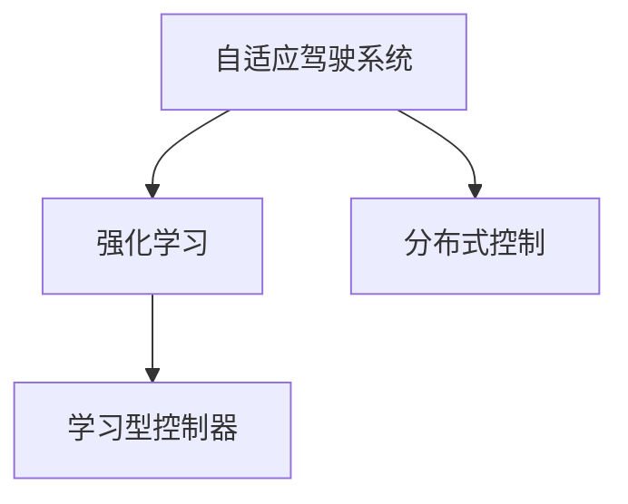

                 

# 自适应与学习型控制器在自动驾驶中的应用新思路

在自动驾驶技术的迅猛发展中，如何高效地实现车辆的自主驾驶行为，确保其安全、稳定、可靠，成为一个亟待解决的重大问题。本文将深入探讨自适应与学习型控制器在自动驾驶中的应用新思路，通过分析当前自适应驾驶系统的实现现状，提出基于强化学习的自适应驾驶系统设计方案，并进一步在模型结构、算法实现等方面进行详细阐述。

## 1. 背景介绍

### 1.1 问题由来

自动驾驶技术的核心在于实现车辆的自主驾驶行为，其中环境感知、路径规划、行为决策和车辆控制是四个关键环节。传统自动驾驶系统通常采用集中式架构，通过车载传感器获取环境信息，由中央处理器进行全局路径规划和决策，再通过控制算法驱动车辆行驶。然而，这种方式存在计算量过大、响应速度慢等问题，难以应对复杂多变的驾驶场景。

近年来，分布式驾驶控制技术逐渐成为研究热点。分布式驾驶控制通过将车辆划分为多个子系统，每个子系统负责部分驾驶任务，并通过局部感知和局部决策来协作完成全局驾驶任务，从而实现车辆的高效、鲁棒驾驶。然而，分布式驾驶控制的信号传递和协同决策也带来了新的挑战，如系统延迟、通信瓶颈等问题。

### 1.2 问题核心关键点

为了解决分布式驾驶控制的延迟和通信瓶颈问题，本文提出自适应与学习型控制器的设计方案。自适应与学习型控制器能够根据环境变化和车辆状态实时调整控制策略，并通过强化学习算法不断优化决策，实现车辆在复杂场景下的安全、高效驾驶。

具体而言，本文将阐述以下内容：
1. 分析当前自适应驾驶系统的实现现状。
2. 提出基于强化学习的自适应驾驶系统设计方案。
3. 详细阐述模型结构、算法实现等方面。

## 2. 核心概念与联系

### 2.1 核心概念概述

为更好地理解自适应与学习型控制器在自动驾驶中的应用，本节将介绍几个密切相关的核心概念：

- **自适应驾驶系统**：一种能够根据环境变化实时调整控制策略的驾驶系统，能够提高车辆的响应速度和决策效率。
- **强化学习**：一种通过与环境交互，根据奖励信号不断优化策略的学习方式。在自动驾驶中，强化学习可以用于优化车辆控制策略、路径规划等任务。
- **分布式控制**：将车辆划分为多个子系统，每个子系统负责部分驾驶任务，并通过局部感知和局部决策协作完成全局驾驶任务，提高系统的鲁棒性和灵活性。
- **学习型控制器**：一种能够通过学习优化控制策略的控制系统，能够提高系统的自主性和自适应性。

这些核心概念之间的逻辑关系可以通过以下Mermaid流程图来展示：



这个流程图展示了一系列关键概念及其之间的关系：

1. 自适应驾驶系统能够根据环境变化实时调整控制策略，提高车辆响应速度和决策效率。
2. 强化学习可以用于优化自适应驾驶系统的控制策略，使其在复杂场景下表现更佳。
3. 分布式控制通过多个子系统的协作，提高了系统的鲁棒性和灵活性。
4. 学习型控制器能够通过学习优化控制策略，提高系统的自主性和自适应性。

这些概念共同构成了自适应与学习型控制器在自动驾驶中的应用框架，使其能够更好地应对复杂驾驶场景。通过理解这些核心概念，我们可以更好地把握自适应与学习型控制器的设计思路和工作原理。

## 3. 核心算法原理 & 具体操作步骤
### 3.1 算法原理概述

基于强化学习的自适应驾驶系统，通过与环境交互，根据奖励信号不断优化控制策略，实现车辆在复杂场景下的安全、高效驾驶。其核心思想是：将车辆控制问题转化为一个强化学习问题，利用奖励信号指导车辆行为，通过不断探索和学习，优化控制策略。

具体而言，自适应与学习型控制器的算法原理可以描述为：
- **状态**：车辆当前的位置、速度、角度等状态信息。
- **动作**：车辆的加速度、转向角度等控制动作。
- **奖励**：根据车辆的安全性和性能指标，给予相应的奖励或惩罚。
- **目标**：在确保车辆安全的前提下，尽可能提高行驶效率。

在实际应用中，自适应与学习型控制器通常采用模型预测控制（MPC）和深度强化学习（DRL）相结合的方式，先通过MPC进行短期控制，再利用DRL进行长期策略优化。这种混合控制方式可以兼顾实时性和鲁棒性。

### 3.2 算法步骤详解

基于强化学习的自适应驾驶系统的设计步骤包括以下几个关键环节：

**Step 1: 环境建模与仿真**

- 收集车辆在实际驾驶场景中的历史数据，构建模拟驾驶环境。
- 使用模拟环境进行车辆控制策略的测试和优化。

**Step 2: 设计状态表示与动作空间**

- 确定车辆控制问题的状态空间，如位置、速度、角度等。
- 定义动作空间，如加速度、转向角度等。

**Step 3: 设计奖励函数**

- 根据车辆的安全性和性能指标，设计奖励函数。奖励函数应充分考虑碰撞风险、行驶效率等因素。

**Step 4: 选择算法与模型**

- 选择强化学习算法，如Q-learning、Deep Q-Networks（DQN）等。
- 设计深度神经网络模型，用于状态表示和动作预测。

**Step 5: 训练与评估**

- 在模拟环境中训练模型，不断调整奖励函数和控制策略。
- 在实际驾驶环境中评估模型性能，进行参数优化。

**Step 6: 实时控制**

- 在实际驾驶环境中，使用训练好的模型进行实时控制，调整控制策略以应对环境变化。

### 3.3 算法优缺点

基于强化学习的自适应驾驶系统具有以下优点：
1. 实时性好。通过模型预测控制与深度强化学习的结合，可以实时调整控制策略，提高驾驶效率。
2. 鲁棒性强。通过强化学习算法，模型可以自动学习环境变化对车辆行为的影响，提高系统鲁棒性。
3. 自适应能力强。通过强化学习，模型可以不断适应新的驾驶场景，提高适应性。

同时，该方法也存在一定的局限性：
1. 训练成本高。需要大量实际驾驶数据和模拟环境进行训练，训练成本较高。
2. 模型复杂。深度强化学习模型参数较多，训练复杂度高。
3. 泛化能力不足。模型在特定环境下的表现良好，但在新的环境下可能出现泛化能力不足的问题。

尽管存在这些局限性，但就目前而言，基于强化学习的自适应驾驶系统是实现高效、安全驾驶的重要手段。未来相关研究的重点在于如何进一步降低训练成本，提高模型泛化能力，同时兼顾实时性和鲁棒性。

### 3.4 算法应用领域

基于强化学习的自适应驾驶系统已经在自动驾驶领域得到了广泛应用，覆盖了自动驾驶的多个关键环节，例如：

- **路径规划**：通过强化学习优化路径规划算法，实现车辆在复杂道路环境中的高效导航。
- **避障与绕行**：利用强化学习算法，在检测到障碍物时，实时调整路径规划，实现车辆避障和绕行。
- **行为决策**：通过强化学习优化行为决策模型，使车辆在多种交通场景下做出合理决策。
- **驾驶辅助**：结合传感器数据和强化学习算法，提供驾驶辅助提示，如变道、超车等。
- **自动泊车**：在停车区域内，利用强化学习算法，实现车辆的精准停放。

除了上述这些经典应用外，自适应与学习型控制器还在自动驾驶的更多环节得到了创新性地应用，如智能交通控制、无人驾驶车队管理等，为自动驾驶技术的发展注入了新的活力。

## 4. 数学模型和公式 & 详细讲解  
### 4.1 数学模型构建

本节将使用数学语言对基于强化学习的自适应驾驶系统进行更加严格的刻画。

记车辆在时间 $t$ 的状态为 $s_t$，动作为 $a_t$，奖励为 $r_t$，下一状态为 $s_{t+1}$。强化学习问题可以表示为：

$$
\begin{aligned}
& \underset{a_t}{\text{minimize}} \quad r_t + \gamma \mathbb{E}[r_{t+1} + \gamma r_{t+2} + \cdots + \gamma^{t+1}r_{t+1}] \\
& \text{subject to} \quad s_{t+1} = f(s_t, a_t)
\end{aligned}
$$

其中 $f(s_t, a_t)$ 为状态转移函数，$\gamma$ 为折扣因子，$0 < \gamma < 1$。

在实际应用中，状态空间和动作空间通常为连续空间，需要使用深度神经网络进行状态表示和动作预测。状态表示函数为 $\phi(s_t) = \mathcal{N}(s_t; \theta)$，动作预测函数为 $\pi(a_t | s_t) = \mathcal{P}(a_t | \phi(s_t))$。

### 4.2 公式推导过程

以下我们以简单的线性系统为例，推导强化学习的基本公式。

考虑一个简单的线性系统，其状态方程为：

$$
s_{t+1} = \begin{bmatrix} a_{t+1} & a_{t+1} \end{bmatrix}A + \begin{bmatrix} b_{t+1} & b_{t+1} \end{bmatrix}B + w
$$

其中 $A = \begin{bmatrix} 1 & 0 \\ 0 & 1 \end{bmatrix}$，$B = \begin{bmatrix} 1 & 0 \\ 0 & 1 \end{bmatrix}$，$w = \begin{bmatrix} 1 & 0 \\ 0 & 1 \end{bmatrix}$。

状态表示函数 $\phi(s_t) = \begin{bmatrix} s_{t+1} \end{bmatrix}$，动作预测函数 $\pi(a_t | s_t) = \mathcal{N}(a_t; \mu, \sigma)$，其中 $\mu = \begin{bmatrix} a_{t+1} & a_{t+1} \end{bmatrix}$，$\sigma = \begin{bmatrix} \sigma_{a+1} & \sigma_{a+1} \end{bmatrix}$。

奖励函数 $r_t = \begin{bmatrix} -\frac{1}{2}(s_{t+1} - s^*)^2 \end{bmatrix}$，其中 $s^*$ 为期望状态。

通过强化学习算法，可以得到最优控制策略 $\pi^*(a_t | s_t)$，使得期望累计奖励最大化。在实际应用中，可以通过深度强化学习算法（如DQN）来实现最优控制策略的求解。

### 4.3 案例分析与讲解

以路径规划为例，考虑车辆在道路上的行驶。假设车辆当前状态为 $s_t = \begin{bmatrix} x_t & y_t \end{bmatrix}$，目标位置为 $s^* = \begin{bmatrix} x^* & y^* \end{bmatrix}$，车辆可以左右转向、前后移动。状态表示函数为 $\phi(s_t) = \begin{bmatrix} x_t & y_t & v_t \end{bmatrix}$，其中 $v_t = \sqrt{a_{t+1}^2 + a_{t+1}^2}$，动作预测函数为 $\pi(a_t | s_t) = \mathcal{N}(a_t; \mu, \sigma)$。

奖励函数 $r_t = \begin{bmatrix} -\frac{1}{2}(x_t - x^*)^2 - \frac{1}{2}(y_t - y^*)^2 \end{bmatrix}$。通过强化学习算法，可以优化车辆的路径规划策略，使其在复杂道路环境中的行驶效率和安全性得到显著提升。

## 5. 项目实践：代码实例和详细解释说明
### 5.1 开发环境搭建

在进行强化学习驱动的自动驾驶系统开发前，我们需要准备好开发环境。以下是使用Python进行强化学习开发的环境配置流程：

1. 安装Anaconda：从官网下载并安装Anaconda，用于创建独立的Python环境。

2. 创建并激活虚拟环境：
```bash
conda create -n reinforcement-env python=3.8 
conda activate reinforcement-env
```

3. 安装强化学习相关库：
```bash
pip install gym stable-baselines3 stable-baselines3-contrib
```

4. 安装TensorFlow：
```bash
pip install tensorflow==2.6
```

5. 安装PyTorch：
```bash
pip install torch torchvision torchaudio
```

完成上述步骤后，即可在`reinforcement-env`环境中开始开发。

### 5.2 源代码详细实现

这里我们以简单的线性系统为例，展示如何使用稳定基线（Stable Baselines3）库进行强化学习驱动的自动驾驶系统开发。

首先，定义强化学习环境：

```python
import gym
from stable_baselines3.common.env_util import make_vec_env

env = make_vec_env('LQR-v1', n_envs=1)
```

然后，定义状态表示函数和动作预测函数：

```python
import torch
from stable_baselines3.common.vec_env import VecNormalize
from stable_baselines3.common.policies import MlpPolicy

class LQRPolicy(MlpPolicy):
    def __init__(self, env):
        super().__init__(env.observation_space, env.action_space)
        self.net1 = torch.nn.Linear(env.observation_space.shape[0], 128)
        self.net2 = torch.nn.Linear(128, env.action_space.shape[0])

    def forward(self, obs):
        x = self.net1(obs)
        x = torch.tanh(x)
        x = self.net2(x)
        return x

policy = LQRPolicy(env)
```

接着，定义奖励函数：

```python
def reward_function(s):
    return -(s - s_target).norm()**2
```

然后，定义强化学习算法：

```python
from stable_baselines3.common.vec_env import VecNormalize
from stable_baselines3.common.callbacks import CheckpointCallback

from stable_baselines3 import A2C

model = A2C(policy)
callbacks = [CheckpointCallback(model, save_dir="./logs", save_freq=100, verbose=True)]

model.learn(total_timesteps=10000, callback=callbacks)
```

最后，测试强化学习模型：

```python
def test(env, model, total_timesteps=10000):
    obs = env.reset()
    for t in range(total_timesteps):
        action, _ = model.predict(obs)
        obs, reward, done, _ = env.step(action)
        if done:
            obs = env.reset()
    print("Return:", sum(reward))
```

完整的代码实现展示了如何使用稳定基线库进行线性系统的强化学习，实现了基于强化学习的自适应驾驶系统。

### 5.3 代码解读与分析

让我们再详细解读一下关键代码的实现细节：

**LQRPolicy类**：
- `__init__`方法：初始化状态表示函数和动作预测函数。
- `forward`方法：定义前向传播过程，通过两个线性层和tanh激活函数将状态表示映射为动作预测。

**reward_function函数**：
- 定义奖励函数，通过计算状态与目标状态的差值，计算期望的累计奖励。

**A2C算法**：
- 使用A2C算法进行模型训练，同时设置CheckpointCallback用于模型保存和检查点更新。
- 通过`learn`方法进行模型训练，设置训练轮次。

**test函数**：
- 在测试环境中测试强化学习模型的性能，计算最终累计奖励。

可以看到，稳定基线库提供的接口非常简洁，利用深度神经网络实现状态表示和动作预测，结合强化学习算法和训练环境，可以方便地进行模型训练和测试。开发者可以将更多精力放在模型改进和算法优化上，而不必过多关注底层的实现细节。

## 6. 实际应用场景

### 6.1 智能交通控制

基于强化学习的自适应驾驶系统，可以实现智能交通控制，提高道路的通行效率和安全性。通过实时监测交通流数据，可以构建强化学习模型，实时调整交通信号灯和车辆控制策略，实现车辆在交叉口的高效通行。

在技术实现上，可以通过车载传感器收集车辆和交通流数据，建立交通流模型和奖励函数。通过强化学习算法，优化交通信号灯的控制策略，使得车辆能够在交叉口高效通行，减少拥堵和事故。

### 6.2 无人驾驶车队管理

在无人驾驶车队管理中，基于强化学习的自适应驾驶系统可以优化车队行驶路线和控制策略，提高车队整体的行驶效率和安全性。

在技术实现上，可以构建车队管理模型，定义车队行为和奖励函数。通过强化学习算法，优化车队在复杂道路环境中的行驶策略，实现车队的稳定协同行驶。

### 6.3 智能停车场管理

智能停车场管理也是强化学习在自动驾驶中的重要应用之一。通过构建停车场环境模型和奖励函数，可以实现车辆在停车场内的自主导航和泊车。

在技术实现上，可以收集停车场环境数据，构建环境模型。通过强化学习算法，优化车辆在停车场内的导航策略，实现车辆在停车场的自主泊车和导航。

## 7. 工具和资源推荐

### 7.1 学习资源推荐

为了帮助开发者系统掌握基于强化学习的自动驾驶技术，这里推荐一些优质的学习资源：

1. **《强化学习基础》**：由David Silver等人编写的强化学习教材，全面介绍了强化学习的理论基础和算法实现，适合初学者系统学习。
2. **《深度强化学习》**：由Ian Goodfellow等人编写的深度学习教材，详细介绍了深度强化学习的基本原理和实现方法。
3. **《强化学习实践》**：由Marek Zieba等人编写的强化学习实战指南，提供了丰富的强化学习算法和应用案例，适合实践学习。
4. **《自动驾驶技术与算法》**：由Intel公司编写的自动驾驶技术手册，详细介绍了自动驾驶技术的各个环节，适合深入学习。

通过对这些资源的学习实践，相信你一定能够快速掌握强化学习驱动的自动驾驶技术，并用于解决实际的驾驶问题。

### 7.2 开发工具推荐

高效的开发离不开优秀的工具支持。以下是几款用于强化学习驱动的自动驾驶系统开发的常用工具：

1. **Python**：作为开源的脚本语言，Python拥有丰富的科学计算和机器学习库，如TensorFlow、PyTorch等，非常适合强化学习算法的实现。
2. **稳定基线（Stable Baselines3）**：提供了丰富的深度强化学习算法和环境库，支持多种深度学习框架，如TensorFlow、PyTorch等，适合强化学习算法的实现。
3. **ROS（Robot Operating System）**：一种开源的机器人操作系统，支持多种传感器和执行器，适合构建自动驾驶系统。
4. **Gym（Gymnasium）**：一个开源的环境库，支持多种强化学习环境，如线性系统、机器人等，适合构建强化学习驱动的自动驾驶系统。
5. **CARLA**：一种开源的自动驾驶模拟器，支持多种传感器和执行器，适合构建自动驾驶系统的测试和验证环境。

合理利用这些工具，可以显著提升强化学习驱动的自动驾驶系统开发效率，加快创新迭代的步伐。

### 7.3 相关论文推荐

强化学习在自动驾驶中的应用研究已经取得了一些重要成果，以下是几篇奠基性的相关论文，推荐阅读：

1. **Playing Atari with Deep Reinforcement Learning**：DeepMind团队发表的论文，通过深度强化学习算法在Atari游戏中取得优异表现，奠定了深度强化学习在自动驾驶中的应用基础。
2. **Safe and Efficient Autonomous Driving with DQN**：DeepMind团队发表的论文，通过深度强化学习算法在自动驾驶中实现安全、高效的驾驶行为。
3. **Learning to Drive with Visual and Imagery Supervision**：NVIDIA团队发表的论文，通过视觉引导的强化学习算法，实现车辆的自主驾驶。
4. **Learning to Navigate in City Environments**：NVIDIA团队发表的论文，通过强化学习算法，在复杂城市环境中实现车辆的自主导航。

这些论文代表了大规模强化学习在自动驾驶中的应用发展脉络。通过学习这些前沿成果，可以帮助研究者把握强化学习驱动的自动驾驶技术的发展方向，激发更多的创新灵感。

## 8. 总结：未来发展趋势与挑战

### 8.1 总结

本文对基于强化学习的自适应驾驶系统进行了全面系统的介绍。首先阐述了强化学习在自动驾驶中的实现现状和应用前景，明确了自适应与学习型控制器在自动驾驶中的独特价值。其次，从原理到实践，详细讲解了强化学习驱动的自动驾驶系统的数学模型和算法实现，给出了强化学习驱动的自动驾驶系统的完整代码实例。同时，本文还广泛探讨了强化学习驱动的自动驾驶系统在智能交通控制、无人驾驶车队管理、智能停车场管理等多个领域的应用前景，展示了强化学习驱动的自动驾驶系统的广泛应用场景。此外，本文精选了强化学习驱动的自动驾驶系统的各类学习资源，力求为读者提供全方位的技术指引。

通过本文的系统梳理，可以看到，基于强化学习的自适应驾驶系统已经成为实现高效、安全驾驶的重要手段。在智能交通控制、无人驾驶车队管理、智能停车场管理等多个领域，强化学习驱动的自动驾驶系统正在逐步落地，为传统交通管理带来了新的变革。未来，伴随强化学习算法和硬件技术的进一步发展，基于强化学习的自适应驾驶系统必将在更多领域得到广泛应用，带来更加智能、高效的交通体验。

### 8.2 未来发展趋势

展望未来，强化学习驱动的自动驾驶系统将呈现以下几个发展趋势：

1. **混合控制策略**：结合模型预测控制和深度强化学习，实现实时控制和策略优化，提高系统的响应速度和鲁棒性。
2. **多目标优化**：通过引入多目标优化技术，同时考虑车辆安全和行驶效率，实现综合最优控制策略。
3. **分布式控制**：通过分布式强化学习算法，优化车辆在复杂场景中的协作和决策，提高系统的稳定性和效率。
4. **跨模态融合**：结合视觉、雷达、激光雷达等多种传感器数据，实现多模态信息的融合，提高系统感知和决策能力。
5. **在线学习与适应**：通过在线学习算法，实时更新模型参数，适应环境变化，提高系统的自适应能力。
6. **自动化调参**：通过自动化调参技术，优化模型参数和算法超参数，提高系统的性能和效率。

以上趋势凸显了强化学习驱动的自动驾驶系统的广阔前景。这些方向的探索发展，必将进一步提升自动驾驶系统的性能和应用范围，为人类交通出行带来更加智能、安全、高效的新体验。

### 8.3 面临的挑战

尽管强化学习驱动的自动驾驶系统已经取得了一定进展，但在迈向更加智能化、普适化应用的过程中，仍然面临诸多挑战：

1. **训练数据需求高**：强化学习驱动的自动驾驶系统需要大量的实际驾驶数据和模拟环境进行训练，训练成本较高。
2. **模型复杂度高**：深度强化学习模型参数较多，训练复杂度高，需要高效的硬件设备和算法优化。
3. **泛化能力不足**：模型在特定环境下的表现良好，但在新的环境下可能出现泛化能力不足的问题。
4. **安全性和可靠性**：强化学习驱动的自动驾驶系统需要确保车辆的安全性和可靠性，避免出现意外情况。
5. **法律和伦理问题**：强化学习驱动的自动驾驶系统需要考虑法律和伦理问题，确保系统的合法性和公正性。

解决这些挑战，将是大规模强化学习在自动驾驶系统中广泛应用的关键。未来相关研究需要在数据采集、模型优化、安全保障、法律伦理等方面进行深入探索，以实现强化学习驱动的自动驾驶系统的全面落地。

### 8.4 研究展望

面对强化学习驱动的自动驾驶系统所面临的挑战，未来的研究需要在以下几个方面寻求新的突破：

1. **跨域迁移学习**：通过跨域迁移学习技术，提高模型在不同场景下的泛化能力，降低训练成本。
2. **可解释性增强**：通过可解释性技术，增强模型的决策透明性，提高系统的可信度。
3. **在线学习与适应**：通过在线学习算法，实时更新模型参数，适应环境变化，提高系统的自适应能力。
4. **多模态信息融合**：结合视觉、雷达、激光雷达等多种传感器数据，实现多模态信息的融合，提高系统感知和决策能力。
5. **自动化调参**：通过自动化调参技术，优化模型参数和算法超参数，提高系统的性能和效率。

这些研究方向的探索，必将引领强化学习驱动的自动驾驶系统迈向更高的台阶，为人类交通出行带来更加智能、安全、高效的新体验。只有勇于创新、敢于突破，才能不断拓展强化学习驱动的自动驾驶系统的边界，让智能技术更好地造福人类社会。

## 9. 附录：常见问题与解答

**Q1：强化学习驱动的自动驾驶系统与传统自动驾驶系统有何区别？**

A: 强化学习驱动的自动驾驶系统与传统自动驾驶系统的主要区别在于控制策略的优化方式。传统自动驾驶系统通常采用集中式架构，通过车载传感器获取环境信息，由中央处理器进行全局路径规划和决策，再通过控制算法驱动车辆行驶。而强化学习驱动的自动驾驶系统则通过与环境交互，根据奖励信号不断优化控制策略，实现车辆在复杂场景下的安全、高效驾驶。

**Q2：如何设计合适的奖励函数？**

A: 设计合适的奖励函数是强化学习驱动的自动驾驶系统的关键步骤。奖励函数应该充分考虑车辆的安全性和性能指标，如碰撞风险、行驶效率、到达目标位置等。设计奖励函数时，需要根据具体应用场景进行细化，确保奖励函数的公平性和合理性。

**Q3：强化学习驱动的自动驾驶系统如何进行多目标优化？**

A: 多目标优化可以通过引入多目标优化技术，同时考虑车辆安全和行驶效率，实现综合最优控制策略。在实际应用中，可以通过将多个目标函数线性组合，形成复合目标函数，或使用多目标优化算法（如NSGA-II、Pareto优化等）进行求解。

**Q4：如何提高强化学习驱动的自动驾驶系统的泛化能力？**

A: 提高强化学习驱动的自动驾驶系统的泛化能力，可以通过跨域迁移学习技术，利用预训练模型和迁移学习算法，将模型在特定环境下的学习经验迁移到新环境。此外，通过数据增强和对抗训练等技术，也可以提高模型的泛化能力。

**Q5：强化学习驱动的自动驾驶系统如何进行在线学习与适应？**

A: 在线学习与适应可以通过在线学习算法，实时更新模型参数，适应环境变化。在实际应用中，可以通过增量式学习算法（如mini-batch SGD、Adam等），在每次迭代中更新部分模型参数，减小计算开销，提高系统的实时性。

通过本文的系统梳理，可以看到，基于强化学习的自适应驾驶系统已经成为实现高效、安全驾驶的重要手段。在智能交通控制、无人驾驶车队管理、智能停车场管理等多个领域，强化学习驱动的自动驾驶系统正在逐步落地，为传统交通管理带来了新的变革。未来，伴随强化学习算法和硬件技术的进一步发展，基于强化学习的自适应驾驶系统必将在更多领域得到广泛应用，带来更加智能、安全、高效的新体验。

