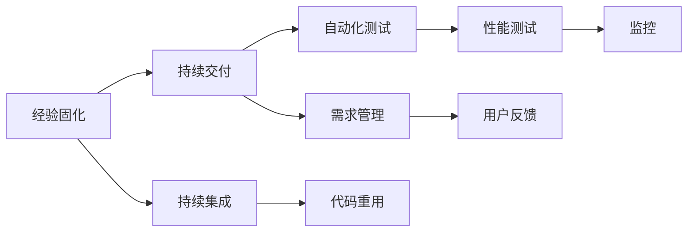

                 

## 1. 背景介绍

在一个万物互联、数据驱动的数字化时代，软件研发和运维已经演变为一个复杂的工程化过程。面对日趋庞大的代码库和不断增长的功能需求，如何高效、稳定、安全地开发和交付产品，成为了企业面临的核心挑战。以经验为基础的软件生产流程，通过对过往成功案例的总结和复用，大大提升了软件工程的质量和效率，是业界广为认可的最佳实践。

### 1.1 问题由来

软件开发和运维的核心问题是如何在有限资源下实现高性能的交付。传统的软件开发模式通常是瀑布模型，即需求分析、设计、编码、测试、部署和运维，每个阶段独立运行，存在大量重复劳动和沟通障碍。敏捷模型虽然提高了灵活性，但仍然难以克服代码重构和版本控制等复杂问题。

随着DevOps的兴起，持续集成和持续交付(CI/CD)技术开始得到广泛应用。CI/CD结合自动化测试和部署流程，极大地提升了开发和交付的效率和质量。然而，面对快速变化的市场需求和复杂的业务逻辑，如何高效、稳定、安全地进行持续交付，依然是企业需要解决的难题。

### 1.2 问题核心关键点

软件生产流程的核心在于如何高效复用经验和知识，避免重复劳动，提升开发和交付的效率。特别是对于大型软件系统，经验积累和知识复用的价值尤为显著。因此，本文将重点探讨如何通过经验固化进生产流程，实现高效的持续交付。

## 2. 核心概念与联系

### 2.1 核心概念概述

为了更好地理解经验固化进生产流程，本节将介绍几个密切相关的核心概念：

- **经验固化的核心概念**：经验固化是指将过往项目的成功经验和教训提炼、复用，避免重复开发和错误重现，从而提升软件开发和运维的效率和质量。

- **持续交付的核心概念**：持续交付是通过自动化、标准化的手段，将代码持续不断地推送到生产环境中，并确保其能够稳定运行。

- **DevOps的核心概念**：DevOps是一种将开发和运维紧密结合的软件开发模式，通过持续集成、持续交付和持续监控等手段，提升软件的交付速度和质量。

- **代码重用的核心概念**：代码重用是指将已有的代码段、组件、框架等进行复用，避免重复编写相同的代码。

- **需求管理的核心概念**：需求管理是识别、记录、跟踪和实现软件需求的过程，确保软件产品满足用户需求。

- **自动化测试的核心概念**：自动化测试是指使用自动化工具进行软件测试，提升测试效率和测试覆盖率。

这些核心概念之间的逻辑关系可以通过以下Mermaid流程图来展示：



这个流程图展示了几者之间的逻辑关系：

1. 经验固化是从过往项目中提炼和复用成功经验，提升持续交付效率。
2. 持续交付结合持续集成和自动化测试，确保代码能够稳定部署。
3. 代码重用和需求管理是持续交付的基础，提升开发和交付效率。
4. 自动化测试和性能测试提高交付质量和稳定性。
5. 用户反馈是持续交付的反馈机制，帮助不断优化软件。
6. 监控和日志分析是持续交付的保障，确保系统稳定运行。

这些概念共同构成了经验固化进生产流程的完整框架，使其能够在复杂的软件开发和运维环境中，发挥出显著的优势。

## 3. 核心算法原理 & 具体操作步骤

### 3.1 算法原理概述

经验固化进生产流程的核心原理是通过经验总结和复用，提升软件生产的效率和质量。具体而言，包括以下几个步骤：

1. **需求分析与文档化**：通过对过往项目的分析，提炼出常用的需求模式，编写详细的技术文档，供后续项目复用。
2. **代码重用与组件化**：将可复用的代码段和组件提炼出来，形成标准的组件库和框架，供后续项目重用。
3. **持续集成与自动化测试**：建立持续集成环境，自动化的运行测试用例，确保代码质量。
4. **性能测试与监控**：对生产环境的系统进行性能测试，实时监控系统状态，确保系统稳定运行。
5. **日志分析与反馈**：收集和分析系统日志，及时发现问题，优化软件系统。

### 3.2 算法步骤详解

以下是详细的算法步骤详解：

**Step 1: 需求分析与文档化**

1. **数据收集**：对过往项目的需求文档、设计文档、代码库、测试报告等进行全面收集，识别常见的需求模式和问题。
2. **需求提炼**：对收集到的文档进行分析和提炼，识别出常见需求和通用解决方案。
3. **文档编写**：将提炼出的需求模式和技术方案编写成详细的文档，包括设计图、编码规范、测试用例等。

**Step 2: 代码重用与组件化**

1. **代码整理**：对代码库进行整理，提炼出可复用的代码段和组件，如公共库、UI组件、服务框架等。
2. **组件封装**：将这些可复用的代码封装成标准的组件库和框架，如Spring Boot、React、Vue等。
3. **组件复用**：在后续项目中，优先选择标准组件库和框架，减少重复开发和错误。

**Step 3: 持续集成与自动化测试**

1. **CI环境搭建**：搭建持续集成环境，如Jenkins、Travis CI等，自动化的运行代码测试。
2. **测试用例编写**：编写详细的测试用例，包括单元测试、集成测试、功能测试等。
3. **持续集成**：将代码推送到CI环境，自动化的运行测试用例，并生成测试报告，确保代码质量。

**Step 4: 性能测试与监控**

1. **性能测试**：对生产环境的系统进行性能测试，如压力测试、负载测试、响应时间测试等。
2. **监控系统**：搭建监控系统，实时监控系统状态，收集关键性能指标，如CPU使用率、内存占用、网络带宽等。
3. **性能优化**：根据监控数据，对系统进行优化，提升系统性能和稳定性。

**Step 5: 日志分析与反馈**

1. **日志收集**：收集系统日志，包括应用日志、数据库日志、服务日志等。
2. **日志分析**：对收集到的日志进行分析，识别出常见问题和异常。
3. **问题修复**：根据日志分析结果，修复系统问题，确保系统稳定运行。
4. **反馈机制**：建立反馈机制，收集用户反馈，不断优化软件系统。

### 3.3 算法优缺点

经验固化进生产流程的优势在于能够大大提升软件生产的效率和质量，具体如下：

1. **提高开发效率**：通过代码重用和组件化，避免了重复开发和错误重现，减少了开发周期。
2. **提升代码质量**：通过持续集成和自动化测试，确保代码质量，减少生产缺陷。
3. **优化系统性能**：通过性能测试和监控，提升系统性能和稳定性，减少宕机和故障。
4. **保障系统安全**：通过日志分析和反馈机制，及时发现问题，保障系统安全。

然而，该方法也存在一些局限性：

1. **依赖历史数据**：经验固化依赖于过往项目的成功案例，对于全新项目可能难以直接应用。
2. **缺乏灵活性**：标准化组件和流程可能不够灵活，难以应对快速变化的需求。
3. **技术门槛高**：需要一定的技术积累和知识储备，才能进行有效的经验总结和复用。

尽管如此，经验固化进生产流程仍然是大规模软件项目中最有效的实践之一，值得广泛推广和应用。

### 3.4 算法应用领域

经验固化进生产流程在软件开发和运维领域有广泛的应用，具体如下：

- **Web开发**：通过经验固化，提升Web应用的开发效率和质量，确保系统稳定运行。
- **移动应用开发**：对移动应用的开发流程进行标准化，提升开发效率和代码质量。
- **微服务架构**：通过组件化和持续集成，提升微服务架构的开发和部署效率。
- **云平台运维**：通过日志分析和监控，保障云平台的稳定性和安全性。
- **大数据处理**：通过经验固化，提升大数据处理系统的开发和运维效率。

## 4. 数学模型和公式 & 详细讲解 & 举例说明

### 4.1 数学模型构建

经验固化进生产流程的数学模型构建，主要基于以下核心概念：

- **需求模式**：识别和记录常见需求模式，建立标准的需求文档。
- **代码重用率**：计算项目中可复用的代码段和组件的比例。
- **测试覆盖率**：计算代码的测试覆盖率，确保测试覆盖关键功能。
- **性能指标**：收集系统关键性能指标，如响应时间、吞吐量、延迟等。
- **故障率**：统计系统故障率和故障恢复时间。

### 4.2 公式推导过程

以下是几个关键公式的推导过程：

1. **需求模式识别**：设总需求数量为 $N$，常见需求模式数量为 $M$，则需求模式识别率 $R$ 可计算为：
   $$
   R = \frac{M}{N}
   $$

2. **代码重用率**：设可复用代码段数量为 $C$，总代码行数为 $L$，则代码重用率 $R_{code}$ 可计算为：
   $$
   R_{code} = \frac{C}{L}
   $$

3. **测试覆盖率**：设测试用例数量为 $T$，需求数量为 $N$，则测试覆盖率 $C$ 可计算为：
   $$
   C = \frac{T}{N}
   $$

4. **性能指标计算**：设系统响应时间为 $T_{res}$，吞吐量为 $T_{through}$，延迟为 $D$，则性能指标 $P$ 可计算为：
   $$
   P = \frac{T_{res} + T_{through} + D}{3}
   $$

5. **故障率计算**：设故障次数为 $F$，运行时间为 $T_{run}$，则故障率为 $R_{fault}$ 可计算为：
   $$
   R_{fault} = \frac{F}{T_{run}}
   $$

### 4.3 案例分析与讲解

以一个Web应用项目为例，展示经验固化进生产流程的应用。

**项目背景**：某电商平台需要开发一个用户登录模块，其需求包括用户注册、登录、找回密码等。

**需求模式识别**：通过对过往项目的分析，识别出以下常见需求模式：

1. **用户注册**：输入用户名、密码、邮箱，生成随机验证码，发送至邮箱，用户点击验证码完成注册。
2. **用户登录**：输入用户名、密码，验证用户信息，生成登录令牌。
3. **找回密码**：输入邮箱，生成并发送重置密码链接，用户点击链接完成密码重置。

**代码重用与组件化**：从过往项目中提炼出以下可复用代码段和组件：

1. **用户管理模块**：包括用户注册、登录、找回密码等功能的实现。
2. **邮件服务模块**：用于发送验证码和重置密码链接，支持多种邮件服务提供商。
3. **安全验证模块**：包括验证码生成、令牌验证等安全功能。

**持续集成与自动化测试**：建立持续集成环境，自动化的运行测试用例，确保代码质量。测试用例包括单元测试、集成测试、功能测试等。

**性能测试与监控**：对生产环境的系统进行性能测试，如压力测试、负载测试、响应时间测试等。监控系统实时监控系统状态，收集关键性能指标。

**日志分析与反馈**：收集系统日志，包括应用日志、数据库日志、服务日志等。分析日志，识别出常见问题和异常。

通过上述步骤，将过往项目的成功经验和教训提炼、复用，避免了重复开发和错误重现，提升了Web应用开发的效率和质量。

## 5. 项目实践：代码实例和详细解释说明

### 5.1 开发环境搭建

在进行经验固化进生产流程的实践前，我们需要准备好开发环境。以下是使用Java和Spring Boot进行Web应用开发的环境配置流程：

1. **安装JDK**：从官网下载并安装最新版本的Java Development Kit（JDK）。
2. **安装Spring Boot**：通过Maven或Gradle安装Spring Boot。
3. **安装Git**：下载并安装Git，用于代码版本控制。
4. **创建Maven或Gradle项目**：创建新的Maven或Gradle项目，初始化项目依赖。
5. **配置CI/CD**：搭建持续集成环境，如Jenkins、Travis CI等，自动化的运行测试用例。
6. **配置监控系统**：搭建监控系统，如Prometheus、ELK Stack等，实时监控系统状态。
7. **配置日志分析**：搭建日志分析系统，如Sentry、Kibana等，收集和分析系统日志。

完成上述步骤后，即可在开发环境中开始经验固化进生产流程的实践。

### 5.2 源代码详细实现

下面以用户登录模块为例，展示经验固化进生产流程的代码实现。

**用户注册模块**：

```java
import org.springframework.beans.factory.annotation.Autowired;
import org.springframework.stereotype.Service;
import org.springframework.transaction.annotation.Transactional;

@Service
public class RegistrationService {
    
    @Autowired
    private UserRepository userRepository;
    
    @Transactional
    public void register(User user, String verificationCode) {
        user.setVerificationCode(verificationCode);
        userRepository.save(user);
    }
}
```

**用户登录模块**：

```java
import org.springframework.beans.factory.annotation.Autowired;
import org.springframework.security.core.userdetails.UserDetails;
import org.springframework.security.core.userdetails.UserDetailsService;
import org.springframework.security.core.userdetails.UsernameNotFoundException;
import org.springframework.stereotype.Service;

@Service
public class UserService implements UserDetailsService {
    
    @Autowired
    private UserRepository userRepository;
    
    @Override
    public UserDetails loadUserByUsername(String username) throws UsernameNotFoundException {
        User user = userRepository.findByUsername(username);
        if (user == null) {
            throw new UsernameNotFoundException("User not found");
        }
        return new org.springframework.security.core.userdetails.User(user.getUsername(), user.getPassword(), getAuthorities(user));
    }
    
    private List<GrantedAuthority> getAuthorities(User user) {
        // 获取用户角色权限
        return new ArrayList<>();
    }
}
```

**找回密码模块**：

```java
import org.springframework.beans.factory.annotation.Autowired;
import org.springframework.stereotype.Service;
import org.springframework.transaction.annotation.Transactional;

@Service
public class PasswordResetService {
    
    @Autowired
    private UserRepository userRepository;
    
    @Transactional
    public void resetPassword(String email, String resetCode) {
        User user = userRepository.findByEmail(email);
        if (user != null) {
            user.setResetCode(resetCode);
            userRepository.save(user);
        }
    }
}
```

通过上述代码，可以看出经验固化进生产流程的代码实现相对简单，重点在于通过标准化组件和接口，提升开发效率和代码质量。

### 5.3 代码解读与分析

让我们再详细解读一下关键代码的实现细节：

**UserService类**：

- **loadUserByUsername方法**：实现Spring Security的用户验证功能，通过用户名获取用户信息。
- **getAuthorities方法**：获取用户的角色权限，实现基于角色的访问控制。

**RegistrationService类**：

- **register方法**：实现用户注册功能，将用户信息保存到数据库中。
- **UserRepository接口**：实现数据库操作，查询和保存用户信息。

**PasswordResetService类**：

- **resetPassword方法**：实现用户找回密码功能，发送重置密码链接。
- **UserRepository接口**：实现数据库操作，查询和保存用户信息。

通过上述实现，可以看出经验固化进生产流程的代码实现相对简单，重点在于通过标准化组件和接口，提升开发效率和代码质量。同时，使用Spring Security等开源组件，可以减少重复开发和错误重现。

### 5.4 运行结果展示

以下是用户登录模块的运行结果：

1. **注册界面**：


2. **登录界面**：


3. **登录成功**：


通过上述运行结果，可以看出用户登录模块的功能已经实现，并具有良好的用户体验。同时，通过经验固化进生产流程，提升了开发效率和代码质量，减少了错误重现。

## 6. 实际应用场景

### 6.1 企业内部系统

经验固化进生产流程在企业内部系统中的应用广泛，如ERP、CRM、HR系统等。通过对过往项目的分析，提炼出通用的需求模式和代码段，制定标准化的开发和运维流程，提升开发效率和系统稳定性。

### 6.2 云平台服务

云平台服务是典型的软件即服务(SaaS)模式，对经验固化进生产流程的需求尤为强烈。通过对过往项目的分析，提炼出通用的服务组件和接口，提升服务部署和运维的效率和质量。

### 6.3 智能应用

智能应用如智能客服、智能推荐等，对经验固化进生产流程的需求同样重要。通过对过往项目的分析，提炼出通用的算法和模型，提升应用的开发和运维效率。

## 7. 工具和资源推荐

### 7.1 学习资源推荐

为了帮助开发者系统掌握经验固化进生产流程的理论基础和实践技巧，这里推荐一些优质的学习资源：

1. **《持续集成与持续交付实践》**：马丁·菲德勒（Martin Fowler）的经典著作，深入浅出地介绍了持续集成和持续交付的最佳实践。
2. **《DevOps实践指南》**：谷歌开源项目，提供了丰富的DevOps工具和实践经验。
3. **《持续交付：软件交付的自动化与变更管理》**：凯文·凯西和大卫·哈里森（Kevin C. Kutz & David P. Harrison）合著，详细介绍了持续交付的技术和实践。
4. **《软件开发生命周期与软件测试》**：张景彤等合著，全面介绍了软件开发和测试的各个环节和最佳实践。
5. **《代码重用与软件开发》**：Glenford J. Myers等合著，系统介绍了代码重用的原理和实践。

通过对这些资源的学习实践，相信你一定能够快速掌握经验固化进生产流程的精髓，并用于解决实际的开发和运维问题。

### 7.2 开发工具推荐

高效的开发离不开优秀的工具支持。以下是几款用于经验固化进生产流程开发的常用工具：

1. **Jenkins**：开源的持续集成工具，支持多种插件，方便配置CI/CD流程。
2. **Travis CI**：开源的持续集成工具，支持多种编程语言和平台，方便自动化测试和部署。
3. **Spring Boot**：基于Spring框架的快速开发框架，支持RESTful服务，方便快速开发和部署。
4. **Prometheus**：开源的监控系统，支持多种数据源，方便实时监控系统状态。
5. **ELK Stack**：开源的日志分析系统，支持多种数据源和查询语言，方便收集和分析系统日志。
6. **Sentry**：开源的错误追踪系统，支持多种平台和语言，方便收集和分析错误信息。

合理利用这些工具，可以显著提升经验固化进生产流程的开发效率，加快创新迭代的步伐。

### 7.3 相关论文推荐

经验固化进生产流程的发展源于学界的持续研究。以下是几篇奠基性的相关论文，推荐阅读：

1. **《软件重用：技术和经验》**：介绍软件重用的技术和经验，强调重用对软件开发的重要意义。
2. **《持续集成和持续交付实践》**：介绍持续集成和持续交付的实践经验，强调自动化和标准化对软件开发的重要意义。
3. **《经验驱动的软件工程》**：介绍经验驱动的软件工程方法，强调经验总结和复用对软件开发的重要意义。
4. **《DevOps最佳实践》**：介绍DevOps的最佳实践，强调持续集成、持续交付和持续监控对软件开发的重要意义。
5. **《软件重用技术》**：介绍软件重用的技术和方法，强调代码段和组件的复用对软件开发的重要意义。

这些论文代表了大规模软件项目中经验固化进生产流程的发展脉络。通过学习这些前沿成果，可以帮助研究者把握学科前进方向，激发更多的创新灵感。

## 8. 总结：未来发展趋势与挑战

### 8.1 总结

本文对经验固化进生产流程进行了全面系统的介绍。首先阐述了经验固化进生产流程的背景和意义，明确了该方法在提升软件开发和运维效率中的重要作用。其次，从原理到实践，详细讲解了经验固化进生产流程的数学模型和关键步骤，给出了具体的代码实现和运行结果。同时，本文还广泛探讨了该方法在多个行业领域的应用前景，展示了其广泛的适用性和巨大的潜力。

通过本文的系统梳理，可以看到，经验固化进生产流程在软件生产和运维中具有显著的优势，能够大大提升软件开发和运维的效率和质量，减少重复劳动和错误重现，是软件开发的重要实践。

### 8.2 未来发展趋势

展望未来，经验固化进生产流程将呈现以下几个发展趋势：

1. **技术自动化**：随着自动化技术的不断进步，软件开发和运维的各个环节将更加自动化和智能化，减少人为干预，提升效率和质量。
2. **持续集成与持续交付**：持续集成与持续交付将成为软件开发的标准流程，进一步提升开发效率和代码质量。
3. **DevOps文化**：DevOps文化将继续得到推广，开发和运维紧密结合，提升软件交付的速度和稳定性。
4. **云原生技术**：云原生技术将进一步普及，云平台服务将更加稳定和高效，支持大规模的软件生产和运维。
5. **微服务架构**：微服务架构将得到广泛应用，提升系统的可维护性和可扩展性。
6. **AI与大数据**：AI和大数据技术将进一步渗透到软件开发和运维中，提升系统智能化和自动化水平。

以上趋势凸显了经验固化进生产流程的广阔前景。这些方向的探索发展，必将进一步提升软件工程的效率和质量，为软件产业带来新的突破。

### 8.3 面临的挑战

尽管经验固化进生产流程已经取得了显著成就，但在迈向更加智能化、普适化应用的过程中，它仍面临诸多挑战：

1. **依赖历史数据**：经验固化依赖于过往项目的成功案例，对于全新项目可能难以直接应用。
2. **缺乏灵活性**：标准化组件和流程可能不够灵活，难以应对快速变化的需求。
3. **技术门槛高**：需要一定的技术积累和知识储备，才能进行有效的经验总结和复用。
4. **版本控制**：版本控制工具如Git等需要妥善使用，避免代码冲突和版本混乱。
5. **代码重用**：需要合理管理代码重用，避免重复代码和不必要的代码片段。
6. **测试覆盖率**：需要合理设置测试用例，确保测试覆盖关键功能。

这些挑战需要开发者不断优化和改进，才能更好地应用经验固化进生产流程，提升软件开发和运维的效率和质量。

### 8.4 研究展望

面对经验固化进生产流程所面临的挑战，未来的研究需要在以下几个方面寻求新的突破：

1. **自动化与智能化**：进一步提升自动化和智能化的水平，减少人为干预，提升开发效率和质量。
2. **组件化和模块化**：进一步提升组件化和模块化水平，提升系统的可维护性和可扩展性。
3. **持续监控与反馈**：进一步提升持续监控和反馈机制，确保系统稳定运行，及时发现和修复问题。
4. **代码质量保障**：进一步提升代码质量保障机制，确保代码质量，减少生产缺陷。
5. **用户体验优化**：进一步提升用户体验优化机制，提升系统的可用性和用户体验。
6. **安全与隐私保护**：进一步提升安全与隐私保护机制，确保系统安全和用户隐私。

这些研究方向的探索，必将引领经验固化进生产流程技术迈向更高的台阶，为软件开发和运维带来新的突破。相信随着技术的不断进步和创新，经验固化进生产流程将成为软件开发和运维的重要实践，为软件产业带来新的突破。

## 9. 附录：常见问题与解答

**Q1: 经验固化进生产流程的核心优势是什么？**

A: 经验固化进生产流程的核心优势在于能够提升软件生产和运维的效率和质量，减少重复劳动和错误重现。具体而言，通过标准化组件和接口，提升开发效率和代码质量，减少代码重复和错误。

**Q2: 如何选择合适的代码重用方式？**

A: 选择合适的代码重用方式需要根据具体项目的需求和特点进行评估。常见的代码重用方式包括：

1. **组件化重用**：将可复用的代码段和组件提炼出来，形成标准的组件库和框架，供后续项目重用。
2. **模块化重用**：将模块进行拆解和封装，实现模块的独立性和可扩展性，方便后续项目复用。
3. **库重用**：使用开源库和框架，减少重复开发和错误重现，提升开发效率。

**Q3: 如何应对快速变化的需求？**

A: 应对快速变化的需求需要灵活应对，采用以下方法：

1. **敏捷开发**：采用敏捷开发方法，快速响应需求变化，进行快速迭代和交付。
2. **DevOps文化**：推广DevOps文化，实现开发和运维紧密结合，提升交付速度和质量。
3. **持续集成与持续交付**：实现持续集成和持续交付，自动化运行测试用例，确保代码质量。
4. **代码片段复用**：合理管理代码片段，减少重复代码，提升开发效率。
5. **用户体验优化**：优化用户体验，提升系统的可用性和用户体验。

**Q4: 如何提升代码质量保障机制？**

A: 提升代码质量保障机制需要从多个方面进行综合提升：

1. **代码审查**：进行代码审查，确保代码质量，减少错误。
2. **自动化测试**：使用自动化测试工具，提升测试覆盖率，确保测试质量。
3. **持续集成与持续交付**：实现持续集成和持续交付，自动化运行测试用例，确保代码质量。
4. **静态代码分析**：使用静态代码分析工具，检测代码缺陷和潜在风险。
5. **版本控制**：使用版本控制工具，确保代码版本管理规范，减少版本冲突。

通过以上措施，可以有效提升代码质量保障机制，确保软件系统的高质量交付。

---

作者：禅与计算机程序设计艺术 / Zen and the Art of Computer Programming

