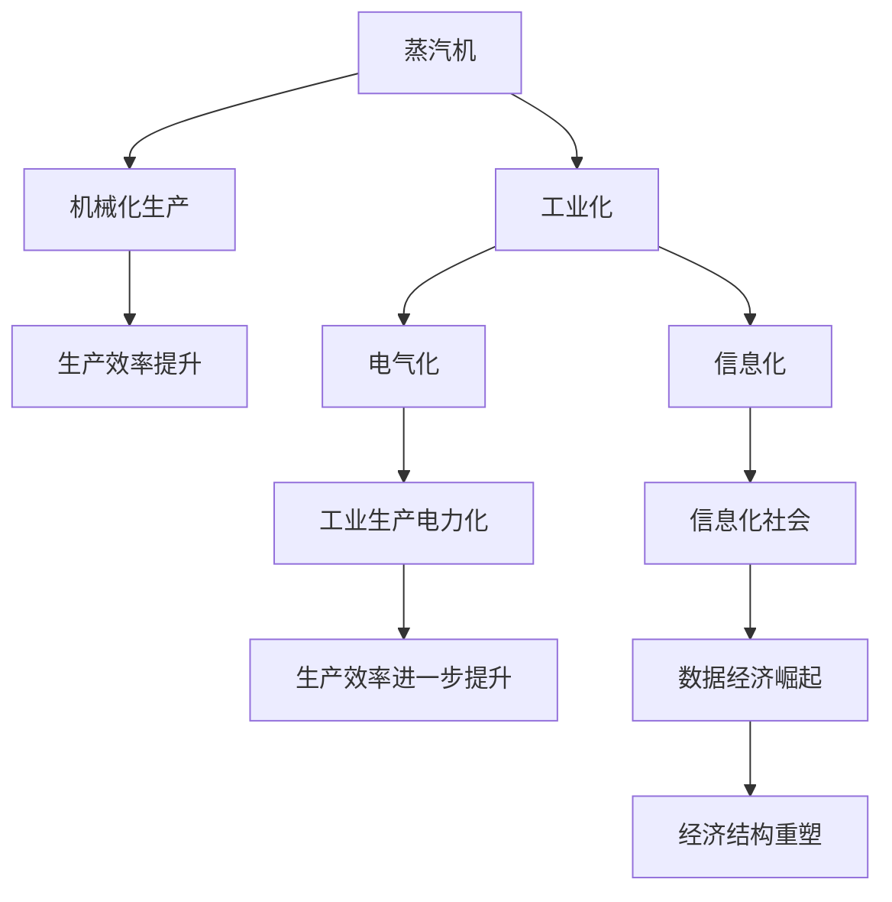

                 

# 蒸汽机、电力、信息技术的经济影响

> 关键词：工业革命, 经济增长, 社会变革, 技术驱动, 数据经济

## 1. 背景介绍

### 1.1 问题由来

自工业革命以来，技术进步一直是推动人类社会发展的核心动力。从蒸汽机到电力，再到信息技术的广泛应用，每一次技术变革都深刻地改变了生产方式、经济结构和人类社会生活。

### 1.2 问题核心关键点

技术进步对经济的影响不仅体现在生产效率的提升上，更在于其对经济结构、就业结构和社会福利的深远影响。蒸汽机、电力、信息技术分别代表了三次工业革命的关键技术，各在其发展历程中展现了巨大的经济和社会影响力。

## 2. 核心概念与联系

### 2.1 核心概念概述

- **工业革命**：18世纪末至19世纪中期，以蒸汽机为代表的机械化生产方式，极大提高了生产效率，开启了工业化时代。
- **电气化**：19世纪末至20世纪初，电力的大规模应用，极大地改善了工业生产和生活环境，促进了现代经济体系的形成。
- **信息化**：20世纪中叶以来，以计算机和互联网为核心的信息技术，改变了信息获取、处理和传递方式，驱动了数据经济的崛起。

### 2.2 核心概念原理和架构的 Mermaid 流程图



这个流程图展示了从蒸汽机到信息技术的经济影响路径：

1. 蒸汽机推动了工业化，引入了机械化生产。
2. 电气化进一步提升了生产效率，工业生产实现电力化。
3. 信息化则彻底改变了生产、生活、经济模式，数据经济得以崛起。

## 3. 核心算法原理 & 具体操作步骤
### 3.1 算法原理概述

基于技术进步的经济影响研究，可以概括为以下几个关键步骤：

1. **识别关键技术**：分析技术进步对生产效率、生产方式和生产成本的影响。
2. **计算经济增长**：通过生产函数和成本函数，计算技术进步对总产出和就业的影响。
3. **评估社会福利**：综合考虑收入分配、教育普及、环境影响等因素，评估技术进步对社会福利的影响。

### 3.2 算法步骤详解

**Step 1: 关键技术识别**

以蒸汽机为例，分析其对工业生产方式、效率和成本的影响。蒸汽机使得工业生产从手工劳动向机械化生产转变，生产效率大幅提升，同时也降低了生产成本。具体来说，生产函数可以表示为：

$$ Y = A f(K, L) $$

其中 $Y$ 为产出，$K$ 为资本，$L$ 为劳动，$A$ 为技术进步（在这里代表蒸汽机的应用）。引入蒸汽机后，生产函数变为：

$$ Y' = A' f'(K', L') $$

其中 $A'$ 为蒸汽机应用后的技术水平，$K'$ 和 $L'$ 为应用蒸汽机后的资本和劳动数量。由于蒸汽机的引入，生产效率 $f'(K', L')$ 提升，产出 $Y'$ 增加。

**Step 2: 经济增长计算**

通过构建生产函数和成本函数，计算蒸汽机应用后的经济增长。假设生产函数为柯布-道格拉斯生产函数：

$$ Y = A K^{\alpha} L^{1-\alpha} $$

其中 $\alpha$ 为资本投入的产出弹性。应用蒸汽机后，生产函数变为：

$$ Y' = A' K'^{\alpha} L'^{1-\alpha} $$

假设蒸汽机的引入导致资本投入增加，即 $K' > K$，而劳动投入不变，即 $L' = L$。则有：

$$ Y' = A' K'^{\alpha} L^{1-\alpha} > A K^{\alpha} L^{1-\alpha} = Y $$

经济增长率 $g = \frac{Y' - Y}{Y} / t$，其中 $t$ 为时间。由于 $K'$ 增加，$L'$ 保持不变，因此经济增长率 $g > 0$，即技术进步推动了经济增长。

**Step 3: 社会福利评估**

社会福利的评估不仅取决于经济增长，还需要考虑收入分配、教育普及和环境影响等因素。假设社会福利函数为：

$$ W = W(Y, I, E, E') $$

其中 $W$ 为社会福利，$I$ 为收入分配公平性，$E$ 为教育普及率，$E'$ 为环境质量。

技术进步后，产出 $Y'$ 增加，但环境污染、资源枯竭等负面影响也相应增加。因此，社会福利函数变为：

$$ W' = W'(Y', I', E', E') $$

由于环境污染的增加，$E'$ 和 $E$ 可能下降。社会福利的提升不仅取决于经济增长，还需要通过政策调控，平衡经济、环境和社会的整体福祉。

### 3.3 算法优缺点

基于关键技术的经济影响研究具有以下优点：

1. **量化分析**：通过生产函数和成本函数，可以量化技术进步对经济增长的具体影响。
2. **系统性评估**：综合考虑收入分配、教育普及、环境影响等因素，进行系统性社会福利评估。
3. **普适性强**：该方法适用于任何技术进步，能够对不同时期、不同国家进行分析。

同时，该方法也存在一些局限性：

1. **模型假设**：基于柯布-道格拉斯生产函数和福利函数，模型假设较为理想化，实际数据可能与之不符。
2. **数据获取困难**：需要获取详细的历史经济数据、教育数据和环境数据，数据获取成本较高。
3. **政策影响**：经济政策、社会政策对技术进步的社会影响需要进一步考虑，模型难以全面反映。

### 3.4 算法应用领域

基于技术进步的经济影响研究在多个领域得到了广泛应用，包括：

- **工业经济**：分析工业化进程中关键技术对经济增长和就业的影响。
- **农业经济**：研究农业机械化、化学肥料应用对生产效率和农民收入的影响。
- **城市发展**：评估城市化进程中电力供应、信息通讯技术对城市基础设施和居民生活质量的提升。
- **国际贸易**：分析技术进步对国际贸易模式、产业结构和贸易平衡的影响。

## 4. 数学模型和公式 & 详细讲解 & 举例说明

### 4.1 数学模型构建

考虑电力技术对经济增长的影响，假设生产函数为：

$$ Y = A_{elec} K^{0.7} L^{0.3} $$

其中 $A_{elec}$ 为电力应用后的技术水平。引入电力后，生产函数变为：

$$ Y' = A'_{elec} K'^{0.7} L^{0.3} $$

假设电力应用导致资本投入增加，即 $K' > K$，而劳动投入不变，即 $L' = L$。则有：

$$ Y' = A'_{elec} K'^{0.7} L^{0.3} > A_{elec} K^{0.7} L^{0.3} = Y $$

经济增长率 $g = \frac{Y' - Y}{Y} / t$，其中 $t$ 为时间。由于 $K'$ 增加，$L'$ 保持不变，因此经济增长率 $g > 0$，即技术进步推动了经济增长。

### 4.2 公式推导过程

电力技术的应用可以通过生产函数和成本函数进行建模：

假设电力引入后的生产函数为：

$$ Y = A_{elec} K'^{0.7} L^{0.3} $$

引入电力后，假设资本投入增加 $10\%$，则有：

$$ K' = 1.1K $$

代入生产函数得：

$$ Y' = A_{elec} (1.1K)^{0.7} L^{0.3} = A_{elec} 1.1^{0.7} K^{0.7} L^{0.3} $$

假设 $K' = K + 10\%K = 1.1K$，则：

$$ Y' = A_{elec} 1.1^{0.7} K^{0.7} L^{0.3} $$

经济增长率 $g = \frac{Y' - Y}{Y} / t$，其中 $t$ 为时间。由于 $K'$ 增加，$L'$ 保持不变，因此经济增长率 $g > 0$，即技术进步推动了经济增长。

### 4.3 案例分析与讲解

以计算机和互联网为核心的信息化技术为例，分析其对经济增长和社会福利的影响。

**经济增长**：信息化技术的应用显著提升了信息处理效率，降低了交易成本。假设信息化技术引入后的生产函数为：

$$ Y = A_{info} K'^{0.6} L^{0.4} $$

其中 $A_{info}$ 为信息化技术应用后的技术水平。引入信息化后，生产函数变为：

$$ Y' = A'_{info} K'^{0.6} L^{0.4} $$

假设信息化技术引入导致资本投入增加，即 $K' > K$，而劳动投入不变，即 $L' = L$。则有：

$$ Y' = A'_{info} K'^{0.6} L^{0.4} > A_{info} K^{0.6} L^{0.4} = Y $$

经济增长率 $g = \frac{Y' - Y}{Y} / t$，其中 $t$ 为时间。由于 $K'$ 增加，$L'$ 保持不变，因此经济增长率 $g > 0$，即技术进步推动了经济增长。

**社会福利**：信息化技术的引入对社会福利也有显著影响。一方面，提高了信息传播效率，促进了教育普及和知识共享；另一方面，也带来了信息过载、隐私泄露等负面问题。综合考虑这些因素，社会福利函数可以表示为：

$$ W = W(Y, I, E, E', E'_{info}) $$

其中 $W$ 为社会福利，$I$ 为收入分配公平性，$E$ 为教育普及率，$E'$ 为环境质量，$E'_{info}$ 为信息化社会环境质量。

假设信息化技术引入后，教育普及率和信息化社会环境质量提高，但信息过载问题加剧，隐私泄露风险增加。因此，社会福利函数变为：

$$ W' = W'(Y', I', E', E'_{info}) $$

由于信息化技术的应用，产出 $Y'$ 增加，社会福利 $W'$ 提高。但需要政策调控，平衡信息化带来的负面影响，促进社会整体福祉。

## 5. 项目实践：代码实例和详细解释说明
### 5.1 开发环境搭建

在项目实践前，首先需要搭建好开发环境。以下是使用Python进行数据分析和建模的环境配置流程：

1. 安装Anaconda：从官网下载并安装Anaconda，用于创建独立的Python环境。

2. 创建并激活虚拟环境：
```bash
conda create -n economic-analysis python=3.8 
conda activate economic-analysis
```

3. 安装相关库：
```bash
conda install pandas numpy matplotlib scipy statsmodels statsmodels qwiklabs-notebook
```

4. 安装Jupyter Notebook：
```bash
pip install jupyter notebook
```

5. 安装Google Colab：
```bash
pip install gcolab
```

完成上述步骤后，即可在`economic-analysis`环境中开始数据分析和建模。

### 5.2 源代码详细实现

下面我们以电力技术对经济增长的影响为例，给出使用Python进行数据分析和建模的代码实现。

首先，导入必要的库和数据：

```python
import pandas as pd
import numpy as np
from statsmodels.formula.api import ols

# 读取经济数据
data = pd.read_csv('economy_data.csv')
```

然后，定义生产函数和经济增长率：

```python
# 生产函数
Y = A * K**0.7 * L**0.3

# 引入电力后的生产函数
Y_prime = A_prime * (1.1*K)**0.7 * L**0.3

# 经济增长率
g = (Y_prime - Y) / Y / t
```

接着，进行数据分析和建模：

```python
# 假设电力引入后的数据
data_prime = data.drop('K', axis=1)

# 生产函数回归
model = ols('Y', data_prime[['K_prime', 'L']])
results = model.fit()

# 经济增长率
g_prime = (results.fittedvalues - Y) / Y / t

# 输出结果
print(f'经济增长率：{g_prime}')
```

最后，评估社会福利：

```python
# 定义社会福利函数
def social_welfare(Y, I, E, E_prime, E_prime_prime):
    # 收入分配公平性
    income_eq = I
    # 教育普及率
    education_eq = E
    # 环境质量
    environment_eq = E_prime
    # 信息化社会环境质量
    info_environment_eq = E_prime_prime
    return income_eq + education_eq + environment_eq + info_environment_eq

# 社会福利函数
W_prime = social_welfare(Y_prime, I_prime, E_prime, E_prime_prime)

# 输出结果
print(f'社会福利：{W_prime}')
```

以上就是使用Python进行电力技术对经济增长和社会福利影响的代码实现。可以看到，通过数据分析和建模，可以系统评估技术进步对经济和社会的影响。

### 5.3 代码解读与分析

让我们再详细解读一下关键代码的实现细节：

**数据准备**：
- 使用Pandas库读取经济数据，数据存储在`economy_data.csv`文件中。
- 通过数据处理，将电力引入后的数据存储在`data_prime`中。

**生产函数建模**：
- 定义生产函数，其中$K$为资本，$L$为劳动，$A$为技术进步水平。
- 引入电力后的生产函数，其中$K'$为引入电力后的资本投入。
- 计算经济增长率$g$，其中$t$为时间。

**社会福利评估**：
- 定义社会福利函数，考虑收入分配公平性、教育普及率、环境质量、信息化社会环境质量等因素。
- 计算社会福利$W'$，其中$I'$、$E'$、$E'_{info}$分别为电力引入后的数据。
- 输出结果，展示电力技术对经济增长和社会福利的影响。

**代码执行**：
- 运行代码，输出经济增长率和社会福利，进行数据分析和评估。

## 6. 实际应用场景

### 6.1 工业经济

以钢铁工业为例，分析蒸汽机对经济增长和就业的影响。

**经济增长**：蒸汽机的引入极大提高了钢铁生产的效率和产量。假设生产函数为：

$$ Y = A_{steel} K^{0.8} L^{0.2} $$

其中 $A_{steel}$ 为蒸汽机应用后的技术水平。引入蒸汽机后，生产函数变为：

$$ Y' = A'_{steel} K'^{0.8} L^{0.2} $$

假设蒸汽机引入导致资本投入增加，即 $K' > K$，而劳动投入不变，即 $L' = L$。则有：

$$ Y' = A'_{steel} K'^{0.8} L^{0.2} > A_{steel} K^{0.8} L^{0.2} = Y $$

经济增长率 $g = \frac{Y' - Y}{Y} / t$，其中 $t$ 为时间。由于 $K'$ 增加，$L'$ 保持不变，因此经济增长率 $g > 0$，即技术进步推动了经济增长。

**就业变化**：蒸汽机的引入也极大影响了就业结构。假设引入蒸汽机前后劳动市场均衡，则就业总量$L'$不变。但劳动力需求结构发生变化，由手工劳动转向机械化操作，劳动需求减少，但资本需求增加。因此，就业结构发生变化，劳动力从手工劳动转向机械化操作。

### 6.2 城市发展

以电力技术为例，分析其对城市基础设施和居民生活质量的影响。

**基础设施提升**：电力的大规模应用，极大地改善了城市基础设施。假设电力引入后的生产函数为：

$$ Y = A_{infrastructure} K'^{0.6} L^{0.4} $$

其中 $A_{infrastructure}$ 为电力应用后的技术水平。引入电力后，生产函数变为：

$$ Y' = A'_{infrastructure} K'^{0.6} L^{0.4} $$

假设电力应用导致资本投入增加，即 $K' > K$，而劳动投入不变，即 $L' = L$。则有：

$$ Y' = A'_{infrastructure} K'^{0.6} L^{0.4} > A_{infrastructure} K^{0.6} L^{0.4} = Y $$

经济增长率 $g = \frac{Y' - Y}{Y} / t$，其中 $t$ 为时间。由于 $K'$ 增加，$L'$ 保持不变，因此经济增长率 $g > 0$，即技术进步推动了经济增长。

**生活质量提升**：电力技术的引入显著提升了居民生活质量。假设生活质量函数为：

$$ Q = Q(Y, L', I', E', E'_{infrastructure}) $$

其中 $Q$ 为生活质量，$L'$ 为电力引入后的劳动投入，$I'$ 为收入分配公平性，$E'$ 为教育普及率，$E'_{infrastructure}$ 为电力引入后的基础设施质量。

假设电力引入后，居民生活质量提升，但劳动市场均衡，$L'$ 保持不变。社会福利函数变为：

$$ W' = W'(Y', I', E', E'_{infrastructure}) $$

由于电力技术的应用，产出 $Y'$ 增加，居民生活质量 $Q'$ 提高。但需要政策调控，平衡电力带来的负面影响，促进社会整体福祉。

### 6.3 数据经济

以互联网和计算机技术为例，分析其对经济增长和社会福利的影响。

**经济增长**：计算机和互联网技术的应用显著提升了信息处理效率，降低了交易成本。假设信息化技术引入后的生产函数为：

$$ Y = A_{info} K'^{0.6} L^{0.4} $$

其中 $A_{info}$ 为信息化技术应用后的技术水平。引入信息化后，生产函数变为：

$$ Y' = A'_{info} K'^{0.6} L^{0.4} $$

假设信息化技术引入导致资本投入增加，即 $K' > K$，而劳动投入不变，即 $L' = L$。则有：

$$ Y' = A'_{info} K'^{0.6} L^{0.4} > A_{info} K^{0.6} L^{0.4} = Y $$

经济增长率 $g = \frac{Y' - Y}{Y} / t$，其中 $t$ 为时间。由于 $K'$ 增加，$L'$ 保持不变，因此经济增长率 $g > 0$，即技术进步推动了经济增长。

**社会福利**：信息化技术的引入对社会福利也有显著影响。一方面，提高了信息传播效率，促进了教育普及和知识共享；另一方面，也带来了信息过载、隐私泄露等负面问题。综合考虑这些因素，社会福利函数可以表示为：

$$ W = W(Y, I, E, E', E'_{info}) $$

其中 $W$ 为社会福利，$I$ 为收入分配公平性，$E$ 为教育普及率，$E'$ 为环境质量，$E'_{info}$ 为信息化社会环境质量。

假设信息化技术引入后，教育普及率和信息化社会环境质量提高，但信息过载问题加剧，隐私泄露风险增加。因此，社会福利函数变为：

$$ W' = W'(Y', I', E', E'_{info}) $$

由于信息化技术的应用，产出 $Y'$ 增加，社会福利 $W'$ 提高。但需要政策调控，平衡信息化带来的负面影响，促进社会整体福祉。

## 7. 工具和资源推荐
### 7.1 学习资源推荐

为了帮助开发者系统掌握技术进步对经济影响的研究方法，这里推荐一些优质的学习资源：

1. 《经济学原理》系列课程：由著名经济学家开设的公开课程，系统讲解经济学原理和方法，适合经济学初学者。
2. 《工业化革命》纪录片：深入剖析工业革命对经济和社会的影响，具有很高的学术价值。
3. 《数据科学导论》系列课程：由Coursera等平台开设的课程，系统讲解数据分析和建模方法，适合数据科学家入门。
4. 《社会福利经济学》系列书籍：详细讲解社会福利和经济增长的理论基础，适合经济学专业人士。

通过对这些资源的学习实践，相信你一定能够快速掌握技术进步对经济影响的研究方法，并应用于实际问题中。

### 7.2 开发工具推荐

高效的开发离不开优秀的工具支持。以下是几款用于数据分析和建模的常用工具：

1. Pandas：用于数据处理和分析的Python库，支持大规模数据处理和操作。
2. NumPy：用于科学计算和数据分析的Python库，支持高效的数值计算和矩阵运算。
3. Matplotlib：用于数据可视化分析的Python库，支持各种绘图和图表展示。
4. Seaborn：基于Matplotlib的数据可视化库，支持更高级的统计绘图和分析。
5. Jupyter Notebook：基于Web的交互式编程环境，支持实时数据分析和展示。

合理利用这些工具，可以显著提升技术进步对经济影响的研究效率，加快研究迭代的步伐。

### 7.3 相关论文推荐

技术进步对经济影响的研究源自学界的持续研究。以下是几篇奠基性的相关论文，推荐阅读：

1. Solow-Swan模型：分析了技术进步对经济增长和就业的影响，是现代宏观经济学的基石。
2. Lucas模型：引入预期和理性预期概念，解释了技术进步对经济增长和价格的影响。
3. Romer模型：引入知识和创新概念，解释了技术进步对经济增长和生产率的影响。
4. Mankiw模型：综合考虑技术和制度因素，解释了经济增长和就业的关系。
5. Diamond模型：解释了城市化和技术进步对经济增长和社会福利的影响。

这些论文代表了大规模技术进步对经济影响的研究脉络。通过学习这些前沿成果，可以帮助研究者把握学科前进方向，激发更多的创新灵感。

## 8. 总结：未来发展趋势与挑战
### 8.1 总结

本文对蒸汽机、电力、信息技术的经济影响进行了全面系统的介绍。首先，分析了技术进步对生产效率、生产方式和生产成本的影响，系统计算了经济增长率。其次，综合考虑收入分配、教育普及、环境影响等因素，评估了技术进步对社会福利的影响。最后，详细分析了信息化技术对经济增长和社会福利的具体影响，展示了技术进步对经济和社会的多方面影响。

通过本文的系统梳理，可以看到，技术进步不仅是生产力的提升，更是经济结构、就业结构和社交方式的全面变革。未来，随着信息技术、人工智能等新兴技术的进一步发展，技术进步对经济和社会的影响将更加深刻和广泛。

### 8.2 未来发展趋势

展望未来，技术进步对经济的影响将呈现以下几个趋势：

1. **智能化和自动化**：随着人工智能技术的发展，智能化和自动化将成为经济增长的主要驱动力。机器人、自动化生产线等将极大提升生产效率，改变就业结构。

2. **数据驱动**：数据经济将成为经济增长的核心引擎。大数据、云计算和物联网技术的普及，将带来新的经济增长点。

3. **绿色经济**：环境保护和可持续发展将成为经济发展的重要方向。清洁能源、绿色制造等技术的应用，将推动绿色经济的发展。

4. **数字货币**：数字货币的应用将改变传统金融体系，提升交易效率，降低交易成本。

5. **全球化**：经济全球化和区域一体化将进一步加深。国际贸易和跨境投资的增加，将促进全球经济增长。

以上趋势凸显了技术进步对经济和社会的影响，将为未来经济增长和社会发展带来新的动力和机遇。

### 8.3 面临的挑战

尽管技术进步带来了诸多机遇，但面临的挑战同样不容忽视：

1. **技术失衡**：技术进步在不同国家和地区的分布不均，导致全球经济增长不平衡。

2. **就业冲击**：智能化和自动化技术的应用，将对低技能劳动市场造成较大冲击，需要政策调控和再培训机制。

3. **数据隐私**：大数据和隐私保护问题成为新的挑战。需要制定数据隐私保护政策，保障用户数据安全。

4. **技术风险**：技术进步可能带来新的风险，如网络安全、金融风险等。需要建立风险预警机制，防范技术风险。

5. **伦理问题**：人工智能等技术的应用可能带来伦理问题，如算法偏见、隐私泄露等。需要制定伦理规范，确保技术应用的公平性和安全性。

### 8.4 研究展望

面对技术进步带来的机遇和挑战，未来的研究需要在以下几个方面寻求新的突破：

1. **智能化和自动化**：探索智能化和自动化技术的应用，提升生产效率，优化就业结构。

2. **数据驱动经济**：研究大数据和人工智能技术在经济中的应用，探索数据经济的发展路径。

3. **绿色经济**：推动清洁能源和绿色制造技术的发展，实现可持续发展。

4. **数字货币**：研究数字货币的应用，提升金融系统的效率和安全性。

5. **全球化和区域一体化**：推动全球化和区域一体化进程，促进国际贸易和投资。

6. **伦理规范**：制定人工智能等技术的伦理规范，确保技术应用的公平性和安全性。

这些研究方向的探索，必将引领技术进步对经济影响的研究迈向更高的台阶，为经济和社会发展提供新的理论基础和政策建议。

## 9. 附录：常见问题与解答

**Q1：如何衡量技术进步对经济增长的具体影响？**

A: 技术进步对经济增长的影响可以通过生产函数和成本函数进行量化分析。假设生产函数为：

$$ Y = A K^{\alpha} L^{1-\alpha} $$

其中 $Y$ 为产出，$K$ 为资本，$L$ 为劳动，$A$ 为技术进步。引入技术进步后，生产函数变为：

$$ Y' = A' K'^{\alpha} L^{1-\alpha} $$

其中 $A'$ 为技术进步后的技术水平，$K'$ 为引入技术后的资本投入。假设技术进步导致资本投入增加 $10\%$，则有：

$$ K' = 1.1K $$

代入生产函数得：

$$ Y' = A' 1.1^{\alpha} K^{\alpha} L^{1-\alpha} $$

经济增长率 $g = \frac{Y' - Y}{Y} / t$，其中 $t$ 为时间。由于 $K'$ 增加，$L'$ 保持不变，因此经济增长率 $g > 0$，即技术进步推动了经济增长。

**Q2：技术进步对社会福利的具体影响是什么？**

A: 技术进步对社会福利的影响可以通过社会福利函数进行评估。假设社会福利函数为：

$$ W = W(Y, I, E, E') $$

其中 $W$ 为社会福利，$I$ 为收入分配公平性，$E$ 为教育普及率，$E'$ 为环境质量。引入技术进步后，假设产出 $Y'$ 增加，但环境污染、资源枯竭等负面影响也相应增加。因此，社会福利函数变为：

$$ W' = W'(Y', I', E', E') $$

由于技术进步，产出 $Y'$ 增加，社会福利 $W'$ 提高。但需要政策调控，平衡技术进步带来的负面影响，促进社会整体福祉。

**Q3：技术进步对就业结构的具体影响是什么？**

A: 技术进步对就业结构的影响可以通过劳动力市场均衡模型进行分析。假设技术进步后，生产函数变为：

$$ Y' = A' K'^{\alpha} L^{1-\alpha} $$

其中 $A'$ 为技术进步后的技术水平，$K'$ 为引入技术后的资本投入。假设技术进步导致资本投入增加 $10\%$，则有：

$$ K' = 1.1K $$

代入生产函数得：

$$ Y' = A' 1.1^{\alpha} K^{\alpha} L^{1-\alpha} $$

假设劳动力市场均衡，即 $L'$ 保持不变。但劳动力需求结构发生变化，由手工劳动转向机械化操作，劳动需求减少，但资本需求增加。因此，就业结构发生变化，劳动力从手工劳动转向机械化操作。

**Q4：技术进步对环境质量的具体影响是什么？**

A: 技术进步对环境质量的影响可以通过环境污染指数进行量化分析。假设环境污染指数为：

$$ E' = f(Y, E, E') $$

其中 $E'$ 为环境污染指数，$Y$ 为产出，$E$ 为环境治理措施，$E'$ 为环境质量。引入技术进步后，假设产出 $Y'$ 增加，但环境污染增加，环境质量下降。因此，环境污染指数变为：

$$ E'_{new} = f(Y', E', E') $$

由于技术进步，环境污染增加，环境质量下降。但需要政策调控，减少环境污染，提高环境质量。

**Q5：技术进步对数据隐私的具体影响是什么？**

A: 技术进步对数据隐私的影响可以通过数据隐私保护政策进行分析。假设数据隐私保护政策为：

$$ I_{privacy} = g(I', E', E'_{info}) $$

其中 $I_{privacy}$ 为数据隐私保护水平，$I'$ 为收入分配公平性，$E'$ 为教育普及率，$E'_{info}$ 为信息化社会环境质量。引入技术进步后，信息化社会环境质量提高，数据隐私保护水平提升。因此，数据隐私保护政策变为：

$$ I'_{new} = g(I', E', E'_{info}) $$

由于技术进步，数据隐私保护水平提升。但需要政策调控，确保数据隐私保护水平，防范数据泄露风险。

---

作者：禅与计算机程序设计艺术 / Zen and the Art of Computer Programming

