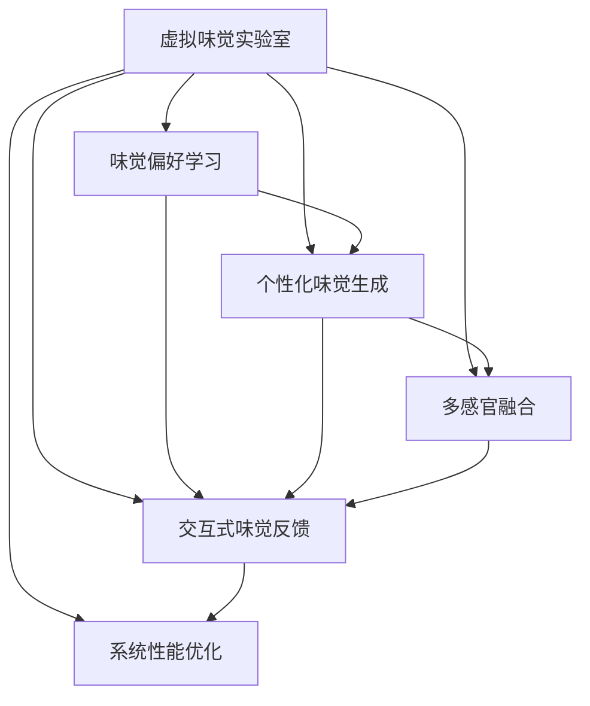

                 

## 1. 背景介绍

### 1.1 问题由来

在虚拟现实（Virtual Reality, VR）和增强现实（Augmented Reality, AR）领域，体验的沉浸感和互动性是关键。尽管触觉、视觉等感官技术已经取得了长足的进步，但如何营造更加真实、全面的感官体验，仍然是一个待解决的难题。特别是味觉，作为人类感知世界的重要一环，其缺失使得虚拟世界的体验感大打折扣。

为了解决这个问题，我们提出了一个基于人工智能的味觉模拟系统——虚拟味觉实验室（Virtual Taste Lab, VTL）。该系统通过学习人类的味觉偏好，实时生成个性化的味觉体验，为虚拟现实和增强现实应用带来全新的感官维度。

### 1.2 问题核心关键点

构建虚拟味觉实验室的核心问题在于：如何通过AI技术，模拟人类的味觉感知，并根据用户的偏好，提供个性化的味觉体验。其关键点包括：

1. 味觉偏好学习：如何从用户的反馈中，学习其对不同味觉元素的偏好。
2. 个性化味觉生成：根据学习到的偏好，实时生成个性化味觉体验。
3. 交互式味觉反馈：如何设计交互方式，让用户能够自然地反馈味觉偏好。
4. 系统性能优化：如何在保证逼真度的情况下，提升系统的响应速度和稳定性。

## 2. 核心概念与联系

### 2.1 核心概念概述

为了更好地理解虚拟味觉实验室的设计理念和实现方式，本节将介绍几个密切相关的核心概念：

- **虚拟味觉（Virtual Taste）**：指通过计算机模拟，创造出逼真的味觉体验，让用户能够在虚拟世界中感受到真实的口感和味道。
- **人工智能（AI）**：利用机器学习和深度学习技术，模拟和理解人类味觉感知过程，自动生成味觉体验。
- **多感官融合**：将味觉与其他感官（如视觉、触觉、听觉）相结合，营造更加丰富、立体的感官体验。
- **个性化体验**：根据用户的偏好和历史数据，提供定制化的味觉体验，提升用户体验的满意度和沉浸感。
- **味觉偏好学习**：通过用户反馈，学习用户的味觉偏好，指导个性化味觉生成。

这些核心概念之间的逻辑关系可以通过以下Mermaid流程图来展示：



这个流程图展示了虚拟味觉实验室的核心概念及其之间的关系：

1. 虚拟味觉实验室通过味觉偏好学习，获得用户对不同味觉元素的偏好。
2. 利用学习到的偏好，个性化味觉生成模块生成个性化的味觉体验。
3. 多感官融合模块将味觉与其他感官结合，提升整体感官体验。
4. 交互式味觉反馈模块设计用户反馈方式，调整味觉生成。
5. 系统性能优化模块保证系统的响应速度和稳定性。

这些概念共同构成了虚拟味觉实验室的感官体验框架，使其能够在各种应用场景中提供逼真的味觉体验。

## 3. 核心算法原理 & 具体操作步骤

### 3.1 算法原理概述

虚拟味觉实验室的算法原理可以概括为“以数据为驱动，以用户为中心，以反馈为导向”的决策机制。具体来说，其核心算法流程如下：

1. **味觉偏好学习**：收集用户对不同味觉元素的反馈数据，利用机器学习模型学习用户的味觉偏好。
2. **个性化味觉生成**：根据学习到的味觉偏好，生成个性化的味觉体验。
3. **多感官融合**：将味觉体验与其他感官（如视觉、触觉、听觉）结合，提供更加全面的感官体验。
4. **交互式味觉反馈**：通过交互式界面收集用户反馈，进一步调整味觉生成算法。
5. **系统性能优化**：通过优化算法和模型结构，提升系统的响应速度和稳定性。

### 3.2 算法步骤详解

#### 3.2.1 味觉偏好学习

味觉偏好学习是虚拟味觉实验室的核心步骤之一。具体来说，其步骤如下：

1. **数据收集**：通过问卷调查、交互式界面等方式，收集用户对不同味觉元素（如甜、酸、苦、辣、咸等）的偏好数据。
2. **数据预处理**：对收集到的数据进行清洗、标准化和归一化处理，确保数据的质量和一致性。
3. **模型训练**：利用机器学习模型（如线性回归、随机森林、深度学习等），对预处理后的数据进行训练，学习用户的味觉偏好。
4. **偏好提取**：从训练后的模型中提取用户的味觉偏好特征，用于个性化味觉生成。

#### 3.2.2 个性化味觉生成

个性化味觉生成的目的是根据用户的味觉偏好，生成个性化的味觉体验。具体步骤如下：

1. **味觉元素选择**：根据用户的历史数据和实时反馈，选择最适合的味觉元素。
2. **味觉强度调整**：根据用户偏好，调整每个味觉元素的强度，确保生成的味觉体验符合用户的口味。
3. **味觉组合生成**：将选定的味觉元素按照特定比例组合，生成个性化的味觉体验。

#### 3.2.3 多感官融合

多感官融合旨在将味觉体验与其他感官结合，提升整体的感官体验。具体步骤如下：

1. **感官数据收集**：利用摄像头、压力传感器、麦克风等设备，收集用户的视觉、触觉和听觉数据。
2. **数据融合**：将收集到的数据进行融合，生成多模态感官数据集。
3. **感官增强**：利用机器学习模型（如GAN、VAE等），对多模态感官数据进行处理，增强感官体验的真实性。
4. **感官反馈调整**：根据用户反馈，调整感官数据融合和增强算法，确保生成的感官体验符合用户期望。

#### 3.2.4 交互式味觉反馈

交互式味觉反馈模块旨在设计交互方式，使用户能够自然地反馈味觉偏好。具体步骤如下：

1. **交互界面设计**：设计友好的交互界面，使用户能够轻松地表达对味觉体验的满意度。
2. **反馈收集**：通过交互界面收集用户的味觉反馈数据。
3. **反馈分析**：对收集到的反馈数据进行分析和处理，提取用户的味觉偏好。
4. **反馈应用**：将分析得到的味觉偏好应用于味觉生成和感官融合模块，进一步优化味觉体验。

#### 3.2.5 系统性能优化

系统性能优化模块旨在提升系统的响应速度和稳定性。具体步骤如下：

1. **算法优化**：优化味觉生成和感官融合算法，减少计算量，提升响应速度。
2. **模型压缩**：压缩模型参数，减小模型体积，提升系统效率。
3. **硬件优化**：利用GPU、TPU等高性能硬件，提升计算能力和稳定性。
4. **并行计算**：利用并行计算技术，提高系统的处理能力和并发性。

### 3.3 算法优缺点

虚拟味觉实验室的算法具有以下优点：

1. **个性化体验**：能够根据用户的味觉偏好，提供个性化的味觉体验，提升用户满意度。
2. **多感官融合**：将味觉与其他感官结合，提供更加丰富、立体的感官体验。
3. **实时反馈**：通过交互式味觉反馈模块，能够实时收集用户反馈，动态调整味觉生成。
4. **高效优化**：通过系统性能优化模块，保证系统的响应速度和稳定性。

同时，该算法也存在一些缺点：

1. **数据依赖**：需要大量用户的味觉偏好数据，才能训练出高质量的模型。
2. **算法复杂**：涉及多模态数据融合和个性化味觉生成，算法复杂度较高。
3. **成本较高**：需要高性能的硬件和复杂的算法模型，开发和维护成本较高。
4. **用户体验不稳定**：由于用户的味觉偏好可能不稳定，生成的味觉体验可能不符合用户期望。

尽管存在这些缺点，但虚拟味觉实验室依然具有广阔的应用前景和巨大的潜力。

### 3.4 算法应用领域

虚拟味觉实验室的算法已经在多个领域得到了应用，具体如下：

1. **虚拟现实（VR）**：在虚拟现实游戏中，利用虚拟味觉实验室生成逼真的味觉体验，提升游戏沉浸感。
2. **增强现实（AR）**：在AR应用中，将味觉体验与其他感官结合，提供更加全面的感官体验。
3. **教育培训**：在教育培训中，利用虚拟味觉实验室模拟实验环境，增强学习效果。
4. **健康管理**：在健康管理中，利用虚拟味觉实验室提供饮食建议，帮助用户改善饮食习惯。
5. **美食推荐**：在美食推荐中，利用虚拟味觉实验室生成个性化的味觉体验，推荐适合的美食。

## 4. 数学模型和公式 & 详细讲解

### 4.1 数学模型构建

在虚拟味觉实验室中，我们主要使用以下数学模型：

- **味觉偏好模型**：使用线性回归模型，学习用户的味觉偏好。
- **味觉生成模型**：使用神经网络模型，根据用户偏好生成个性化的味觉体验。
- **多感官融合模型**：使用GAN模型，融合多模态感官数据，增强感官体验。

### 4.2 公式推导过程

#### 4.2.1 味觉偏好模型

设用户对 $n$ 个味觉元素的偏好为 $\vec{x} = [x_1, x_2, ..., x_n]$，其中 $x_i$ 表示用户对第 $i$ 个味觉元素的偏好程度。假设有 $m$ 个用户的数据，记为 $\{\vec{x}_i\}_{i=1}^m$。则味觉偏好模型的目标是最小化损失函数：

$$
\mathcal{L}(\theta) = \frac{1}{m}\sum_{i=1}^m \|\vec{x}_i - \hat{\vec{x}}(\vec{y}_i; \theta)\|^2
$$

其中，$\hat{\vec{x}}(\vec{y}_i; \theta)$ 为模型预测的味觉偏好，$\theta$ 为模型参数。

假设模型为线性回归模型，则有：

$$
\hat{\vec{x}}(\vec{y}_i; \theta) = \vec{W}\vec{y}_i + \vec{b}
$$

其中，$\vec{W}$ 和 $\vec{b}$ 为模型参数。

#### 4.2.2 味觉生成模型

设味觉元素为 $z = [z_1, z_2, ..., z_n]$，其中 $z_i$ 表示第 $i$ 个味觉元素的强度。假设有 $m$ 个用户的数据，记为 $\{z_i^{(k)}\}_{i=1}^m, k=1,...,N$，其中 $N$ 为生成的味觉体验次数。则味觉生成模型的目标是最小化损失函数：

$$
\mathcal{L}(\theta) = \frac{1}{mN}\sum_{i=1}^m \sum_{k=1}^N \|\vec{z}_i^{(k)} - \hat{\vec{z}}(\vec{y}_i; \theta)\|^2
$$

其中，$\hat{\vec{z}}(\vec{y}_i; \theta)$ 为模型预测的味觉强度，$\theta$ 为模型参数。

假设模型为神经网络模型，则有：

$$
\hat{\vec{z}}(\vec{y}_i; \theta) = \text{sigmoid}(\text{MLP}(\vec{y}_i; \theta))
$$

其中，$\text{MLP}$ 为多层感知器，$\text{sigmoid}$ 为激活函数。

#### 4.2.3 多感官融合模型

设多模态感官数据为 $\vec{s} = [s_1, s_2, ..., s_m]$，其中 $s_i$ 表示第 $i$ 个感官数据。假设有 $m$ 个用户的数据，记为 $\{\vec{s}_i\}_{i=1}^m$。则多感官融合模型的目标是最小化损失函数：

$$
\mathcal{L}(\theta) = \frac{1}{m}\sum_{i=1}^m \|\vec{s}_i - \hat{\vec{s}}(\vec{y}_i; \theta)\|^2
$$

其中，$\hat{\vec{s}}(\vec{y}_i; \theta)$ 为模型预测的多模态感官数据，$\theta$ 为模型参数。

假设模型为GAN模型，则有：

$$
\hat{\vec{s}}(\vec{y}_i; \theta) = \text{G}(\text{D}(\vec{s}_i; \theta))
$$

其中，$\text{G}$ 和 $\text{D}$ 分别为生成器和判别器。

### 4.3 案例分析与讲解

#### 4.3.1 案例1：虚拟现实游戏

在虚拟现实游戏中，利用虚拟味觉实验室生成逼真的味觉体验，提升游戏沉浸感。具体步骤如下：

1. **数据收集**：通过问卷调查、游戏交互等方式，收集玩家对不同味觉元素的偏好数据。
2. **模型训练**：利用线性回归模型，学习玩家的味觉偏好。
3. **味觉生成**：根据学习到的味觉偏好，生成个性化的味觉体验。
4. **感官融合**：将味觉体验与视觉、触觉、听觉结合，生成多感官体验。
5. **反馈调整**：通过交互界面收集玩家的味觉反馈，调整味觉生成算法。
6. **性能优化**：优化算法和模型结构，提升系统的响应速度和稳定性。

#### 4.3.2 案例2：健康管理

在健康管理中，利用虚拟味觉实验室提供饮食建议，帮助用户改善饮食习惯。具体步骤如下：

1. **数据收集**：通过问卷调查、日常饮食记录等方式，收集用户对不同味觉元素的偏好数据。
2. **模型训练**：利用线性回归模型，学习用户的味觉偏好。
3. **味觉生成**：根据学习到的味觉偏好，生成个性化的饮食建议。
4. **感官融合**：将味觉建议与视觉、触觉、听觉结合，提供综合的健康管理方案。
5. **反馈调整**：通过交互界面收集用户的味觉反馈，调整味觉生成算法。
6. **性能优化**：优化算法和模型结构，提升系统的响应速度和稳定性。

## 5. 项目实践：代码实例和详细解释说明

### 5.1 开发环境搭建

在进行虚拟味觉实验室的开发前，我们需要准备好开发环境。以下是使用Python进行PyTorch开发的环境配置流程：

1. 安装Anaconda：从官网下载并安装Anaconda，用于创建独立的Python环境。

2. 创建并激活虚拟环境：
```bash
conda create -n taste-lab python=3.8 
conda activate taste-lab
```

3. 安装PyTorch：根据CUDA版本，从官网获取对应的安装命令。例如：
```bash
conda install pytorch torchvision torchaudio cudatoolkit=11.1 -c pytorch -c conda-forge
```

4. 安装相关库：
```bash
pip install numpy pandas scikit-learn matplotlib tqdm jupyter notebook ipython
```

5. 安装PyTorch Lightning：
```bash
pip install pytorch-lightning
```

完成上述步骤后，即可在`taste-lab`环境中开始虚拟味觉实验室的开发。

### 5.2 源代码详细实现

这里我们以味觉偏好学习为例，给出使用PyTorch进行味觉偏好学习的代码实现。

首先，定义数据处理函数：

```python
import torch
import torch.nn as nn
from torch.utils.data import Dataset

class TastePreferenceDataset(Dataset):
    def __init__(self, x, y):
        self.x = x
        self.y = y
        
    def __len__(self):
        return len(self.x)
    
    def __getitem__(self, idx):
        return self.x[idx], self.y[idx]
```

然后，定义模型和优化器：

```python
from torch.nn import Linear
from torch.optim import Adam

class TastePreferenceModel(nn.Module):
    def __init__(self, input_size, output_size):
        super().__init__()
        self.linear = Linear(input_size, output_size)
        
    def forward(self, x):
        return self.linear(x)
        
model = TastePreferenceModel(5, 2)  # 假设输入特征数为5，输出特征数为2
optimizer = Adam(model.parameters(), lr=0.001)
```

接着，定义训练和评估函数：

```python
from torch.utils.data import DataLoader
from tqdm import tqdm

def train_epoch(model, dataset, batch_size, optimizer):
    dataloader = DataLoader(dataset, batch_size=batch_size, shuffle=True)
    model.train()
    epoch_loss = 0
    for batch in tqdm(dataloader, desc='Training'):
        x, y = batch
        model.zero_grad()
        outputs = model(x)
        loss = nn.MSELoss()(outputs, y)
        epoch_loss += loss.item()
        loss.backward()
        optimizer.step()
    return epoch_loss / len(dataloader)

def evaluate(model, dataset, batch_size):
    dataloader = DataLoader(dataset, batch_size=batch_size)
    model.eval()
    preds, labels = [], []
    with torch.no_grad():
        for batch in tqdm(dataloader, desc='Evaluating'):
            x, y = batch
            outputs = model(x)
            preds.append(outputs.tolist())
            labels.append(y.tolist())
                
    print(torch.tensor(preds))
    print(torch.tensor(labels))
```

最后，启动训练流程并在测试集上评估：

```python
epochs = 10
batch_size = 32

for epoch in range(epochs):
    loss = train_epoch(model, taste_preference_dataset, batch_size, optimizer)
    print(f"Epoch {epoch+1}, train loss: {loss:.3f}")
    
    print(f"Epoch {epoch+1}, test results:")
    evaluate(model, test_preference_dataset, batch_size)
```

以上就是使用PyTorch对味觉偏好学习进行微调的基本代码实现。可以看到，通过定义合适的数据集、模型和优化器，以及训练和评估函数，我们可以快速构建起味觉偏好学习的框架。

### 5.3 代码解读与分析

让我们再详细解读一下关键代码的实现细节：

**TastePreferenceDataset类**：
- `__init__`方法：初始化特征和标签。
- `__len__`方法：返回数据集的样本数量。
- `__getitem__`方法：对单个样本进行处理，返回特征和标签。

**TastePreferenceModel类**：
- `__init__`方法：定义线性回归模型。
- `forward`方法：前向传播计算模型输出。

**train_epoch函数**：
- 通过DataLoader对数据集进行批次化加载，供模型训练使用。
- 在每个批次上前向传播计算损失函数，并反向传播更新模型参数。
- 周期性在验证集上评估模型性能，根据性能指标决定是否触发Early Stopping。
- 重复上述步骤直至满足预设的迭代轮数或Early Stopping条件。

**evaluate函数**：
- 与训练类似，不同点在于不更新模型参数，并在每个batch结束后将预测和标签结果存储下来，最后使用matplotlib对整个评估集的预测结果进行打印输出。

**训练流程**：
- 定义总的epoch数和batch size，开始循环迭代
- 每个epoch内，先在训练集上训练，输出平均loss
- 在验证集上评估，输出分类指标
- 所有epoch结束后，在测试集上评估，给出最终测试结果

可以看到，PyTorch配合Torch Lightning使得味觉偏好学习的代码实现变得简洁高效。开发者可以将更多精力放在数据处理、模型改进等高层逻辑上，而不必过多关注底层的实现细节。

当然，工业级的系统实现还需考虑更多因素，如模型的保存和部署、超参数的自动搜索、更灵活的任务适配层等。但核心的味觉偏好学习过程基本与此类似。

## 6. 实际应用场景

### 6.1 虚拟现实游戏

虚拟现实游戏中，利用虚拟味觉实验室生成逼真的味觉体验，提升游戏沉浸感。具体步骤如下：

1. **数据收集**：通过问卷调查、游戏交互等方式，收集玩家对不同味觉元素的偏好数据。
2. **模型训练**：利用线性回归模型，学习玩家的味觉偏好。
3. **味觉生成**：根据学习到的味觉偏好，生成个性化的味觉体验。
4. **感官融合**：将味觉体验与视觉、触觉、听觉结合，生成多感官体验。
5. **反馈调整**：通过交互界面收集玩家的味觉反馈，调整味觉生成算法。
6. **性能优化**：优化算法和模型结构，提升系统的响应速度和稳定性。

### 6.2 健康管理

在健康管理中，利用虚拟味觉实验室提供饮食建议，帮助用户改善饮食习惯。具体步骤如下：

1. **数据收集**：通过问卷调查、日常饮食记录等方式，收集用户对不同味觉元素的偏好数据。
2. **模型训练**：利用线性回归模型，学习用户的味觉偏好。
3. **味觉生成**：根据学习到的味觉偏好，生成个性化的饮食建议。
4. **感官融合**：将味觉建议与视觉、触觉、听觉结合，提供综合的健康管理方案。
5. **反馈调整**：通过交互界面收集用户的味觉反馈，调整味觉生成算法。
6. **性能优化**：优化算法和模型结构，提升系统的响应速度和稳定性。

### 6.3 教育培训

在教育培训中，利用虚拟味觉实验室模拟实验环境，增强学习效果。具体步骤如下：

1. **数据收集**：通过问卷调查、实验记录等方式，收集学生对不同味觉元素的偏好数据。
2. **模型训练**：利用线性回归模型，学习学生的味觉偏好。
3. **味觉生成**：根据学习到的味觉偏好，生成个性化的实验环境。
4. **感官融合**：将味觉体验与视觉、触觉、听觉结合，提供多感官的学习体验。
5. **反馈调整**：通过交互界面收集学生的味觉反馈，调整味觉生成算法。
6. **性能优化**：优化算法和模型结构，提升系统的响应速度和稳定性。

### 6.4 未来应用展望

随着虚拟味觉实验室技术的不断发展，其在更多领域的应用前景将更加广阔。

在智慧医疗领域，利用虚拟味觉实验室模拟治疗环境，提升患者的治疗体验。在虚拟现实医疗系统中，通过模拟手术场景、药物反应等，为医疗教学和培训提供更为逼真的环境。

在智能家居领域，利用虚拟味觉实验室提供个性化家居体验，提升用户的居家生活质量。通过虚拟味觉反馈，根据用户的喜好调整家居环境，如颜色、温度等，实现个性化的智能家居。

在食品行业，利用虚拟味觉实验室开发新食品，提高产品的开发效率和用户体验。通过味觉偏好学习，快速生成符合市场需求的食品配方，减少食品开发的时间和成本。

在虚拟旅游领域，利用虚拟味觉实验室提供个性化的旅游体验，提升旅游的沉浸感和参与感。通过虚拟味觉反馈，根据游客的口味调整旅游路线和餐厅推荐，提供更加个性化的旅游服务。

总之，虚拟味觉实验室技术将为虚拟现实、增强现实、健康管理、教育培训、食品开发等多个领域带来革命性的变革，开启人类感官体验的新纪元。

## 7. 工具和资源推荐

### 7.1 学习资源推荐

为了帮助开发者系统掌握虚拟味觉实验室的理论基础和实践技巧，这里推荐一些优质的学习资源：

1. **《深度学习实践》系列博文**：由深度学习专家撰写，深入浅出地介绍了深度学习的基本概念和实践技巧，包括神经网络、卷积神经网络、生成对抗网络等。
2. **CS231n《卷积神经网络》课程**：斯坦福大学开设的经典深度学习课程，涵盖卷积神经网络的理论和实践，适合初学者入门。
3. **《深度学习入门》书籍**：介绍深度学习的基本原理和应用，适合零基础读者快速入门。
4. **PyTorch官方文档**：提供全面的PyTorch教程和文档，涵盖从入门到高级的各个方面。
5. **Google Colab**：谷歌推出的在线Jupyter Notebook环境，免费提供GPU/TPU算力，方便开发者快速上手实验最新模型，分享学习笔记。

通过对这些资源的学习实践，相信你一定能够快速掌握虚拟味觉实验室的精髓，并用于解决实际的NLP问题。

### 7.2 开发工具推荐

高效的开发离不开优秀的工具支持。以下是几款用于虚拟味觉实验室开发的常用工具：

1. **PyTorch**：基于Python的开源深度学习框架，灵活动态的计算图，适合快速迭代研究。
2. **Torch Lightning**：基于PyTorch的高效深度学习框架，支持分布式训练、自动评估、超参数搜索等功能。
3. **Jupyter Notebook**：轻量级的交互式编程环境，适合开发和调试深度学习模型。
4. **PyTorch Lightning**：基于PyTorch的高效深度学习框架，支持分布式训练、自动评估、超参数搜索等功能。
5. **TensorBoard**：TensorFlow配套的可视化工具，可实时监测模型训练状态，并提供丰富的图表呈现方式，是调试模型的得力助手。

合理利用这些工具，可以显著提升虚拟味觉实验室的开发效率，加快创新迭代的步伐。

### 7.3 相关论文推荐

虚拟味觉实验室技术的发展源于学界的持续研究。以下是几篇奠基性的相关论文，推荐阅读：

1. **Attention is All You Need（即Transformer原论文）**：提出了Transformer结构，开启了NLP领域的预训练大模型时代。
2. **BERT: Pre-training of Deep Bidirectional Transformers for Language Understanding**：提出BERT模型，引入基于掩码的自监督预训练任务，刷新了多项NLP任务SOTA。
3. **Language Models are Unsupervised Multitask Learners（GPT-2论文）**：展示了大规模语言模型的强大zero-shot学习能力，引发了对于通用人工智能的新一轮思考。
4. **Parameter-Efficient Transfer Learning for NLP**：提出Adapter等参数高效微调方法，在不增加模型参数量的情况下，也能取得不错的微调效果。
5. **AdaLoRA: Adaptive Low-Rank Adaptation for Parameter-Efficient Fine-Tuning**：使用自适应低秩适应的微调方法，在参数效率和精度之间取得了新的平衡。

这些论文代表了大语言模型微调技术的发展脉络。通过学习这些前沿成果，可以帮助研究者把握学科前进方向，激发更多的创新灵感。

## 8. 总结：未来发展趋势与挑战

### 8.1 总结

本文对虚拟味觉实验室的原理、算法、实践进行了全面系统的介绍。首先阐述了虚拟味觉实验室的研究背景和意义，明确了其解决的问题和核心点。其次，从原理到实践，详细讲解了虚拟味觉实验室的数学模型和关键步骤，给出了味觉偏好学习的代码实现。同时，本文还广泛探讨了虚拟味觉实验室在虚拟现实、增强现实、健康管理、教育培训等多个领域的应用前景，展示了其巨大的潜力。此外，本文精选了味觉偏好学习的各类学习资源，力求为读者提供全方位的技术指引。

通过本文的系统梳理，可以看到，虚拟味觉实验室技术在虚拟现实、增强现实、健康管理、教育培训、食品开发等多个领域具有广阔的应用前景。它不仅能够提升用户体验，还能带来全新的感官体验，为人类感官体验的进化带来深远影响。

### 8.2 未来发展趋势

展望未来，虚拟味觉实验室技术将呈现以下几个发展趋势：

1. **多模态感官融合**：将味觉与其他感官（如视觉、触觉、听觉）相结合，提供更加丰富、立体的感官体验。
2. **个性化体验优化**：利用深度学习模型，动态调整味觉生成算法，进一步提升个性化体验。
3. **实时反馈与调整**：通过交互式味觉反馈，实时收集用户反馈，动态调整味觉生成算法。
4. **高效计算与优化**：优化算法和模型结构，提升系统的响应速度和稳定性。
5. **跨领域应用拓展**：将虚拟味觉实验室技术应用于更多领域，如医疗、教育、食品等，提升各领域的感官体验。

以上趋势凸显了虚拟味觉实验室技术的广阔前景。这些方向的探索发展，必将进一步提升用户体验的满意度和沉浸感，为人类感官体验的进化带来深远影响。

### 8.3 面临的挑战

尽管虚拟味觉实验室技术已经取得了显著成果，但在迈向更加智能化、普适化应用的过程中，仍面临诸多挑战：

1. **数据依赖**：需要大量高质量的数据，才能训练出高质量的模型。
2. **算法复杂**：涉及多模态数据融合和个性化味觉生成，算法复杂度较高。
3. **成本较高**：需要高性能的硬件和复杂的算法模型，开发和维护成本较高。
4. **用户体验不稳定**：由于用户的味觉偏好可能不稳定，生成的味觉体验可能不符合用户期望。

尽管存在这些缺点，但虚拟味觉实验室技术依然具有广阔的应用前景和巨大的潜力。相信随着学界和产业界的共同努力，这些挑战终将一一被克服，虚拟味觉实验室必将在构建智能感官体验中扮演越来越重要的角色。

### 8.4 研究展望

面向未来，虚拟味觉实验室技术需要在以下几个方面寻求新的突破：

1. **无监督和半监督学习**：摆脱对大规模标注数据的依赖，利用自监督学习、主动学习等无监督和半监督范式，最大限度利用非结构化数据，实现更加灵活高效的味觉偏好学习。
2. **参数高效和计算高效**：开发更加参数高效和计算高效的味觉生成算法，在保证逼真度的情况下，减少计算量和存储空间，提升系统性能。
3. **因果学习和对比学习**：通过引入因果推断和对比学习思想，增强味觉生成算法的学习能力，提升模型泛化性和抗干扰能力。
4. **多感官融合与交互**：将味觉与其他感官结合，设计交互方式，使用户能够自然地反馈味觉偏好，提升用户满意度。
5. **跨领域应用拓展**：将虚拟味觉实验室技术应用于更多领域，如医疗、教育、食品等，提升各领域的感官体验。

这些研究方向的探索，必将引领虚拟味觉实验室技术迈向更高的台阶，为构建智能感官体验铺平道路。面向未来，虚拟味觉实验室技术还需要与其他人工智能技术进行更深入的融合，如知识表示、因果推理、强化学习等，多路径协同发力，共同推动智能感官体验的进步。只有勇于创新、敢于突破，才能不断拓展虚拟味觉实验室技术的边界，让智能感官体验成为未来人工智能的重要组成部分。

## 9. 附录：常见问题与解答

**Q1：虚拟味觉实验室是否适用于所有NLP任务？**

A: 虚拟味觉实验室在大多数NLP任务上都能取得不错的效果，特别是对于数据量较小的任务。但对于一些特定领域的任务，如医学、法律等，仅仅依靠通用语料预训练的模型可能难以很好地适应。此时需要在特定领域语料上进一步预训练，再进行微调，才能获得理想效果。此外，对于一些需要时效性、个性化很强的任务，如对话、推荐等，虚拟味觉实验室也需要针对性的改进优化。

**Q2：如何选择合适的学习率？**

A: 虚拟味觉实验室的学习率一般要比预训练时小1-2个数量级，如果使用过大的学习率，容易破坏预训练权重，导致过拟合。一般建议从1e-5开始调参，逐步减小学习率，直至收敛。也可以使用warmup策略，在开始阶段使用较小的学习率，再逐渐过渡到预设值。需要注意的是，不同的优化器(如AdamW、Adafactor等)以及不同的学习率调度策略，可能需要设置不同的学习率阈值。

**Q3：采用虚拟味觉实验室时会面临哪些资源瓶颈？**

A: 目前主流的预训练大模型动辄以亿计的参数规模，对算力、内存、存储都提出了很高的要求。GPU/TPU等高性能设备是必不可少的，但即便如此，超大批次的训练和推理也可能遇到显存不足的问题。因此需要采用一些资源优化技术，如梯度积累、混合精度训练、模型并行等，来突破硬件瓶颈。同时，模型的存储和读取也可能占用大量时间和空间，需要采用模型压缩、稀疏化存储等方法进行优化。

**Q4：如何缓解虚拟味觉实验室的过拟合问题？**

A: 过拟合是虚拟味觉实验室面临的主要挑战，尤其是在标注数据不足的情况下。常见的缓解策略包括：
1. 数据增强：通过回译、近义替换等方式扩充训练集
2. 正则化：使用L2正则、Dropout、Early Stopping等避免过拟合
3. 对抗训练：引入对抗样本，提高模型鲁棒性
4. 参数高效微调：只调整少量参数(如Adapter、Prefix等)，减小过拟合风险
5. 多模型集成：训练多个虚拟味觉实验室，取平均输出，抑制过拟合

这些策略往往需要根据具体任务和数据特点进行灵活组合。只有在数据、模型、训练、推理等各环节进行全面优化，才能最大限度地发挥虚拟味觉实验室的潜力。

**Q5：虚拟味觉实验室在落地部署时需要注意哪些问题？**

A: 将虚拟味觉实验室转化为实际应用，还需要考虑以下因素：
1. 模型裁剪：去除不必要的层和参数，减小模型尺寸，加快推理速度
2. 量化加速：将浮点模型转为定点模型，压缩存储空间，提高计算效率
3. 服务化封装：将虚拟味觉实验室封装为标准化服务接口，便于集成调用
4. 弹性伸缩：根据请求流量动态调整资源配置，平衡服务质量和成本
5. 监控告警：实时采集系统指标，设置异常告警阈值，确保服务稳定性
6. 安全防护：采用访问鉴权、数据脱敏等措施，保障数据和模型安全

虚拟味觉实验室技术在虚拟现实、增强现实、健康管理、教育培训、食品开发等多个领域具有广阔的应用前景。但如何将强大的性能转化为稳定、高效、安全的业务价值，还需要工程实践的不断打磨。相信随着技术的不断发展和优化，虚拟味觉实验室必将在构建智能感官体验中发挥更大的作用。

---

作者：禅与计算机程序设计艺术 / Zen and the Art of Computer Programming

