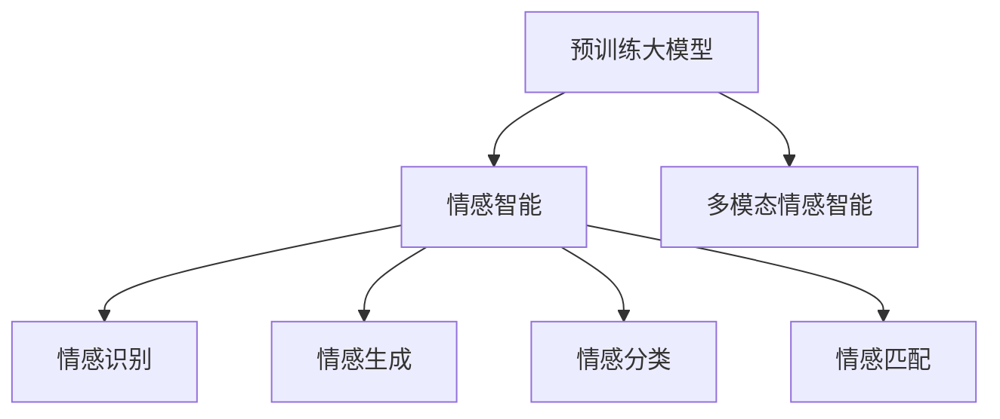

                 

## 1. 背景介绍

### 1.1 问题由来
情感智能，指的是机器或系统理解和处理人类情感的能力。这一领域的研究和应用，已成为人工智能领域的一个热门方向。情感智能的提升，不仅有助于改善人机交互体验，提升用户体验，还能在心理辅导、市场营销、安全监控等诸多场景中发挥重要作用。

随着深度学习、自然语言处理（NLP）等技术的进步，情感智能的实现有了显著突破。现代情感智能系统能够通过语音、文本、图像等形式捕捉人类情感，并进行情感分析和情感生成。但这些技术在实际应用中仍存在诸多挑战。比如，如何准确理解细微的情感变化？如何在跨文化、多模态场景下保持一致的情感识别准确度？如何生成自然流畅、符合情境的情感回应？

### 1.2 问题核心关键点
为了解答这些问题，情感智能的研究者不断尝试从多个角度切入，包括情感识别、情感生成、情感分类、情感匹配等。但这些方法往往存在一些共同的局限性：

- **数据依赖**：情感智能的训练和优化依赖于大量标注数据，数据收集和标注成本高，且存在数据偏置问题。
- **鲁棒性不足**：情感识别系统在面对情感多样性、噪声干扰等情况时，准确率可能大幅下降。
- **语境忽视**：情感生成模型往往忽略了输入文本的语境，生成的情感回应不够自然和合适。
- **跨文化适应性差**：情感智能系统在处理不同文化背景下的情感表达时，可能存在理解偏差和回应不当。

为解决上述问题，研究人员提出了基于预训练大模型（如GPT-3）的情感智能模型，这些模型通过在大规模无标签文本语料上进行预训练，学习到丰富的语言知识，能够更好地适应复杂的情感处理任务。本文将重点讨论基于预训练大模型的情感智能模型，并详细阐述其核心算法原理与具体操作步骤。

## 2. 核心概念与联系

### 2.1 核心概念概述

为了更好地理解基于预训练大模型的情感智能模型，本节将介绍几个关键概念：

- **预训练大模型(Pre-trained Large Model)**：如GPT-3、BERT等大规模预训练语言模型，通过在大规模无标签文本语料上进行自监督学习，学习到通用的语言表示，具备强大的语言理解和生成能力。
- **情感智能(Emotion Intelligence)**：指机器或系统理解、处理人类情感的能力，包括情感识别、情感生成、情感分类、情感匹配等任务。
- **多模态情感智能(Multimodal Emotion Intelligence)**：融合语音、文本、图像等多种模态信息进行情感处理的智能系统，能够更全面、准确地理解人类情感。
- **情感生成(Emotion Generation)**：基于输入文本或上下文信息，生成符合情感语境的自然语言文本。
- **情感匹配(Emotion Matching)**：通过分析输入文本的情感特征，匹配出对应的情感回应。

这些概念之间的关系可以通过以下Mermaid流程图来展示：



这个流程图展示了大模型在情感智能领域中的核心作用：

1. 预训练大模型提供通用的语言表示，是情感智能的基础。
2. 情感智能通过理解人类情感，能够进行情感识别、生成、分类和匹配。
3. 多模态情感智能进一步融合多种模态信息，提升情感处理的准确性和鲁棒性。

## 3. 核心算法原理 & 具体操作步骤
### 3.1 算法原理概述

基于预训练大模型的情感智能模型，其核心算法原理可以概括为：

- **预训练**：在大规模无标签文本数据上，通过自监督学习任务训练通用语言模型。
- **微调**：在特定情感任务上，使用少量标注数据对预训练模型进行有监督微调，使其具备情感处理能力。
- **融合与优化**：在多模态情感智能任务中，融合多种模态信息，进行情感处理的优化。

形式化地，假设预训练模型为 $M_{\theta}$，其中 $\theta$ 为预训练得到的模型参数。给定情感任务 $T$ 的标注数据集 $D=\{(x_i, y_i)\}_{i=1}^N$，情感智能模型的微调目标为：

$$
\theta^* = \mathop{\arg\min}_{\theta} \mathcal{L}(M_{\theta},D)
$$

其中 $\mathcal{L}$ 为针对情感任务 $T$ 设计的损失函数，用于衡量模型预测输出与真实标签之间的差异。常见的损失函数包括交叉熵损失、均方误差损失等。

### 3.2 算法步骤详解

基于预训练大模型的情感智能模型，其微调过程一般包括以下关键步骤：

**Step 1: 准备预训练模型和数据集**
- 选择合适的预训练语言模型 $M_{\theta}$ 作为初始化参数，如GPT-3、BERT等。
- 准备情感任务 $T$ 的标注数据集 $D$，划分为训练集、验证集和测试集。一般要求标注数据与预训练数据的分布不要差异过大。

**Step 2: 添加任务适配层**
- 根据任务类型，在预训练模型顶层设计合适的输出层和损失函数。
- 对于情感分类任务，通常在顶层添加线性分类器和交叉熵损失函数。
- 对于情感生成任务，通常使用语言模型的解码器输出概率分布，并以负对数似然为损失函数。

**Step 3: 设置微调超参数**
- 选择合适的优化算法及其参数，如 AdamW、SGD 等，设置学习率、批大小、迭代轮数等。
- 设置正则化技术及强度，包括权重衰减、Dropout、Early Stopping 等。
- 确定冻结预训练参数的策略，如仅微调顶层，或全部参数都参与微调。

**Step 4: 执行梯度训练**
- 将训练集数据分批次输入模型，前向传播计算损失函数。
- 反向传播计算参数梯度，根据设定的优化算法和学习率更新模型参数。
- 周期性在验证集上评估模型性能，根据性能指标决定是否触发 Early Stopping。
- 重复上述步骤直到满足预设的迭代轮数或 Early Stopping 条件。

**Step 5: 测试和部署**
- 在测试集上评估微调后模型 $M_{\hat{\theta}}$ 的性能，对比微调前后的精度提升。
- 使用微调后的模型对新样本进行推理预测，集成到实际的应用系统中。
- 持续收集新的数据，定期重新微调模型，以适应数据分布的变化。

以上是基于预训练大模型的情感智能模型的微调过程的一般流程。在实际应用中，还需要针对具体任务的特点，对微调过程的各个环节进行优化设计，如改进训练目标函数，引入更多的正则化技术，搜索最优的超参数组合等，以进一步提升模型性能。

### 3.3 算法优缺点

基于预训练大模型的情感智能模型，其优缺点如下：

**优点**：

- **通用性**：预训练大模型具备通用的语言表示，可以应用于各种情感智能任务。
- **效率高**：微调过程可以显著提升模型在特定情感任务上的性能，所需的时间和标注成本相对较低。
- **多样性**：结合多模态信息，可以处理语音、图像等多种形式的情感数据。

**缺点**：

- **依赖标注数据**：微调效果依赖于标注数据的质量和数量，获取高质量标注数据的成本较高。
- **跨文化适应性差**：预训练模型往往基于特定文化和语言的文本语料进行训练，可能无法很好地适应跨文化情感表达。
- **鲁棒性不足**：情感智能模型面对复杂情感和多模态场景时，准确率可能下降。
- **可解释性不足**：微调模型的决策过程通常缺乏可解释性，难以对其推理逻辑进行分析和调试。

尽管存在这些局限性，但就目前而言，基于预训练大模型的情感智能模型仍是最主流范式。未来相关研究的重点在于如何进一步降低微调对标注数据的依赖，提高模型的少样本学习和跨文化适应能力，同时兼顾可解释性和伦理安全性等因素。

### 3.4 算法应用领域

基于预训练大模型的情感智能模型，在情感识别、情感生成、情感分类、情感匹配等多个情感智能领域中得到了广泛应用。

- **情感识别**：通过分析文本、语音、图像等形式的人类情感表达，识别出情感类别。广泛应用于客服系统、心理健康分析等场景。
- **情感生成**：基于输入文本或上下文信息，生成符合情感语境的自然语言文本。用于虚拟客服、情感对话系统、情感生成对话等。
- **情感分类**：将输入文本分类为积极、消极、中性等情感类别。用于舆情监测、品牌情感分析等。
- **情感匹配**：匹配输入文本的情感特征，生成符合语境的情感回应。用于虚拟助手、情感推荐系统等。

除了上述这些经典应用外，情感智能技术还被创新性地应用到更多场景中，如情感驱动的虚拟角色设计、情感驱动的动画制作、情感驱动的社交媒体分析等，为情感智能技术带来了新的应用方向。

## 4. 数学模型和公式 & 详细讲解  
### 4.1 数学模型构建

本节将使用数学语言对基于预训练大模型的情感智能模型进行更加严格的刻画。

记预训练语言模型为 $M_{\theta}$，其中 $\theta$ 为预训练得到的模型参数。假设情感任务 $T$ 的训练集为 $D=\{(x_i,y_i)\}_{i=1}^N$，其中 $x_i$ 为输入文本，$y_i$ 为情感标签（情感类别或情感强度）。

定义模型 $M_{\theta}$ 在输入 $x$ 上的损失函数为 $\ell(M_{\theta}(x),y)$，则在数据集 $D$ 上的经验风险为：

$$
\mathcal{L}(\theta) = \frac{1}{N} \sum_{i=1}^N \ell(M_{\theta}(x_i),y_i)
$$

微调的优化目标是最小化经验风险，即找到最优参数：

$$
\theta^* = \mathop{\arg\min}_{\theta} \mathcal{L}(\theta)
$$

在实践中，我们通常使用基于梯度的优化算法（如SGD、Adam等）来近似求解上述最优化问题。设 $\eta$ 为学习率，$\lambda$ 为正则化系数，则参数的更新公式为：

$$
\theta \leftarrow \theta - \eta \nabla_{\theta}\mathcal{L}(\theta) - \eta\lambda\theta
$$

其中 $\nabla_{\theta}\mathcal{L}(\theta)$ 为损失函数对参数 $\theta$ 的梯度，可通过反向传播算法高效计算。

### 4.2 公式推导过程

以下我们以情感分类任务为例，推导交叉熵损失函数及其梯度的计算公式。

假设模型 $M_{\theta}$ 在输入 $x$ 上的输出为 $\hat{y}=M_{\theta}(x) \in [0,1]$，表示样本属于正类的概率。真实标签 $y \in \{0,1\}$。则二分类交叉熵损失函数定义为：

$$
\ell(M_{\theta}(x),y) = -[y\log \hat{y} + (1-y)\log (1-\hat{y})]
$$

将其代入经验风险公式，得：

$$
\mathcal{L}(\theta) = -\frac{1}{N}\sum_{i=1}^N [y_i\log M_{\theta}(x_i)+(1-y_i)\log(1-M_{\theta}(x_i))]
$$

根据链式法则，损失函数对参数 $\theta_k$ 的梯度为：

$$
\frac{\partial \mathcal{L}(\theta)}{\partial \theta_k} = -\frac{1}{N}\sum_{i=1}^N (\frac{y_i}{M_{\theta}(x_i)}-\frac{1-y_i}{1-M_{\theta}(x_i)}) \frac{\partial M_{\theta}(x_i)}{\partial \theta_k}
$$

其中 $\frac{\partial M_{\theta}(x_i)}{\partial \theta_k}$ 可进一步递归展开，利用自动微分技术完成计算。

在得到损失函数的梯度后，即可带入参数更新公式，完成模型的迭代优化。重复上述过程直至收敛，最终得到适应情感任务的最优模型参数 $\theta^*$。

## 5. 项目实践：代码实例和详细解释说明
### 5.1 开发环境搭建

在进行情感智能模型微调实践前，我们需要准备好开发环境。以下是使用Python进行PyTorch开发的环境配置流程：

1. 安装Anaconda：从官网下载并安装Anaconda，用于创建独立的Python环境。

2. 创建并激活虚拟环境：
```bash
conda create -n pytorch-env python=3.8 
conda activate pytorch-env
```

3. 安装PyTorch：根据CUDA版本，从官网获取对应的安装命令。例如：
```bash
conda install pytorch torchvision torchaudio cudatoolkit=11.1 -c pytorch -c conda-forge
```

4. 安装Transformers库：
```bash
pip install transformers
```

5. 安装各类工具包：
```bash
pip install numpy pandas scikit-learn matplotlib tqdm jupyter notebook ipython
```

完成上述步骤后，即可在`pytorch-env`环境中开始情感智能模型微调的实践。

### 5.2 源代码详细实现

下面我们以情感分类任务为例，给出使用Transformers库对BERT模型进行情感分类任务的微调PyTorch代码实现。

首先，定义情感分类任务的数据处理函数：

```python
from transformers import BertTokenizer
from torch.utils.data import Dataset
import torch

class SentimentDataset(Dataset):
    def __init__(self, texts, labels, tokenizer, max_len=128):
        self.texts = texts
        self.labels = labels
        self.tokenizer = tokenizer
        self.max_len = max_len
        
    def __len__(self):
        return len(self.texts)
    
    def __getitem__(self, item):
        text = self.texts[item]
        label = self.labels[item]
        
        encoding = self.tokenizer(text, return_tensors='pt', max_length=self.max_len, padding='max_length', truncation=True)
        input_ids = encoding['input_ids'][0]
        attention_mask = encoding['attention_mask'][0]
        
        # 对label进行one-hot编码
        label = torch.tensor(label, dtype=torch.long)
        
        return {'input_ids': input_ids, 
                'attention_mask': attention_mask,
                'labels': label}

# 创建dataset
tokenizer = BertTokenizer.from_pretrained('bert-base-cased')

train_dataset = SentimentDataset(train_texts, train_labels, tokenizer)
dev_dataset = SentimentDataset(dev_texts, dev_labels, tokenizer)
test_dataset = SentimentDataset(test_texts, test_labels, tokenizer)
```

然后，定义模型和优化器：

```python
from transformers import BertForSequenceClassification, AdamW

model = BertForSequenceClassification.from_pretrained('bert-base-cased', num_labels=2)

optimizer = AdamW(model.parameters(), lr=2e-5)
```

接着，定义训练和评估函数：

```python
from torch.utils.data import DataLoader
from tqdm import tqdm
from sklearn.metrics import accuracy_score, precision_score, recall_score, f1_score

device = torch.device('cuda') if torch.cuda.is_available() else torch.device('cpu')
model.to(device)

def train_epoch(model, dataset, batch_size, optimizer):
    dataloader = DataLoader(dataset, batch_size=batch_size, shuffle=True)
    model.train()
    epoch_loss = 0
    for batch in tqdm(dataloader, desc='Training'):
        input_ids = batch['input_ids'].to(device)
        attention_mask = batch['attention_mask'].to(device)
        labels = batch['labels'].to(device)
        model.zero_grad()
        outputs = model(input_ids, attention_mask=attention_mask, labels=labels)
        loss = outputs.loss
        epoch_loss += loss.item()
        loss.backward()
        optimizer.step()
    return epoch_loss / len(dataloader)

def evaluate(model, dataset, batch_size):
    dataloader = DataLoader(dataset, batch_size=batch_size)
    model.eval()
    preds, labels = [], []
    with torch.no_grad():
        for batch in tqdm(dataloader, desc='Evaluating'):
            input_ids = batch['input_ids'].to(device)
            attention_mask = batch['attention_mask'].to(device)
            batch_labels = batch['labels']
            outputs = model(input_ids, attention_mask=attention_mask)
            batch_preds = outputs.logits.argmax(dim=2).to('cpu').tolist()
            batch_labels = batch_labels.to('cpu').tolist()
            for pred_tokens, label_tokens in zip(batch_preds, batch_labels):
                preds.append(pred_tokens)
                labels.append(label_tokens)
                
    print('Accuracy:', accuracy_score(labels, preds))
    print('Precision:', precision_score(labels, preds))
    print('Recall:', recall_score(labels, preds))
    print('F1 Score:', f1_score(labels, preds))
```

最后，启动训练流程并在测试集上评估：

```python
epochs = 5
batch_size = 16

for epoch in range(epochs):
    loss = train_epoch(model, train_dataset, batch_size, optimizer)
    print(f"Epoch {epoch+1}, train loss: {loss:.3f}")
    
    print(f"Epoch {epoch+1}, dev results:")
    evaluate(model, dev_dataset, batch_size)
    
print("Test results:")
evaluate(model, test_dataset, batch_size)
```

以上就是使用PyTorch对BERT进行情感分类任务微调的完整代码实现。可以看到，得益于Transformers库的强大封装，我们可以用相对简洁的代码完成BERT模型的加载和微调。

### 5.3 代码解读与分析

让我们再详细解读一下关键代码的实现细节：

**SentimentDataset类**：
- `__init__`方法：初始化文本、标签、分词器等关键组件。
- `__len__`方法：返回数据集的样本数量。
- `__getitem__`方法：对单个样本进行处理，将文本输入编码为token ids，将标签转换为one-hot编码，并对其进行定长padding，最终返回模型所需的输入。

**模型和优化器**：
- 使用BertForSequenceClassification类，指定模型输出层为二分类头，num_labels设置为2。
- 设置AdamW优化器，学习率为2e-5。

**训练和评估函数**：
- 使用PyTorch的DataLoader对数据集进行批次化加载，供模型训练和推理使用。
- 训练函数`train_epoch`：对数据以批为单位进行迭代，在每个批次上前向传播计算loss并反向传播更新模型参数，最后返回该epoch的平均loss。
- 评估函数`evaluate`：与训练类似，不同点在于不更新模型参数，并在每个batch结束后将预测和标签结果存储下来，最后使用sklearn的多种分类指标对整个评估集的预测结果进行打印输出。

**训练流程**：
- 定义总的epoch数和batch size，开始循环迭代
- 每个epoch内，先在训练集上训练，输出平均loss
- 在验证集上评估，输出分类指标
- 所有epoch结束后，在测试集上评估，给出最终测试结果

可以看到，PyTorch配合Transformers库使得BERT微调的代码实现变得简洁高效。开发者可以将更多精力放在数据处理、模型改进等高层逻辑上，而不必过多关注底层的实现细节。

当然，工业级的系统实现还需考虑更多因素，如模型的保存和部署、超参数的自动搜索、更灵活的任务适配层等。但核心的微调范式基本与此类似。

## 6. 实际应用场景
### 6.1 智能客服系统

基于情感智能技术，智能客服系统能够更准确地理解客户的情感状态，提供更贴心的服务。传统的客服系统往往依赖人工，响应时间长，且难以处理复杂情感。而使用情感智能技术构建的智能客服系统，可以实时分析客户情感，根据情感状态自动调整服务策略，提供更加个性化的客服体验。

在技术实现上，可以收集客户的历史客服对话记录，标注出客户的情感状态，在此基础上对预训练情感智能模型进行微调。微调后的情感智能模型能够自动理解客户情感，匹配最合适的客服策略，自动回复客户的咨询和需求。对于客户提出的新问题，还可以接入检索系统实时搜索相关内容，动态组织生成回答。如此构建的智能客服系统，能大幅提升客户咨询体验和问题解决效率。

### 6.2 金融舆情监测

金融机构需要实时监测市场舆论动向，以便及时应对负面信息传播，规避金融风险。传统的舆情监测方式成本高、效率低，难以应对网络时代海量信息爆发的挑战。基于情感智能技术的舆情监测系统，能够自动分析网络上的情感信息，识别出市场波动趋势，及时预警风险。

具体而言，可以收集金融领域相关的新闻、报道、评论等文本数据，并对其进行情感标注。在此基础上对预训练情感智能模型进行微调，使其能够自动判断文本属于何种情感状态，情感倾向是正面、中性还是负面。将微调后的模型应用到实时抓取的网络文本数据，就能够自动监测不同情感状态下的市场变化，一旦发现负面情感激增等异常情况，系统便会自动预警，帮助金融机构快速应对潜在风险。

### 6.3 个性化推荐系统

当前的推荐系统往往只依赖用户的历史行为数据进行物品推荐，无法深入理解用户的真实兴趣偏好。基于情感智能技术的推荐系统，可以更好地挖掘用户行为背后的情感信息，从而提供更精准、多样的推荐内容。

在实践中，可以收集用户浏览、点击、评论、分享等行为数据，提取和用户交互的物品标题、描述、标签等文本内容。将文本内容作为模型输入，用户的后续行为（如是否点击、购买等）作为监督信号，在此基础上微调预训练情感智能模型。微调后的模型能够从文本内容中准确把握用户的情感偏好。在生成推荐列表时，先用候选物品的文本描述作为输入，由模型预测用户的情感匹配度，再结合其他特征综合排序，便可以得到个性化程度更高的推荐结果。

### 6.4 未来应用展望

随着情感智能技术的不断进步，其应用场景将不断拓展，为各行各业带来新的变革。

在智慧医疗领域，情感智能技术可应用于心理健康分析、情感驱动的虚拟护理助手等，提升患者的情感体验和心理状况监测。

在智能教育领域，情感智能技术可应用于情感驱动的智能辅导、情感驱动的课堂互动等，提升教育效果和学生的情感智能水平。

在智慧城市治理中，情感智能技术可应用于城市事件监测、情感驱动的城市规划等，提高城市管理的自动化和智能化水平，构建更和谐的人居环境。

此外，在企业生产、社会治理、文娱传媒等众多领域，情感智能技术也将不断涌现，为经济社会发展注入新的活力。相信随着技术的日益成熟，情感智能技术必将在构建和谐人机交互中发挥越来越重要的作用。

## 7. 工具和资源推荐
### 7.1 学习资源推荐

为了帮助开发者系统掌握情感智能技术，这里推荐一些优质的学习资源：

1. 《深度学习与情感智能》系列博文：由情感智能技术专家撰写，深入浅出地介绍了情感智能技术的基本概念和核心算法。

2. 《情感智能：理论与应用》课程：由知名大学开设的情感智能技术课程，系统讲解情感智能的理论基础和实际应用。

3. 《情感智能算法与模型》书籍：全面介绍了情感智能算法的原理和实现方法，是情感智能技术开发的重要参考书。

4. Kaggle情感智能数据集：包含多种情感分类、情感生成任务的数据集，是情感智能技术学习实践的必备数据资源。

5. HuggingFace官方文档：Transformers库的官方文档，提供了海量情感智能模型的样例代码，是上手实践的重要资料。

通过对这些资源的学习实践，相信你一定能够快速掌握情感智能技术，并用于解决实际的情感智能问题。
### 7.2 开发工具推荐

高效的情感智能系统开发离不开优秀的工具支持。以下是几款用于情感智能系统开发的常用工具：

1. PyTorch：基于Python的开源深度学习框架，灵活的计算图，适合快速迭代研究。大量情感智能模型都有PyTorch版本的实现。

2. TensorFlow：由Google主导开发的开源深度学习框架，生产部署方便，适合大规模工程应用。同样有丰富的情感智能模型资源。

3. Transformers库：HuggingFace开发的情感智能工具库，集成了众多情感智能模型，支持PyTorch和TensorFlow，是情感智能开发的重要工具。

4. Weights & Biases：模型训练的实验跟踪工具，可以记录和可视化模型训练过程中的各项指标，方便对比和调优。与主流深度学习框架无缝集成。

5. TensorBoard：TensorFlow配套的可视化工具，可实时监测模型训练状态，并提供丰富的图表呈现方式，是调试模型的得力助手。

6. Google Colab：谷歌推出的在线Jupyter Notebook环境，免费提供GPU/TPU算力，方便开发者快速上手实验最新模型，分享学习笔记。

合理利用这些工具，可以显著提升情感智能系统的开发效率，加快创新迭代的步伐。

### 7.3 相关论文推荐

情感智能技术的发展源于学界的持续研究。以下是几篇奠基性的相关论文，推荐阅读：

1. Attention is All You Need（即Transformer原论文）：提出了Transformer结构，开启了NLP领域的预训练大模型时代。

2. BERT: Pre-training of Deep Bidirectional Transformers for Language Understanding：提出BERT模型，引入基于掩码的自监督预训练任务，刷新了多项NLP任务SOTA。

3. Sentiment Analysis via Multi-Task Learning（MFormer情感分析）：提出多任务学习的情感智能模型，实现了情感智能与任务相关的情感识别、情感生成等多任务的联合训练。

4. Emotion-Driven Conversational Agents（情感驱动对话系统）：提出情感智能驱动的对话系统，通过情感智能技术提升对话系统的自然流畅性和用户体验。

5. Multi-Task Attention in LSTM Neural Networks（LSTM情感智能模型）：提出多任务注意机制的情感智能模型，提升了情感智能系统的鲁棒性和泛化能力。

这些论文代表了大情感智能技术的发展脉络。通过学习这些前沿成果，可以帮助研究者把握学科前进方向，激发更多的创新灵感。

## 8. 总结：未来发展趋势与挑战

### 8.1 总结

本文对基于预训练大模型的情感智能模型进行了全面系统的介绍。首先阐述了情感智能的研究背景和意义，明确了情感智能在提升人机交互体验、心理健康监测等方面的价值。其次，从原理到实践，详细讲解了情感智能的数学原理和关键步骤，给出了情感智能模型微调的完整代码实例。同时，本文还广泛探讨了情感智能在智能客服、金融舆情、个性化推荐等多个行业领域的应用前景，展示了情感智能技术在实际场景中的强大潜力。此外，本文精选了情感智能技术的各类学习资源，力求为读者提供全方位的技术指引。

通过本文的系统梳理，可以看到，基于预训练大模型的情感智能模型正在成为情感智能技术的重要范式，极大地拓展了情感智能的应用边界，推动了情感智能技术的产业化进程。未来，伴随预训练大模型和情感智能技术的持续演进，相信情感智能系统必将在更广阔的应用领域发挥重要作用，深刻影响人类的情感体验和生活方式。

### 8.2 未来发展趋势

展望未来，情感智能技术将呈现以下几个发展趋势：

1. **模型规模持续增大**：随着算力成本的下降和数据规模的扩张，情感智能模型的参数量还将持续增长。超大情感智能模型蕴含的丰富情感知识，有望支撑更加复杂多变的情感处理任务。

2. **情感智能与多模态融合**：情感智能技术将融合语音、文本、图像等多种模态信息，提升情感处理的准确性和鲁棒性。多模态情感智能系统能够更全面、准确地理解人类情感。

3. **参数高效微调**：未来的情感智能模型将更加注重参数效率，开发更多参数高效的微调方法，如Prompt Tuning、LoRA等，在保证性能的同时，减小计算资源消耗。

4. **实时化、个性化**：情感智能系统将更加注重实时性和个性化，能够根据用户的情感状态和历史行为，动态调整情感回应策略，提供更加个性化的情感服务。

5. **跨文化适应性增强**：情感智能系统将更加注重跨文化适应性，能够自动适应不同文化背景下的情感表达和情感处理。

6. **情感智能系统的标准化**：随着情感智能技术的广泛应用，情感智能系统的标准化、规范化将成为一个重要课题，相关标准和规范将逐渐建立和完善。

以上趋势凸显了情感智能技术的广阔前景。这些方向的探索发展，必将进一步提升情感智能系统的性能和应用范围，为人类情感智能的进化带来深远影响。

### 8.3 面临的挑战

尽管情感智能技术已经取得了显著成就，但在迈向更加智能化、普适化应用的过程中，它仍面临诸多挑战：

1. **标注成本高**：情感智能模型的训练和优化依赖于大量标注数据，数据收集和标注成本高，且存在数据偏置问题。如何降低标注成本，提高数据质量，仍是亟待解决的问题。

2. **情感多样性挑战**：情感智能模型在面对情感多样性和细微情感变化时，准确率可能下降。如何提高情感智能模型的鲁棒性，适应复杂多变的情感表达，是一个重要课题。

3. **情感理解的上下文依赖**：情感智能系统往往忽视输入文本的上下文，生成的情感回应可能不够自然和合适。如何增强情感智能模型的上下文理解能力，是一个重要的研究方向。

4. **跨文化适应性差**：情感智能模型在处理不同文化背景下的情感表达时，可能存在理解偏差和回应不当。如何增强情感智能系统的跨文化适应性，是一个亟待解决的问题。

5. **可解释性不足**：情感智能模型的决策过程通常缺乏可解释性，难以对其推理逻辑进行分析和调试。如何赋予情感智能模型更强的可解释性，是一个重要课题。

6. **伦理和安全问题**：情感智能模型可能学习到有偏见、有害的信息，通过微调传递到下游任务，产生误导性、歧视性的输出，给实际应用带来安全隐患。如何从数据和算法层面消除模型偏见，避免恶意用途，确保输出的安全性，是一个重要课题。

正视情感智能面临的这些挑战，积极应对并寻求突破，将是大情感智能技术走向成熟的必由之路。相信随着学界和产业界的共同努力，这些挑战终将一一被克服，情感智能技术必将在构建和谐人机交互中发挥越来越重要的作用。

### 8.4 研究展望

面对情感智能技术面临的挑战，未来的研究需要在以下几个方面寻求新的突破：

1. **无监督和半监督学习**：摆脱对大规模标注数据的依赖，利用自监督学习、主动学习等无监督和半监督范式，最大限度利用非结构化数据，实现更加灵活高效的情感智能系统。

2. **多任务学习**：将情感智能模型进行多任务联合训练，提高模型泛化性和鲁棒性，适应不同情感处理任务。

3. **跨文化情感理解**：开发跨文化情感智能系统，增强情感智能模型在不同文化背景下的理解能力，提高模型的普适性。

4. **上下文理解**：引入上下文理解机制，增强情感智能模型的语境感知能力，提高情感回应的自然度和合适度。

5. **可解释性增强**：开发情感智能模型的可解释性工具，帮助开发者理解和调试情感智能系统的推理逻辑，提升模型的透明度和可信度。

6. **伦理与安全约束**：在情感智能模型训练目标中引入伦理导向的评估指标，过滤和惩罚有偏见、有害的输出倾向，确保输出的安全性和伦理性。

这些研究方向的探索，必将引领情感智能技术迈向更高的台阶，为构建安全、可靠、可解释、可控的情感智能系统铺平道路。面向未来，情感智能技术还需要与其他人工智能技术进行更深入的融合，如知识表示、因果推理、强化学习等，多路径协同发力，共同推动情感智能技术的发展。只有勇于创新、敢于突破，才能不断拓展情感智能系统的边界，让智能技术更好地造福人类社会。

## 9. 附录：常见问题与解答

**Q1：情感智能模型微调是否适用于所有情感处理任务？**

A: 情感智能模型微调在大多数情感处理任务上都能取得不错的效果，特别是对于数据量较小的任务。但对于一些特定领域的任务，如医学、法律等，仅仅依靠通用语料预训练的模型可能难以很好地适应。此时需要在特定领域语料上进一步预训练，再进行微调，才能获得理想效果。此外，对于一些需要时效性、个性化很强的任务，如对话、推荐等，情感智能方法也需要针对性的改进优化。

**Q2：如何选择合适的情感智能模型？**

A: 选择情感智能模型时，需要考虑以下几个因素：

1. 模型规模：大型情感智能模型通常具有更好的性能，但计算资源消耗也较大。根据具体任务需求，选择适当的模型规模。

2. 预训练数据：选择预训练数据与任务领域相关的情感智能模型，可以提高模型泛化能力和适应性。

3. 情感处理能力：不同的情感智能模型在情感识别、情感生成、情感分类等任务上表现不同，根据具体任务需求，选择适合的情感处理能力。

4. 训练成本：一些情感智能模型具有更好的训练效率和收敛速度，能够降低训练成本。

5. 推理性能：选择推理速度和资源消耗较小的情感智能模型，可以提高系统的实时性和稳定性。

综上所述，选择情感智能模型需要综合考虑任务需求、计算资源、训练成本等多个因素。

**Q3：情感智能模型微调时，如何避免过拟合？**

A: 避免情感智能模型微调过拟合，可以采取以下策略：

1. 数据增强：通过回译、近义替换等方式扩充训练集，增加模型泛化能力。

2. 正则化技术：使用L2正则、Dropout、Early Stopping等技术，防止模型过度适应小规模训练集。

3. 多模型集成：训练多个情感智能模型，取平均输出，抑制过拟合。

4. 对抗训练：加入对抗样本，提高模型鲁棒性，防止过拟合。

5. 参数高效微调：只调整少量参数，固定大部分预训练权重，减小过拟合风险。

6. 模型裁剪：去除不必要的层和参数，减小模型尺寸，加快推理速度，防止过拟合。

这些策略往往需要根据具体任务和数据特点进行灵活组合。只有在数据、模型、训练、推理等各环节进行全面优化，才能最大限度地避免过拟合。

**Q4：情感智能模型在落地部署时需要注意哪些问题？**

A: 将情感智能模型转化为实际应用，还需要考虑以下因素：

1. 模型裁剪：去除不必要的层和参数，减小模型尺寸，加快推理速度。

2. 量化加速：将浮点模型转为定点模型，压缩存储空间，提高计算效率。

3. 服务化封装：将模型封装为标准化服务接口，便于集成调用。

4. 弹性伸缩：根据请求流量动态调整资源配置，平衡服务质量和成本。

5. 监控告警：实时采集系统指标，设置异常告警阈值，确保服务稳定性。

6. 安全防护：采用访问鉴权、数据脱敏等措施，保障数据和模型安全。

情感智能模型需要考虑更多的应用场景和需求，合理地进行模型裁剪和优化，确保在实际应用中的稳定性和效率。

总之，情感智能技术需要在数据、模型、工程、业务等多个维度协同发力，才能真正实现情感智能系统在各个领域的应用价值。面向未来，情感智能技术还需要与其他人工智能技术进行更深入的融合，如知识表示、因果推理、强化学习等，多路径协同发力，共同推动情感智能技术的发展。只有勇于创新、敢于突破，才能不断拓展情感智能系统的边界，让智能技术更好地造福人类社会。

---

作者：禅与计算机程序设计艺术 / Zen and the Art of Computer Programming

