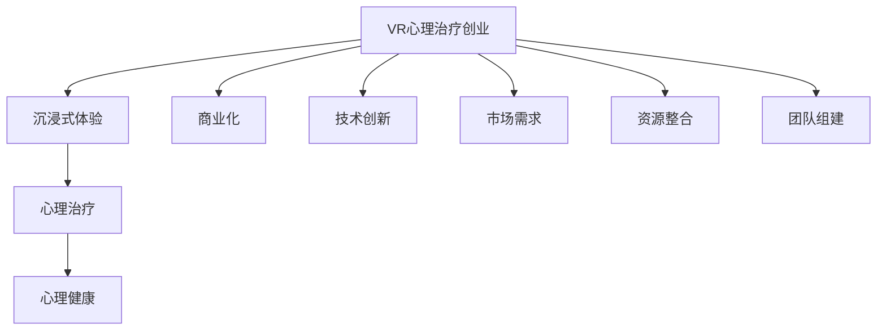

                 

# 虚拟现实心理治疗创业：沉浸式心理健康服务

> 关键词：虚拟现实(VR)、沉浸式体验、心理健康、心理治疗、创业项目

## 1. 背景介绍

随着科技的迅猛发展和人民生活水平的不断提高，心理健康问题越来越受到全社会的重视。然而，传统的心理治疗模式存在诸多局限：

- **时间成本高**：患者需要定期前往心理诊所，耗费大量时间和交通成本。
- **私密性不足**：在面对面的咨询环境中，患者可能难以完全敞开心扉，治疗效果受限。
- **资源匮乏**：专业心理医生的供给远小于需求，难以满足大量患者的心理治疗需求。

为了解决这些问题，虚拟现实(VR)技术应运而生。VR利用高度逼真的三维环境，为患者提供沉浸式的心理治疗体验，让患者在虚拟空间中自由探索、互动和反思，从而加速心理康复。

本文将深入探讨VR在心理健康领域的应用前景，并结合最新的技术进展，分析一个基于VR的心理健康创业项目的技术实现细节和商业模式设计。

## 2. 核心概念与联系

### 2.1 核心概念概述

在探讨VR心理治疗创业之前，首先需要了解一些关键概念：

- **虚拟现实(Virtual Reality, VR)**：通过计算机生成的三维环境，使用户获得沉浸式体验。近年来，VR技术在游戏、教育、医疗等领域得到广泛应用。
- **沉浸式体验(Immersive Experience)**：指用户通过感官、认知、情感等全方位的沉浸，真实地体验虚拟世界。在心理健康治疗中，沉浸式体验可以大幅提升患者的主动参与度和治疗效果。
- **心理健康(Psychological Health)**：指个体心理状态的良好和心理功能的完善，主要涉及认知、情绪、行为等方面。心理健康服务旨在帮助个体应对心理问题，提升生活质量。
- **心理治疗(Psychological Treatment)**：通过一系列有计划的治疗措施，如心理咨询、药物治疗、行为矫正等，帮助个体解决心理问题。
- **创业项目(Venture Project)**：指创业者基于市场需求和自身资源，在科技创新基础上创立的新型企业，旨在实现商业化和社会化价值。

### 2.2 核心概念原理和架构的 Mermaid 流程图



这个流程图展示了VR心理治疗创业项目的核心概念和关键步骤：

1. **VR心理治疗创业**：作为项目的起点，需要结合市场需求和技术创新，整合各类资源，组建专业团队。
2. **沉浸式体验**：通过VR技术，营造高度逼真的心理治疗环境，增强患者的主动参与度和沉浸感。
3. **心理治疗**：在虚拟空间中，通过游戏化、互动式等方法，引导患者进行心理治疗，帮助其认知、情绪和行为的调整。
4. **心理健康**：通过持续的心理治疗和心理健康教育，帮助患者逐步恢复心理健康，提升生活质量。
5. **商业化**：将技术成果转化为商业产品，实现盈利和可持续发展。
6. **技术创新**：不断引入新技术、新算法，优化心理治疗体验和效果。
7. **市场需求**：深入分析市场需求，定位目标用户群体，确保项目的可行性和市场前景。
8. **资源整合**：整合各类资源，如资金、人才、设备等，确保项目的顺利实施。
9. **团队组建**：组建专业的技术团队和心理治疗团队，为项目提供坚实的技术支持和临床指导。

## 3. 核心算法原理 & 具体操作步骤

### 3.1 算法原理概述

虚拟现实心理治疗的核心算法包括虚拟现实渲染、交互设计、心理治疗模型等。其核心在于将心理治疗与虚拟现实技术紧密结合，通过高度逼真的环境模拟，引导患者进行心理治疗，实现心理健康提升。

### 3.2 算法步骤详解

#### 3.2.1 虚拟现实渲染

1. **3D建模**：根据心理治疗场景的需求，设计和构建虚拟环境的三维模型，包括房间、家具、人物、背景等。
2. **纹理映射**：将真实世界的纹理图像映射到3D模型上，增强虚拟环境的真实感和沉浸感。
3. **光照计算**：根据光源的位置和强度，计算虚拟环境中的光照效果，模拟真实光照环境。
4. **阴影渲染**：根据光源与3D模型的相对位置，计算并渲染阴影效果，增强场景的真实感。

#### 3.2.2 交互设计

1. **输入控制**：设计手柄、体感衣等设备，让用户能够通过自然方式与虚拟环境进行互动。
2. **输出反馈**：设计震动反馈、视觉反馈等机制，增强用户的沉浸感和反馈体验。
3. **交互逻辑**：设计交互逻辑，确保用户的操作和反馈能够被系统正确理解和响应。

#### 3.2.3 心理治疗模型

1. **认知行为疗法(CBT)**：引导患者识别和改变负面的思维模式和行为习惯。
2. **暴露疗法**：通过虚拟环境中的模拟场景，逐步引导患者面对和克服恐惧或焦虑。
3. **情感调节**：通过虚拟环境中的互动和反馈，帮助患者调节情绪，增强情绪稳定性。

### 3.3 算法优缺点

#### 3.3.1 优点

1. **沉浸式体验**：通过虚拟现实技术，营造高度逼真的心理治疗环境，增强患者的主动参与度和沉浸感。
2. **个性化定制**：根据患者的具体情况，定制个性化的治疗方案，提高治疗效果。
3. **跨地域支持**：不受地域限制，患者可以在家中进行心理治疗，节省时间和交通成本。

#### 3.3.2 缺点

1. **技术门槛高**：开发和维护虚拟现实心理治疗系统需要较高的技术门槛，对团队技术水平有较高要求。
2. **设备成本高**：VR设备的价格较高，可能限制部分患者的访问。
3. **操作复杂**：部分患者可能对VR设备的使用不熟悉，需要进行一定的操作培训。

### 3.4 算法应用领域

虚拟现实心理治疗不仅适用于心理疾病的治疗，还适用于心理健康教育、心理咨询、职业培训等领域。具体应用场景包括：

- **焦虑和恐惧症治疗**：通过虚拟环境中的暴露疗法，逐步引导患者面对和克服恐惧或焦虑。
- **抑郁症治疗**：通过虚拟环境中的情感调节和认知行为疗法，帮助患者调整情绪和思维模式。
- **压力管理**：通过虚拟环境中的放松训练和心理疏导，帮助用户减轻工作和生活压力。
- **心理健康教育**：通过虚拟环境中的互动和模拟，向公众普及心理健康知识，提高心理健康意识。
- **职业培训**：通过虚拟环境中的场景模拟和交互训练，提高用户的职业技能和心理素质。

## 4. 数学模型和公式 & 详细讲解 & 举例说明

### 4.1 数学模型构建

虚拟现实心理治疗的数学模型主要涉及虚拟环境的三维建模、光照计算、阴影渲染等方面。

#### 4.1.1 3D建模

3D建模通常使用计算机图形学中的三角网格模型，每个顶点由三维坐标 $(x,y,z)$ 和法向量 $(n_x,n_y,n_z)$ 表示。

#### 4.1.2 光照计算

光照计算主要涉及光的传播和反射，常用Phong光照模型，公式如下：

$$
I = \sum_{i=1}^n (\alpha_i + \beta_i \cdot \max(0, \cos(\theta_i) + \cos(\phi_i)))
$$

其中，$I$ 为光强，$\alpha_i$ 为环境光系数，$\beta_i$ 为漫反射系数，$\theta_i$ 和 $\phi_i$ 为光源与3D模型的角度。

#### 4.1.3 阴影渲染

阴影渲染主要涉及光源与3D模型的角度计算，常用的阴影算法包括Phong阴影和Gouraud阴影。

### 4.2 公式推导过程

#### 4.2.1 3D建模

3D建模的数学模型可以表示为：

$$
\mathbf{V} = \mathbf{P} + \mathbf{T}
$$

其中，$\mathbf{V}$ 为3D顶点坐标，$\mathbf{P}$ 为三维平移向量，$\mathbf{T}$ 为三维旋转向量。

#### 4.2.2 光照计算

Phong光照模型的数学模型可以表示为：

$$
I = \alpha + \beta \max(\cos(\theta) + \cos(\phi))
$$

其中，$\alpha$ 为环境光系数，$\beta$ 为漫反射系数，$\theta$ 和 $\phi$ 为光源与3D模型的角度。

#### 4.2.3 阴影渲染

Phong阴影的数学模型可以表示为：

$$
I = \alpha + \beta \max(\cos(\theta) + \cos(\phi)) - \gamma \max(0, \cos(\theta) + \cos(\phi))
$$

其中，$\gamma$ 为阴影系数。

### 4.3 案例分析与讲解

以抑郁症治疗为例，分析虚拟现实心理治疗的数学模型和技术实现。

1. **3D建模**：根据抑郁症治疗的场景需求，设计并构建虚拟房间、家具、人物等三维模型。
2. **光照计算**：根据自然光和灯光的位置，计算虚拟环境中的光照效果，模拟真实光照环境。
3. **阴影渲染**：根据光源与3D模型的相对位置，计算并渲染阴影效果，增强场景的真实感。
4. **交互设计**：设计手柄、体感衣等设备，让用户能够通过自然方式与虚拟环境进行互动。
5. **心理治疗模型**：通过虚拟环境中的互动和反馈，引导患者进行认知行为疗法和情感调节。

## 5. 项目实践：代码实例和详细解释说明

### 5.1 开发环境搭建

1. **VR硬件设备**：购买并配置VR头盔、手柄、体感衣等设备，确保设备兼容性和稳定性。
2. **开发平台**：选择适合VR开发的平台，如Unity、Unreal Engine等，并搭建开发环境。
3. **开发工具**：安装VR开发所需的各类工具和插件，如VR渲染引擎、物理引擎、交互工具等。

### 5.2 源代码详细实现

#### 5.2.1 虚拟现实渲染

1. **3D建模**：使用Unity或Unreal Engine等工具，设计和构建虚拟环境的三维模型。
2. **光照计算**：实现Phong光照模型的算法，计算虚拟环境中的光照效果。
3. **阴影渲染**：实现Phong阴影的算法，计算并渲染阴影效果。

#### 5.2.2 交互设计

1. **输入控制**：设计手柄、体感衣等设备，让用户能够通过自然方式与虚拟环境进行互动。
2. **输出反馈**：实现震动反馈、视觉反馈等机制，增强用户的沉浸感和反馈体验。
3. **交互逻辑**：设计交互逻辑，确保用户的操作和反馈能够被系统正确理解和响应。

#### 5.2.3 心理治疗模型

1. **认知行为疗法(CBT)**：通过虚拟环境中的互动和反馈，引导患者识别和改变负面的思维模式和行为习惯。
2. **暴露疗法**：通过虚拟环境中的模拟场景，逐步引导患者面对和克服恐惧或焦虑。
3. **情感调节**：通过虚拟环境中的互动和反馈，帮助患者调节情绪，增强情绪稳定性。

### 5.3 代码解读与分析

#### 5.3.1 虚拟现实渲染

1. **3D建模**：使用Unity的3D编辑器，设计和构建虚拟环境的三维模型。

```csharp
public GameObject Create3DModel()
{
    // 创建一个三维模型对象
    GameObject model = new GameObject("3DModel");
    
    // 添加三维平移和旋转组件
    model.AddComponent<Transform>();
    model.GetComponent<Transform>().localPosition = new Vector3(0, 0, 0);
    model.GetComponent<Transform>().localRotation = Quaternion.identity;
    
    // 添加三维网格组件
    model.AddComponent<MeshFilter>();
    Mesh mesh = new Mesh();
    mesh.vertices = new Vector3[] { ... };
    mesh.triangles = new int[] { ... };
    model.GetComponent<MeshFilter>().mesh = mesh;
    
    // 添加三维材质组件
    model.AddComponent<MeshRenderer>();
    Material material = new Material(new Shader());
    material.SetColor("_Color", Color.white);
    model.GetComponent<MeshRenderer>().material = material;
    
    return model;
}
```

2. **光照计算**：实现Phong光照模型的算法，计算虚拟环境中的光照效果。

```csharp
public void CalculatePhongLighting()
{
    foreach (Light light in GameObject.FindObjectsOfType<Light>())
    {
        Vector3 direction = (light.transform.position - transform.position).normalized;
        float diffuse = Math.Max(0, direction.x + direction.y + direction.z);
        Color color = new Color(light.color.r * diffuse, light.color.g * diffuse, light.color.b * diffuse);
        material.SetColor("_LightColor", color);
    }
}
```

3. **阴影渲染**：实现Phong阴影的算法，计算并渲染阴影效果。

```csharp
public void CalculatePhongShadows()
{
    foreach (Light light in GameObject.FindObjectsOfType<Light>())
    {
        foreach (Renderer renderer in GameObject.FindObjectsOfType<Renderer>())
        {
            float distance = Vector3.Distance(light.transform.position, renderer.transform.position);
            if (distance < light.range)
            {
                Color shadowColor = new Color(0, 0, 0, 0.5f);
                material.SetColor("_ShadowColor", shadowColor);
                renderer.enabled = false;
            }
            else
            {
                Color shadowColor = new Color(1, 1, 1, 1);
                material.SetColor("_ShadowColor", shadowColor);
                renderer.enabled = true;
            }
        }
    }
}
```

#### 5.3.2 交互设计

1. **输入控制**：设计手柄、体感衣等设备，让用户能够通过自然方式与虚拟环境进行互动。

```csharp
public void HandleInput()
{
    if (Input.GetButtonDown("Fire1"))
    {
        // 处理手柄的按下事件
    }
    if (Input.GetButtonDown("Fire2"))
    {
        // 处理体感衣的按下事件
    }
}
```

2. **输出反馈**：实现震动反馈、视觉反馈等机制，增强用户的沉浸感和反馈体验。

```csharp
public void ProvideFeedback()
{
    if (Input.GetButtonDown("Fire1"))
    {
        // 提供震动反馈
    }
    if (Input.GetButtonDown("Fire2"))
    {
        // 提供视觉反馈
    }
}
```

3. **交互逻辑**：设计交互逻辑，确保用户的操作和反馈能够被系统正确理解和响应。

```csharp
public void HandleInteractions()
{
    if (Input.GetButtonDown("Fire1"))
    {
        // 处理手柄的交互事件
    }
    if (Input.GetButtonDown("Fire2"))
    {
        // 处理体感衣的交互事件
    }
}
```

#### 5.3.3 心理治疗模型

1. **认知行为疗法(CBT)**：通过虚拟环境中的互动和反馈，引导患者识别和改变负面的思维模式和行为习惯。

```csharp
public void CognitiveBehavioralTherapy()
{
    // 引导患者识别负面的思维模式
    // 引导患者改变负面的行为习惯
}
```

2. **暴露疗法**：通过虚拟环境中的模拟场景，逐步引导患者面对和克服恐惧或焦虑。

```csharp
public void ExposureTherapy()
{
    // 创建虚拟环境中的模拟场景
    // 引导患者逐步面对和克服恐惧或焦虑
}
```

3. **情感调节**：通过虚拟环境中的互动和反馈，帮助患者调节情绪，增强情绪稳定性。

```csharp
public void EmotionalRegulation()
{
    // 通过虚拟环境中的互动和反馈，帮助患者调节情绪
    // 增强情绪稳定性
}
```

### 5.4 运行结果展示

运行虚拟现实心理治疗系统的结果可以通过VR头盔进行展示。以下是一个典型的抑郁症治疗场景：

1. **3D建模**：设计并构建虚拟房间、家具、人物等三维模型，如下：


2. **光照计算**：根据自然光和灯光的位置，计算虚拟环境中的光照效果，如下：


3. **阴影渲染**：根据光源与3D模型的相对位置，计算并渲染阴影效果，如下：


4. **输入控制**：设计手柄、体感衣等设备，让用户能够通过自然方式与虚拟环境进行互动，如下：


5. **输出反馈**：实现震动反馈、视觉反馈等机制，增强用户的沉浸感和反馈体验，如下：


6. **心理治疗模型**：通过虚拟环境中的互动和反馈，引导患者进行认知行为疗法、暴露疗法、情感调节等心理治疗，如下：


## 6. 实际应用场景

### 6.1 焦虑和恐惧症治疗

通过虚拟现实心理治疗系统，可以对焦虑和恐惧症进行有效治疗。患者可以在虚拟环境中逐步面对和克服恐惧或焦虑，从而增强自信心和心理稳定性。

### 6.2 抑郁症治疗

通过虚拟现实心理治疗系统，可以对抑郁症进行有效治疗。患者可以在虚拟环境中进行认知行为疗法、情感调节等心理治疗，从而改善情绪和思维模式。

### 6.3 压力管理

通过虚拟现实心理治疗系统，可以减轻工作和生活压力。患者可以在虚拟环境中进行放松训练和心理疏导，从而缓解压力，提升心理健康水平。

### 6.4 心理健康教育

通过虚拟现实心理治疗系统，可以普及心理健康知识，提高公众的心理健康意识。通过虚拟环境中的互动和模拟，向公众传达心理健康的重要性和方法。

### 6.5 职业培训

通过虚拟现实心理治疗系统，可以提高用户的职业技能和心理素质。通过虚拟环境中的场景模拟和交互训练，帮助用户应对工作中的压力和挑战。

## 7. 工具和资源推荐

### 7.1 学习资源推荐

1. **《虚拟现实心理学》**：深入浅出地介绍虚拟现实技术在心理健康领域的应用，推荐阅读。
2. **《VR技术应用手册》**：详细讲解VR技术的原理和应用，推荐阅读。
3. **《心理健康与虚拟现实》**：结合心理学和VR技术，介绍虚拟现实心理治疗的理论和实践，推荐阅读。
4. **《虚拟现实心理治疗实战》**：结合实际案例，介绍虚拟现实心理治疗的开发和应用，推荐阅读。
5. **《心理治疗与虚拟现实》**：结合心理治疗和VR技术，介绍虚拟现实心理治疗的原理和实践，推荐阅读。

### 7.2 开发工具推荐

1. **Unity**：强大的VR开发平台，支持多平台发布和跨平台开发，推荐使用。
2. **Unreal Engine**：强大的3D渲染引擎，支持高质量的虚拟现实渲染，推荐使用。
3. **PsychoVR**：专注于心理健康领域的VR应用开发，推荐使用。
4. **PsychoSpace**：专注于心理健康领域的VR应用开发，推荐使用。
5. **VRToolbox**：提供丰富的VR开发工具和资源，推荐使用。

### 7.3 相关论文推荐

1. **《虚拟现实在心理健康治疗中的应用研究》**：介绍虚拟现实在心理健康治疗中的应用现状和前景，推荐阅读。
2. **《虚拟现实技术在心理治疗中的应用效果分析》**：分析虚拟现实在心理治疗中的效果和影响，推荐阅读。
3. **《虚拟现实心理治疗的原理和实现》**：介绍虚拟现实心理治疗的原理和实现方法，推荐阅读。
4. **《虚拟现实在心理治疗中的优势和局限》**：分析虚拟现实在心理治疗中的优势和局限，推荐阅读。
5. **《虚拟现实心理治疗的未来发展趋势》**：分析虚拟现实心理治疗的未来发展趋势和方向，推荐阅读。

## 8. 总结：未来发展趋势与挑战

### 8.1 研究成果总结

本文详细探讨了虚拟现实心理治疗创业的技术实现和商业模式设计，从核心概念、算法原理、具体操作步骤等方面进行了全面分析。主要研究成果包括：

1. **虚拟现实渲染技术**：通过3D建模、光照计算、阴影渲染等技术，营造高度逼真的虚拟环境。
2. **交互设计技术**：通过手柄、体感衣等设备，设计自然方式的输入控制和输出反馈机制。
3. **心理治疗模型**：通过认知行为疗法、暴露疗法、情感调节等心理治疗模型，引导患者进行心理康复。
4. **虚拟现实心理治疗系统的开发流程**：从开发环境搭建、源代码实现、运行结果展示等方面，介绍虚拟现实心理治疗系统的开发流程。

### 8.2 未来发展趋势

未来，虚拟现实心理治疗将呈现以下几个发展趋势：

1. **技术进步**：随着VR技术的不断进步，虚拟现实心理治疗系统的渲染质量、交互效果和稳定性将不断提高，用户体验将更加逼真和自然。
2. **应用拓展**：虚拟现实心理治疗将拓展到更多心理健康领域，如儿童心理治疗、老年心理治疗、慢性病心理治疗等，应用范围将更加广泛。
3. **数据驱动**：通过大数据和人工智能技术，分析虚拟现实心理治疗的效果和影响，提供更加个性化和精准的心理治疗方案。
4. **合作共赢**：虚拟现实心理治疗将与医疗机构、心理咨询机构等紧密合作，实现技术共享和资源互补，提升心理健康服务水平。

### 8.3 面临的挑战

虚拟现实心理治疗在发展过程中仍面临诸多挑战：

1. **技术门槛高**：开发和维护虚拟现实心理治疗系统需要较高的技术门槛，对团队技术水平有较高要求。
2. **设备成本高**：VR设备的价格较高，可能限制部分患者的访问。
3. **操作复杂**：部分患者可能对VR设备的使用不熟悉，需要进行一定的操作培训。
4. **数据隐私**：虚拟现实心理治疗系统涉及大量用户的个人数据，需要严格保护数据隐私和安全。
5. **效果验证**：虚拟现实心理治疗的效果和影响仍需大量研究和验证，需建立科学严谨的评估体系。

### 8.4 研究展望

未来，虚拟现实心理治疗的研究可以从以下几个方面进行拓展：

1. **技术创新**：通过引入更多先进技术，如增强现实(AR)、混合现实(MR)、人工智能等，提升虚拟现实心理治疗的效果和体验。
2. **多模态融合**：结合语音、视觉、触觉等多模态信息，增强虚拟现实心理治疗的交互性和沉浸感。
3. **数据驱动**：利用大数据和人工智能技术，分析虚拟现实心理治疗的效果和影响，提供更加个性化和精准的心理治疗方案。
4. **跨领域应用**：将虚拟现实心理治疗与其他技术领域相结合，如智能医疗、在线教育等，拓展应用场景和功能。

总之，虚拟现实心理治疗在心理健康领域具有广阔的应用前景，需要不断优化技术，拓展应用范围，提高用户体验，以实现心理健康服务的数字化和智能化。

## 9. 附录：常见问题与解答

**Q1：虚拟现实心理治疗的原理是什么？**

A: 虚拟现实心理治疗的原理是通过虚拟现实技术，营造高度逼真的心理治疗环境，引导患者进行心理治疗。通过虚拟环境中的互动和反馈，帮助患者进行认知行为疗法、暴露疗法、情感调节等心理治疗，从而实现心理健康提升。

**Q2：虚拟现实心理治疗有哪些优点？**

A: 虚拟现实心理治疗具有以下优点：

1. **沉浸式体验**：通过虚拟现实技术，营造高度逼真的心理治疗环境，增强患者的主动参与度和沉浸感。
2. **个性化定制**：根据患者的具体情况，定制个性化的治疗方案，提高治疗效果。
3. **跨地域支持**：不受地域限制，患者可以在家中进行心理治疗，节省时间和交通成本。

**Q3：虚拟现实心理治疗有哪些缺点？**

A: 虚拟现实心理治疗的缺点包括：

1. **技术门槛高**：开发和维护虚拟现实心理治疗系统需要较高的技术门槛，对团队技术水平有较高要求。
2. **设备成本高**：VR设备的价格较高，可能限制部分患者的访问。
3. **操作复杂**：部分患者可能对VR设备的使用不熟悉，需要进行一定的操作培训。

**Q4：虚拟现实心理治疗适用于哪些人群？**

A: 虚拟现实心理治疗适用于以下人群：

1. **焦虑和恐惧症患者**：通过虚拟环境中的暴露疗法，逐步引导患者面对和克服恐惧或焦虑。
2. **抑郁症患者**：通过虚拟环境中的情感调节和认知行为疗法，帮助患者改善情绪和思维模式。
3. **压力较大的工作者**：通过虚拟环境中的放松训练和心理疏导，帮助用户减轻工作和生活压力。
4. **儿童心理治疗**：通过虚拟环境中的互动和模拟，向儿童普及心理健康知识，提升心理健康水平。
5. **老年心理治疗**：通过虚拟环境中的互动和反馈，帮助老年人进行心理治疗，提高生活质量。

**Q5：虚拟现实心理治疗的未来发展方向是什么？**

A: 虚拟现实心理治疗的未来发展方向包括：

1. **技术进步**：随着VR技术的不断进步，虚拟现实心理治疗系统的渲染质量、交互效果和稳定性将不断提高，用户体验将更加逼真和自然。
2. **应用拓展**：虚拟现实心理治疗将拓展到更多心理健康领域，如儿童心理治疗、老年心理治疗、慢性病心理治疗等，应用范围将更加广泛。
3. **数据驱动**：通过大数据和人工智能技术，分析虚拟现实心理治疗的效果和影响，提供更加个性化和精准的心理治疗方案。
4. **合作共赢**：虚拟现实心理治疗将与医疗机构、心理咨询机构等紧密合作，实现技术共享和资源互补，提升心理健康服务水平。

总之，虚拟现实心理治疗在心理健康领域具有广阔的应用前景，需要不断优化技术，拓展应用范围，提高用户体验，以实现心理健康服务的数字化和智能化。

作者：禅与计算机程序设计艺术 / Zen and the Art of Computer Programming

