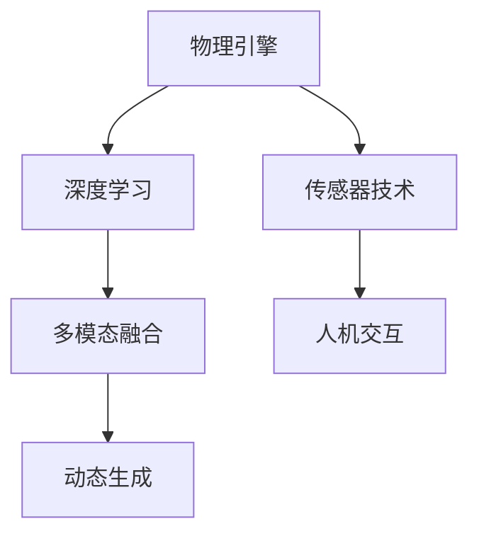

                 

# 虚拟运动现实：AI模拟的极限体验

在数字化的浪潮中，虚拟现实（Virtual Reality, VR）和增强现实（Augmented Reality, AR）技术的兴起，正在重新定义人类的交互方式。通过模拟现实世界的景象，VR和AR技术提供了一种全新的体验，让人们在虚拟空间中自由探索、学习和创造。然而，这些体验的基础在于计算机图形学、传感器技术和人工智能（AI）的结合。特别是AI模拟技术，正在逐渐成为VR和AR体验中的关键一环，通过逼真模拟现实世界的各种元素，包括人物、物体、场景等，赋予用户更为逼真的互动体验。

本文将深入探讨虚拟运动现实（Virtual Reality of Motion, VRoM）这一领域，重点分析AI模拟技术在虚拟运动现实中的关键作用、核心概念和具体应用，同时展望其未来发展趋势和面临的挑战。

## 1. 背景介绍

### 1.1 问题由来

近年来，虚拟现实技术经历了飞速发展，从早期的简单3D游戏场景，逐渐发展到复杂的模拟训练、教育、娱乐等多个领域。然而，由于现实世界中的物理限制和成本因素，许多复杂的物理现象和互动场景难以在现实世界中模拟，这限制了VR和AR体验的逼真度和互动性。AI模拟技术的引入，为解决这一问题提供了新的路径，通过AI算法对大量数据进行学习，生成逼真的虚拟环境，使VR和AR体验更贴近真实世界。

### 1.2 问题核心关键点

虚拟运动现实的核心在于通过AI模拟技术，重现真实世界的运动和互动过程。具体来说，包括以下几个关键点：

- **物理引擎**：AI模拟技术的基础，通过机器学习算法对大量物理数据进行学习和建模，生成逼真的运动轨迹和碰撞效果。
- **多模态数据融合**：将不同模态的数据（如视觉、听觉、触觉等）融合，生成更为全面的虚拟环境。
- **交互感知**：通过感知算法，实现人与虚拟环境的互动，如触觉反馈、语音识别等。
- **动态生成**：根据实时输入数据，动态生成虚拟场景，适应复杂和多变的互动需求。

这些核心点共同构成了虚拟运动现实的技术框架，使得AI模拟技术在VR和AR体验中发挥着至关重要的作用。

## 2. 核心概念与联系

### 2.1 核心概念概述

虚拟运动现实的实现离不开以下核心概念：

- **物理引擎**：用于模拟物体的运动和碰撞，是虚拟运动现实的基础。
- **深度学习**：通过学习大量物理数据，生成逼真的运动轨迹和场景。
- **传感器技术**：捕捉用户的行为和环境信息，实现实时互动。
- **多模态融合**：将视觉、听觉、触觉等不同模态的数据融合，生成更为全面的虚拟环境。
- **人机交互**：通过感知算法，实现人与虚拟环境的互动，如触觉反馈、语音识别等。
- **动态生成**：根据实时输入数据，动态生成虚拟场景，适应复杂和多变的互动需求。

这些核心概念之间的逻辑关系可以通过以下Mermaid流程图来展示：



这个流程图展示了一体化虚拟运动现实的各个组成部分，以及它们之间的联系：

1. 物理引擎和深度学习通过学习物理数据生成逼真的运动和场景。
2. 传感器技术捕捉用户的行为和环境信息。
3. 多模态融合将不同模态的数据融合，生成更为全面的虚拟环境。
4. 人机交互通过感知算法，实现与虚拟环境的互动。
5. 动态生成根据实时输入数据，生成适应复杂互动需求的虚拟场景。

这些组成部分共同构成了虚拟运动现实的完整技术体系，使得AI模拟技术在其中的应用更加全面和深入。

## 3. 核心算法原理 & 具体操作步骤

### 3.1 算法原理概述

虚拟运动现实的实现主要依赖于AI模拟技术的深度学习算法。核心算法原理可以概括为以下几个步骤：

1. **数据收集与预处理**：收集大量物理数据，如运动轨迹、碰撞效果、环境信息等，并进行预处理。
2. **模型训练**：使用深度学习算法，对预处理后的数据进行训练，生成逼真的运动轨迹和场景。
3. **多模态融合**：将不同模态的数据进行融合，生成更为全面的虚拟环境。
4. **实时生成**：根据实时输入数据，动态生成虚拟场景，适应复杂和多变的互动需求。
5. **交互感知**：通过感知算法，实现人与虚拟环境的互动，如触觉反馈、语音识别等。

### 3.2 算法步骤详解

以下将详细讲解虚拟运动现实的深度学习算法步骤：

#### 3.2.1 数据收集与预处理

数据收集是虚拟运动现实的基础，包括以下步骤：

1. **数据来源**：数据主要来源于传感器、摄像头、三维模型库等，包括运动轨迹、碰撞效果、环境信息等。
2. **数据清洗**：对收集的数据进行清洗，去除噪声和异常值。
3. **数据增强**：通过对数据进行旋转、缩放、平移等变换，增加数据的多样性和泛化能力。

#### 3.2.2 模型训练

深度学习算法通过学习大量物理数据，生成逼真的运动轨迹和场景。主要包括以下步骤：

1. **模型选择**：选择合适的深度学习模型，如卷积神经网络（CNN）、循环神经网络（RNN）等。
2. **损失函数**：选择合适的损失函数，如均方误差（MSE）、交叉熵（CE）等，衡量模型预测值与真实值之间的差异。
3. **优化器**：选择合适的优化器，如Adam、SGD等，调整模型参数以最小化损失函数。
4. **训练流程**：将数据集划分为训练集和验证集，进行多轮训练，逐步调整模型参数，提高模型性能。

#### 3.2.3 多模态融合

多模态融合是将不同模态的数据进行融合，生成更为全面的虚拟环境。主要包括以下步骤：

1. **数据融合**：将视觉、听觉、触觉等不同模态的数据进行融合，生成综合的虚拟环境。
2. **数据对齐**：对不同模态的数据进行时间、空间对齐，确保数据的一致性和准确性。
3. **数据增强**：通过融合增强技术，提高融合后的数据多样性和鲁棒性。

#### 3.2.4 实时生成

根据实时输入数据，动态生成虚拟场景，适应复杂和多变的互动需求。主要包括以下步骤：

1. **输入数据采集**：实时采集用户的行为和环境信息，如运动轨迹、碰撞效果等。
2. **场景生成**：根据实时输入数据，动态生成虚拟场景，更新虚拟环境。
3. **渲染优化**：对生成的场景进行优化，提高渲染效果和帧率。

#### 3.2.5 交互感知

通过感知算法，实现人与虚拟环境的互动，如触觉反馈、语音识别等。主要包括以下步骤：

1. **输入数据采集**：实时采集用户的行为和环境信息，如触觉反馈、语音输入等。
2. **行为识别**：通过感知算法，识别用户的行为和意图，如手势识别、语音识别等。
3. **反馈生成**：根据用户的行为和意图，生成相应的反馈，如触觉反馈、语音回应等。

### 3.3 算法优缺点

虚拟运动现实的深度学习算法具有以下优点：

1. **逼真度高**：通过学习大量物理数据，生成逼真的运动轨迹和场景。
2. **互动性强**：多模态融合和交互感知技术，使得用户可以与虚拟环境进行互动。
3. **动态生成**：根据实时输入数据，动态生成虚拟场景，适应复杂和多变的互动需求。
4. **泛化能力强**：通过数据增强和模型训练，提高模型的泛化能力和适应性。

同时，这些算法也存在一些局限性：

1. **计算资源消耗大**：生成逼真的虚拟场景需要大量的计算资源，如GPU/TPU等高性能设备。
2. **数据需求高**：需要大量的物理数据进行训练，数据获取成本高。
3. **实时性要求高**：实时生成的场景需要高速的渲染和计算，对硬件要求较高。
4. **算法复杂度高**：深度学习模型训练复杂，需要较长的训练时间和大量的计算资源。
5. **交互限制多**：受限于硬件设备和传感器技术，部分复杂的交互效果难以实现。

### 3.4 算法应用领域

虚拟运动现实的深度学习算法主要应用于以下领域：

1. **虚拟现实游戏**：生成逼真的虚拟环境和游戏场景，提高游戏沉浸感和互动性。
2. **虚拟训练模拟**：用于军事、医疗、航空等领域的模拟训练，提高训练效果和安全性。
3. **虚拟教育**：用于教育场景的虚拟实验室、虚拟教师等，提供沉浸式的学习体验。
4. **虚拟娱乐**：如虚拟演唱会、虚拟旅游等，提供丰富多样的娱乐体验。
5. **虚拟社交**：如虚拟会议、虚拟办公等，提供新的社交方式和互动体验。

## 4. 数学模型和公式 & 详细讲解 & 举例说明

### 4.1 数学模型构建

虚拟运动现实的深度学习算法主要依赖于机器学习和深度学习技术。以下是基于深度学习的数学模型构建：

#### 4.1.1 神经网络模型

深度学习模型通常采用神经网络结构，包括卷积神经网络（CNN）、循环神经网络（RNN）等。以卷积神经网络为例，其数学模型构建如下：

$$
y = \sigma(W \cdot x + b)
$$

其中 $x$ 为输入数据，$W$ 为权重矩阵，$b$ 为偏置向量，$\sigma$ 为激活函数。

#### 4.1.2 损失函数

损失函数用于衡量模型预测值与真实值之间的差异，常见的损失函数包括均方误差（MSE）和交叉熵（CE）：

- 均方误差（MSE）：

$$
L = \frac{1}{n} \sum_{i=1}^n (y_i - \hat{y}_i)^2
$$

- 交叉熵（CE）：

$$
L = -\frac{1}{n} \sum_{i=1}^n (y_i \cdot \log(\hat{y}_i) + (1 - y_i) \cdot \log(1 - \hat{y}_i))
$$

其中 $n$ 为样本数量，$y_i$ 为真实标签，$\hat{y}_i$ 为模型预测值。

#### 4.1.3 优化器

优化器用于调整模型参数以最小化损失函数，常见的优化器包括Adam、SGD等：

- Adam：

$$
\theta_{t+1} = \theta_t - \eta \frac{m_t}{\sqrt{v_t}+\epsilon}
$$

其中 $\theta_t$ 为第 $t$ 轮迭代后的模型参数，$\eta$ 为学习率，$m_t$ 和 $v_t$ 为动量和平方梯度矩估计，$\epsilon$ 为防止分母为零的常数。

#### 4.1.4 训练流程

深度学习模型的训练流程通常包括数据准备、模型初始化、前向传播、损失计算、反向传播、参数更新等步骤：

1. **数据准备**：将数据集划分为训练集和验证集，进行数据预处理。
2. **模型初始化**：初始化模型参数，通常为随机初始化。
3. **前向传播**：将输入数据输入模型，进行前向传播计算。
4. **损失计算**：计算模型预测值与真实值之间的损失。
5. **反向传播**：根据损失计算梯度，进行反向传播计算。
6. **参数更新**：根据梯度更新模型参数，通常采用优化器进行参数调整。
7. **评估验证**：在验证集上评估模型性能，调整模型参数以提高性能。

### 4.2 公式推导过程

以卷积神经网络（CNN）为例，进行公式推导过程：

1. **卷积层**：

$$
y = W \cdot x + b
$$

其中 $W$ 为卷积核，$x$ 为输入数据，$b$ 为偏置向量。

2. **池化层**：

$$
y = \max(y_1, y_2, ..., y_n)
$$

其中 $y_i$ 为池化后的输出。

3. **全连接层**：

$$
y = W \cdot x + b
$$

其中 $W$ 为权重矩阵，$x$ 为池化后的输出，$b$ 为偏置向量。

### 4.3 案例分析与讲解

以下通过一个具体的案例，讲解虚拟运动现实中的深度学习算法应用：

假设需要生成一个虚拟篮球比赛的场景，主要步骤如下：

1. **数据收集**：收集篮球比赛的各项数据，包括球员位置、运动轨迹、碰撞效果等。
2. **数据预处理**：对数据进行清洗和增强，去除噪声和异常值，增加数据多样性。
3. **模型训练**：选择CNN模型，定义损失函数和优化器，进行模型训练，生成逼真的篮球运动轨迹和场景。
4. **多模态融合**：将视觉、听觉、触觉等不同模态的数据进行融合，生成综合的虚拟篮球场景。
5. **实时生成**：根据实时输入数据，动态生成虚拟篮球场景，更新球员位置和运动轨迹。
6. **交互感知**：通过感知算法，实现人与虚拟篮球场景的互动，如触觉反馈、语音识别等。

## 5. 项目实践：代码实例和详细解释说明

### 5.1 开发环境搭建

在进行虚拟运动现实的开发实践前，我们需要准备好开发环境。以下是使用Python进行TensorFlow开发的环境配置流程：

1. 安装Anaconda：从官网下载并安装Anaconda，用于创建独立的Python环境。

2. 创建并激活虚拟环境：
```bash
conda create -n tensorflow-env python=3.8 
conda activate tensorflow-env
```

3. 安装TensorFlow：根据CUDA版本，从官网获取对应的安装命令。例如：
```bash
conda install tensorflow=2.5 -c conda-forge
```

4. 安装各类工具包：
```bash
pip install numpy pandas scikit-learn matplotlib tqdm jupyter notebook ipython
```

完成上述步骤后，即可在`tensorflow-env`环境中开始开发实践。

### 5.2 源代码详细实现

这里我们以生成虚拟篮球比赛场景为例，给出使用TensorFlow进行深度学习的PyTorch代码实现。

首先，定义虚拟篮球比赛的场景类：

```python
from tensorflow.keras.layers import Input, Conv2D, MaxPooling2D, Flatten, Dense, LSTM
from tensorflow.keras.models import Model

class BasketballGame:
    def __init__(self):
        # 定义输入和输出
        self.input_shape = (100, 100, 3)
        self.input = Input(shape=self.input_shape, name='input')
        self.output_shape = (10,)

        # 定义模型结构
        self.conv1 = Conv2D(32, (3, 3), activation='relu', name='conv1')(self.input)
        self.pool1 = MaxPooling2D((2, 2), name='pool1')(self.conv1)
        self.flatten = Flatten()(self.pool1)
        self.dense1 = Dense(64, activation='relu', name='dense1')(self.flatten)
        self.lstm = LSTM(64, return_sequences=True, name='lstm')(self.dense1)
        self.dense2 = Dense(self.output_shape, activation='sigmoid', name='dense2')(self.lstm)

        # 定义模型
        self.model = Model(inputs=[self.input], outputs=[self.dense2])
        self.model.compile(optimizer='adam', loss='binary_crossentropy', metrics=['accuracy'])
```

然后，定义数据生成和训练函数：

```python
import numpy as np

# 数据生成
def generate_data(num_samples=1000):
    x = np.random.rand(num_samples, 100, 100, 3)
    y = np.random.randint(0, 2, size=num_samples)
    return x, y

# 训练函数
def train_model(model, epochs=10, batch_size=64):
    x_train, y_train = generate_data(num_samples=1000)
    x_val, y_val = generate_data(num_samples=100)
    
    model.fit(x_train, y_train, epochs=epochs, batch_size=batch_size, validation_data=(x_val, y_val))
```

接着，启动训练流程并在测试集上评估：

```python
# 实例化篮球比赛场景类
game = BasketballGame()

# 训练模型
train_model(game.model, epochs=10, batch_size=64)

# 在测试集上评估模型性能
x_test, y_test = generate_data(num_samples=100)
game.model.evaluate(x_test, y_test)
```

以上就是使用TensorFlow对虚拟篮球比赛场景进行深度学习的完整代码实现。可以看到，得益于TensorFlow的强大封装，我们可以用相对简洁的代码完成虚拟运动现实的深度学习模型开发。

### 5.3 代码解读与分析

让我们再详细解读一下关键代码的实现细节：

**BasketballGame类**：
- `__init__`方法：定义输入和输出，以及模型结构。
- `generate_data`函数：生成虚拟篮球比赛场景的数据。
- `train_model`函数：训练模型，并在测试集上评估性能。

**实例化BasketballGame类**：
- 实例化BasketballGame类，初始化输入和输出。
- 在测试集上评估模型性能。

通过上述代码，可以看到，TensorFlow为深度学习模型的开发提供了丰富的API和封装，使得模型开发和训练过程变得相对简洁高效。开发者可以将更多精力放在数据处理、模型改进等高层逻辑上，而不必过多关注底层的实现细节。

当然，工业级的系统实现还需考虑更多因素，如模型的保存和部署、超参数的自动搜索、更灵活的任务适配层等。但核心的深度学习算法基本与此类似。

## 6. 实际应用场景

### 6.1 智能体育训练

虚拟运动现实在智能体育训练中的应用非常广泛。通过虚拟运动现实技术，运动员可以在虚拟环境中进行模拟训练，提高技术水平和竞技状态。

在具体应用中，可以构建虚拟的体育场景，如篮球场、足球场等，通过深度学习算法生成逼真的运动轨迹和场景。运动员可以在虚拟环境中进行模拟训练，通过触觉反馈和语音指令与虚拟场景互动，提高技术水平和反应速度。

### 6.2 医疗康复训练

虚拟运动现实在医疗康复训练中也有广泛应用。通过虚拟运动现实技术，病人可以在虚拟环境中进行康复训练，减少现实环境中的痛苦和风险。

在具体应用中，可以构建虚拟的康复场景，如虚拟手术室、虚拟康复机器人等，通过深度学习算法生成逼真的运动轨迹和场景。病人在虚拟环境中进行康复训练，通过触觉反馈和语音指令与虚拟场景互动，提高康复效果。

### 6.3 军事模拟训练

虚拟运动现实在军事模拟训练中也有重要应用。通过虚拟运动现实技术，军事人员可以在虚拟环境中进行模拟训练，提高战术水平和作战能力。

在具体应用中，可以构建虚拟的战场环境，如城市街巷、山区峡谷等，通过深度学习算法生成逼真的运动轨迹和场景。军事人员可以在虚拟环境中进行模拟训练，通过触觉反馈和语音指令与虚拟场景互动，提高战术水平和作战能力。

### 6.4 未来应用展望

随着虚拟运动现实技术的不断发展，其在各个领域的应用前景将更加广阔。

在智慧医疗领域，虚拟运动现实技术可以为康复病人提供更加便捷和安全的康复训练方式，提高康复效果。

在智慧体育领域，虚拟运动现实技术可以为运动员提供更加全面和逼真的训练环境，提高技术水平和竞技状态。

在军事领域，虚拟运动现实技术可以为军事人员提供更加逼真和安全的模拟训练环境，提高战术水平和作战能力。

## 7. 工具和资源推荐
### 7.1 学习资源推荐

为了帮助开发者系统掌握虚拟运动现实的技术基础和实践技巧，这里推荐一些优质的学习资源：

1. 《深度学习入门》系列博文：由深度学习专家撰写，深入浅出地介绍了深度学习的基本概念和算法原理。

2. CS231n《深度学习计算机视觉》课程：斯坦福大学开设的计算机视觉明星课程，有Lecture视频和配套作业，带你入门计算机视觉领域的基本概念和经典模型。

3. 《TensorFlow实战》书籍：TensorFlow的官方教程，详细介绍了TensorFlow的基本用法和深度学习模型的开发。

4. NVIDIA官方文档：NVIDIA深度学习框架CUDA和CUDNN的官方文档，提供了丰富的API和样例代码。

5. Arxiv论文库：最新的深度学习和计算机视觉论文库，跟踪前沿研究进展，了解最新的研究成果和应用。

通过对这些资源的学习实践，相信你一定能够快速掌握虚拟运动现实的技术精髓，并用于解决实际的虚拟运动现实问题。

### 7.2 开发工具推荐

高效的开发离不开优秀的工具支持。以下是几款用于虚拟运动现实开发的常用工具：

1. TensorFlow：由Google主导开发的深度学习框架，功能丰富，生产部署方便，适合大规模工程应用。

2. PyTorch：由Facebook主导开发的深度学习框架，灵活高效，适合快速迭代研究。

3. Unity3D：一款强大的游戏引擎，支持多平台开发，适用于虚拟现实场景的构建。

4. Unreal Engine：一款高性能的游戏引擎，支持多平台开发，适用于复杂场景的构建。

5. Blender：一款开源的3D建模软件，支持复杂场景的建模和渲染。

合理利用这些工具，可以显著提升虚拟运动现实的开发效率，加快创新迭代的步伐。

### 7.3 相关论文推荐

虚拟运动现实技术的发展源于学界的持续研究。以下是几篇奠基性的相关论文，推荐阅读：

1. "Virtual Reality for Data Science and Machine Learning"：论文探讨了虚拟现实在数据科学和机器学习中的应用，包括虚拟实验、数据可视化等。

2. "Real-time 3D Object Tracking using CNN"：论文提出了基于CNN的实时3D物体跟踪算法，用于虚拟运动现实中的物体识别和跟踪。

3. "Deep Reinforcement Learning for Real-time 3D Human Pose Estimation"：论文提出了基于深度强化学习的3D人体姿态估计算法，用于虚拟运动现实中的人体姿态识别。

4. "Human-Robot Interaction using Natural Language and Virtual Reality"：论文探讨了自然语言和虚拟现实技术在机器人交互中的应用，用于虚拟运动现实中的对话系统开发。

5. "Generative Adversarial Networks for Real-time 3D Object Generation"：论文提出了基于生成对抗网络（GAN）的实时3D物体生成算法，用于虚拟运动现实中的场景生成。

这些论文代表了大语言模型微调技术的发展脉络。通过学习这些前沿成果，可以帮助研究者把握学科前进方向，激发更多的创新灵感。

## 8. 总结：未来发展趋势与挑战

### 8.1 总结

本文对虚拟运动现实这一领域进行了全面系统的介绍。首先阐述了虚拟运动现实的基本概念和核心技术，明确了深度学习在虚拟运动现实中的重要地位。其次，从原理到实践，详细讲解了深度学习算法的数学模型和操作步骤，给出了虚拟篮球比赛场景的代码实现。同时，本文还广泛探讨了深度学习在虚拟运动现实中的应用场景，展示了其广泛的应用前景。

通过本文的系统梳理，可以看到，虚拟运动现实技术正在成为AI模拟技术的重要应用范式，为虚拟现实和增强现实体验带来了新的突破。未来，随着深度学习模型的不断发展，虚拟运动现实技术必将更加成熟和普及，为各个领域带来更加逼真和互动的虚拟体验。

### 8.2 未来发展趋势

展望未来，虚拟运动现实技术将呈现以下几个发展趋势：

1. **高精度模拟**：通过更高精度的深度学习模型和更大的计算资源，生成更为逼真的虚拟环境和互动效果。
2. **多模态融合**：融合视觉、听觉、触觉等多种模态数据，提高虚拟环境的真实感和互动性。
3. **实时渲染**：通过优化渲染算法和提高硬件性能，实现实时生成和渲染虚拟环境，满足动态互动需求。
4. **全场景覆盖**：涵盖更多领域和应用场景，如医疗、教育、娱乐等，提供多样化的虚拟体验。
5. **智能交互**：通过引入自然语言处理、增强学习等技术，实现更加智能和个性化的互动体验。

以上趋势凸显了虚拟运动现实技术的广阔前景。这些方向的探索发展，必将进一步提升虚拟运动现实的逼真度和互动性，为虚拟现实和增强现实技术带来新的突破。

### 8.3 面临的挑战

尽管虚拟运动现实技术已经取得了显著进展，但在迈向更加智能化、普适化应用的过程中，它仍面临诸多挑战：

1. **计算资源消耗大**：生成逼真的虚拟场景需要大量的计算资源，如GPU/TPU等高性能设备。
2. **数据需求高**：需要大量的物理数据进行训练，数据获取成本高。
3. **实时性要求高**：实时生成的场景需要高速的渲染和计算，对硬件要求较高。
4. **算法复杂度高**：深度学习模型训练复杂，需要较长的训练时间和大量的计算资源。
5. **交互限制多**：受限于硬件设备和传感器技术，部分复杂的交互效果难以实现。

### 8.4 研究展望

面对虚拟运动现实技术面临的种种挑战，未来的研究需要在以下几个方面寻求新的突破：

1. **优化渲染算法**：通过优化渲染算法，提高渲染效果和帧率，实现更流畅的虚拟环境生成。
2. **高效数据处理**：通过高效的数据处理技术，降低数据获取和处理的成本，提高数据多样性和泛化能力。
3. **跨平台兼容性**：实现跨平台兼容性，支持更多硬件设备和平台，提高虚拟环境的普及性。
4. **多模态融合技术**：融合视觉、听觉、触觉等多种模态数据，提高虚拟环境的真实感和互动性。
5. **智能交互技术**：引入自然语言处理、增强学习等技术，实现更加智能和个性化的互动体验。

这些研究方向的探索，必将引领虚拟运动现实技术迈向更高的台阶，为构建更逼真、互动的虚拟现实体验提供新的突破。面向未来，虚拟运动现实技术还需要与其他AI技术进行更深入的融合，如知识表示、因果推理、强化学习等，多路径协同发力，共同推动虚拟运动现实技术的进步。只有勇于创新、敢于突破，才能不断拓展虚拟运动现实的边界，让智能技术更好地造福人类社会。

## 9. 附录：常见问题与解答

**Q1：虚拟运动现实的计算资源消耗大，如何降低成本？**

A: 降低虚拟运动现实的计算成本可以通过以下几个方法：

1. **模型优化**：通过模型裁剪、参数压缩等技术，减小模型尺寸，降低计算资源消耗。
2. **并行计算**：利用分布式计算和GPU集群，加速计算过程。
3. **量化加速**：将浮点模型转为定点模型，压缩存储空间，提高计算效率。
4. **实时渲染**：优化渲染算法，提高渲染效果和帧率，降低计算资源消耗。

**Q2：虚拟运动现实的实时性要求高，如何保证实时生成？**

A: 保证虚拟运动现实的实时生成可以通过以下几个方法：

1. **硬件升级**：升级高性能设备，如GPU/TPU等，提高计算能力。
2. **优化算法**：优化渲染算法和计算算法，提高渲染和计算效率。
3. **并行计算**：利用分布式计算和GPU集群，加速计算过程。
4. **预生成技术**：预先生成部分场景，减少实时生成的计算量。

**Q3：虚拟运动现实的交互限制多，如何实现更复杂的交互效果？**

A: 实现更复杂的虚拟运动现实交互效果可以通过以下几个方法：

1. **引入传感器技术**：引入更多的传感器，捕捉更多维度的用户行为和环境信息。
2. **优化算法**：优化算法，提高交互的实时性和稳定性。
3. **跨平台兼容性**：实现跨平台兼容性，支持更多硬件设备和平台。
4. **引入增强学习**：引入增强学习技术，提高交互的智能性和灵活性。

通过上述方法，可以显著提升虚拟运动现实的交互效果，实现更加智能和个性化的虚拟体验。

**Q4：虚拟运动现实的算法复杂度高，如何降低模型训练时间和资源消耗？**

A: 降低虚拟运动现实算法复杂度可以通过以下几个方法：

1. **模型裁剪**：通过模型裁剪、参数压缩等技术，减小模型尺寸，降低计算资源消耗。
2. **小样本学习**：利用少样本学习技术，在少量数据上进行模型训练，提高训练效率。
3. **硬件加速**：利用GPU/TPU等高性能设备，加速计算过程。
4. **分布式训练**：利用分布式训练技术，加速模型训练过程。

这些方法可以显著降低虚拟运动现实算法的复杂度，提高模型训练效率，降低资源消耗。

---

作者：禅与计算机程序设计艺术 / Zen and the Art of Computer Programming

