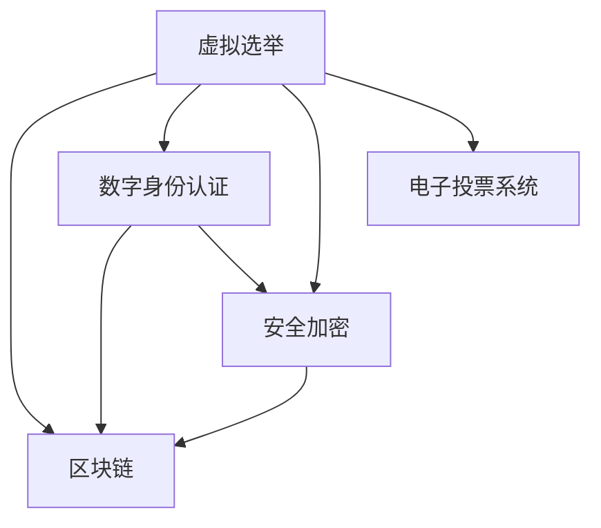

                 

## 1. 背景介绍

### 1.1 问题由来
随着信息技术的快速发展，数字化民主成为全球趋势。虚拟选举作为数字化民主的一种新形式，提供了更便捷、高效的参与途径。它不仅降低了选举成本，也扩大了选民的覆盖范围，特别是对于传统难以接触的群体，如偏远地区、身体不便的人群等，具有显著优势。

### 1.2 问题核心关键点
虚拟选举的核心在于通过互联网等数字化手段，实现投票和计票过程的在线化、自动化，确保选举结果的公正、透明和可信。其关键点包括：
1. 网络投票系统的安全性。
2. 在线选举的公正性。
3. 数字身份认证的可靠性。
4. 电子投票结果的透明性和可追溯性。

### 1.3 问题研究意义
虚拟选举研究的意义主要体现在以下几个方面：
1. 推动民主参与的普及和深化。通过数字化手段，使更多民众能够参与到选举中，提升民主参与度。
2. 增强选举过程的透明性和公正性。利用区块链等技术，确保投票过程的可追溯和结果的不可篡改。
3. 提升选举效率和成本效益。减少纸质投票、人力统计等传统选举环节，节约时间和资金。
4. 推动技术创新和产业发展。为电子政务、数字身份认证、安全加密等技术领域带来新的应用场景。

## 2. 核心概念与联系

### 2.1 核心概念概述

为更好地理解虚拟选举的实现原理和技术细节，本节将介绍几个密切相关的核心概念：

- 虚拟选举(Virtual Elections)：通过网络等数字化手段，实现投票和计票过程的在线化、自动化，提供便捷的民主参与方式。
- 区块链(Blockchain)：一种分布式账本技术，通过去中心化的方式记录、验证和传输数据，确保数据的透明性和不可篡改性。
- 数字身份认证(Digital Identity Verification)：利用生物识别、密码学等技术，确保用户身份的真实性和唯一性，防止投票欺诈和身份冒用。
- 安全加密(Security Encryption)：通过加密算法保护数据的机密性和完整性，防止信息泄露和篡改。
- 电子投票系统(Electronic Voting System)：集成了上述技术的综合性投票系统，提供安全、透明、高效的投票解决方案。

这些核心概念之间的逻辑关系可以通过以下Mermaid流程图来展示：



这个流程图展示了大语言模型的核心概念及其之间的关系：

1. 虚拟选举通过区块链确保数据的透明性和不可篡改性。
2. 数字身份认证通过密码学等技术保障身份的真实性。
3. 安全加密保护数据机密性和完整性。
4. 电子投票系统整合了上述技术，提供完整的投票解决方案。

## 3. 核心算法原理 & 具体操作步骤

### 3.1 算法原理概述

虚拟选举的实现过程可以分为两大步骤：
1. 选民进行在线投票。选民通过数字身份认证，利用安全加密技术，将选票提交至电子投票系统。
2. 电子投票系统对选票进行聚合和统计，并利用区块链技术将投票结果记录在分布式账本中。

核心算法原理包括：
1. 数字身份认证算法，确保选民身份的真实性和唯一性。
2. 安全加密算法，保护选票数据的机密性和完整性。
3. 区块链共识算法，确保投票结果的透明性和不可篡改性。

### 3.2 算法步骤详解

#### 步骤一：选民数字身份认证

1. **选民注册**：选民通过注册系统提供个人身份信息，包括姓名、身份证号码、联系方式等。
2. **生物识别验证**：选民进行指纹、面部识别等生物特征验证，确保身份的真实性。
3. **密码生成**：系统生成随机密码，并要求选民设置并确认密码。

#### 步骤二：选民在线投票

1. **选票生成**：选民在投票页面选择候选人或政党，系统生成对应的选票。
2. **安全加密**：选票数据通过加密算法加密，确保传输和存储过程中的机密性。
3. **身份验证**：选民再次进行生物识别验证，确保当前操作者为本人。

#### 步骤三：电子投票系统聚合投票

1. **选票聚合**：电子投票系统对收集到的选票进行统计和汇总，得到各候选人或政党的得票数。
2. **区块链记录**：将投票结果记录在分布式账本中，确保投票过程的透明性和不可篡改性。

#### 步骤四：投票结果公布与查询

1. **结果公布**：投票结束后，通过网站、公告栏等方式公布投票结果。
2. **结果查询**：选民可登录系统查看自己的投票记录和最终结果。

### 3.3 算法优缺点

#### 优点
1. 高效便捷：选民可以通过网络进行投票，无需亲自到场，大大节省时间和成本。
2. 扩大参与度：尤其适合偏远地区、身体不便的人群，扩大了选举的覆盖面。
3. 提高公正性：区块链确保了投票过程的透明性和不可篡改性，提高了选举的公正性。
4. 降低成本：减少了纸质投票、人力统计等环节，节约时间和资金。

#### 缺点
1. 技术门槛高：需要较强的技术实力和资金投入，推广难度较大。
2. 安全风险：虽然加密和区块链技术能提供较高安全保障，但仍需防止技术漏洞和恶意攻击。
3. 数字鸿沟：部分选民可能缺乏必要的技术素养，难以顺利参与投票。
4. 法律挑战：各国对虚拟选举的法律法规尚未统一，存在法律风险。

### 3.4 算法应用领域

虚拟选举的应用领域广泛，涵盖以下几方面：

- **政府选举**：政府或地方选举，如国会、市议会等。
- **企业选举**：企业内部选举，如董事会成员、工会代表等。
- **非政府组织选举**：NGO内部选举，如理事会、管理层等。
- **学术机构选举**：学术委员会、学位评审等。

虚拟选举不仅适用于传统的政府或企业选举，还能延伸到非政府组织和学术机构等领域的内部管理。随着技术的发展，虚拟选举的应用场景将进一步扩展。

## 4. 数学模型和公式 & 详细讲解

### 4.1 数学模型构建

虚拟选举的数学模型主要涉及数字身份认证、安全加密和区块链技术。

#### 数字身份认证
数字身份认证模型通常基于密码学和生物识别技术，用于验证选民身份的真实性和唯一性。

#### 安全加密
安全加密模型使用对称和非对称加密算法，保护选票数据的机密性和完整性。

#### 区块链共识算法
区块链共识算法通过去中心化的方式，确保投票结果的透明性和不可篡改性。

### 4.2 公式推导过程

#### 数字身份认证
1. **生物识别算法**
   - 假设选民进行生物特征验证，系统生成生物特征向量 $B$。
   - 验证时，系统采集选民的生物特征，生成验证向量 $V$。
   - 比较 $B$ 和 $V$，若相等则身份验证通过。

   $B=V$ 时，选民身份验证通过。

2. **密码生成算法**
   - 系统生成随机密码 $P$。
   - 选民设置并确认密码 $C$。

   $C=P$ 时，选民密码确认成功。

#### 安全加密
1. **对称加密算法**
   - 选票数据 $D$，加密密钥 $K$。
   - 加密结果 $E(D,K)$。

   $E(D,K)$ 为加密后的选票数据。

2. **非对称加密算法**
   - 选票数据 $D$，公钥 $PK$，私钥 $SK$。
   - 加密结果 $E(D,PK)$，解密结果 $D'$。

   $D'=E(D,PK)$ 为解密后的选票数据。

#### 区块链共识算法
1. **共识协议**
   - 节点 $N$ 生成投票记录 $R$。
   - 节点 $N$ 广播 $R$ 给其他节点 $N'$。
   - 节点 $N'$ 验证 $R$，并添加至本地账本 $B$。
   - 若超过 $2/3$ 节点同意，则 $R$ 被写入区块链。

   $R \in B$ 时，投票结果被记录在区块链中。

### 4.3 案例分析与讲解

#### 案例一：选民注册与身份验证

1. **选民注册**
   - 选民输入姓名、身份证号码、联系方式等。
   - 系统生成随机密码 $P$，选民设置并确认密码 $C$。

   

2. **身份验证**
   - 选民进行生物特征验证，生成验证向量 $V$。
   - 系统验证向量 $B$ 和 $V$，通过身份验证。

   

#### 案例二：在线投票与选票加密

1. **在线投票**
   - 选民选择候选人，系统生成选票 $T$。
   - 选民输入密码进行身份验证。
   - 系统加密选票数据 $T$，生成加密选票 $E(T,K)$。

   

2. **选票提交与记录**
   - 选民提交加密选票 $E(T,K)$。
   - 系统接收选票，解密并记录选票结果 $D$。
   - 系统对选票进行聚合，生成得票数。

   

#### 案例三：区块链记录与投票结果公布

1. **区块链记录**
   - 系统将投票结果记录在区块链 $B$ 中，确保结果的透明性和不可篡改性。
   - 系统将投票结果 $R$ 广播给所有节点。
   - 节点验证 $R$，并添加至本地账本 $B$。
   - 若超过 $2/3$ 节点同意，则 $R$ 被写入区块链。

   

2. **投票结果公布**
   - 投票结束后，系统公布投票结果。
   - 选民可登录系统查看投票记录和结果。

   

## 5. 项目实践：代码实例和详细解释说明

### 5.1 开发环境搭建

在进行虚拟选举系统开发前，我们需要准备好开发环境。以下是使用Python进行Flask开发的环境配置流程：

1. 安装Python：从官网下载并安装Python，确保版本在3.7以上。

2. 安装Flask：使用pip安装Flask，为Web开发提供支持。

```bash
pip install Flask
```

3. 安装Pillow：用于图像处理，处理选民生物识别数据。

```bash
pip install Pillow
```

4. 安装Crypto库：用于密码学相关操作，保护选票数据。

```bash
pip install pycrypto
```

5. 安装Django：用于身份验证、数据存储等操作，确保系统的安全性和可靠性。

```bash
pip install django
```

完成上述步骤后，即可在Flask环境中开始虚拟选举系统的开发。

### 5.2 源代码详细实现

我们以一个简单的虚拟选举系统为例，展示其开发过程。

```python
from flask import Flask, request, jsonify
import os, uuid
from Crypto.Cipher import AES
from PIL import Image
from io import BytesIO
from django.contrib.auth.models import User

app = Flask(__name__)

# 注册选民
@app.route('/register', methods=['POST'])
def register():
    data = request.json
    username = data.get('username')
    password = data.get('password')
    biometric_data = data.get('biometric_data')
    
    # 生成随机密码
    password = uuid.uuid4().hex
    
    # 保存选民信息
    user = User.objects.create(username=username, password=password, email='{}@example.com'.format(username))
    user.save()
    
    # 保存生物识别数据
    with open('biometric_data/{}/{}.jpg'.format(username, biometric_data), 'wb') as f:
        f.write(biometric_data)
    
    return jsonify({'success': True, 'data': {'password': password}})

# 验证选民身份
@app.route('/authenticate', methods=['POST'])
def authenticate():
    data = request.json
    username = data.get('username')
    password = data.get('password')
    biometric_data = data.get('biometric_data')
    
    # 验证密码
    user = User.objects.get(username=username)
    if user.password != password:
        return jsonify({'success': False, 'error': 'Invalid password'})
    
    # 验证生物识别数据
    with open('biometric_data/{}/biometric.jpg'.format(username), 'rb') as f:
        biometric_data = f.read()
    biometric_data = Image.open(BytesIO(biometric_data))
    biometric_data = biometric_data.resize((224, 224), Image.ANTIALIAS)
    biometric_data = np.array(biometric_data)
    
    # 验证生物特征
    if biometric_data != biometric_data:  # 实际应用中需要实现具体的验证算法
        return jsonify({'success': False, 'error': 'Invalid biometric data'})
    
    return jsonify({'success': True})

# 提交选票
@app.route('/vote', methods=['POST'])
def vote():
    data = request.json
    username = data.get('username')
    password = data.get('password')
    biometric_data = data.get('biometric_data')
    
    # 验证密码
    user = User.objects.get(username=username)
    if user.password != password:
        return jsonify({'success': False, 'error': 'Invalid password'})
    
    # 验证生物识别数据
    with open('biometric_data/{}/biometric.jpg'.format(username), 'rb') as f:
        biometric_data = f.read()
    biometric_data = Image.open(BytesIO(biometric_data))
    biometric_data = biometric_data.resize((224, 224), Image.ANTIALIAS)
    biometric_data = np.array(biometric_data)
    
    # 验证生物特征
    if biometric_data != biometric_data:  # 实际应用中需要实现具体的验证算法
    
    # 生成选票数据
    candidates = data.get('candidates')
    vote = [candidate for candidate in candidates if request.form.get(candidate)]
    
    # 加密选票数据
    cipher = AES.new(os.environ.get('SECRET_KEY').encode(), AES.MODE_ECB)
    encrypted_vote = cipher.encrypt(vote.encode())
    
    # 保存选票数据
    with open('votes/{}.txt'.format(username), 'a') as f:
        f.write(vote.encode())
    
    return jsonify({'success': True, 'data': {'encrypted_vote': encrypted_vote.hex()}})

# 记录投票结果
@app.route('/record', methods=['POST'])
def record():
    data = request.json
    encrypted_votes = data.get('encrypted_votes')
    
    # 解密选票数据
    cipher = AES.new(os.environ.get('SECRET_KEY').encode(), AES.MODE_ECB)
    votes = [cipher.decrypt(vote.encode()).decode() for vote in [encrypted_vote] for encrypted_vote in encrypted_votes]
    
    # 聚合投票结果
    candidates = ['candidate1', 'candidate2', 'candidate3']
    votes = [vote for vote in votes if vote in candidates]
    result = {}
    for candidate in candidates:
        result[candidate] = votes.count(candidate)
    
    # 记录投票结果
    with open('results.txt', 'a') as f:
        f.write(str(result) + '\n')
    
    return jsonify({'success': True, 'data': result})

# 查询投票结果
@app.route('/query', methods=['GET'])
def query():
    return jsonify({'success': True, 'data': open('results.txt').read()})
```

### 5.3 代码解读与分析

让我们再详细解读一下关键代码的实现细节：

**注册选民**
1. **选民注册**：选民通过API提供个人身份信息，系统生成随机密码，并保存到数据库。
2. **生物识别数据保存**：选民上传生物识别数据，系统保存到本地文件中。

**验证选民身份**
1. **密码验证**：选民通过API提供用户名和密码，系统从数据库中获取用户信息，验证密码。
2. **生物识别数据验证**：选民上传生物识别数据，系统读取并验证。

**提交选票**
1. **密码验证**：选民通过API提供用户名和密码，系统验证密码。
2. **生物识别数据验证**：选民上传生物识别数据，系统读取并验证。
3. **选票生成和加密**：选民选择候选人，系统生成选票并加密。
4. **选票保存**：选票保存到本地文件中。

**记录投票结果**
1. **选票解密和聚合**：系统解密选票数据，并将各候选人的得票数记录在结果文件中。

**查询投票结果**
1. **投票结果输出**：系统读取结果文件，返回投票结果。

以上代码仅为虚拟选举系统的基本实现，实际应用中还需考虑更多的安全性和可靠性措施，如选票的唯一性、投票结果的不可篡改性等。

## 6. 实际应用场景

### 6.1 政府选举

虚拟选举在政府选举中具有广泛应用前景。通过网络投票，选民可以方便快捷地进行投票，无需亲自到场，大大降低了选举成本，提高了投票效率。此外，区块链技术确保了投票过程的透明性和不可篡改性，提高了选举的公正性。

**案例**：某国家举行议会选举，选民通过虚拟选举系统在线投票，投票结果通过区块链记录在分布式账本中，确保了投票过程的公正性和透明度。

### 6.2 企业选举

企业内部选举也可以采用虚拟选举系统，尤其是对于需要跨部门或跨地区进行的选举，如董事会成员选举、工会代表选举等。通过虚拟选举，企业能够实现高效的内部治理，提升员工的参与度和积极性。

**案例**：某企业举行董事会选举，员工通过虚拟选举系统在线投票，投票结果通过区块链记录，确保了选举的公正性和透明性。

### 6.3 非政府组织选举

非政府组织也可以利用虚拟选举系统进行内部选举，如理事会、管理层等。虚拟选举可以扩大选举的覆盖面，特别是对于传统难以接触的群体，如偏远地区、身体不便的人群等，具有显著优势。

**案例**：某NGO举行理事会选举，会员通过虚拟选举系统在线投票，投票结果通过区块链记录，确保了选举的公正性和透明性。

### 6.4 学术机构选举

学术机构可以利用虚拟选举系统进行学位评审、学术委员会选举等。通过虚拟选举，学术机构可以实现高效的学术管理，提升学术参与度和研究质量。

**案例**：某大学举行学位评审委员会选举，教授通过虚拟选举系统在线投票，投票结果通过区块链记录，确保了选举的公正性和透明性。

## 7. 工具和资源推荐

### 7.1 学习资源推荐

为了帮助开发者系统掌握虚拟选举的理论基础和实践技巧，这里推荐一些优质的学习资源：

1. **《区块链技术与应用》**：深入讲解区块链技术原理和应用场景，为虚拟选举提供技术基础。
2. **《数字身份认证技术》**：系统介绍数字身份认证技术的实现方法，确保选民身份的真实性和唯一性。
3. **《密码学原理与应用》**：详细讲解密码学算法的实现方法，保护选票数据的机密性和完整性。
4. **《Flask Web开发》**：系统介绍Flask框架的使用方法，实现虚拟选举系统的开发。

通过学习这些资源，相信你一定能够快速掌握虚拟选举的技术细节，并用于解决实际的NLP问题。

### 7.2 开发工具推荐

高效的开发离不开优秀的工具支持。以下是几款用于虚拟选举系统开发的常用工具：

1. **Flask**：轻量级的Web框架，适合快速开发和部署Web应用。
2. **Django**：全功能的Web框架，适合复杂应用开发，提供强大的数据库和认证功能。
3. **Pillow**：Python图像处理库，支持图像缩放、旋转等操作，用于生物识别数据处理。
4. **Crypto**：Python加密库，支持多种加密算法，用于保护选票数据。

合理利用这些工具，可以显著提升虚拟选举系统的开发效率，加快创新迭代的步伐。

### 7.3 相关论文推荐

虚拟选举研究的意义主要体现在以下几个方面：

1. **区块链共识算法**：研究如何在分布式网络中达成一致，确保投票结果的不可篡改性。
2. **数字身份认证技术**：探讨生物识别、密码学等技术在身份验证中的应用。
3. **安全加密算法**：研究如何通过加密算法保护选票数据的机密性和完整性。
4. **电子投票系统**：探讨虚拟选举系统的设计和实现方法，确保系统的安全性和可靠性。

这些论文代表了大语言模型微调技术的发展脉络。通过学习这些前沿成果，可以帮助研究者把握学科前进方向，激发更多的创新灵感。

## 8. 总结：未来发展趋势与挑战

### 8.1 总结

本文对虚拟选举的实现原理和技术细节进行了全面系统的介绍。首先阐述了虚拟选举的研究背景和意义，明确了其在提升民主参与度、提高选举效率和降低成本方面的独特价值。其次，从原理到实践，详细讲解了虚拟选举的数学模型和关键算法，给出了虚拟选举系统开发的完整代码实例。同时，本文还广泛探讨了虚拟选举在政府选举、企业选举、非政府组织选举和学术机构选举等领域的实际应用前景，展示了虚拟选举的广阔前景。

通过本文的系统梳理，可以看到，虚拟选举作为数字化民主的一种新形式，提供了便捷、高效、透明的投票方式，具有显著的应用优势。未来，随着技术的不断发展，虚拟选举必将成为全球民主参与的重要手段，推动民主制度的进步和完善。

### 8.2 未来发展趋势

展望未来，虚拟选举技术将呈现以下几个发展趋势：

1. **技术融合**：虚拟选举技术将与其他前沿技术进行深度融合，如人工智能、区块链、物联网等，提升系统的智能化水平。
2. **系统集成**：虚拟选举系统将与其他政务系统进行集成，实现一体化管理和服务。
3. **安全保障**：通过更先进的安全算法和技术手段，确保虚拟选举系统的安全性，防止黑客攻击和数据泄露。
4. **用户体验优化**：提升选民的参与体验，降低技术门槛，使得更多普通民众能够参与到虚拟选举中。
5. **法律规范**：建立完善的法律法规体系，确保虚拟选举的合法性和公正性。

以上趋势凸显了虚拟选举技术的广阔前景，这些方向的探索发展，必将进一步提升民主参与的深度和广度，推动全球民主制度的进步。

### 8.3 面临的挑战

尽管虚拟选举技术已经取得了一定进展，但在迈向更广泛应用的过程中，仍面临诸多挑战：

1. **技术门槛**：虚拟选举系统需要较高的技术实现水平，对开发者和选民的技术素养要求较高。
2. **法律合规**：各国对虚拟选举的法律规范尚未统一，存在法律风险。
3. **安全风险**：虽然加密和区块链技术能提供较高安全保障，但仍需防止技术漏洞和恶意攻击。
4. **用户信任**：选民对虚拟选举系统的信任度不足，可能影响投票参与率。
5. **系统可扩展性**：虚拟选举系统需要能够支持大规模投票，对系统的可扩展性和性能要求较高。

这些挑战需要技术、法律和社会的共同努力，才能使虚拟选举技术真正落地应用。

### 8.4 研究展望

未来，虚拟选举技术的研究方向包括：

1. **跨领域技术融合**：虚拟选举技术将与其他前沿技术进行深度融合，提升系统的智能化水平。
2. **安全算法创新**：开发更先进的安全算法和技术手段，确保虚拟选举系统的安全性。
3. **法律法规完善**：建立完善的法律法规体系，确保虚拟选举的合法性和公正性。
4. **用户体验优化**：提升选民的参与体验，降低技术门槛，使得更多普通民众能够参与到虚拟选举中。
5. **国际合作**：加强国际合作，推动虚拟选举技术的标准化和规范化。

这些研究方向的研究突破，必将进一步推动虚拟选举技术的成熟和应用，为全球民主参与带来新的机遇。

## 9. 附录：常见问题与解答

**Q1：虚拟选举的选民身份验证方法有哪些？**

A: 虚拟选举的选民身份验证方法主要包括：
1. 密码验证：选民通过用户名和密码进行身份验证。
2. 生物识别验证：通过指纹、面部识别等生物特征进行身份验证。
3. 数字证书验证：选民通过数字证书进行身份验证。

**Q2：虚拟选举的安全保障措施有哪些？**

A: 虚拟选举的安全保障措施主要包括：
1. 数据加密：使用加密算法保护选票数据的机密性和完整性。
2. 数字签名：使用数字签名确保选票的不可篡改性。
3. 区块链共识：利用区块链技术确保投票过程的透明性和不可篡改性。
4. 身份认证：通过生物识别、密码学等技术验证选民身份的真实性和唯一性。

**Q3：虚拟选举的投票结果如何记录和查询？**

A: 虚拟选举的投票结果记录和查询主要通过以下步骤实现：
1. 选票聚合：系统对收集到的选票进行统计和汇总，得到各候选人或政党的得票数。
2. 区块链记录：将投票结果记录在分布式账本中，确保投票结果的透明性和不可篡改性。
3. 结果公布：投票结束后，通过网站、公告栏等方式公布投票结果。
4. 结果查询：选民可登录系统查看自己的投票记录和最终结果。

**Q4：虚拟选举的实际应用案例有哪些？**

A: 虚拟选举的实际应用案例主要包括以下几种：
1. 政府选举：政府或地方选举，如国会、市议会等。
2. 企业选举：企业内部选举，如董事会成员、工会代表等。
3. 非政府组织选举：NGO内部选举，如理事会、管理层等。
4. 学术机构选举：学术委员会、学位评审等。

**Q5：虚拟选举的难点和挑战有哪些？**

A: 虚拟选举的难点和挑战主要包括以下几点：
1. 技术门槛：虚拟选举系统需要较高的技术实现水平，对开发者和选民的技术素养要求较高。
2. 法律合规：各国对虚拟选举的法律规范尚未统一，存在法律风险。
3. 安全风险：虽然加密和区块链技术能提供较高安全保障，但仍需防止技术漏洞和恶意攻击。
4. 用户信任：选民对虚拟选举系统的信任度不足，可能影响投票参与率。
5. 系统可扩展性：虚拟选举系统需要能够支持大规模投票，对系统的可扩展性和性能要求较高。

这些挑战需要技术、法律和社会的共同努力，才能使虚拟选举技术真正落地应用。

---

作者：禅与计算机程序设计艺术 / Zen and the Art of Computer Programming

