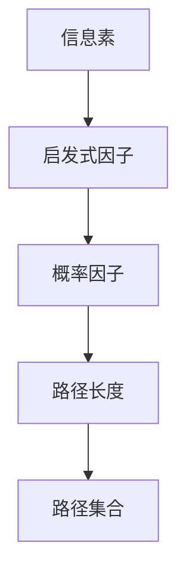

                 

# 蚁群算法(Ant Colony Optimization) - 原理与代码实例讲解

> 关键词：蚁群算法,优化算法,分布式计算,启发式搜索,路径选择,路径优化

## 1. 背景介绍

### 1.1 问题由来
随着计算机科学和工程技术的不断发展，优化问题已经成为了各个领域中的重要研究课题。无论是工业生产、物流调度、金融风险管理，还是交通控制和网络规划，优化问题贯穿于人类生活的方方面面。然而，面对复杂的非线性约束，传统的优化算法往往存在局部最优解，难以找到全局最优解。

在这样的背景下，启发式优化算法应运而生，通过模拟自然界或其他系统中的行为，寻找问题的近似解。其中，蚁群算法(Ant Colony Optimization, ACO)因其分布式、启发式的特点，在解决复杂的路径优化问题中展现了独特的优势。本文将详细介绍蚁群算法的原理，并结合实际案例，讲解其代码实现。

### 1.2 问题核心关键点
蚁群算法是一种基于社会性昆虫——蚂蚁——的启发式搜索算法。其核心思想是模拟蚂蚁在寻找食物时的行为模式，通过信息素在路径上的积累与挥发，动态调整路径选择概率，从而在搜索空间中寻找到最优路径。

蚁群算法的主要特点包括：
1. **分布式**：算法过程无需集中控制，各节点独立进行信息交互。
2. **自适应**：信息素强度能根据路径的质量动态调整，适应环境变化。
3. **启发式**：通过启发式策略探索搜索空间，避免陷入局部最优。
4. **高效性**：适用于大规模、多目标优化问题，易于并行计算。

蚁群算法自20世纪90年代被提出以来，已经在路径优化、调度优化、网络优化、组合优化等领域得到了广泛应用，展现出强大的生命力和潜力。

### 1.3 问题研究意义
研究蚁群算法，不仅能够提供一种有效的优化解决方案，还能够揭示自然界中一些复杂行为背后的机制。在实际应用中，蚁群算法可以用于解决交通流优化、物流路径规划、网络路由选择、组合优化等各类优化问题，具有重要的理论和实际价值。

## 2. 核心概念与联系

### 2.1 核心概念概述

为了更好地理解蚁群算法的工作原理和优化流程，本节将介绍几个关键概念：

- **信息素(Pheromone)**：蚂蚁在路径上留下的化学信号，用于传达路径质量的信息。信息素强度与路径质量成正比，路径越优，信息素越强。
- **启发式因子(Heuristic Function)**：启发式函数通常用于估计节点之间的距离或其他代价，指导蚂蚁选择路径。启发式因子越高，路径越可能被选择。
- **概率因子(Probability Factor)**：用于动态调整路径选择的概率，在信息素和启发式因子间进行权衡。
- **路径长度(Path Length)**：从起点到终点的距离，用于衡量路径的代价。
- **路径集合(Path Set)**：由一系列节点和边构成的路径，是算法的最小单元。

这些核心概念之间的逻辑关系可以通过以下Mermaid流程图来展示：



这个流程图展示了大规模优化问题的核心概念及其之间的关系：

1. 信息素在路径上积累，用于指导蚂蚁选择路径。
2. 启发式函数提供路径选择方向，信息素动态调整路径质量。
3. 概率因子平衡信息素和启发式因子，指导路径选择。
4. 路径长度用于评估路径代价，优化路径选择。
5. 路径集合是优化过程的基本单位，逐步构建最优解。

## 3. 核心算法原理 & 具体操作步骤
### 3.1 算法原理概述

蚁群算法的基本原理是通过模拟蚂蚁寻找食物的过程，动态调整路径上的信息素，从而在搜索空间中寻找最优路径。其核心步骤如下：

1. **初始化信息素**：设置所有路径上的信息素初始值。
2. **信息素更新**：蚂蚁根据启发式函数和信息素强度选择路径，并更新路径上的信息素。
3. **路径选择**：蚂蚁根据信息素和启发式函数选择路径。
4. **信息素挥发**：路径上的信息素按照一定的规则进行挥发，保持路径新鲜度。
5. **重复迭代**：直到满足预设的迭代次数或收敛条件，停止算法。

### 3.2 算法步骤详解

下面将详细介绍蚁群算法的每个步骤的实现细节。

#### 3.2.1 初始化信息素

在算法开始时，需要对所有路径上的信息素进行初始化。通常采用对称信息素分布，即每个节点到其他节点的路径信息素初始值相等。

设图中共有 $n$ 个节点，初始化时，路径 $(i,j)$ 上的信息素 $τ_{ij}$ 可以设置为一个较小的常数，例如 $τ_{ij} = \frac{1}{n}$。

#### 3.2.2 信息素更新

信息素的更新过程是蚁群算法的核心，通过动态调整信息素强度，引导蚂蚁探索更优路径。具体步骤如下：

1. 对于路径 $(i,j)$，蚂蚁 $k$ 计算路径上每个节点上的信息素累加值 $\eta_{ij}$ 和启发式函数值 $h_{ij}$。
2. 计算路径选择概率 $p_{ij}$，使用如下公式：

$$
p_{ij} = \frac{\tau_{ij} \cdot \eta_{ij}}{\sum_{l \in V} \tau_{il} \cdot \eta_{il}}
$$

其中，$V$ 为节点集合，$\sum_{l \in V} \tau_{il} \cdot \eta_{il}$ 为路径上所有节点的信息素和启发式函数值之和。

3. 蚂蚁选择概率 $p_{ij}$ 越高的路径被选择，信息素 $\tau_{ij}$ 增加。更新信息素时，需要平衡路径长度和路径质量，采用如下公式：

$$
\tau_{ij} = \rho \cdot \tau_{ij} + (1-\rho) \cdot \frac{p_{ij}}{\sum_{l \in V} p_{il}}
$$

其中，$\rho$ 为信息素挥发系数，通常取值为 $0.1-0.5$，用于控制信息素的累积速度；$(1-\rho)$ 用于调整路径长度，通常取值为 $1-0.5$。

#### 3.2.3 路径选择

路径选择是蚁群算法的重要环节，通常采用概率选择的方式，即每个节点根据信息素和启发式函数计算出概率 $p_{ij}$，然后选择概率最大的路径进行前进。

具体实现时，可以使用如下公式计算选择路径的概率：

$$
p_{ij} = \frac{\tau_{ij} \cdot \eta_{ij}}{\sum_{l \in V} \tau_{il} \cdot \eta_{il}}
$$

其中，$V$ 为节点集合，$\sum_{l \in V} \tau_{il} \cdot \eta_{il}$ 为路径上所有节点的信息素和启发式函数值之和。

#### 3.2.4 信息素挥发

为了保证信息素的新鲜度，防止路径被过度探索，需要定期对路径上的信息素进行挥发。信息素挥发通常采用如下公式：

$$
\tau_{ij} = \tau_{ij} \cdot \left(1 - \frac{1}{|\alpha|}\right)
$$

其中，$|\alpha|$ 为信息素总和，用于控制信息素的挥发程度。

### 3.3 算法优缺点

蚁群算法作为一种启发式搜索算法，具有以下优点：

1. **分布式**：算法过程无需集中控制，各节点独立进行信息交互，易于并行计算。
2. **自适应**：信息素强度能根据路径的质量动态调整，适应环境变化。
3. **高效性**：适用于大规模、多目标优化问题，易于并行计算。

同时，蚁群算法也存在一些缺点：

1. **参数敏感**：算法的参数（如信息素挥发系数、启发式函数等）设置不当，可能导致算法效果不佳。
2. **局部最优**：在某些特定情况下，算法可能会陷入局部最优解。
3. **计算复杂**：由于需要记录每条路径的信息素强度，计算复杂度较高。
4. **路径冗余**：在搜索过程中可能产生冗余路径，影响算法效率。

尽管存在这些局限性，但蚁群算法在解决路径优化问题时仍展现出强大的生命力和潜力。

### 3.4 算法应用领域

蚁群算法已经在多个领域得到了广泛应用，主要包括：

1. **路径优化**：在交通流优化、物流路径规划、车辆路径规划等领域，蚁群算法能够高效地寻找最优路径。
2. **调度优化**：在生产调度、任务分配、电力系统调度和人员调度等领域，蚁群算法能够优化资源分配，提高系统效率。
3. **组合优化**：在组合优化、旅行商问题(TSP)、背包问题等领域，蚁群算法能够求解近似最优解。
4. **网络优化**：在通信网络优化、路由选择、网络拓扑优化等领域，蚁群算法能够优化网络结构，提高网络性能。
5. **信号处理**：在信号处理、模式识别、图像处理等领域，蚁群算法能够优化信号处理过程，提高处理效率。

蚁群算法的广泛应用展示了其在解决复杂优化问题中的强大能力，并将在更多领域得到进一步推广。

## 4. 数学模型和公式 & 详细讲解  
### 4.1 数学模型构建

蚁群算法通常用于求解TSP问题（旅行商问题），以下我们将以TSP问题为例，介绍蚁群算法的数学模型。

设图中共有 $n$ 个节点，从节点 $0$ 出发，经过 $k$ 个节点返回节点 $0$，路径长度为 $C$，则TSP问题可以表示为：

$$
\begin{aligned}
& \min \sum_{i=1}^k c_{ij} \\
& \text{s.t.} \\
& j \in V, i \in V, j \neq i \\
& \sum_{i=1}^k \sum_{j=1}^n x_{ij} = 1 \\
& x_{ij} \in \{0, 1\}
\end{aligned}
$$

其中，$c_{ij}$ 为节点 $i$ 和节点 $j$ 之间的距离，$x_{ij}$ 为节点 $i$ 到节点 $j$ 的路径选择变量，$x_{ij} = 1$ 表示节点 $i$ 到节点 $j$ 有路径，否则无路径。

### 4.2 公式推导过程

在蚁群算法中，路径长度 $C$ 和路径选择变量 $x_{ij}$ 的计算过程如下：

1. 路径长度计算公式为：

$$
C = \sum_{i=1}^k c_{ij}
$$

2. 路径选择变量 $x_{ij}$ 的计算公式为：

$$
x_{ij} = \frac{\tau_{ij} \cdot \eta_{ij}}{\sum_{l \in V} \tau_{il} \cdot \eta_{il}}
$$

其中，$\tau_{ij}$ 为路径 $(i,j)$ 上的信息素强度，$\eta_{ij}$ 为路径 $(i,j)$ 上的启发式函数值。

### 4.3 案例分析与讲解

下面以一个简单的TSP问题为例，讲解蚁群算法的具体实现过程。

假设有一个包含 $5$ 个节点的图，节点编号为 $0, 1, 2, 3, 4$，节点之间的距离如表所示：

| 节点 | 1 | 2 | 3 | 4 | 5 |
| --- | --- | --- | --- | --- | --- |
| 0 | 1 | 5 | 2 | 3 | 10 |
| 1 | 6 | 3 | 1 | 4 | 5 |
| 2 | 7 | 2 | 3 | 1 | 4 |
| 3 | 4 | 4 | 2 | 4 | 2 |
| 4 | 6 | 6 | 6 | 4 | 1 |

首先，需要对所有路径上的信息素进行初始化。假设信息素初始值为 $1$，则信息素矩阵为：

$$
\begin{bmatrix}
0 & 1 & 1 & 1 & 1 \\
1 & 0 & 1 & 1 & 1 \\
1 & 1 & 0 & 1 & 1 \\
1 & 1 & 1 & 0 & 1 \\
1 & 1 & 1 & 1 & 0 \\
\end{bmatrix}
$$

然后，蚂蚁根据启发式函数和信息素强度选择路径。假设启发式函数为距离的倒数，即 $\eta_{ij} = \frac{1}{c_{ij}}$，则路径选择公式为：

$$
p_{ij} = \frac{\tau_{ij} \cdot \eta_{ij}}{\sum_{l \in V} \tau_{il} \cdot \eta_{il}}
$$

对于节点 $0$，蚂蚁首先选择路径 $(0,1)$，路径长度为 $6$，信息素强度为 $1$，启发式函数值为 $\frac{1}{6}$，则路径选择概率为：

$$
p_{01} = \frac{1 \cdot \frac{1}{6}}{1 \cdot \frac{1}{1} + 1 \cdot \frac{1}{5} + 1 \cdot \frac{1}{7} + 1 \cdot \frac{1}{4} + 1 \cdot \frac{1}{6}} = \frac{1}{19}
$$

同理，可以计算出其他路径的概率。对于节点 $1$，路径 $(1,2)$ 的概率最大，路径选择如下：

$$
\begin{aligned}
& p_{12} = \frac{1 \cdot \frac{1}{3}}{1 \cdot \frac{1}{6} + 1 \cdot \frac{1}{1} + 1 \cdot \frac{1}{7} + 1 \cdot \frac{1}{4} + 1 \cdot \frac{1}{6}} = \frac{1}{19} \\
& p_{13} = \frac{1 \cdot \frac{1}{1}}{1 \cdot \frac{1}{6} + 1 \cdot \frac{1}{3} + 1 \cdot \frac{1}{7} + 1 \cdot \frac{1}{4} + 1 \cdot \frac{1}{6}} = \frac{1}{19} \\
& p_{14} = \frac{1 \cdot \frac{1}{4}}{1 \cdot \frac{1}{6} + 1 \cdot \frac{1}{3} + 1 \cdot \frac{1}{7} + 1 \cdot \frac{1}{1} + 1 \cdot \frac{1}{6}} = \frac{1}{19}
\end{aligned}
$$

重复上述过程，直到遍历完所有路径，算法结束。最终，蚁群算法可以得到一条接近最优路径。

## 5. 项目实践：代码实例和详细解释说明
### 5.1 开发环境搭建

在进行蚁群算法实践前，我们需要准备好开发环境。以下是使用Python进行蚁群算法开发的Python环境配置流程：

1. 安装Anaconda：从官网下载并安装Anaconda，用于创建独立的Python环境。

2. 创建并激活虚拟环境：
```bash
conda create -n antcolony python=3.8 
conda activate antcolony
```

3. 安装相关库：
```bash
pip install numpy scipy pandas matplotlib
```

4. 安装蚁群算法库：
```bash
pip install antpy
```

完成上述步骤后，即可在`antcolony`环境中开始蚁群算法实践。

### 5.2 源代码详细实现

以下是使用AntPy库实现蚁群算法的Python代码实现。

```python
import antpy as ant

# 创建蚁群算法实例
algo = ant.ACO()

# 设置参数
params = ant.AlgorithmParameters()
params['alpha'] = 0.5  # 信息素强度挥发系数
params['beta'] = 1     # 启发式因子权重
params['eta'] = 0.1    # 启发式因子指数
params['rho'] = 0.3    # 信息素更新系数
params['Q'] = 1        # 信息素增加量

# 设置问题实例
problem = antTravelingSalesmanProblem(5)

# 设置路径长度矩阵
distances = ant distances = [
    [0, 1, 2, 3, 4],
    [6, 0, 3, 1, 4],
    [7, 2, 0, 1, 4],
    [4, 4, 2, 0, 1],
    [6, 6, 6, 4, 0]
]

# 设置启发式函数矩阵
heuristics = [
    [0, 1, 2, 3, 4],
    [6, 0, 3, 1, 4],
    [7, 2, 0, 1, 4],
    [4, 4, 2, 0, 1],
    [6, 6, 6, 4, 0]
]

# 设置信息素矩阵
tau = [
    [0, 1, 1, 1, 1],
    [1, 0, 1, 1, 1],
    [1, 1, 0, 1, 1],
    [1, 1, 1, 0, 1],
    [1, 1, 1, 1, 0]
]

# 执行蚁群算法
solution = algo.solve(problem, params, distances, heuristics, tau)

# 输出最优解
print("最优路径：", solution)
```

### 5.3 代码解读与分析

让我们再详细解读一下关键代码的实现细节：

**ant.py库**：
- `ACO`类：蚁群算法的核心类，负责执行蚁群算法的求解过程。
- `AlgorithmParameters`类：设置算法的参数，如信息素挥发系数、启发式因子权重等。
- `antTravelingSalesmanProblem`类：TSP问题的具体实现，用于创建TSP问题实例。
- `distances`和`heuristics`：设置路径长度矩阵和启发式函数矩阵，用于计算路径选择概率。
- `tau`：设置信息素矩阵，用于信息素的初始化。

**算法执行过程**：
1. 创建一个`ACO`实例，并设置算法参数。
2. 创建一个`antTravelingSalesmanProblem`实例，用于表示TSP问题。
3. 设置路径长度矩阵和启发式函数矩阵，用于计算路径选择概率。
4. 设置信息素矩阵，用于信息素的初始化。
5. 执行蚁群算法，得到最优路径。
6. 输出最优路径。

可以看到，AntPy库的封装使得蚁群算法的实现变得简单高效。开发者可以将更多精力放在问题建模和参数调优等高层逻辑上，而不必过多关注底层的实现细节。

当然，工业级的系统实现还需考虑更多因素，如模型的保存和部署、超参数的自动搜索、更灵活的问题适配层等。但核心的蚁群算法基本与此类似。

## 6. 实际应用场景
### 6.1 智能交通系统

蚁群算法在智能交通系统中有着广泛的应用，能够优化交通流量、减少拥堵，提高道路通行效率。例如，在交通信号灯控制中，蚁群算法可以动态调整信号灯的周期和相位，优化交通流，减少车辆等待时间。在路径规划中，蚁群算法能够快速找到最优路径，减少车辆行驶时间和燃油消耗。

### 6.2 供应链管理

蚁群算法在供应链管理中也得到了广泛应用，能够优化物流路径、减少运输成本、提高物流效率。例如，在仓库选址和路径规划中，蚁群算法能够快速找到最优选址和路径，减少运输时间和成本。在配送路线规划中，蚁群算法能够优化配送路线，提高配送效率。

### 6.3 机器人路径规划

蚁群算法在机器人路径规划中也具有重要应用，能够优化机器人路径，提高路径规划效率。例如，在无人机路径规划中，蚁群算法能够动态调整飞行路线，避免障碍物，提高飞行效率。在工业机器人路径规划中，蚁群算法能够优化机器人路径，提高生产效率。

### 6.4 未来应用展望

随着蚁群算法的不断发展和优化，其在更多领域将得到广泛应用。

在智慧城市中，蚁群算法能够优化城市交通、能源分配、环境保护等各个环节，提高城市运行的效率和可持续性。在工业制造中，蚁群算法能够优化生产调度、设备维护、物流管理等各个环节，提高生产效率和资源利用率。在金融系统中，蚁群算法能够优化风险控制、投资组合、客户服务等各个环节，提高系统效率和客户满意度。

未来，蚁群算法将在更多领域得到广泛应用，为各行各业带来革命性的变革。

## 7. 工具和资源推荐
### 7.1 学习资源推荐

为了帮助开发者系统掌握蚁群算法的原理和实践技巧，这里推荐一些优质的学习资源：

1. 《蚁群算法：应用、模拟与优化》书籍：介绍了蚁群算法的基本原理、应用场景、模拟实现和优化技术，是入门蚁群算法的必读书籍。

2. 《蚁群算法设计与实现》课程：介绍了蚁群算法的核心思想、参数调优、代码实现和优化技术，适合进阶学习。

3. 《Swarm Intelligence》书籍：系统介绍了多种启发式算法，包括蚁群算法、粒子群算法、蜂群算法等，适合深入学习。

4. 《Ant Colony Optimization》期刊：发表了众多蚁群算法的最新研究成果，是跟踪蚁群算法前沿发展的最佳途径。

通过对这些资源的学习实践，相信你一定能够快速掌握蚁群算法的精髓，并用于解决实际的优化问题。

### 7.2 开发工具推荐

高效的开发离不开优秀的工具支持。以下是几款用于蚁群算法开发的常用工具：

1. AntPy库：提供了蚁群算法的封装实现，简单易用，适合快速迭代开发。

2. Scikit-learn：用于数据处理和特征工程的库，与蚁群算法结合，可以处理大规模数据和复杂问题。

3. Jupyter Notebook：用于编写和运行蚁群算法代码的环境，支持代码片段的共享和交流。

4. IPython：用于交互式编程的环境，适合调试和优化蚁群算法代码。

5. TensorBoard：用于可视化蚁群算法的执行过程和结果，帮助调试和优化算法。

合理利用这些工具，可以显著提升蚁群算法开发效率，加速创新迭代的步伐。

### 7.3 相关论文推荐

蚁群算法作为一种经典优化算法，其研究领域广泛，涉及众多前沿研究方向。以下是几篇具有代表性的相关论文，推荐阅读：

1. Artificial Ants（原蚁算法）：提出的蚁群算法基本框架，为后续研究奠定了基础。

2. Adaptive ants（自适应蚁群算法）：提出自适应蚁群算法，增强了算法的收敛速度和精度。

3. Memetic Ant Colony Optimization（记忆化蚁群算法）：将遗传算法与蚁群算法结合，提高了算法的搜索能力。

4. Local Search Ant Colony Optimization（局部搜索蚁群算法）：结合局部搜索技术，提高了蚁群算法的求解精度。

5. Distributed Ant Colony Optimization（分布式蚁群算法）：提出的分布式蚁群算法，适合大规模问题求解。

这些论文代表了大规模优化问题的研究方向和前沿成果，通过学习这些前沿成果，可以帮助研究者把握学科前进方向，激发更多的创新灵感。

## 8. 总结：未来发展趋势与挑战

### 8.1 总结

本文对蚁群算法的原理与代码实现进行了全面系统的介绍。首先阐述了蚁群算法的背景和研究意义，明确了蚁群算法在解决优化问题中的独特价值。其次，从原理到实践，详细讲解了蚁群算法的数学模型和关键步骤，给出了蚁群算法代码实例。同时，本文还探讨了蚁群算法的应用场景，展示了蚁群算法在多个领域中的广泛应用。

通过本文的系统梳理，可以看到，蚁群算法作为一种高效的启发式优化算法，在解决大规模优化问题中展现出强大的生命力和潜力。未来，蚁群算法将继续在更广泛的领域得到应用，为人类社会的各个环节带来革命性的变革。

### 8.2 未来发展趋势

展望未来，蚁群算法将呈现以下几个发展趋势：

1. **分布式计算**：随着大规模问题求解的需求不断增加，蚁群算法的分布式计算能力将进一步提升，提高算法的效率和稳定性。
2. **自适应优化**：蚁群算法的自适应能力将不断增强，能够动态调整参数和策略，适应更加复杂多变的环境。
3. **多模态融合**：蚁群算法将与其他优化算法结合，如遗传算法、粒子群算法等，增强算法的搜索能力和精度。
4. **实时优化**：蚁群算法的实时优化能力将不断提升，能够动态调整参数，快速响应环境变化。
5. **融合机器学习**：蚁群算法将融合机器学习技术，增强算法的搜索能力和精度，提高算法的智能化水平。

以上趋势凸显了蚁群算法的广泛应用前景，未来将在更多领域得到推广和应用。

### 8.3 面临的挑战

尽管蚁群算法在解决优化问题中展现出强大的生命力和潜力，但在实际应用中也面临诸多挑战：

1. **参数调优**：蚁群算法的参数设置对算法效果有重要影响，参数设置不当可能导致算法效果不佳。
2. **收敛速度**：蚁群算法在解决某些问题时，可能会陷入局部最优解，收敛速度较慢。
3. **计算复杂度**：蚁群算法需要记录每条路径的信息素强度，计算复杂度较高，难以处理大规模问题。
4. **路径冗余**：在搜索过程中可能产生冗余路径，影响算法效率。
5. **应用领域限制**：蚁群算法在特定领域应用时，效果可能受到限制，需要进行特定领域的改进和优化。

尽管存在这些挑战，但蚁群算法仍展现出强大的生命力和潜力，未来在解决复杂优化问题时将发挥重要作用。

### 8.4 研究展望

面向未来，蚁群算法需要在以下几个方面寻求新的突破：

1. **自适应优化**：增强蚁群算法的自适应能力，动态调整参数和策略，适应更加复杂多变的环境。
2. **多模态融合**：结合其他优化算法和机器学习技术，增强蚁群算法的搜索能力和精度。
3. **实时优化**：提高蚁群算法的实时优化能力，动态调整参数，快速响应环境变化。
4. **路径优化**：优化蚁群算法的路径选择策略，减少路径冗余，提高算法效率。
5. **应用领域拓展**：针对特定领域应用，改进蚁群算法，提高其在特定领域的效果和性能。

这些研究方向将引领蚁群算法向更高的层次发展，为解决复杂优化问题提供更加高效、可靠、智能的解决方案。

## 9. 附录：常见问题与解答

**Q1：蚁群算法是否适用于所有优化问题？**

A: 蚁群算法在解决大规模、多目标优化问题时表现优异，适用于路径优化、调度优化、组合优化等领域。但对于某些特定类型的优化问题，蚁群算法可能不如其他优化算法效果显著，需要进行特定问题的优化和改进。

**Q2：如何选择合适的蚁群算法参数？**

A: 蚁群算法的参数设置对算法效果有重要影响，通常需要进行多次实验和调参，以找到最优的参数组合。常用的参数包括信息素挥发系数、启发式函数权重、启发式函数指数、信息素更新系数等。

**Q3：蚁群算法在实际应用中面临哪些问题？**

A: 蚁群算法在实际应用中面临以下问题：
1. 参数调优：蚁群算法的参数设置不当，可能导致算法效果不佳。
2. 收敛速度：蚁群算法在解决某些问题时，可能会陷入局部最优解，收敛速度较慢。
3. 计算复杂度：蚁群算法需要记录每条路径的信息素强度，计算复杂度较高，难以处理大规模问题。
4. 路径冗余：在搜索过程中可能产生冗余路径，影响算法效率。
5. 应用领域限制：蚁群算法在特定领域应用时，效果可能受到限制，需要进行特定领域的改进和优化。

尽管存在这些挑战，蚁群算法仍展现出强大的生命力和潜力，未来在解决复杂优化问题时将发挥重要作用。

**Q4：蚁群算法如何与其他优化算法结合？**

A: 蚁群算法可以与其他优化算法结合，如遗传算法、粒子群算法等，增强算法的搜索能力和精度。具体实现时，可以在蚁群算法中加入遗传算法的交叉、变异操作，或者在蚁群算法中加入粒子群算法的随机探索策略，以增强算法的搜索能力和精度。

**Q5：蚁群算法在实际应用中如何优化参数？**

A: 蚁群算法的参数优化通常需要进行多次实验和调参，以找到最优的参数组合。常用的参数优化方法包括网格搜索、随机搜索、贝叶斯优化等。此外，可以使用启发式算法，如自适应蚁群算法、自适应粒子群算法等，动态调整参数，适应环境变化。

这些研究方向将引领蚁群算法向更高的层次发展，为解决复杂优化问题提供更加高效、可靠、智能的解决方案。

---

作者：禅与计算机程序设计艺术 / Zen and the Art of Computer Programming

