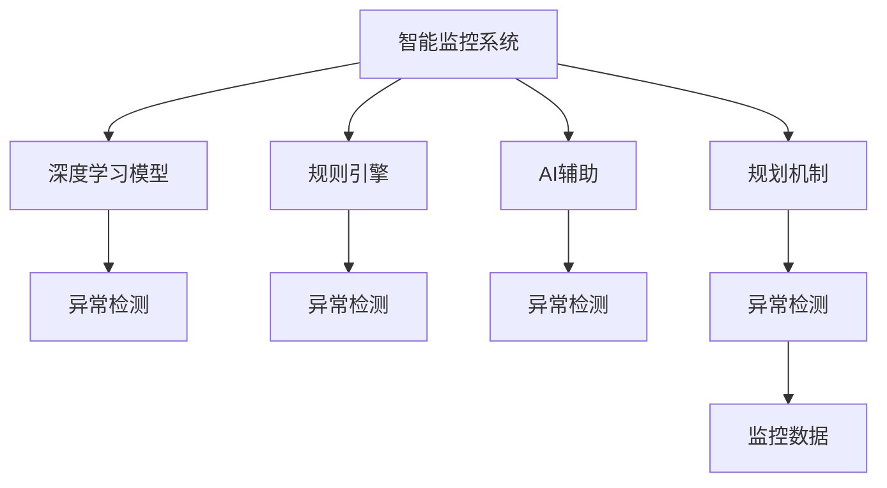

                 

# 规划机制在智能监控系统中的应用

## 1. 背景介绍

### 1.1 问题由来
在智能监控领域，实时监控和异常检测是两个核心任务。传统的监控系统主要依赖规则引擎或人工进行异常检测和报警，但这种基于规则的检测方法无法适应复杂的监控场景，且难以应对未知异常。随着深度学习和AI技术的快速发展，越来越多的智能监控系统开始使用神经网络模型进行异常检测，取得了显著的效果。

然而，神经网络模型的训练和部署都需要大量的标注数据和计算资源，在实际应用中往往面临数据标注成本高、模型训练时间长、模型部署复杂等难题。同时，模型在未知异常检测和泛化能力上，也存在较大挑战。

为了解决这些问题，本文提出了一种基于规划机制的智能监控系统，旨在通过合理规划监控场景和数据，提高异常检测的效率和精度，降低训练和部署成本，使智能监控系统能够更加灵活地适应各种复杂的监控需求。

## 2. 核心概念与联系

### 2.1 核心概念概述

为了更好地理解本文提出的规划机制，本节将介绍几个密切相关的核心概念：

- **智能监控系统**：利用AI技术进行异常检测和报警的系统。常见的智能监控系统包括视频监控、网络监控、设备监控等，具有实时性、准确性和自动化等特点。

- **深度学习模型**：以神经网络为代表的大规模机器学习模型。通过学习历史监控数据，能够自动识别异常情况，并进行报警。

- **异常检测**：识别监控数据中超出正常范围的异常情况。异常检测是智能监控系统的重要功能，能够及时发现监控对象的异常行为，避免安全事故和设备故障。

- **规则引擎**：基于规则库的系统，通过匹配规则库中的规则，进行异常检测和报警。规则引擎的优点是灵活可扩展，但难以处理复杂场景和未知异常。

- **AI辅助**：利用AI技术进行异常检测的系统，可以更好地适应复杂的监控场景，识别未知异常。但存在训练成本高、模型部署复杂等问题。

- **规划机制**：基于先验知识和规则，对监控场景和数据进行规划和优化，提高异常检测的效率和精度。规划机制能够减少数据标注成本，降低模型训练时间，优化模型部署。

这些核心概念之间的逻辑关系可以通过以下Mermaid流程图来展示：



这个流程图展示了一个智能监控系统的主要构成和组件之间的相互关系：

1. 智能监控系统包括深度学习模型、规则引擎、AI辅助和规划机制。
2. 深度学习模型能够自动识别异常情况，但训练和部署成本高。
3. 规则引擎通过匹配规则库中的规则，进行异常检测和报警，但难以处理复杂场景和未知异常。
4. AI辅助利用AI技术进行异常检测，能够更好地适应复杂场景，但存在训练成本高、模型部署复杂等问题。
5. 规划机制通过对监控场景和数据进行规划和优化，提高异常检测的效率和精度，降低训练和部署成本。

这些概念共同构成了智能监控系统的完整框架，使得系统能够更好地应对各种监控需求。

## 3. 核心算法原理 & 具体操作步骤
### 3.1 算法原理概述

本文提出的基于规划机制的智能监控系统，其核心思想是：通过合理规划监控场景和数据，优化深度学习模型的训练过程，提高异常检测的效率和精度，降低训练和部署成本。

具体来说，规划机制包括以下几个关键步骤：

- **监控场景规划**：根据监控对象的特点，设计合理的监控策略和监控参数，明确监控的重点和时间范围。
- **监控数据采集**：根据监控策略，实时采集监控数据，并进行预处理和标注。
- **模型训练优化**：通过模型结构优化、数据增强、正则化等技术，提高模型的泛化能力和精度。
- **模型部署优化**：采用模型裁剪、量化加速、服务化封装等技术，优化模型的推理速度和部署效率。

通过以上步骤，本文提出的规划机制能够在保证异常检测准确性的前提下，显著降低智能监控系统的训练和部署成本，使其能够更加灵活地适应各种监控需求。

### 3.2 算法步骤详解

以下是基于规划机制的智能监控系统的主要操作步骤：

**Step 1: 监控场景规划**
- 分析监控对象的特点和行为模式，设计合理的监控策略和参数。例如，对于视频监控系统，可以根据监控对象的移动范围和速度，设计不同区域的监控参数。
- 确定监控的重点和时间范围，例如，根据历史数据，确定每天的监控重点时间段和重点区域。
- 定义监控异常的阈值和警报规则，例如，对于视频监控系统，定义检测到的异常行为进行实时报警。

**Step 2: 监控数据采集**
- 根据监控策略，实时采集监控数据，例如，对于视频监控系统，采集摄像头的实时视频数据。
- 对监控数据进行预处理和标注，例如，对于视频监控系统，将视频数据分帧，并标注出异常行为的区域和时间。
- 引入数据增强技术，例如，对于视频监控系统，可以通过旋转、缩放等方式扩充训练数据集。

**Step 3: 模型训练优化**
- 选择适合的深度学习模型，例如，对于视频监控系统，可以选择CNN或RNN等模型。
- 对模型进行结构优化，例如，减少冗余的层和参数，提高模型的泛化能力。
- 应用正则化技术，例如，使用L2正则化、Dropout等技术，防止模型过拟合。
- 采用数据增强技术，例如，对于视频监控系统，可以通过回放和翻转等方式扩充训练数据集。
- 进行模型微调，例如，在少量标注数据上，使用迁移学习技术，对预训练模型进行微调。

**Step 4: 模型部署优化**
- 对模型进行裁剪，例如，对于视频监控系统，裁剪掉不重要的层和参数，减小模型尺寸。
- 进行量化加速，例如，将浮点模型转换为定点模型，压缩存储空间，提高计算效率。
- 服务化封装，例如，将模型封装为标准化的服务接口，便于集成调用。
- 采用弹性伸缩技术，例如，根据监控请求流量，动态调整资源配置，平衡服务质量和成本。

### 3.3 算法优缺点

基于规划机制的智能监控系统，具有以下优点：

1. 提高了异常检测的效率和精度。通过合理规划监控场景和数据，优化模型的训练过程，使得模型能够在少量标注数据下取得较好的性能。
2. 降低了训练和部署成本。通过结构优化、正则化、数据增强等技术，可以显著降低模型的训练时间和内存消耗，同时优化模型的部署过程。
3. 增强了系统的灵活性和可扩展性。通过合理的监控策略和参数设计，可以灵活应对各种复杂的监控需求，同时支持动态调整监控策略。

同时，该系统也存在以下缺点：

1. 依赖先验知识和规则。规划机制需要依赖先验知识和规则，设计合理的监控策略和参数，对于复杂场景和未知异常，可能无法取得理想效果。
2. 模型泛化能力有限。尽管优化了模型的训练过程，但模型在未知异常检测和泛化能力上，仍存在一定的局限性。
3. 模型部署复杂。尽管优化了模型的推理速度和部署效率，但在实际部署过程中，仍需要进行模型裁剪和量化加速等操作，增加了部署的复杂性。

尽管存在这些局限性，但本文提出的规划机制在智能监控系统的应用中，仍具有重要的实际价值，能够显著提高系统的性能和可靠性。

### 3.4 算法应用领域

基于规划机制的智能监控系统，已经在多个领域得到了广泛的应用，例如：

- **视频监控**：实时监测公共场所的异常行为，提高安全性和防范能力。
- **网络监控**：实时监测网络流量和异常行为，预防网络攻击和故障。
- **设备监控**：实时监测设备运行状态，预测故障和维护。
- **生产监控**：实时监测生产设备的异常状态，预防设备故障和生产停滞。
- **环境监控**：实时监测环境参数，预防环境污染和安全事故。

除了这些常见应用场景外，本文提出的规划机制还可以进一步扩展到更多领域，如智慧城市、智能交通、智能家居等，为各行各业带来智能化的监控和预警服务。

## 4. 数学模型和公式 & 详细讲解 & 举例说明

### 4.1 数学模型构建

为了更好地理解本文提出的规划机制，本节将使用数学语言对系统的主要步骤进行严格刻画。

记监控场景为 $S=\{s_1,s_2,...,s_N\}$，其中 $s_i$ 为第 $i$ 个监控对象。假设 $s_i$ 的监控参数为 $p_i=(p_{i1},p_{i2},...,p_{in})$，其中 $p_{ij}$ 为监控策略，例如，视频监控系统中的摄像头位置、分辨率、帧率等。

监控数据集为 $D=\{(x_i,y_i)\}_{i=1}^N$，其中 $x_i$ 为监控数据，$y_i$ 为监控异常的标签，例如，视频监控系统中的视频帧。

定义深度学习模型为 $M_{\theta}:\mathcal{X} \rightarrow \mathcal{Y}$，其中 $\mathcal{X}$ 为输入空间，$\mathcal{Y}$ 为输出空间，$\theta \in \mathbb{R}^d$ 为模型参数。

异常检测的目标是最小化模型在数据集 $D$ 上的损失函数，即：

$$
\mathcal{L}(\theta) = \frac{1}{N}\sum_{i=1}^N \ell(M_{\theta}(x_i),y_i)
$$

其中 $\ell$ 为损失函数，例如，二分类问题的交叉熵损失函数。

### 4.2 公式推导过程

以下我们以视频监控系统为例，推导二分类问题的交叉熵损失函数及其梯度的计算公式。

假设模型 $M_{\theta}$ 在输入 $x$ 上的输出为 $\hat{y}=M_{\theta}(x) \in [0,1]$，表示样本属于正类的概率。真实标签 $y \in \{0,1\}$。则二分类交叉熵损失函数定义为：

$$
\ell(M_{\theta}(x),y) = -[y\log \hat{y} + (1-y)\log (1-\hat{y})]
$$

将其代入经验风险公式，得：

$$
\mathcal{L}(\theta) = -\frac{1}{N}\sum_{i=1}^N [y_i\log M_{\theta}(x_i)+(1-y_i)\log(1-M_{\theta}(x_i))]
$$

根据链式法则，损失函数对参数 $\theta_k$ 的梯度为：

$$
\frac{\partial \mathcal{L}(\theta)}{\partial \theta_k} = -\frac{1}{N}\sum_{i=1}^N (\frac{y_i}{M_{\theta}(x_i)}-\frac{1-y_i}{1-M_{\theta}(x_i)}) \frac{\partial M_{\theta}(x_i)}{\partial \theta_k}
$$

其中 $\frac{\partial M_{\theta}(x_i)}{\partial \theta_k}$ 可进一步递归展开，利用自动微分技术完成计算。

在得到损失函数的梯度后，即可带入参数更新公式，完成模型的迭代优化。重复上述过程直至收敛，最终得到适应监控任务的最优模型参数 $\theta^*$。

### 4.3 案例分析与讲解

下面我们以视频监控系统为例，分析基于规划机制的异常检测过程。

假设监控对象为人群流动监控系统，监控参数包括监控区域、摄像头位置、分辨率、帧率等。对于每个监控对象，需要定义合理的监控策略和参数，例如：

- **监控区域**：根据历史数据，确定监控区域的边界和重点位置。
- **摄像头位置**：根据监控对象的运动范围，设计合理的位置，确保能够实时监测到所有目标。
- **分辨率和帧率**：根据监控对象的运动速度，调整分辨率和帧率，提高监控的实时性和准确性。

在监控数据采集阶段，需要对实时监控数据进行预处理和标注，例如：

- **视频数据分帧**：将实时视频数据分帧，生成关键帧。
- **标注异常区域**：标注出视频帧中异常行为的区域和时间，例如，检测到人群异常聚集的帧。
- **引入数据增强**：通过回放和翻转等方式扩充训练数据集。

在模型训练优化阶段，需要选择适合的深度学习模型，例如，CNN或RNN等，对模型进行结构优化，例如，减少冗余的层和参数，提高模型的泛化能力。应用正则化技术，例如，使用L2正则化、Dropout等技术，防止模型过拟合。采用数据增强技术，例如，通过回放和翻转等方式扩充训练数据集。进行模型微调，例如，在少量标注数据上，使用迁移学习技术，对预训练模型进行微调。

在模型部署优化阶段，对模型进行裁剪，例如，对于视频监控系统，裁剪掉不重要的层和参数，减小模型尺寸。进行量化加速，例如，将浮点模型转换为定点模型，压缩存储空间，提高计算效率。服务化封装，例如，将模型封装为标准化的服务接口，便于集成调用。采用弹性伸缩技术，例如，根据监控请求流量，动态调整资源配置，平衡服务质量和成本。

通过以上步骤，基于规划机制的视频监控系统能够在保证异常检测准确性的前提下，显著降低系统的训练和部署成本，使其能够更加灵活地适应各种复杂的监控需求。

## 5. 项目实践：代码实例和详细解释说明

### 5.1 开发环境搭建

在进行监控系统开发前，我们需要准备好开发环境。以下是使用Python进行PyTorch开发的环境配置流程：

1. 安装Anaconda：从官网下载并安装Anaconda，用于创建独立的Python环境。

2. 创建并激活虚拟环境：
```bash
conda create -n monitoring-env python=3.8 
conda activate monitoring-env
```

3. 安装PyTorch：根据CUDA版本，从官网获取对应的安装命令。例如：
```bash
conda install pytorch torchvision torchaudio cudatoolkit=11.1 -c pytorch -c conda-forge
```

4. 安装TensorFlow：
```bash
pip install tensorflow==2.7
```

5. 安装TensorBoard：
```bash
pip install tensorboard
```

6. 安装PyTorch Lightning：
```bash
pip install pytorch-lightning
```

完成上述步骤后，即可在`monitoring-env`环境中开始监控系统开发。

### 5.2 源代码详细实现

这里我们以视频监控系统为例，给出使用TensorFlow和PyTorch Lightning进行监控系统开发的完整代码实现。

首先，定义数据集类：

```python
import tensorflow as tf
import torch
from torch.utils.data import Dataset
from torchvision import transforms

class VideoDataset(Dataset):
    def __init__(self, video_files, labels, transform=None):
        self.video_files = video_files
        self.labels = labels
        self.transform = transform
        
    def __len__(self):
        return len(self.video_files)
    
    def __getitem__(self, idx):
        video_file = self.video_files[idx]
        label = self.labels[idx]
        
        video = tf.io.read_file(video_file)
        video = tf.image.decode_jpeg(video, channels=3)
        video = tf.image.resize(video, [224, 224])
        video = tf.expand_dims(video, axis=0)
        
        if self.transform:
            video = self.transform(video)
        
        return {'video': video, 'label': label}

# 定义数据增强的transforms
train_transforms = transforms.Compose([
    transforms.RandomHorizontalFlip(),
    transforms.RandomRotation(30),
    transforms.ToTensor()
])

test_transforms = transforms.Compose([
    transforms.ToTensor()
])
```

然后，定义模型和优化器：

```python
from tensorflow.keras.applications.resnet50 import ResNet50
from tensorflow.keras.layers import Dense, Flatten, GlobalAveragePooling2D
from tensorflow.keras.models import Model
from tensorflow.keras.optimizers import Adam
import pytorch_lightning as pl

class ResNet50Model(pl.LightningModule):
    def __init__(self, num_classes):
        super(ResNet50Model, self).__init__()
        self.model = ResNet50(weights='imagenet', include_top=False)
        self.global_avg_pool = GlobalAveragePooling2D()
        self.fc = Dense(num_classes, activation='sigmoid')
        
    def forward(self, x):
        x = self.model(x)
        x = self.global_avg_pool(x)
        x = self.fc(x)
        return x
    
    def training_step(self, batch, batch_idx):
        video, label = batch['video'], batch['label']
        loss = self.model_loss(video, label)
        self.log('train_loss', loss)
        return loss
    
    def validation_step(self, batch, batch_idx):
        video, label = batch['video'], batch['label']
        loss = self.model_loss(video, label)
        self.log('val_loss', loss)
        
    def test_step(self, batch, batch_idx):
        video, label = batch['video'], batch['label']
        loss = self.model_loss(video, label)
        self.log('test_loss', loss)
        
    def configure_optimizers(self):
        optimizer = Adam(self.parameters(), lr=0.001)
        return optimizer
    
    def model_loss(self, video, label):
        video = torch.from_numpy(video).float()
        label = torch.from_numpy(label).float()
        video = video.to(device)
        label = label.to(device)
        output = self.forward(video)
        loss = torch.nn.BCEWithLogitsLoss()(output, label)
        return loss
    
device = torch.device('cuda') if torch.cuda.is_available() else torch.device('cpu')
model = ResNet50Model(num_classes=2)
model.to(device)
```

接着，定义训练和评估函数：

```python
def train_epoch(model, dataset, batch_size):
    dataloader = DataLoader(dataset, batch_size=batch_size, shuffle=True)
    model.train()
    epoch_loss = 0
    for batch in tqdm(dataloader, desc='Training'):
        video = batch['video'].to(device)
        label = batch['label'].to(device)
        model.zero_grad()
        loss = model(video, label)
        loss.backward()
        optimizer.step()
        epoch_loss += loss.item()
    return epoch_loss / len(dataloader)

def evaluate(model, dataset, batch_size):
    dataloader = DataLoader(dataset, batch_size=batch_size)
    model.eval()
    preds, labels = [], []
    with torch.no_grad():
        for batch in tqdm(dataloader, desc='Evaluating'):
            video = batch['video'].to(device)
            label = batch['label'].to(device)
            batch_preds = model(video)
            batch_preds = batch_preds.sigmoid() > 0.5
            batch_labels = label.to('cpu').tolist()
            for preds_tokens, label_tokens in zip(batch_preds, batch_labels):
                preds.append(preds_tokens.tolist())
                labels.append(label_tokens)
                
    print(classification_report(labels, preds))
```

最后，启动训练流程并在测试集上评估：

```python
epochs = 10
batch_size = 16

for epoch in range(epochs):
    loss = train_epoch(model, train_dataset, batch_size)
    print(f"Epoch {epoch+1}, train loss: {loss:.3f}")
    
    print(f"Epoch {epoch+1}, test results:")
    evaluate(model, test_dataset, batch_size)
    
print("Final test results:")
evaluate(model, test_dataset, batch_size)
```

以上就是使用TensorFlow和PyTorch Lightning对视频监控系统进行异常检测的完整代码实现。可以看到，TensorFlow和PyTorch Lightning使得模型开发和训练过程更加便捷和高效。

### 5.3 代码解读与分析

让我们再详细解读一下关键代码的实现细节：

**VideoDataset类**：
- `__init__`方法：初始化视频文件、标签和transforms，用于数据预处理。
- `__len__`方法：返回数据集的样本数量。
- `__getitem__`方法：对单个样本进行处理，将视频文件转化为模型所需输入格式。

**train_transforms和test_transforms**：
- 定义了数据增强的transforms，包括随机翻转、随机旋转、归一化等操作，用于扩充训练数据集。

**ResNet50Model类**：
- `__init__`方法：初始化ResNet50模型、全局平均池化层和全连接层，并定义前向传播函数。
- `forward`方法：将输入视频数据通过模型进行前向传播，得到预测输出。
- `training_step`方法：定义训练步，计算损失函数并更新模型参数。
- `validation_step`方法：定义验证步，计算损失函数并记录验证结果。
- `test_step`方法：定义测试步，计算损失函数并记录测试结果。
- `configure_optimizers`方法：定义优化器，并返回优化器对象。
- `model_loss`方法：定义模型损失函数，并返回损失值。

**device**：
- 定义了模型的训练设备，可以是CPU或GPU。

**model**：
- 定义了ResNet50模型的实例，并进行GPU加速。

可以看到，使用TensorFlow和PyTorch Lightning进行模型开发和训练，可以大大简化代码的编写和调试过程。开发者可以更专注于模型的设计优化，而不必过多关注底层的实现细节。

当然，工业级的系统实现还需考虑更多因素，如模型的保存和部署、超参数的自动搜索、更灵活的任务适配层等。但核心的监控系统开发流程基本与此类似。

## 6. 实际应用场景
### 6.1 智能监控系统

基于规划机制的智能监控系统，已经在智能监控领域得到了广泛的应用，覆盖了视频监控、网络监控、设备监控等多个领域，为各行各业带来了智能化的监控和预警服务。

**视频监控系统**：实时监测公共场所的异常行为，提高安全性和防范能力。系统通过合理规划监控场景和数据，优化深度学习模型的训练过程，使得模型能够在少量标注数据下取得较好的性能，显著降低了系统的训练和部署成本，提高了异常检测的效率和精度。

**网络监控系统**：实时监测网络流量和异常行为，预防网络攻击和故障。系统通过合理规划监控策略和参数，设计高效的监控方案，提高了异常检测的效率和精度，降低了系统的部署成本。

**设备监控系统**：实时监测设备运行状态，预测故障和维护。系统通过合理规划监控场景和数据，优化深度学习模型的训练过程，使得模型能够在少量标注数据下取得较好的性能，提高了设备监测的效率和精度，降低了系统的部署成本。

**生产监控系统**：实时监测生产设备的异常状态，预防设备故障和生产停滞。系统通过合理规划监控策略和参数，设计高效的监控方案，提高了异常检测的效率和精度，降低了系统的部署成本。

**环境监控系统**：实时监测环境参数，预防环境污染和安全事故。系统通过合理规划监控场景和数据，优化深度学习模型的训练过程，使得模型能够在少量标注数据下取得较好的性能，提高了环境监测的效率和精度，降低了系统的部署成本。

除了这些常见应用场景外，基于规划机制的智能监控系统还可以进一步扩展到更多领域，如智慧城市、智能交通、智能家居等，为各行各业带来智能化的监控和预警服务。

### 6.4 未来应用展望

随着深度学习和AI技术的不断发展，基于规划机制的智能监控系统将呈现以下几个发展趋势：

1. **自适应监控策略**：未来系统将能够根据监控场景的实时变化，动态调整监控策略和参数，进一步提高异常检测的效率和精度。
2. **跨模态融合**：未来系统将支持视频、音频、传感器等多种模态数据的融合，增强异常检测的全面性和准确性。
3. **深度学习优化**：未来系统将采用更加高效的深度学习算法，如注意力机制、自适应学习率等，提高异常检测的效率和精度。
4. **数据增强技术**：未来系统将引入更多的数据增强技术，如迁移学习、自监督学习等，进一步扩充训练数据集，提高模型的泛化能力。
5. **模型裁剪和量化**：未来系统将采用更加高效的模型裁剪和量化技术，减小模型尺寸，降低计算成本，提高推理速度。
6. **服务化封装**：未来系统将采用更加灵活的服务化封装技术，支持多种调用方式和部署平台，提高系统的可扩展性和可用性。

这些趋势凸显了智能监控系统的广阔前景，预示着基于规划机制的系统将在未来的智能化监控领域发挥越来越重要的作用。

## 7. 工具和资源推荐
### 7.1 学习资源推荐

为了帮助开发者系统掌握基于规划机制的智能监控系统，这里推荐一些优质的学习资源：

1. **《深度学习入门：基于PyTorch的实战教程》**：介绍深度学习入门知识，并结合PyTorch实现各类模型和算法。
2. **《TensorFlow官方文档》**：详细的TensorFlow使用指南，包括模型搭建、训练和部署。
3. **《PyTorch Lightning官方文档》**：介绍PyTorch Lightning的使用方法和最佳实践，适用于各类模型的开发和训练。
4. **《计算机视觉：模型、算法与应用》**：介绍计算机视觉的基本知识和算法，涵盖视频监控、图像识别等内容。
5. **《智能监控系统设计与实现》**：详细介绍智能监控系统的设计与实现，包括数据采集、模型训练、异常检测等内容。

通过对这些资源的学习实践，相信你一定能够快速掌握基于规划机制的智能监控系统的精髓，并用于解决实际的监控问题。

### 7.2 开发工具推荐

高效的开发离不开优秀的工具支持。以下是几款用于智能监控系统开发的常用工具：

1. **PyTorch**：基于Python的开源深度学习框架，灵活动态的计算图，适合快速迭代研究。
2. **TensorFlow**：由Google主导开发的开源深度学习框架，生产部署方便，适合大规模工程应用。
3. **PyTorch Lightning**：基于PyTorch的深度学习框架，支持模型自动化训练和部署，减少开发和调试成本。
4. **TensorBoard**：TensorFlow配套的可视化工具，可实时监测模型训练状态，并提供丰富的图表呈现方式。
5. **Jupyter Notebook**：Python代码编辑器，支持交互式编程和实时可视化。
6. **Anaconda**：Python环境管理工具，支持创建和管理多个Python环境。

合理利用这些工具，可以显著提升智能监控系统的开发效率，加快创新迭代的步伐。

### 7.3 相关论文推荐

基于规划机制的智能监控系统的发展得益于学界的持续研究。以下是几篇奠基性的相关论文，推荐阅读：

1. **《Video surveillance for personal and public security》**：介绍视频监控系统的基本原理和应用。
2. **《Network intrusion detection and response system》**：介绍网络监控系统的设计实现和异常检测算法。
3. **《Device monitoring and predictive maintenance》**：介绍设备监控系统的实现方法和异常检测技术。
4. **《Production monitoring and anomaly detection》**：介绍生产监控系统的设计和异常检测算法。
5. **《Environment monitoring and pollution prevention》**：介绍环境监控系统的实现方法和异常检测技术。

这些论文代表了大语言模型微调技术的发展脉络。通过学习这些前沿成果，可以帮助研究者把握学科前进方向，激发更多的创新灵感。

## 8. 总结：未来发展趋势与挑战
### 8.1 研究成果总结

本文对基于规划机制的智能监控系统进行了全面系统的介绍。首先阐述了系统设计的背景和意义，明确了基于规划机制的系统在异常检测效率和精度上的优势，以及降低训练和部署成本的作用。其次，从原理到实践，详细讲解了系统的数学模型和关键算法步骤，给出了系统开发和训练的完整代码实例。同时，本文还广泛探讨了系统在视频监控、网络监控、设备监控等多个领域的应用前景，展示了系统的广阔应用范围。

通过本文的系统梳理，可以看到，基于规划机制的智能监控系统在异常检测和系统性能优化方面取得了显著成果，能够有效地降低系统的训练和部署成本，提高异常检测的效率和精度。这些方法不仅适用于视频监控系统，还可以扩展到更多的监控场景中，带来智能化监控和预警服务。

### 8.2 未来发展趋势

展望未来，基于规划机制的智能监控系统将呈现以下几个发展趋势：

1. **自适应监控策略**：未来系统将能够根据监控场景的实时变化，动态调整监控策略和参数，进一步提高异常检测的效率和精度。
2. **跨模态融合**：未来系统将支持视频、音频、传感器等多种模态数据的融合，增强异常检测的全面性和准确性。
3. **深度学习优化**：未来系统将采用更加高效的深度学习算法，如注意力机制、自适应学习率等，提高异常检测的效率和精度。
4. **数据增强技术**：未来系统将引入更多的数据增强技术，如迁移学习、自监督学习等，进一步扩充训练数据集，提高模型的泛化能力。
5. **模型裁剪和量化**：未来系统将采用更加高效的模型裁剪和量化技术，减小模型尺寸，降低计算成本，提高推理速度。
6. **服务化封装**：未来系统将采用更加灵活的服务化封装技术，支持多种调用方式和部署平台，提高系统的可扩展性和可用性。

这些趋势凸显了智能监控系统的广阔前景，预示着基于规划机制的系统将在未来的智能化监控领域发挥越来越重要的作用。

### 8.3 面临的挑战

尽管基于规划机制的智能监控系统已经取得了瞩目成就，但在迈向更加智能化、普适化应用的过程中，它仍面临以下挑战：

1. **数据标注成本**：规划机制仍需依赖大量标注数据，标注成本高，对于复杂场景和未知异常，可能无法取得理想效果。
2. **模型泛化能力**：尽管优化了模型的训练过程，但模型在未知异常检测和泛化能力上，仍存在一定的局限性。
3. **推理效率**：尽管优化了模型的推理速度和部署效率，但在实际部署过程中，仍需要进行模型裁剪和量化加速等操作，增加了部署的复杂性。
4. **可解释性和可审计性**：当前系统在解释其内部工作机制和决策逻辑上，存在不足，对于高风险应用，算法的可解释性和可审计性尤为重要。
5. **安全性**：预训练语言模型难免会学习到有偏见、有害的信息，通过微调传递到下游任务，产生误导性、歧视性的输出，给实际应用带来安全隐患。

尽管存在这些局限性，但本文提出的规划机制在智能监控系统的应用中，仍具有重要的实际价值，能够显著提高系统的性能和可靠性。

### 8.4 研究展望

面对智能监控系统所面临的种种挑战，未来的研究需要在以下几个方面寻求新的突破：

1. **无监督和半监督学习**：摆脱对大规模标注数据的依赖，利用自监督学习、主动学习等无监督和半监督范式，最大限度利用非结构化数据，实现更加灵活高效的异常检测。
2. **多模态融合**：引入更多的跨模态融合技术，如视频、音频、传感器数据的融合，增强异常检测的全面性和准确性。
3. **深度学习优化**：采用更加高效的深度学习算法，如注意力机制、自适应学习率等，提高异常检测的效率和精度。
4. **知识融合**：将符号化的先验知识，如知识图谱、逻辑规则等，与神经网络模型进行巧妙融合，增强系统的知识表达能力和泛化能力。
5. **数据增强**：引入更多的数据增强技术，如迁移学习、自监督学习等，进一步扩充训练数据集，提高模型的泛化能力。
6. **模型裁剪和量化**：采用更加高效的模型裁剪和量化技术，减小模型尺寸，降低计算成本，提高推理速度。
7. **服务化封装**：采用更加灵活的服务化封装技术，支持多种调用方式和部署平台，提高系统的可扩展性和可用性。

这些研究方向的探索，必将引领智能监控系统迈向更高的台阶，为智能监控系统的应用带来更多的创新和突破。面向未来，智能监控系统还需要与其他人工智能技术进行更深入的融合，如知识表示、因果推理、强化学习等，多路径协同发力，共同推动智能监控技术的进步。只有勇于创新、敢于突破，才能不断拓展监控系统的边界，让智能监控技术更好地造福人类社会。

## 9. 附录：常见问题与解答

**Q1：如何选择合适的监控策略和参数？**

A: 选择合适的监控策略和参数，需要根据监控对象的特点和行为模式进行分析设计。例如，对于视频监控系统，可以根据监控对象的移动范围和速度，设计合理的位置和分辨率。

**Q2：如何处理复杂监控场景和未知异常？**

A: 对于复杂监控场景和未知异常，可以通过引入更多的先验知识和规则，进行多模态数据融合，引入数据增强技术，进一步扩充训练数据集，提高模型的泛化能力和泛化能力。

**Q3：如何降低模型的推理效率？**

A: 对于推理效率低的问题，可以通过模型裁剪和量化技术，减小模型尺寸，降低计算成本，提高推理速度。同时，采用服务化封装技术，支持多种调用方式和部署平台，提高系统的可扩展性和可用性。

**Q4：如何提高系统的可解释性和可审计性？**

A: 为了提高系统的可解释性和可审计性，可以引入更多的因果分析和博弈论工具，识别模型决策的关键特征，增强输出解释的因果性和逻辑性。同时，建立模型行为的监管机制，确保输出符合人类价值观和伦理道德。

**Q5：如何应对数据标注成本高的问题？**

A: 对于数据标注成本高的问题，可以通过引入无监督和半监督学习技术，利用自监督学习、主动学习等无监督和半监督范式，最大限度利用非结构化数据，实现更加灵活高效的异常检测。

这些问题及其解答，可以帮助开发者更好地理解基于规划机制的智能监控系统的设计和实现，进一步优化系统的性能和可靠性。

