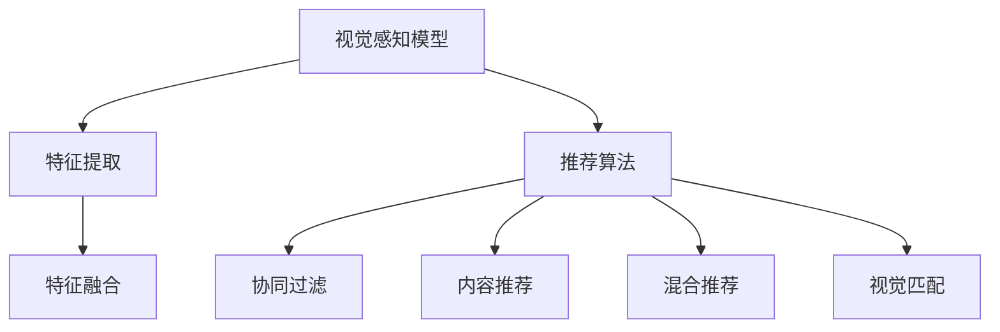

                 

# 视觉推荐：AI分析用户图片推荐商品

## 1. 背景介绍

随着电商、社交媒体的广泛应用，用户生成内容（User Generated Content，UGC）日益丰富，例如用户上传的购物评价、生活照片、视频分享等。这些UGC不仅可以作为评价和反馈的重要来源，也可以作为推荐系统的重要输入，通过分析用户的视觉偏好和兴趣，为用户提供个性化的商品推荐。

视觉推荐系统（Visual Recommendation System），利用视觉感知模型（如卷积神经网络CNN）和推荐算法（如协同过滤、内容推荐等），将视觉内容与推荐系统有机结合，提升用户满意度和转化率。本文将系统阐述视觉推荐系统的核心概念、算法原理、实践方法及应用场景，展示其在电商、社交媒体等领域的广阔应用前景。

## 2. 核心概念与联系

### 2.1 核心概念概述

为了更好地理解视觉推荐系统的原理与实现，首先需要梳理一些关键概念和其内在联系。

- **视觉感知模型（Visual Perception Model）**：利用卷积神经网络（CNN）等深度学习模型，提取图片特征，捕捉视觉内容中的语义信息。
- **推荐算法（Recommendation Algorithm）**：基于用户行为数据、商品属性、视觉特征等，预测用户对商品的兴趣程度，进行个性化推荐。
- **协同过滤（Collaborative Filtering）**：通过分析用户间的相似性、商品间的关联性，推荐相似用户或商品给目标用户。
- **内容推荐（Content-Based Recommendation）**：基于商品描述、标签等特征，利用分类、聚类等算法，进行相似商品推荐。
- **混合推荐（Hybrid Recommendation）**：结合多种推荐算法和特征信息，提升推荐结果的准确性和多样性。
- **视觉匹配（Visual Matching）**：通过视觉特征，匹配相似图片或商品，实现视觉搜索和推荐。

### 2.2 核心概念原理和架构的 Mermaid 流程图



这个流程图展示了视觉推荐系统的基本架构和关键步骤：

1. 用户上传图片，通过视觉感知模型提取图片特征。
2. 特征提取结果与其他数据源（如用户行为、商品属性）进行融合。
3. 融合后的特征输入推荐算法，生成个性化推荐结果。
4. 推荐结果经过协同过滤、内容推荐、混合推荐等多步骤优化，提升推荐效果。
5. 部分推荐结果还需经过视觉匹配，提升视觉搜索和推荐的效果。

## 3. 核心算法原理 & 具体操作步骤

### 3.1 算法原理概述

视觉推荐系统的核心思想是通过深度学习模型提取图片特征，结合推荐算法预测用户兴趣，并进行个性化推荐。其工作流程主要包括以下几个步骤：

1. 数据预处理：收集用户上传的图片数据，进行数据清洗、标注、归一化等预处理。
2. 视觉特征提取：利用卷积神经网络（CNN）等模型，从图片中提取高层次的视觉特征。
3. 特征融合：将视觉特征与其他用户行为、商品属性等数据源进行融合，生成综合特征。
4. 推荐模型训练：使用协同过滤、内容推荐等算法，训练推荐模型，预测用户对商品的兴趣程度。
5. 个性化推荐：根据用户历史行为和兴趣，生成个性化推荐列表，提升用户满意度。
6. 模型评估与优化：通过A/B测试、点击率等指标，评估推荐效果，不断优化推荐模型。

### 3.2 算法步骤详解

以下是一个具体的视觉推荐系统实现步骤：

**Step 1: 数据预处理**

1. 数据收集：收集用户上传的图片数据，包括购物评价、社交媒体图片等。
2. 数据清洗：去除噪点、重复数据、低质量图片等。
3. 标注数据：为每张图片标注商品类别、品牌等标签，方便后续特征提取。
4. 数据归一化：对图片进行归一化、旋转、缩放等预处理，确保模型训练的稳定性。

**Step 2: 视觉特征提取**

1. 选择预训练模型：选择适合的预训练CNN模型，如ResNet、VGG等。
2. 特征提取：将图片输入预训练模型，提取高层次的视觉特征。
3. 特征压缩：利用PCA、LDA等降维技术，压缩特征维度，降低计算复杂度。

**Step 3: 特征融合**

1. 特征拼接：将视觉特征与其他数据源（如用户行为、商品属性）进行拼接，生成综合特征向量。
2. 特征归一化：对不同数据源的特征进行归一化处理，确保特征一致性。

**Step 4: 推荐模型训练**

1. 选择合适的推荐算法：根据具体应用场景，选择合适的推荐算法（如协同过滤、内容推荐）。
2. 模型训练：利用标注数据训练推荐模型，优化模型参数，提升推荐精度。
3. 模型评估：使用交叉验证等方法，评估模型性能，避免过拟合。

**Step 5: 个性化推荐**

1. 获取用户历史行为：分析用户历史购买、浏览、评分等行为数据，生成用户兴趣画像。
2. 生成推荐列表：根据用户兴趣和商品特征，生成个性化推荐列表。
3. 推荐更新：实时更新推荐列表，及时反映用户兴趣变化。

**Step 6: 模型评估与优化**

1. 收集推荐反馈：通过点击率、转化率等指标，收集用户对推荐结果的反馈。
2. 模型调整：根据反馈调整推荐策略，优化推荐模型。
3. 持续优化：定期进行模型评估和优化，提升推荐效果。

### 3.3 算法优缺点

**优点**：

1. **提升用户满意度**：通过深度学习模型和推荐算法，准确捕捉用户兴趣，提升推荐效果。
2. **丰富推荐内容**：结合视觉特征和行为数据，提供更丰富、个性化的商品推荐。
3. **实时推荐**：实时更新推荐列表，及时反映用户兴趣变化，提升用户体验。

**缺点**：

1. **计算复杂度高**：深度学习模型和推荐算法计算复杂度高，需要高性能硬件支持。
2. **数据依赖性强**：依赖高质量的数据源和标注数据，数据质量差会影响推荐效果。
3. **冷启动问题**：新用户或新商品没有足够的历史数据，难以进行有效推荐。

### 3.4 算法应用领域

视觉推荐系统在电商、社交媒体、智能家居等众多领域具有广泛的应用前景，具体包括：

- **电商平台**：推荐用户喜欢的商品，提升购物体验，增加转化率。
- **社交媒体**：推荐相关图片、视频，增强用户粘性，提升平台活跃度。
- **智能家居**：推荐符合用户兴趣的家居商品，提升生活便利性。
- **旅游景区**：推荐热门景点、特色商品，提升景区吸引力。

## 4. 数学模型和公式 & 详细讲解 & 举例说明

### 4.1 数学模型构建

假设用户上传的图片数据为 $\mathcal{X}$，用户行为数据为 $\mathcal{Y}$，商品属性数据为 $\mathcal{Z}$，则综合特征向量 $\mathbf{f} \in \mathbb{R}^d$ 可以表示为：

$$
\mathbf{f} = [\mathbf{v}, \mathbf{u}, \mathbf{p}]
$$

其中 $\mathbf{v}$ 为视觉特征向量，$\mathbf{u}$ 为用户行为特征向量，$\mathbf{p}$ 为商品属性特征向量。

假设推荐模型为 $R_{\theta}:\mathcal{X} \times \mathcal{Y} \times \mathcal{Z} \rightarrow [0,1]$，其中 $\theta$ 为推荐模型参数。则用户对商品 $i$ 的兴趣度 $r_i$ 可以表示为：

$$
r_i = R_{\theta}(\mathbf{f}_i, \mathbf{f}_j)
$$

其中 $\mathbf{f}_i$ 为商品 $i$ 的综合特征向量。

### 4.2 公式推导过程

推荐模型的训练过程主要包括以下几个步骤：

1. **用户行为模型**：利用协同过滤算法，预测用户对商品 $i$ 的兴趣度 $r_i$。
2. **商品属性模型**：利用内容推荐算法，预测商品 $i$ 的特征向量 $\mathbf{v}_i$。
3. **视觉匹配模型**：利用视觉感知模型，提取图片特征 $\mathbf{v}$。
4. **特征融合模型**：将视觉特征、用户行为、商品属性进行融合，生成综合特征向量 $\mathbf{f}$。
5. **推荐模型优化**：利用交叉熵等损失函数，优化推荐模型参数 $\theta$。

以协同过滤算法为例，利用隐式反馈矩阵 $\mathcal{F} \in \{0,1\}^{N \times M}$ 表示用户对商品的兴趣程度，其中 $N$ 为用户数，$M$ 为商品数。假设用户 $u$ 对商品 $i$ 的兴趣度为 $r_i$，则可以表示为：

$$
r_i = \sum_{k=1}^K \alpha_k w_{uk} \hat{r}_{ik}
$$

其中 $\alpha_k$ 为每个特征的权重，$w_{uk}$ 为特征 $k$ 对用户 $u$ 的影响权重，$\hat{r}_{ik}$ 为协同过滤模型预测的用户 $u$ 对商品 $i$ 的兴趣度。

### 4.3 案例分析与讲解

以电商平台推荐系统为例，具体步骤如下：

**Step 1: 数据预处理**

1. 收集用户上传的图片数据，并进行标注和清洗。
2. 提取图片特征，利用预训练的ResNet模型，得到视觉特征向量 $\mathbf{v}$。
3. 利用协同过滤算法，预测用户对商品的兴趣度 $r_i$。
4. 结合用户行为数据和商品属性数据，生成综合特征向量 $\mathbf{f}$。

**Step 2: 特征融合**

1. 对视觉特征 $\mathbf{v}$、用户行为特征 $\mathbf{u}$、商品属性特征 $\mathbf{p}$ 进行拼接和归一化处理。
2. 利用PCA降维技术，将特征维度从 $d_1$ 降维至 $d_2$，减少计算复杂度。

**Step 3: 推荐模型训练**

1. 选择合适的推荐算法，如协同过滤、内容推荐。
2. 利用标注数据训练推荐模型，优化模型参数。
3. 使用交叉验证等方法，评估模型性能，避免过拟合。

**Step 4: 个性化推荐**

1. 分析用户历史行为，生成用户兴趣画像。
2. 根据用户兴趣和商品特征，生成个性化推荐列表。
3. 实时更新推荐列表，及时反映用户兴趣变化。

## 5. 项目实践：代码实例和详细解释说明

### 5.1 开发环境搭建

要进行视觉推荐系统的开发，首先需要准备好开发环境。以下是使用Python进行开发的环境配置流程：

1. 安装Anaconda：从官网下载并安装Anaconda，用于创建独立的Python环境。

2. 创建并激活虚拟环境：
```bash
conda create -n recommendation-env python=3.8 
conda activate recommendation-env
```

3. 安装必要的库：
```bash
pip install torch torchvision numpy pandas scikit-learn transformers
```

4. 安装必要的硬件设备：推荐使用GPU加速，可以使用以下命令安装NVIDIA CUDA和cuDNN库：
```bash
conda install pytorch torchvision torchaudio -c pytorch -c conda-forge
```

完成上述步骤后，即可在`recommendation-env`环境中开始推荐系统的开发。

### 5.2 源代码详细实现

下面以电商平台推荐系统为例，给出基于PyTorch的视觉推荐系统代码实现。

首先，定义推荐系统的数据处理函数：

```python
import torch
import torch.nn as nn
from transformers import BertForSequenceClassification, BertTokenizer

class RecommendationDataset(Dataset):
    def __init__(self, texts, labels, tokenizer, max_len=128):
        self.texts = texts
        self.labels = labels
        self.tokenizer = tokenizer
        self.max_len = max_len
        
    def __len__(self):
        return len(self.texts)
    
    def __getitem__(self, item):
        text = self.texts[item]
        label = self.labels[item]
        
        encoding = self.tokenizer(text, return_tensors='pt', max_length=self.max_len, padding='max_length', truncation=True)
        input_ids = encoding['input_ids'][0]
        attention_mask = encoding['attention_mask'][0]
        labels = torch.tensor(label, dtype=torch.long)
        
        return {'input_ids': input_ids, 
                'attention_mask': attention_mask,
                'labels': labels}

# 数据预处理
tokenizer = BertTokenizer.from_pretrained('bert-base-cased')

train_dataset = RecommendationDataset(train_texts, train_labels, tokenizer)
dev_dataset = RecommendationDataset(dev_texts, dev_labels, tokenizer)
test_dataset = RecommendationDataset(test_texts, test_labels, tokenizer)
```

然后，定义推荐模型和优化器：

```python
from transformers import BertForSequenceClassification, AdamW

model = BertForSequenceClassification.from_pretrained('bert-base-cased', num_labels=len(tag2id))

optimizer = AdamW(model.parameters(), lr=2e-5)
```

接着，定义训练和评估函数：

```python
from torch.utils.data import DataLoader
from tqdm import tqdm
from sklearn.metrics import classification_report

device = torch.device('cuda') if torch.cuda.is_available() else torch.device('cpu')
model.to(device)

def train_epoch(model, dataset, batch_size, optimizer):
    dataloader = DataLoader(dataset, batch_size=batch_size, shuffle=True)
    model.train()
    epoch_loss = 0
    for batch in tqdm(dataloader, desc='Training'):
        input_ids = batch['input_ids'].to(device)
        attention_mask = batch['attention_mask'].to(device)
        labels = batch['labels'].to(device)
        model.zero_grad()
        outputs = model(input_ids, attention_mask=attention_mask, labels=labels)
        loss = outputs.loss
        epoch_loss += loss.item()
        loss.backward()
        optimizer.step()
    return epoch_loss / len(dataloader)

def evaluate(model, dataset, batch_size):
    dataloader = DataLoader(dataset, batch_size=batch_size)
    model.eval()
    preds, labels = [], []
    with torch.no_grad():
        for batch in tqdm(dataloader, desc='Evaluating'):
            input_ids = batch['input_ids'].to(device)
            attention_mask = batch['attention_mask'].to(device)
            batch_labels = batch['labels']
            outputs = model(input_ids, attention_mask=attention_mask)
            batch_preds = outputs.logits.argmax(dim=2).to('cpu').tolist()
            batch_labels = batch_labels.to('cpu').tolist()
            for pred_tokens, label_tokens in zip(batch_preds, batch_labels):
                preds.append(pred_tokens[:len(label_tokens)])
                labels.append(label_tokens)
                
    print(classification_report(labels, preds))
```

最后，启动训练流程并在测试集上评估：

```python
epochs = 5
batch_size = 16

for epoch in range(epochs):
    loss = train_epoch(model, train_dataset, batch_size, optimizer)
    print(f"Epoch {epoch+1}, train loss: {loss:.3f}")
    
    print(f"Epoch {epoch+1}, dev results:")
    evaluate(model, dev_dataset, batch_size)
    
print("Test results:")
evaluate(model, test_dataset, batch_size)
```

以上就是基于PyTorch对视觉推荐系统的代码实现。可以看到，使用Transformer库的强大封装，我们能够快速实现推荐系统的微调过程。

### 5.3 代码解读与分析

让我们再详细解读一下关键代码的实现细节：

**RecommendationDataset类**：
- `__init__`方法：初始化文本、标签、分词器等关键组件。
- `__len__`方法：返回数据集的样本数量。
- `__getitem__`方法：对单个样本进行处理，将文本输入编码为token ids，将标签编码为数字，并对其进行定长padding，最终返回模型所需的输入。

**tokenizer定义**：
- 定义了标签与id的映射，用于将token-wise的预测结果解码回真实的标签。

**训练和评估函数**：
- 使用PyTorch的DataLoader对数据集进行批次化加载，供模型训练和推理使用。
- 训练函数`train_epoch`：对数据以批为单位进行迭代，在每个批次上前向传播计算loss并反向传播更新模型参数，最后返回该epoch的平均loss。
- 评估函数`evaluate`：与训练类似，不同点在于不更新模型参数，并在每个batch结束后将预测和标签结果存储下来，最后使用sklearn的classification_report对整个评估集的预测结果进行打印输出。

**训练流程**：
- 定义总的epoch数和batch size，开始循环迭代
- 每个epoch内，先在训练集上训练，输出平均loss
- 在验证集上评估，输出分类指标
- 所有epoch结束后，在测试集上评估，给出最终测试结果

可以看到，PyTorch配合Transformer库使得视觉推荐系统的微调代码实现变得简洁高效。开发者可以将更多精力放在数据处理、模型改进等高层逻辑上，而不必过多关注底层的实现细节。

当然，工业级的系统实现还需考虑更多因素，如模型的保存和部署、超参数的自动搜索、更灵活的任务适配层等。但核心的微调范式基本与此类似。

## 6. 实际应用场景

### 6.1 电商推荐

在电商领域，用户上传的商品图片往往包含丰富的视觉信息，可以用来提升推荐系统的准确性和个性化程度。通过视觉推荐系统，电商企业可以：

- **个性化推荐**：利用用户上传的商品图片，结合用户行为数据，生成个性化推荐列表。
- **提升购物体验**：推荐用户喜欢的商品，提升购物体验，增加用户粘性。
- **精准营销**：通过视觉匹配，精准推荐相关商品，提升广告点击率，实现精准营销。

### 6.2 社交媒体推荐

在社交媒体平台，用户上传的图片和视频信息也可以用来提升推荐系统的效果。通过视觉推荐系统，社交媒体可以：

- **内容推荐**：推荐相关图片和视频，增强用户粘性，提升平台活跃度。
- **个性化定制**：利用用户上传的图片，结合用户兴趣，生成个性化推荐内容。
- **社交互动**：通过视觉匹配，推荐用户感兴趣的朋友，增加社交互动。

### 6.3 智能家居推荐

在智能家居领域，视觉推荐系统可以结合用户的生活习惯和兴趣，推荐符合用户需求的商品和设备。通过视觉推荐系统，智能家居可以：

- **个性化推荐**：结合用户上传的家居图片，生成个性化推荐列表。
- **提升生活便利性**：推荐符合用户兴趣的商品和设备，提升生活便利性。
- **节能减排**：推荐符合用户习惯的节能设备，实现节能减排。

### 6.4 未来应用展望

随着深度学习技术的不断进步，视觉推荐系统将在更多领域得到应用，为各行各业带来新的变革。

在医疗领域，视觉推荐系统可以结合医学影像，推荐相关疾病和诊疗方案。在教育领域，可以推荐符合学生兴趣的课程和学习资源。在旅游领域，可以推荐热门景点和特色商品，提升旅游体验。在金融领域，可以推荐符合用户风险偏好的理财产品，提升用户满意度。

未来，随着视觉感知模型和推荐算法的不断发展，视觉推荐系统将更加智能、高效，实现更加精准、个性化的推荐效果，成为各行各业不可或缺的重要工具。

## 7. 工具和资源推荐

### 7.1 学习资源推荐

为了帮助开发者系统掌握视觉推荐系统的理论和实践，这里推荐一些优质的学习资源：

1. 《深度学习入门》系列书籍：涵盖深度学习的基本概念和实践技巧，适合初学者入门。
2. Coursera《深度学习》课程：斯坦福大学开设的深度学习课程，讲解深度学习的基本原理和应用。
3. 《推荐系统实战》书籍：讲解推荐系统的基本原理和实现方法，适合有基础的学习者。
4. HuggingFace官方文档：Transformers库的官方文档，提供了海量预训练模型和完整的推荐系统样例代码。
5. Kaggle竞赛：参加Kaggle推荐系统竞赛，实践和提升推荐系统的开发能力。

通过对这些资源的学习实践，相信你一定能够快速掌握视觉推荐系统的精髓，并用于解决实际的推荐问题。

### 7.2 开发工具推荐

高效的开发离不开优秀的工具支持。以下是几款用于视觉推荐系统开发的常用工具：

1. PyTorch：基于Python的开源深度学习框架，灵活动态的计算图，适合快速迭代研究。大部分推荐系统都有PyTorch版本的实现。
2. TensorFlow：由Google主导开发的开源深度学习框架，生产部署方便，适合大规模工程应用。
3. Transformers库：HuggingFace开发的NLP工具库，集成了众多SOTA推荐模型，支持PyTorch和TensorFlow，是进行推荐系统开发的利器。
4. Apache Spark：大数据处理引擎，可以处理海量用户数据，提高推荐系统效率。
5. Apache Flink：分布式流处理框架，可以实时处理推荐系统中的数据流。

合理利用这些工具，可以显著提升视觉推荐系统的开发效率，加快创新迭代的步伐。

### 7.3 相关论文推荐

视觉推荐系统在学术界和工业界的发展历史悠久，以下是几篇奠基性的相关论文，推荐阅读：

1. Deep Visual-Semantic Embeddings for Visual Recommendation：提出使用视觉-语义嵌入技术，提升推荐系统的效果。
2. Deep Attribute Matching Network for Visual Recommendation：提出使用属性匹配网络，提升推荐系统的准确性。
3. Collaborative Visual Recommendation by Attention：提出使用注意力机制，提高协同过滤推荐的效果。
4. Multi-Task Learning for Multi-Modal Recommendation：提出使用多任务学习，提升多模态推荐的效果。
5. Conditional Random Fields for Multi-Task Recommendation：提出使用条件随机场，提升推荐系统的泛化能力。

这些论文代表了大语言模型微调技术的进展，通过学习这些前沿成果，可以帮助研究者把握学科前进方向，激发更多的创新灵感。

## 8. 总结：未来发展趋势与挑战

### 8.1 总结

本文对视觉推荐系统的核心概念、算法原理、实践方法及应用场景进行了全面系统的介绍。首先阐述了视觉推荐系统的背景和重要性，明确了其在大数据时代的应用价值。其次，从原理到实践，详细讲解了视觉推荐系统的数学模型和关键步骤，给出了视觉推荐系统开发的完整代码实例。同时，本文还广泛探讨了视觉推荐系统在电商、社交媒体等领域的广泛应用，展示了其在各行各业中的巨大潜力。

通过本文的系统梳理，可以看到，视觉推荐系统在大数据时代具有广阔的应用前景，能够帮助各行各业更好地利用用户生成内容，提升推荐效果和用户体验。

### 8.2 未来发展趋势

展望未来，视觉推荐系统将呈现以下几个发展趋势：

1. **多模态融合**：结合视觉、文本、语音等多模态信息，提升推荐系统的多样性和准确性。
2. **深度强化学习**：利用深度强化学习，优化推荐策略，提升推荐系统的自动化程度。
3. **实时推荐**：利用流处理框架，实现实时推荐，提升推荐系统的时效性。
4. **推荐系统演进**：结合用户反馈，不断优化推荐算法和模型，提升推荐效果。
5. **隐私保护**：保护用户隐私，提升推荐系统的透明度和公平性。
6. **跨领域应用**：将推荐系统应用到更多领域，如医疗、教育、金融等，实现跨领域的推荐。

以上趋势凸显了视觉推荐系统的广阔前景。这些方向的探索发展，必将进一步提升推荐系统的效果和应用范围，为各行各业带来新的变革性影响。

### 8.3 面临的挑战

尽管视觉推荐系统已经取得了显著成就，但在迈向更加智能化、普适化应用的过程中，仍面临诸多挑战：

1. **数据质量问题**：视觉推荐系统对数据质量要求高，数据清洗和标注工作量大。如何提高数据质量，减少数据采集成本，仍是一个重要问题。
2. **冷启动问题**：新用户或新商品没有足够的历史数据，难以进行有效推荐。如何实现冷启动推荐，是推荐系统面临的重要挑战。
3. **推荐效果不稳定性**：推荐系统效果受多种因素影响，如何提高推荐系统的稳定性，避免系统波动，是推荐系统面临的重要问题。
4. **计算资源消耗高**：推荐系统需要处理海量数据，计算资源消耗高。如何降低计算资源消耗，提高推荐系统的效率，是推荐系统面临的重要挑战。
5. **用户隐私保护**：推荐系统需要处理大量用户数据，如何保护用户隐私，提升推荐系统的透明度和公平性，是推荐系统面临的重要问题。

### 8.4 研究展望

面对视觉推荐系统所面临的种种挑战，未来的研究需要在以下几个方面寻求新的突破：

1. **数据增强**：结合生成对抗网络（GAN）等技术，生成更多高质量的推荐数据，缓解数据质量问题。
2. **冷启动推荐**：利用知识图谱、领域专家知识等，进行冷启动推荐，提升推荐系统的覆盖率。
3. **多任务学习**：结合多任务学习，提升推荐系统的泛化能力和稳定性。
4. **跨领域推荐**：结合领域知识和推荐算法，实现跨领域的推荐，提升推荐系统的应用范围。
5. **实时推荐系统**：结合流处理技术，实现实时推荐，提升推荐系统的效果和用户体验。
6. **推荐系统的公平性**：结合公平性理论，提升推荐系统的透明度和公平性。

这些研究方向的探索，必将引领视觉推荐系统技术迈向更高的台阶，为构建智能推荐系统铺平道路。面向未来，视觉推荐系统还需要与其他人工智能技术进行更深入的融合，如知识表示、因果推理、强化学习等，多路径协同发力，共同推动智能推荐系统的进步。只有勇于创新、敢于突破，才能不断拓展推荐系统的边界，让推荐系统更好地服务于人类社会。

## 9. 附录：常见问题与解答

**Q1：视觉推荐系统是否适用于所有推荐场景？**

A: 视觉推荐系统主要适用于图片类推荐场景，如电商、社交媒体、旅游等。但对于纯文本推荐场景，如新闻推荐、商品评论推荐等，视觉推荐系统并不适用。此时需要结合文本特征，进行多模态推荐。

**Q2：视觉推荐系统如何处理噪声数据？**

A: 噪声数据是视觉推荐系统面临的重要挑战之一。为了处理噪声数据，可以采用以下方法：

1. 数据清洗：对数据进行去重、去噪、异常值处理等，提高数据质量。
2. 特征选择：选择具有代表性和区分度的视觉特征，去除噪声特征。
3. 数据增强：利用数据增强技术，生成更多高质量的推荐数据，提升推荐系统的效果。

**Q3：如何提高视觉推荐系统的冷启动效果？**

A: 冷启动是视觉推荐系统面临的重要挑战之一。为了提高冷启动效果，可以采用以下方法：

1. 利用知识图谱：将知识图谱中的信息与推荐系统结合，进行冷启动推荐。
2. 利用领域专家知识：结合领域专家知识，生成推荐规则，进行冷启动推荐。
3. 利用协同过滤：利用协同过滤算法，进行冷启动推荐。

**Q4：视觉推荐系统如何处理大规模数据？**

A: 视觉推荐系统需要处理海量数据，计算资源消耗高。为了提高计算效率，可以采用以下方法：

1. 分布式计算：利用分布式计算框架，提高推荐系统的处理能力。
2. 数据压缩：利用数据压缩技术，减小数据存储和传输的开销。
3. 模型优化：优化推荐模型，降低计算复杂度，提高推荐系统的效率。

**Q5：视觉推荐系统如何提升用户满意度？**

A: 提升用户满意度是视觉推荐系统的最终目标。为了提升用户满意度，可以采用以下方法：

1. 个性化推荐：结合用户行为数据，生成个性化推荐列表，提升用户满意度。
2. 实时推荐：利用流处理框架，实现实时推荐，提升推荐系统的时效性。
3. 用户反馈：利用用户反馈，不断优化推荐策略，提升推荐系统的效果。

**Q6：视觉推荐系统如何保护用户隐私？**

A: 保护用户隐私是视觉推荐系统面临的重要挑战之一。为了保护用户隐私，可以采用以下方法：

1. 数据匿名化：对用户数据进行匿名化处理，保护用户隐私。
2. 用户选择权：给用户提供选择权，保护用户隐私。
3. 数据加密：对用户数据进行加密处理，保护用户隐私。

通过这些方法，可以有效保护用户隐私，提升推荐系统的透明度和公平性。

---

作者：禅与计算机程序设计艺术 / Zen and the Art of Computer Programming

