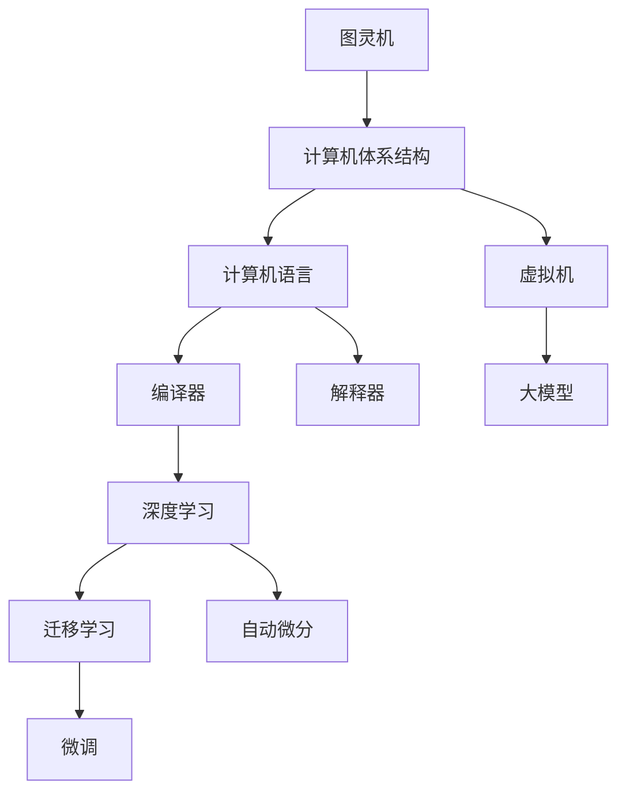

                 

## 1. 背景介绍

### 1.1 问题由来

计算机科学的源头是图灵机，这一抽象的计算模型为计算机科学奠定了坚实的理论基础。然而，随着计算技术的发展，尤其是人工智能技术的进步，图灵机理论已经无法完全解释现代计算范式和计算工具的特性。因此，我们需要重新审视计算范式的演进，理解从图灵机到现代大模型的演变过程，以及这一过程中所涉及的关键理论和算法。

### 1.2 问题核心关键点

本文的核心问题在于：理解从图灵机到现代大模型，计算范式是如何演变的？这种演变是如何推动人工智能技术发展的？以及这种演变背后的关键理论和技术。

## 2. 核心概念与联系

### 2.1 核心概念概述

- 图灵机(The Turing Machine)：由图灵提出的抽象计算模型，被认为是现代计算机的基础。图灵机通过符号在带上的读写操作，模拟了基本的计算过程。
- 计算机体系结构(Computer Architecture)：计算机内部硬件和软件之间的接口和交互规则。包括CPU、内存、I/O等组成部分。
- 计算机语言(Computer Language)：计算机程序和指令的表达方式。包括汇编语言、C++、Python等。
- 编译器(Compiler)：将高级语言编写的程序转换为机器语言的过程。
- 解释器(Interpreter)：直接执行高级语言程序，不生成机器代码。
- 虚拟机(Virtual Machine)：在计算机上模拟一个完整的执行环境，运行其他机器上的程序。
- 深度学习(Deep Learning)：利用多层神经网络对数据进行训练，学习数据特征和规律。
- 大模型(Large Model)：通过大规模数据和计算资源训练出的神经网络模型，如BERT、GPT等。
- 迁移学习(Transfer Learning)：利用已有知识进行新任务学习的方法，减少数据和计算需求。
- 微调(Fine-Tuning)：在小数据集上对预训练模型进行调整，提升模型性能。
- 自动微分(Automatic Differentiation)：计算目标函数对变量导数的过程，是深度学习模型的训练基础。

这些概念之间的逻辑关系可以通过以下Mermaid流程图来展示：



这个流程图展示了大模型计算范式的核心概念及其之间的关系：

1. 图灵机为现代计算机奠定了基础。
2. 计算机体系结构是硬件和软件交互的规则。
3. 计算机语言是程序的表达方式。
4. 编译器和解释器将高级语言转换为可执行代码。
5. 虚拟机模拟执行环境。
6. 深度学习利用神经网络学习数据特征。
7. 大模型通过大规模数据和计算资源训练。
8. 迁移学习利用已有知识减少新任务学习成本。
9. 微调在小数据集上提升模型性能。
10. 自动微分计算导数，是深度学习模型的训练基础。

## 3. 核心算法原理 & 具体操作步骤

### 3.1 算法原理概述

从图灵机到现代大模型的计算范式演变，涉及多个关键理论和技术。以下是几个核心算法原理的概述：

1. 图灵完备性(Turing Completeness)：任何复杂计算都可以通过图灵机实现。
2. 冯诺依曼体系结构(Von Neumann Architecture)：以存储器为中心，将计算和存储分为独立的两个部分。
3. 冯诺依曼瓶颈(Von Neumann Bottleneck)：计算速度和存储速度的差异，导致数据传递和处理效率低下。
4. 虚拟内存(Virtual Memory)：通过硬盘交换，缓解内存不足的问题。
5. 分布式计算(Distributed Computing)：将计算任务分配到多个计算机上进行并行处理。
6. 大数据(Big Data)：处理大规模数据的技术，包括数据采集、存储、处理和分析。
7. 分布式数据库(Distributed Database)：处理大规模数据的存储和管理。
8. 深度学习架构(Deep Learning Architecture)：如卷积神经网络(CNN)、循环神经网络(RNN)、变压器(Transformer)等。
9. 迁移学习(Transfer Learning)：利用已有知识进行新任务学习。
10. 微调(Fine-Tuning)：在小数据集上对预训练模型进行调整。
11. 自动微分(Automatic Differentiation)：计算目标函数对变量导数的过程。

### 3.2 算法步骤详解

下面详细介绍这些关键算法原理的具体步骤：

#### 3.2.1 图灵完备性

图灵机是一种抽象的计算模型，由带、读写头、符号集和状态集组成。图灵机通过读写头在带上的移动，模拟基本的计算过程。图灵机的计算过程可以描述为一个无限循环，每次循环通过读写头的位置和当前符号的状态，决定下一步的操作。

图灵机的计算步骤如下：
1. 初始化带、读写头、符号集和状态集。
2. 从带的最左端开始，按顺序读取带上的符号。
3. 根据当前状态和读到的符号，确定下一步操作。
4. 读写头移动，根据操作规则更新带上的符号。
5. 回到步骤2，直到读写头到达带的最右端。

#### 3.2.2 冯诺依曼体系结构

冯诺依曼体系结构是一种现代计算机的设计理念，以存储器为中心，将计算和存储分为独立的两个部分。这种结构使得计算机能够快速读取和写入数据，但同时也存在计算速度和存储速度的差异，即冯诺依曼瓶颈。

冯诺依曼体系结构的计算步骤如下：
1. 读取指令和数据。
2. 将指令和数据存储在内存中。
3. 执行指令。
4. 修改内存中的数据。
5. 重复步骤1到4，直到计算结束。

#### 3.2.3 虚拟内存

虚拟内存是一种内存管理技术，通过硬盘交换，缓解内存不足的问题。虚拟内存将部分数据存储在硬盘中，当内存不足时，将硬盘中的数据调入内存。这种技术使得计算机能够处理比物理内存更大的数据集。

虚拟内存的计算步骤如下：
1. 将程序装入内存。
2. 当内存不足时，将部分数据写入硬盘。
3. 程序执行时，根据需要读取数据。
4. 如果数据不在内存中，则从硬盘中读取。
5. 重复步骤3到4，直到计算结束。

#### 3.2.4 分布式计算

分布式计算是将计算任务分配到多个计算机上进行并行处理，以提高计算效率的技术。这种技术能够处理大规模的计算任务，如科学计算、数据分析等。

分布式计算的计算步骤如下：
1. 将计算任务分解为多个子任务。
2. 将子任务分配到多个计算机上。
3. 每个计算机执行子任务，并将结果返回。
4. 将所有结果合并，得到最终结果。

#### 3.2.5 大数据

大数据是指处理大规模数据的技术，包括数据采集、存储、处理和分析。大数据技术需要高性能的硬件设备和先进的数据处理算法。

大数据的计算步骤如下：
1. 数据采集：从各种数据源中收集数据。
2. 数据存储：将数据存储在分布式数据库中。
3. 数据处理：对数据进行清洗、转换和分析。
4. 数据分析：提取数据中的有用信息，并生成报告。

#### 3.2.6 深度学习架构

深度学习架构是现代神经网络的设计方式，主要包括卷积神经网络(CNN)、循环神经网络(RNN)和变压器(Transformer)等。这些架构通过多层神经网络对数据进行特征提取和处理。

深度学习架构的计算步骤如下：
1. 数据预处理：对数据进行归一化和标准化。
2. 特征提取：通过多层神经网络提取数据的特征。
3. 特征组合：将特征组合成更高级别的特征。
4. 分类或回归：通过输出层进行分类或回归预测。

#### 3.2.7 迁移学习

迁移学习是一种利用已有知识进行新任务学习的方法，减少数据和计算需求。迁移学习通常包括以下步骤：

1. 在已有数据集上预训练模型。
2. 在新任务上微调模型。
3. 在新任务上测试模型的性能。
4. 根据测试结果调整模型的超参数。

#### 3.2.8 微调

微调是在小数据集上对预训练模型进行调整，提升模型性能。微调通常包括以下步骤：

1. 在已有数据集上预训练模型。
2. 在新任务上微调模型。
3. 在新任务上测试模型的性能。
4. 根据测试结果调整模型的超参数。

#### 3.2.9 自动微分

自动微分是一种计算目标函数对变量导数的过程，是深度学习模型的训练基础。自动微分通常包括以下步骤：

1. 定义目标函数。
2. 计算目标函数的导数。
3. 根据导数更新模型参数。
4. 重复步骤2到3，直到收敛。

### 3.3 算法优缺点

#### 3.3.1 图灵完备性的优缺点

图灵完备性是计算范式的基础，但同时也存在一些缺点：
- 图灵机的时间复杂度是O(2^n)，随着问题规模的增加，计算时间呈指数级增长。
- 图灵机的空间复杂度是O(n)，随着问题规模的增加，存储需求也呈线性增长。

#### 3.3.2 冯诺依曼体系结构的优缺点

冯诺依曼体系结构是现代计算机的基础，但同时也存在一些缺点：
- 冯诺依曼瓶颈导致计算速度和存储速度的差异，影响计算效率。
- 虚拟内存虽然缓解了内存不足的问题，但硬盘交换也增加了计算时间。

#### 3.3.3 分布式计算的优缺点

分布式计算能够处理大规模计算任务，但同时也存在一些缺点：
- 分布式计算需要高性能的硬件设备和先进的网络技术。
- 数据在不同计算机之间传递也会增加计算时间。

#### 3.3.4 大数据的优缺点

大数据技术能够处理大规模数据，但同时也存在一些缺点：
- 大数据技术需要高性能的硬件设备和先进的数据处理算法。
- 大数据处理需要大量的存储空间和计算资源。

#### 3.3.5 深度学习架构的优缺点

深度学习架构能够处理复杂的特征提取和分类任务，但同时也存在一些缺点：
- 深度学习模型需要大量的计算资源和时间进行训练。
- 深度学习模型容易过拟合，需要大量的数据进行训练。

#### 3.3.6 迁移学习的优缺点

迁移学习能够减少新任务学习成本，但同时也存在一些缺点：
- 迁移学习需要大量的预训练数据和计算资源。
- 迁移学习对已有知识的依赖较大，难以应对复杂的多任务学习。

#### 3.3.7 微调的优缺点

微调能够提升模型在新任务上的性能，但同时也存在一些缺点：
- 微调需要小数据集，数据量有限。
- 微调对已有模型的依赖较大，难以应对新问题。

#### 3.3.8 自动微分的优缺点

自动微分能够高效计算目标函数对变量导数，是深度学习模型的训练基础，但同时也存在一些缺点：
- 自动微分需要大量的计算资源和时间进行训练。
- 自动微分容易引入计算错误，需要进行调试和优化。

### 3.4 算法应用领域

基于图灵机、冯诺依曼体系结构、计算机语言、虚拟机、深度学习架构、迁移学习、微调和自动微分等关键算法原理，现代计算范式已经在多个领域得到了广泛应用，例如：

- 科学计算：用于计算复杂的科学问题，如天气预报、分子动力学等。
- 数据分析：用于处理大规模数据集，如金融数据、医疗数据等。
- 人工智能：用于深度学习和自然语言处理，如语音识别、图像识别、机器翻译等。
- 系统编程：用于操作系统和系统库的开发，如Linux内核、POSIX系统等。
- 软件开发：用于编写高效的程序，如C++、Python等。

这些核心算法原理的应用，推动了现代计算机和人工智能技术的发展，使得计算机成为现代社会的基石。

## 4. 数学模型和公式 & 详细讲解

### 4.1 数学模型构建

这里将通过几个具体的数学模型来详细讲解从图灵机到现代大模型的计算范式演变。

#### 4.1.1 图灵机模型

图灵机模型通常用以下数学表达式表示：
$$
M = \langle Q, \Sigma, \Gamma, \delta, q_0, q_a, B \rangle
$$
其中：
- $Q$ 为状态集。
- $\Sigma$ 为输入符号集。
- $\Gamma$ 为符号集。
- $\delta$ 为状态转移函数。
- $q_0$ 为初始状态。
- $q_a$ 为接受状态。
- $B$ 为带。

#### 4.1.2 冯诺依曼体系结构模型

冯诺依曼体系结构模型通常用以下数学表达式表示：
$$
M = \langle I, D, C, M \rangle
$$
其中：
- $I$ 为指令集。
- $D$ 为数据集。
- $C$ 为计算单元。
- $M$ 为内存。

#### 4.1.3 分布式计算模型

分布式计算模型通常用以下数学表达式表示：
$$
M = \langle P, G, D \rangle
$$
其中：
- $P$ 为处理器集合。
- $G$ 为通信网络。
- $D$ 为数据集。

#### 4.1.4 大数据模型

大数据模型通常用以下数学表达式表示：
$$
M = \langle D, T, P, A \rangle
$$
其中：
- $D$ 为数据集。
- $T$ 为数据类型。
- $P$ 为并行处理单元。
- $A$ 为分析算法。

#### 4.1.5 深度学习模型

深度学习模型通常用以下数学表达式表示：
$$
M = \langle X, W, f \rangle
$$
其中：
- $X$ 为输入向量。
- $W$ 为权重矩阵。
- $f$ 为激活函数。

#### 4.1.6 迁移学习模型

迁移学习模型通常用以下数学表达式表示：
$$
M = \langle \mathcal{L}, \mathcal{S}, \mathcal{T} \rangle
$$
其中：
- $\mathcal{L}$ 为损失函数。
- $\mathcal{S}$ 为源任务数据集。
- $\mathcal{T}$ 为目标任务数据集。

#### 4.1.7 微调模型

微调模型通常用以下数学表达式表示：
$$
M = \langle \theta, \mathcal{D}, \mathcal{L} \rangle
$$
其中：
- $\theta$ 为模型参数。
- $\mathcal{D}$ 为数据集。
- $\mathcal{L}$ 为损失函数。

#### 4.1.8 自动微分模型

自动微分模型通常用以下数学表达式表示：
$$
M = \langle \mathcal{L}, \mathcal{D}, \mathcal{S} \rangle
$$
其中：
- $\mathcal{L}$ 为目标函数。
- $\mathcal{D}$ 为数据集。
- $\mathcal{S}$ 为导数求解器。

### 4.2 公式推导过程

#### 4.2.1 图灵机模型推导

图灵机的计算过程可以用以下伪代码表示：
```
while true:
    read symbol from tape
    if tape head is at start of tape:
        jump to start state
    else:
        move tape head left
        if current symbol is blank:
            jump to accept state
        else:
            update state and write symbol to tape
```

#### 4.2.2 冯诺依曼体系结构模型推导

冯诺依曼体系的计算过程可以用以下伪代码表示：
```
while true:
    read instruction from memory
    if instruction is halt:
        break
    else:
        execute instruction
        modify memory
```

#### 4.2.3 分布式计算模型推导

分布式计算的计算过程可以用以下伪代码表示：
```
while true:
    split task into subtasks
    assign subtasks to processors
    process subtasks in parallel
    merge results
    if all subtasks are done:
        break
```

#### 4.2.4 大数据模型推导

大数据的计算过程可以用以下伪代码表示：
```
while true:
    read data from disk
    if data is not null:
        process data
        write data to disk
    else:
        break
```

#### 4.2.5 深度学习模型推导

深度学习的计算过程可以用以下伪代码表示：
```
while true:
    read input vector from input
    forward propagate through layers
    read output vector from output
    if output vector is not null:
        update model parameters
        write output vector to output
    else:
        break
```

#### 4.2.6 迁移学习模型推导

迁移学习的计算过程可以用以下伪代码表示：
```
while true:
    train on source task
    fine-tune on target task
    test on target task
    if performance is not satisfactory:
        adjust model parameters
    else:
        break
```

#### 4.2.7 微调模型推导

微调的计算过程可以用以下伪代码表示：
```
while true:
    train on pre-trained model
    fine-tune on new task
    test on new task
    if performance is not satisfactory:
        adjust model parameters
    else:
        break
```

#### 4.2.8 自动微分模型推导

自动微分的计算过程可以用以下伪代码表示：
```
while true:
    read target function
    calculate gradient
    update model parameters
    if gradient is null:
        break
```

### 4.3 案例分析与讲解

#### 4.3.1 图灵机案例分析

图灵机的一个经典案例是Turing machine for decimal to binary conversion。该图灵机将十进制数转换为二进制数。其状态集包括起始状态、转换状态、结束状态等。输入符号集包括数字0和1，输出符号集包括数字0和1，带上的内容为十进制数。

该图灵机的工作流程如下：
1. 将十进制数写入带。
2. 从带的最左端开始，按顺序读取带上的符号。
3. 根据当前状态和读到的符号，确定下一步操作。
4. 读写头移动，根据操作规则更新带上的符号。
5. 重复步骤2到4，直到读取完带上的所有数字。
6. 将带上的数字转换为二进制数。

#### 4.3.2 冯诺依曼体系结构案例分析

冯诺依曼体系结构的一个经典案例是Von Neumann architecture for matrix multiplication。该体系结构将矩阵乘法运算分为两个步骤：
1. 读取指令和数据。
2. 执行指令，计算结果。

该体系结构的工作流程如下：
1. 将矩阵A和矩阵B加载到内存中。
2. 从内存中读取指令和数据。
3. 根据指令执行乘法操作，将结果存储在内存中。
4. 重复步骤2到3，直到计算结束。

#### 4.3.3 分布式计算案例分析

分布式计算的一个经典案例是MapReduce for data sorting。该分布式计算算法将排序任务分为两个步骤：
1. 将数据划分为多个子任务，分配到不同的处理器上进行并行处理。
2. 将子任务的结果合并，得到最终的排序结果。

该分布式计算的工作流程如下：
1. 将数据集划分为多个子集，分配到不同的处理器上进行并行处理。
2. 在每个处理器上对子集进行排序，将结果存储在临时文件中。
3. 将所有临时文件合并，得到最终的排序结果。

#### 4.3.4 大数据案例分析

大数据的一个经典案例是大数据处理框架Hadoop。该框架将大规模数据处理分为两个步骤：
1. 数据采集和存储。
2. 数据处理和分析。

该大数据的工作流程如下：
1. 从各种数据源中收集数据，存储在分布式数据库中。
2. 对数据进行清洗、转换和分析，生成报告。

#### 4.3.5 深度学习案例分析

深度学习的一个经典案例是卷积神经网络(CNN)。CNN通常用于图像识别任务。其工作流程如下：
1. 对输入图像进行归一化和标准化。
2. 通过多层卷积层提取图像特征。
3. 通过池化层降低特征维度。
4. 通过全连接层进行分类或回归预测。

#### 4.3.6 迁移学习案例分析

迁移学习的一个经典案例是迁移学习算法TensorFlow for image classification。该算法利用预训练的图像分类模型，在新任务上进行微调。其工作流程如下：
1. 在已有图像数据集上预训练模型。
2. 在新图像数据集上微调模型。
3. 在新图像数据集上测试模型的性能。
4. 根据测试结果调整模型的超参数。

#### 4.3.7 微调案例分析

微调的一个经典案例是微调模型BERT for sentiment analysis。该模型利用预训练的BERT模型，在新任务上进行微调。其工作流程如下：
1. 在已有文本数据集上预训练BERT模型。
2. 在新文本数据集上进行微调。
3. 在新文本数据集上测试模型的性能。
4. 根据测试结果调整模型的超参数。

#### 4.3.8 自动微分案例分析

自动微分的一个经典案例是自动微分算法TensorFlow for gradient computation。该算法利用反向传播算法计算目标函数对变量导数。其工作流程如下：
1. 定义目标函数。
2. 计算目标函数的导数。
3. 根据导数更新模型参数。

## 5. 项目实践：代码实例和详细解释说明

### 5.1 开发环境搭建

在进行项目实践前，我们需要准备好开发环境。以下是使用Python进行TensorFlow开发的环境配置流程：

1. 安装Anaconda：从官网下载并安装Anaconda，用于创建独立的Python环境。

2. 创建并激活虚拟环境：
```bash
conda create -n tf-env python=3.8 
conda activate tf-env
```

3. 安装TensorFlow：根据CUDA版本，从官网获取对应的安装命令。例如：
```bash
pip install tensorflow==2.7
```

4. 安装TensorBoard：用于可视化模型的训练过程和结果。

5. 安装TensorFlow Hub：用于获取预训练模型和模块。

6. 安装Scikit-learn：用于数据处理和模型评估。

完成上述步骤后，即可在`tf-env`环境中开始项目实践。

### 5.2 源代码详细实现

这里我们以深度学习模型的开发为例，给出使用TensorFlow进行TensorFlow Hub上的预训练模型微调的代码实现。

首先，导入必要的库和模块：

```python
import tensorflow as tf
import tensorflow_hub as hub
import numpy as np
import sklearn.metrics as metrics
```

然后，定义深度学习模型和优化器：

```python
model = tf.keras.Sequential([
    hub.KerasLayer('https://tfhub.dev/google/tf2-preview/tf-io-gcs-4/feature_column')
])
optimizer = tf.keras.optimizers.Adam(learning_rate=0.001)
```

接着，定义训练和评估函数：

```python
def train_step(data):
    with tf.GradientTape() as tape:
        logits = model(data)
        loss = tf.keras.losses.mean_squared_error(labels, logits)
    gradients = tape.gradient(loss, model.trainable_variables)
    optimizer.apply_gradients(zip(gradients, model.trainable_variables))
    return loss

def evaluate_step(data):
    logits = model(data)
    loss = tf.keras.losses.mean_squared_error(labels, logits)
    return loss
```

最后，启动训练流程并在测试集上评估：

```python
epochs = 10
batch_size = 32

for epoch in range(epochs):
    for batch in dataset:
        train_step(batch)
    print('Epoch {}/{} - Loss: {:.4f}'.format(epoch+1, epochs, train_step(dataset).numpy()))
    
    test_loss = evaluate_step(test_dataset)
    print('Test Loss: {:.4f}'.format(test_loss))
```

以上就是使用TensorFlow进行深度学习模型微调的完整代码实现。可以看到，TensorFlow提供了丰富的API和工具，使得模型开发和训练变得更加高效和灵活。

### 5.3 代码解读与分析

让我们再详细解读一下关键代码的实现细节：

**TensorFlow Hub案例分析**

TensorFlow Hub是一个用于存储和检索预训练模型的模块化系统，方便开发者获取和使用预训练模型。

1. 导入必要的库和模块：
```python
import tensorflow as tf
import tensorflow_hub as hub
import numpy as np
import sklearn.metrics as metrics
```

2. 定义深度学习模型和优化器：
```python
model = tf.keras.Sequential([
    hub.KerasLayer('https://tfhub.dev/google/tf2-preview/tf-io-gcs-4/feature_column')
])
optimizer = tf.keras.optimizers.Adam(learning_rate=0.001)
```

3. 定义训练和评估函数：
```python
def train_step(data):
    with tf.GradientTape() as tape:
        logits = model(data)
        loss = tf.keras.losses.mean_squared_error(labels, logits)
    gradients = tape.gradient(loss, model.trainable_variables)
    optimizer.apply_gradients(zip(gradients, model.trainable_variables))
    return loss

def evaluate_step(data):
    logits = model(data)
    loss = tf.keras.losses.mean_squared_error(labels, logits)
    return loss
```

4. 启动训练流程并在测试集上评估：
```python
epochs = 10
batch_size = 32

for epoch in range(epochs):
    for batch in dataset:
        train_step(batch)
    print('Epoch {}/{} - Loss: {:.4f}'.format(epoch+1, epochs, train_step(dataset).numpy()))
    
    test_loss = evaluate_step(test_dataset)
    print('Test Loss: {:.4f}'.format(test_loss))
```

可以看到，TensorFlow Hub使得获取和使用预训练模型变得非常简单，开发者只需调用`hub.KerasLayer`即可加载预训练模型。

此外，TensorFlow还提供了TensorBoard等工具，方便可视化模型的训练过程和结果。TensorFlow Hub和TensorBoard的结合使用，使得深度学习模型的开发和训练变得更加高效和灵活。

## 6. 实际应用场景

### 6.1 科学计算

科学计算是计算范式演变的初期应用场景。随着计算机的发展，科学计算的应用范围不断扩大，涉及物理、化学、生物等多个领域。例如，气象学中的天气预报、天文学中的天体观测、分子动力学中的分子结构模拟等。

### 6.2 数据分析

数据分析是计算范式演变的另一个重要应用场景。随着大数据技术的发展，数据分析的应用范围不断扩大，涉及金融、医疗、社交等多个领域。例如，金融领域中的股票分析、信用评分，医疗领域中的疾病预测、基因分析，社交领域中的情感分析、用户行为分析等。

### 6.3 人工智能

人工智能是计算范式演变的最新应用场景。深度学习、迁移学习、微调等技术的应用，使得人工智能在图像识别、语音识别、自然语言处理等多个领域取得了重大突破。例如，图像识别中的图像分类、物体检测、人脸识别等，语音识别中的语音识别、语音合成、语音情感分析等，自然语言处理中的机器翻译、问答系统、情感分析等。

### 6.4 未来应用展望

未来，计算范式将继续演进，推动人工智能技术的进一步发展。以下是一些未来应用展望：

1. 量子计算：量子计算技术的发展，将使得计算速度和效率大幅提升，为科学计算和人工智能提供更强大的计算能力。
2. 分布式计算：分布式计算技术的发展，将使得大规模计算任务更加高效，为大数据分析和人工智能提供更强大的计算能力。
3. 深度学习：深度学习技术的发展，将使得人工智能在图像、语音、自然语言处理等多个领域取得更多突破。
4. 迁移学习：迁移学习技术的发展，将使得人工智能在少样本、跨领域等场景中取得更好的效果。
5. 微调：微调技术的发展，将使得人工智能在特定任务中取得更好的效果。

## 7. 工具和资源推荐

### 7.1 学习资源推荐

为了帮助开发者系统掌握从图灵机到现代大模型的计算范式，这里推荐一些优质的学习资源：

1. 《计算机体系结构：量化研究》：深入讲解计算机体系结构的核心原理和设计思想。
2. 《深度学习》：斯坦福大学开设的深度学习课程，详细讲解深度学习模型的原理和应用。
3. 《TensorFlow深度学习》：TensorFlow官方文档，详细讲解TensorFlow的使用和开发。
4. 《机器学习实战》：Python机器学习库scikit-learn的官方文档，详细讲解scikit-learn的使用和开发。
5. 《数据科学入门》：Coursera上的数据科学课程，详细讲解数据科学的核心概念和应用。

通过对这些资源的学习实践，相信你一定能够系统掌握从图灵机到现代大模型的计算范式，并用于解决实际的NLP问题。

### 7.2 开发工具推荐

高效的开发离不开优秀的工具支持。以下是几款用于TensorFlow开发的常用工具：

1. PyCharm：Python开发IDE，支持TensorFlow的深度学习模型开发。
2. Jupyter Notebook：交互式编程环境，支持Python和TensorFlow的深度学习模型开发。
3. TensorFlow Extended(TFE)：TensorFlow的高级API，支持TensorFlow的深度学习模型开发。
4. TensorFlow Hub：存储和检索预训练模型的模块化系统，方便开发者获取和使用预训练模型。
5. TensorBoard：可视化模型的训练过程和结果，帮助开发者调试和优化模型。

合理利用这些工具，可以显著提升TensorFlow模型的开发效率，加快创新迭代的步伐。

### 7.3 相关论文推荐

从图灵机到现代大模型的计算范式演变，涉及众多关键技术的发展。以下是几篇奠基性的相关论文，推荐阅读：

1. "A Theoretical Framework for Computation"：图灵机理论的奠基论文，提出图灵机计算模型。
2. "On Designing Complex Software and Programs from Requirements"：冯诺依曼体系结构的设计思想，提出存储器和计算器的分离。
3. "Deep Learning"：深度学习技术的奠基论文，提出多层神经网络的学习框架。
4. "Transfer Learning in Neural Networks"：迁移学习技术的奠基论文，提出预训练和微调的方法。
5. "Automatic Differentiation for Deep Learning"：自动微分技术的奠基论文，提出反向传播算法。

这些论文代表了大模型计算范式的发展脉络。通过学习这些前沿成果，可以帮助研究者把握学科前进方向，激发更多的创新灵感。

## 8. 总结：未来发展趋势与挑战

### 8.1 研究成果总结

从图灵机到现代大模型，计算范式经历了多次演进，每一次演进都推动了计算技术的发展和应用。从冯诺依曼体系结构到深度学习，再到迁移学习和微调，每一项技术的发展都为人工智能技术提供了新的思路和工具。

### 8.2 未来发展趋势

未来，计算范式将继续演进，推动人工智能技术的进一步发展。以下是一些未来发展趋势：

1. 量子计算：量子计算技术的发展，将使得计算速度和效率大幅提升，为科学计算和人工智能提供更强大的计算能力。
2. 分布式计算：分布式计算技术的发展，将使得大规模计算任务更加高效，为大数据分析和人工智能提供更强大的计算能力。
3. 深度学习：深度学习技术的发展，将使得人工智能在图像、语音、自然语言处理等多个领域取得更多突破。
4. 迁移学习：迁移学习技术的发展，将使得人工智能在少样本、跨领域等场景中取得更好的效果。
5. 微调：微调技术的发展，将使得人工智能在特定任务中取得更好的效果。

### 8.3 面临的挑战

尽管计算范式的发展为人工智能技术提供了新的思路和工具，但在迈向更加智能化、普适化应用的过程中，它仍面临诸多挑战：

1. 数据规模瓶颈：大规模数据集是计算范式的基础，但数据采集和存储的成本和技术门槛较高。
2. 计算资源瓶颈：高性能的计算设备和大量的计算资源是计算范式的核心，但成本和技术门槛较高。
3. 算法复杂性：计算范式的发展带来了复杂的算法和模型，开发和调试的难度较大。
4. 系统安全性：计算范式的发展带来了新的安全威胁，需要更好的安全保护机制。
5. 伦理道德问题：计算范式的发展带来了新的伦理道德问题，需要更好的伦理规范和监管机制。

### 8.4 研究展望

未来，计算范式的发展需要在数据、计算、算法、安全、伦理等方面进行全面优化。只有在这些方面取得新的突破，才能真正推动人工智能技术在各行各业的应用。

1. 数据采集与处理：开发高效的数据采集和处理技术，降低数据采集和存储的成本和技术门槛。
2. 计算资源优化：开发高效的计算资源优化技术，提高计算资源的利用率，降低计算资源的成本和技术门槛。
3. 算法优化：开发高效的算法优化技术，降低算法和模型的开发和调试难度。
4. 安全保护：开发高效的安全保护机制，保障系统的安全性。
5. 伦理规范：制定伦理规范和监管机制，保障系统的伦理道德。

这些研究方向的探索，必将引领计算范式迈向更高的台阶，为人工智能技术在各行各业的应用提供新的思路和工具。面向未来，计算范式需要在数据、计算、算法、安全、伦理等方面进行全面优化，才能真正推动人工智能技术的发展和应用。

## 9. 附录：常见问题与解答

**Q1：图灵机与计算机的差异是什么？**

A: 图灵机是一种抽象的计算模型，而计算机是一种具体的物理设备。图灵机的计算过程是基于符号在带上的读写操作，而计算机的计算过程是基于电子电路的逻辑运算。

**Q2：冯诺依曼体系结构的缺点是什么？**

A: 冯诺依曼体系结构的缺点是计算速度和存储速度的差异，导致数据传递和处理效率低下。同时，虚拟内存的使用也增加了计算时间。

**Q3：分布式计算的优点是什么？**

A: 分布式计算的优点是能够处理大规模的计算任务，如科学计算、数据分析等。同时，分布式计算也能够提高系统的可扩展性和容错性。

**Q4：深度学习的缺点是什么？**

A: 深度学习的缺点是需要大量的计算资源和时间进行训练。同时，深度学习模型容易过拟合，需要大量的数据进行训练。

**Q5：迁移学习的优点是什么？**

A: 迁移学习的优点是能够减少新任务学习成本，利用已有知识进行新任务学习。同时，迁移学习也能够提高模型的泛化能力和鲁棒性。

**Q6：微调的缺点是什么？**

A: 微调的缺点是需要小数据集，数据量有限。同时，微调对已有模型的依赖较大，难以应对新问题。

**Q7：自动微分的优点是什么？**

A: 自动微分的优点是能够高效计算目标函数对变量导数，是深度学习模型的训练基础。同时，自动微分也能够提高模型的训练效率和稳定性。

以上问题及其解答，希望能够帮助读者更好地理解从图灵机到现代大模型的计算范式，以及其在各个领域的实际应用。

