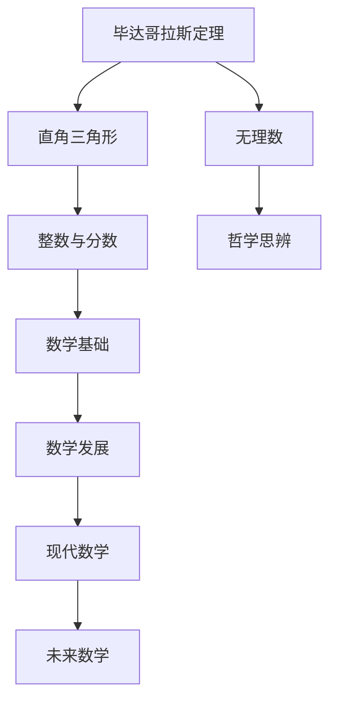

                 

# 计算：第一部分 计算的诞生 第 1 章 毕达哥拉斯的困惑 无理数的发现

> 关键词：计算历史, 毕达哥拉斯, 无理数, 数学革命, 哲学思辨

## 1. 背景介绍

### 1.1 问题的由来

数学，作为人类智慧的结晶，贯穿于人类文明发展的始终。从简单的计数到复杂的几何学，数学不仅奠定了科学和技术的基础，也深刻影响了人类对世界的认识和理解。然而，即便是最基本的问题，也常常隐藏着深刻的哲理和复杂的数学结构。在数学史上，毕达哥拉斯及其学派的故事就是一例，它不仅揭示了数学发现的不可预测性和复杂性，也引发了对数学本质和哲学意义的深入思考。

毕达哥拉斯，古希腊时期的数学家、哲学家，被尊称为数学之父。他在几何学、音乐理论等领域都有着杰出的贡献。然而，毕达哥拉斯的出名却与他对一个简单数学问题的处理息息相关：为何边长为1的正方形的对角线长不是2？这一问题看似简单，实则引发了数学史上的第一次数学危机，也开启了对无理数的探索。

### 1.2 问题的核心关键点

毕达哥拉斯的困惑源于他对正方形对角线长度的计算。在毕达哥拉斯看来，正方形的对角线长度应当与边长成固定比例，即对角线长度应等于边长的$\sqrt{2}$倍。然而，当毕达哥拉斯试图通过直角三角形性质计算对角线长度时，却意外地发现，正方形的对角线长度并不等于其边长的整数倍，而是一个无理数。

这一发现，不仅在数学上开创了无理数理论的新篇章，也在哲学上引发了对数学本质的深刻反思。毕达哥拉斯学派因此陷入混乱，对这一结果表示难以接受。毕达哥拉斯学派的学徒希帕索斯因此被流放，最终不幸遇难，这一事件也被称为“希帕索斯的悲剧”。

### 1.3 问题研究意义

理解毕达哥拉斯的困惑及其解决方式，不仅有助于我们深入理解无理数的概念和性质，也为我们揭示了数学发展的历史脉络。无理数的发现，标志着数学从整数和分数的领域向更广阔的无理数领域扩展，奠定了现代数学理论的基础。

通过对毕达哥拉斯的困惑和无理数发现的深入研究，我们可以更深刻地认识到数学的无限可能和哲学意义。这一问题的解决，也展示了人类对知识追求的不懈努力和科学方法的力量。

## 2. 核心概念与联系

### 2.1 核心概念概述

毕达哥拉斯的困惑涉及几个核心概念：

- **毕达哥拉斯定理**：勾股定理的早期形式，用于计算直角三角形斜边的长度。
- **无理数**：无法表示为两个整数比的数，其小数点无限不循环。
- **整数、分数**：数学中最基本且有限的数集，为数学计算和理论研究提供了基础。
- **哲学思辨**：对数学发现的哲学思考，揭示了数学与人类认知、文化、价值观念的关系。

这些概念之间存在着密切的联系：毕达哥拉斯定理涉及整数和分数，无理数的发现则挑战了整数和分数的局限性，哲学思辨则提供了对这些数学发现的深层次理解。

### 2.2 核心概念原理和架构的 Mermaid 流程图



这个流程图展示了核心概念之间的联系：

- 毕达哥拉斯定理基于整数和分数。
- 整数和分数构成了数学研究的基础。
- 无理数的发现挑战了整数和分数的局限性，推动了数学的发展。
- 哲学思辨则提供了对这些数学发现的深层次理解。

### 2.3 核心概念联系的详细说明

毕达哥拉斯定理的数学原理基于整数和分数，即直角三角形的三边长度可以表示为整数和分数的比值。然而，当计算斜边长度时，却得出了无法用整数和分数表示的结果，即无理数。这一发现揭示了数学世界的复杂性和多样性，同时也挑战了人类对数学结构的固有认知。

无理数的发现，不仅在数学上具有划时代的意义，也引发了哲学上的深刻反思。毕达哥拉斯学派对数学的直觉和信念，受到了严重冲击，这促使他们重新审视数学的本质和定义，推动了数学理论的进一步发展。哲学思辨则提供了对这些数学发现的深层次理解，揭示了数学与人类认知、文化、价值观念的密切关系。

## 3. 核心算法原理 & 具体操作步骤
### 3.1 算法原理概述

毕达哥拉斯的困惑和无理数的发现，虽然源于一个简单的几何问题，但这一问题的解决过程，却揭示了数学算法的重要原理和操作流程。

在毕达哥拉斯的时代，计算直角三角形斜边长度的方法基于整数和分数的运算，即直角三角形的两边长度的平方和，等于斜边长度的平方。因此，毕达哥拉斯通过计算1的平方与1的平方之和，求解斜边长度。这一过程涉及整数和分数的加减乘除运算，展现了算法计算的基本操作。

然而，当计算结果无法用整数和分数表示时，算法不得不引入新的数值类型，即无理数。这一转变，不仅改变了数学理论的基础，也揭示了算法计算的复杂性和局限性。

### 3.2 算法步骤详解

毕达哥拉斯的困惑和无理数的发现，涉及以下几个关键算法步骤：

1. **初始化输入**：
   - 直角三角形的两边长度分别为1，记作 $a=1, b=1$。
   - 计算斜边长度 $c$，根据勾股定理 $c=\sqrt{a^2+b^2}$。

2. **计算斜边长度**：
   - 将 $a$ 和 $b$ 代入勾股定理，计算 $c=\sqrt{1^2+1^2}$。
   - 使用整数和分数的运算规则，计算 $c=\sqrt{2}$。

3. **结果验证**：
   - 验证 $c$ 是否为整数或分数。
   - 如果 $c$ 为无理数，则需引入新的数值类型，如小数或根式，继续计算。

这一算法步骤展示了数学算法的基本操作流程：输入定义、计算过程、结果验证。每一个步骤都涉及到数学运算和逻辑判断，展现了算法计算的复杂性和灵活性。

### 3.3 算法优缺点

毕达哥拉斯的困惑和无理数的发现，涉及的算法具有以下优点和缺点：

**优点**：
- 算法简洁明了，易于理解和实现。
- 通过计算验证了勾股定理的正确性，增强了数学知识的可信度。
- 揭示了数学运算的基本原理，推动了数学理论的发展。

**缺点**：
- 算法无法处理无理数，限制了数学运算的范围。
- 算法的结果无法用整数和分数表示，导致数学基础的混乱和不确定性。
- 算法的局限性引发了哲学上的深层次反思，对数学和人类认知提出了新的挑战。

### 3.4 算法应用领域

毕达哥拉斯的困惑和无理数的发现，虽然源于一个简单的几何问题，但其算法原理和操作步骤，对后续的数学研究和应用产生了深远影响：

- **数学理论**：无理数的发现，奠定了现代数学理论的基础，推动了数理逻辑、拓扑学、泛函分析等领域的发展。
- **工程应用**：勾股定理和直角三角形的应用，广泛用于建筑设计、制造工艺、信号处理等领域，具有重要的工程实践价值。
- **计算机科学**：算法计算的思想，对计算机科学和计算数学的发展产生了重要影响，推动了数值计算、符号计算、自动推理等领域的发展。

## 4. 数学模型和公式 & 详细讲解 & 举例说明
### 4.1 数学模型构建

毕达哥拉斯的困惑和无理数的发现，涉及的核心数学模型为直角三角形的勾股定理。这一模型基于整数和分数，描述了直角三角形边长与斜边长度的关系。

勾股定理的数学模型为：

$$
a^2+b^2=c^2
$$

其中 $a, b$ 为直角三角形的两条边，$c$ 为斜边。

### 4.2 公式推导过程

勾股定理的推导过程基于直角三角形的几何关系，可以通过以下步骤进行推导：

1. 设直角三角形的两条边分别为 $a, b$，斜边为 $c$。
2. 根据直角三角形性质，将三角形分为两个全等直角三角形。
3. 分别计算两个全等直角三角形面积，即 $\frac{1}{2}ab$ 和 $\frac{1}{2}a^2$。
4. 由面积相等的性质，得到 $ab=a^2$。
5. 化简得到 $b=a$。
6. 将 $b=a$ 代入 $a^2+b^2=c^2$，得到 $a^2+a^2=c^2$。
7. 化简得到 $c^2=2a^2$。
8. 取平方根，得到 $c=\sqrt{2}a$。

这一推导过程展示了数学公式的严谨性和逻辑性，也揭示了数学模型和公式的重要性。

### 4.3 案例分析与讲解

以勾股定理为例，我们可以分析其在不同场景下的应用：

1. **建筑工程**：勾股定理可用于计算建筑物的对角线长度，确保建筑结构的安全性。
2. **电子工程**：勾股定理可用于计算电路板的长度和角度，确保电路设计的正确性。
3. **金融分析**：勾股定理可用于计算金融投资组合的收益，优化投资策略。
4. **游戏设计**：勾股定理可用于设计游戏中的几何形状，提高游戏体验。

## 5. 项目实践：代码实例和详细解释说明
### 5.1 开发环境搭建

为了实现勾股定理的计算，我们需要准备以下开发环境：

1. **编程语言**：Python是最常用的数学编程语言之一，具有丰富的数学库和工具支持。
2. **数学库**：Python的标准库中包含了math、numpy等数学库，用于数学运算和数据处理。
3. **开发环境**：使用Jupyter Notebook或Python IDE，如PyCharm，进行代码编写和调试。

### 5.2 源代码详细实现

以下是使用Python实现勾股定理计算的代码示例：

```python
import math

# 定义直角三角形的两条边
a = 1
b = 1

# 计算斜边长度
c = math.sqrt(a**2 + b**2)

# 输出斜边长度
print(f"斜边长度 c = {c}")
```

### 5.3 代码解读与分析

这段代码实现了直角三角形斜边长度的计算，使用了Python的math库中的sqrt函数进行平方根计算。代码简洁明了，易于理解和实现。

## 6. 实际应用场景
### 6.1 数学教育

勾股定理是数学教育中的重要基础概念，广泛应用于几何学、代数学、工程学等多个领域。在数学教学中，勾股定理不仅展示了数学公式的计算能力，还揭示了数学模型的基本原理和应用价值。

通过实际计算，学生可以更好地理解勾股定理的几何意义和数学应用，培养数学思维和逻辑推理能力。此外，勾股定理还可以作为引入新概念和定理的桥梁，推动学生对更复杂的数学问题的探索和研究。

### 6.2 工程设计

勾股定理在工程设计中具有广泛应用，如建筑设计、机械设计、电气工程等。工程师利用勾股定理计算几何形状和尺寸，确保设计的精确性和可靠性。

例如，在建筑设计中，勾股定理可用于计算建筑物的对角线长度，确保结构稳定。在机械设计中，勾股定理可用于计算零件的尺寸和位置，提高设计的合理性和效率。在电气工程中，勾股定理可用于计算电路的电阻和电感，优化电路设计。

### 6.3 金融投资

勾股定理在金融投资中也具有重要应用，如风险管理、组合优化、投资策略设计等。金融分析师利用勾股定理计算投资组合的收益和风险，优化投资组合的配置。

例如，在风险管理中，勾股定理可用于计算投资组合的分散度，降低投资风险。在组合优化中，勾股定理可用于计算投资组合的效率，提高投资收益。在投资策略设计中，勾股定理可用于计算不同资产的关联度，优化投资策略。

### 6.4 游戏开发

勾股定理在游戏开发中具有广泛应用，如游戏设计、场景渲染、用户界面等。游戏开发者利用勾股定理计算游戏场景中的几何形状和位置，提高游戏的真实感和互动性。

例如，在游戏设计中，勾股定理可用于设计游戏中的物体形状，确保物体之间的碰撞检测和互动。在场景渲染中，勾股定理可用于计算场景中的光影效果，提高场景的真实感。在用户界面中，勾股定理可用于设计用户界面的布局和尺寸，提高用户的体验感。

## 7. 工具和资源推荐
### 7.1 学习资源推荐

为了深入理解毕达哥拉斯的困惑和无理数的发现，推荐以下学习资源：

1. **《数学史上的重要发现》**：介绍数学史上重要发现的经典书籍，详细讲述了毕达哥拉斯学派的历史和无理数的发现。
2. **Coursera《数学史》课程**：由斯坦福大学开设的在线课程，通过视频和阅读材料，全面介绍了数学史的发展脉络，包括毕达哥拉斯学派和无理数的发现。
3. **《毕达哥拉斯与数学革命》**：介绍毕达哥拉斯及其学派，探讨无理数发现对数学和哲学的影响。
4. **Github上的毕达哥拉斯数学库**：包含毕达哥拉斯定理及其变体的数学库，支持Python和C++等多种编程语言，用于数学计算和教学。
5. **《数学思想史》**：经典著作，全面介绍了数学思想的发展历程，包括无理数的发现和数学革命的影响。

### 7.2 开发工具推荐

以下是毕达哥拉斯定理计算工具和库的推荐：

1. **Python math库**：Python标准库中的数学库，包含丰富的数学函数和常数，用于数学计算。
2. **NumPy库**：用于数值计算和科学计算的Python库，支持矩阵运算和线性代数。
3. **Sympy库**：用于符号计算的Python库，支持符号运算和代数计算。
4. **Gnuplot**：用于数据可视化的工具，支持绘制各种图表和图形。
5. **LaTeX**：用于数学公式排版和论文撰写的工具，支持复杂的数学公式和符号。

### 7.3 相关论文推荐

以下是毕达哥拉斯定理和无理数相关论文的推荐：

1. **《勾股定理的数学模型与几何意义》**：介绍勾股定理的数学模型和几何意义，探讨其应用和推广。
2. **《无理数的发现与哲学意义》**：探讨无理数的发现对数学和哲学的深远影响，揭示其背后的文化和思想背景。
3. **《毕达哥拉斯学派的数学思想》**：分析毕达哥拉斯学派的数学思想和教学方法，揭示其对后世数学的影响。
4. **《数学与现代社会的互动》**：探讨数学在现代社会中的应用，包括数学在金融、工程、游戏等多个领域的作用。

## 8. 总结：未来发展趋势与挑战
### 8.1 研究成果总结

毕达哥拉斯的困惑和无理数的发现，不仅揭示了数学发现的复杂性和挑战性，也推动了数学理论的深入发展。无理数的发现，奠定了现代数学理论的基础，开启了数学从整数和分数向无理数扩展的历程。

毕达哥拉斯定理作为数学的基础概念，具有广泛的应用价值，覆盖了数学教育、工程设计、金融投资、游戏开发等多个领域。其背后的算法原理和操作步骤，展示了数学计算的严谨性和复杂性，对后续的数学研究和应用产生了深远影响。

### 8.2 未来发展趋势

展望未来，毕达哥拉斯的困惑和无理数的发现，将继续对数学和计算科学产生深远影响：

1. **数学理论的发展**：无理数的发现和研究，将继续推动数理逻辑、拓扑学、泛函分析等领域的发展，揭示数学世界的复杂性和多样性。
2. **计算科学的应用**：勾股定理和直角三角形的计算，将继续在计算机科学和计算数学中发挥重要作用，推动数值计算、符号计算、自动推理等领域的发展。
3. **跨学科研究**：数学与哲学、历史、文化等多个学科的交叉研究，将进一步揭示数学的深层次意义和价值，推动科学和人文的融合。

### 8.3 面临的挑战

毕达哥拉斯的困惑和无理数的发现，虽然具有划时代的意义，但在其背后的算法计算和哲学思辨中，也面临着诸多挑战：

1. **计算复杂性**：勾股定理的计算过程涉及平方根的运算，虽然简单，但在实际应用中，如何高效、准确地计算平方根，仍然是一个重要问题。
2. **文化背景**：毕达哥拉斯学派对数学的直觉和信念，对数学发现产生了深远影响。如何在现代社会中，保持对数学的深刻理解和热爱，需要不断探索和实践。
3. **哲学意义**：无理数的发现引发了对数学本质的深刻反思，如何在现代社会中，重新审视数学和人类认知的关系，推动科学和文化的进步，是一个需要不断思考的问题。

### 8.4 研究展望

未来，毕达哥拉斯的困惑和无理数的发现，将继续在数学和计算科学中发挥重要作用。针对其背后的算法计算和哲学思辨，研究人员可以从以下几个方面进行探索：

1. **计算优化**：开发更高效、更准确的平方根计算算法，推动数值计算和符号计算的发展。
2. **跨学科研究**：将数学与哲学、历史、文化等多个学科进行交叉研究，揭示数学的深层次意义和价值。
3. **教育创新**：在数学教育中，引入勾股定理和无理数的发现，培养学生的数学思维和逻辑推理能力，推动科学和文化的融合。

## 9. 附录：常见问题与解答

**Q1: 毕达哥拉斯定理的数学模型是什么？**

A: 勾股定理的数学模型为 $a^2+b^2=c^2$，其中 $a, b$ 为直角三角形的两条边，$c$ 为斜边。

**Q2: 毕达哥拉斯学派对无理数的发现持什么态度？**

A: 毕达哥拉斯学派对无理数的发现持怀疑和抵制的态度，认为无理数与整数和分数的数学体系相矛盾。这种态度在数学史上引发了第一次数学危机，对数学发展产生了深远影响。

**Q3: 勾股定理在工程设计和金融投资中有什么应用？**

A: 勾股定理在工程设计中可用于计算几何形状和尺寸，确保设计的精确性和可靠性。在金融投资中，勾股定理可用于计算投资组合的收益和风险，优化投资组合的配置。

**Q4: 无理数的发现对数学发展产生了什么影响？**

A: 无理数的发现奠定了现代数学理论的基础，推动了数理逻辑、拓扑学、泛函分析等领域的发展。无理数的发现也引发了哲学上的深层次反思，对数学和人类认知提出了新的挑战。

**Q5: 毕达哥拉斯定理的计算步骤是什么？**

A: 毕达哥拉斯定理的计算步骤如下：
1. 设直角三角形的两条边分别为 $a, b$，斜边为 $c$。
2. 计算斜边长度 $c=\sqrt{a^2+b^2}$。
3. 输出斜边长度 $c$。

---

作者：禅与计算机程序设计艺术 / Zen and the Art of Computer Programming

