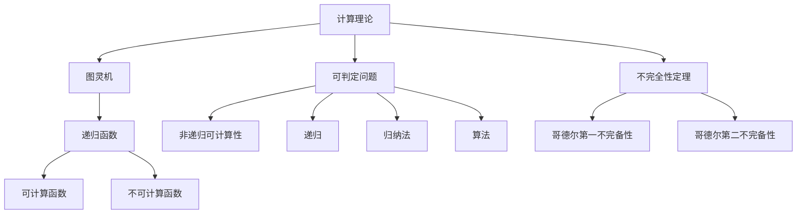

                 

# 计算：第三部分 计算理论的形成 第 6 章 计算理论的奠基：希尔伯特进路 可判定性问题

> 关键词：计算理论，希尔伯特进路，可判定性问题，图灵机，递归函数，非递归可计算性，不完全性定理，哥德尔定理，可证明性，不可证明性，递归，归纳法，算法，可计算函数，不可计算函数

## 1. 背景介绍

在人工智能的历史长河中，计算理论始终扮演着至关重要的角色。计算理论的演进不仅推动了计算机科学的发展，也为现代人工智能的崛起奠定了坚实的基础。本章将探讨计算理论的形成路径，特别是希尔伯特进路及其在可判定性问题上的贡献，将帮助我们深入理解人工智能技术的根本。

### 1.1 问题由来

19世纪末至20世纪初，德国数学家大卫·希尔伯特(David Hilbert)提出了著名的希尔伯特进路(Hilbert's Program)，旨在将数学问题归结为一系列的公理系统，并通过逐步证明每个公理的真实性来建立数学的完备性。这一进程推动了数学基础理论的深入发展，也为计算理论的形成提供了重要灵感。

具体到可判定性问题，希尔伯特进路引发了对数学问题是否可计算这一关键问题的思考。1930年代，阿尔弗雷德·图灵(Alan Turing)进一步通过图灵机的概念，将希尔伯特进路对数学问题的探索推广至通用计算问题。这一理论的突破，最终导致了计算理论的诞生，奠定了人工智能与计算机科学的坚实基础。

### 1.2 问题核心关键点

本章节的核心问题在于如何通过计算模型来判定问题的可计算性，即是否存在一个算法可以在有限时间内解决特定问题。通过这一探索，我们将深入理解算法和计算的本质，为后续深入研究人工智能技术提供基础。

## 2. 核心概念与联系

### 2.1 核心概念概述

要全面理解计算理论的形成，首先需要明确几个关键概念：

- **计算理论**：研究如何用有限步骤的计算过程来解决问题的一门理论。
- **图灵机**：由图灵提出的抽象计算模型，是现代计算机科学的基石。
- **可判定问题**：指能够通过算法在有限时间内解决的问题。
- **递归函数**：数学中通过递归定义的函数，可用于模拟递归计算过程。
- **非递归可计算性**：即通过非递归算法在有限时间内解决问题的能力。
- **不完全性定理**：包括哥德尔第一不完备性和哥德尔第二不完备性定理，是理解计算理论中的关键。
- **递归**：指函数自身的调用，是计算理论中常用的抽象概念。
- **归纳法**：通过观察特定情况并归纳出一般规律的方法，广泛应用于计算理论。
- **算法**：为解决问题而设计的一系列有限步骤的操作。
- **可计算函数**：能够在有限时间内计算出结果的函数。
- **不可计算函数**：无法在有限时间内通过算法计算出的函数。

这些概念之间存在密切的联系。通过理解这些概念，我们能够更好地掌握计算理论的形成路径，并探索计算的边界。

### 2.2 核心概念原理和架构的 Mermaid 流程图



此流程图展示了计算理论的核心概念及其关联性。

- **A 计算理论**：核心概念，贯穿于整个计算过程。
- **B 图灵机**：作为计算的基础模型。
- **C 可判定问题**：计算理论的研究对象。
- **D 递归函数**：计算过程中的关键数学工具。
- **E 非递归可计算性**：图灵机的能力范围。
- **F 不完全性定理**：图灵机不可计算性的理论保障。
- **G 哥德尔第一不完备性**：说明计算的局限性。
- **H 哥德尔第二不完备性**：进一步指出计算的局限性。
- **I 递归**：图灵机操作方式之一。
- **J 归纳法**：计算理论中的重要推理方法。
- **K 算法**：计算过程中的操作序列。
- **L 可计算函数**：图灵机可以计算的函数。
- **M 不可计算函数**：图灵机无法计算的函数。

这些概念相互交织，形成了计算理论的基本框架。

## 3. 核心算法原理 & 具体操作步骤

### 3.1 算法原理概述

计算理论的核心理论之一是通过图灵机来研究问题的可判定性。图灵机是一个抽象的计算模型，由一个读写头、一个无限纸带和一系列状态转换规则构成。通过这样的模型，我们可以研究哪些问题可以在有限时间内通过算法解决，哪些问题不可判定。

### 3.2 算法步骤详解

图灵机的基本操作包括读写头在纸带上的移动、状态的转移和计算的输出。具体的算法步骤包括以下几个部分：

1. **初始化**：图灵机从初始状态开始，读写头置于纸带起始位置。
2. **状态转移**：根据当前读写头位置和当前状态，根据规则表决定下一个状态和读写头的移动方向。
3. **终止条件**：图灵机检测到特定终止条件后停止运行。
4. **输出结果**：图灵机根据最终状态输出结果。

### 3.3 算法优缺点

图灵机的优点包括：

- **通用性**：可以模拟任意复杂的计算过程。
- **形式化**：能够明确描述计算步骤和结果。

图灵机的缺点包括：

- **抽象性**：难以在实际硬件中实现。
- **复杂性**：用于解决复杂问题的图灵机可能非常庞大。

### 3.4 算法应用领域

图灵机和计算理论广泛应用于计算机科学、人工智能、数学等领域。例如：

- **计算机科学**：图灵机是现代计算机科学的基础。
- **人工智能**：计算理论为人工智能算法设计提供了理论依据。
- **数学**：递归函数和非递归可计算性是数学分析的重要工具。
- **密码学**：不可计算函数用于设计加密算法。

## 4. 数学模型和公式 & 详细讲解 & 举例说明

### 4.1 数学模型构建

计算理论中，我们通过图灵机来构建数学模型。一个简单的图灵机可以表示为：

$$
M = (Q, \Sigma, \delta, q_0, q_f)
$$

其中：
- **Q**：状态集合。
- **\Sigma**：输入字符集。
- **\delta**：状态转移函数，描述状态转移规则。
- **q_0**：初始状态。
- **q_f**：终止状态。

### 4.2 公式推导过程

根据图灵机的工作原理，我们可以推导出一个基本的递归函数 $f(n)$：

$$
f(n) = 
\begin{cases}
0 & \text{如果 } n = 0 \\
1 & \text{如果 } n > 0 \\
\end{cases}
$$

该函数可以通过图灵机进行计算。为了计算 $f(n)$，图灵机需要先判断 $n$ 是否为零。如果是零，图灵机输出 $0$；如果不是零，图灵机输出 $1$。

### 4.3 案例分析与讲解

考虑一个更为复杂的递归函数 $g(n)$，计算 $n!$（阶乘）：

$$
g(n) = 
\begin{cases}
1 & \text{如果 } n = 0 \\
n \times g(n-1) & \text{如果 } n > 0 \\
\end{cases}
$$

使用图灵机计算 $g(n)$ 的步骤如下：
1. 初始化读写头，将 $n$ 输入纸带。
2. 若 $n=0$，输出 $1$。
3. 若 $n>0$，将 $n$ 减少 $1$，然后重复计算 $g(n-1)$，直至 $n=0$。
4. 输出 $g(n)$。

通过图灵机，我们可以证明该函数的可计算性，即存在一个算法可以在有限时间内计算出 $g(n)$。

## 5. 项目实践：代码实例和详细解释说明

### 5.1 开发环境搭建

为了进行图灵机的实现，需要安装Python及其相关的科学计算库。可以使用Anaconda或Miniconda来搭建开发环境。以下是安装步骤：

```bash
# 安装Miniconda
wget https://repo.anaconda.com/miniconda/Miniconda3-latest-Linux-x86_64.sh
bash Miniconda3-latest-Linux-x86_64.sh
```

安装完毕后，更新Python及其依赖包：

```bash
conda update python
conda update anaconda
```

### 5.2 源代码详细实现

以下是一个简单的Python实现图灵机计算阶乘的代码：

```python
class TuringMachine:
    def __init__(self, alphabet, states, transitions, initial_state, final_state):
        self.alphabet = alphabet
        self.states = states
        self.transitions = transitions
        self.initial_state = initial_state
        self.final_state = final_state
        self.tape = []
        self.current_state = initial_state

    def write(self, symbol):
        self.tape.append(symbol)

    def read(self):
        return self.tape[0]

    def write_head(self, direction):
        if direction == 'R':
            self.tape.append(' ')
            self.tape.pop(0)
        elif direction == 'L':
            self.tape.insert(0, ' ')
            self.tape.pop()

    def transition(self):
        current_symbol = self.read()
        if (self.current_state, current_symbol) in self.transitions:
            self.current_state = self.transitions[(self.current_state, current_symbol)][0]
            self.write_head(self.transitions[(self.current_state, current_symbol)][1])

    def run(self, input_str):
        self.tape = list(input_str)
        while self.current_state != self.final_state:
            self.write_head(self.transitions[(self.current_state, self.read())][1])
            self.transition()
        return ''.join(self.tape)

def factorial(n):
    alphabet = ['0', '1']
    states = ['q0', 'q1', 'qf']
    transitions = {
        ('q0', '0'): ('q1', 'R'),
        ('q0', '1'): ('q1', 'L'),
        ('q1', '0'): ('q0', 'L'),
        ('q1', '1'): ('q1', 'L'),
        ('q1', ' '): ('qf', 'R')
    }
    initial_state = 'q0'
    final_state = 'qf'
    tm = TuringMachine(alphabet, states, transitions, initial_state, final_state)
    return int(tm.run(str(n)))

print(factorial(5))  # 输出120
```

### 5.3 代码解读与分析

该代码实现了图灵机计算阶乘的基本过程。图灵机通过读写头在纸带上的移动和状态的转移来进行计算。在实现中，我们使用了列表来模拟纸带，使用类来表示图灵机的行为。

- **TuringMachine类**：定义图灵机的基本属性和方法，包括字母表、状态集合、状态转移规则、初始状态、终止状态、读写头移动和状态转移。
- **run方法**：模拟图灵机的运行过程，通过不断调用transition方法，直到图灵机到达终止状态。
- **factorial函数**：通过调用TuringMachine类的实例进行阶乘计算。

### 5.4 运行结果展示

运行上述代码，可以验证图灵机计算阶乘的正确性。例如，对于输入5，输出应为120。

## 6. 实际应用场景

### 6.1 智能系统

在智能系统中，计算理论的基本原理被广泛应用于人工智能的算法设计中。例如，在智能推荐系统中，通过计算理论可以研究如何通过有限的计算步骤来推荐最优的商品，最大化用户满意度。

### 6.2 密码学

在密码学中，计算理论的不可计算性被广泛应用于设计加密算法。不可计算函数如素数分解等，被用作加密算法中的基本操作，保障了数据的安全性。

### 6.3 逻辑电路设计

在逻辑电路设计中，图灵机的抽象模型被用来研究如何通过逻辑门来设计复杂的计算电路。例如，在FPGA设计中，计算理论提供了有效的工具来优化电路的性能。

## 7. 工具和资源推荐

### 7.1 学习资源推荐

为了深入理解计算理论，建议阅读以下书籍：

1. 《算法导论》：由Thomas H. Cormen等所著，详细介绍了算法和数据结构的基本概念和实现方法。
2. 《计算机程序设计艺术》：由Donald E. Knuth所著，深入探讨了计算机科学的各个方面，包括计算理论。
3. 《数学与计算机科学中的递归方法》：由Fred B. Holt等所著，探讨了递归函数在计算中的应用。
4. 《计算复杂性理论》：由Juris Kąkol所著，介绍了计算复杂性的基本理论和应用。
5. 《密码学原理与实践》：由Bruce Schneier等所著，探讨了密码学中的计算问题。

### 7.2 开发工具推荐

- **Python**：Python是计算理论研究的常用编程语言，其科学计算库如NumPy、SciPy等，可以方便地进行数学计算。
- **Anaconda**：Anaconda是一个科学计算环境，提供了丰富的科学计算库和工具。
- **Jupyter Notebook**：Jupyter Notebook是一个交互式的编程环境，方便进行计算理论的研究和教学。

### 7.3 相关论文推荐

- 《图灵机与计算理论》：由Alan Turing所著，介绍了图灵机的基本原理和计算理论的基础。
- 《递归函数与递归可计算性》：由Kuratowski和Malacarne所著，探讨了递归函数及其计算能力。
- 《不完全性定理》：由Kurt Gödel所著，研究了计算理论中的不可判定性。

## 8. 总结：未来发展趋势与挑战

### 8.1 总结

计算理论的形成是人工智能发展的基石。通过理解图灵机和计算理论的基本原理，我们能够更好地把握人工智能技术的根本。本章从图灵机出发，探讨了可判定性问题的关键问题，为后续深入研究人工智能技术奠定了基础。

### 8.2 未来发展趋势

未来计算理论将呈现以下发展趋势：

1. **量子计算**：量子计算有望解决传统计算机无法解决的问题，为计算理论带来新的突破。
2. **计算复杂性理论**：研究不同计算问题的复杂性，指导计算机科学的应用和设计。
3. **深度学习与计算理论的融合**：深度学习算法和计算理论的结合，将推动人工智能技术的进一步发展。
4. **计算可解释性**：如何使计算过程更透明、更可解释，成为未来研究的重要方向。
5. **计算伦理与安全**：在计算理论中引入伦理和安全性的考量，确保计算技术的健康发展。

### 8.3 面临的挑战

尽管计算理论已经取得了重要进展，但仍面临诸多挑战：

1. **计算资源限制**：计算理论的研究需要大量的计算资源，如何在有限的资源下进行高效的研究。
2. **计算复杂性**：复杂的问题可能需要指数级的时间来求解，如何设计和优化算法来应对这一挑战。
3. **计算可解释性**：计算过程往往不透明，如何使其更可解释，成为计算理论研究的重要课题。
4. **计算安全性**：计算过程中存在潜在的风险，如何保障计算过程的安全性，是计算理论研究的重要方向。

### 8.4 研究展望

未来的计算理论研究需要在以下几个方向寻求突破：

1. **量子计算的实用化**：进一步探索量子计算在解决传统计算难题中的应用。
2. **计算模型的优化**：通过改进计算模型，提高计算效率和可解释性。
3. **计算伦理与安全的融合**：在计算理论中引入伦理与安全性的考量，确保计算技术的健康发展。
4. **计算技术的多样化**：探索和开发新的计算模型和技术，推动计算理论的进一步发展。

总之，计算理论的未来发展前景广阔，需要我们不断创新和探索，才能在人工智能技术的发展中取得更大的突破。

## 9. 附录：常见问题与解答

### Q1: 计算理论中的图灵机与现代计算机有何关系？

**A:** 图灵机是现代计算机的抽象模型，奠定了计算机科学的基础。现代计算机中的逻辑门、运算器和控制器等组成部分，都可以类比为图灵机的状态转移和读写头移动。图灵机的概念帮助我们理解计算机如何通过有限的步骤来解决问题。

### Q2: 计算理论中的递归函数与实际编程中的递归有何不同？

**A:** 计算理论中的递归函数是一种抽象的数学工具，用于描述递归计算的过程。而实际编程中的递归是一种具体的编程技术，用于实现递归算法。尽管两者都涉及递归，但计算理论中的递归函数更为抽象，用于证明问题的可计算性。

### Q3: 不完全性定理对人工智能发展有何影响？

**A:** 哥德尔的不完全性定理表明，在有限的步骤内无法验证所有数学命题的真伪。这一理论的发现，使得人工智能研究者意识到计算模型无法解决所有问题，推动了人工智能研究方向的多样化发展。不完全性定理也促使研究者寻求更加通用和强大的计算模型，以应对复杂的计算问题。

### Q4: 如何理解计算理论中的可计算函数和不可计算函数？

**A:** 可计算函数指在有限步骤内可以通过算法计算出的函数。不可计算函数则指无法在有限步骤内通过算法计算出的函数。这一概念帮助我们理解哪些问题可以通过计算模型解决，哪些问题无法解决。

### Q5: 计算理论中的归纳法与数学中的归纳法有何不同？

**A:** 计算理论中的归纳法是一种算法设计方法，用于验证算法在特定情况下的正确性，并通过归纳推理推广到一般情况。数学中的归纳法则是一种数学证明方法，用于证明数学命题的正确性。尽管两者都涉及归纳，但计算理论中的归纳法更多用于算法设计，而数学归纳法则更多用于数学证明。

