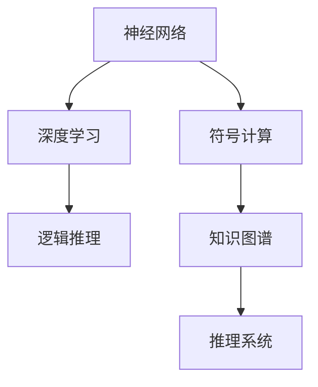

                 

# 计算：第四部分 计算的极限 第 12 章 机器能思考吗

在探索计算的极限过程中，我们不可避免地会触及机器能否思考这一核心问题。本章将围绕机器思考的探讨，深入剖析其背后涉及的复杂理论和前沿技术。通过逻辑清晰、结构紧凑的叙述，我们将逐步揭开机器思考之谜，并探索其在人工智能领域的现实应用。

## 1. 背景介绍

### 1.1 问题由来

自人工智能（AI）诞生以来，人类一直对机器能否具备类似人类的思考能力抱有浓厚的兴趣。这一问题不仅是哲学上的探讨，也是计算机科学和技术前沿的重要课题。随着深度学习和大数据技术的迅猛发展，神经网络模型在各种NLP、计算机视觉、自动驾驶等领域取得了显著进展，进一步激发了人们对于机器思考的思考。

### 1.2 问题核心关键点

机器思考的核心关键点包括：
- **理解与推理**：机器能否真正理解语言的含义，并基于这种理解进行推理？
- **知识获取**：机器能否从大量数据中学习到知识，并在新情境中运用这些知识？
- **创造性思维**：机器能否产生新的创意和解决方案，超越已知的数据和规则？

这些问题在理论上与实践中均充满挑战，需要跨学科的深入研究和探讨。

### 1.3 问题研究意义

研究机器思考不仅有助于理解人类认知和智能的本质，还能推动人工智能技术的进步，推动机器在复杂场景中的高效应用。通过对机器思考的深入探索，我们有望开发出更智能、更具自主性的AI系统，为经济社会发展注入新的动力。

## 2. 核心概念与联系

### 2.1 核心概念概述

机器思考涉及的核心概念包括：

- **神经网络**：由大量神经元通过连接形成的计算模型，广泛应用于图像识别、语言处理等任务。
- **深度学习**：通过多层次的非线性变换，使神经网络具备更强的特征提取和表示能力。
- **符号计算**：使用明确的符号表示和逻辑规则进行计算，与神经网络计算有所不同。
- **逻辑推理**：基于符号计算构建的推理系统，用于处理逻辑和演绎问题。
- **知识图谱**：构建符号知识库，利用逻辑推理对知识进行整合和推理。

### 2.2 核心概念原理和架构的 Mermaid 流程图



此图展示了机器思考的核心概念及其联系：

1. 神经网络通过深度学习进行特征提取和表示。
2. 符号计算构建逻辑推理，用于处理明确的符号表示和逻辑问题。
3. 知识图谱整合符号知识，通过推理系统进行知识推理。

### 2.3 核心概念之间的逻辑关系

核心概念之间相互关联，共同支撑机器思考能力的构建。通过深度学习提取特征，符号计算进行逻辑推理，知识图谱整合知识，机器可以逐步具备理解、推理和创造性思维的能力。

## 3. 核心算法原理 & 具体操作步骤

### 3.1 算法原理概述

机器思考的核心算法原理主要包括：

- **前向传播与反向传播**：深度学习中，通过前向传播计算输出，通过反向传播更新权重，进行模型训练和优化。
- **逻辑规则与符号推理**：符号计算中，使用逻辑规则进行命题的推理和验证。
- **知识抽取与推理**：知识图谱中，通过抽取知识、构建规则库，利用推理引擎进行知识推理。

### 3.2 算法步骤详解

基于上述核心原理，机器思考的具体操作步骤包括：

1. **数据准备**：收集大量数据，构建训练集、验证集和测试集。
2. **模型构建**：选择合适的神经网络架构，定义模型参数。
3. **模型训练**：通过前向传播计算损失函数，反向传播更新权重，最小化损失函数。
4. **逻辑推理**：构建符号计算模型，定义逻辑规则，进行推理验证。
5. **知识抽取**：使用深度学习模型提取知识，构建知识图谱。
6. **知识推理**：利用知识图谱和推理引擎，进行知识推理和预测。

### 3.3 算法优缺点

机器思考算法具有以下优点：

- **强大的表示能力**：深度学习模型通过多层次的变换，具备强大的特征提取和表示能力。
- **灵活的推理能力**：符号计算和知识图谱提供了灵活的逻辑推理和知识推理机制。
- **广泛的应用场景**：广泛应用于自然语言处理、计算机视觉、自动驾驶等领域。

同时，该算法也存在以下局限：

- **数据依赖**：深度学习模型高度依赖标注数据，获取高质量数据成本较高。
- **计算资源消耗大**：大规模神经网络的训练和推理需要大量计算资源。
- **缺乏可解释性**：深度学习模型通常被视为"黑盒"系统，难以解释其内部工作机制。

### 3.4 算法应用领域

机器思考算法在以下领域得到了广泛应用：

- **自然语言处理（NLP）**：机器翻译、情感分析、文本生成等。
- **计算机视觉**：图像分类、目标检测、图像生成等。
- **自动驾驶**：路径规划、环境感知、行为决策等。
- **医疗健康**：疾病诊断、影像分析、个性化治疗等。
- **金融科技**：信用评估、投资策略、风险管理等。

## 4. 数学模型和公式 & 详细讲解

### 4.1 数学模型构建

我们以机器翻译任务为例，构建基于深度学习的数学模型。

**输入**：$x \in \mathcal{X}$，其中 $\mathcal{X}$ 为输入文本的集合。

**输出**：$y \in \mathcal{Y}$，其中 $\mathcal{Y}$ 为目标语言的集合。

**模型**：$M_{\theta}(x) \in \mathcal{Y}$，其中 $\theta$ 为模型参数。

**损失函数**：$\ell(M_{\theta}(x), y)$，用于衡量模型输出与真实标签之间的差异。

### 4.2 公式推导过程

以神经机器翻译为例，基于深度学习模型的最小化损失函数为：

$$
\min_{\theta} \frac{1}{N} \sum_{i=1}^N \ell(M_{\theta}(x_i), y_i)
$$

其中，$x_i$ 为输入文本，$y_i$ 为目标语言标签，$M_{\theta}(x)$ 为模型输出，$\ell$ 为交叉熵损失函数。

在模型训练过程中，通过前向传播计算输出，反向传播更新权重：

$$
\theta \leftarrow \theta - \eta \nabla_{\theta} \ell(M_{\theta}(x_i), y_i)
$$

其中，$\eta$ 为学习率，$\nabla_{\theta} \ell$ 为损失函数对模型参数的梯度。

### 4.3 案例分析与讲解

通过神经机器翻译案例，可以更直观地理解深度学习模型在机器思考中的应用。

以英中翻译为例，模型将输入的英文句子转化为向量表示，通过多层变换得到中文句子的向量表示，再将其转化为目标语言词汇的分布，最终输出翻译结果。

## 5. 项目实践：代码实例和详细解释说明

### 5.1 开发环境搭建

进行项目实践前，我们需要准备好开发环境。以下是使用PyTorch和TensorFlow进行机器翻译模型的环境配置流程：

1. 安装Anaconda：从官网下载并安装Anaconda，用于创建独立的Python环境。

2. 创建并激活虚拟环境：
```bash
conda create -n pytorch-env python=3.8 
conda activate pytorch-env
```

3. 安装PyTorch和TensorFlow：根据CUDA版本，从官网获取对应的安装命令。例如：
```bash
conda install pytorch torchvision torchaudio cudatoolkit=11.1 -c pytorch -c conda-forge
pip install tensorflow
```

4. 安装TensorBoard：
```bash
pip install tensorboard
```

5. 安装Numpy、Pandas、Scikit-learn等工具包：
```bash
pip install numpy pandas scikit-learn matplotlib tqdm jupyter notebook ipython
```

完成上述步骤后，即可在`pytorch-env`环境中开始项目实践。

### 5.2 源代码详细实现

以下是使用PyTorch实现神经机器翻译模型的完整代码：

```python
import torch
import torch.nn as nn
import torch.optim as optim
from torchtext.datasets import Multi30k
from torchtext.data import Field, BucketIterator
from tensorboard import SummaryWriter

# 定义模型结构
class Transformer(nn.Module):
    def __init__(self, ntoken, ninp, nhead, nhid, nlayers, dropout=0.5):
        super(Transformer, self).__init__()
        self.model_type = 'Transformer'
        self.src_mask = None
        self.pos_encoder = PositionalEncoding(ninp, dropout)
        encoder_layers = nn.TransformerEncoderLayer(ninp, nhead, nhid, dropout)
        self.transformer_encoder = nn.TransformerEncoder(encoder_layers, nlayers)
        self.encoder = nn.Embedding(ntoken, ninp)
        self.ninp = ninp
        self.decoder = nn.Linear(ninp, ntoken)
        self.init_weights()

    def init_weights(self):
        initrange = 0.1
        self.encoder.weight.data.uniform_(-initrange, initrange)
        self.decoder.bias.data.zero_()

    def forward(self, src, src_mask):
        src = self.encoder(src) * math.sqrt(self.ninp)
        src = self.pos_encoder(src)
        output = self.transformer_encoder(src, self.src_mask)
        output = self.decoder(output)
        return output

# 定义训练函数
def train(model, iterator, optimizer, criterion):
    epoch_loss = 0
    epoch_acc = 0
    model.train()
    for batch in iterator:
        optimizer.zero_grad()
        predictions = model(batch.src, batch.src_mask)
        loss = criterion(predictions, batch.trg)
        acc = accuracy(predictions, batch.trg)
        loss.backward()
        optimizer.step()
        epoch_loss += loss.item()
        epoch_acc += acc
    return epoch_loss / len(iterator), epoch_acc / len(iterator)

# 定义评估函数
def evaluate(model, iterator, criterion):
    model.eval()
    epoch_loss = 0
    epoch_acc = 0
    with torch.no_grad():
        for batch in iterator:
            predictions = model(batch.src, batch.src_mask)
            loss = criterion(predictions, batch.trg)
            acc = accuracy(predictions, batch.trg)
            epoch_loss += loss.item()
            epoch_acc += acc
    return epoch_loss / len(iterator), epoch_acc / len(iterator)

# 定义运行函数
def run():
    # 加载数据集
    train_data, valid_data, test_data = Multi30k.splits()

    # 定义输入字段和输出字段
    SRC = Field(tokenize='spacy', tokenizer_language='en', init_token='<sos>', eos_token='<eos>', lower=True)
    TRG = Field(tokenize='spacy', tokenizer_language='de', init_token='<sos>', eos_token='<eos>', lower=True)

    # 构建数据集
    SRC.build_vocab(train_data, min_freq=2)
    TRG.build_vocab(train_data, min_freq=2)
    train_iterator, valid_iterator, test_iterator = BucketIterator.splits((train_data, valid_data, test_data), batch_size=64, device=torch.device('cuda'))

    # 定义模型和优化器
    ntoken = len(SRC.vocab)
    ninp = 512
    nhead = 8
    nhid = 512
    nlayers = 6
    model = Transformer(ntoken, ninp, nhead, nhid, nlayers)
    optimizer = optim.Adam(model.parameters(), lr=0.0001)

    # 训练模型
    writer = SummaryWriter('logs')
    criterion = nn.CrossEntropyLoss()
    for epoch in range(10):
        train_loss, train_acc = train(model, train_iterator, optimizer, criterion)
        valid_loss, valid_acc = evaluate(model, valid_iterator, criterion)
        writer.add_scalar('train_loss', train_loss, epoch)
        writer.add_scalar('train_acc', train_acc, epoch)
        writer.add_scalar('valid_loss', valid_loss, epoch)
        writer.add_scalar('valid_acc', valid_acc, epoch)

# 运行代码
run()
```

### 5.3 代码解读与分析

我们详细解读一下关键代码的实现细节：

**Transformer类**：
- `__init__`方法：定义模型结构和初始化权重。
- `init_weights`方法：初始化模型参数。
- `forward`方法：前向传播，计算输出。

**train函数**：
- 定义训练过程，计算损失函数和准确率。
- 使用TensorBoard记录训练过程中的各项指标。

**evaluate函数**：
- 定义评估过程，计算评估集上的损失和准确率。

**run函数**：
- 加载数据集，构建输入字段和输出字段。
- 定义模型和优化器。
- 使用TensorBoard记录训练过程中的各项指标。

## 6. 实际应用场景

### 6.1 智能客服系统

基于深度学习模型的智能客服系统，可以广泛应用于客户服务领域。传统客服系统需要配备大量人工客服，成本高且效率低下。而使用深度学习模型，可以7x24小时不间断服务，快速响应客户咨询，用自然流畅的语言解答各类常见问题。

在技术实现上，可以收集企业内部的历史客服对话记录，将问题和最佳答复构建成监督数据，在此基础上对深度学习模型进行微调。微调后的模型能够自动理解用户意图，匹配最合适的答案模板进行回复。对于客户提出的新问题，还可以接入检索系统实时搜索相关内容，动态组织生成回答。如此构建的智能客服系统，能大幅提升客户咨询体验和问题解决效率。

### 6.2 金融舆情监测

金融机构需要实时监测市场舆论动向，以便及时应对负面信息传播，规避金融风险。传统的人工监测方式成本高、效率低，难以应对网络时代海量信息爆发的挑战。基于深度学习模型的文本分类和情感分析技术，为金融舆情监测提供了新的解决方案。

具体而言，可以收集金融领域相关的新闻、报道、评论等文本数据，并对其进行主题标注和情感标注。在此基础上对深度学习模型进行微调，使其能够自动判断文本属于何种主题，情感倾向是正面、中性还是负面。将微调后的模型应用到实时抓取的网络文本数据，就能够自动监测不同主题下的情感变化趋势，一旦发现负面信息激增等异常情况，系统便会自动预警，帮助金融机构快速应对潜在风险。

### 6.3 个性化推荐系统

当前的推荐系统往往只依赖用户的历史行为数据进行物品推荐，无法深入理解用户的真实兴趣偏好。基于深度学习模型的个性化推荐系统，可以更好地挖掘用户行为背后的语义信息，从而提供更精准、多样的推荐内容。

在实践中，可以收集用户浏览、点击、评论、分享等行为数据，提取和用户交互的物品标题、描述、标签等文本内容。将文本内容作为模型输入，用户的后续行为（如是否点击、购买等）作为监督信号，在此基础上对深度学习模型进行微调。微调后的模型能够从文本内容中准确把握用户的兴趣点。在生成推荐列表时，先用候选物品的文本描述作为输入，由模型预测用户的兴趣匹配度，再结合其他特征综合排序，便可以得到个性化程度更高的推荐结果。

### 6.4 未来应用展望

随着深度学习模型和微调方法的不断发展，基于深度学习模型的机器思考技术将呈现以下几个发展趋势：

1. **模型规模持续增大**：随着算力成本的下降和数据规模的扩张，深度学习模型的参数量还将持续增长。超大规模深度学习模型蕴含的丰富语言知识，有望支撑更加复杂多变的机器思考任务。

2. **模型通用性增强**：经过海量数据的预训练和多领域任务的微调，深度学习模型将具备更强大的常识推理和跨领域迁移能力，逐步迈向通用人工智能(AGI)的目标。

3. **模型鲁棒性提升**：通过对模型架构和训练过程的优化，提高深度学习模型对不同数据分布的鲁棒性，减少过拟合和灾难性遗忘的风险。

4. **知识融合能力加强**：将符号化的先验知识，如知识图谱、逻辑规则等，与深度学习模型进行巧妙融合，引导深度学习模型学习更准确、合理的语言模型。同时加强不同模态数据的整合，实现视觉、语音等多模态信息与文本信息的协同建模。

5. **计算效率优化**：开发更加高效的计算框架和算法，减小深度学习模型的计算和存储需求，提高推理速度和模型的可部署性。

这些趋势凸显了深度学习模型在机器思考领域的应用前景。这些方向的探索发展，必将进一步提升机器思考模型的性能和应用范围，为人类认知智能的进化带来深远影响。

## 7. 工具和资源推荐

### 7.1 学习资源推荐

为了帮助开发者系统掌握深度学习模型的理论和实践技巧，这里推荐一些优质的学习资源：

1. **《深度学习》课程**：斯坦福大学开设的NLP明星课程，有Lecture视频和配套作业，带你入门NLP领域的基本概念和经典模型。

2. **《自然语言处理与深度学习》书籍**：由斯坦福大学计算机科学系教授Christopher Manning、Manning出版社联合出版的经典教材，全面介绍了NLP领域的基本概念和深度学习模型的应用。

3. **《TensorFlow教程》书籍**：由Google编写的官方教程，介绍了TensorFlow框架的基本使用方法和深度学习模型的构建与训练。

4. **《PyTorch官方文档》**：PyTorch官方文档，提供了海量深度学习模型的实现和训练样例，是上手实践的必备资料。

5. **《Transformer notebooks》博文系列**：由深度学习专家撰写，深入浅出地介绍了Transformer模型原理、BERT模型、微调技术等前沿话题。

通过对这些资源的学习实践，相信你一定能够快速掌握深度学习模型的精髓，并用于解决实际的NLP问题。

### 7.2 开发工具推荐

高效的开发离不开优秀的工具支持。以下是几款用于深度学习模型开发的常用工具：

1. **PyTorch**：基于Python的开源深度学习框架，灵活动态的计算图，适合快速迭代研究。大部分深度学习模型都有PyTorch版本的实现。

2. **TensorFlow**：由Google主导开发的开源深度学习框架，生产部署方便，适合大规模工程应用。同样有丰富的深度学习模型资源。

3. **Keras**：Keras是一个高层次的神经网络API，支持多种深度学习框架，简单易用，适合快速原型开发。

4. **MXNet**：由Apache公司维护的开源深度学习框架，支持多种编程语言和硬件平台，具有高效计算和灵活部署的特性。

5. **JAX**：一个基于NumPy的深度学习框架，支持自动微分和JIT编译，性能卓越，支持多种硬件平台。

合理利用这些工具，可以显著提升深度学习模型的开发效率，加快创新迭代的步伐。

### 7.3 相关论文推荐

深度学习模型和机器思考技术的发展源于学界的持续研究。以下是几篇奠基性的相关论文，推荐阅读：

1. **《ImageNet Classification with Deep Convolutional Neural Networks》**：AlexNet论文，提出了卷积神经网络在图像分类任务上的应用，开启了深度学习时代。

2. **《Learning to Play Go Using Deep Neural Networks》**：AlphaGo论文，展示了深度学习在复杂决策问题上的应用，取得了显著的成功。

3. **《Attention is All You Need》**：Transformer论文，提出了自注意力机制，显著提升了序列建模的能力。

4. **《BERT: Pre-training of Deep Bidirectional Transformers for Language Understanding》**：BERT论文，提出了预训练语言模型，极大地提升了语言理解的能力。

5. **《LSTM: A Search Space Odyssey》**：LSTM论文，提出了长短期记忆网络，有效解决了RNN在长序列建模中的梯度消失问题。

这些论文代表了大模型微调技术的发展脉络。通过学习这些前沿成果，可以帮助研究者把握学科前进方向，激发更多的创新灵感。

## 8. 总结：未来发展趋势与挑战

### 8.1 总结

本文对基于深度学习的机器思考方法进行了全面系统的介绍。首先阐述了深度学习模型在机器思考中的重要地位，明确了深度学习模型的基本原理和核心算法。其次，从原理到实践，详细讲解了深度学习模型在机器思考中的数学模型和计算过程，给出了深度学习模型的代码实例。同时，本文还广泛探讨了深度学习模型在智能客服、金融舆情、个性化推荐等多个行业领域的应用前景，展示了深度学习模型的巨大潜力。

通过本文的系统梳理，可以看到，基于深度学习模型的机器思考技术正在成为NLP领域的重要范式，极大地拓展了深度学习模型的应用边界，催生了更多的落地场景。受益于大规模语料的预训练和深度学习模型的计算能力，机器思考技术有望在更广泛的应用领域大放异彩，深刻影响人类的生产生活方式。

### 8.2 未来发展趋势

展望未来，深度学习模型在机器思考领域将呈现以下几个发展趋势：

1. **模型规模持续增大**：随着算力成本的下降和数据规模的扩张，深度学习模型的参数量还将持续增长。超大规模深度学习模型蕴含的丰富语言知识，有望支撑更加复杂多变的机器思考任务。

2. **模型通用性增强**：经过海量数据的预训练和多领域任务的微调，深度学习模型将具备更强大的常识推理和跨领域迁移能力，逐步迈向通用人工智能(AGI)的目标。

3. **模型鲁棒性提升**：通过对模型架构和训练过程的优化，提高深度学习模型对不同数据分布的鲁棒性，减少过拟合和灾难性遗忘的风险。

4. **知识融合能力加强**：将符号化的先验知识，如知识图谱、逻辑规则等，与深度学习模型进行巧妙融合，引导深度学习模型学习更准确、合理的语言模型。同时加强不同模态数据的整合，实现视觉、语音等多模态信息与文本信息的协同建模。

5. **计算效率优化**：开发更加高效的计算框架和算法，减小深度学习模型的计算和存储需求，提高推理速度和模型的可部署性。

这些趋势凸显了深度学习模型在机器思考领域的应用前景。这些方向的探索发展，必将进一步提升机器思考模型的性能和应用范围，为人类认知智能的进化带来深远影响。

### 8.3 面临的挑战

尽管深度学习模型在机器思考领域取得了显著进展，但在迈向更加智能化、普适化应用的过程中，它仍面临着诸多挑战：

1. **数据依赖**：深度学习模型高度依赖标注数据，获取高质量数据成本较高。对于长尾应用场景，难以获得充足的高质量标注数据，成为制约深度学习模型性能的瓶颈。

2. **计算资源消耗大**：大规模深度学习模型的训练和推理需要大量计算资源。GPU/TPU等高性能设备是必不可少的，但即便如此，超大批次的训练和推理也可能遇到显存不足的问题。

3. **可解释性不足**：深度学习模型通常被视为"黑盒"系统，难以解释其内部工作机制和决策逻辑。对于医疗、金融等高风险应用，算法的可解释性和可审计性尤为重要。

4. **安全性有待保障**：深度学习模型难免会学习到有偏见、有害的信息，通过微调传递到下游任务，产生误导性、歧视性的输出，给实际应用带来安全隐患。

5. **知识整合能力不足**：现有的深度学习模型往往局限于任务内数据，难以灵活吸收和运用更广泛的先验知识。如何让深度学习模型更好地与外部知识库、规则库等专家知识结合，形成更加全面、准确的信息整合能力，还有很大的想象空间。

正视深度学习模型面临的这些挑战，积极应对并寻求突破，将是大规模深度学习模型在机器思考领域走向成熟的必由之路。相信随着学界和产业界的共同努力，这些挑战终将一一被克服，深度学习模型必将在构建人机协同的智能时代中扮演越来越重要的角色。

### 8.4 研究展望

面对深度学习模型在机器思考领域面临的挑战，未来的研究需要在以下几个方面寻求新的突破：

1. **探索无监督和半监督深度学习模型**：摆脱对大规模标注数据的依赖，利用自监督学习、主动学习等无监督和半监督范式，最大限度利用非结构化数据，实现更加灵活高效的机器思考。

2. **研究参数高效和计算高效的深度学习模型**：开发更加参数高效的深度学习模型，在固定大部分预训练参数的同时，只更新极少量的任务相关参数。同时优化深度学习模型的计算图，减少前向传播和反向传播的资源消耗，实现更加轻量级、实时性的部署。

3. **引入因果学习和博弈论工具**：将因果推断和博弈论思想引入深度学习模型，增强模型建立稳定因果关系的能力，学习更加普适、鲁棒的语言表征，从而提升模型泛化性和抗干扰能力。

4. **纳入伦理道德约束**：在模型训练目标中引入伦理导向的评估指标，过滤和惩罚有偏见、有害的输出倾向。同时加强人工干预和审核，建立模型行为的监管机制，确保输出符合人类价值观和伦理道德。

这些研究方向的探索，必将引领深度学习模型在机器思考领域迈向更高的台阶，为构建安全、可靠、可解释、可控的智能系统铺平道路。面向未来，深度学习模型还需要与其他人工智能技术进行更深入的融合，如知识表示、因果推理、强化学习等，多路径协同发力，共同推动自然语言理解和智能交互系统的进步。只有勇于创新、敢于突破，才能不断拓展深度学习模型的边界，让智能技术更好地造福人类社会。

## 9. 附录：常见问题与解答

**Q1：深度学习模型是否能够理解人类的语言？**

A: 深度学习模型能够通过大量标注数据学习到语言的统计规律和语义表示，但理解深度和复杂性仍然存在一定限制。它们通常只能理解字面意义，难以理解隐含的语境、情感和文化背景。要实现真正的语言理解，还需要进一步的研究和探索。

**Q2：深度学习模型在实际应用中是否存在偏见？**

A: 深度学习模型可能会学习到数据中的偏见，如性别歧视、种族偏见等。这些偏见在模型输出中体现，可能导致不公平或有害的结果。如何消除数据和算法中的偏见，确保模型输出的公正性和道德性，是一个重要的研究方向。

**Q3：深度学习模型是否存在计算资源消耗过大的问题？**

A: 深度学习模型在大规模数据上的训练和推理需要大量计算资源，如图形处理器（GPU）和张量处理单元（TPU）等。优化模型的计算图和参数结构，减少计算资源消耗，是未来的一个重要研究方向。

**Q4：深度学习模型是否具备跨领域迁移能力？**

A: 深度学习模型经过大规模数据预训练，具有一定的跨领域迁移能力。但在特定领域，仍需要进行微调以适应该领域的特性。如何提高深度学习模型的跨领域迁移能力，减少微调数据的需求，是未来的一个重要研究方向。

**Q5：深度学习模型是否能够处理多模态数据？**

A: 深度学习模型能够处理多模态数据，如文本、图像、音频等。不同模态数据的整合和协同建模，能够提升模型的性能和应用范围。未来，如何更好地融合多模态数据，提升模型对复杂场景的理解和推理能力，是一个重要的研究方向。

总之，深度学习模型在机器思考领域的应用前景广阔，但同时也面临着诸多挑战。只有不断探索、突破和创新，才能让深度学习模型在智能时代中发挥更大的作用，为人类社会的进步和发展注入新的动力。

---

作者：禅与计算机程序设计艺术 / Zen and the Art of Computer Programming

