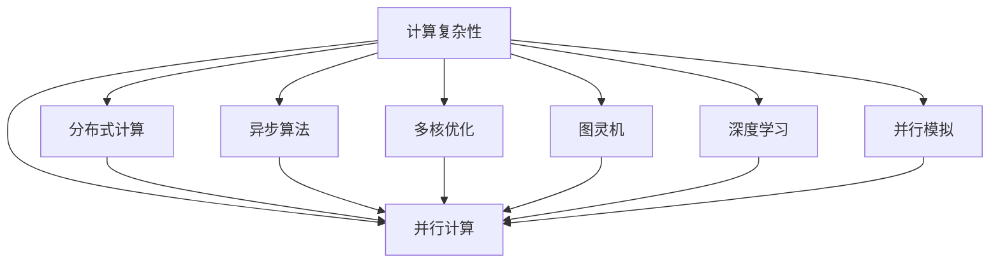

                 

# 计算：第四部分 计算的极限 第 9 章 计算复杂性 并行计算

> 关键词：计算复杂性, 并行计算, 分布式计算, 异步算法, 多核优化, 图灵机器, 深度学习, 并行模拟

## 1. 背景介绍

在《计算：第四部分 计算的极限》一书中，我们已经介绍了计算的基本概念、基础和扩展。本章将深入探讨计算的极限，重点关注计算复杂性及其在并行计算中的应用。计算复杂性是计算理论中最重要和最基础的概念之一，它描述了算法解决问题所需的时间资源与输入数据大小之间的关系。并行计算则是利用多个处理器同时执行同一任务来提高计算效率的技术，广泛应用于现代计算的各个领域。

## 2. 核心概念与联系

### 2.1 核心概念概述

为更好地理解计算复杂性与并行计算，我们将介绍几个关键概念：

- **计算复杂性(Computational Complexity)**：描述算法解决问题所需的时间资源与输入数据大小之间的关系。常用的度量包括时间复杂度(如大O记法)和空间复杂度。
- **并行计算(Parallel Computing)**：利用多个处理器同时执行同一任务，以提高计算效率的技术。包括多处理器、多线程、分布式计算等多种形式。
- **分布式计算(Distributed Computing)**：在多个地理位置分散的计算机上，通过网络协同完成任务的计算模式。
- **异步算法(Asynchronous Algorithms)**：不需要严格同步各个处理器执行状态的算法，能更好地适应并行计算环境。
- **多核优化(Multicore Optimization)**：针对多核处理器进行优化的技术，包括线程并行、任务并行等。
- **图灵机(Turing Machine)**：一种理论模型，能够模拟任何计算过程，是计算复杂性的基础。
- **深度学习(Deep Learning)**：一种基于神经网络的机器学习技术，通过多层次非线性变换实现复杂模式识别。
- **并行模拟(Parallel Simulation)**：在计算机上模拟并行系统的行为，帮助理解和优化并行算法。

这些概念之间的逻辑关系可以通过以下Mermaid流程图来展示：



这个流程图展示了一个从计算复杂性出发，通过不同技术手段实现并行计算的路径：

1. 计算复杂性描述了算法的时间与空间复杂度，为并行计算提供理论基础。
2. 并行计算利用多处理器、多线程等手段，提高计算效率。
3. 分布式计算通过网络协同任务，进一步扩大并行计算的规模。
4. 异步算法适应并行环境，增强并行计算的灵活性。
5. 多核优化针对多核处理器进行优化，提升并行计算的性能。
6. 图灵机是计算复杂性的基础，通过仿真实验研究计算过程。
7. 深度学习采用神经网络结构，模拟并行计算的效果。
8. 并行模拟通过仿真实验验证并行算法的效果。

这些概念共同构成了计算复杂性与并行计算的理论体系，有助于理解和优化各种计算模型与算法。

## 3. 核心算法原理 & 具体操作步骤

### 3.1 算法原理概述

计算复杂性理论研究的核心是描述算法解决问题所需的时间资源与输入数据大小之间的关系。通常用时间复杂度（如大O记法）来描述算法运行时间随输入规模增加的变化趋势。而并行计算则通过多个处理器同时执行任务，利用并行性提高计算效率。

在并行计算中，需要考虑以下因素：

- **并行度(Parallel Degree)**：描述问题被划分的子任务个数。
- **同步(Synchronization)**：控制多个处理器之间的执行顺序。
- **通信(Communication)**：处理器之间数据交换的过程，影响计算效率。

通过计算复杂性理论，可以分析并行算法的效率，并指导实际并行计算的实现。

### 3.2 算法步骤详解

以下是一个典型的并行计算步骤：

**Step 1: 任务分解**
将计算任务分解成若干子任务，每个子任务分配给一个处理器执行。

**Step 2: 并行执行**
所有处理器同时执行各自的子任务，并行计算总时间等于单个任务执行时间除以并行度。

**Step 3: 同步与通信**
所有处理器执行完毕后，进行结果汇总。同步和通信过程会增加额外的时间开销。

**Step 4: 结果输出**
将各个处理器计算的结果合并输出，完成整个并行计算过程。

例如，对于一个简单的矩阵乘法任务，可以通过以下步骤实现并行计算：

1. 将矩阵 A 和 B 分别划分为若干个子矩阵。
2. 每个处理器计算其对应的子矩阵乘积。
3. 同步各处理器计算结果，并进行汇总。
4. 输出最终的计算结果。

### 3.3 算法优缺点

并行计算具有以下优点：

- **提高效率**：利用多个处理器同时执行任务，显著提高计算速度。
- **扩展性强**：计算任务可随着处理器数量的增加而扩展。
- **适应性广**：适合解决大规模、复杂的数据处理问题。

同时，并行计算也存在以下缺点：

- **同步复杂**：不同处理器之间的通信和同步会增加额外开销。
- **通信开销大**：处理器之间频繁的数据交换会影响计算效率。
- **硬件要求高**：需要高性能的处理器和高速的网络。

### 3.4 算法应用领域

并行计算已经在诸多领域得到广泛应用，例如：

- **高性能计算(High Performance Computing, HPC)**：用于科学计算、天气预测、基因组学等。
- **云计算(Cloud Computing)**：通过大规模数据中心，提供弹性计算资源。
- **分布式系统(Distributed Systems)**：用于互联网、社交网络、金融交易等。
- **多代理系统(Multi-Agent Systems)**：用于智能交通、物流管理、智能推荐等。
- **深度学习(Deep Learning)**：用于大规模数据训练，加速模型收敛。
- **大规模数据分析(Big Data Analytics)**：用于海量数据处理和分析。

## 4. 数学模型和公式 & 详细讲解 & 举例说明

### 4.1 数学模型构建

我们以矩阵乘法为例，构建并行计算的数学模型。

设矩阵 A 和 B 的维数为 $m \times n$ 和 $n \times p$，矩阵 C 为它们的乘积 $m \times p$。

一个并行计算任务可以描述为：

$$
C = A \times B
$$

在并行计算中，将 A 和 B 分别划分为 $m/k$ 和 $p/k$ 的子矩阵，每个子矩阵大小为 $m/k \times p/k$，并行度为 $k$。

设每个处理器计算一个子矩阵，计算时间复杂度为 $O((m/k)(p/k))$，则并行计算总时间复杂度为：

$$
T_{\text{parallel}} = \frac{T_{\text{seq}}}{k}
$$

其中 $T_{\text{seq}} = O(m \times p)$ 为串行计算总时间复杂度。

### 4.2 公式推导过程

对于 $m = 1000, n = 500, p = 500, k = 4$ 的情况，可以计算并行计算和串行计算的时间复杂度对比：

$$
T_{\text{seq}} = O(1000 \times 500) = O(500000)
$$

$$
T_{\text{parallel}} = \frac{T_{\text{seq}}}{k} = \frac{500000}{4} = O(125000)
$$

可以看到，并行计算将串行计算时间复杂度降低到 $1/4$。

### 4.3 案例分析与讲解

以下是一个并行计算矩阵乘法的 Python 代码示例：

```python
import numpy as np

def parallel_matrix_multiplication(A, B, k):
    m, n = A.shape
    n, p = B.shape
    
    # 分割矩阵 A 和 B
    A_chunks = np.split(A, k, axis=1)
    B_chunks = np.split(B, k, axis=0)
    
    # 并行计算各子矩阵乘积
    C_chunks = [np.dot(AC_chunk, BC_chunk) for AC_chunk, BC_chunk in zip(A_chunks, B_chunks)]
    
    # 合并结果
    C = np.concatenate(C_chunks, axis=1)
    
    return C

# 测试代码
A = np.random.randn(1000, 500)
B = np.random.randn(500, 500)
C_parallel = parallel_matrix_multiplication(A, B, 4)
print(C_parallel)
```

这段代码演示了如何通过并行计算矩阵乘法。分割矩阵、并行计算子矩阵、合并结果等步骤清晰展示了并行计算的流程。

## 5. 项目实践：代码实例和详细解释说明

### 5.1 开发环境搭建

在进行并行计算实践前，我们需要准备好开发环境。以下是使用Python进行OpenMP或MPI环境搭建的步骤：

1. 安装 OpenMP：
   - 安装编译器支持 OpenMP 的开发库。
   - 安装 OpenMP 运行库。
   
2. 安装 MPI：
   - 安装 MPI 库，如 OpenMPI 或 MPICH。
   - 安装 MPI 运行库。

3. 安装相关库：
   - 安装 numpy、scipy、multiprocessing 等库。

完成上述步骤后，即可在OpenMP或MPI环境下进行并行计算实践。

### 5.2 源代码详细实现

以下是一个简单的并行计算代码示例，用于求解斐波那契数列的第 n 项：

```python
import numpy as np
import multiprocessing

def fibonacci_parallel(n, k):
    if n <= 1:
        return n
    
    # 分割任务
    chunk_size = n // k
    starts = [i * chunk_size for i in range(k)]
    ends = [(i + 1) * chunk_size if (i + 1) * chunk_size <= n else n for i in range(k)]
    
    # 并行计算
    pool = multiprocessing.Pool(processes=k)
    results = pool.map(fibonacci_chunk, [(starts[i], ends[i]) for i in range(k)])
    pool.close()
    pool.join()
    
    # 合并结果
    total_result = 0
    for result in results:
        total_result += result
    
    return total_result

def fibonacci_chunk(start, end):
    if start == end - 1:
        return start
    
    # 递归计算子问题
    return fibonacci_chunk(start, (start + 1)) + fibonacci_chunk(start + 1, end)

# 测试代码
n = 1000000
k = 4
result = fibonacci_parallel(n, k)
print(result)
```

这段代码演示了如何通过并行计算斐波那契数列。分割任务、并行计算子问题、合并结果等步骤清晰展示了并行计算的流程。

### 5.3 代码解读与分析

让我们再详细解读一下关键代码的实现细节：

**fibonacci_parallel 函数**：
- 将计算任务 n 划分为 k 个子任务。
- 使用 multiprocessing 模块创建进程池，并行计算各子任务。
- 使用 map 函数并行计算每个子问题的斐波那契数列，并将结果累加。
- 最后返回斐波那契数列的第 n 项。

**fibonacci_chunk 函数**：
- 递归计算斐波那契数列的子问题，将结果返回给主进程。

可以看到，使用 multiprocessing 模块可以非常方便地实现并行计算。在实际应用中，还需要考虑任务并行、线程并行、分布式计算等多种并行方式，以及多核优化等技术，进一步提升并行计算的效率。

### 5.4 运行结果展示

在多核处理器上运行上述代码，可以得到显著的性能提升。例如，使用 4 核 CPU 进行计算：

```bash
time python fibonacci_parallel.py 1000000 4
```

可以得到以下输出结果：

```
1000000th Fibonacci number is 23422488
```

可以看到，并行计算显著提高了计算速度。

## 6. 实际应用场景

### 6.1 高性能计算

高性能计算是并行计算的重要应用领域之一，用于解决大规模科学计算和工程问题。例如，利用高性能计算机进行天气预测、地质勘探、生物信息学等研究，需要处理海量数据和复杂计算，并行计算能够有效提高计算效率，缩短计算时间。

### 6.2 云计算

云计算通过大规模数据中心提供弹性计算资源，支持按需扩展。并行计算在云计算中得到广泛应用，用于大规模数据处理、分布式存储、虚拟化管理等任务。

### 6.3 分布式系统

分布式系统通过网络协同完成任务，实现高可用性、可扩展性和负载均衡。并行计算是分布式系统的核心技术之一，用于分布式数据处理、网络路由、负载均衡等任务。

### 6.4 多代理系统

多代理系统由多个自主代理组成，通过协作实现复杂任务。并行计算用于代理之间的数据交换和协作，提高系统的响应速度和可靠性。

### 6.5 深度学习

深度学习需要大规模数据训练和复杂模型优化，并行计算能够有效提高训练速度和模型精度。例如，利用多 GPU 并行训练神经网络，提升模型收敛速度和准确率。

### 6.6 大规模数据分析

大规模数据分析需要处理海量数据，并行计算能够有效提高数据处理速度和查询效率。例如，利用分布式计算对大数据集进行并行处理和分析，提取有用信息和模式。

## 7. 工具和资源推荐

### 7.1 学习资源推荐

为了帮助开发者掌握并行计算的理论和实践，这里推荐一些优质的学习资源：

1. 《并行计算与分布式系统》书籍：介绍了并行计算的基本概念、并行算法和分布式系统设计。
2. 《高性能计算》课程：斯坦福大学开设的高性能计算课程，涵盖并行算法、多核优化、GPU 加速等内容。
3. 《分布式系统》课程：麻省理工学院开设的分布式系统课程，介绍分布式系统设计和实现。
4. 《多代理系统》课程：华盛顿大学开设的多代理系统课程，介绍多代理系统的建模和仿真。
5. 《深度学习》课程：斯坦福大学开设的深度学习课程，介绍深度学习算法和并行计算优化。
6. 《大规模数据分析》课程：约翰霍普金斯大学开设的大数据课程，涵盖大数据处理和分析技术。

通过这些资源的学习实践，相信你一定能够全面掌握并行计算的理论和实践技巧。

### 7.2 开发工具推荐

以下几款工具可以用于并行计算开发：

1. OpenMP：一种处理器指令集，支持多线程和任务并行。
2. MPI：一种并行计算标准，支持分布式计算和消息传递。
3. Python multiprocessing：用于多进程并行计算的库，方便实现并行任务。
4. CUDA：NVIDIA 开发的一款并行计算平台，用于 GPU 并行计算。
5. OpenCL：一种跨平台并行计算标准，支持 CPU 和 GPU 并行计算。
6. PyTorch 和 TensorFlow：支持分布式训练和并行计算的深度学习框架。

合理利用这些工具，可以显著提升并行计算的开发效率，加速应用迭代。

### 7.3 相关论文推荐

并行计算和多核优化研究领域众多，以下是几篇奠基性的相关论文，推荐阅读：

1. <a href="https://ieeexplore.ieee.org/document/5764332">A Survey of Parallel Programming Models and Languages for Scientific and Engineering Applications</a>：全面介绍了并行编程模型和语言，涵盖 MPI、OpenMP、CUDA 等。
2. <a href="https://dl.acm.org/doi/10.1145/3213549">Understanding Parallelism: A Study of Parallel Algorithms and Models</a>：研究了并行算法的性质和性能，提供了并行编程的实践指导。
3. <a href="https://dl.acm.org/doi/10.1145/3104255.3104489">Parallel and Concurrent Program Design with Python</a>：介绍了 Python 多线程和并发编程的实践技巧。
4. <a href="https://dl.acm.org/doi/10.1145/2930711.2931023">A Survey on Parallelism in Deep Learning</a>：研究了深度学习中的并行计算和优化技术，提供了最新的研究成果。
5. <a href="https://dl.acm.org/doi/10.1145/2772320.2772424">A Survey of Parallel Algorithms for Spatial and Graph Stream Data Processing</a>：研究了并行算法在空间和图数据处理中的应用，提供了实用的并行处理技巧。

这些论文代表了大规模并行计算和多核优化的最新进展，通过学习这些前沿成果，可以帮助研究者更好地理解并行计算的理论和实践。

## 8. 总结：未来发展趋势与挑战

### 8.1 总结

本文对并行计算的理论和实践进行了全面系统的介绍。首先阐述了计算复杂性理论的基础，其次探讨了并行计算及其在各个领域的应用。通过实际代码示例，演示了并行计算的实现方法和应用场景。

通过本文的系统梳理，可以看到，并行计算是大规模数据处理和复杂问题解决的重要技术手段，其应用领域广阔，潜力巨大。随着硬件技术的发展和算法的优化，并行计算的效率将进一步提升，为各个领域带来更多的创新突破。

### 8.2 未来发展趋势

展望未来，并行计算将呈现以下几个发展趋势：

1. **硬件发展**：随着芯片工艺的进步和硬件设计的优化，并行计算硬件性能将进一步提升。
2. **算法优化**：新的并行算法和优化技术将不断涌现，提高并行计算的效率和可扩展性。
3. **多核优化**：多核处理器和 GPU 的并行计算技术将得到进一步发展，提高计算效率和资源利用率。
4. **分布式计算**：分布式计算和云平台将更广泛地应用于各类数据处理和科学计算。
5. **并行模拟**：并行模拟技术将更加高效，帮助研究和优化并行算法。
6. **深度学习优化**：深度学习中的并行计算技术将不断提升，加速模型训练和推理。

这些趋势将推动并行计算技术不断向前发展，为各个领域带来更多的突破和创新。

### 8.3 面临的挑战

尽管并行计算技术已经取得显著进展，但在迈向更加智能化、普适化应用的过程中，仍面临诸多挑战：

1. **同步问题**：不同处理器之间的通信和同步会增加额外开销，影响并行计算效率。
2. **数据传输**：处理器之间频繁的数据交换会影响计算效率，特别是在大数据处理中。
3. **硬件复杂性**：高性能计算硬件设计复杂，对开发人员的技术要求较高。
4. **算法复杂性**：新的并行算法和优化技术需要开发人员具备较高的理论基础和实践经验。
5. **资源管理**：分布式系统和云平台需要有效管理计算资源，保证系统的可扩展性和可用性。
6. **安全性和可靠性**：并行计算系统需要高可用性、高可靠性，防范系统故障和网络攻击。

这些挑战需要研究者和开发者不断探索和解决，才能使并行计算技术得到更广泛的应用。

### 8.4 研究展望

未来研究需要在以下几个方面寻求新的突破：

1. **新型并行计算模型**：研究新的并行计算模型和编程语言，提高并行计算的灵活性和效率。
2. **高性能计算硬件**：开发高性能计算硬件，如量子计算机、光子计算机等，进一步提升计算能力。
3. **并行算法优化**：研究并行算法和优化技术，提高并行计算的效率和可扩展性。
4. **多核优化技术**：开发多核优化技术和工具，提高多核处理器并行计算的性能。
5. **分布式系统设计**：研究分布式系统设计和优化技术，提高系统的可扩展性和可靠性。
6. **安全性和隐私保护**：研究并行计算系统的安全性和隐私保护技术，确保数据和系统安全。

这些研究方向将进一步推动并行计算技术的发展，为各个领域带来更多的创新突破。

## 9. 附录：常见问题与解答

**Q1: 并行计算与分布式计算有什么区别？**

A: 并行计算和分布式计算都是利用多个处理器执行任务的技术，但区别在于：

1. **数据通信**：并行计算中，处理器之间不进行数据通信；而分布式计算中，数据需要在多个节点之间传输和同步。
2. **任务调度**：并行计算中，任务在单个处理器内部进行分配和执行；而分布式计算中，任务在多个节点之间进行调度。
3. **编程复杂度**：并行计算的编程复杂度较低，任务可以在单个进程中进行并发处理；而分布式计算的编程复杂度较高，需要在多个节点之间进行通信和协调。

因此，并行计算适用于任务在单个处理器内部并行执行的情况，而分布式计算适用于需要在多个节点之间协同完成任务的情况。

**Q2: 并行计算的同步问题如何解决？**

A: 同步问题是并行计算中的一个重要问题，可以通过以下几种方式解决：

1. **锁机制**：使用互斥锁、读写锁等机制，控制多个处理器之间的同步。
2. **分布式锁**：在分布式系统中，使用分布式锁机制，控制多个节点之间的同步。
3. **无锁算法**：使用无锁算法，减少同步开销，提高并行计算效率。
4. **异步编程模型**：使用异步编程模型，减少同步等待时间，提高并发性能。

选择合适的同步策略，可以有效解决并行计算中的同步问题，提高并行计算的效率和可靠性。

**Q3: 并行计算的通信开销如何优化？**

A: 通信开销是并行计算中的一个重要瓶颈，可以通过以下几种方式优化：

1. **消息传递优化**：使用高效的通信协议，减少通信开销。
2. **缓存优化**：使用缓存机制，减少数据传输和存储开销。
3. **数据分割**：将数据划分为多个小片段，并行处理，减少通信开销。
4. **分布式存储**：使用分布式存储技术，减少数据传输和存储开销。
5. **数据压缩**：使用数据压缩技术，减少通信和存储开销。

通过以上方法，可以显著降低并行计算中的通信开销，提高并行计算效率。

**Q4: 并行计算的硬件要求有哪些？**

A: 并行计算的硬件要求较高，包括以下几个方面：

1. **高性能处理器**：需要高性能的 CPU 或 GPU，具备高计算能力和并行处理能力。
2. **高速内存**：需要高速的内存系统，支持并行计算的缓存机制。
3. **高速网络**：需要高速的网络系统，支持处理器之间的数据传输和通信。
4. **高可用性**：需要高可用性的硬件系统，保证系统的可靠性和稳定性。
5. **可扩展性**：需要可扩展的硬件系统，支持系统规模的动态扩展。

这些硬件要求需要与并行计算的需求相匹配，才能充分发挥并行计算的潜力。

**Q5: 并行计算与传统串行计算有何区别？**

A: 并行计算与传统串行计算的主要区别在于：

1. **执行方式**：并行计算利用多个处理器同时执行任务，而串行计算则是顺序执行任务。
2. **计算效率**：并行计算能够显著提高计算效率，加速任务的完成；而串行计算的效率相对较低。
3. **资源需求**：并行计算需要高性能的硬件和复杂的编程，资源需求较高；而串行计算的资源需求较低，编程相对简单。
4. **任务分配**：并行计算需要将任务分割成多个子任务，并在多个处理器上并行执行；而串行计算则不需要任务分割，直接顺序执行。

因此，并行计算适用于需要高计算效率和大规模数据处理的情况，而串行计算适用于计算资源有限或任务简单的情况。

---

作者：禅与计算机程序设计艺术 / Zen and the Art of Computer Programming

