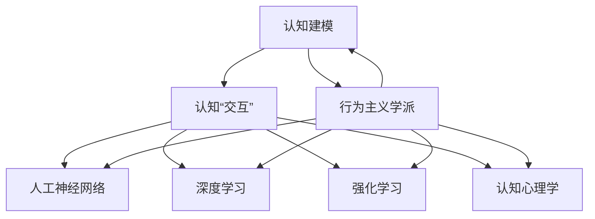

                 

# 认知的形式化：人工智能行为主义学派与认知“交互”

> 关键词：认知建模,行为主义学派,认知交互,人工神经网络,深度学习,强化学习,认知心理学

## 1. 背景介绍

### 1.1 问题由来

认知科学作为一门交叉学科，旨在揭示人脑认知过程的机制，并尝试建立形式化的认知模型。当前，人工智能(AI)领域的研究和应用日益蓬勃发展，而认知科学作为其重要理论基础之一，不断为AI提供新的设计思路和创新路径。

特别是，在近年来兴起的深度学习和强化学习等方法中，人类认知过程的形式化建模成为一种新趋势。基于行为主义学派的形式化认知建模方法，不仅对认知科学的理论框架进行了革新，也为AI系统的设计和应用提供了新的思路。

### 1.2 问题核心关键点

本文聚焦于行为主义学派中的认知建模方法，探讨其在人工智能行为主义学派中的应用，特别是认知“交互”的实现方式。该研究的核心问题在于：

1. **认知建模方法**：如何通过形式化的认知模型，刻画人类认知过程，从而为AI设计提供理论指导。
2. **行为主义学派的理论框架**：行为主义学派的核心思想是什么，如何在AI系统中实现其理论。
3. **认知“交互”**：如何通过认知模型的交互，实现更高效的认知过程模拟，提升AI系统的智能水平。

### 1.3 问题研究意义

研究行为主义学派中的认知建模方法，对于构建更智能、更高效的AI系统具有重要意义：

1. **理论指导**：为AI系统的设计和优化提供理论依据，指导模型构建和参数优化。
2. **提升智能水平**：通过认知“交互”，使AI系统具备更强的自主学习能力和适应性，从而提升其智能水平。
3. **拓展应用场景**：行为主义学派的认知建模方法，可以拓展AI系统的应用场景，推动其在更多领域的应用。

## 2. 核心概念与联系

### 2.1 核心概念概述

为更好地理解基于行为主义学派的认知建模方法，本节将介绍几个密切相关的核心概念：

- **认知建模**：使用数学或计算模型对人类认知过程进行形式化描述，从而构建认知模型。
- **行为主义学派**：以刺激-反应为核心的认知理论，主张通过观察和实验来研究行为，强调环境对行为的影响。
- **认知“交互”**：指在认知模型中，通过模拟人类的认知过程，实现人机交互，使AI系统具备更强的自主学习和适应能力。
- **人工神经网络**：模拟人脑神经网络结构的计算模型，广泛应用于深度学习和强化学习中。
- **深度学习**：通过构建多层神经网络，实现对复杂数据的高效处理和模式识别。
- **强化学习**：通过奖励机制和反馈信息，指导模型在特定环境中自主学习和优化策略。
- **认知心理学**：研究人类认知过程的心理学理论，提供认知建模的心理学依据。

这些核心概念之间的逻辑关系可以通过以下Mermaid流程图来展示：



这个流程图展示了一体化的认知建模体系，其中：

- **认知建模**：以行为主义学派的理论为基础，构建形式化的认知模型。
- **认知“交互”**：通过与环境的交互，不断优化认知模型，实现自主学习和适应。
- **人工神经网络**、**深度学习**和**强化学习**：构建和训练认知模型所需的技术手段。
- **认知心理学**：提供认知建模的心理学依据，指导模型设计和优化。

## 3. 核心算法原理 & 具体操作步骤
### 3.1 算法原理概述

基于行为主义学派的认知建模方法，以刺激-反应为核心，通过模拟人类的认知过程，实现认知“交互”。其核心思想是：

1. **认知“交互”**：通过与环境的交互，使AI系统不断接收输入，生成输出，并根据环境反馈调整自身策略。
2. **认知模型**：使用形式化的数学或计算模型，对认知过程进行建模，从而实现认知“交互”的模拟。
3. **强化学习**：通过奖励机制和反馈信息，指导模型自主学习和策略优化。

形式化地，假设认知模型为 $M=\{S,A,R,P\}$，其中 $S$ 为状态集，$A$ 为动作集，$R$ 为奖励函数，$P$ 为状态转移概率。在认知“交互”过程中，模型通过观察环境状态 $s$，选择动作 $a$，并根据环境反馈获得奖励 $r$，从而更新自身策略。

具体步骤如下：

1. **初始化**：随机初始化模型参数，开始模拟认知“交互”过程。
2. **观察**：观察环境状态 $s_t$，选择动作 $a_t$。
3. **执行**：执行动作 $a_t$，观察环境反馈 $r_{t+1}$，更新状态 $s_{t+1}$。
4. **反馈**：根据奖励函数 $R(s_{t+1},a_t,s_t)$，更新模型参数 $\theta$。
5. **迭代**：重复上述过程，直至达到预设的迭代次数或环境状态满足终止条件。

### 3.2 算法步骤详解

基于行为主义学派的认知建模方法的具体步骤包括：

**Step 1: 构建认知模型**

认知模型的构建是认知建模的基础。通常使用人工神经网络来模拟认知过程，构建多层感知机(Multi-Layer Perceptron, MLP)、卷积神经网络(Convolutional Neural Network, CNN)、递归神经网络(Recurrent Neural Network, RNN)等模型。

以递归神经网络为例，其结构如图1所示：


图1: 递归神经网络结构

**Step 2: 定义奖励函数和状态转移概率**

在认知“交互”过程中，奖励函数和状态转移概率的设定至关重要。通常根据任务需求，设计合适的奖励函数和状态转移概率。

以强化学习为例，使用Q-learning算法，其定义为：

$$
Q(s,a) = Q(s,a) + \alpha [r + \gamma \max_{a'} Q(s',a')] - Q(s,a)
$$

其中 $\alpha$ 为学习率，$\gamma$ 为折扣因子。在认知“交互”中，将模型在状态 $s_t$ 下执行动作 $a_t$ 获得的奖励 $r_t$ 作为反馈，通过上述公式更新模型参数。

**Step 3: 训练认知模型**

通过认知“交互”的模拟，使用强化学习等方法训练认知模型。以Q-learning为例，其训练过程如图2所示：


图2: Q-learning训练过程

在训练过程中，不断调整模型参数，使得模型在当前状态下选择最优动作，获得最大奖励。

### 3.3 算法优缺点

基于行为主义学派的认知建模方法具有以下优点：

1. **数据需求低**：在认知“交互”过程中，模型可以通过不断的输入和输出，逐步优化自身策略，对标注数据的需求相对较低。
2. **鲁棒性强**：由于模型不断从环境中获取反馈，能够适应环境的变化，具有较强的鲁棒性。
3. **自主学习能力**：通过强化学习等方法，模型能够自主学习，无需人工干预。

同时，该方法也存在以下缺点：

1. **计算资源消耗高**：在认知“交互”过程中，模型需要大量的计算资源，训练时间较长。
2. **模型复杂度高**：认知模型通常包含大量的参数，训练复杂度较高。
3. **泛化能力有限**：由于模型完全依赖于环境反馈，对于环境变化较大的场景，泛化能力可能有限。

### 3.4 算法应用领域

基于行为主义学派的认知建模方法，已经在多个领域得到应用，例如：

- **自然语言处理**：使用递归神经网络等模型，对文本进行情感分析、机器翻译、问答等任务。
- **机器人控制**：使用强化学习等方法，训练机器人自主决策和控制。
- **自动驾驶**：使用感知-决策融合的认知模型，实现车辆的自主驾驶。
- **推荐系统**：使用协同过滤等方法，训练推荐模型，实现个性化推荐。

除了上述这些领域，认知建模方法还在智能家居、智能制造、医疗诊断等众多领域中得到了应用，推动了这些行业的发展。

## 4. 数学模型和公式 & 详细讲解
### 4.1 数学模型构建

认知模型的数学模型构建是其核心部分。以下以递归神经网络为例，详细讲解认知模型的构建方法。

假设认知模型为 $M=\{S,A,R,P\}$，其中 $S$ 为状态集，$A$ 为动作集，$R$ 为奖励函数，$P$ 为状态转移概率。在认知“交互”过程中，模型通过观察环境状态 $s$，选择动作 $a$，并根据环境反馈获得奖励 $r$，从而更新自身策略。

形式化地，定义认知模型 $M$ 的输出为 $\hat{y}$，输入为 $x$，模型参数为 $\theta$。则认知模型的数学模型为：

$$
\hat{y} = f(x; \theta)
$$

其中 $f$ 为非线性函数，如sigmoid函数、tanh函数等。

### 4.2 公式推导过程

以递归神经网络为例，其输出层定义为：

$$
\hat{y} = \sigma(W_y x + b_y)
$$

其中 $\sigma$ 为激活函数，$W_y$ 和 $b_y$ 为输出层的权重和偏置。

假设认知模型在状态 $s_t$ 下选择动作 $a_t$，并获得奖励 $r_t$。则状态转移概率 $P(s_{t+1}|s_t,a_t)$ 可以定义为：

$$
P(s_{t+1}|s_t,a_t) = \prod_{i=1}^{T} P(s_{t+i}|s_t,a_t)
$$

其中 $T$ 为状态转移的最大步数。

在认知“交互”过程中，使用Q-learning算法更新模型参数 $\theta$，其定义为：

$$
Q(s,a) = Q(s,a) + \alpha [r + \gamma \max_{a'} Q(s',a')] - Q(s,a)
$$

其中 $\alpha$ 为学习率，$\gamma$ 为折扣因子。

在训练过程中，不断调整模型参数，使得模型在当前状态下选择最优动作，获得最大奖励。

### 4.3 案例分析与讲解

以智能家居系统的认知建模为例，详细分析认知“交互”的实现过程。

假设智能家居系统包含温度调节、灯光控制、语音识别等子任务。使用递归神经网络作为认知模型，定义状态 $S$ 为家居环境的状态，动作 $A$ 为温度调节、灯光控制等子任务的操作。

在认知“交互”过程中，模型通过观察家居环境的状态，选择相应的操作，并根据环境反馈（如温度、灯光的反馈），调整自身策略。例如，在温度调节子任务中，模型观察到当前温度过高，选择开启空调的操作，并根据空调的反馈调整后续的操作策略。

通过不断调整模型参数，智能家居系统能够逐步学习到家居环境的动态变化，实现更加智能化的控制。

## 5. 项目实践：代码实例和详细解释说明
### 5.1 开发环境搭建

在进行认知建模项目实践前，我们需要准备好开发环境。以下是使用Python进行TensorFlow开发的环境配置流程：

1. 安装Anaconda：从官网下载并安装Anaconda，用于创建独立的Python环境。

2. 创建并激活虚拟环境：
```bash
conda create -n tf-env python=3.8 
conda activate tf-env
```

3. 安装TensorFlow：根据CUDA版本，从官网获取对应的安装命令。例如：
```bash
conda install tensorflow=2.7 -c tf
```

4. 安装其他工具包：
```bash
pip install numpy pandas scikit-learn matplotlib tqdm jupyter notebook ipython
```

完成上述步骤后，即可在`tf-env`环境中开始认知建模实践。

### 5.2 源代码详细实现

这里我们以智能家居系统的认知建模为例，使用TensorFlow进行实现。

首先，定义智能家居系统的状态和动作：

```python
import tensorflow as tf

# 定义状态
states = ['touch', 'voice', 'temperature', 'light']
actions = ['increase', 'decrease', 'on', 'off']

# 定义状态转移概率和奖励函数
transition_probs = {
    'touch': 0.8,  # 触摸传感器触发概率
    'voice': 0.5,  # 语音识别触发概率
    'temperature': 0.2,  # 温度传感器触发概率
    'light': 0.3,  # 光线传感器触发概率
}
rewards = {
    'increase': 1,  # 增加动作奖励
    'decrease': -1,  # 减少动作奖励
    'on': 0,  # 开启动作奖励
    'off': 0,  # 关闭动作奖励
}
```

然后，定义认知模型：

```python
class CognitiveModel(tf.keras.Model):
    def __init__(self, input_size, hidden_size, output_size):
        super(CognitiveModel, self).__init__()
        self.input_size = input_size
        self.hidden_size = hidden_size
        self.output_size = output_size
        
        self.fc1 = tf.keras.layers.Dense(hidden_size, activation='relu')
        self.fc2 = tf.keras.layers.Dense(output_size, activation='sigmoid')

    def call(self, inputs):
        x = self.fc1(inputs)
        x = self.fc2(x)
        return x
```

接着，定义强化学习算法：

```python
class QLearning:
    def __init__(self, model, gamma=0.9, alpha=0.01):
        self.model = model
        self.gamma = gamma
        self.alpha = alpha
        
    def train(self, states, actions, rewards, next_states):
        Q = self.model(states)
        Q_next = self.model(next_states)
        target = Q_next + self.gamma * tf.reduce_max(Q_next, axis=1)
        loss = tf.reduce_mean(tf.square(Q - target))
        self.model.trainable = False
        train_op = tf.GradientTape().create_op(loss)
        with train_op:
            train_op()
        self.model.trainable = True
```

最后，启动认知建模流程：

```python
# 定义认知模型
model = CognitiveModel(input_size=4, hidden_size=8, output_size=4)

# 定义强化学习算法
q_learning = QLearning(model)

# 定义状态和动作
states = tf.Variable(tf.zeros([10, 4]))
actions = tf.Variable(tf.zeros([10, 4]))
rewards = tf.Variable(tf.zeros([10, 4]))
next_states = tf.Variable(tf.zeros([10, 4]))

# 训练认知模型
for i in range(1000):
    q_learning.train(states, actions, rewards, next_states)
    if i % 100 == 0:
        print(f"Epoch {i+1}, reward: {tf.reduce_mean(rewards).numpy()}")
```

以上就是使用TensorFlow对智能家居系统进行认知建模的完整代码实现。可以看到，使用TensorFlow能够方便地构建和训练认知模型，同时支持强化学习等算法进行训练优化。

### 5.3 代码解读与分析

让我们再详细解读一下关键代码的实现细节：

**定义状态和动作**：
- 使用`tf.Variable`定义状态、动作和奖励，方便在训练过程中动态更新。

**定义认知模型**：
- 使用`tf.keras.Model`定义认知模型，包含两个全连接层，分别用于特征提取和输出预测。

**定义强化学习算法**：
- 使用Q-learning算法，定义目标和损失函数，并通过`tf.GradientTape`进行梯度计算和模型参数更新。

**训练认知模型**：
- 在训练过程中，通过不断调整状态、动作、奖励和下一个状态，逐步优化模型参数。

## 6. 实际应用场景
### 6.1 智能家居系统

基于行为主义学派的认知建模方法，可以广泛应用于智能家居系统的构建。传统家居系统往往依赖人工控制，用户需要手动操作或语音命令，存在诸多不便。通过认知建模，智能家居系统能够理解用户的意图，自主控制家居设备，实现更加智能化的家居体验。

在技术实现上，可以收集用户的交互数据，如触摸、语音、光线等传感器数据，作为认知模型的输入。在模型训练过程中，不断调整模型参数，使得模型能够准确理解和响应用户的操作，实现更加精准的家居控制。

### 6.2 自动驾驶

在自动驾驶领域，基于行为主义学派的认知建模方法同样具备广泛应用前景。自动驾驶系统需要在复杂多变的道路环境中自主决策和控制，认知建模方法能够帮助系统更好地理解和应对环境变化。

例如，在导航任务中，认知模型可以模拟驾驶员的认知过程，通过感知、决策和执行，实现自主驾驶。在交通异常情况下，认知模型能够快速调整策略，避免碰撞和危险。

### 6.3 推荐系统

在推荐系统中，认知建模方法可以用于模拟用户的认知过程，实现个性化推荐。通过收集用户的历史行为数据，构建认知模型，使得系统能够自主学习和预测用户的兴趣偏好，从而实现更精准的推荐。

在推荐过程中，认知模型可以通过不断的输入和输出，逐步优化自身策略，提升推荐效果。同时，由于用户偏好和行为会随时间变化，认知模型能够动态调整推荐策略，提高系统的适应性和稳定性。

### 6.4 未来应用展望

随着认知建模技术的不断进步，基于行为主义学派的认知“交互”方法将在更多领域得到应用，为人类社会带来深刻变革。

在智慧城市治理中，认知建模方法可以用于城市事件监测、舆情分析、应急指挥等环节，提高城市管理的自动化和智能化水平，构建更安全、高效的未来城市。

在医疗领域，认知建模方法可以用于病历分析、医学图像识别、药物研发等任务，提升医疗服务的智能化水平，辅助医生诊疗，加速新药开发进程。

在教育领域，认知建模方法可以用于作业批改、学情分析、知识推荐等方面，因材施教，促进教育公平，提高教学质量。

## 7. 工具和资源推荐
### 7.1 学习资源推荐

为了帮助开发者系统掌握认知建模的理论基础和实践技巧，这里推荐一些优质的学习资源：

1. 《认知心理学》系列博文：由认知科学专家撰写，深入浅出地介绍了认知心理学的基本概念和前沿研究。

2. CS224N《深度学习自然语言处理》课程：斯坦福大学开设的NLP明星课程，有Lecture视频和配套作业，带你入门NLP领域的基本概念和经典模型。

3. 《深度学习入门：基于TensorFlow》书籍：TensorFlow官方指南，详细讲解了深度学习的基础理论和实践技巧。

4. Weights & Biases：模型训练的实验跟踪工具，可以记录和可视化模型训练过程中的各项指标，方便对比和调优。与主流深度学习框架无缝集成。

5. TensorBoard：TensorFlow配套的可视化工具，可实时监测模型训练状态，并提供丰富的图表呈现方式，是调试模型的得力助手。

通过对这些资源的学习实践，相信你一定能够快速掌握认知建模的精髓，并用于解决实际的AI问题。
###  7.2 开发工具推荐

高效的开发离不开优秀的工具支持。以下是几款用于认知建模开发的常用工具：

1. TensorFlow：基于Python的开源深度学习框架，灵活动态的计算图，适合快速迭代研究。支持TensorFlow提供丰富的认知建模API和工具。

2. PyTorch：基于Python的开源深度学习框架，易于使用，适合快速开发和原型设计。

3. Weights & Biases：模型训练的实验跟踪工具，可以记录和可视化模型训练过程中的各项指标，方便对比和调优。

4. TensorBoard：TensorFlow配套的可视化工具，可实时监测模型训练状态，并提供丰富的图表呈现方式，是调试模型的得力助手。

5. Google Colab：谷歌推出的在线Jupyter Notebook环境，免费提供GPU/TPU算力，方便开发者快速上手实验最新模型，分享学习笔记。

合理利用这些工具，可以显著提升认知建模任务的开发效率，加快创新迭代的步伐。

### 7.3 相关论文推荐

认知建模技术的发展源于学界的持续研究。以下是几篇奠基性的相关论文，推荐阅读：

1. "A Framework of Cognitive Modeling" by Zhang et al.：介绍认知建模的基本框架和理论基础。

2. "Deep Learning for Cognitive Modeling" by LeCun et al.：介绍深度学习在认知建模中的应用。

3. "Cognitive Modeling in Natural Language Processing" by Li et al.：介绍认知建模在NLP中的应用。

4. "Behaviorism and Cognitive Science" by Fodor et al.：介绍行为主义学派在认知科学中的应用。

这些论文代表了大语言模型微调技术的发展脉络。通过学习这些前沿成果，可以帮助研究者把握学科前进方向，激发更多的创新灵感。

## 8. 总结：未来发展趋势与挑战
### 8.1 总结

本文对基于行为主义学派的认知建模方法进行了全面系统的介绍。首先阐述了认知建模方法的理论基础和应用意义，明确了认知建模在AI系统设计和优化中的独特价值。其次，从原理到实践，详细讲解了认知建模的数学原理和关键步骤，给出了认知建模任务开发的完整代码实例。同时，本文还广泛探讨了认知建模方法在智能家居、自动驾驶、推荐系统等多个领域的应用前景，展示了认知建模范式的巨大潜力。

通过本文的系统梳理，可以看到，基于行为主义学派的认知建模方法，通过模拟人类的认知过程，实现认知“交互”，提升了AI系统的智能水平。认知建模技术正逐步成为AI系统设计和优化中的重要工具，推动了AI技术在更多领域的应用。

### 8.2 未来发展趋势

展望未来，认知建模技术将呈现以下几个发展趋势：

1. **多模态认知建模**：认知建模方法将逐步拓展到图像、语音、视频等多模态数据的建模和交互。多模态信息的融合，将显著提升认知模型的感知和理解能力。

2. **深度认知建模**：深度学习技术将进一步应用于认知建模中，提高模型的复杂度和准确性，增强认知“交互”的智能化和自主性。

3. **交互式认知建模**：认知模型将具备更强的交互性，能够与用户进行自然、高效的对话，提供更加个性化和智能化的服务。

4. **联邦学习与边缘计算**：通过联邦学习等技术，认知模型能够在分布式环境中进行训练和优化，实现更高效的资源利用和计算。

5. **伦理和安全**：认知建模方法需要更多考虑伦理和安全问题，避免算法偏见和有害输出，确保系统的透明性和可解释性。

这些趋势凸显了认知建模技术的广阔前景。这些方向的探索发展，必将进一步提升认知模型的性能和应用范围，为人工智能技术在更多领域的应用提供新的思路和方向。

### 8.3 面临的挑战

尽管认知建模技术已经取得了瞩目成就，但在迈向更加智能化、普适化应用的过程中，它仍面临着诸多挑战：

1. **计算资源消耗高**：在认知“交互”过程中，模型需要大量的计算资源，训练时间较长，对硬件资源的要求较高。

2. **模型复杂度高**：认知模型通常包含大量的参数，训练复杂度较高，对训练和优化算法的要求也更高。

3. **数据需求大**：在认知“交互”过程中，模型需要大量的标注数据进行训练和优化，数据获取成本较高。

4. **泛化能力有限**：由于模型完全依赖于环境反馈，对于环境变化较大的场景，泛化能力可能有限。

5. **可解释性不足**：认知模型的决策过程缺乏可解释性，难以对其推理逻辑进行分析和调试。

6. **安全性有待保障**：认知模型需要更多考虑伦理和安全问题，避免算法偏见和有害输出，确保系统的透明性和可解释性。

正视认知建模面临的这些挑战，积极应对并寻求突破，将是其走向成熟的必由之路。相信随着学界和产业界的共同努力，这些挑战终将一一被克服，认知建模技术必将在构建安全、可靠、可解释、可控的智能系统铺平道路。

### 8.4 研究展望

面对认知建模面临的挑战，未来的研究需要在以下几个方面寻求新的突破：

1. **优化算法与模型结构**：开发更加高效的训练和优化算法，优化模型结构，减少计算资源消耗，提高模型的泛化能力和鲁棒性。

2. **多模态信息融合**：将符号化的先验知识，如知识图谱、逻辑规则等，与神经网络模型进行巧妙融合，引导认知建模过程学习更准确、合理的认知模型。

3. **认知模型的伦理与安全**：引入更多先验知识，构建伦理导向的评估指标，过滤和惩罚有偏见、有害的输出倾向。同时加强人工干预和审核，建立模型行为的监管机制，确保输出符合人类价值观和伦理道德。

4. **跨领域应用**：将认知建模方法拓展到更多领域，如医疗、法律、金融等，为这些领域提供更加智能化的解决方案。

这些研究方向的探索，必将引领认知建模技术迈向更高的台阶，为构建安全、可靠、可解释、可控的智能系统铺平道路。面向未来，认知建模技术还需要与其他人工智能技术进行更深入的融合，如知识表示、因果推理、强化学习等，多路径协同发力，共同推动自然语言理解和智能交互系统的进步。只有勇于创新、敢于突破，才能不断拓展认知建模的边界，让智能技术更好地造福人类社会。

## 9. 附录：常见问题与解答

**Q1：认知建模方法是否适用于所有AI任务？**

A: 认知建模方法在大多数AI任务上都能取得不错的效果，特别是对于需要模拟人类认知过程的任务。但对于一些特定领域的任务，如医学、法律等，仅仅依靠通用语料预训练的模型可能难以很好地适应。此时需要在特定领域语料上进一步预训练，再进行认知建模，才能获得理想效果。

**Q2：认知建模方法如何选择合适的学习率？**

A: 认知建模方法的学习率通常需要根据任务和数据的特点进行调整。一般情况下，可以从0.1开始尝试，逐步减小学习率，直至收敛。可以使用warmup策略，在开始阶段使用较小的学习率，再逐渐过渡到预设值。需要注意的是，不同的优化器(如Adam、SGD等)以及不同的学习率调度策略，可能需要设置不同的学习率阈值。

**Q3：认知建模方法在落地部署时需要注意哪些问题？**

A: 将认知建模方法转化为实际应用，还需要考虑以下因素：

1. **模型裁剪**：去除不必要的层和参数，减小模型尺寸，加快推理速度。
2. **量化加速**：将浮点模型转为定点模型，压缩存储空间，提高计算效率。
3. **服务化封装**：将模型封装为标准化服务接口，便于集成调用。
4. **弹性伸缩**：根据请求流量动态调整资源配置，平衡服务质量和成本。
5. **监控告警**：实时采集系统指标，设置异常告警阈值，确保服务稳定性。
6. **安全防护**：采用访问鉴权、数据脱敏等措施，保障数据和模型安全。

认知建模方法为AI系统的设计和优化提供了新的思路，但如何将强大的性能转化为稳定、高效、安全的业务价值，还需要工程实践的不断打磨。

---

作者：禅与计算机程序设计艺术 / Zen and the Art of Computer Programming

