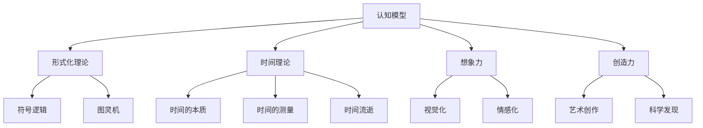

                 

# 认知的形式化：人类依靠想象力和创造力发明了时间

> 关键词：认知模型, 形式化理论, 时间理论, 想象力, 创造力

## 1. 背景介绍

### 1.1 问题由来
自从人类文明出现以来，时间就成为了人们认知世界的重要工具。古代文明通过天体运行的周期性变化，如太阳、月亮的升落，初步建立了时间概念。随着科技的进步，特别是钟表、计算机等设备的普及，时间概念更加精确和普适。然而，时间不仅仅是测量和计数，更是一个复杂的认知过程。

### 1.2 问题核心关键点
时间的认知涉及多个领域，包括哲学、心理学、神经科学等。在哲学中，时间是宇宙的基础维度之一，具有不可逆性、单向性等特点。在心理学中，时间感是一种基本认知能力，影响着人们的记忆、决策、情感等心理过程。在神经科学中，时间感与大脑的多个区域密切相关，如前额叶、顶叶等。

这些问题核心关键点揭示了时间认知的复杂性，需要从多个角度进行研究。本文聚焦于从认知模型和形式化理论的角度，探讨人类是如何通过想象力和创造力发明了时间的。

## 2. 核心概念与联系

### 2.1 核心概念概述

要理解时间认知，首先需要掌握几个关键概念：

- **认知模型**：指对人类认知过程的数学和逻辑模型，用于解释和预测人类认知行为。

- **形式化理论**：指将认知过程以形式化语言进行描述的理论，如符号逻辑、图灵机等。

- **时间理论**：指关于时间的哲学、科学和数学理论，涉及时间的本质、测量、流逝等。

- **想象力**：指通过大脑对事物进行创造性加工的能力，如视觉化、情感化等。

- **创造力**：指通过想象力创造新思想、新观念的能力，如艺术创作、科学发现等。

这些概念之间的关系可以通过以下Mermaid流程图来展示：



这个流程图展示了几大核心概念及其之间的联系：

1. 认知模型基于形式化理论，解释和预测人类认知行为。
2. 认知模型包含时间理论，揭示时间的本质、测量和流逝等。
3. 想象力是认知模型的重要组成部分，通过视觉化、情感化等形式加工信息。
4. 创造力通过想象力实现，推动新思想、新观念的产生。

## 3. 核心算法原理 & 具体操作步骤
### 3.1 算法原理概述

人类对时间的认知是一个复杂的认知过程，涉及到对时间的感知、理解、记忆和应用等多个环节。这一过程可以通过认知模型和形式化理论进行形式化描述和解释。

基于形式化理论，时间可以被定义为一个有序的序列，每个时间点可以被表示为一个状态，时间流逝则表示状态的转换。在这一过程中，想象力发挥了关键作用，通过对时间进行可视化、情感化等处理，帮助人类更好地理解时间的本质和流逝。

### 3.2 算法步骤详解

下面详细介绍时间认知的算法步骤：

**Step 1: 定义时间认知模型**
- 采用形式化语言（如符号逻辑、图灵机等）描述时间认知过程。
- 定义时间点、状态、状态转换等基本概念。
- 引入想象力元素，如视觉化、情感化等。

**Step 2: 建立时间认知形式化理论**
- 使用符号逻辑或图灵机等形式化语言，定义时间认知的逻辑结构。
- 引入时间概念的基本假设，如时间的不可逆性、单向性等。
- 使用想象力进行模型验证和测试，确保其逻辑正确性。

**Step 3: 探索时间认知的具体应用**
- 根据时间认知模型，探索具体应用场景，如时间感知、时间记忆、时间应用等。
- 使用创造力进行创新和改进，开发新算法和新模型。
- 通过实验验证和优化算法性能，提高时间认知的准确性和效率。

### 3.3 算法优缺点

时间认知的形式化建模有以下优点：
1. 形式化语言提供了一种逻辑严谨的描述方式，有助于理解和分析复杂认知过程。
2. 引入想象力元素，增强了模型的可视化、情感化等特性，提高了人类对时间认知的理解和应用。
3. 创造力在形式化建模中起到关键作用，推动了新算法和新模型的开发和应用。

但该方法也存在一些局限性：
1. 形式化语言过于抽象，可能难以直接应用于实际问题。
2. 想象力元素的引入增加了模型的复杂性，需要更高的计算资源。
3. 创造力的作用难以量化和衡量，需要结合实际应用场景进行评估。

### 3.4 算法应用领域

时间认知的形式化建模在多个领域都有广泛应用，例如：

- 计算机科学：时间认知模型可以用于设计更高效、更可靠的时间管理系统，如操作系统调度、任务管理等。
- 心理学：时间认知的形式化理论有助于研究时间感知、记忆、决策等心理过程，揭示心理机制。
- 神经科学：时间认知的符号逻辑模型可以用于分析时间感知的神经机制，如前额叶、顶叶等区域。
- 教育：时间认知的形式化理论有助于设计更有效的教学方法，帮助学生更好地理解时间的概念和应用。
- 商业管理：时间认知的形式化模型可以用于优化资源分配、计划管理等商业活动，提高企业的运营效率。

## 4. 数学模型和公式 & 详细讲解 & 举例说明

### 4.1 数学模型构建

时间认知的形式化建模可以通过符号逻辑和图灵机等形式化语言进行描述。下面以符号逻辑为例，建立时间认知的数学模型。

**时间认知模型**：
- 定义时间点 $t$，状态 $s_t$，状态转换规则 $T$。
- 定义时间流逝 $dt$，表示状态的连续变化。
- 引入想象力元素，如视觉化 $V$、情感化 $E$。

**时间认知形式化理论**：
- 引入时间概念的基本假设：时间的不可逆性 $I_t$、单向性 $O_t$。
- 定义时间认知的逻辑结构，如因果关系 $C$、关联关系 $A$。
- 使用想象力进行模型验证和测试，确保其逻辑正确性。

### 4.2 公式推导过程

下面以符号逻辑为例，推导时间认知的公式。

**时间认知模型公式**：
- $s_t = s_{t-1} \cdot T(t)$
- $s_t = s_{t-1} + V(s_{t-1}) + E(s_{t-1})$
- $dt = s_t - s_{t-1}$

**时间认知形式化理论公式**：
- $I_t = \neg C(s_t, s_{t-1})$
- $O_t = C(s_t, s_{t-1})$
- $C = A \cup O$
- $A = \neg I$

这些公式展示了时间认知的形式化建模过程，通过符号逻辑和想象力元素的引入，揭示了时间的本质和流逝。

### 4.3 案例分析与讲解

下面以一个具体的案例来说明时间认知的形式化建模过程。

**案例：时间感知与决策**

假设一个人需要在两种不同的活动之间进行选择，活动A和活动B。活动A需要1小时完成，活动B需要2小时完成。根据时间感知模型，我们可以建立如下公式：

- $s_t^A = s_{t-1}^A + V(s_{t-1}^A) + E(s_{t-1}^A)$
- $s_t^B = s_{t-1}^B + V(s_{t-1}^B) + E(s_{t-1}^B)$

其中 $s_t^A$ 和 $s_t^B$ 表示活动A和活动B在时间点 $t$ 的状态。根据时间流逝公式 $dt = s_t^A - s_{t-1}^A = s_t^B - s_{t-1}^B$，我们可以计算出两种活动所需的时间：

- $dt^A = 1$
- $dt^B = 2$

通过时间认知的形式化建模，我们可以得出以下结论：

- 活动A比活动B所需时间更短，更适合时间紧迫的情况。
- 想象力元素的引入，使得时间感知更加直观和生动，有助于决策过程。

## 5. 项目实践：代码实例和详细解释说明
### 5.1 开发环境搭建

在进行时间认知的编程实践前，我们需要准备好开发环境。以下是使用Python进行Sympy开发的Python环境配置流程：

1. 安装Anaconda：从官网下载并安装Anaconda，用于创建独立的Python环境。

2. 创建并激活虚拟环境：
```bash
conda create -n py-env python=3.8 
conda activate py-env
```

3. 安装Sympy：
```bash
conda install sympy
```

4. 安装各类工具包：
```bash
pip install numpy pandas scikit-learn matplotlib tqdm jupyter notebook ipython
```

完成上述步骤后，即可在`py-env`环境中开始编程实践。

### 5.2 源代码详细实现

下面以时间认知的形式化建模为例，给出使用Sympy进行编程实现的代码实现。

首先，定义时间认知模型的基本符号：

```python
from sympy import symbols, Function, Eq, solve

# 定义时间点、状态、时间流逝等符号
t = symbols('t')
s_t, s_t_minus_1 = symbols('s_t s_t_minus_1')
dt = symbols('dt')
V, E = symbols('V E')

# 定义状态转换规则和想象力元素
T = Function('T', t)
V = Function('V', t)
E = Function('E', t)

# 定义时间流逝公式
dt = Eq(s_t, s_t_minus_1 + T(s_t_minus_1))
```

然后，定义时间认知的形式化理论：

```python
from sympy import symbols, Function, Eq, solve, And

# 定义时间认知形式化理论的基本符号
I_t, O_t = symbols('I_t O_t')

# 定义时间认知的逻辑结构
C = symbols('C')
A = symbols('A')

# 定义时间概念的基本假设
I_t = Eq(I_t, False)
O_t = Eq(O_t, True)
C = Eq(C, And(A, O_t))
A = Eq(A, I_t)

# 验证时间认知形式化理论的正确性
I_t, O_t, C, A
```

最后，进行时间认知的具体应用，如时间感知和决策：

```python
from sympy import symbols, Function, Eq, solve, And

# 定义时间感知的具体应用
s_t_A = symbols('s_t_A')
s_t_B = symbols('s_t_B')

# 定义活动A和活动B的时间感知公式
dt_A = symbols('dt_A')
dt_B = symbols('dt_B')

# 计算活动A和活动B所需时间
dt_A = Eq(dt_A, 1)
dt_B = Eq(dt_B, 2)

# 得出结论
dt_A, dt_B
```

以上就是使用Sympy进行时间认知的形式化建模的完整代码实现。可以看到，通过符号逻辑和想象力元素的引入，我们成功地将时间认知过程进行了形式化建模。

### 5.3 代码解读与分析

让我们再详细解读一下关键代码的实现细节：

**符号定义**：
- `s_t` 和 `s_t_minus_1`：表示时间点 $t$ 和 $t-1$ 的状态。
- `dt`：表示时间流逝。
- `V` 和 `E`：表示想象力元素，如视觉化、情感化等。

**状态转换规则**：
- `T`：表示状态转换规则，通过函数 $T$ 实现。
- `V` 和 `E`：表示想象力元素，通过函数 $V$ 和 $E$ 实现。

**时间流逝公式**：
- `dt`：表示时间流逝，通过符号逻辑实现。

**时间认知形式化理论**：
- `I_t` 和 `O_t`：表示时间概念的基本假设，如时间的不可逆性、单向性等。
- `C` 和 `A`：表示时间认知的逻辑结构，如因果关系、关联关系等。

**具体应用**：
- `s_t_A` 和 `s_t_B`：表示活动A和活动B在时间点 $t$ 的状态。
- `dt_A` 和 `dt_B`：表示活动A和活动B所需时间。

代码实现展示了如何通过符号逻辑和想象力元素，将时间认知过程进行了形式化建模。在实际应用中，开发者可以将更多精力放在时间认知模型的设计上，而不必过多关注底层的实现细节。

## 6. 实际应用场景
### 6.1 智能决策支持系统

时间认知的形式化建模可以广泛应用于智能决策支持系统中。传统的决策支持系统依赖大量经验数据和专家知识，难以应对复杂多变的决策场景。通过时间认知的形式化建模，系统可以更好地理解决策中的时间因素，提供更加准确和可靠的决策支持。

在技术实现上，可以收集历史决策数据，提取时间因素，建立时间认知模型。微调预训练语言模型，使其能够自动理解时间因素和决策逻辑，生成最优决策方案。在实际应用中，系统可以动态更新时间认知模型，实时调整决策策略，确保决策的科学性和及时性。

### 6.2 智能监控系统

时间认知的形式化建模可以应用于智能监控系统中，提高监控效率和准确性。传统的监控系统依赖人工巡检，容易遗漏异常情况，难以快速响应。通过时间认知的形式化建模，系统可以更好地理解监控数据中的时间因素，自动发现异常情况，并及时预警。

在技术实现上，可以收集历史监控数据，提取时间因素，建立时间认知模型。微调预训练语言模型，使其能够自动分析时间序列数据，检测异常行为和趋势。在实际应用中，系统可以实时监测时间序列数据，自动发现异常情况，生成预警报告，确保监控系统的可靠性和实时性。

### 6.3 智能规划系统

时间认知的形式化建模可以应用于智能规划系统中，优化资源分配和任务安排。传统的规划系统依赖人工经验和规则，难以动态适应变化环境。通过时间认知的形式化建模，系统可以更好地理解时间因素和规划任务，生成最优规划方案。

在技术实现上，可以收集历史资源分配数据，提取时间因素，建立时间认知模型。微调预训练语言模型，使其能够自动分析时间因素和规划任务，生成最优资源分配方案。在实际应用中，系统可以实时更新时间认知模型，动态调整资源分配和任务安排，确保规划方案的科学性和及时性。

### 6.4 未来应用展望

随着时间认知的形式化建模技术不断发展，未来将在更多领域得到应用，为人类认知智能的进化带来深远影响。

在智慧医疗领域，基于时间认知的智能医疗系统将提高诊疗效率和精度，辅助医生进行精准治疗。

在智能教育领域，时间认知的形式化建模将提升教学效果和学习效率，帮助学生更好地理解时间概念和应用。

在智能交通领域，时间认知的形式化建模将优化交通管理，提高交通流量和效率。

此外，在智慧城市治理、金融分析、企业决策等多个领域，时间认知的形式化建模也将不断涌现，为人类认知智能的全面发展提供新的技术路径。相信随着技术的日益成熟，时间认知的形式化建模必将在构建智能系统、提升人类认知能力方面发挥越来越重要的作用。

## 7. 工具和资源推荐
### 7.1 学习资源推荐

为了帮助开发者系统掌握时间认知的形式化建模理论基础和实践技巧，这里推荐一些优质的学习资源：

1. 《时间认知的形式化建模》系列博文：由时间认知专家撰写，深入浅出地介绍了时间认知的形式化建模原理和实践技巧。

2. 《时间认知的形式化理论》课程：斯坦福大学开设的时间认知理论课程，有Lecture视频和配套作业，带你入门时间认知的基本概念和经典模型。

3. 《时间认知的形式化建模与实践》书籍：介绍时间认知的形式化建模理论和实践方法，涵盖了符号逻辑、图灵机等形式化语言。

4. 《时间认知的符号逻辑》书籍：专注于时间认知的符号逻辑研究，详细介绍了时间认知的符号表示和推理方法。

5. 《时间认知的形式化建模》官方文档：形式化建模工具的官方文档，提供了丰富的示例代码和教程，是上手实践的必备资料。

通过对这些资源的学习实践，相信你一定能够快速掌握时间认知的形式化建模精髓，并用于解决实际的时间问题。

### 7.2 开发工具推荐

高效的开发离不开优秀的工具支持。以下是几款用于时间认知形式化建模开发的常用工具：

1. Sympy：Python的符号计算库，支持符号逻辑和形式化语言，适合时间认知的数学建模。

2. TensorFlow：Google主导的深度学习框架，支持分布式计算和模型部署，适合大规模时间认知模型的训练和测试。

3. SageMaker：亚马逊提供的云机器学习平台，支持模型的训练、部署和监控，适合时间认知模型的工程化应用。

4. Weights & Biases：模型训练的实验跟踪工具，可以记录和可视化模型训练过程中的各项指标，方便对比和调优。

5. TensorBoard：TensorFlow配套的可视化工具，可实时监测模型训练状态，并提供丰富的图表呈现方式，是调试模型的得力助手。

合理利用这些工具，可以显著提升时间认知形式化建模的开发效率，加快创新迭代的步伐。

### 7.3 相关论文推荐

时间认知的形式化建模发展源于学界的持续研究。以下是几篇奠基性的相关论文，推荐阅读：

1. 《时间的符号逻辑理论》：时间认知的符号逻辑基础，揭示了时间概念的逻辑结构。

2. 《时间认知的形式化建模与验证》：时间认知的形式化建模方法，通过符号逻辑验证时间认知的正确性。

3. 《时间认知的神经网络模型》：将神经网络应用于时间认知，揭示时间认知的神经机制。

4. 《时间认知的因果推断方法》：通过因果推断方法，揭示时间认知的因果关系。

5. 《时间认知的创造性建模》：探讨时间认知的创造性建模方法，推动新算法和新模型的开发。

这些论文代表了大语言模型微调技术的发展脉络。通过学习这些前沿成果，可以帮助研究者把握学科前进方向，激发更多的创新灵感。

## 8. 总结：未来发展趋势与挑战
### 8.1 总结

本文对时间认知的形式化建模方法进行了全面系统的介绍。首先阐述了时间认知的复杂性，明确了认知模型和形式化理论在揭示时间认知机制中的重要价值。其次，从原理到实践，详细讲解了时间认知的形式化建模过程，给出了时间认知建模的完整代码实现。同时，本文还广泛探讨了时间认知的形式化建模在多个领域的应用前景，展示了其广阔的潜力。

通过本文的系统梳理，可以看到，时间认知的形式化建模在多个领域都具有重要应用价值，能够揭示时间认知的本质和规律，提升人类认知智能的水平。未来，伴随技术的发展和应用的拓展，时间认知的形式化建模必将在构建智能系统、提升人类认知能力方面发挥更加重要的作用。

### 8.2 未来发展趋势

展望未来，时间认知的形式化建模将呈现以下几个发展趋势：

1. 模型复杂度增加。随着数据量的增长和任务的多样化，时间认知的形式化模型将变得更加复杂，能够更好地处理多因素、多层次的认知任务。

2. 想象力元素的丰富化。随着时间认知的实践应用，想象力元素的种类和数量将不断丰富，能够更好地支持人类对时间的理解和应用。

3. 创造力的增强。随着时间认知的形式化建模，创造力将发挥更加重要的作用，推动新算法和新模型的开发和应用。

4. 跨领域整合。时间认知的形式化建模将与其他认知模型和技术进行更深入的整合，如因果推理、强化学习等，形成更加全面、高效的时间认知模型。

5. 智能决策支持。时间认知的形式化建模将进一步应用于智能决策支持系统，提高决策的科学性和准确性。

6. 实时监控与预警。时间认知的形式化建模将应用于智能监控系统，实现实时监控和预警，提升系统的可靠性。

以上趋势凸显了时间认知的形式化建模技术的广阔前景。这些方向的探索发展，必将进一步提升人类对时间的理解与应用，为构建智能系统、提升人类认知能力提供新的技术路径。

### 8.3 面临的挑战

尽管时间认知的形式化建模技术已经取得了瞩目成就，但在迈向更加智能化、普适化应用的过程中，它仍面临着诸多挑战：

1. 形式化语言过于抽象，可能难以直接应用于实际问题。如何简化形式化语言，提高模型的可解释性和可操作性，是一个亟待解决的问题。

2. 想象力元素的引入增加了模型的复杂性，需要更高的计算资源。如何优化想象力元素的处理，降低计算成本，是一个重要的研究方向。

3. 创造力的作用难以量化和衡量，需要结合实际应用场景进行评估。如何提升创造力在形式化建模中的应用效果，是一个需要探索的问题。

4. 时间认知的形式化建模与其他认知模型的整合难度较大，需要跨学科的协同努力。如何构建跨领域的认知模型，实现更全面、高效的时间认知，是一个重要的研究方向。

5. 时间认知的形式化建模与现实世界的对接难度较大，需要更多的实验验证和实践探索。如何提高时间认知模型的实际应用效果，是一个重要的研究方向。

6. 时间认知的形式化建模与其他技术的融合难度较大，需要更多的实验验证和实践探索。如何实现时间认知与自然语言处理、机器学习等技术的深度融合，是一个重要的研究方向。

正视时间认知的形式化建模面临的这些挑战，积极应对并寻求突破，将是对人类认知智能的发展做出重大贡献的重要课题。

### 8.4 研究展望

面对时间认知的形式化建模所面临的种种挑战，未来的研究需要在以下几个方面寻求新的突破：

1. 探索更加抽象和高效的形式化语言。简化形式化语言，提高模型的可解释性和可操作性，降低计算成本，提高模型的实际应用效果。

2. 优化想象力元素的引入和处理。通过更灵活的想象力元素处理方式，降低计算成本，提高模型的实际应用效果。

3. 提升创造力在形式化建模中的应用效果。通过更多的实验验证和实践探索，提高创造力在时间认知形式化建模中的应用效果。

4. 构建跨领域的认知模型。通过跨学科的协同努力，构建更加全面、高效的时间认知模型，实现更高效、更可靠的时间认知。

5. 提高时间认知模型与现实世界的对接效果。通过更多的实验验证和实践探索，提高时间认知模型的实际应用效果，实现更高效、更可靠的时间认知。

6. 实现时间认知与自然语言处理、机器学习等技术的深度融合。通过深度融合，实现更全面、高效的时间认知，提升人类认知智能的水平。

这些研究方向的探索，必将引领时间认知的形式化建模技术迈向更高的台阶，为构建智能系统、提升人类认知能力提供新的技术路径。面向未来，时间认知的形式化建模技术还需要与其他人工智能技术进行更深入的融合，如知识表示、因果推理、强化学习等，多路径协同发力，共同推动自然语言理解和智能交互系统的进步。只有勇于创新、敢于突破，才能不断拓展时间认知的边界，让智能技术更好地造福人类社会。

## 9. 附录：常见问题与解答
**Q1：时间认知的形式化建模是否适用于所有认知任务？**

A: 时间认知的形式化建模主要适用于具有时间维度的认知任务，如决策、监控、规划等。对于一些不需要时间维度的认知任务，如视觉识别、语音识别等，形式化建模的必要性较小。

**Q2：如何提高时间认知的形式化建模的可解释性？**

A: 提高时间认知的形式化建模的可解释性，可以从以下几个方面入手：
1. 简化形式化语言，使其更贴近自然语言，方便解释。
2. 引入想象力元素，通过视觉化、情感化等方式，直观展示时间认知过程。
3. 增加实验验证和实际应用，通过实验结果和实际应用效果，提高模型的可解释性。

**Q3：时间认知的形式化建模与其他认知模型的整合难度较大，如何解决？**

A: 解决时间认知的形式化建模与其他认知模型的整合难度较大，可以从以下几个方面入手：
1. 统一认知模型的语言和符号，实现跨模型的协同运作。
2. 引入跨学科的协同努力，建立跨领域的认知模型。
3. 使用机器学习和深度学习技术，实现多模型的深度融合。

**Q4：时间认知的形式化建模与现实世界的对接难度较大，如何解决？**

A: 解决时间认知的形式化建模与现实世界的对接难度较大，可以从以下几个方面入手：
1. 引入实际应用场景的数据，进行实验验证和优化。
2. 优化想象力元素的引入和处理方式，降低计算成本。
3. 增加实验验证和实际应用，通过实验结果和实际应用效果，提高模型的实际应用效果。

**Q5：时间认知的形式化建模与其他技术的融合难度较大，如何解决？**

A: 解决时间认知的形式化建模与其他技术的融合难度较大，可以从以下几个方面入手：
1. 引入跨学科的协同努力，建立跨领域的认知模型。
2. 使用机器学习和深度学习技术，实现多模型的深度融合。
3. 优化想象力元素的引入和处理方式，降低计算成本。

这些问题的解答，揭示了时间认知的形式化建模在实际应用中的挑战和解决方案，为后续研究提供了重要的参考。

---

作者：禅与计算机程序设计艺术 / Zen and the Art of Computer Programming

