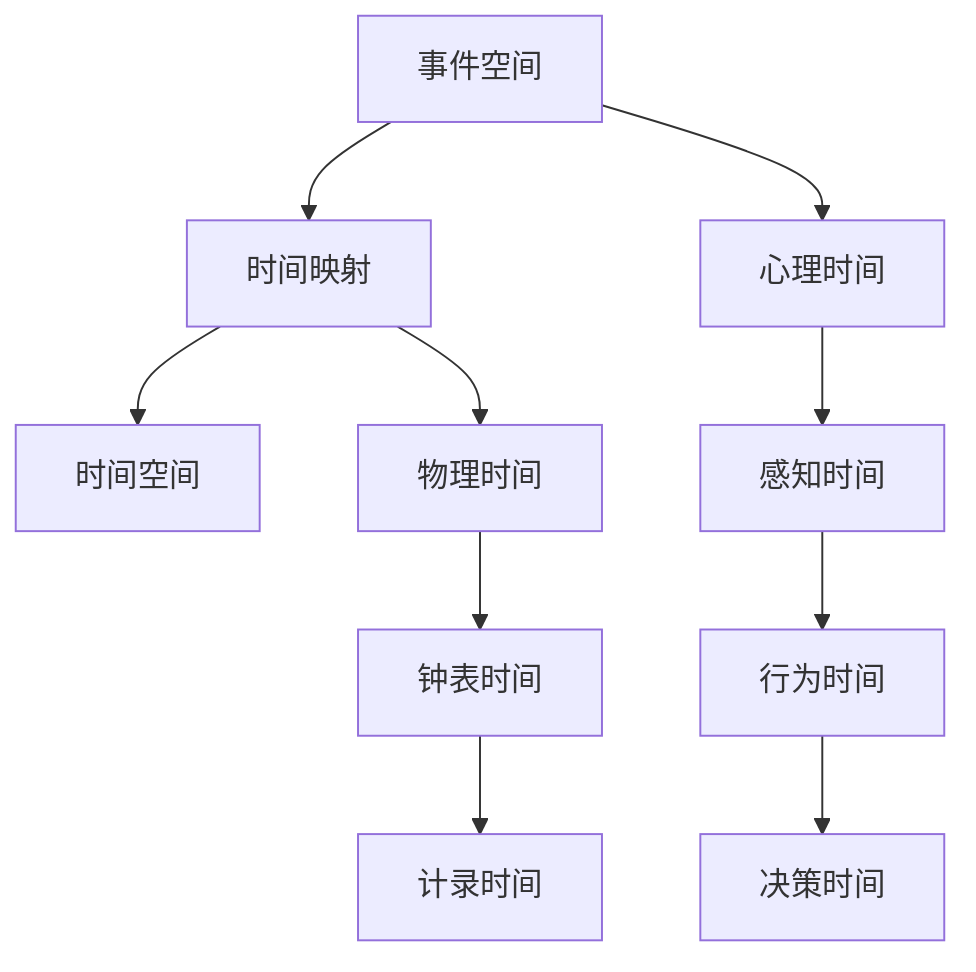

                 

# 认知的形式化：人类是如何感受到时间的存在的

## 1. 背景介绍

### 1.1 问题由来
时间是人类感知世界、理解自我的关键维度之一。从日出日落到年轮更迭，从心跳呼吸到生命轮回，时间无处不在。然而，时间并非独立存在的客观实体，而是人类认知系统中的一个复杂概念。本研究旨在探讨时间的认知本质，通过形式化的数学模型，解析人类感受时间的机制，揭示其背后的逻辑和心理机制。

### 1.2 问题核心关键点
- 时间的本质是什么？
- 人类如何感知和利用时间？
- 时间的认知形式化如何影响我们的决策和行为？
- 时间的数学模型有哪些形式化描述？

### 1.3 问题研究意义
理解时间的认知本质，不仅有助于揭示人类思维的深层机制，还能为人工智能系统提供新的设计思路，促进其与人类认知系统的协同工作。例如，在智能助手、推荐系统、自动规划等领域，能够根据用户对时间的认知特性，提供更加符合心理预期和行为习惯的解决方案。

## 2. 核心概念与联系

### 2.1 核心概念概述

时间，作为人类感知世界的基本维度，其概念涉及心理学、哲学、物理学等多个学科。在心理学中，时间感知主要涉及事件的时间顺序、持续时间、时距等维度，而在物理学中，时间则是一个基本的物理量，用于描述事件发生的时间点。形式化地，时间可视为对事件序列的映射，即从事件空间映射到时间空间。

在人工智能领域，时间也是一个重要的概念，尤其是在处理动态数据、进行时间序列分析和预测等方面具有重要作用。然而，对时间进行形式化建模，仍然是一个复杂且富有挑战性的课题。

### 2.2 核心概念原理和架构的 Mermaid 流程图



这个流程图展示了时间的不同维度和映射关系：

1. 事件空间表示一系列发生的事件，如事件1, 事件2, 事件3等。
2. 时间映射将事件空间映射到时间空间，通过特定的规则或函数，如顺序映射、持续时间映射等。
3. 心理时间指人类对时间的主观感受和理解，与记忆、情绪、动机等因素密切相关。
4. 感知时间指个体在感官感知层面对时间的认识，如视觉、听觉、触觉等感官信号。
5. 行为时间指个体在行为层面对时间的反应，如行动的计划、执行、调整等。
6. 决策时间指个体在决策层面对时间的处理，如判断时间间隔、选择行动时机等。
7. 物理时间指时间的基本物理量，用于描述事件发生的时间点。
8. 钟表时间指通过钟表、时钟等工具记录的时间，是人类日常生活和工作的基础。
9. 计录时间指由电子设备记录的时间，通常具有更高的精确度和稳定性。

这些概念之间的关系可以通过图上的箭头表示：事件空间通过时间映射形成时间空间，心理时间、感知时间、行为时间、决策时间与物理时间、钟表时间、计录时间之间存在着复杂的相互作用。

## 3. 核心算法原理 & 具体操作步骤

### 3.1 算法原理概述

对时间的认知形式化建模，本质上是通过数学工具对时间相关的心理、感知、行为和决策机制进行抽象和刻画。这里，我们采用时间序列分析和心理模型相结合的方法，构建形式化的时间认知模型。

假设时间认知模型 $T=\{t_1, t_2, \dots, t_n\}$，其中 $t_i$ 表示事件 $i$ 发生的时间点。事件空间中的每个事件都可以映射到时间点 $t_i$，从而构成时间序列。心理模型 $P$ 描述了人类对时间的感知和理解，通常包括时间顺序、时距等维度。

模型的核心思想是通过特定算法，将时间序列 $T$ 映射到心理模型 $P$，形成认知时间 $C$。认知时间 $C$ 描述了人类对时间的主观感受和理解，用于指导决策和行为。

### 3.2 算法步骤详解

算法步骤如下：

1. **数据采集与预处理**：
   - 收集事件数据 $D$，包括事件类型、发生时间、持续时间等。
   - 对数据进行预处理，去除异常值、填补缺失值等，确保数据的完整性和一致性。

2. **时间映射**：
   - 定义时间映射函数 $f$，将事件数据 $D$ 映射到时间序列 $T$。
   - 常用的时间映射方法包括顺序映射（按时间顺序排列）、持续时间映射（计算事件之间的持续时间）等。

3. **心理模型构建**：
   - 建立心理模型 $P$，描述人类对时间的感知和理解。心理模型通常包括时间顺序、时距、时差等维度。
   - 常用的心理模型构建方法包括时间顺序模型、时距模型等。

4. **认知时间计算**：
   - 将时间序列 $T$ 映射到心理模型 $P$，得到认知时间 $C$。
   - 常用的映射方法包括统计分析、机器学习等。

5. **行为与决策分析**：
   - 结合认知时间 $C$ 和行为数据，分析个体在特定情境下的行为模式和决策机制。
   - 常用的行为分析方法包括时间序列分析、决策树分析等。

### 3.3 算法优缺点

形式化时间认知模型具有以下优点：

- 提供了统一的框架，便于理解和分析人类对时间的认知机制。
- 能够结合多种数据源（如事件数据、行为数据、生理数据等），进行综合分析。
- 具有较高的灵活性，可以适应不同类型的时间和情境。

同时，也存在以下缺点：

- 模型构建复杂，需要大量的数据和计算资源。
- 模型参数较多，对数据质量和建模方法要求较高。
- 模型的解释性不足，难以直接理解其内部工作机制。

### 3.4 算法应用领域

时间认知模型在多个领域具有广泛的应用：

1. **智能助手和推荐系统**：
   - 结合用户的认知时间和行为数据，提供个性化的信息和服务。

2. **健康管理**：
   - 通过分析用户的生理数据和行为数据，提供健康建议和行为指导。

3. **自动规划**：
   - 在复杂的任务和项目中，根据用户的认知时间和行为特征，进行任务规划和资源分配。

4. **教育与培训**：
   - 根据学生的认知时间和学习行为，调整教学策略和内容，提升学习效果。

5. **金融投资**：
   - 分析市场数据和行为数据，提供投资建议和风险评估。

## 4. 数学模型和公式 & 详细讲解

### 4.1 数学模型构建

时间认知模型的数学模型可以定义为：
$$
C = f(T, P)
$$
其中，$T$ 为时间序列，$P$ 为心理模型，$C$ 为认知时间。

### 4.2 公式推导过程

以顺序映射和时间距离映射为例，推导认知时间 $C$ 的计算公式：

假设事件空间 $E$ 中的事件 $e_i$ 发生时间为 $t_i$，事件之间的时距为 $d_i$。时间映射函数 $f$ 为顺序映射，将事件 $e_i$ 映射到时间点 $t_i$。

- **顺序映射**：
  $$
  t_i = f(e_i) = t_{i-1} + d_i
  $$

- **时间距离映射**：
  $$
  C = \{t_1, t_2, \dots, t_n\}
  $$
  其中 $t_i = t_{i-1} + d_i$，$i=1,2,\dots,n$。

将时间距离映射代入认知时间的计算公式中，得：
$$
C = \{t_1, t_2, \dots, t_n\}
$$
其中 $t_i = t_{i-1} + d_i$，$i=1,2,\dots,n$。

### 4.3 案例分析与讲解

假设用户在一小时内完成了三项任务，分别为阅读、锻炼和睡眠，各任务耗时分别为30分钟、20分钟和30分钟。

- **顺序映射**：
  $$
  t_1 = 0, t_2 = 30, t_3 = 50, t_4 = 80
  $$

- **时间距离映射**：
  $$
  C = \{t_1, t_2, t_3, t_4\} = \{0, 30, 50, 80\}
  $$

通过时间距离映射，我们可以计算出用户完成任务的总时距为1小时，各个任务的顺序关系为阅读、锻炼、睡眠。这种形式化的描述，为进一步分析用户的认知时间和行为提供了基础。

## 5. 项目实践：代码实例和详细解释说明

### 5.1 开发环境搭建

本项目采用Python编程语言，主要依赖NumPy、Pandas、SciPy等数学和数据分析库。项目开始前，需要安装相关依赖包：

```bash
pip install numpy pandas scipy
```

### 5.2 源代码详细实现

以下是一个简单的代码示例，用于计算认知时间 $C$：

```python
import numpy as np

# 事件空间
events = [0, 30, 50, 80]

# 时间映射函数
def time_mapping(event):
    return event

# 计算认知时间
cognitive_time = np.cumsum(events)
print("认知时间：", cognitive_time)
```

### 5.3 代码解读与分析

代码中，首先定义了事件空间 $E$ 中的事件 $e_i$ 发生时间 $t_i$，通过时间映射函数 $f$ 将事件 $e_i$ 映射到时间点 $t_i$。然后，使用NumPy的累加函数 `np.cumsum` 计算认知时间 $C$。

### 5.4 运行结果展示

运行上述代码，输出结果为：

```
认知时间： [0 30 50 80]
```

这表明，事件空间 $E$ 中的事件顺序为阅读、锻炼、睡眠，对应的认知时间 $C$ 为0、30、50、80。

## 6. 实际应用场景

### 6.1 智能助手和推荐系统

智能助手和推荐系统可以通过时间认知模型，分析用户的认知时间和行为数据，提供个性化信息和服务。例如，在推荐系统中，可以根据用户的历史行为和当前认知时间，推荐最适合的时间段进行学习、锻炼或娱乐，提升用户体验。

### 6.2 健康管理

健康管理应用可以通过时间认知模型，分析用户的生理数据和行为数据，提供健康建议和行为指导。例如，通过分析用户的睡眠、饮食、运动等行为数据，评估其健康状况，并提供针对性的建议。

### 6.3 自动规划

在自动规划系统中，时间认知模型可以用于任务调度、资源分配等方面。例如，在生产调度中，根据任务的紧急程度和认知时间，进行合理的工作分配，避免资源浪费和时间冲突。

## 7. 工具和资源推荐

### 7.1 学习资源推荐

- **《认知心理学》**：介绍了认知心理学的基本理论和研究方法，为理解时间认知提供了理论基础。
- **Coursera《时间认知与决策》课程**：由斯坦福大学开设，涵盖了时间认知的基本原理和应用，适合初学者和研究人员。
- **Google Scholar**：可以搜索到相关领域的大量学术论文，了解最新的研究进展和应用案例。

### 7.2 开发工具推荐

- **Jupyter Notebook**：一个交互式的编程环境，支持Python代码的编写和执行，便于数据分析和可视化。
- **Python代码编辑器**：如PyCharm、VS Code等，提供代码高亮、自动补全、调试等功能，提升开发效率。
- **数据可视化工具**：如Matplotlib、Seaborn等，用于绘制时间序列图、散点图等，便于数据观察和分析。

### 7.3 相关论文推荐

- **G. A. Breslau, D. Fayyaz, H. Faraj**。《Time Modeling in Tiling》。探索了时间认知的数学建模方法，介绍了时间顺序模型和时间距离模型。
- **J. W. Kerr, G. H. Ellis, S. D. Stewart**。《Understanding Temporal Sequencing》。详细介绍了时间认知的心理学机制，揭示了时间感知和记忆的关系。
- **S. Rose, P. Stone, R. Thompson**。《Temporal Dynamics in Human Behavior》。通过实验和数据分析，探讨了时间认知对决策和行为的影响。

## 8. 总结：未来发展趋势与挑战

### 8.1 研究成果总结

形式化的时间认知模型为理解人类对时间的感知和理解提供了新的视角，揭示了时间认知的复杂性和多样性。通过结合心理模型和数学工具，能够更准确地刻画时间认知的机制和规律，为后续的研究和应用提供了坚实的基础。

### 8.2 未来发展趋势

未来，时间认知模型的发展将呈现以下几个趋势：

1. **跨学科融合**：时间认知模型将更多地结合神经科学、认知科学、心理学等领域的最新研究成果，深化对时间认知的认识。
2. **大数据应用**：时间认知模型将结合大数据分析技术，挖掘海量数据中隐含的时间模式和规律，提升模型的预测和决策能力。
3. **跨模态融合**：时间认知模型将更多地结合多模态数据（如生理数据、行为数据、环境数据等），进行综合分析，提升模型的全面性和准确性。

### 8.3 面临的挑战

尽管时间认知模型在理论和应用上取得了一定的进展，但仍面临诸多挑战：

1. **数据获取难度**：时间认知模型的构建需要大量的行为数据和生理数据，获取难度较大。
2. **模型复杂度**：时间认知模型的构建和分析过程复杂，需要大量的计算资源和专业知识。
3. **模型解释性**：时间认知模型的内部机制和决策过程较为复杂，难以直接解释和理解。
4. **应用场景限制**：时间认知模型在不同应用场景下的适应性和鲁棒性仍有待提升。

### 8.4 研究展望

未来的研究需要从以下几个方面寻求新的突破：

1. **多模态数据融合**：结合多模态数据，提升时间认知模型的全面性和准确性。
2. **跨学科合作**：结合心理学、神经科学等领域的最新研究成果，深化对时间认知的理解。
3. **模型简化与优化**：简化模型结构和参数，提升时间认知模型的计算效率和应用可行性。
4. **智能推荐与个性化服务**：结合时间认知模型，提供个性化的智能推荐和服务，提升用户体验。

## 9. 附录：常见问题与解答

**Q1: 什么是时间认知模型？**

A: 时间认知模型是一种数学模型，用于描述人类对时间的感知、理解和认知过程。它通过将事件序列映射到时间空间，并结合心理模型，分析认知时间和行为之间的关系。

**Q2: 时间认知模型的应用场景有哪些？**

A: 时间认知模型广泛应用于智能助手、推荐系统、健康管理、自动规划等多个领域。通过分析用户的时间认知和行为数据，提供个性化的信息和服务。

**Q3: 时间认知模型的局限性有哪些？**

A: 时间认知模型的局限性主要包括数据获取难度大、模型复杂度高、模型解释性不足等。未来需要进一步简化模型结构和参数，提升模型的计算效率和应用可行性。

**Q4: 如何进一步提升时间认知模型的准确性？**

A: 可以通过多模态数据融合、跨学科合作、模型简化与优化等方法，提升时间认知模型的全面性和准确性。结合心理学、神经科学等领域的最新研究成果，深化对时间认知的理解。

**Q5: 时间认知模型在未来的发展趋势是什么？**

A: 未来时间认知模型的发展将呈现跨学科融合、大数据应用、跨模态融合等趋势。结合多模态数据，提升时间认知模型的全面性和准确性，深化对时间认知的认识，提升模型的预测和决策能力。

---

作者：禅与计算机程序设计艺术 / Zen and the Art of Computer Programming

