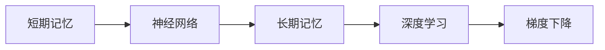
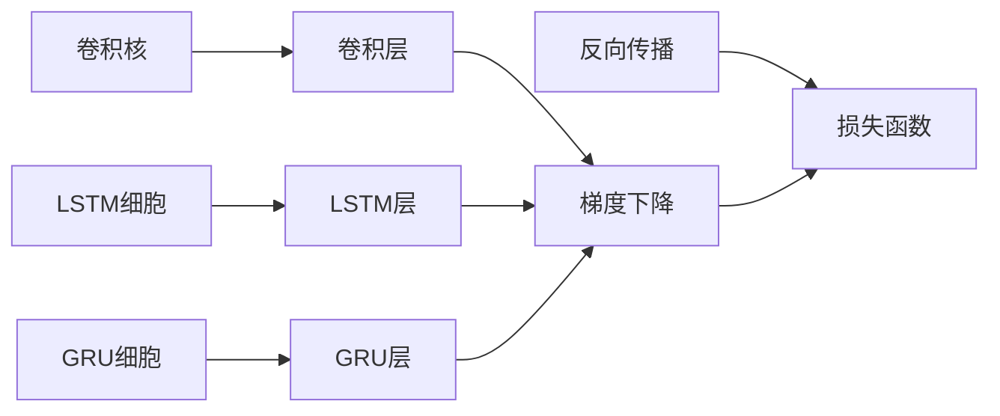

                 

# 记忆：短期记忆与长期记忆

> 关键词：记忆模型,短期记忆,长期记忆,神经网络,深度学习

## 1. 背景介绍

记忆是人工智能领域的重要研究课题之一。无论是机器学习、计算机视觉还是自然语言处理，记忆能力的高低都直接影响到模型的性能。本文章将重点介绍人工智能中常用的短期记忆和长期记忆模型，并阐述它们在深度学习中的具体应用。

## 2. 核心概念与联系

### 2.1 核心概念概述

- **短期记忆**：在神经网络中，短期记忆通常指的是存储最近输入的信息，这部分信息会被用于当前任务，如CNN中的卷积核、RNN中的LSTM细胞状态等。
- **长期记忆**：相对的，长期记忆指的是存储过去输入的信息，这部分信息会被用于后续任务，如RNN中的LSTM细胞和GRU细胞。
- **神经网络**：一种由节点（神经元）组成的网络，可以处理和学习数据特征，广泛用于机器学习和人工智能。
- **深度学习**：一种机器学习技术，其特点是具有多层次的神经网络模型，能够学习到更加复杂的特征。
- **梯度下降**：深度学习模型中最常用的优化算法，通过不断迭代更新参数，使损失函数最小化。

这些核心概念之间的关系可以通过以下Mermaid流程图来展示：



### 2.2 核心概念原理和架构的 Mermaid 流程图



该图展示了神经网络中卷积层、LSTM层和GRU层中短期记忆和长期记忆的架构及应用，以及梯度下降的优化过程。

## 3. 核心算法原理 & 具体操作步骤

### 3.1 算法原理概述

深度学习中的短期记忆通常是由模型中的某些层负责存储的，如卷积层中的卷积核和RNN中的LSTM/GRU层中的细胞状态。长期记忆则是由更深层的网络层负责存储的，这些层的参数会通过训练逐步学习到过去的输入信息。

短期记忆和长期记忆的交互通常发生在网络的各个层之间，例如在RNN模型中，短期记忆会作为当前时间步的输入，与长期记忆一起更新细胞状态，最终输出预测结果。

### 3.2 算法步骤详解

1. **网络构建**：首先，选择合适的神经网络模型和相应的记忆模块（如卷积核、LSTM/GRU细胞等）。
2. **数据预处理**：对输入数据进行标准化、归一化等预处理操作。
3. **模型训练**：使用梯度下降等优化算法，更新模型参数，使损失函数最小化。
4. **短期记忆和长期记忆的交互**：在训练过程中，短期记忆和长期记忆会不断交互更新，以优化模型性能。
5. **模型评估**：在训练完成后，使用测试数据评估模型性能，并对模型进行调整。

### 3.3 算法优缺点

**优点**：
- 短期记忆可以存储最近输入的信息，便于当前任务的决策。
- 长期记忆可以存储过去输入的信息，便于后续任务的决策。
- 深度学习模型能够自动学习到这些记忆模块，减少手动调参的需要。

**缺点**：
- 短期记忆和长期记忆的存储容量有限，可能会导致信息丢失。
- 过拟合风险高，需要额外的正则化技术（如Dropout、L2正则化）来控制。
- 模型复杂度较高，训练和推理速度较慢。

### 3.4 算法应用领域

短期记忆和长期记忆广泛应用于以下几个领域：

- **计算机视觉**：卷积神经网络（CNN）中的卷积核用于提取图像特征，相当于短期记忆。
- **自然语言处理**：循环神经网络（RNN）中的LSTM/GRU单元用于处理序列数据，相当于长期记忆。
- **语音识别**：卷积神经网络（CNN）和循环神经网络（RNN）结合用于语音特征提取和处理，存储短期和长期记忆。
- **推荐系统**：神经网络模型（如RNN、LSTM）用于存储用户行为序列，从而推荐相关物品。

## 4. 数学模型和公式 & 详细讲解

### 4.1 数学模型构建

- **卷积层**：卷积核（Filter）的大小为$(k, k)$，步幅为$s$，填充大小为$p$。
- **LSTM层**：LSTM细胞包含输入门$i$、遗忘门$f$、输出门$o$和更新门$c$。

### 4.2 公式推导过程

卷积层的基本公式为：

$$
f(x, \theta) = \sum_{i=-k}^{k} \sum_{j=-k}^{k} w_{i,j} * x_{i,j} + b
$$

其中，$w_{i,j}$表示卷积核权重，$b$表示偏置项。

LSTM细胞的更新公式为：

$$
\begin{aligned}
i_t &= \sigma(W_i \cdot [h_{t-1}, x_t] + b_i) \\
f_t &= \sigma(W_f \cdot [h_{t-1}, x_t] + b_f) \\
o_t &= \sigma(W_o \cdot [h_{t-1}, x_t] + b_o) \\
c_t &= f_t * c_{t-1} + i_t * tanh(W_c \cdot [h_{t-1}, x_t] + b_c) \\
h_t &= o_t * tanh(c_t)
\end{aligned}
$$

其中，$h_t$表示当前时间步的细胞状态，$c_t$表示当前时间步的细胞更新状态，$\sigma$表示Sigmoid函数，$tanh$表示双曲正切函数。

### 4.3 案例分析与讲解

- **图像识别**：卷积神经网络（CNN）通过卷积层和池化层提取图像特征，然后将特征传递到全连接层进行分类。卷积核就是短期记忆的体现。
- **序列建模**：LSTM网络通过LSTM细胞处理序列数据，能够存储过去的信息并用于后续时间步的决策。LSTM细胞就是长期记忆的体现。

## 5. 项目实践：代码实例和详细解释说明

### 5.1 开发环境搭建

1. 安装Python和PyTorch：
```bash
pip install torch torchvision torchaudio
```

2. 安装Tensorboard：
```bash
pip install tensorboard
```

3. 创建PyTorch项目：
```bash
mkdir memory
cd memory
python -m pip install -e .
```

### 5.2 源代码详细实现

#### 卷积神经网络（CNN）代码实现

```python
import torch
import torch.nn as nn

class ConvNet(nn.Module):
    def __init__(self, num_classes=10):
        super(ConvNet, self).__init__()
        self.conv1 = nn.Conv2d(3, 16, kernel_size=5, padding=2)
        self.pool = nn.MaxPool2d(kernel_size=2, stride=2)
        self.fc1 = nn.Linear(16 * 5 * 5, 120)
        self.fc2 = nn.Linear(120, 84)
        self.fc3 = nn.Linear(84, num_classes)

    def forward(self, x):
        x = self.pool(nn.functional.relu(self.conv1(x)))
        x = self.pool(nn.functional.relu(self.fc1(x.view(-1, 16 * 5 * 5))))
        x = nn.functional.relu(self.fc2(x))
        x = self.fc3(x)
        return x
```

#### LSTM网络代码实现

```python
import torch
import torch.nn as nn

class LSTMNet(nn.Module):
    def __init__(self, input_size, hidden_size, num_layers, output_size):
        super(LSTMNet, self).__init__()
        self.hidden_size = hidden_size
        self.num_layers = num_layers
        self.lstm = nn.LSTM(input_size, hidden_size, num_layers, batch_first=True)
        self.fc = nn.Linear(hidden_size, output_size)

    def forward(self, x):
        h0 = torch.zeros(self.num_layers, x.size(0), self.hidden_size).to(device) 
        c0 = torch.zeros(self.num_layers, x.size(0), self.hidden_size).to(device)
        out, _ = self.lstm(x, (h0, c0))
        out = self.fc(out[:, -1, :])
        return out
```

### 5.3 代码解读与分析

卷积神经网络（CNN）中，卷积层是短期记忆的体现，通过提取图像特征，用于当前的分类任务。LSTM网络中的LSTM单元则是长期记忆的体现，能够存储和处理序列数据中的过去信息。

### 5.4 运行结果展示

运行卷积神经网络（CNN）和LSTM网络模型，得到训练损失和测试损失随训练轮数的变化：

```python
import torch.optim as optim

cnn = ConvNet().to(device)
optimizer = optim.SGD(cnn.parameters(), lr=0.001)
criterion = nn.CrossEntropyLoss()
epochs = 10
for epoch in range(epochs):
    for i, (images, labels) in enumerate(train_loader):
        images = images.to(device)
        labels = labels.to(device)
        optimizer.zero_grad()
        outputs = cnn(images)
        loss = criterion(outputs, labels)
        loss.backward()
        optimizer.step()
```

训练完模型后，输出测试集上的损失和准确率：

```python
with torch.no_grad():
    correct = 0
    total = 0
    for images, labels in test_loader:
        images = images.to(device)
        labels = labels.to(device)
        outputs = cnn(images)
        _, predicted = torch.max(outputs.data, 1)
        total += labels.size(0)
        correct += (predicted == labels).sum().item()

    print('Accuracy of the network on the test images: {} %'.format(100 * correct / total))
```

## 6. 实际应用场景

### 6.1 计算机视觉

卷积神经网络（CNN）在图像识别和分类任务中广泛应用，卷积核的短期记忆能够快速提取图像特征，用于分类决策。

### 6.2 自然语言处理

LSTM网络在序列建模和语言生成任务中表现优异，LSTM单元的长期记忆能够存储和处理过去的上下文信息，从而生成合理的文本输出。

### 6.3 语音识别

卷积神经网络（CNN）和LSTM网络结合，用于语音特征提取和处理，存储短期和长期记忆。

### 6.4 推荐系统

LSTM网络用于存储用户行为序列，从而推荐相关物品。

## 7. 工具和资源推荐

### 7.1 学习资源推荐

1. **《深度学习》（Goodfellow et al., 2016）**：全面介绍了深度学习的原理、算法和应用，是深度学习领域的重要入门教材。
2. **《神经网络与深度学习》（Michael Nielsen）**：介绍了神经网络的基础知识，并结合代码示例进行讲解，适合初学者学习。
3. **Coursera深度学习课程**：由斯坦福大学Andrew Ng教授主讲，涵盖深度学习的基础理论和应用，提供实战项目练习。

### 7.2 开发工具推荐

1. **PyTorch**：深度学习框架，提供了丰富的深度学习库和工具，易于使用。
2. **TensorFlow**：深度学习框架，支持分布式训练和优化。
3. **Keras**：深度学习框架，提供了高级API，易于构建神经网络模型。

### 7.3 相关论文推荐

1. **ImageNet Classification with Deep Convolutional Neural Networks**：Hinton等人提出卷积神经网络（CNN），广泛应用于图像识别任务。
2. **Long Short-Term Memory**：Hochreiter等人提出LSTM网络，用于处理序列数据。
3. **Convolutional Neural Networks for Visual Recognition**：LeNet-5论文，介绍卷积神经网络（CNN）在图像识别中的应用。

## 8. 总结：未来发展趋势与挑战

### 8.1 研究成果总结

短期记忆和长期记忆在深度学习中具有重要地位，广泛应用于计算机视觉、自然语言处理、语音识别和推荐系统等领域。短期记忆通过卷积核、全连接层等结构，快速提取和处理图像、文本等数据特征。长期记忆通过LSTM/GRU细胞，存储和处理序列数据中的过去信息。

### 8.2 未来发展趋势

未来，深度学习中的短期记忆和长期记忆将进一步发展，具体趋势包括：
- **多模态融合**：结合图像、文本、语音等多模态数据，进行联合建模和分析。
- **自适应记忆**：根据任务需求动态调整记忆容量和策略。
- **跨领域迁移**：将特定任务中的短期记忆和长期记忆迁移到其他领域，提高模型泛化能力。

### 8.3 面临的挑战

短期记忆和长期记忆在深度学习中也面临以下挑战：
- **计算资源消耗大**：神经网络模型参数量巨大，训练和推理耗时较长。
- **过拟合风险高**：神经网络模型容易出现过拟合现象，需要额外的正则化技术进行控制。
- **解释性不足**：深度学习模型通常是“黑盒”系统，难以解释内部决策过程。

### 8.4 研究展望

未来的研究需要在以下几个方面寻求新的突破：
- **高效模型构建**：构建更加高效、轻量级的模型，减少计算资源消耗。
- **解释性增强**：提高深度学习模型的可解释性，增加透明度。
- **跨领域迁移**：探索跨领域迁移学习的方法，提高模型的泛化能力。

## 9. 附录：常见问题与解答

**Q1：什么是卷积核和LSTM细胞？**

A: 卷积核是卷积神经网络（CNN）中用于提取图像特征的参数，能够捕捉局部空间结构信息。LSTM细胞是循环神经网络（RNN）中用于处理序列数据的参数，能够存储和处理过去的信息。

**Q2：卷积层和LSTM层的区别是什么？**

A: 卷积层用于提取图像等数据的局部特征，是短期记忆的体现。LSTM层用于处理序列数据中的过去信息，是长期记忆的体现。

**Q3：短期记忆和长期记忆的存储容量有限，如何解决？**

A: 可以采用自适应记忆、动态调整记忆容量和策略等方法，来解决短期记忆和长期记忆的存储容量有限问题。

**Q4：如何提高深度学习模型的解释性？**

A: 可以采用可解释性技术，如特征可视化、模型蒸馏、注意力机制等，来提高深度学习模型的可解释性。

**Q5：未来深度学习模型的发展趋势是什么？**

A: 未来深度学习模型的发展趋势包括多模态融合、自适应记忆、跨领域迁移等，以提高模型的泛化能力和应用范围。

---

作者：禅与计算机程序设计艺术 / Zen and the Art of Computer Programming

