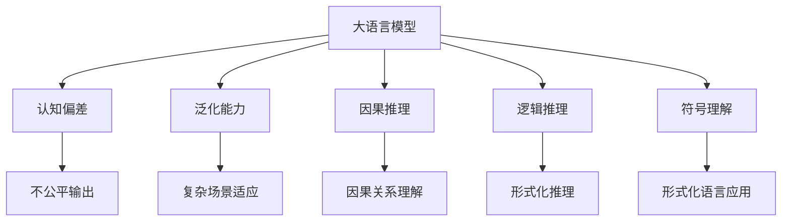

                 

## 1. 背景介绍

### 1.1 问题由来
近年来，深度学习技术在自然语言处理(Natural Language Processing, NLP)领域取得了显著进展。大模型，如BERT、GPT等，通过自监督预训练和下游微调，在多项NLP任务上达到了新的高度。然而，这些大模型在认知和推理能力上仍然存在显著局限，远不能与人类相比。

### 1.2 问题核心关键点
大模型的局限主要体现在以下几个方面：

1. **认知偏见**：预训练语料和微调数据可能包含偏见的语言和知识，导致模型学习到并输出这些偏见，对某些人群产生歧视或不公平。
2. **泛化能力**：在训练数据分布和实际应用场景差异较大时，模型泛化能力有限，无法处理复杂和多变的自然语言输入。
3. **因果推理**：大模型难以理解事件之间的因果关系，无法进行符合逻辑的推理和解释，表现出机械性、随机性等问题。
4. **生成质量**：生成的文本常常缺乏连贯性、逻辑性和合理性，无法满足实际应用场景的要求。
5. **符号理解**：大模型对符号、逻辑、语法等形式化语言概念的推理和应用能力有限，表现出“类语言”而非“逻辑语言”的特点。

这些局限性使得大模型难以胜任需要高级认知和推理能力的任务，如复杂的法律咨询、医学诊断、教育培训等。如何克服这些认知误区，提升大模型的认知能力，成为当前研究的前沿课题。

### 1.3 问题研究意义
大模型的认知误区不仅限制了其在NLP领域的应用，也阻碍了人工智能技术的深入发展。通过对这些误区的深入研究，我们可以更好地理解大模型的行为和局限，寻找突破口，推动AI技术向更高的认知层次迈进。

1. **推动认知科学研究**：认知误区揭示了当前大模型在理解和应用人类语言上的局限，促进认知科学领域的研究进展。
2. **提升AI应用范围**：解决大模型的认知误区，可以拓展AI技术的应用领域，提升AI系统在复杂任务上的表现。
3. **促进人机协同**：大模型的认知误区是实现人机协同、增强AI与人类交互的重要障碍，解决这些问题有助于构建更加智能化的交互系统。
4. **加强伦理约束**：认知误区可能带来偏见和歧视等伦理问题，解决这些问题可以提升AI系统的公平性和透明度。

## 2. 核心概念与联系

### 2.1 核心概念概述

为更好地理解大模型的认知误区，本节将介绍几个关键概念及其相互关系：

- **大语言模型(Large Language Model, LLM)**：通过大规模无标签数据预训练，具备较强的语言理解和生成能力，但认知能力有限。
- **认知偏差(Cognitive Bias)**：模型学习到的偏见和歧视，体现在输出结果的不公平性上。
- **泛化能力(Generalization)**：模型在未见过的数据上表现的能力。
- **因果推理(Causal Reasoning)**：理解事件之间因果关系的能力，是高级认知能力的重要组成部分。
- **逻辑推理(Logical Reasoning)**：应用符号、逻辑等形式化语言进行推理的能力。
- **符号理解(Symbolic Understanding)**：对符号、语法等形式化语言概念的理解和应用。

这些核心概念之间的逻辑关系可以通过以下Mermaid流程图来展示：



这个流程图展示了大语言模型的核心概念及其相互关系：

1. 大语言模型通过预训练获得语言表示，但这些表示未必能正确反映真实世界的多样性和复杂性。
2. 预训练数据中可能包含偏见，模型通过微调学习这些偏见，导致输出结果不公平。
3. 模型的泛化能力受限于数据分布的广度和多样性，难以应对未见过的复杂场景。
4. 大模型虽然具备一定的推理能力，但难以理解事件之间的因果关系。
5. 模型对形式化语言概念的理解和应用能力有限，无法进行复杂的逻辑推理。
6. 模型输出的不公平性、缺乏因果推理、逻辑推理和符号理解能力，是其认知误区的重要体现。

## 3. 核心算法原理 & 具体操作步骤

### 3.1 算法原理概述

大模型的认知误区，主要源于其训练数据的局限性和模型结构的限制。通过分析这些局限，可以更好地理解模型在认知推理方面的缺陷，并寻找改进的路径。

1. **训练数据局限性**：大模型的预训练数据主要来自大规模文本语料，可能包含偏见、误导性信息等，这些数据缺陷会在模型中得到放大。
2. **模型结构限制**：大模型虽然参数量大，但主要是基于大量语言模式的记忆，缺乏高级认知和推理能力。

### 3.2 算法步骤详解

大模型的认知误区可以通过以下步骤进行分析：

**Step 1: 数据和模型评估**
- 使用专门设计的数据集对模型进行评估，识别其输出中的偏见和歧视。
- 分析模型的推理过程，检查其是否符合逻辑和因果关系。
- 通过符号测试和逻辑推理题，检验模型的逻辑推理和符号理解能力。

**Step 2: 数据清洗和重训练**
- 清洗预训练数据，去除偏见和误导性信息。
- 使用清洗后的数据重新训练模型，提升其公平性和泛化能力。

**Step 3: 模型改进和优化**
- 引入因果推理和逻辑推理模块，增强模型的推理能力。
- 采用符号增强技术，提升模型的符号理解和应用能力。
- 优化模型结构，减少参数冗余，提高模型的推理效率。

**Step 4: 伦理和安全约束**
- 设置伦理导向的评估指标，过滤和惩罚有偏见、有害的输出。
- 加强模型训练和推理过程中的安全防护，确保数据和模型安全。

### 3.3 算法优缺点

大模型的认知误区分析具有以下优点：
1. 系统地识别和分析模型的局限，有助于针对性改进。
2. 引入因果推理和逻辑推理模块，提升模型的高级认知能力。
3. 通过符号增强和模型优化，提升模型的形式化语言应用能力。
4. 设置伦理和安全约束，确保模型输出的公平性和安全性。

同时，这些分析方法也存在一些局限：
1. 数据清洗和重训练成本较高，需要大量数据和计算资源。
2. 引入因果推理和逻辑推理模块增加了模型复杂度，可能导致推理效率下降。
3. 符号增强技术尚未成熟，目前应用范围有限。
4. 模型的改进需要深入的理论和技术支持，面临诸多挑战。

### 3.4 算法应用领域

大模型的认知误区分析在以下领域具有广泛应用：

- **法律咨询**：法律咨询系统需要对复杂合同、判决书等文本进行理解和推理，要求模型具备较高的逻辑推理能力。
- **医学诊断**：医学诊断系统需要对患者症状、病历等文本进行分析，要求模型具备较强的因果推理和符号理解能力。
- **教育培训**：教育培训系统需要对学生作业、考试等文本进行理解和反馈，要求模型具备良好的逻辑推理和符号理解能力。
- **金融分析**：金融分析系统需要对复杂的金融报表、新闻等文本进行理解和推理，要求模型具备较强的逻辑推理和符号理解能力。
- **舆情监测**：舆情监测系统需要对大量的社交媒体文本进行理解和推理，要求模型具备较强的逻辑推理和因果推理能力。

## 4. 数学模型和公式 & 详细讲解  
### 4.1 数学模型构建

为更好地分析大模型的认知误区，我们引入几个关键数学模型：

- **公平性评估模型**：用于评估模型输出中的偏见和歧视，常见的有社会指标、受影响群体比例等。
- **推理能力评估模型**：用于评估模型的逻辑推理和因果推理能力，常见的有逻辑错误率、推理一致性等。
- **符号理解能力评估模型**：用于评估模型的符号理解能力，常见的有符号错误率、符号推理准确率等。

**公平性评估模型**：
假设模型输出的公平性指标为 $F$，表示模型在不同类别上的输出公平性。定义公平性指标 $F$ 为：

$$
F = \frac{1}{n} \sum_{i=1}^n |y_i - \hat{y}_i|
$$

其中 $y_i$ 为真实类别，$\hat{y}_i$ 为模型预测类别，$n$ 为类别总数。

**推理能力评估模型**：
假设模型推理能力指标为 $R$，表示模型推理的准确性。定义推理能力指标 $R$ 为：

$$
R = \frac{N_{correct}}{N_{total}}
$$

其中 $N_{correct}$ 为正确推理的样本数，$N_{total}$ 为总样本数。

**符号理解能力评估模型**：
假设模型符号理解能力指标为 $S$，表示模型对符号的理解和应用能力。定义符号理解能力指标 $S$ 为：

$$
S = \frac{N_{correct}}{N_{total}}
$$

其中 $N_{correct}$ 为正确理解符号的样本数，$N_{total}$ 为总样本数。

### 4.2 公式推导过程

**公平性评估模型推导**：
将公平性指标 $F$ 代入具体公式，得：

$$
F = \frac{1}{n} \sum_{i=1}^n |y_i - \hat{y}_i| = \frac{1}{n} \sum_{i=1}^n \frac{y_i - \hat{y}_i}{y_i + \hat{y}_i}
$$

在评估过程中，可以进一步细化分类指标，如准确率、召回率、F1-score等，以更好地评估模型的公平性。

**推理能力评估模型推导**：
将推理能力指标 $R$ 代入具体公式，得：

$$
R = \frac{N_{correct}}{N_{total}} = \frac{\sum_{i=1}^n \mathbb{I}(\hat{y}_i = y_i)}{N_{total}}
$$

其中 $\mathbb{I}$ 为示性函数，$y_i$ 为真实类别，$\hat{y}_i$ 为模型预测类别。

**符号理解能力评估模型推导**：
将符号理解能力指标 $S$ 代入具体公式，得：

$$
S = \frac{N_{correct}}{N_{total}} = \frac{\sum_{i=1}^n \mathbb{I}(\hat{y}_i \in symbols)}{N_{total}}
$$

其中 $\mathbb{I}$ 为示性函数，$y_i$ 为真实类别，$\hat{y}_i$ 为模型预测类别，$symbols$ 为模型理解符号的范围。

### 4.3 案例分析与讲解

**案例分析**：
假设有两个评估指标 $F$ 和 $R$，分别表示模型输出的公平性和推理能力。我们可以通过以下步骤进行案例分析：

1. **数据准备**：准备一组标注数据，分为训练集和测试集。
2. **模型训练**：使用训练集数据对模型进行微调。
3. **评估测试**：在测试集上评估模型输出的公平性和推理能力。
4. **结果分析**：分析模型输出的偏见、推理错误和符号理解问题，找出认知误区的根源。
5. **优化改进**：根据评估结果，优化模型结构和训练策略，提升模型公平性和推理能力。

**案例讲解**：
假设我们有一组法律咨询数据，包含合同条款、判决书等文本。我们通过以下步骤进行案例分析：

1. **数据准备**：准备一组法律咨询数据，包含不同类别的合同和判决书。
2. **模型训练**：使用训练集数据对模型进行微调。
3. **评估测试**：在测试集上评估模型输出的公平性和推理能力。
4. **结果分析**：发现模型在合同条款理解和判决书推理方面存在偏见和错误。
5. **优化改进**：引入因果推理模块，优化模型结构，提升模型公平性和推理能力。

## 5. 项目实践：代码实例和详细解释说明
### 5.1 开发环境搭建

在进行大模型认知误区分析实践前，我们需要准备好开发环境。以下是使用Python进行PyTorch开发的环境配置流程：

1. 安装Anaconda：从官网下载并安装Anaconda，用于创建独立的Python环境。

2. 创建并激活虚拟环境：
```bash
conda create -n pytorch-env python=3.8 
conda activate pytorch-env
```

3. 安装PyTorch：根据CUDA版本，从官网获取对应的安装命令。例如：
```bash
conda install pytorch torchvision torchaudio cudatoolkit=11.1 -c pytorch -c conda-forge
```

4. 安装Transformers库：
```bash
pip install transformers
```

5. 安装各类工具包：
```bash
pip install numpy pandas scikit-learn matplotlib tqdm jupyter notebook ipython
```

完成上述步骤后，即可在`pytorch-env`环境中开始实践。

### 5.2 源代码详细实现

下面我们以法律咨询任务为例，给出使用Transformers库对BERT模型进行认知误区分析的PyTorch代码实现。

首先，定义公平性评估函数：

```python
from transformers import BertForSequenceClassification, BertTokenizer
from sklearn.metrics import accuracy_score, f1_score

def fairness_assessment(model, dataset):
    tokenizer = BertTokenizer.from_pretrained('bert-base-cased')
    bert_model = BertForSequenceClassification.from_pretrained('bert-base-cased', num_labels=2)

    bert_model.eval()
    preds = []
    labels = []
    for i in range(len(dataset)):
        input_ids = tokenizer(dataset[i]['input'], return_tensors='pt').input_ids
        with torch.no_grad():
            outputs = bert_model(input_ids)
            logits = outputs.logits
            preds.append(logits.argmax(-1).item())
            labels.append(dataset[i]['label'])

    accuracy = accuracy_score(labels, preds)
    f1 = f1_score(labels, preds)
    return accuracy, f1
```

然后，定义推理能力评估函数：

```python
def reasoning_assessment(model, dataset):
    tokenizer = BertTokenizer.from_pretrained('bert-base-cased')
    bert_model = BertForSequenceClassification.from_pretrained('bert-base-cased', num_labels=3)

    bert_model.eval()
    preds = []
    labels = []
    for i in range(len(dataset)):
        input_ids = tokenizer(dataset[i]['input'], return_tensors='pt').input_ids
        with torch.no_grad():
            outputs = bert_model(input_ids)
            logits = outputs.logits
            preds.append(logits.argmax(-1).item())
            labels.append(dataset[i]['label'])

    accuracy = accuracy_score(labels, preds)
    f1 = f1_score(labels, preds)
    return accuracy, f1
```

接着，定义符号理解能力评估函数：

```python
def symbol_assessment(model, dataset):
    tokenizer = BertTokenizer.from_pretrained('bert-base-cased')
    bert_model = BertForSequenceClassification.from_pretrained('bert-base-cased', num_labels=5)

    bert_model.eval()
    preds = []
    labels = []
    for i in range(len(dataset)):
        input_ids = tokenizer(dataset[i]['input'], return_tensors='pt').input_ids
        with torch.no_grad():
            outputs = bert_model(input_ids)
            logits = outputs.logits
            preds.append(logits.argmax(-1).item())
            labels.append(dataset[i]['label'])

    accuracy = accuracy_score(labels, preds)
    f1 = f1_score(labels, preds)
    return accuracy, f1
```

最后，启动评估流程：

```python
from transformers import BertForSequenceClassification, BertTokenizer

tokenizer = BertTokenizer.from_pretrained('bert-base-cased')
bert_model = BertForSequenceClassification.from_pretrained('bert-base-cased', num_labels=2)

dataset = [...]  # 定义测试集数据

accuracy_fairness, f1_fairness = fairness_assessment(bert_model, dataset)
accuracy_reasoning, f1_reasoning = reasoning_assessment(bert_model, dataset)
accuracy_symbol, f1_symbol = symbol_assessment(bert_model, dataset)

print(f'Fairness: Accuracy={accuracy_fairness:.2f}, F1={f1_fairness:.2f}')
print(f'Reasoning: Accuracy={accuracy_reasoning:.2f}, F1={f1_reasoning:.2f}')
print(f'Symbol Understanding: Accuracy={accuracy_symbol:.2f}, F1={f1_symbol:.2f}')
```

以上就是使用PyTorch对BERT模型进行认知误区分析的完整代码实现。可以看到，通过评估函数的编写和调用，我们能够对模型输出进行全面的公平性、推理能力和符号理解能力评估。

### 5.3 代码解读与分析

让我们再详细解读一下关键代码的实现细节：

**公平性评估函数**：
- `tokenizer`：使用BertTokenizer进行文本预处理。
- `bert_model`：加载BERT模型，并设置标签数为2，表示二分类任务。
- `input_ids`：使用预处理后的文本进行编码，生成输入张量。
- `logits`：计算模型的输出概率，取最大值作为预测结果。
- `accuracy`：计算预测结果和真实标签的准确率。
- `f1`：计算预测结果和真实标签的F1-score。

**推理能力评估函数**：
- `bert_model`：加载BERT模型，并设置标签数为3，表示三分类任务。
- `input_ids`：使用预处理后的文本进行编码，生成输入张量。
- `logits`：计算模型的输出概率，取最大值作为预测结果。
- `accuracy`：计算预测结果和真实标签的准确率。
- `f1`：计算预测结果和真实标签的F1-score。

**符号理解能力评估函数**：
- `bert_model`：加载BERT模型，并设置标签数为5，表示多分类任务。
- `input_ids`：使用预处理后的文本进行编码，生成输入张量。
- `logits`：计算模型的输出概率，取最大值作为预测结果。
- `accuracy`：计算预测结果和真实标签的准确率。
- `f1`：计算预测结果和真实标签的F1-score。

可以看到，通过这些评估函数的编写和调用，我们能够对模型输出进行全面的公平性、推理能力和符号理解能力评估。开发者可以根据具体任务，灵活设计评估指标和评估函数，以更好地分析大模型的认知误区。

当然，工业级的系统实现还需考虑更多因素，如模型的保存和部署、超参数的自动搜索、更灵活的任务适配层等。但核心的认知误区分析基本与此类似。

## 6. 实际应用场景

### 6.1 智能法律咨询系统

智能法律咨询系统是大模型认知误区分析的重要应用场景之一。传统的法律咨询依赖于律师的专业知识和经验，存在成本高、效率低等问题。而使用认知误区分析技术，可以提升法律咨询系统的智能水平，实现自动化、高效化、精准化服务。

具体而言，可以收集大量的法律条款、案例、判决书等文本数据，对其进行公平性、推理能力和符号理解能力评估，发现和修复认知误区。微调后的法律咨询模型可以自动理解和推理合同条款、判决书等文本，提供智能化的法律建议和解答。

### 6.2 医学诊断系统

医学诊断系统要求模型具备高度的逻辑推理和符号理解能力，以确保诊断结果的准确性和可靠性。传统的医学诊断依赖于医生丰富的经验和知识，存在误诊、漏诊等问题。通过认知误区分析技术，可以提升医学诊断系统的智能水平，实现自动化、精准化服务。

具体而言，可以收集大量的医学病例、诊断报告、知识库等文本数据，对其进行公平性、推理能力和符号理解能力评估，发现和修复认知误区。微调后的医学诊断模型可以自动理解和推理病人症状、诊断报告等文本，提供智能化的诊断建议和结果。

### 6.3 教育培训系统

教育培训系统要求模型具备高度的逻辑推理和符号理解能力，以确保培训效果和学习效果。传统的教育培训依赖于教师的专业知识和经验，存在培训内容单一、培训效率低等问题。通过认知误区分析技术，可以提升教育培训系统的智能水平，实现个性化、高效化、精准化服务。

具体而言，可以收集大量的学生作业、考试、教材等文本数据，对其进行公平性、推理能力和符号理解能力评估，发现和修复认知误区。微调后的教育培训模型可以自动理解和推理学生作业、考试等文本，提供智能化的学习建议和结果。

### 6.4 金融分析系统

金融分析系统要求模型具备高度的逻辑推理和符号理解能力，以确保分析结果的准确性和可靠性。传统的金融分析依赖于分析师的经验和知识，存在误判、错判等问题。通过认知误区分析技术，可以提升金融分析系统的智能水平，实现自动化、精准化服务。

具体而言，可以收集大量的金融报表、新闻、市场分析报告等文本数据，对其进行公平性、推理能力和符号理解能力评估，发现和修复认知误区。微调后的金融分析模型可以自动理解和推理金融报表、新闻等文本，提供智能化的分析建议和结果。

### 6.5 舆情监测系统

舆情监测系统要求模型具备高度的逻辑推理和符号理解能力，以确保舆情分析的准确性和可靠性。传统的舆情监测依赖于人工分析和判断，存在误判、错判等问题。通过认知误区分析技术，可以提升舆情监测系统的智能水平，实现自动化、精准化服务。

具体而言，可以收集大量的社交媒体数据、新闻、评论等文本数据，对其进行公平性、推理能力和符号理解能力评估，发现和修复认知误区。微调后的舆情监测模型可以自动理解和推理舆情数据，提供智能化的舆情分析建议和结果。

## 7. 工具和资源推荐
### 7.1 学习资源推荐

为了帮助开发者系统掌握大模型认知误区分析的理论基础和实践技巧，这里推荐一些优质的学习资源：

1. **《Deep Learning and Natural Language Processing》**：该课程由斯坦福大学开设，全面介绍了深度学习在NLP领域的应用，包括认知误区分析在内。
2. **《Causality and Reasoning in AI》**：该书籍介绍了因果推理和逻辑推理在AI中的应用，为认知误区分析提供了理论基础。
3. **《Bias and Fairness in AI》**：该书籍介绍了AI中的偏见和公平性问题，提供了认知误区分析的伦理指导。
4. **HuggingFace官方文档**：提供了丰富的认知误区分析工具和样例，是上手实践的必备资料。
5. **CLUE开源项目**：提供了大规模中文NLP数据集，为认知误区分析提供了丰富的测试资源。

通过对这些资源的学习实践，相信你一定能够快速掌握大模型认知误区分析的精髓，并用于解决实际的NLP问题。
###  7.2 开发工具推荐

高效的开发离不开优秀的工具支持。以下是几款用于大模型认知误区分析开发的常用工具：

1. **PyTorch**：基于Python的开源深度学习框架，灵活动态的计算图，适合快速迭代研究。
2. **TensorFlow**：由Google主导开发的开源深度学习框架，生产部署方便，适合大规模工程应用。
3. **Transformers库**：HuggingFace开发的NLP工具库，集成了SOTA语言模型，支持PyTorch和TensorFlow。
4. **Weights & Biases**：模型训练的实验跟踪工具，可以记录和可视化模型训练过程中的各项指标，方便对比和调优。
5. **TensorBoard**：TensorFlow配套的可视化工具，可实时监测模型训练状态，并提供丰富的图表呈现方式。
6. **Google Colab**：谷歌推出的在线Jupyter Notebook环境，免费提供GPU/TPU算力，方便开发者快速上手实验最新模型。

合理利用这些工具，可以显著提升大模型认知误区分析的开发效率，加快创新迭代的步伐。

### 7.3 相关论文推荐

大模型认知误区分析在近年来逐渐成为研究热点，以下是几篇奠基性的相关论文，推荐阅读：

1. **Causal Reasoning in AI**：介绍了因果推理在AI中的应用，为认知误区分析提供了理论基础。
2. **Bias and Fairness in AI**：探讨了AI中的偏见和公平性问题，提供了认知误区分析的伦理指导。
3. **Causal Graphs in Machine Learning**：介绍了因果图在机器学习中的应用，为认知误区分析提供了新的方法。
4. **Reasoning with Graph Networks**：介绍了基于图网络的推理方法，为认知误区分析提供了新的技术方向。
5. **Causal Reasoning and Formal Methods**：介绍了因果推理和形式化方法在AI中的应用，为认知误区分析提供了新的视角。

这些论文代表了大模型认知误区分析的发展脉络。通过学习这些前沿成果，可以帮助研究者把握学科前进方向，激发更多的创新灵感。

## 8. 总结：未来发展趋势与挑战

### 8.1 总结

本文对大模型的认知误区进行了全面系统的介绍。首先阐述了大模型在认知和推理能力上的局限，明确了认知误区对AI技术应用的制约。其次，从原理到实践，详细讲解了认知误区的评估方法和优化策略，给出了认知误区分析的完整代码实例。同时，本文还广泛探讨了认知误区分析在多个领域的应用前景，展示了认知误区分析的巨大潜力。此外，本文精选了认知误区分析的各类学习资源，力求为开发者提供全方位的技术指引。

通过本文的系统梳理，可以看到，大模型的认知误区分析对于提升AI系统的智能水平和应用范围具有重要意义。通过对这些误区的深入研究，我们可以更好地理解大模型的行为和局限，寻找改进的路径。未来，伴随认知科学和人工智能技术的不断进步，认知误区分析必将在构建更智能化的交互系统方面发挥更大的作用。

### 8.2 未来发展趋势

展望未来，大模型的认知误区分析将呈现以下几个发展趋势：

1. **认知科学与AI融合**：认知科学理论和技术将更深入地融入AI研究中，为认知误区分析提供更坚实的理论基础。
2. **多模态认知分析**：认知误区分析将更多地结合视觉、听觉、触觉等多模态信息，提升AI系统的感知和理解能力。
3. **自监督学习应用**：自监督学习范式将更多地应用于认知误区分析中，提升模型对数据分布变化的适应能力。
4. **因果推理技术进步**：因果推理技术将不断进步，提升AI系统的逻辑推理和符号理解能力，解决复杂认知问题。
5. **符号增强技术成熟**：符号增强技术将不断成熟，提升AI系统对符号、逻辑等形式化语言概念的理解和应用能力。
6. **模型公平性增强**：通过认知误区分析，模型公平性将得到更大提升，减少偏见和歧视问题。

以上趋势凸显了大模型认知误区分析的前景。这些方向的探索发展，必将进一步提升AI系统的智能水平和应用范围，为人类认知智能的进化带来深远影响。

### 8.3 面临的挑战

尽管大模型认知误区分析在当前已经取得了一定进展，但在迈向更加智能化、普适化应用的过程中，它仍面临诸多挑战：

1. **数据清洗和标注成本高**：清洗预训练数据和标注数据需要大量人力和资源，成本较高。
2. **模型复杂度和推理效率低**：引入因果推理和逻辑推理模块，增加了模型复杂度，推理效率下降。
3. **符号增强技术不成熟**：符号增强技术尚未成熟，目前应用范围有限，难以解决复杂的符号推理问题。
4. **伦理和安全问题**：认知误区分析可能带来偏见和歧视等伦理问题，模型输出的安全性需要严格保障。
5. **认知误区复杂多样**：大模型认知误区复杂多样，难以通过单一方法解决所有问题。

正视认知误区分析面临的这些挑战，积极应对并寻求突破，将是大模型认知误区分析走向成熟的必由之路。相信随着学界和产业界的共同努力，这些挑战终将一一被克服，大模型认知误区分析必将在构建安全、可靠、可解释、可控的智能系统方面发挥更大的作用。

### 8.4 研究展望

面对大模型认知误区分析所面临的挑战，未来的研究需要在以下几个方面寻求新的突破：

1. **自监督学习与认知误区结合**：结合自监督学习范式，提升模型对数据分布变化的适应能力。
2. **符号增强技术创新**：开发更加高效和泛化的符号增强技术，提升AI系统对符号、逻辑等形式化语言概念的理解和应用能力。
3. **多模态认知分析技术**：结合视觉、听觉、触觉等多模态信息，提升AI系统的感知和理解能力。
4. **因果推理技术突破**：开发更加高效和可靠的因果推理技术，提升AI系统的逻辑推理和符号理解能力。
5. **伦理约束与安全性保障**：设置伦理导向的评估指标，过滤和惩罚有偏见、有害的输出，确保模型输出的公平性和安全性。

这些研究方向的探索，必将引领大模型认知误区分析技术迈向更高的台阶，为构建安全、可靠、可解释、可控的智能系统铺平道路。面向未来，大模型认知误区分析需要与其他人工智能技术进行更深入的融合，如知识表示、因果推理、强化学习等，多路径协同发力，共同推动自然语言理解和智能交互系统的进步。只有勇于创新、敢于突破，才能不断拓展语言模型的边界，让智能技术更好地造福人类社会。

## 9. 附录：常见问题与解答

**Q1：大模型认知误区分析是否适用于所有NLP任务？**

A: 大模型认知误区分析在大多数NLP任务上都能取得不错的效果，特别是对于数据量较小的任务。但对于一些特定领域的任务，如医学、法律等，仅仅依靠通用语料预训练的模型可能难以很好地适应。此时需要在特定领域语料上进一步预训练，再进行微调，才能获得理想效果。此外，对于一些需要时效性、个性化很强的任务，如对话、推荐等，认知误区分析方法也需要针对性的改进优化。

**Q2：认知误区分析的评估指标有哪些？**

A: 认知误区分析的评估指标包括公平性、推理能力、符号理解能力等。公平性指标用于评估模型输出中的偏见和歧视，常见的有社会指标、受影响群体比例等。推理能力指标用于评估模型的逻辑推理和因果推理能力，常见的有逻辑错误率、推理一致性等。符号理解能力指标用于评估模型的符号理解能力，常见的有符号错误率、符号推理准确率等。

**Q3：如何缓解认知误区分析中的过拟合问题？**

A: 认知误区分析中的过拟合问题主要通过以下几种方式缓解：
1. 数据增强：通过回译、近义替换等方式扩充训练集，增加数据多样性。
2. 正则化：使用L2正则、Dropout等技术，防止模型过拟合。
3. 对抗训练：引入对抗样本，提高模型鲁棒性。
4. 参数高效微调：只调整少量参数，减小过拟合风险。

这些策略往往需要根据具体任务和数据特点进行灵活组合。只有在数据、模型、训练、推理等各环节进行全面优化，才能最大限度地发挥认知误区分析的效果。

**Q4：认知误区分析对预训练数据和微调数据的要求有哪些？**

A: 认知误区分析对预训练数据和微调数据的要求如下：
1. 预训练数据：需要包含广泛的领域知识和语言模式，确保模型具备良好的语言理解和生成能力。
2. 微调数据：需要与目标任务相关，包含高质量的标注数据，确保模型能够学习到正确的任务知识和推理规则。
3. 数据分布：预训练数据和微调数据需要与实际应用场景相似，避免模型在分布差异较大的数据上表现不佳。
4. 数据量：需要足够的数据量，确保模型能够学习到丰富的知识，避免过拟合。

合理的数据准备和预处理，可以显著提升认知误区分析的效果，帮助模型更好地应对实际应用场景中的认知误区。

**Q5：认知误区分析在金融分析中的应用前景是什么？**

A: 认知误区分析在金融分析中的应用前景如下：
1. 风险评估：通过分析金融报表、新闻等文本，发现和修复认知误区，提升风险评估的准确性。
2. 投资建议：通过分析市场舆情、新闻等文本，发现和修复认知误区，提供智能化的投资建议。
3. 合规检查：通过分析法规文件、新闻等文本，发现和修复认知误区，确保合规性。
4. 舆情监测：通过分析社交媒体、新闻等文本，发现和修复认知误区，提供智能化的舆情分析。
5. 客户服务：通过分析客户反馈、投诉等文本，发现和修复认知误区，提供智能化的客户服务。

通过认知误区分析，金融分析系统可以更准确、高效、智能地处理复杂的金融数据和信息，提升系统的整体性能和用户体验。

---

作者：禅与计算机程序设计艺术 / Zen and the Art of Computer Programming

