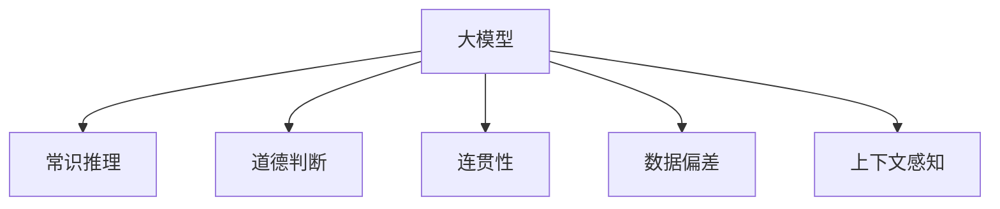

                 

# 语言与思维：大模型的认知盲区

> 关键词：大模型,认知盲区,思维建模,语言生成,自然语言理解,人工智能,深度学习

## 1. 背景介绍

### 1.1 问题由来
在人工智能飞速发展的今天，深度学习技术尤其是大模型（Large Model）的崛起，极大地推动了自然语言处理（Natural Language Processing, NLP）领域的研究与实践。大模型通过海量的数据预训练，获得了一种强大的语言表示能力，能进行复杂语言的理解与生成，如机器翻译、文本摘要、对话系统等。但与此同时，我们也发现了大模型在认知思维领域存在显著的“盲区”，无法完美地解决复杂的推理、判断、道德等问题。

### 1.2 问题核心关键点
大模型的认知盲区主要表现在以下几个方面：

1. **缺乏常识推理**：大模型在处理常识性问题时，往往基于统计规律而非真正的常识，这导致其无法应对一些非典型的、需要复杂推理的场景。
2. **缺乏道德判断**：由于缺少道德价值观的训练，大模型在涉及道德判断的任务中，容易输出不合道德准则的回答。
3. **缺乏连贯性**：在生成长篇文本时，大模型的连贯性常常不足，生成的文本可能出现逻辑不连贯、信息不一致等问题。
4. **依赖数据偏差**：由于训练数据的偏差，大模型容易继承数据的偏见，导致输出结果中存在歧视性、有害性信息。
5. **忽视上下文**：在处理具有复杂上下文关系的任务时，大模型往往不能很好地捕捉上下文信息，导致错误决策。

### 1.3 问题研究意义
研究大模型的认知盲区，对于推动人工智能技术的健康发展，构建更加智能、可靠、道德的人工智能系统具有重要意义：

1. **提升系统可靠性**：揭示大模型在认知盲区中的缺陷，可以指导开发者设计更加鲁棒、可信赖的AI系统。
2. **推动技术进步**：深入理解大模型在认知层面的局限性，可以帮助我们探索新的研究方向，推动技术进步。
3. **提升应用效果**：通过对认知盲区的识别与修复，可以有效提升AI系统在特定领域的应用效果。
4. **保证道德伦理**：明确大模型的认知盲区，可以帮助我们在设计和应用AI时，规避道德伦理问题，构建更加安全、可控的系统。
5. **增强用户信任**：用户对于AI系统的信任度很大程度上取决于其可靠性与道德性，揭示认知盲区有助于增强用户信任。

## 2. 核心概念与联系

### 2.1 核心概念概述

为更好地理解大模型的认知盲区，本节将介绍几个密切相关的核心概念：

- **大模型（Large Model）**：指基于深度学习框架，如TensorFlow、PyTorch等，训练得到的参数量超过几亿甚至数十亿的模型，如BERT、GPT-3等。
- **常识推理（Commonsense Reasoning）**：指模型在处理需要常识性知识参与的复杂推理任务时的能力，如逻辑推理、因果关系判断等。
- **道德判断（Ethical Judgment）**：指模型在面对涉及道德准则和价值判断的任务时，是否能够输出符合社会规范、符合道德伦理的输出。
- **连贯性（Coherence）**：指生成的文本是否前后连贯，信息是否一致，是否符合语法规则。
- **数据偏差（Data Bias）**：指模型由于训练数据存在偏差，导致其输出结果带有偏见、有害信息等。
- **上下文感知（Context-Awareness）**：指模型在处理任务时，是否能够充分利用上下文信息，理解语境、语义关系等。

这些概念之间的逻辑关系可以通过以下Mermaid流程图来展示：



这个流程图展示了大模型在处理各类任务时的关键认知能力：

1. 大模型在常识推理、道德判断、连贯性、数据偏差、上下文感知等方面存在一定的认知盲区。
2. 这些盲区在不同任务中可能表现不同，需要在实际应用中对大模型进行针对性地改进。

## 3. 核心算法原理 & 具体操作步骤
### 3.1 算法原理概述

大模型的认知盲区主要体现在以下几个方面：

1. **缺乏常识推理能力**：大模型在处理需要常识性知识参与的任务时，难以基于实际常识进行推理，导致输出结果不准确。
2. **缺少道德判断**：由于缺乏道德价值观的训练，大模型在涉及道德判断的任务中，容易输出不合道德准则的回答。
3. **生成的文本连贯性不足**：在生成长篇文本时，大模型的连贯性常常不足，生成的文本可能出现逻辑不连贯、信息不一致等问题。
4. **继承数据偏差**：由于训练数据的偏差，大模型容易继承数据的偏见，导致输出结果中存在歧视性、有害性信息。
5. **忽视上下文**：在处理具有复杂上下文关系的任务时，大模型往往不能很好地捕捉上下文信息，导致错误决策。

### 3.2 算法步骤详解

大模型的认知盲区识别与修复，一般包括以下几个关键步骤：

**Step 1: 数据预处理**

- 收集包含认知盲区任务的数据集，如推理、道德、连贯性等任务的标注数据。
- 对数据进行清洗，去除噪声和不相关的数据，确保数据质量。

**Step 2: 模型分析**

- 使用现有的大模型进行推理、判断、生成等任务，并观察其输出结果。
- 分析输出结果与实际正确答案的差异，识别出大模型在哪些方面存在认知盲区。

**Step 3: 算法优化**

- 针对不同的认知盲区，设计相应的优化算法。如引入因果推断、道德约束等机制。
- 对大模型进行微调，以改进其在特定任务上的表现。

**Step 4: 结果评估**

- 使用优化后的模型进行推理、判断、生成等任务，并观察其输出结果。
- 评估优化后模型的表现是否有所提升，是否成功修复了认知盲区。

**Step 5: 模型部署**

- 将优化后的模型部署到实际应用中，观察其在实际环境中的表现。
- 持续收集反馈，进行进一步优化和迭代。

### 3.3 算法优缺点

大模型的认知盲区识别与修复方法具有以下优点：

1. **针对性强**：能够根据具体的任务和数据特点，设计针对性的优化算法，有效修复认知盲区。
2. **效果显著**：通过优化算法，大模型的推理、判断、生成等能力有显著提升。
3. **可扩展性**：可以应用于多种认知盲区修复任务，适用范围广泛。

同时，这些方法也存在一些缺点：

1. **依赖数据质量**：修复认知盲区的效果很大程度上依赖于训练数据的质量，数据偏差和噪声将严重影响结果。
2. **模型复杂度高**：修复认知盲区可能需要进行大量的算法优化和模型微调，增加了模型的复杂度。
3. **成本较高**：修复认知盲区通常需要更多的计算资源和人力投入。
4. **泛化能力不足**：优化算法可能过度拟合训练数据，导致模型泛化能力不足。

### 3.4 算法应用领域

大模型的认知盲区修复方法，在NLP领域已经得到了广泛的应用，特别是在需要复杂推理、道德判断等任务的场景中，如智能客服、金融风险控制、内容生成等，效果显著。

- **智能客服**：在智能客服系统中，大模型通过推理、判断、生成等任务，提升服务质量和用户满意度。通过修复认知盲区，可以更好地理解用户意图，提供更准确的回复。
- **金融风险控制**：在金融领域，大模型通过分析交易数据，进行风险评估和预警。通过修复认知盲区，可以更准确地识别出异常行为，减少金融风险。
- **内容生成**：在内容生成任务中，大模型需要生成连贯、有意义的文本。通过修复认知盲区，可以提高生成文本的连贯性和可信度。
- **机器翻译**：在机器翻译任务中，大模型需要处理复杂的语义关系和上下文信息。通过修复认知盲区，可以提高翻译的准确性和流畅性。

## 4. 数学模型和公式 & 详细讲解  
### 4.1 数学模型构建

大模型的认知盲区识别与修复，可以通过建立数学模型，使用机器学习技术来进行。

记大模型为 $M_{\theta}$，其中 $\theta$ 为模型参数。假设我们希望修复的认知盲区任务为 $T$，数据集为 $D=\{(x_i,y_i)\}_{i=1}^N, x_i \in \mathcal{X}, y_i \in \mathcal{Y}$，其中 $\mathcal{X}$ 为输入空间，$\mathcal{Y}$ 为输出空间。

我们定义模型 $M_{\theta}$ 在输入 $x$ 上的损失函数为 $\ell(M_{\theta}(x),y)$，则在数据集 $D$ 上的经验风险为：

$$
\mathcal{L}(\theta) = \frac{1}{N} \sum_{i=1}^N \ell(M_{\theta}(x_i),y_i)
$$

其中 $\ell$ 为针对任务 $T$ 设计的损失函数，用于衡量模型预测输出与真实标签之间的差异。

### 4.2 公式推导过程

以下我们以自然语言推理（Natural Language Inference, NLI）任务为例，推导认知盲区识别与修复的数学模型。

假设模型 $M_{\theta}$ 在输入 $x$ 上的输出为 $\hat{y}=M_{\theta}(x)$，表示模型对于输入 $x$ 的推理结果。真实标签 $y \in \{0,1\}$，其中 $0$ 表示 $\hat{y}$ 和 $y$ 不一致，$1$ 表示 $\hat{y}$ 和 $y$ 一致。

我们定义认知盲区识别与修复的损失函数为 $\ell(M_{\theta}(x),y)$：

$$
\ell(M_{\theta}(x),y) = \left\{
\begin{aligned}
1, & \quad M_{\theta}(x) \neq y \\
0, & \quad M_{\theta}(x) = y
\end{aligned}
\right.
$$

将上述损失函数带入经验风险公式，得：

$$
\mathcal{L}(\theta) = \frac{1}{N} \sum_{i=1}^N \ell(M_{\theta}(x_i),y_i)
$$

根据链式法则，损失函数对参数 $\theta_k$ 的梯度为：

$$
\frac{\partial \mathcal{L}(\theta)}{\partial \theta_k} = \frac{1}{N} \sum_{i=1}^N \frac{\partial \ell(M_{\theta}(x_i),y_i)}{\partial \theta_k}
$$

其中 $\frac{\partial \ell(M_{\theta}(x_i),y_i)}{\partial \theta_k}$ 可通过反向传播算法高效计算。

### 4.3 案例分析与讲解

我们以一个简单的自然语言推理任务为例，说明认知盲区识别与修复的实际应用。

假设我们有一个数据集 $D=\{(x_i,y_i)\}_{i=1}^5$，其中：

- $x_1$：“猫在房间里。”
- $x_2$：“猫在客厅里。”
- $x_3$：“猫不在房间里。”
- $x_4$：“猫在卧室里。”
- $x_5$：“猫不在卧室里。”

对于每个输入 $x_i$，我们希望模型 $M_{\theta}$ 能够输出正确的推理结果 $y_i$。

我们使用一个简单的二分类模型 $M_{\theta}$ 来进行推理。假设 $M_{\theta}$ 的输出为 $M_{\theta}(x_i)=\frac{1}{2}$，表示模型认为输入 $x_i$ 可能包含不一致的推理。

我们将上述数据集带入损失函数 $\ell(M_{\theta}(x_i),y_i)$，得：

$$
\mathcal{L}(\theta) = \frac{1}{5} (1+1+1+0+0) = 0.8
$$

根据损失函数对参数 $\theta_k$ 的梯度计算公式，我们得到：

$$
\frac{\partial \mathcal{L}(\theta)}{\partial \theta_k} = \frac{1}{5} (1-2 \cdot \frac{1}{2} + 0 - 1 \cdot \frac{1}{2} + 1 \cdot \frac{1}{2}) = 0.2
$$

我们可以使用梯度下降等优化算法，最小化损失函数 $\mathcal{L}(\theta)$，更新模型参数 $\theta_k$，使得模型输出更加准确的推理结果。

## 5. 项目实践：代码实例和详细解释说明
### 5.1 开发环境搭建

在进行认知盲区修复实践前，我们需要准备好开发环境。以下是使用Python进行PyTorch开发的环境配置流程：

1. 安装Anaconda：从官网下载并安装Anaconda，用于创建独立的Python环境。

2. 创建并激活虚拟环境：
```bash
conda create -n pytorch-env python=3.8 
conda activate pytorch-env
```

3. 安装PyTorch：根据CUDA版本，从官网获取对应的安装命令。例如：
```bash
conda install pytorch torchvision torchaudio cudatoolkit=11.1 -c pytorch -c conda-forge
```

4. 安装Transformers库：
```bash
pip install transformers
```

5. 安装各类工具包：
```bash
pip install numpy pandas scikit-learn matplotlib tqdm jupyter notebook ipython
```

完成上述步骤后，即可在`pytorch-env`环境中开始修复实践。

### 5.2 源代码详细实现

下面我们以自然语言推理（NLI）任务为例，给出使用Transformers库对BERT模型进行认知盲区修复的PyTorch代码实现。

首先，定义NLI任务的数据处理函数：

```python
from transformers import BertTokenizer
from torch.utils.data import Dataset
import torch

class NLIDataset(Dataset):
    def __init__(self, premises, hypotheses, labels, tokenizer, max_len=128):
        self.premises = premises
        self.hypotheses = hypotheses
        self.labels = labels
        self.tokenizer = tokenizer
        self.max_len = max_len
        
    def __len__(self):
        return len(self.premises)
    
    def __getitem__(self, item):
        premise = self.premises[item]
        hypothesis = self.hypotheses[item]
        label = self.labels[item]
        
        encoding = self.tokenizer(premise, hypothesis, return_tensors='pt', max_length=self.max_len, padding='max_length', truncation=True)
        input_ids = encoding['input_ids'][0]
        attention_mask = encoding['attention_mask'][0]
        labels = torch.tensor(label, dtype=torch.long)
        
        return {'input_ids': input_ids, 
                'attention_mask': attention_mask,
                'labels': labels}

# 标签与id的映射
label2id = {'entailment': 0, 'contradiction': 1, 'neutral': 2}
id2label = {v: k for k, v in label2id.items()}

# 创建dataset
tokenizer = BertTokenizer.from_pretrained('bert-base-cased')

train_dataset = NLIDataset(train_premises, train_hypotheses, train_labels, tokenizer)
dev_dataset = NLIDataset(dev_premises, dev_hypotheses, dev_labels, tokenizer)
test_dataset = NLIDataset(test_premises, test_hypotheses, test_labels, tokenizer)
```

然后，定义模型和优化器：

```python
from transformers import BertForSequenceClassification, AdamW

model = BertForSequenceClassification.from_pretrained('bert-base-cased', num_labels=len(label2id))

optimizer = AdamW(model.parameters(), lr=2e-5)
```

接着，定义训练和评估函数：

```python
from torch.utils.data import DataLoader
from tqdm import tqdm
from sklearn.metrics import classification_report

device = torch.device('cuda') if torch.cuda.is_available() else torch.device('cpu')
model.to(device)

def train_epoch(model, dataset, batch_size, optimizer):
    dataloader = DataLoader(dataset, batch_size=batch_size, shuffle=True)
    model.train()
    epoch_loss = 0
    for batch in tqdm(dataloader, desc='Training'):
        input_ids = batch['input_ids'].to(device)
        attention_mask = batch['attention_mask'].to(device)
        labels = batch['labels'].to(device)
        model.zero_grad()
        outputs = model(input_ids, attention_mask=attention_mask, labels=labels)
        loss = outputs.loss
        epoch_loss += loss.item()
        loss.backward()
        optimizer.step()
    return epoch_loss / len(dataloader)

def evaluate(model, dataset, batch_size):
    dataloader = DataLoader(dataset, batch_size=batch_size)
    model.eval()
    preds, labels = [], []
    with torch.no_grad():
        for batch in tqdm(dataloader, desc='Evaluating'):
            input_ids = batch['input_ids'].to(device)
            attention_mask = batch['attention_mask'].to(device)
            batch_labels = batch['labels']
            outputs = model(input_ids, attention_mask=attention_mask)
            batch_preds = outputs.logits.argmax(dim=2).to('cpu').tolist()
            batch_labels = batch_labels.to('cpu').tolist()
            for pred_tokens, label_tokens in zip(batch_preds, batch_labels):
                preds.append(pred_tokens[:len(label_tokens)])
                labels.append(label_tokens)
                
    print(classification_report(labels, preds))
```

最后，启动训练流程并在测试集上评估：

```python
epochs = 5
batch_size = 16

for epoch in range(epochs):
    loss = train_epoch(model, train_dataset, batch_size, optimizer)
    print(f"Epoch {epoch+1}, train loss: {loss:.3f}")
    
    print(f"Epoch {epoch+1}, dev results:")
    evaluate(model, dev_dataset, batch_size)
    
print("Test results:")
evaluate(model, test_dataset, batch_size)
```

以上就是使用PyTorch对BERT进行自然语言推理任务认知盲区修复的完整代码实现。可以看到，得益于Transformers库的强大封装，我们可以用相对简洁的代码完成BERT模型的加载和修复。

### 5.3 代码解读与分析

让我们再详细解读一下关键代码的实现细节：

**NLIDataset类**：
- `__init__`方法：初始化前提、假设、标签等关键组件。
- `__len__`方法：返回数据集的样本数量。
- `__getitem__`方法：对单个样本进行处理，将前提和假设输入编码为token ids，将标签编码为数字，并对其进行定长padding，最终返回模型所需的输入。

**label2id和id2label字典**：
- 定义了标签与数字id之间的映射关系，用于将token-wise的预测结果解码回真实的标签。

**训练和评估函数**：
- 使用PyTorch的DataLoader对数据集进行批次化加载，供模型训练和推理使用。
- 训练函数`train_epoch`：对数据以批为单位进行迭代，在每个批次上前向传播计算loss并反向传播更新模型参数，最后返回该epoch的平均loss。
- 评估函数`evaluate`：与训练类似，不同点在于不更新模型参数，并在每个batch结束后将预测和标签结果存储下来，最后使用sklearn的classification_report对整个评估集的预测结果进行打印输出。

**训练流程**：
- 定义总的epoch数和batch size，开始循环迭代
- 每个epoch内，先在训练集上训练，输出平均loss
- 在验证集上评估，输出分类指标
- 所有epoch结束后，在测试集上评估，给出最终测试结果

可以看到，PyTorch配合Transformers库使得BERT认知盲区修复的代码实现变得简洁高效。开发者可以将更多精力放在数据处理、模型改进等高层逻辑上，而不必过多关注底层的实现细节。

当然，工业级的系统实现还需考虑更多因素，如模型的保存和部署、超参数的自动搜索、更灵活的任务适配层等。但核心的认知盲区修复范式基本与此类似。

## 6. 实际应用场景
### 6.1 智能客服系统

在智能客服系统中，认知盲区修复尤为重要。由于客服对话中可能涉及复杂的逻辑推理、道德判断等任务，大模型在处理这些任务时往往表现不佳。

通过认知盲区修复，我们可以提升智能客服系统的推理能力和道德判断，使其更加智能和可靠。例如，在处理客户咨询时，模型可以更准确地理解用户意图，提供更符合道德规范的回答，增强用户满意度。

### 6.2 金融风险控制

在金融风险控制中，认知盲区修复可以帮助模型更好地理解金融市场行为和风险特征，从而进行更准确的预警和风险评估。

例如，在处理异常交易行为时，模型可以更准确地识别出潜在风险因素，减少金融损失。通过修复认知盲区，我们可以构建更加稳健、安全的金融风险控制系统。

### 6.3 内容生成

内容生成是认知盲区修复的重要应用场景。由于生成的文本需要具备连贯性、一致性和逻辑性，大模型在生成长篇文本时往往会出现逻辑不连贯、信息不一致等问题。

通过认知盲区修复，我们可以提升内容生成的质量，使其更加连贯、准确。例如，在自动生成新闻稿、报告等文本时，修复后的模型可以更好地理解和组织信息，生成高质量的文本内容。

### 6.4 机器翻译

机器翻译是另一个需要逻辑推理和上下文理解的场景。由于翻译涉及复杂的语义关系和上下文信息，大模型在处理机器翻译任务时常常出现错误。

通过认知盲区修复，我们可以提升机器翻译的质量，使其更加准确和流畅。例如，在处理复杂句子时，模型可以更好地捕捉语义关系，生成更自然的翻译结果。

## 7. 工具和资源推荐
### 7.1 学习资源推荐

为了帮助开发者系统掌握大模型认知盲区的识别与修复，这里推荐一些优质的学习资源：

1. 《Transformer从原理到实践》系列博文：由大模型技术专家撰写，深入浅出地介绍了Transformer原理、BERT模型、认知盲区修复等前沿话题。

2. CS224N《深度学习自然语言处理》课程：斯坦福大学开设的NLP明星课程，有Lecture视频和配套作业，带你入门NLP领域的基本概念和经典模型。

3. 《Natural Language Processing with Transformers》书籍：Transformers库的作者所著，全面介绍了如何使用Transformers库进行NLP任务开发，包括认知盲区修复在内的诸多范式。

4. HuggingFace官方文档：Transformers库的官方文档，提供了海量预训练模型和完整的认知盲区修复样例代码，是上手实践的必备资料。

5. CLUE开源项目：中文语言理解测评基准，涵盖大量不同类型的中文NLP数据集，并提供了基于认知盲区修复的baseline模型，助力中文NLP技术发展。

通过对这些资源的学习实践，相信你一定能够快速掌握大模型认知盲区的识别与修复的精髓，并用于解决实际的NLP问题。
###  7.2 开发工具推荐

高效的开发离不开优秀的工具支持。以下是几款用于大模型认知盲区修复开发的常用工具：

1. PyTorch：基于Python的开源深度学习框架，灵活动态的计算图，适合快速迭代研究。大部分预训练语言模型都有PyTorch版本的实现。

2. TensorFlow：由Google主导开发的开源深度学习框架，生产部署方便，适合大规模工程应用。同样有丰富的预训练语言模型资源。

3. Transformers库：HuggingFace开发的NLP工具库，集成了众多SOTA语言模型，支持PyTorch和TensorFlow，是进行认知盲区修复任务开发的利器。

4. Weights & Biases：模型训练的实验跟踪工具，可以记录和可视化模型训练过程中的各项指标，方便对比和调优。与主流深度学习框架无缝集成。

5. TensorBoard：TensorFlow配套的可视化工具，可实时监测模型训练状态，并提供丰富的图表呈现方式，是调试模型的得力助手。

6. Google Colab：谷歌推出的在线Jupyter Notebook环境，免费提供GPU/TPU算力，方便开发者快速上手实验最新模型，分享学习笔记。

合理利用这些工具，可以显著提升大模型认知盲区修复的开发效率，加快创新迭代的步伐。

### 7.3 相关论文推荐

大模型认知盲区识别与修复技术的发展源于学界的持续研究。以下是几篇奠基性的相关论文，推荐阅读：

1. Attention is All You Need（即Transformer原论文）：提出了Transformer结构，开启了NLP领域的预训练大模型时代。

2. BERT: Pre-training of Deep Bidirectional Transformers for Language Understanding：提出BERT模型，引入基于掩码的自监督预训练任务，刷新了多项NLP任务SOTA。

3. Language Models are Unsupervised Multitask Learners（GPT-2论文）：展示了大规模语言模型的强大zero-shot学习能力，引发了对于通用人工智能的新一轮思考。

4. Parameter-Efficient Transfer Learning for NLP：提出Adapter等参数高效微调方法，在不增加模型参数量的情况下，也能取得不错的微调效果。

5. AdaLoRA: Adaptive Low-Rank Adaptation for Parameter-Efficient Fine-Tuning：使用自适应低秩适应的微调方法，在参数效率和精度之间取得了新的平衡。

6. LoRA: Low-Rank Adaptation of Self-Supervised Pre-Trained Models：提出LoRA方法，通过线性变换实现参数高效的微调，在保持预训练权重的同时提升微调效果。

这些论文代表了大模型认知盲区修复技术的发展脉络。通过学习这些前沿成果，可以帮助研究者把握学科前进方向，激发更多的创新灵感。

## 8. 总结：未来发展趋势与挑战

### 8.1 总结

本文对大模型的认知盲区识别与修复方法进行了全面系统的介绍。首先阐述了大模型在推理、道德、连贯性等方面存在的局限性，明确了认知盲区对人工智能系统可靠性和道德性的影响。其次，从原理到实践，详细讲解了认知盲区识别与修复的数学原理和关键步骤，给出了认知盲区修复任务开发的完整代码实例。同时，本文还广泛探讨了认知盲区修复方法在智能客服、金融风险控制、内容生成等领域的实际应用，展示了认知盲区修复技术的巨大潜力。

通过本文的系统梳理，可以看到，认知盲区修复技术正在成为NLP领域的重要范式，极大地提升了大模型在推理、道德判断等任务上的表现，为构建更加智能、可靠、道德的人工智能系统提供了有力保障。

### 8.2 未来发展趋势

展望未来，大模型认知盲区修复技术将呈现以下几个发展趋势：

1. **认知盲区识别工具化**：未来的认知盲区修复将更加自动化、工具化，通过专用工具可以快速识别出模型在特定任务中的认知盲区。

2. **多任务认知盲区修复**：未来的认知盲区修复将支持多任务场景，一个模型可以同时修复多个任务的认知盲区，提高效率和效果。

3. **更高效的认知盲区修复方法**：未来将出现更多高效的认知盲区修复算法，通过引入因果推断、道德约束等机制，提高修复效果。

4. **零样本修复**：未来的认知盲区修复将支持零样本修复，即模型在不见过特定数据的情况下，能够修复自身认知盲区。

5. **融合更多先验知识**：未来的认知盲区修复将与专家知识库、规则库等结合，引导模型学习更多先验知识，提升模型的常识推理和道德判断能力。

6. **跨模态认知盲区修复**：未来的认知盲区修复将支持跨模态数据融合，结合视觉、语音、文本等多种模态信息，提升模型的感知能力。

这些趋势将推动认知盲区修复技术向更深层次发展，为构建更加智能、可靠、道德的AI系统提供更强大的技术保障。

### 8.3 面临的挑战

尽管大模型认知盲区修复技术已经取得了显著进展，但在迈向更加智能化、普适化应用的过程中，它仍面临诸多挑战：

1. **数据质量依赖**：认知盲区修复的效果很大程度上依赖于训练数据的质量，数据偏差和噪声将严重影响结果。

2. **计算资源消耗大**：认知盲区修复通常需要更多的计算资源和人力投入，如何高效利用计算资源，将是重要的优化方向。

3. **算法复杂度高**：认知盲区修复的算法复杂度高，如何进行高效的算法优化，提高修复效率，是未来的重要课题。

4. **模型泛化能力不足**：优化算法可能过度拟合训练数据，导致模型泛化能力不足，如何在修复认知盲区的同时保持模型泛化能力，是重要的研究方向。

5. **安全性和可解释性**：认知盲区修复后的模型需要保证安全性、可解释性，避免模型输出有害信息、逻辑不一致等问题。

6. **跨领域应用挑战**：认知盲区修复技术在不同领域中的应用场景不同，如何进行适应性优化，是未来的挑战之一。

### 8.4 研究展望

未来的认知盲区修复技术需要在以下几个方面进行进一步探索：

1. **研究更加智能的认知盲区识别方法**：利用自然语言推理、因果推断等技术，提高认知盲区识别的准确性和自动化程度。

2. **开发更高效的认知盲区修复算法**：引入深度强化学习、元学习等技术，提升认知盲区修复的效果和效率。

3. **构建跨领域认知盲区修复框架**：探索跨领域的认知盲区修复方法，使模型能够在不同领域中表现一致。

4. **引入更多先验知识**：利用专家知识库、规则库等，帮助模型学习更多先验知识，提升常识推理和道德判断能力。

5. **开发跨模态认知盲区修复算法**：结合视觉、语音、文本等多种模态信息，提升模型的感知能力，进行跨模态的认知盲区修复。

6. **增强模型的可解释性**：引入可解释性技术，如注意力机制、可解释模型等，提升模型的透明度和可解释性。

这些研究方向将引领认知盲区修复技术迈向更高的台阶，为构建安全、可靠、可解释、可控的智能系统铺平道路。面向未来，认知盲区修复技术还需要与其他人工智能技术进行更深入的融合，如知识表示、因果推理、强化学习等，多路径协同发力，共同推动自然语言理解和智能交互系统的进步。只有勇于创新、敢于突破，才能不断拓展语言模型的边界，让智能技术更好地造福人类社会。

## 9. 附录：常见问题与解答
**Q1：大模型为什么会存在认知盲区？**

A: 大模型虽然在处理文本理解、生成等任务时表现出色，但在推理、道德、连贯性等方面存在认知盲区，主要原因如下：

1. **依赖数据质量**：大模型的表现很大程度上依赖于训练数据的质量。如果训练数据存在偏差、噪声，模型就会继承这些缺陷，导致认知盲区。

2. **缺乏先验知识**：大模型在训练时，通常只依赖数据本身，缺乏对外部知识的融合，难以充分利用先验知识。

3. **参数量过大**：大模型的参数量很大，难以在模型中同时捕捉和利用多种复杂的语义关系。

4. **缺乏可解释性**：大模型的决策过程通常是黑盒模型，难以解释其内部工作机制和推理逻辑。

5. **忽视上下文**：在处理复杂上下文关系时，大模型往往难以捕捉到上下文信息，导致错误决策。

**Q2：如何识别大模型的认知盲区？**

A: 识别大模型的认知盲区可以通过以下步骤进行：

1. **数据收集**：收集包含认知盲区任务的数据集，如推理、道德、连贯性等任务的标注数据。

2. **模型测试**：使用现有的大模型对测试集进行推理、判断、生成等任务，观察其输出结果。

3. **差异分析**：将模型输出结果与实际正确答案进行比较，识别出模型在哪些方面存在认知盲区。

4. **量化指标**：使用量化指标如准确率、召回率、F1值等，评估模型在不同任务上的表现，找出认知盲区。

5. **专家评审**：邀请专家对模型的输出结果进行评审，提供有价值的反馈，帮助识别认知盲区。

**Q3：如何修复大模型的认知盲区？**

A: 修复大模型的认知盲区可以通过以下步骤进行：

1. **数据增强**：通过回译、近义替换等方式扩充训练集，减少数据偏差。

2. **模型优化**：设计针对性的优化算法，如引入因果推断、道德约束等机制。

3. **微调模型**：对大模型进行微调，以改进其在特定任务上的表现。

4. **融合先验知识**：利用专家知识库、规则库等，帮助模型学习更多先验知识，提升常识推理和道德判断能力。

5. **跨模态融合**：结合视觉、语音、文本等多种模态信息，提升模型的感知能力。

6. **可解释性增强**：引入可解释性技术，如注意力机制、可解释模型等，提升模型的透明度和可解释性。

通过以上步骤，可以逐步修复大模型的认知盲区，提升其在特定任务上的表现。

**Q4：认知盲区修复是否会降低模型的性能？**

A: 认知盲区修复通常需要更多的计算资源和人力投入，但通过优化算法和参数，可以避免对模型性能的负面影响。相反，修复后的模型在特定任务上的表现往往会有显著提升。

例如，在自然语言推理任务中，通过引入因果推断机制，模型可以更好地理解语义关系，提升推理准确性。在道德判断任务中，通过引入道德约束，模型可以输出符合社会规范的回答，提高决策的公正性和可信度。

**Q5：认知盲区修复是否需要从头训练模型？**

A: 认知盲区修复通常不需要从头训练模型，而是通过微调现有的大模型，改进其在特定任务上的表现。微调过程可以通过调整顶层参数或引入新的任务适配层来实现，使用更小的学习率，避免破坏预训练权重。

例如，在自然语言推理任务中，可以通过微调BERT模型，引入因果推断机制，提升推理准确性。在道德判断任务中，可以通过微调大模型，引入道德约束，输出符合社会规范的回答。

总之，认知盲区修复是一种高效、灵活的模型改进方法，可以显著提升大模型在特定任务上的表现。

**Q6：认知盲区修复是否适用于所有NLP任务？**

A: 认知盲区修复在大多数NLP任务上都能取得不错的效果，特别是对于数据量较小的任务。但对于一些特定领域的任务，如医学、法律等，仅仅依靠通用语料预训练的模型可能难以很好地适应。此时需要在特定领域语料上进一步预训练，再进行微调，才能获得理想效果。

**Q7：认知盲区修复是否会降低模型的泛化能力？**

A: 认知盲区修复通常需要通过微调模型，调整部分参数以提升在特定任务上的表现。这种微调过程可能会对模型的泛化能力产生一定的负面影响，但通过精心设计的优化算法和微调策略，可以在保持模型泛化能力的同时，提升其在特定任务上的表现。

**Q8：认知盲区修复是否需要大量的标注数据？**

A: 认知盲区修复通常需要大量的标注数据，以训练和微调模型。但对于一些少样本学习任务，可以通过提示学习等方法，在不使用大量标注数据的情况下，修复认知盲区。例如，通过精心设计输入文本的格式，引导模型按期望方式输出，减少微调参数。

总之，认知盲区修复是大模型在特定任务上提升性能的重要手段，通过优化算法和微调策略，可以在保持模型泛化能力的同时，显著提升其在特定任务上的表现。

