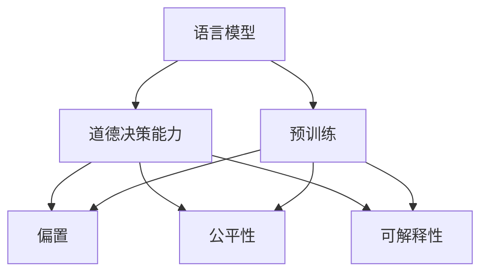

                 

## 1. 背景介绍

### 1.1 问题由来

人工智能的发展正逐步走向深入，语言模型作为其中的重要组成部分，已经在多个领域展现出强大的应用潜力。然而，随着语言模型的广泛应用，其道德决策能力也成为了一个备受关注的议题。如何确保语言模型的输出在道德和伦理层面符合社会规范，是摆在人工智能研究者和开发者面前的一个重要问题。

### 1.2 问题核心关键点

语言模型的道德决策能力是指其在生成或推理过程中，能否基于道德和伦理的框架，对不同行为、决策和结果进行合理评估和判断。这一能力直接关系到模型的社会接受度和应用价值。

语言模型通常通过大量的无标注和标注数据进行训练，学习到语言的知识和规律。然而，在训练过程中，模型可能会无意中学习到偏见和有害信息，或者在生成的内容中产生误导性的输出。因此，如何训练和优化语言模型，使其具备良好的道德决策能力，成为一个亟待解决的问题。

### 1.3 问题研究意义

研究语言模型的道德决策能力，对于提升模型的社会价值和可信赖度，推动人工智能技术的健康发展，具有重要意义：

1. **提升社会价值**：语言模型在医疗、司法、金融等领域的应用，直接关系到人的生命和财产安全，具备良好的道德决策能力能够确保这些应用更加公正和可靠。
2. **增强模型可信赖度**：具备道德决策能力的模型更能得到用户的信任，减少误导性输出的风险，提高模型的社会接受度。
3. **推动人工智能技术健康发展**：道德决策能力是衡量一个模型是否具备“善”的伦理价值观的重要标准，有助于推动人工智能技术的可持续发展。
4. **促进技术应用落地**：具备良好道德决策能力的模型，更容易获得监管机构和社会公众的认可，加速其在各行业的应用。

## 2. 核心概念与联系

### 2.1 核心概念概述

为了更好地理解语言模型的道德决策能力，首先需要明确几个核心概念：

- **语言模型**：以Transformer为代表的大规模预训练语言模型，通过在大规模无标签文本语料上进行预训练，学习到语言的通用表示和规律。
- **道德决策能力**：指模型在生成或推理过程中，能够基于道德和伦理的框架，对不同行为、决策和结果进行合理评估和判断的能力。
- **偏置(Bias)**：指模型在训练或生成过程中，偏向于某些特定属性或类别的倾向，可能源于训练数据的不平衡或偏见。
- **公平性(Fairness)**：指模型在不同属性或类别上的输出结果应该均衡，不偏向任何特定群体。
- **可解释性(Interpretability)**：指模型的输出结果能够被清晰地解释，用户能够理解模型为什么做出某个决策。

这些概念之间的关系可以通过以下Mermaid流程图来展示：



这个流程图展示了大语言模型的核心概念及其之间的关系：

1. 语言模型通过预训练获得基础能力。
2. 预训练后，通过道德决策能力提升模型的社会价值和可信赖度。
3. 道德决策能力直接受到偏置、公平性和可解释性的影响。

这些概念共同构成了大语言模型的伦理框架，使其在生成或推理过程中能够更好地符合道德和伦理标准。

## 3. 核心算法原理 & 具体操作步骤
### 3.1 算法原理概述

语言模型的道德决策能力，可以通过以下步骤来实现：

1. **数据选择与标注**：选择包含道德和伦理相关信息的标注数据集，如法律文本、伦理案例等。
2. **训练与微调**：在标注数据集上训练语言模型，并通过微调提升其在道德和伦理任务上的性能。
3. **模型评估**：在独立的数据集上评估模型性能，确保其输出在道德和伦理层面的合理性。
4. **部署与监控**：将模型部署到实际应用中，并定期监控其输出结果，及时调整和优化。

### 3.2 算法步骤详解

以下是基于监督学习的方法实现语言模型道德决策能力的详细步骤：

**Step 1: 数据准备**
- 收集包含道德和伦理相关信息的标注数据集，如法律文本、伦理案例、医疗案例等。
- 将数据集分为训练集、验证集和测试集，确保数据的多样性和代表性。

**Step 2: 模型设计与训练**
- 选择合适的语言模型架构，如BERT、GPT-3等，并在标注数据集上对其进行微调。
- 设计道德决策相关的输出层，如判断句子是否符合伦理规范的分类任务。
- 使用适当的损失函数，如交叉熵损失，训练模型。

**Step 3: 模型评估与优化**
- 在独立的数据集上评估模型的性能，如使用混淆矩阵、AUC等指标。
- 根据评估结果，调整模型参数，优化模型性能。
- 引入正则化技术，如L2正则、Dropout等，减少模型偏置。

**Step 4: 部署与监控**
- 将优化后的模型部署到实际应用中，如司法审判、医疗诊断等。
- 定期监控模型的输出结果，确保其在道德和伦理层面的合理性。
- 收集用户反馈，进一步优化模型。

### 3.3 算法优缺点

基于监督学习的道德决策能力提升方法，具有以下优点：

1. **可解释性高**：监督学习方法能够通过明确的标注数据集训练模型，输出结果具有较高的可解释性。
2. **效果显著**：通过调整模型输出层和损失函数，可以在道德和伦理相关任务上获得较好的性能。
3. **应用广泛**：适用于多种道德和伦理相关任务，如判断言论是否合法、评估医疗决策的合理性等。

同时，该方法也存在以下局限性：

1. **依赖标注数据**：需要大量高质量的标注数据，获取标注数据的成本较高。
2. **泛化能力有限**：当目标任务与标注数据分布差异较大时，模型的泛化能力可能受限。
3. **模型复杂度较高**：需要设计额外的输出层和损失函数，增加模型复杂度。
4. **对抗样本敏感**：对抗样本攻击可能影响模型的决策能力，需要引入对抗训练等技术。

尽管存在这些局限性，但就目前而言，基于监督学习的道德决策能力提升方法仍是大语言模型伦理应用的主流范式。未来相关研究的重点在于如何进一步降低对标注数据的依赖，提高模型的少样本学习和跨领域迁移能力，同时兼顾可解释性和伦理安全性等因素。

### 3.4 算法应用领域

基于道德决策能力提升的语言模型，已经在多个领域得到了广泛应用，例如：

- **法律**：在司法审判中，语言模型可以帮助判断案件的合法性，减少法官的负担。
- **医疗**：在医疗诊断中，语言模型可以帮助评估治疗方案的合理性和道德性。
- **金融**：在金融交易中，语言模型可以帮助判断合同的合法性和公平性。
- **新闻媒体**：在新闻发布中，语言模型可以帮助筛选符合伦理规范的报道。
- **社交媒体**：在社交平台中，语言模型可以帮助审查和过滤有害内容，保障用户的安全和权益。

除了上述这些经典应用外，语言模型道德决策能力还将被创新性地应用到更多场景中，如自动驾驶、智能合约、智慧城市等，为社会治理和人类行为规范提供新的技术支持。

## 4. 数学模型和公式 & 详细讲解  
### 4.1 数学模型构建

语言模型在道德决策任务中的输出可以表示为一个分类问题，即判断输入文本是否符合道德和伦理规范。例如，对于一句话“Tomorrow I will steal 1 million dollars”，语言模型需要判断该句话是否符合伦理规范，即是否存在盗窃行为。

设输入文本为 $x$，输出结果为 $y$，其中 $y$ 可以表示为 0（不符合伦理规范）或 1（符合伦理规范）。道德决策任务的数学模型可以表示为：

$$
y = f(x; \theta)
$$

其中，$f$ 表示模型的推理函数，$\theta$ 为模型参数，可以包含预训练参数和微调参数。

### 4.2 公式推导过程

在监督学习方法中，模型的训练目标是最小化损失函数 $\mathcal{L}$，即：

$$
\theta^* = \mathop{\arg\min}_{\theta} \mathcal{L}(\theta)
$$

其中，损失函数 $\mathcal{L}$ 可以是交叉熵损失函数，对于二分类任务，可以表示为：

$$
\mathcal{L}(\theta) = -\frac{1}{N} \sum_{i=1}^N [y_i \log f(x_i; \theta) + (1-y_i) \log (1-f(x_i; \theta))]
$$

在训练过程中，模型会通过反向传播算法更新参数 $\theta$，使得模型能够较好地判断输入文本是否符合伦理规范。

### 4.3 案例分析与讲解

以法律判决任务的道德决策能力为例，以下是具体的数学模型和公式推导：

假设输入文本为 $x$，对应的标注结果为 $y$（0 或 1），模型的输出结果为 $f(x; \theta)$，其中 $\theta$ 为模型参数。损失函数 $\mathcal{L}$ 可以表示为：

$$
\mathcal{L}(\theta) = -\frac{1}{N} \sum_{i=1}^N [y_i \log f(x_i; \theta) + (1-y_i) \log (1-f(x_i; \theta))]
$$

模型的推理函数 $f(x; \theta)$ 可以是任何可解释的模型，如逻辑回归、决策树、神经网络等。假设使用逻辑回归模型，其输出结果为：

$$
f(x; \theta) = \frac{1}{1 + e^{-z(x; \theta)}}
$$

其中，$z(x; \theta)$ 为逻辑回归模型的线性输出，可以表示为：

$$
z(x; \theta) = w_0 + \sum_{i=1}^{n} w_i x_i
$$

其中，$w_0$ 和 $w_i$ 为模型参数，$x_i$ 为输入文本 $x$ 的分词表示。

在训练过程中，使用梯度下降等优化算法更新模型参数 $\theta$，最小化损失函数 $\mathcal{L}$。通过不断迭代，模型能够学习到输入文本与道德和伦理规范之间的关系，从而具备道德决策能力。

## 5. 项目实践：代码实例和详细解释说明
### 5.1 开发环境搭建

在进行道德决策能力提升的项目实践前，需要先准备好开发环境。以下是使用Python进行PyTorch开发的环境配置流程：

1. 安装Anaconda：从官网下载并安装Anaconda，用于创建独立的Python环境。

2. 创建并激活虚拟环境：
```bash
conda create -n pytorch-env python=3.8 
conda activate pytorch-env
```

3. 安装PyTorch：根据CUDA版本，从官网获取对应的安装命令。例如：
```bash
conda install pytorch torchvision torchaudio cudatoolkit=11.1 -c pytorch -c conda-forge
```

4. 安装Transformers库：
```bash
pip install transformers
```

5. 安装各类工具包：
```bash
pip install numpy pandas scikit-learn matplotlib tqdm jupyter notebook ipython
```

完成上述步骤后，即可在`pytorch-env`环境中开始项目实践。

### 5.2 源代码详细实现

这里我们以法律判决任务的道德决策能力提升为例，给出使用Transformers库对BERT模型进行微调的PyTorch代码实现。

首先，定义道德决策任务的数据处理函数：

```python
from transformers import BertTokenizer
from torch.utils.data import Dataset
import torch

class LegalDataset(Dataset):
    def __init__(self, texts, labels, tokenizer, max_len=128):
        self.texts = texts
        self.labels = labels
        self.tokenizer = tokenizer
        self.max_len = max_len
        
    def __len__(self):
        return len(self.texts)
    
    def __getitem__(self, item):
        text = self.texts[item]
        label = self.labels[item]
        
        encoding = self.tokenizer(text, return_tensors='pt', max_length=self.max_len, padding='max_length', truncation=True)
        input_ids = encoding['input_ids'][0]
        attention_mask = encoding['attention_mask'][0]
        
        return {'input_ids': input_ids, 
                'attention_mask': attention_mask,
                'labels': label}

# 标签与id的映射
label2id = {0: 'Not Ethical', 1: 'Ethical'}
id2label = {v: k for k, v in label2id.items()}

# 创建dataset
tokenizer = BertTokenizer.from_pretrained('bert-base-cased')

train_dataset = LegalDataset(train_texts, train_labels, tokenizer)
dev_dataset = LegalDataset(dev_texts, dev_labels, tokenizer)
test_dataset = LegalDataset(test_texts, test_labels, tokenizer)
```

然后，定义模型和优化器：

```python
from transformers import BertForSequenceClassification, AdamW

model = BertForSequenceClassification.from_pretrained('bert-base-cased', num_labels=2)

optimizer = AdamW(model.parameters(), lr=2e-5)
```

接着，定义训练和评估函数：

```python
from torch.utils.data import DataLoader
from tqdm import tqdm
from sklearn.metrics import classification_report

device = torch.device('cuda') if torch.cuda.is_available() else torch.device('cpu')
model.to(device)

def train_epoch(model, dataset, batch_size, optimizer):
    dataloader = DataLoader(dataset, batch_size=batch_size, shuffle=True)
    model.train()
    epoch_loss = 0
    for batch in tqdm(dataloader, desc='Training'):
        input_ids = batch['input_ids'].to(device)
        attention_mask = batch['attention_mask'].to(device)
        labels = batch['labels'].to(device)
        model.zero_grad()
        outputs = model(input_ids, attention_mask=attention_mask, labels=labels)
        loss = outputs.loss
        epoch_loss += loss.item()
        loss.backward()
        optimizer.step()
    return epoch_loss / len(dataloader)

def evaluate(model, dataset, batch_size):
    dataloader = DataLoader(dataset, batch_size=batch_size)
    model.eval()
    preds, labels = [], []
    with torch.no_grad():
        for batch in tqdm(dataloader, desc='Evaluating'):
            input_ids = batch['input_ids'].to(device)
            attention_mask = batch['attention_mask'].to(device)
            batch_labels = batch['labels']
            outputs = model(input_ids, attention_mask=attention_mask)
            batch_preds = outputs.logits.argmax(dim=2).to('cpu').tolist()
            batch_labels = batch_labels.to('cpu').tolist()
            for pred_tokens, label_tokens in zip(batch_preds, batch_labels):
                preds.append(pred_tokens)
                labels.append(label_tokens)
                
    print(classification_report(labels, preds))
```

最后，启动训练流程并在测试集上评估：

```python
epochs = 5
batch_size = 16

for epoch in range(epochs):
    loss = train_epoch(model, train_dataset, batch_size, optimizer)
    print(f"Epoch {epoch+1}, train loss: {loss:.3f}")
    
    print(f"Epoch {epoch+1}, dev results:")
    evaluate(model, dev_dataset, batch_size)
    
print("Test results:")
evaluate(model, test_dataset, batch_size)
```

以上就是使用PyTorch对BERT进行法律判决任务道德决策能力提升的完整代码实现。可以看到，得益于Transformers库的强大封装，我们可以用相对简洁的代码完成BERT模型的加载和微调。

### 5.3 代码解读与分析

让我们再详细解读一下关键代码的实现细节：

**LegalDataset类**：
- `__init__`方法：初始化文本、标签、分词器等关键组件。
- `__len__`方法：返回数据集的样本数量。
- `__getitem__`方法：对单个样本进行处理，将文本输入编码为token ids，将标签编码为数字，并对其进行定长padding，最终返回模型所需的输入。

**label2id和id2label字典**：
- 定义了标签与数字id之间的映射关系，用于将预测结果解码回真实的标签。

**训练和评估函数**：
- 使用PyTorch的DataLoader对数据集进行批次化加载，供模型训练和推理使用。
- 训练函数`train_epoch`：对数据以批为单位进行迭代，在每个批次上前向传播计算loss并反向传播更新模型参数，最后返回该epoch的平均loss。
- 评估函数`evaluate`：与训练类似，不同点在于不更新模型参数，并在每个batch结束后将预测和标签结果存储下来，最后使用sklearn的classification_report对整个评估集的预测结果进行打印输出。

**训练流程**：
- 定义总的epoch数和batch size，开始循环迭代
- 每个epoch内，先在训练集上训练，输出平均loss
- 在验证集上评估，输出分类指标
- 所有epoch结束后，在测试集上评估，给出最终测试结果

可以看到，PyTorch配合Transformers库使得BERT微调的代码实现变得简洁高效。开发者可以将更多精力放在数据处理、模型改进等高层逻辑上，而不必过多关注底层的实现细节。

当然，工业级的系统实现还需考虑更多因素，如模型的保存和部署、超参数的自动搜索、更灵活的任务适配层等。但核心的微调范式基本与此类似。

## 6. 实际应用场景
### 6.1 智能法律咨询

基于大语言模型道德决策能力的智能法律咨询系统，可以帮助法律从业人员和公众解决复杂的法律问题。传统法律咨询往往需要耗费大量人力，且判断结果可能因专家经验不同而异。而使用道德决策能力提升的智能法律咨询系统，可以提供更为公正、一致的法律意见。

在技术实现上，可以收集历史法律判决、法律问答、法律条文等数据，将其中包含的道德和伦理相关信息标注出来。在此基础上对预训练语言模型进行微调，使其能够理解法律文本和事实，并评估行为的道德性。将微调后的模型应用到用户输入的法律问题和事实描述中，可以自动生成符合伦理规范的法律建议和判断结果。

### 6.2 医疗诊断

语言模型在医疗领域的应用同样需要具备良好的道德决策能力。医疗诊断涉及人的生命健康，错误决策可能导致严重的后果。传统的医疗诊断需要医生的经验判断，且存在主观性。而使用道德决策能力提升的诊断系统，可以提供更为客观、公正的医疗建议。

具体而言，可以收集历史病历、医疗指南、伦理案例等数据，将其中包含的道德和伦理相关信息标注出来。在此基础上对预训练语言模型进行微调，使其能够理解病历和症状描述，并评估治疗方案的道德性。将微调后的模型应用到医生的诊断过程中，可以自动筛选合理的治疗方案，辅助医生做出决策。

### 6.3 金融风险评估

在金融领域，语言模型的道德决策能力同样重要。金融交易涉及巨大的资金风险，错误的决策可能导致巨大的经济损失。传统的金融风险评估需要分析师的经验判断，且存在主观性。而使用道德决策能力提升的评估系统，可以提供更为客观、公正的风险评估结果。

具体而言，可以收集金融领域的法律条文、伦理案例、交易记录等数据，将其中包含的道德和伦理相关信息标注出来。在此基础上对预训练语言模型进行微调，使其能够理解交易记录和法律条文，并评估交易行为的道德性。将微调后的模型应用到金融交易的审核过程中，可以自动筛选合规的交易行为，减少违规操作。

### 6.4 未来应用展望

随着语言模型道德决策能力的研究不断深入，其在更多领域的应用将逐渐展开，为社会治理和人类行为规范提供新的技术支持。

在智慧城市治理中，道德决策能力提升的语言模型可以用于交通管理、公共安全、环境监测等环节，提高城市管理的自动化和智能化水平，构建更安全、和谐的未来城市。

在教育领域，语言模型可以帮助设计更加公平、公正的教育方案，如自动评估学生的道德行为，提供个性化的教育建议，促进教育公平和个性化发展。

在媒体领域，语言模型可以用于筛选符合伦理规范的报道内容，保障用户的信息安全和权益。

此外，在企业生产、公共安全、人机交互等众多领域，道德决策能力提升的语言模型也将不断涌现，为各行各业带来新的应用场景和价值。

## 7. 工具和资源推荐
### 7.1 学习资源推荐

为了帮助开发者系统掌握大语言模型道德决策能力的理论基础和实践技巧，这里推荐一些优质的学习资源：

1. 《道德人工智能》系列博文：由伦理专家撰写，深入探讨人工智能在伦理和道德层面的应用与挑战。

2. 《人工智能与伦理学》课程：多所大学开设的伦理学相关课程，涵盖人工智能伦理的理论和实践。

3. 《人工智能伦理》书籍：介绍人工智能在伦理和道德层面的应用与挑战，提出相应的解决方案。

4. AIethics.org：人工智能伦理研究平台，提供丰富的伦理论文、报告和资源，帮助开发者理解伦理问题。

5. DeepMind伦理指南：DeepMind发布的人工智能伦理指南，涵盖AI伦理原则和实践指导。

通过对这些资源的学习实践，相信你一定能够深入理解大语言模型道德决策能力的理论基础和实践方法，并在应用过程中避免伦理风险。

### 7.2 开发工具推荐

高效的开发离不开优秀的工具支持。以下是几款用于大语言模型道德决策能力提升开发的常用工具：

1. PyTorch：基于Python的开源深度学习框架，灵活动态的计算图，适合快速迭代研究。大部分预训练语言模型都有PyTorch版本的实现。

2. TensorFlow：由Google主导开发的开源深度学习框架，生产部署方便，适合大规模工程应用。同样有丰富的预训练语言模型资源。

3. Transformers库：HuggingFace开发的NLP工具库，集成了众多SOTA语言模型，支持PyTorch和TensorFlow，是进行道德决策能力提升开发的利器。

4. Weights & Biases：模型训练的实验跟踪工具，可以记录和可视化模型训练过程中的各项指标，方便对比和调优。与主流深度学习框架无缝集成。

5. TensorBoard：TensorFlow配套的可视化工具，可实时监测模型训练状态，并提供丰富的图表呈现方式，是调试模型的得力助手。

6. Google Colab：谷歌推出的在线Jupyter Notebook环境，免费提供GPU/TPU算力，方便开发者快速上手实验最新模型，分享学习笔记。

合理利用这些工具，可以显著提升大语言模型道德决策能力提升任务的开发效率，加快创新迭代的步伐。

### 7.3 相关论文推荐

大语言模型道德决策能力的研究源于学界的持续研究。以下是几篇奠基性的相关论文，推荐阅读：

1. 《AI伦理学：一个研究框架》：提出了人工智能伦理学的研究框架，探讨了AI伦理的基本原则和应用场景。

2. 《道德决策在人工智能中的应用》：探讨了人工智能在道德决策中的应用，提出了一些具体的解决方案。

3. 《人工智能伦理与社会责任》：讨论了人工智能伦理在社会层面的应用，强调了AI伦理的重要性。

4. 《基于情感的语言模型：情感预测与社会影响》：研究了基于情感的语言模型对社会行为的影响，探讨了其伦理问题。

5. 《AI伦理与法律责任》：探讨了人工智能在法律领域的应用，提出了AI伦理与法律责任的相关问题。

这些论文代表了大语言模型道德决策能力的研究方向，通过学习这些前沿成果，可以帮助研究者把握学科前进方向，激发更多的创新灵感。

## 8. 总结：未来发展趋势与挑战

### 8.1 总结

本文对大语言模型道德决策能力进行了全面系统的介绍。首先阐述了语言模型在伦理和道德决策中的重要性，明确了道德决策能力提升在模型应用中的核心价值。其次，从原理到实践，详细讲解了道德决策能力提升的数学模型和算法步骤，给出了道德决策能力提升任务开发的完整代码实例。同时，本文还广泛探讨了道德决策能力在法律、医疗、金融等多个领域的应用前景，展示了其广阔的发展空间。

通过本文的系统梳理，可以看到，大语言模型道德决策能力的提升是人工智能技术健康发展的重要一环，能够有效解决伦理和道德相关问题，提升模型的社会价值和可信赖度。

### 8.2 未来发展趋势

展望未来，大语言模型道德决策能力将呈现以下几个发展趋势：

1. **模型规模持续增大**：随着算力成本的下降和数据规模的扩张，预训练语言模型的参数量还将持续增长。超大规模语言模型蕴含的丰富语言知识，有望支撑更加复杂多变的道德决策任务。

2. **伦理训练范式多样化**：除了传统的监督学习方法，未来将涌现更多基于无监督、半监督的伦理训练方法，如对抗训练、多模态融合等，提高模型的泛化能力和鲁棒性。

3. **伦理评估指标体系完善**：构建完善的伦理评估指标体系，从不同维度评估模型的伦理决策能力，确保模型的输出符合社会价值观和伦理规范。

4. **用户参与与反馈机制**：引入用户参与和反馈机制，通过用户反馈不断优化模型，提升模型的社会接受度和应用价值。

5. **跨领域伦理知识融合**：将符号化的先验知识，如法律条文、伦理规范等，与神经网络模型进行巧妙融合，引导模型学习更全面、准确的伦理知识。

以上趋势凸显了大语言模型道德决策能力的广阔前景。这些方向的探索发展，必将进一步提升模型的伦理决策能力，为社会治理和人类行为规范提供新的技术支持。

### 8.3 面临的挑战

尽管大语言模型道德决策能力已经取得了一定的进展，但在迈向更加智能化、普适化应用的过程中，仍面临诸多挑战：

1. **伦理框架构建**：构建一套系统的伦理框架，明确道德决策能力提升的目标和标准，是实现大规模应用的前提。
2. **伦理偏见识别与消除**：识别和消除模型中的伦理偏见，确保模型在道德决策上的公正性，是提升模型可信度的关键。
3. **对抗样本攻击**：对抗样本攻击可能影响模型的决策能力，需要引入对抗训练等技术，增强模型的鲁棒性。
4. **伦理评估与监管**：如何建立科学的伦理评估体系，确保模型的输出符合社会价值观和伦理规范，是应用推广的难点。
5. **跨领域应用挑战**：不同领域对伦理决策的需求不同，如何在跨领域应用中保持一致的伦理标准，是一大挑战。

尽管存在这些挑战，但随着学界和产业界的共同努力，大语言模型道德决策能力必将不断提升，在更多领域发挥重要作用。

### 8.4 研究展望

面对大语言模型道德决策能力所面临的种种挑战，未来的研究需要在以下几个方面寻求新的突破：

1. **伦理训练与监督学习结合**：将伦理训练与监督学习方法结合，利用标注数据提升模型的伦理决策能力，同时通过监督学习修正伦理训练中的偏差。
2. **伦理知识与神经网络融合**：将符号化的伦理知识与神经网络模型进行融合，提高模型对伦理规范的理解和应用。
3. **跨领域伦理知识应用**：在不同领域推广道德决策能力提升的模型，如法律、医疗、金融等，建立通用的伦理标准和评估体系。
4. **伦理评估与反馈机制**：建立用户参与和反馈机制，通过用户反馈不断优化模型，提升模型的伦理决策能力。
5. **多模态伦理决策**：将视觉、语音、文本等多种模态数据结合，提高模型对伦理问题的全面理解能力。

这些研究方向的探索，必将引领大语言模型道德决策能力提升技术迈向更高的台阶，为构建安全、可靠、可解释、可控的智能系统铺平道路。面向未来，大语言模型道德决策能力还需要与其他人工智能技术进行更深入的融合，如因果推理、强化学习等，多路径协同发力，共同推动自然语言理解和智能交互系统的进步。只有勇于创新、敢于突破，才能不断拓展语言模型的边界，让智能技术更好地造福人类社会。

## 9. 附录：常见问题与解答

**Q1：大语言模型道德决策能力是否适用于所有伦理相关任务？**

A: 大语言模型道德决策能力在大多数伦理相关任务上都能取得不错的效果，特别是对于数据量较小的任务。但对于一些特定领域的任务，如医学、法律等，仅仅依靠通用语料预训练的模型可能难以很好地适应。此时需要在特定领域语料上进一步预训练，再进行微调，才能获得理想效果。

**Q2：如何在训练过程中避免伦理偏见？**

A: 在训练过程中，可以通过以下方法避免伦理偏见：
1. 数据集的选择与构建：确保数据集的代表性，避免数据偏差。
2. 正则化技术：使用L2正则、Dropout、Early Stopping等技术，防止模型过拟合，减少伦理偏见。
3. 对抗训练：引入对抗样本，增强模型鲁棒性，避免伦理偏见的影响。
4. 公平性约束：在损失函数中加入公平性约束，确保模型在各属性上的输出均衡。

**Q3：大语言模型道德决策能力的评估指标有哪些？**

A: 大语言模型道德决策能力的评估指标主要包括：
1. 公平性：衡量模型在不同属性上的输出均衡性，如性别、种族、年龄等。
2. 准确性：衡量模型在伦理决策任务上的准确率，如判断语句是否符合伦理规范。
3. 可解释性：衡量模型的输出结果是否具有可解释性，如给出推理过程或决策依据。
4. 鲁棒性：衡量模型在对抗样本攻击下的鲁棒性，确保模型的决策能力稳定。
5. 用户满意度：通过用户反馈，评估模型的社会接受度和应用价值。

**Q4：大语言模型道德决策能力的未来应用场景有哪些？**

A: 大语言模型道德决策能力将在更多领域得到应用，如智能法律咨询、医疗诊断、金融风险评估等，为社会治理和人类行为规范提供新的技术支持。

**Q5：如何进一步提升大语言模型的伦理决策能力？**

A: 进一步提升大语言模型的伦理决策能力，可以从以下几个方面进行：
1. 引入更多伦理知识：将符号化的伦理知识与神经网络模型进行融合，提高模型对伦理规范的理解和应用。
2. 建立完善的伦理评估体系：从不同维度评估模型的伦理决策能力，确保模型的输出符合社会价值观和伦理规范。
3. 引入用户参与和反馈机制：通过用户反馈不断优化模型，提升模型的社会接受度和应用价值。
4. 跨领域伦理知识应用：在不同领域推广道德决策能力提升的模型，建立通用的伦理标准和评估体系。

通过这些方法，可以不断提升大语言模型的伦理决策能力，使其在更多领域发挥重要作用。

