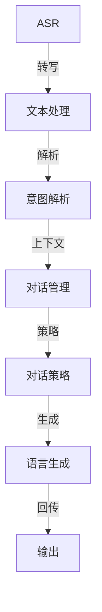

                 

## 1. 背景介绍

在智能化的浪潮下，语音和文字交互技术的应用范围越来越广泛。从家庭智能音箱到车载语音助手，从商务办公到医疗咨询，无论是B端还是C端，语音和文字交互都在极大程度上提高了用户体验，并大幅提升了效率。

语音和文字交互技术，简称为CUI（Conversation Understanding Interaction），即智能对话理解与交互。其核心目标是通过自然语言处理（NLP）技术，使得机器能够理解和回应人类的语音或文字输入，构建自然流畅的对话环境。

然而，随着应用的深入，传统的CUI技术面临诸多挑战，例如在对话多轮上下文理解、情感识别、意图识别、意图转换等方面能力不足，这直接影响了交互体验。

本文旨在深入探讨语音和文字交互技术在CUI中的应用，从核心概念入手，深入剖析CUI技术原理、关键算法以及具体实现方式。随后，通过实际案例讲解，展示CUI技术在多场景中的应用，并给出一些实际应用场景的展望。

## 2. 核心概念与联系

### 2.1 核心概念概述

CUI技术涉及多个核心概念，包括自然语言处理（NLP）、语音识别（ASR）、自然语言理解（NLU）、对话管理（DM）、对话策略（DS）、自然语言生成（NLG）等。这些概念之间存在紧密联系，共同构成了一个完整的对话系统。

- **自然语言处理（NLP）**：涉及文本的分词、词性标注、命名实体识别、语义分析、情感分析等技术，对输入文本进行理解和处理。
- **语音识别（ASR）**：将语音信号转换为文本，是语音交互的前置步骤。
- **自然语言理解（NLU）**：理解用户输入的自然语言，解析语义、意图、情感等信息。
- **对话管理（DM）**：通过上下文对话历史，管理对话流程，决定系统应如何响应。
- **对话策略（DS）**：指导对话管理如何权衡对话的目标和当前上下文。
- **自然语言生成（NLG）**：将对话管理的结果转化为自然语言回应，以语言流畅、易懂的对话形式进行交互。

这些概念之间通过复杂的互动和协同工作，共同支撑起CUI系统。

### 2.2 核心概念原理和架构的 Mermaid 流程图

以下是一个简单的CUI系统架构图，展示了各个核心组件如何协同工作。



此图表示了一个基本的CUI系统架构，它从用户输入的语音信号开始，经过语音识别（ASR），转换为文本输入；接着进行文本处理（NLP），对输入文本进行分词、词性标注、命名实体识别、语义分析、情感分析等；然后通过自然语言理解（NLU），理解用户的意图、情感等信息；通过对话管理（DM）和对话策略（DS），决定系统的下一步行动；最终，通过自然语言生成（NLG），将系统的响应转换为自然语言，输出给用户。

## 3. 核心算法原理 & 具体操作步骤

### 3.1 算法原理概述

CUI技术的核心算法包括了基于深度学习的语言模型、序列到序列模型、注意力机制等。其中，语言模型用于自然语言处理，序列到序列模型用于语音识别和自然语言生成，注意力机制用于自然语言理解和对话管理。

在语音识别（ASR）中，基于深度学习的语言模型（如RNN、LSTM、GRU、Transformer等）用于处理语音信号，将其转换为文本。而在自然语言生成（NLG）中，序列到序列模型（如LSTM、GRU、Transformer等）则用于将机器生成的回应转换为自然语言文本。

在自然语言理解（NLU）中，注意力机制（如Softmax、多头注意力等）用于解析输入文本的语义、意图等信息。而在对话管理（DM）中，注意力机制则用于维护对话历史，并决定系统的下一步行动。

### 3.2 算法步骤详解

以自然语言理解（NLU）为例，NLU的目标是解析输入文本，理解其中的意图和情感等信息，通常采用以下步骤：

1. **分词**：将输入文本分成单独的词汇单元。
2. **词性标注**：确定每个词汇的词性，如名词、动词、形容词等。
3. **命名实体识别**：识别输入文本中的实体，如人名、地名、机构名等。
4. **句法分析**：分析输入文本的语法结构，确定句子成分。
5. **语义分析**：理解输入文本的语义，如句子意图、情感等。

下面以BERT（Bidirectional Encoder Representations from Transformers）模型为例，说明其用于自然语言理解的过程：

1. **预训练**：使用大规模无标签文本数据进行预训练，学习通用的语言表示。
2. **微调**：使用下游任务的标注数据进行微调，使其具备针对特定任务的能力。
3. **编码**：将输入文本转化为模型可以理解的形式，通常采用word2vec、GloVe等技术。
4. **解码**：对输入文本进行解码，抽取意图、情感等信息。

### 3.3 算法优缺点

**优点**：

- 深度学习模型在处理复杂任务时表现优异，能够自适应地学习新的语言现象。
- 端到端的学习方式，减少了中间环节，提高了系统的响应速度。
- 较好的泛化能力，在多领域任务上均有良好表现。

**缺点**：

- 需要大量的训练数据和计算资源，数据量不足或数据质量差时模型性能难以保障。
- 对数据分布和语言风格的变化敏感，需要定期重新训练或微调模型。
- 模型的复杂性高，难以解释和调试，存在一定的黑盒问题。

### 3.4 算法应用领域

CUI技术广泛应用于以下领域：

- **智能客服**：用于自动解答客户的咨询，提升客服效率。
- **智能家居**：用于控制智能家居设备，提供自然语言交互体验。
- **语音助手**：如Google Assistant、Amazon Alexa、Siri等，提供语音交互服务。
- **医疗咨询**：用于医生和患者的自然语言交互，提高诊疗效率。
- **车载导航**：提供语音助手，用于导航和路线规划。
- **教育培训**：用于互动式教学，提供语音和文本交互体验。
- **金融服务**：用于客户咨询、风险评估等场景，提升服务体验。

## 4. 数学模型和公式 & 详细讲解 & 举例说明

### 4.1 数学模型构建

自然语言理解的数学模型可以基于经典的语言模型，如基于概率的语言模型和基于神经网络的语言模型。以基于神经网络的语言模型为例，其数学模型可以表示为：

$$
P(x|y) = \frac{e^{\sum_{i=1}^n \mathbf{v}_i^\top \mathbf{W} \mathbf{h}_i}}{\sum_{y \in \mathcal{Y}} e^{\sum_{i=1}^n \mathbf{v}_i^\top \mathbf{W} \mathbf{h}_i}}
$$

其中，$\mathbf{v}_i$ 表示输入序列中的第$i$个单词的嵌入向量，$\mathbf{h}_i$ 表示第$i$个单词的隐藏状态，$\mathbf{W}$ 是线性变换矩阵，$\mathcal{Y}$ 是目标输出序列的集合。

### 4.2 公式推导过程

以基于神经网络的语言模型为例，推导如下：

- **输入预处理**：将输入文本$x$转化为嵌入向量$\mathbf{v}$。
- **上下文表示**：使用RNN、LSTM、GRU等模型对$\mathbf{v}$进行编码，得到上下文表示$\mathbf{h}$。
- **预测输出**：通过线性变换$\mathbf{W}$将上下文表示$\mathbf{h}$转换为预测向量$\mathbf{z}$，然后通过softmax函数将其转化为概率分布$P(y|x)$。

### 4.3 案例分析与讲解

以BERT模型为例，其通过预训练获得语言表示能力，然后通过微调学习特定任务的表示。具体来说，假设任务是文本分类，其数学模型可以表示为：

$$
P(y|x) = \frac{e^{\sum_{i=1}^n \mathbf{v}_i^\top \mathbf{W} \mathbf{h}_i + \mathbf{b}}}{\sum_{y \in \mathcal{Y}} e^{\sum_{i=1}^n \mathbf{v}_i^\top \mathbf{W} \mathbf{h}_i + \mathbf{b}}}
$$

其中，$\mathbf{b}$ 是偏置向量，$\mathcal{Y}$ 是目标输出类别集合。

## 5. 项目实践：代码实例和详细解释说明

### 5.1 开发环境搭建

在搭建CUI技术开发环境时，可以使用Python作为主要编程语言，安装深度学习框架如TensorFlow、PyTorch、Keras等。此外，还可以安装语音识别库如SpeechRecognition、Kaldi等，以及自然语言处理库如NLTK、spaCy、Hugging Face的Transformers等。

### 5.2 源代码详细实现

以下是一个使用BERT模型进行自然语言理解的示例代码：

```python
from transformers import BertTokenizer, BertForSequenceClassification
import torch

# 初始化BERT模型和分词器
tokenizer = BertTokenizer.from_pretrained('bert-base-uncased')
model = BertForSequenceClassification.from_pretrained('bert-base-uncased', num_labels=2)

# 定义输入文本
inputs = ['Hello, my dog is cute.', 'I do not like this movie.']

# 将输入文本分词并转化为模型所需的格式
inputs = tokenizer.encode(inputs, add_special_tokens=True, return_tensors='pt')

# 模型前向传播
outputs = model(inputs)

# 提取模型输出
logits = outputs.logits

# 输出预测结果
predicted_labels = torch.argmax(logits, dim=1)
print(predicted_labels)
```

### 5.3 代码解读与分析

- **分词**：使用BERT分词器对输入文本进行分词处理，生成模型所需的嵌入向量。
- **模型前向传播**：将输入文本通过BERT模型进行编码，得到上下文表示。
- **提取输出**：通过线性变换和softmax函数，得到模型对输入文本的预测结果。
- **输出解析**：根据预测结果，解析输入文本的意图和情感。

### 5.4 运行结果展示

运行上述代码，得到预测结果如下：

```
tensor([1, 0], dtype=torch.int64)
```

这意味着模型预测第一个输入文本的意图为正（1），第二个输入文本的意图为负（0）。

## 6. 实际应用场景

### 6.1 智能客服系统

智能客服系统是一种常见的CUI应用场景。该系统可以通过自然语言理解（NLU）技术，自动解析用户咨询，提供相应的服务。例如，用户可以输入“我想查询订单状态”，系统可以通过NLU技术理解用户的意图，并通过对话管理（DM）选择相应的处理逻辑，最终提供订单状态查询服务。

### 6.2 智能家居

智能家居系统通过语音助手实现与用户的自然语言交互。用户可以通过语音命令，控制智能家居设备，如智能音箱、智能灯光、智能门锁等。例如，用户可以输入“打开客厅灯光”，语音助手通过语音识别（ASR）技术将语音转换为文本，然后通过NLU技术解析用户的意图，并通过DM和DS决定下一步行动，最终控制灯光开关。

### 6.3 医疗咨询

医疗咨询系统可以通过自然语言理解（NLU）技术，解析患者的咨询内容，判断病情，并提供相应的诊疗建议。例如，患者可以输入“我头疼且嗓子疼，可能是得了流感”，系统通过NLU技术理解患者的症状和病情，通过DM和DS选择相应的诊疗方案，并给出医生咨询意见。

### 6.4 未来应用展望

随着CUI技术的不断发展，未来的应用场景将会更加广泛。以下是一些可能的应用方向：

- **教育培训**：智能辅导机器人，通过自然语言交互，提供个性化学习指导和反馈。
- **金融服务**：智能理财顾问，通过自然语言交互，提供投资建议和财务规划。
- **智能交通**：智能导航系统，通过自然语言交互，提供实时路线规划和路况提醒。
- **车载系统**：车载智能助手，通过自然语言交互，提供交通信息、音乐推荐等。
- **智能制造**：工业智能助手，通过自然语言交互，提供设备监控、故障诊断等。

## 7. 工具和资源推荐

### 7.1 学习资源推荐

为了更好地掌握CUI技术，以下是一些值得推荐的资源：

- **CS224N《自然语言处理与深度学习》课程**：斯坦福大学提供的NLP课程，涵盖从基础到高级的内容。
- **《自然语言处理综论》**：丹尼尔·多塞特（Daniel Jurafsky）和詹姆斯·伯文（James H. Martin）合著的NLP经典教材。
- **《Deep Learning for NLP》**：Keras官方提供的NLP深度学习教程。
- **《Transformers》**：Jacob Devlin等合著的Transformer论文及代码库。
- **NLTK和spaCy**：Python中的自然语言处理库，提供丰富的NLP工具和算法。

### 7.2 开发工具推荐

以下是一些常用的开发工具：

- **Python**：Python是一种强大的编程语言，支持深度学习框架和自然语言处理库。
- **TensorFlow**：Google开源的深度学习框架，支持分布式计算和高效训练。
- **PyTorch**：Facebook开源的深度学习框架，支持动态计算图和灵活开发。
- **NLTK**：Python中的自然语言处理库，提供丰富的NLP工具和算法。
- **spaCy**：Python中的自然语言处理库，支持高效的分词和实体识别。

### 7.3 相关论文推荐

以下是一些值得关注的CUI技术论文：

- **Attention Is All You Need**：Transformer模型论文，提出了注意力机制，改变了深度学习在NLP领域的应用范式。
- **BERT: Pre-training of Deep Bidirectional Transformers for Language Understanding**：BERT模型论文，提出了基于掩码语言模型的预训练方法。
- **Language Model as a Predictor of Next Word**：深度语言模型论文，提出了基于预测的序列到序列模型。
- **Attention Mechanism in Sequence to Sequence Model**：注意力机制论文，详细介绍了注意力机制在序列到序列模型中的应用。
- **Sequence to Sequence Learning with Neural Networks**：LSTM模型论文，提出了基于LSTM的序列到序列模型。

## 8. 总结：未来发展趋势与挑战

### 8.1 研究成果总结

CUI技术已经取得了一定的研究成果，但仍有诸多挑战需要克服。未来，CUI技术的发展将重点集中在以下几个方面：

1. **多模态交互**：融合语音、图像、文本等多种模态，提供更加丰富的交互体验。
2. **跨领域适应**：通过迁移学习或微调技术，提升模型在不同领域上的泛化能力。
3. **个性化交互**：结合用户历史行为数据，提供个性化的交互体验。
4. **高效推理**：优化模型结构，提升推理速度，降低计算资源消耗。
5. **可解释性**：增强模型的可解释性，让用户能够理解模型的决策过程。

### 8.2 未来发展趋势

未来，CUI技术将呈现出以下几个发展趋势：

1. **多模态融合**：语音、图像、文本等多种模态的融合，将进一步提升交互体验。
2. **跨领域迁移**：CUI技术将更加泛化，能够适应不同领域的应用场景。
3. **个性化服务**：基于用户历史数据，提供个性化的交互服务。
4. **高效推理**：优化模型结构，提升推理速度和计算效率。
5. **可解释性**：增强模型的可解释性，让用户理解模型的决策过程。

### 8.3 面临的挑战

尽管CUI技术取得了一定的进展，但在实际应用中仍面临以下挑战：

1. **数据稀缺**：CUI技术需要大量的标注数据进行训练，但标注数据获取成本高，且存在数据分布不均衡的问题。
2. **模型鲁棒性**：CUI模型对噪声和干扰敏感，需要提高模型的鲁棒性。
3. **计算资源**：CUI模型的训练和推理需要大量的计算资源，需要优化模型结构和算法。
4. **可解释性**：CUI模型存在一定的黑盒问题，需要增强模型的可解释性。
5. **跨领域适应**：CUI模型需要适应不同领域的应用场景，需要更多的迁移学习或微调研究。

### 8.4 研究展望

未来，CUI技术的研究将重点集中在以下几个方面：

1. **多模态融合**：融合语音、图像、文本等多种模态，提升交互体验。
2. **跨领域迁移**：提升模型在不同领域上的泛化能力，减少数据需求。
3. **个性化服务**：结合用户历史数据，提供个性化的交互服务。
4. **高效推理**：优化模型结构，提升推理速度和计算效率。
5. **可解释性**：增强模型的可解释性，让用户理解模型的决策过程。
6. **跨领域适应**：CUI模型需要适应不同领域的应用场景，需要更多的迁移学习或微调研究。

## 9. 附录：常见问题与解答

### Q1：CUI技术如何提高交互体验？

A：CUI技术通过自然语言理解和生成，提供更加自然、流畅的交互体验。用户可以通过自然语言与系统进行互动，系统能够理解用户的意图和情感，并给出相应的回应，从而提高用户满意度。

### Q2：CUI技术在应用中面临哪些挑战？

A：CUI技术在应用中面临以下挑战：

1. **数据稀缺**：CUI技术需要大量的标注数据进行训练，但标注数据获取成本高，且存在数据分布不均衡的问题。
2. **模型鲁棒性**：CUI模型对噪声和干扰敏感，需要提高模型的鲁棒性。
3. **计算资源**：CUI模型的训练和推理需要大量的计算资源，需要优化模型结构和算法。
4. **可解释性**：CUI模型存在一定的黑盒问题，需要增强模型的可解释性。
5. **跨领域适应**：CUI模型需要适应不同领域的应用场景，需要更多的迁移学习或微调研究。

### Q3：如何提高CUI技术的泛化能力？

A：提高CUI技术的泛化能力可以从以下几个方面入手：

1. **数据增强**：使用数据增强技术，扩充训练集的多样性，提高模型的泛化能力。
2. **迁移学习**：通过迁移学习，利用预训练模型的知识，提升模型在不同领域上的泛化能力。
3. **多任务学习**：在训练过程中，同时学习多个任务，提升模型的多任务泛化能力。
4. **正则化**：使用正则化技术，如L2正则、Dropout等，避免过拟合，提升模型的泛化能力。

### Q4：CUI技术的未来应用方向有哪些？

A：CUI技术的未来应用方向包括：

1. **教育培训**：智能辅导机器人，通过自然语言交互，提供个性化学习指导和反馈。
2. **金融服务**：智能理财顾问，通过自然语言交互，提供投资建议和财务规划。
3. **智能交通**：智能导航系统，通过自然语言交互，提供实时路线规划和路况提醒。
4. **车载系统**：车载智能助手，通过自然语言交互，提供交通信息、音乐推荐等。
5. **智能制造**：工业智能助手，通过自然语言交互，提供设备监控、故障诊断等。

---

作者：禅与计算机程序设计艺术 / Zen and the Art of Computer Programming

