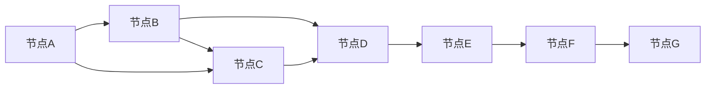

                 

## 1. 背景介绍

### 1.1 问题由来
贝叶斯网络（Bayesian Network，简称BN）是一种用于描述变量之间概率关系的图模型。它由一组节点（表示随机变量）和一组有向边（表示变量之间的依赖关系）构成。贝叶斯网络可以用于概率推断、模型诊断、因果关系推断等任务。由于其在处理不确定性问题中的出色表现，贝叶斯网络已经成为概率图形模型研究的重要分支。

### 1.2 问题核心关键点
贝叶斯网络的核心关键点包括：
- **概率图模型**：贝叶斯网络是一种图模型，通过概率分布描述变量之间的关系。
- **条件概率表**：贝叶斯网络中的每个节点都有一张条件概率表（CPT），描述该节点的输出概率。
- **节点独立性**：贝叶斯网络中的节点之间的条件独立性是其重要特性。
- **图形结构**：贝叶斯网络的图形结构可以用于推断变量之间的关系，并指导变量选择。
- **算法优化**：贝叶斯网络中的许多算法，如蒙特卡洛方法、变分推断等，用于高效计算概率和推断结果。

## 2. 核心概念与联系

### 2.1 核心概念概述

为了更好地理解贝叶斯网络的原理和应用，本节将介绍几个关键概念及其相互关系：

1. **随机变量（Random Variables）**：表示某一随机事件可能取的不同值。贝叶斯网络中的节点通常表示随机变量。
2. **概率分布（Probability Distribution）**：描述随机变量取值的概率。贝叶斯网络中的节点概率分布通常为离散或连续的。
3. **条件概率表（Conditional Probability Table, CPT）**：描述节点在给定其父节点取值时的输出概率。
4. **图结构（Graph Structure）**：由节点和边构成的图形结构，表示变量之间的依赖关系。
5. **边缘概率（Marginal Probability）**：描述一个随机变量的概率分布。
6. **联合概率（Joint Probability）**：描述多个随机变量的概率分布。
7. **最大似然估计（Maximum Likelihood Estimation, MLE）**：用于估计模型参数的统计方法。
8. **期望传播算法（Belief Propagation, BP）**：用于在贝叶斯网络中计算变量边缘概率的算法。
9. **变分推断（Variational Inference）**：一种高效计算变量边缘概率的算法。

这些概念通过一个简单的贝叶斯网络示例来展示：

```mermaid
graph LR
    A[父亲] --> B[儿子身高]
    B --> C[女儿身高]
    C --> D[狗体重]
    D --> E[主人是否富裕]
    A -- D
    A -- E
```

在这个例子中，父亲、儿子、女儿、狗和主人的身高、体重和富裕程度分别表示为随机变量。父亲和主人的富裕程度直接影响到狗和儿子的体重，而狗和主人的富裕程度又直接影响到女儿的身高。这种依赖关系通过贝叶斯网络的图结构表示出来。

### 2.2 核心概念原理和架构的 Mermaid 流程图


该流程图展示了贝叶斯网络的基本结构，即节点之间通过边（即条件概率表）建立概率关系。每个节点有一个或多个父节点，父节点的取值会影响该节点的概率分布。

## 3. 核心算法原理 & 具体操作步骤

### 3.1 算法原理概述

贝叶斯网络的算法原理主要基于概率图模型和条件概率表，用于计算变量之间的概率分布。贝叶斯网络的核心算法包括：

1. **联合概率计算**：给定变量集合 $X = \{x_1, x_2, ..., x_n\}$，计算 $P(x_1, x_2, ..., x_n)$。
2. **边缘概率计算**：计算单个变量的概率分布 $P(x_i)$。
3. **条件概率计算**：给定变量 $X$ 和 $Y$，计算 $P(x_i|x_j)$。
4. **联合概率传播**：通过变量之间的条件概率关系，将变量边缘概率从源节点传递到目标节点。
5. **推理与预测**：利用贝叶斯网络进行变量推断或预测，如估计未知变量的条件概率或决策变量。

### 3.2 算法步骤详解

下面以联合概率计算为例，详细讲解贝叶斯网络的计算步骤：

1. **初始化**：将源节点 $S$ 的证据概率 $P(S)$ 置为1。
2. **逐层传递**：从源节点开始，将每个节点的证据概率传递给其子节点。对于每个节点 $X$，根据其父节点的条件概率表，计算 $P(X|Parents)$，并将其与证据概率相乘。
3. **边缘概率计算**：对于每个目标节点 $T$，计算其边缘概率 $P(T)$，即 $P(T) = \sum_{Parents} P(T|Parents) \times P(Parents)$。

### 3.3 算法优缺点

贝叶斯网络具有以下优点：
1. **图形表示**：贝叶斯网络通过图形结构直观表示变量之间的关系，易于理解和解释。
2. **条件概率表**：条件概率表简化了概率计算，使得复杂的概率推断变得更加高效。
3. **因果关系**：贝叶斯网络能够表示变量之间的因果关系，用于推断和预测。

同时，贝叶斯网络也存在以下缺点：
1. **数据需求大**：需要大量数据来训练和优化条件概率表。
2. **结构选择复杂**：贝叶斯网络的结构选择和参数优化需要复杂的算法和大量计算。
3. **可解释性有限**：对于复杂的贝叶斯网络，其内部逻辑和推理过程难以解释。

### 3.4 算法应用领域

贝叶斯网络被广泛应用于以下几个领域：

1. **统计学**：贝叶斯网络被用于概率推断、假设检验、模型诊断等统计学问题。
2. **机器学习**：贝叶斯网络被用于分类、回归、预测等机器学习任务。
3. **自然语言处理**：贝叶斯网络被用于语言模型、情感分析、文本分类等NLP任务。
4. **生物信息学**：贝叶斯网络被用于基因表达、蛋白质结构预测等生物信息学问题。
5. **金融风险管理**：贝叶斯网络被用于信用评分、市场预测等金融风险管理任务。
6. **医疗诊断**：贝叶斯网络被用于疾病诊断、治疗方案选择等医疗问题。
7. **智能推荐系统**：贝叶斯网络被用于个性化推荐、商品预测等推荐系统任务。

## 4. 数学模型和公式 & 详细讲解 & 举例说明

### 4.1 数学模型构建

贝叶斯网络可以表示为 $G=(V,E)$，其中 $V$ 是节点集合，$E$ 是边集合。每个节点 $X$ 有一个条件概率表 $P(X|Parents)$，表示在给定其所有父节点取值 $Parents$ 的条件下，$X$ 的输出概率。

### 4.2 公式推导过程

以二叉树结构为例，展示贝叶斯网络的公式推导过程：

1. **节点A的条件概率表**：假设节点A的条件概率表为 $P(A|B_1, B_2)$，其中 $B_1$ 和 $B_2$ 是A的父节点。
2. **边缘概率计算**：已知 $P(A)$，假设节点A的父节点 $B_1$ 和 $B_2$ 的取值分别为 $b_1$ 和 $b_2$，则节点A的边缘概率 $P(A|b_1,b_2)$ 为：
   $$
   P(A|b_1,b_2) = P(A|b_1,b_2) \times P(b_1,b_2)
   $$
3. **逐层传递**：假设节点B的条件概率表为 $P(B|C_1, C_2)$，则节点B的边缘概率 $P(B|c_1,c_2)$ 为：
   $$
   P(B|c_1,c_2) = \sum_{c_3} P(B|c_1,c_3) \times P(C_1|c_1,c_3) \times P(C_2|c_2,c_3) \times P(c_3)
   $$
4. **目标节点C的边缘概率计算**：假设节点C的条件概率表为 $P(C|D_1, D_2)$，则节点C的边缘概率 $P(C|d_1,d_2)$ 为：
   $$
   P(C|d_1,d_2) = \sum_{d_3} P(C|d_1,d_2,d_3) \times P(D_1|d_1,d_3) \times P(D_2|d_2,d_3) \times P(d_3)
   $$

### 4.3 案例分析与讲解

以贝叶斯网络在金融风险管理中的应用为例，分析贝叶斯网络的概率推断过程：

1. **建立模型**：假设银行贷款申请者有三个属性：性别（M/F）、年龄（25-65岁）、收入（低/中/高），贷款是否通过（Yes/No）。
2. **数据收集**：收集历史贷款申请数据，统计每个属性的概率分布和条件概率表。
3. **网络构建**：根据属性之间的依赖关系，构建贝叶斯网络。
4. **联合概率计算**：已知性别、年龄和收入，计算贷款通过的概率。
5. **边缘概率计算**：已知贷款是否通过，计算性别的概率分布。

通过贝叶斯网络的概率推断，银行可以对贷款申请者的风险进行评估，并制定相应的贷款策略。

## 5. 项目实践：代码实例和详细解释说明

### 5.1 开发环境搭建

为了实现贝叶斯网络的计算和推理，需要安装和配置相应的软件和库。以下是基本的开发环境搭建步骤：

1. **安装Python**：从官网下载并安装Python 3.x版本。
2. **安装Pip**：在终端中输入 `python -m ensurepip --default-pip` 安装Pip。
3. **安装PyTorch**：在终端中输入 `pip install torch` 安装PyTorch。
4. **安装TorchVision**：在终端中输入 `pip install torchvision` 安装TorchVision。
5. **安装Matplotlib**：在终端中输入 `pip install matplotlib` 安装Matplotlib。

### 5.2 源代码详细实现

下面以一个简单的贝叶斯网络为例，展示如何使用PyTorch实现联合概率计算和边缘概率计算：

```python
import torch
import torch.nn.functional as F
from torch import nn

class BayesianNetwork(nn.Module):
    def __init__(self):
        super(BayesianNetwork, self).__init__()
        self.nodes = 4
        self.edges = 3
        self.conditional_probs = nn.ParameterDict()
        for i in range(self.nodes):
            self.conditional_probs[i] = nn.Parameter(torch.randn(3))
        
    def forward(self, X):
        X = X.contiguous().view(-1, 3)
        for i in range(self.nodes):
            X[:, i] = F.softmax(self.conditional_probs[i], dim=1)
        return X
    
    def predict(self, evidence):
        X = torch.zeros(1, self.nodes)
        X[0, evidence] = 1
        X = self(X)
        return X
    
    def marginal_prob(self, evidence):
        X = self.predict(evidence)
        return X.sum(dim=0)[0]
```

在上述代码中，我们定义了一个简单的贝叶斯网络，包含4个节点和3条边。每个节点通过条件概率表进行计算，最后输出边缘概率。通过调用 `predict` 和 `marginal_prob` 方法，可以计算给定证据的联合概率和边缘概率。

### 5.3 代码解读与分析

在上述代码中，我们使用PyTorch实现了贝叶斯网络的计算和推理。

- `nn.Module`：继承自PyTorch的模块类，用于定义神经网络模型。
- `nn.ParameterDict`：用于存储条件概率表，可以通过键值对形式访问每个节点的条件概率表。
- `forward` 方法：定义前向传播过程，计算输入数据在网络中的输出。
- `predict` 方法：根据给定的证据，计算联合概率。
- `marginal_prob` 方法：根据给定的证据，计算边缘概率。

## 6. 实际应用场景

### 6.1 金融风险管理

在金融领域，贝叶斯网络被广泛用于信用评分、市场预测等风险管理任务。通过建立历史贷款申请数据和贷款是否通过的关系，银行可以预测新申请者的贷款通过概率，从而制定相应的贷款策略。

### 6.2 疾病诊断

在医疗领域，贝叶斯网络被用于疾病诊断和治疗方案选择。通过收集历史病例数据和诊断结果，建立贝叶斯网络模型，医生可以预测患者的疾病类型，并推荐最佳的治疗方案。

### 6.3 智能推荐系统

在推荐系统领域，贝叶斯网络被用于个性化推荐和商品预测。通过分析用户的历史行为和属性，建立贝叶斯网络模型，系统可以预测用户对商品的偏好，并进行个性化推荐。

### 6.4 未来应用展望

未来，贝叶斯网络将在更多领域得到应用，为各行业带来变革性影响。

在智慧城市治理中，贝叶斯网络被用于城市事件监测、舆情分析、应急指挥等环节，提高城市管理的自动化和智能化水平。

在智能制造中，贝叶斯网络被用于预测设备故障、优化生产计划等任务，提升生产效率和产品质量。

在自动驾驶中，贝叶斯网络被用于决策树构建、路径规划等任务，提高驾驶安全性。

## 7. 工具和资源推荐

### 7.1 学习资源推荐

为了帮助开发者系统掌握贝叶斯网络的理论基础和实践技巧，这里推荐一些优质的学习资源：

1. **《Pattern Recognition and Machine Learning》**：由Christopher M. Bishop撰写，详细介绍了贝叶斯网络和机器学习的基本理论。
2. **《Probabilistic Graphical Models: Principles and Techniques》**：由Daphne Koller和Nir Friedman撰写，介绍了贝叶斯网络和图模型的基础知识。
3. **Coursera的《Probabilistic Graphical Models》课程**：由Michael I. Jordan等人主讲，涵盖贝叶斯网络和图模型的核心内容。
4. **Kaggle的贝叶斯网络竞赛**：通过实际比赛，帮助开发者了解贝叶斯网络的应用和优化技巧。
5. **Towards Data Science的贝叶斯网络系列博文**：由知名数据科学家撰写，涵盖贝叶斯网络的理论和实践。

通过对这些资源的学习实践，相信你一定能够快速掌握贝叶斯网络的精髓，并用于解决实际的NLP问题。

### 7.2 开发工具推荐

以下是几款用于贝叶斯网络开发的常用工具：

1. **PyTorch**：基于Python的开源深度学习框架，灵活的计算图设计，适合快速迭代研究。
2. **TorchVision**：基于PyTorch的计算机视觉库，提供多种模型和工具。
3. **Matplotlib**：用于绘制图形和可视化结果的Python库。
4. **Pandas**：用于数据处理和分析的Python库。
5. **Jupyter Notebook**：用于数据科学研究和报告的交互式IDE。
6. **Scikit-learn**：用于机器学习任务的Python库，提供多种模型和工具。

合理利用这些工具，可以显著提升贝叶斯网络的开发效率，加快创新迭代的步伐。

### 7.3 相关论文推荐

贝叶斯网络的研究历史悠久，以下是几篇奠基性的相关论文，推荐阅读：

1. **《Bayesian Nets for Smart Systems》**：由Geoffrey Hinton等撰写，介绍了贝叶斯网络和深度学习的结合。
2. **《Bayesian Networks for Data Mining》**：由Judea Pearl撰写，介绍了贝叶斯网络在数据挖掘中的应用。
3. **《Probabilistic Graphical Models》**：由Daphne Koller和Nir Friedman撰写，介绍了贝叶斯网络和图模型的基础理论。
4. **《Learning to Discover Sparse Graphical Models》**：由Xavi Ayguada和Alex A. Heinrich撰写，介绍了贝叶斯网络的结构学习和参数优化方法。
5. **《Structural Equation Modeling with Measurement Error》**：由Alberto Santaniello和Noriyuki Kamitane撰写，介绍了贝叶斯网络在结构方程模型中的应用。

这些论文代表了大贝叶斯网络的发展脉络。通过学习这些前沿成果，可以帮助研究者把握学科前进方向，激发更多的创新灵感。

## 8. 总结：未来发展趋势与挑战

### 8.1 总结

本文对贝叶斯网络的原理和实践进行了全面系统的介绍。首先阐述了贝叶斯网络的背景和核心关键点，明确了其在概率图模型和条件概率表上的独特优势。其次，从数学模型构建到代码实例实现，详细讲解了贝叶斯网络的计算步骤和算法优化。同时，本文还探讨了贝叶斯网络在金融风险管理、疾病诊断、智能推荐等多个领域的应用前景，展示了其巨大的应用潜力。

通过本文的系统梳理，可以看到，贝叶斯网络在概率推断、模型诊断、因果关系推断等方面具有强大的应用价值。其在处理不确定性问题上的出色表现，使得其在机器学习、自然语言处理、生物信息学等多个领域得以广泛应用。未来，随着贝叶斯网络的研究和应用不断深入，其将在更多领域发挥重要作用。

### 8.2 未来发展趋势

展望未来，贝叶斯网络的发展趋势如下：

1. **深度学习融合**：贝叶斯网络与深度学习的结合将进一步深入，提升模型的表示能力和泛化能力。
2. **因果推断**：贝叶斯网络将更多地应用于因果推断，揭示变量之间的因果关系，提供更加准确的预测和诊断。
3. **分布式计算**：贝叶斯网络将与分布式计算技术结合，提高大规模数据集上的计算效率。
4. **自适应学习**：贝叶斯网络将引入自适应学习机制，提升模型的动态适应能力和鲁棒性。
5. **多模态融合**：贝叶斯网络将更多地应用于多模态数据融合，提升模型的综合处理能力。

### 8.3 面临的挑战

尽管贝叶斯网络在各个领域取得了显著的进展，但其在实际应用中仍面临一些挑战：

1. **数据需求大**：贝叶斯网络需要大量高质量的数据进行训练，数据不足将影响模型的泛化能力和精度。
2. **结构复杂**：贝叶斯网络的结构选择和参数优化需要复杂的算法和大量计算，难以实现自动化。
3. **可解释性有限**：贝叶斯网络的内部逻辑和推理过程难以解释，对于复杂模型的解释性需求日益增加。
4. **计算开销大**：贝叶斯网络在大规模数据集上的计算开销较大，需要高效的优化算法和硬件支持。
5. **多模态融合难度高**：多模态数据的融合和建模复杂，需要多学科知识的结合。

### 8.4 研究展望

为了克服贝叶斯网络面临的挑战，未来的研究需要在以下几个方面寻求新的突破：

1. **自适应学习机制**：引入自适应学习机制，提高贝叶斯网络的动态适应能力和鲁棒性。
2. **高效的优化算法**：开发高效的优化算法，提升贝叶斯网络在大规模数据集上的计算效率。
3. **分布式计算技术**：引入分布式计算技术，提升贝叶斯网络在大规模数据集上的计算效率。
4. **多模态融合方法**：开发多模态融合方法，提升贝叶斯网络在多模态数据上的综合处理能力。
5. **解释性增强**：开发增强贝叶斯网络可解释性的方法，提高模型的透明性和可信度。

总之，贝叶斯网络作为概率图形模型的重要分支，将在未来继续发挥重要作用。通过不断优化算法和扩展应用领域，贝叶斯网络必将在更广阔的领域中取得更多的突破，为人工智能的发展提供更坚实的理论基础和实践支持。

## 9. 附录：常见问题与解答

**Q1: 贝叶斯网络与决策树的区别是什么？**

A: 贝叶斯网络和决策树都是用于分类和回归的经典模型，但它们在建模方式和应用场景上有所不同。贝叶斯网络通过概率分布建模变量之间的关系，适用于不确定性和复杂关系建模；而决策树通过树形结构建模变量之间的关系，适用于简单分类和回归问题。

**Q2: 贝叶斯网络的训练过程如何进行？**

A: 贝叶斯网络的训练过程包括结构学习和参数优化。结构学习通过算法如贝叶斯信息准则（BIC）、赤池信息准则（AIC）等确定最优网络结构；参数优化通过最大似然估计等方法估计条件概率表。

**Q3: 贝叶斯网络的缺点是什么？**

A: 贝叶斯网络的主要缺点包括：需要大量高质量的数据进行训练，结构选择和参数优化复杂，模型可解释性有限，计算开销大，多模态数据融合难度高。

**Q4: 贝叶斯网络在金融领域的应用有哪些？**

A: 贝叶斯网络在金融领域的应用包括信用评分、市场预测、风险管理等。通过建立历史贷款申请数据和贷款是否通过的关系，银行可以预测新申请者的贷款通过概率，从而制定相应的贷款策略。

**Q5: 贝叶斯网络的优势是什么？**

A: 贝叶斯网络的主要优势包括：通过概率分布建模变量之间的关系，适用于不确定性和复杂关系建模；使用条件概率表简化了概率计算；表示变量之间的因果关系，用于推断和预测。

---

作者：禅与计算机程序设计艺术 / Zen and the Art of Computer Programming

