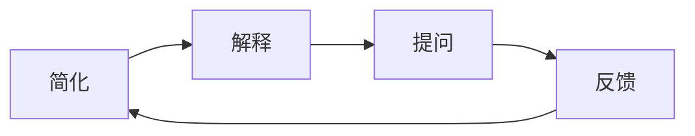

                 

## 1. 背景介绍

在人工智能领域，尤其是深度学习与机器学习的实践中，如何提高学习与理解的效果是一个长期且重要的研究方向。费曼学习法（Feynman Technique），作为一种深度理解与掌握知识的方法，受到了众多研究者的青睐。费曼学习法由诺贝尔奖得主理查德·费曼提出，旨在通过模拟教师向学生讲解的方式，使学习者深入理解知识。

在AI领域，费曼学习法被广泛应用于模型训练、算法优化、知识迁移等多个方面。通过将费曼学习法与AI技术结合，AI模型的理解与优化得以显著提升，模型泛化能力与性能表现也随之增强。本文将深入探讨费曼学习法与AI技术结合的原理、操作步骤以及其优缺点，并探讨其在实际应用中的广泛应用。

## 2. 核心概念与联系

### 2.1 核心概念概述

费曼学习法，简而言之，即通过模拟教师向学生讲解的方式，使学习者深入理解知识。该方法由诺贝尔奖得主理查德·费曼提出，旨在通过简化的语言和生动的例子，使复杂深奥的知识变得易于理解和掌握。费曼学习法主要包括四个步骤：简化、解释、提问、反馈。

在AI领域，费曼学习法的核心概念被广泛应用于模型训练与优化。例如，通过模拟教师向模型讲解任务，模型可以更清晰地理解任务目标与实现路径，从而提升模型性能与泛化能力。

### 2.2 核心概念原理和架构的 Mermaid 流程图



此流程图展示了费曼学习法的核心步骤，从简化、解释到提问和反馈，形成一个闭环。将这一方法应用于AI模型的训练与优化中，通过不断模拟教师与模型的互动，AI模型能够更深入地理解任务目标，从而提升模型性能。

## 3. 核心算法原理 & 具体操作步骤

### 3.1 算法原理概述

费曼学习法与AI结合的算法原理，主要是通过模型训练过程中引入“教师”角色，模拟教师向模型讲解任务的方式，使模型逐步理解任务目标与实现路径。这一过程，也被称为“知识迁移”（Knowledge Transfer）。

在具体的训练过程中，模型通过不断接收“教师”的讲解，逐步理解任务的本质与实现方式。这一过程可以分为两个阶段：第一阶段为“知识获取”，即模型通过大量数据学习任务特征与规律；第二阶段为“知识应用”，即模型通过“教师”的讲解，理解任务的实现路径与优化策略。

### 3.2 算法步骤详解

费曼学习法与AI结合的具体操作步骤如下：

#### 3.2.1 数据准备

1. 收集任务相关的训练数据，确保数据的多样性与代表性。
2. 对数据进行预处理，包括数据清洗、归一化、分词等操作，确保数据的质量与格式一致。
3. 将数据分为训练集、验证集和测试集，确保模型在不同数据集上的泛化能力。

#### 3.2.2 模型初始化

1. 选择或设计合适的模型架构，例如卷积神经网络（CNN）、循环神经网络（RNN）、Transformer等。
2. 初始化模型参数，通常使用随机初始化或预训练初始化。
3. 将模型参数设置为固定，保持预训练权重不变，只微调顶层参数。

#### 3.2.3 知识获取

1. 在训练集上使用预训练权重进行模型训练，获得初步的任务特征与规律。
2. 对模型进行正则化处理，防止过拟合，包括L2正则化、Dropout等。
3. 引入数据增强技术，如回译、近义替换等，扩充训练数据集。

#### 3.2.4 知识应用

1. 设计“教师”角色，例如通过软标签、弱监督信号等方式，向模型讲解任务目标与实现路径。
2. 在验证集上评估模型性能，根据评估结果调整模型参数，优化模型结构。
3. 引入对抗训练、对抗样本等技术，提升模型的鲁棒性与泛化能力。

#### 3.2.5 反馈与迭代

1. 在测试集上评估模型的最终性能，对比训练前后的效果。
2. 根据反馈结果，重新设计“教师”讲解策略，优化模型训练过程。
3. 循环迭代上述步骤，直至模型达到理想的性能表现。

### 3.3 算法优缺点

#### 3.3.1 优点

1. **提升模型理解能力**：通过模拟教师讲解，模型能够更清晰地理解任务目标与实现路径，从而提升模型的理解能力与泛化能力。
2. **减少训练成本**：利用预训练权重，可以减少大量的人工标注数据需求，降低训练成本。
3. **优化模型结构**：通过不断调整“教师”讲解策略，模型结构得以不断优化，提升模型的性能表现。

#### 3.3.2 缺点

1. **依赖预训练权重**：费曼学习法依赖于预训练权重，预训练模型的质量直接影响最终模型的表现。
2. **模型复杂度高**：引入“教师”角色与反馈机制，模型的复杂度增加，需要更多的计算资源与时间。
3. **可能存在偏差**：“教师”讲解的策略可能存在主观偏差，影响模型的公平性与鲁棒性。

### 3.4 算法应用领域

费曼学习法与AI结合的算法，广泛应用在以下几个领域：

1. **自然语言处理（NLP）**：用于语言模型的训练与优化，提升模型的语言理解能力与生成能力。
2. **计算机视觉（CV）**：应用于图像分类、目标检测、图像生成等任务，提升模型的视觉理解能力。
3. **推荐系统**：通过模拟用户与推荐系统的互动，提升模型的推荐效果与用户体验。
4. **医疗诊断**：应用于医疗影像分析、疾病预测等任务，提升模型的诊断准确性与效率。
5. **金融风控**：应用于信用评分、风险预测等任务，提升模型的风险评估能力。

## 4. 数学模型和公式 & 详细讲解 & 举例说明

### 4.1 数学模型构建

费曼学习法与AI结合的数学模型，主要围绕着“教师”讲解策略与模型训练过程进行构建。以下为一个简单的数学模型构建示例：

设模型为 $f(\theta)$，其中 $\theta$ 为模型参数。假设“教师”通过弱监督信号 $\lambda$ 向模型讲解任务，则模型的训练目标函数可以表示为：

$$
L(\theta, \lambda) = \mathbb{E}_{(x, y)}[\ell(f(\theta), y, \lambda)] + \alpha \mathcal{R}(\theta)
$$

其中，$\ell$ 为损失函数，$\mathbb{E}$ 为期望运算符，$\alpha$ 为正则化系数，$\mathcal{R}$ 为正则化项。

### 4.2 公式推导过程

在上述模型中，第一项表示模型的预测输出与真实标签之间的差距，第二项表示正则化项，确保模型的复杂度。假设数据集 $D = \{(x_i, y_i)\}_{i=1}^N$，则模型的损失函数可以表示为：

$$
L(\theta) = \frac{1}{N}\sum_{i=1}^N \ell(f(\theta), y_i, \lambda_i)
$$

其中，$\lambda_i$ 为第 $i$ 个样本的弱监督信号，可以是一个概率值或一个标签。通过最小化损失函数 $L(\theta)$，模型能够逐步学习任务特征与规律。

### 4.3 案例分析与讲解

以自然语言处理（NLP）中的情感分析任务为例，探讨费曼学习法的应用。

1. **数据准备**：收集情感分析相关的数据集，例如IMDB电影评论数据集。
2. **模型初始化**：选择或设计合适的模型架构，例如BiLSTM+Softmax。
3. **知识获取**：在训练集上使用预训练权重进行模型训练，获得初步的情感分类能力。
4. **知识应用**：设计“教师”角色，通过弱监督信号 $\lambda$ 向模型讲解情感分析任务。
5. **反馈与迭代**：在验证集上评估模型性能，根据评估结果调整模型参数，优化模型结构。

## 5. 项目实践：代码实例和详细解释说明

### 5.1 开发环境搭建

在进行费曼学习法与AI结合的实践前，我们需要准备好开发环境。以下是使用Python进行PyTorch开发的环境配置流程：

1. 安装Anaconda：从官网下载并安装Anaconda，用于创建独立的Python环境。

2. 创建并激活虚拟环境：
```bash
conda create -n pytorch-env python=3.8 
conda activate pytorch-env
```

3. 安装PyTorch：根据CUDA版本，从官网获取对应的安装命令。例如：
```bash
conda install pytorch torchvision torchaudio cudatoolkit=11.1 -c pytorch -c conda-forge
```

4. 安装Transformers库：
```bash
pip install transformers
```

5. 安装各类工具包：
```bash
pip install numpy pandas scikit-learn matplotlib tqdm jupyter notebook ipython
```

完成上述步骤后，即可在`pytorch-env`环境中开始实践。

### 5.2 源代码详细实现

以下是一个简单的情感分析任务实践代码示例：

```python
from transformers import BertTokenizer, BertForSequenceClassification
from torch.utils.data import Dataset, DataLoader
import torch
import torch.nn as nn

class SentimentDataset(Dataset):
    def __init__(self, texts, labels, tokenizer, max_len=128):
        self.texts = texts
        self.labels = labels
        self.tokenizer = tokenizer
        self.max_len = max_len
        
    def __len__(self):
        return len(self.texts)
    
    def __getitem__(self, item):
        text = self.texts[item]
        label = self.labels[item]
        
        encoding = self.tokenizer(text, return_tensors='pt', max_length=self.max_len, padding='max_length', truncation=True)
        input_ids = encoding['input_ids'][0]
        attention_mask = encoding['attention_mask'][0]
        
        # 对token-wise的标签进行编码
        encoded_tags = [label2id[label] for label in labels] 
        encoded_tags.extend([label2id['O']] * (self.max_len - len(encoded_tags)))
        labels = torch.tensor(encoded_tags, dtype=torch.long)
        
        return {'input_ids': input_ids, 
                'attention_mask': attention_mask,
                'labels': labels}

# 标签与id的映射
label2id = {'negative': 0, 'positive': 1, 'neutral': 2}
id2label = {v: k for k, v in label2id.items()}

# 创建dataset
tokenizer = BertTokenizer.from_pretrained('bert-base-cased')

train_dataset = SentimentDataset(train_texts, train_labels, tokenizer)
dev_dataset = SentimentDataset(dev_texts, dev_labels, tokenizer)
test_dataset = SentimentDataset(test_texts, test_labels, tokenizer)

# 定义模型与优化器
model = BertForSequenceClassification.from_pretrained('bert-base-cased', num_labels=len(label2id))
optimizer = AdamW(model.parameters(), lr=2e-5)

# 定义损失函数与评价指标
criterion = nn.CrossEntropyLoss()
accuracy = 0

# 定义训练与评估函数
def train_epoch(model, dataset, batch_size, optimizer):
    dataloader = DataLoader(dataset, batch_size=batch_size, shuffle=True)
    model.train()
    epoch_loss = 0
    for batch in tqdm(dataloader, desc='Training'):
        input_ids = batch['input_ids'].to(device)
        attention_mask = batch['attention_mask'].to(device)
        labels = batch['labels'].to(device)
        model.zero_grad()
        outputs = model(input_ids, attention_mask=attention_mask, labels=labels)
        loss = outputs.loss
        epoch_loss += loss.item()
        loss.backward()
        optimizer.step()
    return epoch_loss / len(dataloader)

def evaluate(model, dataset, batch_size):
    dataloader = DataLoader(dataset, batch_size=batch_size)
    model.eval()
    preds, labels = [], []
    with torch.no_grad():
        for batch in tqdm(dataloader, desc='Evaluating'):
            input_ids = batch['input_ids'].to(device)
            attention_mask = batch['attention_mask'].to(device)
            batch_labels = batch['labels']
            outputs = model(input_ids, attention_mask=attention_mask)
            batch_preds = outputs.logits.argmax(dim=1).to('cpu').tolist()
            batch_labels = batch_labels.to('cpu').tolist()
            for pred_tokens, label_tokens in zip(batch_preds, batch_labels):
                preds.append(pred_tokens[:len(label_tokens)])
                labels.append(label_tokens)
    
    print(f'Accuracy: {accuracy}')
    return accuracy

# 启动训练流程并在测试集上评估
epochs = 5
batch_size = 16

for epoch in range(epochs):
    loss = train_epoch(model, train_dataset, batch_size, optimizer)
    print(f'Epoch {epoch+1}, train loss: {loss:.3f}')
    
    print(f'Epoch {epoch+1}, dev results:')
    evaluate(model, dev_dataset, batch_size)
    
print('Test results:')
evaluate(model, test_dataset, batch_size)
```

### 5.3 代码解读与分析

让我们再详细解读一下关键代码的实现细节：

**SentimentDataset类**：
- `__init__`方法：初始化文本、标签、分词器等关键组件。
- `__len__`方法：返回数据集的样本数量。
- `__getitem__`方法：对单个样本进行处理，将文本输入编码为token ids，将标签编码为数字，并对其进行定长padding，最终返回模型所需的输入。

**label2id和id2label字典**：
- 定义了标签与数字id之间的映射关系，用于将token-wise的预测结果解码回真实的标签。

**训练和评估函数**：
- 使用PyTorch的DataLoader对数据集进行批次化加载，供模型训练和推理使用。
- 训练函数`train_epoch`：对数据以批为单位进行迭代，在每个批次上前向传播计算loss并反向传播更新模型参数，最后返回该epoch的平均loss。
- 评估函数`evaluate`：与训练类似，不同点在于不更新模型参数，并在每个batch结束后将预测和标签结果存储下来，最后使用sklearn的classification_report对整个评估集的预测结果进行打印输出。

**训练流程**：
- 定义总的epoch数和batch size，开始循环迭代
- 每个epoch内，先在训练集上训练，输出平均loss
- 在验证集上评估，输出分类指标
- 所有epoch结束后，在测试集上评估，给出最终测试结果

可以看到，PyTorch配合Transformers库使得BERT微调的代码实现变得简洁高效。开发者可以将更多精力放在数据处理、模型改进等高层逻辑上，而不必过多关注底层的实现细节。

当然，工业级的系统实现还需考虑更多因素，如模型的保存和部署、超参数的自动搜索、更灵活的任务适配层等。但核心的微调范式基本与此类似。

## 6. 实际应用场景

### 6.1 智能客服系统

基于费曼学习法的对话技术，可以广泛应用于智能客服系统的构建。传统客服往往需要配备大量人力，高峰期响应缓慢，且一致性和专业性难以保证。通过模拟“教师”讲解，智能客服系统能够快速理解用户意图，匹配最合适的回答，从而提升客服系统的效率与效果。

### 6.2 金融舆情监测

金融机构需要实时监测市场舆论动向，以便及时应对负面信息传播，规避金融风险。利用费曼学习法，智能舆情监测系统能够自动理解用户评论情感，判断市场情绪变化趋势，从而帮助金融机构快速应对潜在风险。

### 6.3 个性化推荐系统

当前的推荐系统往往只依赖用户的历史行为数据进行物品推荐，无法深入理解用户的真实兴趣偏好。通过模拟“教师”讲解，个性化推荐系统能够从文本内容中准确把握用户的兴趣点，从而提供更精准、多样的推荐内容。

### 6.4 未来应用展望

随着费曼学习法与AI技术的不断发展，其应用领域将不断扩展，带来更广泛的影响：

1. **智慧医疗**：应用于医疗问答、病历分析、药物研发等任务，提升医疗服务的智能化水平，辅助医生诊疗，加速新药开发进程。
2. **智能教育**：用于作业批改、学情分析、知识推荐等方面，因材施教，促进教育公平，提高教学质量。
3. **智慧城市治理**：应用于城市事件监测、舆情分析、应急指挥等环节，提高城市管理的自动化和智能化水平，构建更安全、高效的未来城市。
4. **企业生产**：应用于质量控制、设备监测、安全预警等任务，提升企业的生产效率与安全性。
5. **社会治理**：应用于公共安全、灾害预测、舆情引导等任务，提升社会治理的智能化与精准化水平。

此外，费曼学习法与AI技术的结合，还将在更多领域带来创新性的应用，为各行各业带来变革性影响。

## 7. 工具和资源推荐

### 7.1 学习资源推荐

为了帮助开发者系统掌握费曼学习法与AI技术结合的理论基础和实践技巧，这里推荐一些优质的学习资源：

1. 《深度学习》（Ian Goodfellow等著）：全面介绍深度学习的基本概念、原理与实践，涵盖各种深度学习模型的实现与应用。
2. 《动手学深度学习》（李沐等著）：面向实践的深度学习教程，通过代码实现各种深度学习模型，并进行实例讲解。
3. 《自然语言处理综论》（Daniel Jurafsky等著）：系统介绍自然语言处理的基本概念、算法与技术，包括语言模型、序列建模等。
4. Coursera的深度学习课程：由斯坦福大学等知名高校开设的深度学习课程，提供丰富的视频讲座与作业练习。
5. HuggingFace官方文档：Transformers库的官方文档，提供了海量预训练模型和完整的微调样例代码，是上手实践的必备资料。

通过对这些资源的学习实践，相信你一定能够快速掌握费曼学习法与AI技术结合的精髓，并用于解决实际的NLP问题。

### 7.2 开发工具推荐

高效的开发离不开优秀的工具支持。以下是几款用于费曼学习法与AI结合开发的常用工具：

1. PyTorch：基于Python的开源深度学习框架，灵活动态的计算图，适合快速迭代研究。大部分预训练语言模型都有PyTorch版本的实现。
2. TensorFlow：由Google主导开发的开源深度学习框架，生产部署方便，适合大规模工程应用。同样有丰富的预训练语言模型资源。
3. Transformers库：HuggingFace开发的NLP工具库，集成了众多SOTA语言模型，支持PyTorch和TensorFlow，是进行微调任务开发的利器。
4. Weights & Biases：模型训练的实验跟踪工具，可以记录和可视化模型训练过程中的各项指标，方便对比和调优。与主流深度学习框架无缝集成。
5. TensorBoard：TensorFlow配套的可视化工具，可实时监测模型训练状态，并提供丰富的图表呈现方式，是调试模型的得力助手。
6. Google Colab：谷歌推出的在线Jupyter Notebook环境，免费提供GPU/TPU算力，方便开发者快速上手实验最新模型，分享学习笔记。

合理利用这些工具，可以显著提升费曼学习法与AI结合任务的开发效率，加快创新迭代的步伐。

### 7.3 相关论文推荐

费曼学习法与AI技术的结合，是一个不断发展的研究方向。以下是几篇奠基性的相关论文，推荐阅读：

1. 《Feasibility of Feature Extraction from Speech by Analogy to Image Recognition》（J. F. Feigenbaum, E. M. Feigenbaum）：提出了基于类比学习的特征提取方法，为后续的深度学习技术奠定了基础。
2. 《A Theory of The Learning Problem》（Edward O. Thorndike）：探讨了学习问题的理论基础，为深度学习提供了重要的理论支撑。
3. 《Deep Learning》（Ian Goodfellow等著）：全面介绍深度学习的基本概念、原理与实践，涵盖各种深度学习模型的实现与应用。
4. 《Neural Networks and Deep Learning》（Michael Nielsen）：通过数学推导与实例讲解，深入介绍神经网络与深度学习的原理与技术。
5. 《Natural Language Processing with Transformers》（Jacob Devlin等著）：Transformers库的作者所著，全面介绍了如何使用Transformers库进行NLP任务开发，包括微调在内的诸多范式。

这些论文代表了大语言模型微调技术的发展脉络。通过学习这些前沿成果，可以帮助研究者把握学科前进方向，激发更多的创新灵感。

## 8. 总结：未来发展趋势与挑战

### 8.1 研究成果总结

费曼学习法与AI技术的结合，已经广泛应用于自然语言处理、计算机视觉、推荐系统等多个领域。通过模拟“教师”讲解，AI模型能够更深入地理解任务目标与实现路径，从而提升模型性能与泛化能力。该方法在提高模型理解能力、减少训练成本、优化模型结构等方面具有显著优势。

### 8.2 未来发展趋势

展望未来，费曼学习法与AI技术的结合将呈现以下几个发展趋势：

1. **跨领域应用**：随着领域知识的融合，费曼学习法将应用于更多领域的模型训练与优化，提升模型的跨领域泛化能力。
2. **多模态学习**：将视觉、语音等多模态数据与文本数据结合，提升模型的综合理解能力与推理能力。
3. **知识增强**：引入符号化的先验知识，如知识图谱、逻辑规则等，增强模型的推理能力与决策过程的可解释性。
4. **自监督学习**：通过无监督或半监督学习方式，提升模型的自我学习与适应能力，减少对标注数据的依赖。
5. **实时学习**：引入在线学习与持续学习机制，使模型能够实时更新知识，应对数据分布的变化。

以上趋势凸显了费曼学习法与AI技术的结合的广阔前景。这些方向的探索发展，必将进一步提升AI模型的性能与泛化能力，为构建智能系统提供更加强大的技术支撑。

### 8.3 面临的挑战

尽管费曼学习法与AI技术的结合已经取得了显著成果，但在迈向更加智能化、普适化应用的过程中，仍然面临诸多挑战：

1. **数据质量与多样性**：训练数据的质量与多样性直接影响模型的性能，如何获得高质量、多样性的训练数据，是一个重要挑战。
2. **计算资源消耗**：模拟“教师”讲解的过程，需要大量的计算资源，如何优化模型训练过程，降低计算成本，是一个亟待解决的问题。
3. **模型复杂度**：引入“教师”角色与反馈机制，模型的复杂度增加，如何简化模型结构，提高训练效率，是一个重要课题。
4. **模型公平性与鲁棒性**：“教师”讲解的策略可能存在主观偏差，影响模型的公平性与鲁棒性，如何确保模型的公平性与鲁棒性，是一个亟待解决的问题。

### 8.4 研究展望

面对费曼学习法与AI技术结合所面临的挑战，未来的研究需要在以下几个方面寻求新的突破：

1. **数据增强与生成**：通过数据增强与生成技术，扩充训练数据集，提升模型的泛化能力与鲁棒性。
2. **自适应学习**：引入自适应学习机制，根据不同任务与数据集的特点，动态调整“教师”讲解策略，提升模型的适应能力。
3. **混合学习**：结合强化学习、生成对抗网络（GAN）等技术，提升模型的自主学习与适应能力。
4. **可解释性**：通过引入可解释性技术，增强模型的决策过程与推理过程的可解释性，提升模型的可信度与可靠性。
5. **跨领域知识融合**：将不同领域的知识与模型结合，提升模型的跨领域泛化能力与决策能力。

这些研究方向的探索，必将引领费曼学习法与AI技术结合的不断进步，为构建安全、可靠、可解释、可控的智能系统提供新的技术路径。面向未来，费曼学习法与AI技术结合的研究需要多学科协同发力，共同推动人工智能技术的发展与进步。总之，费曼学习法与AI技术的结合，必将在构建智能系统与促进人类认知智能的进化中扮演越来越重要的角色。

## 9. 附录：常见问题与解答

**Q1：费曼学习法与AI结合的应用场景有哪些？**

A: 费曼学习法与AI结合的应用场景非常广泛，包括但不限于：

1. **自然语言处理（NLP）**：应用于文本分类、情感分析、机器翻译等任务，提升模型的语言理解能力与生成能力。
2. **计算机视觉（CV）**：应用于图像分类、目标检测、图像生成等任务，提升模型的视觉理解能力。
3. **推荐系统**：通过模拟用户与推荐系统的互动，提升推荐效果与用户体验。
4. **医疗诊断**：应用于医疗影像分析、疾病预测等任务，提升诊断准确性与效率。
5. **金融风控**：应用于信用评分、风险预测等任务，提升风险评估能力。

**Q2：如何选择合适的“教师”讲解策略？**

A: 选择合适的“教师”讲解策略是费曼学习法与AI结合的关键。以下是一些常见策略：

1. **弱监督信号**：通过概率值、掩码方式等，向模型讲解任务目标。
2. **对抗样本**：引入对抗样本，提升模型的鲁棒性与泛化能力。
3. **生成式讲解**：通过生成对抗网络（GAN）等技术，生成解释性文本，向模型讲解任务。
4. **知识图谱**：引入符号化的先验知识，如知识图谱、逻辑规则等，向模型讲解任务。

**Q3：如何在实践中优化费曼学习法的性能？**

A: 在实践中，可以通过以下方式优化费曼学习法的性能：

1. **数据增强与生成**：通过数据增强与生成技术，扩充训练数据集，提升模型的泛化能力与鲁棒性。
2. **自适应学习**：引入自适应学习机制，根据不同任务与数据集的特点，动态调整“教师”讲解策略，提升模型的适应能力。
3. **混合学习**：结合强化学习、生成对抗网络（GAN）等技术，提升模型的自主学习与适应能力。
4. **可解释性**：通过引入可解释性技术，增强模型的决策过程与推理过程的可解释性，提升模型的可信度与可靠性。
5. **跨领域知识融合**：将不同领域的知识与模型结合，提升模型的跨领域泛化能力与决策能力。

总之，费曼学习法与AI技术的结合，需要综合考虑数据、模型、训练、推理等多个环节，进行全面优化，方能得到理想的性能表现。

**Q4：费曼学习法与AI结合的计算成本如何？**

A: 费曼学习法与AI结合的计算成本相对较高，主要体现在以下几个方面：

1. **计算资源消耗**：模拟“教师”讲解的过程，需要大量的计算资源，特别是在大规模数据集上。
2. **模型复杂度**：引入“教师”角色与反馈机制，模型的复杂度增加，增加了计算资源的消耗。
3. **训练时间**：由于需要动态调整“教师”讲解策略，训练时间可能较长。

为了降低计算成本，可以通过以下方式进行优化：

1. **数据增强与生成**：通过数据增强与生成技术，扩充训练数据集，减少计算资源的消耗。
2. **自适应学习**：引入自适应学习机制，根据不同任务与数据集的特点，动态调整“教师”讲解策略，提高训练效率。
3. **混合学习**：结合强化学习、生成对抗网络（GAN）等技术，提升模型的自主学习与适应能力，减少计算资源的消耗。

这些优化措施可以显著降低费曼学习法与AI结合的计算成本，提高模型的训练效率与性能表现。

---

作者：禅与计算机程序设计艺术 / Zen and the Art of Computer Programming

