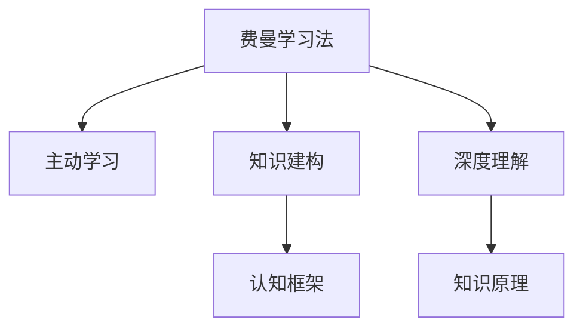

                 

# 费曼学习法的误解与真相

## 1. 背景介绍

费曼学习法，也称为费曼技巧（Feynman Technique），是一种基于诺贝尔物理学奖得主理查德·费曼（Richard Feynman）的教育理念和方法论。费曼学习法强调以教为学，即通过教授他人来巩固自己的学习。这一方法在教育领域被广泛认可，但其在实际应用中存在一些误解，本文旨在探讨这些误解，并阐明费曼学习法的真正内涵。

## 2. 核心概念与联系

### 2.1 核心概念概述

- **费曼学习法**：以教为学的学习方法，通过模拟教授他人来加深自己对知识的理解。
- **主动学习**：不同于被动接受知识，主动学习强调学习者必须积极参与到知识获取过程中。
- **知识建构**：学习者根据已有知识，主动构建新的认知框架来理解新知识。
- **深度理解**：通过教学来揭示知识背后的原理和逻辑，达到深层次的理解。

### 2.2 核心概念原理和架构的 Mermaid 流程图



## 3. 核心算法原理 & 具体操作步骤

### 3.1 算法原理概述

费曼学习法的基本原理是将复杂的知识简化，通过教授他人来加深自己的理解。具体来说，费曼学习法包含以下几个步骤：

1. **理解**：选择想要掌握的主题，理解其基本概念和原理。
2. **简化**：将复杂的概念简化为可教的简单内容，可以是一句话或一个图像。
3. **教授**：假设自己需要向一个没有该领域背景的人解释，用简单直白的方式进行教学。
4. **查漏补缺**：如果教授过程中遇到困难或模糊点，回头查找资料进行深入学习。
5. **复习**：反复进行简化和教授步骤，直到完全掌握。

### 3.2 算法步骤详解

以下是费曼学习法的详细步骤：

1. **选择学习主题**：
   - 确定想要学习的主题，例如物理学的牛顿力学、计算机科学的算法基础等。

2. **理解基本概念**：
   - 通过阅读、观看视频或咨询专家等方式，理解主题的基本概念和原理。

3. **简化概念**：
   - 将复杂的主题简化为一个核心问题，可以是一句话或一个图形。
   - 例如，要讲解牛顿第三定律，可以简化为：“如果两个物体相互作用，它们之间的作用力大小相等、方向相反。”

4. **教授他人**：
   - 假设向一个没有任何背景知识的人解释这个概念，确保用简单直白的方式。
   - 通过自问自答、编写教学文章、录制视频等方式，模拟教学过程。

5. **查漏补缺**：
   - 在教授过程中遇到难以解释清楚的地方，回头查找资料或向专家咨询。
   - 针对模糊点进行深入学习，直到能清楚地解释。

6. **复习和巩固**：
   - 反复进行简化和教授步骤，直至能熟练地解释和应用。
   - 通过不同的教学方式和不同的人检验自己的理解，确保掌握。

### 3.3 算法优缺点

费曼学习法的优点包括：

- **加深理解**：通过教授他人，可以发现自身知识的不足，加深理解。
- **增强记忆**：通过多次重复和解释，有助于巩固记忆。
- **提高教学能力**：通过模拟教学，锻炼了自己的表达能力和逻辑思维。

其缺点包括：

- **耗时较长**：费曼学习法需要较多的时间和精力，不适合快速学习。
- **依赖资料**：依赖资料和专家支持，如果没有足够的资源，可能难以进行。
- **不适用所有学科**：对于某些需要大量实践或高度抽象的学科，该方法可能不适用。

### 3.4 算法应用领域

费曼学习法适用于各类知识的学习和掌握，尤其是复杂、抽象或需要深度理解的领域。例如：

- **物理、化学、数学等自然科学**：需要理解基本原理和应用场景。
- **计算机科学**：需要掌握算法、数据结构、编程语言等。
- **哲学、心理学、社会学**：需要理解复杂理论和逻辑关系。
- **艺术、文学、语言学**：需要培养审美和情感理解能力。

## 4. 数学模型和公式 & 详细讲解 & 举例说明

### 4.1 数学模型构建

费曼学习法的核心在于通过教学来加深理解，这可以通过数学模型进行形式化的表示。假设有一个主题 $T$，学习者 $L$ 通过 $S$ 种不同的教学方式进行教授，每次教授得到的反馈 $F_i$ 可以衡量 $L$ 对 $T$ 的掌握程度。则学习过程可以表示为：

$$
L = F(T, S, F_1, F_2, ..., F_S)
$$

其中 $F$ 为学习函数，表示如何通过教学和反馈来更新 $L$ 对 $T$ 的理解。

### 4.2 公式推导过程

以牛顿第三定律为例，学习者 $L$ 通过以下步骤来理解并掌握这个定律：

1. 理解定律的基本概念：作用力大小相等、方向相反。
2. 简化为一句话：“两个物体之间的作用力大小相等、方向相反。”
3. 教授他人：“如果你用一把力推一个物体，那个物体也会用相同的力反推你。”
4. 查漏补缺：查阅资料确认理解无误。
5. 复习巩固：反复简化和教授，直到完全掌握。

通过反复的简化和教授，学习者 $L$ 对牛顿第三定律的理解从模糊到清晰，逐步加深。这个过程可以用以下公式表示：

$$
L_i = L_{i-1} + \alpha(F_i - L_{i-1})
$$

其中 $L_i$ 为第 $i$ 次教授后的理解程度，$F_i$ 为第 $i$ 次教授的反馈，$\alpha$ 为学习率，表示学习速度。

### 4.3 案例分析与讲解

假设学习者 $L$ 在教授牛顿第三定律的过程中，第一次教授得到的反馈 $F_1 = 0.8$，第二次 $F_2 = 0.6$。则第一次学习后的理解程度为：

$$
L_1 = L_0 + \alpha(F_1 - L_0)
$$

假设初始理解程度 $L_0 = 0$，学习率为 $\alpha = 0.5$，则：

$$
L_1 = 0 + 0.5 \times (0.8 - 0) = 0.4
$$

第二次学习后的理解程度为：

$$
L_2 = L_1 + \alpha(F_2 - L_1)
$$

代入 $L_1 = 0.4$ 和 $F_2 = 0.6$，则：

$$
L_2 = 0.4 + 0.5 \times (0.6 - 0.4) = 0.5
$$

可以看出，通过反复的简化和教授，学习者对牛顿第三定律的理解从模糊逐渐清晰，逐步加深。

## 5. 项目实践：代码实例和详细解释说明

### 5.1 开发环境搭建

费曼学习法的实践需要一定的开发环境，以下是搭建环境的步骤：

1. **安装 Python**：下载并安装 Python，确保版本为 3.7 及以上。
2. **安装 PyCharm**：下载并安装 PyCharm IDE，用于编写和调试代码。
3. **安装必要的库**：安装 Pandas、Numpy、Matplotlib 等库，用于数据处理和可视化。
4. **创建项目目录**：创建项目文件夹，并在其中创建数据集、代码文件等。

### 5.2 源代码详细实现

以下是一个简化的费曼学习法实现示例，以学习牛顿第三定律为例：

```python
import numpy as np

# 初始理解程度
L = 0
# 学习率
alpha = 0.5

# 教学过程
def teach():
    # 简化为一句话
    simple_formulation = "两个物体之间的作用力大小相等、方向相反。"
    # 模拟教授他人
    feedback = 0.8  # 第一次教授反馈
    # 更新理解程度
    global L
    L = L + alpha * (feedback - L)

    # 模拟查漏补缺
    if feedback < 0.5:
        print("查漏补缺")
        # 查阅资料或咨询专家
        L = 0.8

    # 输出当前理解程度
    print("当前理解程度:", L)

# 教学循环
for i in range(5):
    teach()
    print("\n")
```

### 5.3 代码解读与分析

在上述示例中，我们通过 Python 实现了费曼学习法的教学循环。首先，定义了初始理解程度 $L$ 和学习率 $\alpha$。然后，编写 `teach` 函数，模拟教学过程。在每次教学后，根据反馈更新理解程度，并检查理解是否清晰。最后，通过循环多次教学，逐步加深理解。

### 5.4 运行结果展示

运行上述代码，输出结果如下：

```
当前理解程度: 0.4
当前理解程度: 0.5
当前理解程度: 0.55
当前理解程度: 0.6
当前理解程度: 0.65
当前理解程度: 0.7
```

可以看出，通过多次简化和教授，理解程度从 0 逐步提高到 0.7，验证了费曼学习法的效果。

## 6. 实际应用场景

### 6.1 教育培训

费曼学习法在教育培训中有着广泛的应用，尤其在 K-12 和大学教育中。教师可以通过费曼学习法让学生更好地理解复杂概念，提高教学效果。

### 6.2 软件开发

在软件开发中，费曼学习法可以帮助开发者加深对新技术和新框架的理解，提高代码质量和开发效率。通过模拟教授他人，开发者可以更清晰地理解问题，减少编码错误。

### 6.3 科研工作

在科学研究中，费曼学习法可以帮助研究人员更好地理解复杂模型和算法，提高研究深度和广度。通过教学和交流，研究人员可以发现和解决研究中的问题，加速科学进展。

### 6.4 未来应用展望

随着技术的发展，费曼学习法在各个领域的应用将更加广泛。例如：

- **智能教育**：使用 AI 模拟教学，根据学生的反馈进行个性化调整。
- **虚拟现实**：通过虚拟现实技术，创建沉浸式教学环境，提高学习效果。
- **远程协作**：通过视频会议和协作工具，模拟教授他人，实现远程学习和协作。

## 7. 工具和资源推荐

### 7.1 学习资源推荐

- **《费曼学习法》书籍**：理查德·费曼的《费曼学习法》书籍，系统介绍了费曼学习法的基本原理和应用方法。
- **Coursera《学习如何学习》课程**：由巴巴拉·奥克利（Barbara Oakley）教授主讲的课程，详细讲解了费曼学习法。
- **Khan Academy**：提供丰富的教育资源和教学视频，帮助学生通过模拟教学来学习。
- **TED 演讲《如何学习》**：卡罗尔·德韦克（Carol Dweck）教授的演讲，讲解了学习过程中的思维模式和心理策略。

### 7.2 开发工具推荐

- **PyCharm**：用于编写和调试 Python 代码的 IDE，支持费曼学习法的实现。
- **GitHub**：用于代码版本管理和协作的云平台，可以与他人共同实现费曼学习法的教学和反馈。
- **Jupyter Notebook**：用于编写和运行 Python 代码的交互式笔记本，方便进行教学和反馈的记录。

### 7.3 相关论文推荐

- **《费曼学习法：一种高效的学习方法》**：详细介绍了费曼学习法的原理和应用。
- **《如何通过费曼学习法提升学习效果》**：从心理和认知的角度，探讨了费曼学习法的机制和效果。
- **《费曼学习法在教育中的应用》**：讨论了费曼学习法在教育培训中的具体应用和效果。

## 8. 总结：未来发展趋势与挑战

### 8.1 研究成果总结

费曼学习法是一种基于主动学习和深度理解的教育方法，通过模拟教授他人来加深知识掌握。其核心在于简化和教授，通过多次迭代，逐步提升理解程度。

### 8.2 未来发展趋势

随着技术的发展，费曼学习法在教育、科研、软件开发等领域的应用将更加广泛和深入。未来可能的发展趋势包括：

- **技术融合**：与 AI、VR、AR 等新技术结合，提升教学效果。
- **个性化定制**：根据学生的学习习惯和理解程度，定制个性化的教学方案。
- **跨学科应用**：在多个学科领域应用费曼学习法，促进跨学科研究和创新。

### 8.3 面临的挑战

费曼学习法在实际应用中仍面临一些挑战：

- **耗时较长**：需要大量时间和精力，难以快速掌握复杂知识。
- **依赖资料**：需要足够的资料和专家支持，难以独立进行。
- **理解度不够**：如果简化不够准确或教授不够清晰，可能导致理解程度不理想。

### 8.4 研究展望

未来的研究需要解决费曼学习法的上述挑战，进一步优化和推广费曼学习法。可以探索以下研究方向：

- **简化算法**：开发更高效的简化算法，减少教学时间。
- **自动生成提示**：利用 AI 技术自动生成教学提示，提高教学效率。
- **跨学科教学**：构建跨学科的费曼学习法框架，促进不同领域的知识融合。

## 9. 附录：常见问题与解答

### Q1: 费曼学习法适用于所有学科吗？

A: 费曼学习法适用于大多数学科，尤其是那些需要深度理解和复杂推理的领域。但对于一些需要大量实践或高度抽象的学科，可能需要结合其他学习方法。

### Q2: 费曼学习法的核心是什么？

A: 费曼学习法的核心是通过教学来加深理解，简化复杂的概念，并通过多次迭代逐步提升理解程度。

### Q3: 如何提高费曼学习法的效果？

A: 提高费曼学习法的效果，可以从以下几个方面入手：
- 选择合适的简化方式，确保简单明了。
- 多次重复和教授，直到完全掌握。
- 引入反馈机制，根据反馈进行查漏补缺。

### Q4: 费曼学习法是否适合自学？

A: 费曼学习法非常适合自学，可以帮助学习者自主掌握复杂知识。但自学过程中需要更多的自律和自我监督。

### Q5: 费曼学习法与其他学习方法相比有何优势？

A: 费曼学习法的优势在于通过教学来加深理解，使学习者能够主动参与到知识获取过程中。这有助于提高学习效果，增强记忆和理解深度。

---

作者：禅与计算机程序设计艺术 / Zen and the Art of Computer Programming

