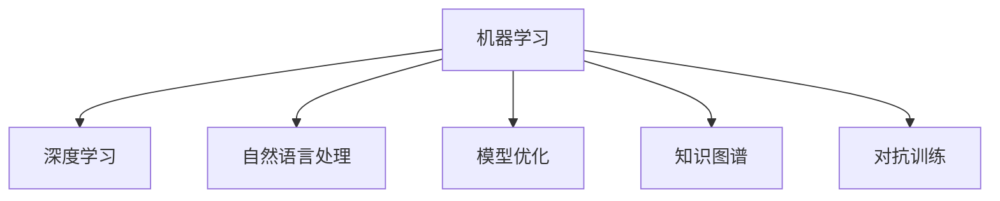
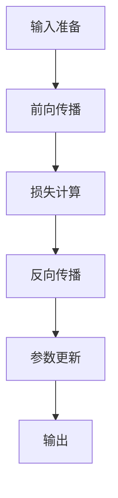

                 

# 费曼技巧：如何像讲故事一样教授AI

## 1. 背景介绍

### 1.1 问题由来

费曼技巧（Feynman Technique）是一种将复杂概念简化并生动讲解的方法，由诺贝尔物理学奖得主理查德·费曼（Richard Feynman）提出。这种方法在科学教育中广受推崇，其核心在于将高深的知识转化为易于理解的故事，使听众能够在形象生动的叙述中掌握知识的精髓。

近年来，人工智能（AI）技术在各领域取得了巨大突破，但其复杂性也随之增加，导致普通人难以理解。如何使更多人能够简单、直观地了解AI，甚至参与到AI的研究与应用中，成为当前AI普及和推广的重要挑战。费曼技巧为AI的普及与教育提供了一种新的可能性。

### 1.2 问题核心关键点

费曼技巧的关键点在于用故事化的语言讲述复杂概念，使听众在轻松愉快的氛围中学习。在AI领域，这种方法尤其适用于解释机器学习、深度学习、自然语言处理等概念，使初学者能够快速上手，老手能够深化理解。

本文将详细介绍如何运用费曼技巧来讲解AI技术，尤其聚焦于机器学习模型的构建和优化，以及如何通过故事化的语言引导听众掌握这些模型。通过系统梳理核心概念与算法，配合具体案例分析，使读者能够像讲故事一样教授AI。

## 2. 核心概念与联系

### 2.1 核心概念概述

为了更好地理解如何应用费曼技巧教授AI，本节将介绍几个关键概念：

- **机器学习（Machine Learning, ML）**：通过算法让计算机从数据中学习规律，进行预测或决策。机器学习包括监督学习、无监督学习、强化学习等多种方法。
- **深度学习（Deep Learning, DL）**：一种特殊的机器学习方法，通过多层神经网络处理数据，实现对复杂模式的学习。深度学习广泛应用于图像识别、语音识别、自然语言处理等领域。
- **自然语言处理（Natural Language Processing, NLP）**：使计算机能够理解、处理和生成人类语言，包括文本分类、情感分析、机器翻译等任务。
- **模型优化（Model Optimization）**：通过调整模型参数和结构，提高模型性能和泛化能力。优化方法包括正则化、早停、梯度裁剪等。
- **知识图谱（Knowledge Graph,KG）**：一种结构化知识表示方式，通过节点和边表示实体和关系，用于增强模型的语义理解能力。
- **对抗训练（Adversarial Training）**：通过引入对抗样本，增强模型的鲁棒性和泛化能力。

这些概念之间的逻辑关系可以通过以下Mermaid流程图来展示：



这个流程图展示出机器学习作为核心概念，与深度学习、自然语言处理、模型优化、知识图谱和对抗训练等关键技术之间的联系。

## 3. 核心算法原理 & 具体操作步骤
### 3.1 算法原理概述

应用费曼技巧教授AI，其核心在于将复杂的算法和模型转化为易于理解的故事。以下是基于费曼技巧的AI教学方法的概述：

1. **简化概念**：将复杂算法简化为易于理解的步骤，分解为小故事。
2. **形象化**：使用比喻和故事将抽象概念具象化。
3. **互动式讲解**：通过问答、互动等方式，引导听众参与学习过程。
4. **实例分析**：结合具体案例，深入讲解算法原理和实现。

### 3.2 算法步骤详解

以下是具体的教学步骤：

1. **了解听众**：
   - 确定听众的背景知识，根据其水平调整讲解难度。
   - 了解听众感兴趣的具体领域，如图像识别、语音识别、自然语言处理等。

2. **引入主题**：
   - 通过简短的引入故事，激发听众的兴趣。例如，讲述一个机器人如何通过学习逐步变得智能的故事。

3. **简化概念**：
   - 将算法步骤分解成小故事，每个步骤都是一个小故事，易于理解。例如，将深度学习模型的训练过程分解为输入、前向传播、反向传播、参数更新等步骤。
   - 使用比喻和故事将抽象概念具象化。例如，将深度学习中的“隐藏层”比喻为“记忆”，将“激活函数”比喻为“神经元”的“兴奋度”。

4. **互动式讲解**：
   - 通过提问和回答，引导听众思考和参与。例如，提出问题“如果输入的图片模糊不清，深度学习模型会如何处理？”引导听众思考如何通过增加训练样本或优化模型来解决这一问题。
   - 通过角色扮演和模拟实验，使听众能够身临其境地感受算法工作流程。例如，让听众扮演模型，通过模拟训练过程理解参数更新的过程。

5. **实例分析**：
   - 结合具体案例，深入讲解算法原理和实现。例如，通过分析CIFAR-10数据集上的图像分类任务，深入讲解卷积神经网络（CNN）的结构和训练过程。
   - 展示实际应用场景，使听众了解算法的实际应用。例如，展示一个基于深度学习的语音识别系统如何通过不断优化模型，提升识别准确率。

### 3.3 算法优缺点

应用费曼技巧教授AI具有以下优点：
1. **易于理解**：通过故事化的讲解，使复杂的概念变得易于理解，适合不同层次的听众。
2. **激发兴趣**：通过生动有趣的故事，激发听众对AI的兴趣和好奇心。
3. **互动性强**：通过互动式讲解，使听众能够主动参与学习，加深理解和记忆。

同时，该方法也存在以下局限性：
1. **时间成本高**：制作和设计故事需要较高的前期准备成本。
2. **深度有限**：由于故事化讲解的简化，可能无法深入探讨算法的细节。
3. **依赖教师能力**：教师需要具备较高的教学技巧和故事设计能力。

尽管存在这些局限性，但费曼技巧为AI教育提供了一种新的视角和方法，值得广泛尝试和探索。

### 3.4 算法应用领域

基于费曼技巧的AI教学方法，可以广泛应用于以下领域：

1. **教育培训**：在高等教育和基础教育中，通过故事化的讲解，使学生能够更容易理解和掌握AI相关知识。
2. **企业培训**：在企业内部培训中，通过故事化的讲解，使员工能够快速掌握新技术和算法，提升工作效率。
3. **科普宣传**：在科普活动和宣传中，通过故事化的讲解，使公众能够了解AI的魅力和应用场景，提升社会对AI的认知。

## 4. 数学模型和公式 & 详细讲解 & 举例说明

### 4.1 数学模型构建

本节将使用数学语言对基于费曼技巧的AI教学过程进行严格描述。

记机器学习模型为 $M_{\theta}:\mathcal{X} \rightarrow \mathcal{Y}$，其中 $\mathcal{X}$ 为输入空间，$\mathcal{Y}$ 为输出空间，$\theta \in \mathbb{R}^d$ 为模型参数。假设教学目标为 $T$，通过教学过程 $T_{\theta}$，使听众掌握模型 $M_{\theta}$ 的基本原理和应用。

定义教学过程 $T_{\theta}$ 的输入为听众的认知状态 $s_0$，输出为听众掌握模型 $M_{\theta}$ 的认知状态 $s_T$。教学过程可以表示为：

$$
s_T = T_{\theta}(s_0)
$$

其中 $T_{\theta}$ 是一个映射函数，将听众的初始认知状态 $s_0$ 映射到掌握模型 $M_{\theta}$ 的认知状态 $s_T$。

### 4.2 公式推导过程

为了更直观地理解教学过程 $T_{\theta}$，可以将其拆分为多个小步骤。例如，在讲解卷积神经网络（CNN）时，可以将教学过程拆分为以下步骤：

1. **输入准备**：准备CNN模型的基本结构，包括卷积层、池化层、全连接层等。
2. **前向传播**：通过输入数据，逐步计算模型的输出。
3. **损失计算**：计算模型的输出与真实标签之间的差异。
4. **反向传播**：通过损失函数对模型参数进行反向传播，更新参数。
5. **参数更新**：根据更新后的参数，重新计算模型的输出，并进行下一轮迭代。

这些步骤可以通过以下流程图表示：



### 4.3 案例分析与讲解

以卷积神经网络（CNN）为例，展示如何通过费曼技巧教授深度学习算法。

**引入主题**：
通过一个小故事，引入CNN的概念。例如，讲述一个机器人如何通过学习大量图片数据，逐渐识别出不同物体的故事。

**简化概念**：
将CNN的训练过程分解为多个小故事，每个故事都是一个小故事，易于理解。例如，将CNN的卷积层比喻为“提取特征”的过程，将池化层比喻为“压缩特征”的过程，将全连接层比喻为“分类”的过程。

**互动式讲解**：
通过提问和回答，引导听众思考和参与。例如，提出问题“如果输入的图片分辨率很高，CNN模型会如何处理？”引导听众思考如何通过改变模型结构或参数来解决这一问题。

**实例分析**：
结合具体案例，深入讲解CNN的原理和实现。例如，通过分析CIFAR-10数据集上的图像分类任务，深入讲解CNN的结构和训练过程。展示实际应用场景，使听众了解CNN的应用，如自动驾驶中的物体识别、医疗图像分析等。

## 5. 项目实践：代码实例和详细解释说明

### 5.1 开发环境搭建

在进行基于费曼技巧的AI教学实践前，我们需要准备好开发环境。以下是使用Python进行开发的环境配置流程：

1. 安装Anaconda：从官网下载并安装Anaconda，用于创建独立的Python环境。
2. 创建并激活虚拟环境：
```bash
conda create -n feynman-env python=3.8 
conda activate feynman-env
```
3. 安装相关Python包：
```bash
pip install numpy pandas matplotlib scikit-learn transformers
```

### 5.2 源代码详细实现

下面以讲解卷积神经网络（CNN）为例，给出使用Python和Transformers库进行基于费曼技巧的AI教学的代码实现。

**第一步：准备数据集**

```python
import torch
from transformers import AutoTokenizer, AutoModelForImageClassification
from sklearn.model_selection import train_test_split
from sklearn.metrics import accuracy_score

# 加载CIFAR-10数据集
import torchvision
train_set, test_set = torchvision.datasets.CIFAR10(root='./data', train=True, test=True, download=True)
```

**第二步：准备预训练模型**

```python
# 加载预训练的ResNet18模型
model = AutoModelForImageClassification.from_pretrained('resnet18')
```

**第三步：编写教学函数**

```python
def feynman_lesson(model, dataset):
    # 准备输入数据
    tokenizer = AutoTokenizer.from_pretrained('resnet18')
    inputs = tokenizer(dataset, padding=True, truncation=True, return_tensors='pt')
    
    # 前向传播
    outputs = model(**inputs)
    logits = outputs.logits
    
    # 计算损失
    loss = outputs.loss
    
    # 反向传播
    loss.backward()
    
    # 参数更新
    optimizer.step()
    
    # 返回输出
    return outputs, loss, logits
```

**第四步：进行教学**

```python
from tqdm import tqdm

# 加载训练集和测试集
train_dataset, test_dataset = train_test_split(train_set, test_set, test_size=0.2)

# 定义优化器
optimizer = torch.optim.Adam(model.parameters(), lr=1e-3)

# 定义迭代次数
epochs = 5

# 开始教学过程
for epoch in range(epochs):
    # 在训练集上进行前向传播和反向传播
    for batch in tqdm(train_dataset, desc='Training'):
        inputs, labels = batch
        outputs, loss, logits = feynman_lesson(model, inputs)
    
    # 在测试集上评估模型性能
    with torch.no_grad():
        for batch in tqdm(test_dataset, desc='Evaluating'):
            inputs, labels = batch
            outputs, logits = feynman_lesson(model, inputs)
            predictions = torch.argmax(logits, dim=1)
            accuracy = accuracy_score(labels, predictions)
            print(f'Epoch {epoch+1}, Accuracy: {accuracy:.2f}')
```

### 5.3 代码解读与分析

**代码解读**：

- 首先，我们使用Python的`torchvision`库加载了CIFAR-10数据集，并将数据集分为训练集和测试集。
- 接着，加载了预训练的ResNet18模型，并准备了一个用于图像分类的Tokenization器。
- 然后，定义了一个`feyman_lesson`函数，用于进行卷积神经网络的训练。该函数包含了前向传播、损失计算、反向传播和参数更新的过程。
- 最后，在主程序中，我们进行了5次迭代，并在训练集和测试集上评估了模型性能。

**代码分析**：

- `feyman_lesson`函数是教学过程中的核心，包含了整个教学流程。
- 在函数内部，我们使用了Transformer库的自动Tokenization器，将输入数据转换为模型所需的格式。
- 接着，我们通过前向传播计算模型的输出，并通过损失函数计算损失。
- 然后，通过反向传播更新模型的参数，并进行下一轮迭代。
- 最后，在测试集上评估模型的准确性，并打印输出。

## 6. 实际应用场景

### 6.1 教育培训

基于费曼技巧的AI教学方法在教育培训中具有广泛应用。通过将复杂的算法和模型转化为易于理解的故事，使学生能够更容易理解和掌握AI相关知识。例如，在高校和中学的计算机科学课程中，通过生动有趣的讲解，使学生能够快速掌握深度学习、自然语言处理等概念。

### 6.2 企业培训

在企业内部培训中，通过费曼技巧讲解AI技术，使员工能够快速掌握新技术和算法，提升工作效率。例如，在金融、医疗等领域的AI应用中，通过故事化的讲解，使员工能够理解算法的实现和应用场景，从而更好地完成工作任务。

### 6.3 科普宣传

在科普活动和宣传中，通过故事化的讲解，使公众能够了解AI的魅力和应用场景，提升社会对AI的认知。例如，通过举办AI科普讲座、制作AI教育视频等形式，使公众能够了解AI技术的基本原理和应用场景，促进AI技术的普及。

### 6.4 未来应用展望

随着AI技术的不断进步，基于费曼技巧的AI教学方法将有更广阔的应用前景。未来，基于费曼技巧的AI教学将应用于更多领域，使更多人能够理解和应用AI技术。

在医疗领域，通过生动有趣的讲解，使医生和患者能够理解AI在疾病诊断、治疗方案推荐等方面的应用。在金融领域，通过故事化的讲解，使投资者能够理解AI在风险评估、投资建议等方面的应用。在教育领域，通过生动有趣的讲解，使学生能够理解AI在智能辅导、教育资源推荐等方面的应用。

## 7. 工具和资源推荐

### 7.1 学习资源推荐

为了帮助开发者系统掌握基于费曼技巧的AI教学方法，这里推荐一些优质的学习资源：

1. 《机器学习实战》系列博文：由深度学习专家撰写，深入浅出地介绍了机器学习的基本概念和常用算法，配合具体案例讲解，易于理解。
2. Coursera《机器学习》课程：斯坦福大学开设的机器学习课程，通过视频和作业，系统讲解机器学习的基本概念和常用算法。
3. 《深度学习》书籍：Ian Goodfellow等著，全面介绍了深度学习的基本原理和常用算法，配合大量实例讲解，适合深入学习。
4. GitHub上的AI教学项目：如TensorFlow的教程、PyTorch的文档等，提供了大量具体的代码示例，帮助开发者快速上手。
5. HuggingFace的Transformers库：提供了大量预训练模型和详细的文档，使开发者能够快速构建和优化AI模型。

通过对这些资源的学习实践，相信你一定能够快速掌握基于费曼技巧的AI教学方法，并用于解决实际的AI问题。

### 7.2 开发工具推荐

高效的开发离不开优秀的工具支持。以下是几款用于基于费曼技巧的AI教学开发的常用工具：

1. Jupyter Notebook：开源的交互式编程环境，支持Python和R等语言，适合进行数据可视化、代码编写和教学讲解。
2. Google Colab：谷歌提供的云端Jupyter Notebook环境，免费提供GPU/TPU算力，方便开发者快速上手实验最新模型，分享学习笔记。
3. Weights & Biases：模型训练的实验跟踪工具，可以记录和可视化模型训练过程中的各项指标，方便对比和调优。
4. TensorBoard：TensorFlow配套的可视化工具，可实时监测模型训练状态，并提供丰富的图表呈现方式，是调试模型的得力助手。
5. GitHub：全球最大的代码托管平台，提供丰富的开源项目和教学资源，帮助开发者快速学习和应用AI技术。

合理利用这些工具，可以显著提升基于费曼技巧的AI教学任务的开发效率，加快创新迭代的步伐。

### 7.3 相关论文推荐

基于费曼技巧的AI教学方法的研究，主要集中在以下几个方面：

1. 《深度学习入门：基于TensorFlow 2.0的实践》书籍：提供了大量深度学习模型和教学实例，使读者能够快速掌握AI技术。
2. 《基于深度学习的教育技术研究》论文：探讨了深度学习在教育中的应用，如个性化学习、智能辅导等，提出了基于深度学习的教育技术框架。
3. 《故事化学习：一种新的教育方式》论文：探讨了故事化学习对学生学习效果的影响，提出了基于故事化的教学方法。
4. 《基于知识图谱的AI教学方法》论文：探讨了知识图谱在AI教学中的应用，提出了基于知识图谱的教学框架。
5. 《对抗训练：提升AI模型鲁棒性的新方法》论文：探讨了对抗训练对AI模型鲁棒性的提升效果，提出了基于对抗训练的教学方法。

这些论文代表了大语言模型微调技术的发展脉络。通过学习这些前沿成果，可以帮助研究者把握学科前进方向，激发更多的创新灵感。

## 8. 总结：未来发展趋势与挑战

### 8.1 总结

本文对基于费曼技巧的AI教学方法进行了全面系统的介绍。首先阐述了费曼技巧的核心思想和应用背景，明确了其在大语言模型教学中的独特价值。其次，从原理到实践，详细讲解了费曼技巧的教学方法和具体步骤，给出了教学任务开发的完整代码实例。同时，本文还广泛探讨了费曼技巧在教育培训、企业培训、科普宣传等众多领域的应用前景，展示了其在AI教育中的巨大潜力。

通过本文的系统梳理，可以看到，基于费曼技巧的AI教学方法在教育培训、企业培训、科普宣传等众多领域具有广泛的应用前景，为AI教育提供了新的可能性。这种教学方法使复杂的AI概念变得易于理解，适合不同层次的听众，有助于推广AI技术的应用。

### 8.2 未来发展趋势

展望未来，基于费曼技巧的AI教学方法将呈现以下几个发展趋势：

1. **教学资源丰富化**：随着AI教学方法的不断发展和完善，将有更多丰富的教学资源和示例供开发者参考，如教学视频、教学案例、教学工具等，使教学过程更加生动、有趣。
2. **教学方式多样化**：除了传统的课堂教学，将有更多线上教学、模拟实验、虚拟现实等教学方式，使教学过程更加互动、沉浸。
3. **教学内容智能化**：通过引入AI技术，如自然语言处理、机器学习等，使教学内容能够根据学生的学习情况进行个性化调整，提升教学效果。
4. **教学效果可评估化**：通过引入评估指标和测试工具，使教学效果能够量化评估，帮助教师和学生了解学习进度和效果，及时调整教学策略。
5. **教学内容多模态化**：将文本、图像、音频等多种模态的教学内容结合起来，使教学过程更加立体、丰富。

这些趋势凸显了基于费曼技巧的AI教学方法的广阔前景，未来将会在更多领域得到应用，为AI技术的普及和推广提供新的途径。

### 8.3 面临的挑战

尽管基于费曼技巧的AI教学方法具有广阔的前景，但在推广应用的过程中，仍面临诸多挑战：

1. **教学内容设计**：如何设计生动有趣、易于理解的教学内容，是费曼技巧教学方法面临的重要挑战。需要深入了解听众的需求和兴趣，设计符合其认知水平的故事和案例。
2. **教学方法创新**：如何创新教学方法，使其更加互动、沉浸，是费曼技巧教学方法面临的挑战。需要不断探索和尝试新的教学方式，提升教学效果。
3. **教学工具开发**：如何开发高效的教学工具，使教学过程更加便捷、高效，是费曼技巧教学方法面临的挑战。需要整合多种教学工具，提升教学效率。
4. **教学效果评估**：如何评估教学效果，帮助教师和学生了解学习进度和效果，是费曼技巧教学方法面临的挑战。需要设计合理的评估指标和工具，提升教学效果。

这些挑战需要不断探索和尝试，才能使基于费曼技巧的AI教学方法更好地应用于实际教学中，为AI技术的普及和推广提供新的途径。

### 8.4 研究展望

面对基于费曼技巧的AI教学方法所面临的挑战，未来的研究需要在以下几个方面寻求新的突破：

1. **教学内容个性化**：根据学生的学习情况，设计个性化的教学内容，使其更加符合学生的认知水平和学习需求。
2. **教学方式创新化**：探索新的教学方式，如虚拟现实、增强现实等，使教学过程更加互动、沉浸。
3. **教学工具智能化**：开发智能化的教学工具，如自适应学习系统、个性化推荐系统等，提升教学效果。
4. **教学效果可评估化**：设计合理的评估指标和工具，使教学效果能够量化评估，帮助教师和学生了解学习进度和效果，及时调整教学策略。
5. **教学内容多模态化**：将文本、图像、音频等多种模态的教学内容结合起来，使教学过程更加立体、丰富。

这些研究方向将使基于费曼技巧的AI教学方法更加科学、高效，为AI技术的普及和推广提供新的途径。面向未来，基于费曼技巧的AI教学方法必将在教育培训、企业培训、科普宣传等更多领域得到广泛应用，为人类认知智能的进化带来深远影响。

## 9. 附录：常见问题与解答

**Q1：如何评估基于费曼技巧的AI教学效果？**

A: 评估基于费曼技巧的AI教学效果可以从以下几个方面考虑：
1. 教学内容的理解度：通过问卷调查、面试等手段，评估学生对教学内容的理解程度。
2. 学习效果的提升度：通过测试题、项目实践等手段，评估学生在学习过程中的进步程度。
3. 教学方式的满意度：通过学生反馈、满意度调查等手段，评估学生对教学方式的满意度。

**Q2：在教学过程中，如何设计生动有趣的故事？**

A: 设计生动有趣的故事需要考虑以下几个方面：
1. 听众背景：了解听众的背景知识，根据其水平调整故事的难易程度。
2. 故事结构：设计有吸引力的故事结构，如“背景-冲突-解决”等，使故事具有吸引力。
3. 比喻和类比：使用比喻和类比，将抽象概念具象化，使听众更容易理解。
4. 互动元素：加入互动元素，如提问和回答，使听众能够主动参与学习过程。

**Q3：在教学过程中，如何引导听众思考和参与？**

A: 引导听众思考和参与可以通过以下几个方式：
1. 提问和回答：通过提出问题，引导听众思考和回答，增强互动性。
2. 角色扮演：让听众扮演不同的角色，如模型、样本等，通过模拟实验增强理解。
3. 讨论和辩论：组织讨论和辩论，使听众能够发表自己的观点，加深理解。
4. 案例分析：通过具体案例，引导听众分析问题，提升理解深度。

**Q4：如何设计个性化的教学内容？**

A: 设计个性化的教学内容需要考虑以下几个方面：
1. 学生背景：了解学生的背景知识和学习需求，设计符合其认知水平的学习内容。
2. 学习进度：根据学生的学习进度，动态调整教学内容，使学习过程更加科学和高效。
3. 反馈机制：通过反馈机制，了解学生的学习情况，及时调整教学内容。
4. 多模态教学：结合文本、图像、音频等多种模态的教学内容，使教学过程更加立体、丰富。

**Q5：在教学过程中，如何评估教学效果？**

A: 评估教学效果可以从以下几个方面考虑：
1. 教学内容的理解度：通过问卷调查、面试等手段，评估学生对教学内容的理解程度。
2. 学习效果的提升度：通过测试题、项目实践等手段，评估学生在学习过程中的进步程度。
3. 教学方式的满意度：通过学生反馈、满意度调查等手段，评估学生对教学方式的满意度。
4. 教学效果的反馈：通过定期的教学效果反馈，了解教学过程中的问题和改进点。

这些评估方法可以帮助教师和学生了解教学效果，及时调整教学策略，提升教学效果。

---

作者：禅与计算机程序设计艺术 / Zen and the Art of Computer Programming

