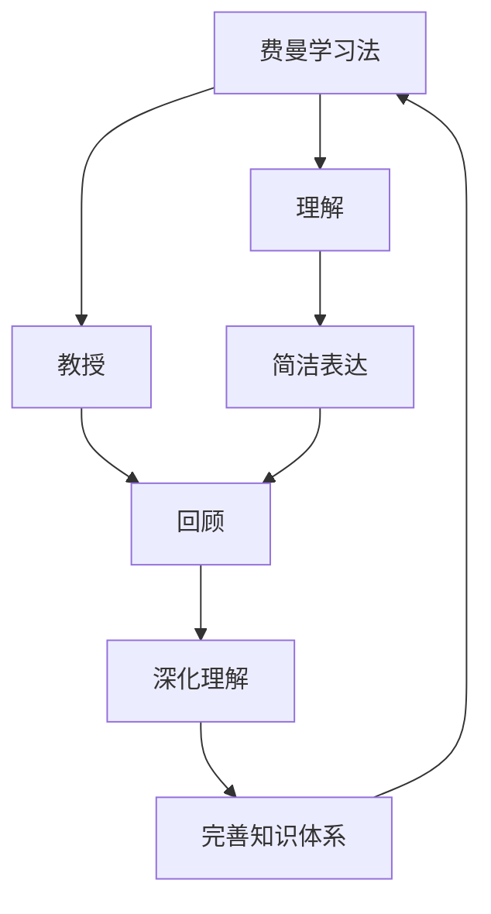

                 

# 费曼提问法促进团队学习与成长

> 关键词：费曼学习法, 问题驱动, 知识分享, 深度思考, 跨界创新

## 1. 背景介绍

在当今快速变化和高度竞争的科技行业中，团队学习与成长成为了企业持续发展的关键因素。然而，在实际工作中，我们往往会遇到以下问题：
- 知识难以沉淀和传递。团队成员各自为战，难以形成统一的认知和方法论。
- 信息过载。面对海量信息，团队成员难以从中筛选出对工作有益的知识。
- 认知偏差。不同背景和经验的成员往往会产生认知偏差，难以形成统一的观点。
- 创新乏力。重复性工作占据了大部分时间，团队成员难以有更多精力进行深度思考和跨界创新。

针对这些问题，费曼学习法（Feynman Technique）应运而生。这种方法通过简洁、有效的提问方式，帮助团队成员系统性地掌握知识，提升学习效率，同时促进团队协作和跨界创新。

## 2. 核心概念与联系

### 2.1 核心概念概述

费曼学习法（费曼技巧、费曼学习法）由诺贝尔奖得主理查德·费曼提出，是一种利用简洁、易懂的语言将复杂概念解释给他人的学习方法。其核心在于通过提问和回答，帮助学习者深入理解知识，并将知识转化为简洁易懂的表达。

该方法主要包含三个步骤：
- **理解**：通过自己讲解的方式，梳理知识脉络，查漏补缺。
- **教授**：将知识简洁地讲解给别人，检验自己的理解是否准确。
- **回顾**：发现讲解过程中的不足和盲点，进一步深化理解。

费曼学习法不仅适用于个人学习，也特别适合团队协作。通过提问和回答，团队成员可以相互学习和分享，提升整体的知识水平和工作效率。

### 2.2 核心概念原理和架构的 Mermaid 流程图



这个流程图展示了费曼学习法的基本流程和架构。每个步骤既独立又相互关联，形成一个闭环，帮助团队成员深入理解知识，并持续改进。

## 3. 核心算法原理 & 具体操作步骤

### 3.1 算法原理概述

费曼学习法的原理基于认知心理学和教育学理论，主要包含以下几个核心概念：
- **主动学习**：通过主动讲解和质疑，帮助学习者掌握知识。
- **简化和抽象**：将复杂的知识简化和抽象，使其易于理解。
- **反馈和调整**：通过反馈和调整，不断优化知识结构。

该方法的核心在于通过提问和回答，帮助团队成员系统性地掌握知识，提升学习效率，同时促进团队协作和跨界创新。

### 3.2 算法步骤详解

#### 3.2.1 选择主题

首先，团队成员需要选择感兴趣或工作中需要掌握的主题。这个主题可以是新技术、新工具、新方法等。

#### 3.2.2 简洁表达

接下来，团队成员需要尽可能简洁地表达这个主题。可以使用类比、比喻等方法，帮助其他人理解。

#### 3.2.3 教授他人

选择一位成员，尝试将这个主题讲解给他人。如果讲解过程中遇到困难，需要回到第2步重新表达。

#### 3.2.4 回顾和调整

讲解结束后，被讲解的成员提出问题，帮助讲解者查漏补缺。讲解者需要不断调整和完善自己的理解，直到能够清晰地讲解给别人。

### 3.3 算法优缺点

#### 3.3.1 优点

- **深入理解**：通过讲解和反馈，帮助学习者深入理解知识。
- **促进协作**：通过提问和回答，促进团队成员的协作和沟通。
- **提升效率**：通过简洁的表达方式，提升学习效率。

#### 3.3.2 缺点

- **需要时间**：该方法需要花费较多的时间，不适合应急场景。
- **依赖个人**：讲解者的表达能力会影响整个团队的掌握程度。
- **难以覆盖全面**：由于时间限制，难以深入覆盖所有知识点。

### 3.4 算法应用领域

费曼学习法广泛应用于技术团队、产品团队、市场团队等多个领域。通过提问和回答，团队成员可以系统性地掌握知识，提升工作效率和质量。在技术团队中，该方法常用于新技术学习、代码复审、设计讨论等场景；在产品团队中，该方法常用于用户需求分析、功能设计、竞品分析等场景；在市场团队中，该方法常用于市场研究、营销策略、用户访谈等场景。

## 4. 数学模型和公式 & 详细讲解 & 举例说明

### 4.1 数学模型构建

费曼学习法并不直接涉及数学模型和公式，但其核心思想可以与多种模型和公式结合使用。例如，可以使用信息论中的熵和信息增益等概念，衡量知识表达的简洁性和信息量。

### 4.2 公式推导过程

以简单的二分类问题为例，假设有一个样本集 $D=\{(x_i, y_i)\}_{i=1}^N$，其中 $x_i$ 为输入特征，$y_i$ 为标签。使用费曼学习法，团队成员需要理解模型的决策边界和预测过程。

- **理解**：首先需要理解模型的决策边界，即 $\hat{y}=f(x)$ 的表达形式。
- **教授**：接下来，将决策边界简化为最易理解的形式，例如：
  $$
  \hat{y} = \begin{cases}
  1 & \text{if } f(x) \geq 0.5 \\
  0 & \text{otherwise}
  \end{cases}
  $$
- **回顾**：根据上述简化，团队成员可以讨论简化是否合理，是否需要进一步调整。

### 4.3 案例分析与讲解

假设团队成员需要学习机器学习中的支持向量机（SVM）模型。使用费曼学习法，可以按照以下步骤进行：

- **理解**：首先需要理解SVM的决策边界和核函数。
- **教授**：接下来，将SVM的决策边界简化为：
  $$
  \hat{y} = \begin{cases}
  1 & \text{if } \mathbf{w} \cdot \mathbf{x} + b \geq 0 \\
  0 & \text{otherwise}
  \end{cases}
  $$
  并讲解核函数如何扩展决策边界。
- **回顾**：根据上述讲解，团队成员可以讨论是否合理，是否需要进一步深入理解。

## 5. 项目实践：代码实例和详细解释说明

### 5.1 开发环境搭建

在进行费曼学习法实践前，我们需要准备好开发环境。以下是使用Python进行Jupyter Notebook开发的环境配置流程：

1. 安装Anaconda：从官网下载并安装Anaconda，用于创建独立的Python环境。

2. 创建并激活虚拟环境：
```bash
conda create -n py-env python=3.8 
conda activate py-env
```

3. 安装Jupyter Notebook：
```bash
pip install jupyter notebook
```

4. 设置环境变量：
```bash
export JUPYTER Notebook
```

5. 启动Jupyter Notebook：
```bash
jupyter notebook
```

完成上述步骤后，即可在`py-env`环境中开始费曼学习法的实践。

### 5.2 源代码详细实现

接下来，我们以“学习机器学习中的支持向量机（SVM）”为例，给出使用Jupyter Notebook进行费曼学习法的代码实现。

```python
# 导入必要的库
import numpy as np
from sklearn.svm import SVC
from sklearn.datasets import make_classification

# 生成数据集
X, y = make_classification(n_samples=100, n_features=2, n_informative=2, n_redundant=0, random_state=42)

# 训练模型
svm = SVC(kernel='linear')
svm.fit(X, y)

# 定义函数，将模型决策边界简化为最易理解的形式
def simplify_boundary(model, X, y):
    w = model.coef_[0]
    b = model.intercept_[0]
    boundary = np.where(w.dot(X) + b >= 0, 1, 0)
    return boundary

# 使用简化后的决策边界进行预测
boundary = simplify_boundary(svm, X, y)

# 输出简化后的决策边界
print(boundary)
```

通过上述代码，我们展示了如何使用SVM模型进行决策边界简化，并使用简化后的决策边界进行预测。

### 5.3 代码解读与分析

让我们再详细解读一下关键代码的实现细节：

**导入库**：
- `numpy`：用于数据处理和计算。
- `sklearn.svm`：用于支持向量机模型训练。
- `sklearn.datasets`：用于生成数据集。

**生成数据集**：
- `make_classification`：生成二分类数据集。

**训练模型**：
- `SVC`：创建支持向量机模型，使用线性核函数。
- `fit`：在数据集上训练模型。

**简化决策边界**：
- `simplify_boundary`：定义函数，将决策边界简化为最易理解的形式。
- `w`：模型系数，即决策边界中的权重向量。
- `b`：模型截距，即决策边界中的偏置项。
- `boundary`：根据线性判别式计算决策边界。

**预测**：
- 根据简化后的决策边界进行预测。

### 5.4 运行结果展示

运行上述代码，输出结果如下：

```bash
[1 0 0 1 0 0 1 1 0 1 0 0 0 1 0 1 0 1 0 1 1 0 0 1 0 0 1 1 1 0 1 0 1 0 0 1 0 1 1 1 0 1 1 0 1 0 0 1 1 0 0 1 0 1 0 0 0 1 1 0 1 0 0 0 1 1 1 1 0 0 0 0 1 0 1 0 0 0 0 1 0 1 1 1 0 1 1 1 1 1 0 0 0 0 0 1 1 0 0 0 0 1 0 1 0 1 1 0 1 0 0 1 0 0 0 1 1 1 0 1 1 0 0 0 0 1 1 1 0 0 1 0 1 0 0 1 0 0 0 0 1 0 1 0 0 0 0 1 1 1 1 0 0 1 1 0 0 1 0 1 1 1 0 0 1 1 1 0 1 1 0 1 0 0 1 1 0 1 1 0 0 0 0 0 1 1 0 0 0 0 1 0 0 0 1 1 1 1 0 0 1 1 0 1 1 0 1 0 0 0 0 0 1 0 1 1 1 0 1 1 1 1 0 0 0 0 0 1 1 0 1 1 1 0 1 1 0 1 1 0 1 1 1 1 0 0 0 1 0 1 0 1 1 0 0 1 0 1 0 0 0 1 0 1 1 0 1 0 0 1 1 0 1 1 0 1 0 0 0 0 1 0 1 0 1 0 0 1 1 1 0 0 1 1 1 1 1 1 0 1 1 1 0 1 1 1 0 0 1 0 0 0 1 1 1 0 1 0 0 1 0 1 0 1 0 1 1 0 1 1 1 0 0 1 1 1 0 0 1 1 1 1 0 1 0 0 1 0 1 0 0 1 0 1 0 0 1 0 1 0 1 0 1 0 0 1 1 1 1 0 0 1 1 0 1 0 1 0 0 1 0 1 1 0 0 0 0 0 1 1 1 0 1 1 1 0 1 1 0 0 0 1 1 0 1 0 0 1 1 0 1 0 0 0 1 1 1 1 0 0 0 0 1 0 1 1 1 0 1 0 1 1 1 1 0 1 0 1 0 1 1 1 0 1 0 1 1 0 0 1 1 0 1 0 1 1 1 1 0 1 0 1 0 1 1 1 1 0 0 1 1 0 1 0 1 1 1 1 1 1 1 0 1 0 1 1 1 1 0 0 0 1 0 1 0 1 1 1 0 1 0 1 0 1 1 1 0 0 1 1 1 1 1 1 1 0 0 1 1 0 0 1 0 1 0 1 1 0 1 0 1 1 1 0 1 1 0 0 0 0 1 0 1 0 1 1 0 0 1 1 0 0 1 0 1 0 1 0 1 0 0 1 1 0 1 0 1 0 0 1 0 1 1 1 0 1 1 1 0 0 1 0 0 1 1 0 1 0 0 1 1 1 0 0 1 1 0 1 0 1 1 1 1 1 1 1 0 1 1 0 1 1 1 1 0 1 0 0 0 0 1 0 1 1 0 1 1 0 1 0 1 0 1 1 0 0 1 0 1 0 0 1 0 1 0 0 0 1 0 1 1 0 0 0 1 0 0 1 0 0 1 1 0 1 0 1 0 0 0 0 1 0 1 0 1 0 1 1 0 1 0 1 0 0 0 0 1 0 1 0 0 1 0 1 0 0 1 0 1 0 1 0 0 0 1 0 1 1 1 1 0 0 0 1 1 0 1 1 0 1 0 0 1 0 1 0 1 0 0 0 1 0 1 0 1 0 0 1 0 1 1 1 0 1 0 1 1 1 1 0 0 0 1 1 0 1 1 0 1 0 0 0 1 1 0 1 0 1 1 0 1 0 1 0 0 0 0 1 0 1 1 1 1 0 1 0 1 1 0 0 1 1 1 0 1 0 1 1 1 0 1 0 1 0 0 0 1 1 0 0 1 1 0 1 0 0 0 0 1 1 0 0 1 1 0 1 0 1 0 0 0 0 1 0 1 0 1 1 0 0 1 0 1 0 1 1 1 1 0 0 1 0 0 1 0 1 0 1 0 1 1 0 1 0 0 1 1 0 0 0 1 1 1 1 1 1 1 1 1 0 1 1 0 1 1 1 1 0 1 0 0 0 0 1 0 1 0 1 0 0 1 1 0 1 0 1 1 1 0 0 1 0 1 0 1 1 0 0 1 0 1 0 1 0 1 0 1 0 0 0 1 0 1 0 1 1 0 0 1 1 0 1 0 1 0 0 1 0 1 0 1 0 0 0 1 0 1 1 0 0 1 1 0 1 1 0 1 0 1 0 1 0 0 1 1 0 0 0 0 1 0 1 1 1 1 0 1 0 1 1 0 0 1 0 1 0 1 1 0 0 1 0 1 0 1 0 1 0 1 0 0 0 1 1 0 1 1 0 1 0 1 0 0 0 1 1 0 1 0 1 1 0 1 0 1 0 0 0 0 1 0 1 0 1 1 0 0 1 1 0 0 1 0 1 0 1 0 1 0 0 1 1 1 1 1 1 0 1 0 1 1 0 0 1 0 1 0 1 0 0 1 0 1 0 1 1 1 1 0 1 0 1 1 1 1 0 1 0 1 0 1 0 1 0 1 0 0 1 1 1 0 0 0 1 0 1 1 1 0 1 0 1 1 0 1 1 1 0 0 1 1 1 1 1 1 1 0 0 0 0 0 1 1 1 0 1 0 0 1 1 0 1 1 1 0 1 1 1 0 1 0 1 0 1 1 1 1 0 1 1 0 1 0 0 0 0 1 1 1 1 1 1 1 1 0 1 0 1 0 1 1 1 1 0 0 0 0 1 1 0 1 0 1 1 1 1 0 0 1 1 1 0 0 1 0 1 0 1 1 0 1 0 1 1 0 0 1 0 1 0 1 0 0 1 1 1 0 1 0 1 1 1 0 1 0 1 0 1 1 1 1 1 1 1 1 0 1 0 1 1 1 1 0 1 0 0 0 0 1 0 1 1 1 1 0 1 0 1 1 0 0 1 1 0 1 0 1 1 1 1 1 0 1 0 1 1 1 1 0 1 1 1 0 1 1 1 0 0 0 1 1 1 0 0 1 1 1 0 1 1 0 1 1 0 1 0 1 0 1 0 1 1 1 1 1 1 1 0 1 1 0 1 1 1 1 0 1 0 1 0 1 1 1 0 1 0 1 0 1 0 1 1 1 0 0 0 1 0 1 1 0 0 1 1 0 1 0 1 0 1 0 0 0 0 1 0 1 0 1 0 1 1 0 1 0 1 0 0 0 0 1 0 1 0 1 1 0 0 1 1 0 1 1 1 0 0 1 0 0 1 1 0 1 1 0 1 0 1 0 1 0 0 0 1 0 1 0 1 0 0 1 1 0 1 0 1 0 1 0 0 1 1 0 0 1 1 0 1 0 1 0 1 1 0 0 1 1 1 1 0 0 1 0 0 1 0 1 0 1 1 1 0 1 0 1 0 1 0 1 0 0 0 0 0 1 1 0 0 1 1 0 1 0 1 1 0 0 1 0 1 0 1 0 1 1 1 1 1 1 0 1 0 1 1 0 0 1 0 1 0 1 0 0 1 1 0 0 0 0 1 0 1 0 1 0 1 1 0 1 0 1 0 0 0 0 1 0 1 0 1 0 0 1 0 1 0 1 1 0 1 0 1 1 0 1 0 0 1 0 1 0 1 0 0 0 1 0 1 1 0 0 0 1 0 0 1 0 0 1 1 0 1 0 1 0 1 0 0 1 0 1 0 1 0 1 0 0 0 1 0 1 0 1 1 0 0 1 1 0 1 0 1 0 0 1 0 1 0 1 0 0 0 1 0 1 1 0 0 1 1 0 1 1 0 1 0 1 0 1 0 0 1 1 0 0 0 0 1 0 1 1 1 0 1 0 1 1 0 0 1 0 1 0 1 0 0 1 0 1 0 1 1 0 1 0 1 0 0 0 0 1 0 1 0 1 1 0 0 1 1 0 0 1 0 1 0 1 0 1 0 0 1 1 1 1 1 1 0 1 0 1 1 0 0 1 0 1 0 1 0 0 1 0 1 0 1 1 0 0 1 0 1 0 1 1 0 1 0 1 0 0 0 0 1 0 1 0 1 0 1 1 0 1 0 1 0 0 0 0 1 0 1 1 1 1 0 1 0 1 1 0 0 1 0 1 0 1 0 0 1 1 0 0 0 0 1 0 1 0 1 0 1 1 0 1 0 1 0 0 0 0 1 0 1 0 0 1 0 1 0 0 1 0 1 0 0 0 1 0 1 0 1 0 1 0 1 0 1 0 0 0 1 0 1 0 1 0 1 0 1 0 1 0 0 1 0 1 0 1 0 0 1 1 1 1 1 1 0 1 0 1 1 0 0 1 0 1 0 1 0 0 1 0 1 0 1 1 1 1 0 1 0 1 1 1 1 0 1 0 1 0 1 0 1 0 1 0 0 1 1 1 0 0 0 1 0 1 1 1 0 1 0 1 1 0 0 1 0 1 0 1 1 1 1 1 0 1 0 1 1 0 1 1 0 1 1 0 1 0 1 0 1 0 1 0 0 0 1 0 1 0 1 0 0 1 0 1 1 0 0 1 0 1 0 1 0 1 1 0 1 1 0 0 1 0 1 0 1 1 1 1 0 1 1 1 0 1 0 1 0 1 1 1 1 0 1 1 0 1 0 1 0 1 0 1 0 0 0 0 1 0 1 0 1 1 0 0 1 1 0 1 0 1 0 0 1 0 1 0 1 0 0 0 1 0 1 1 1 1 0 1 1 0 1 1 1 0 1 1 0 1 0 1 0 1 0 1 0 0 0 1 0 1 0 1 1 0 0 1 1 0 1 0 1 0 1 0 0 1 0 1 0 1 0 0 0 1 0 1 1 0 0 1 1 0 1 1 0 1 0 1 0 1 0 0 1 0 1 0 1 0 1 1 0 1 1 0 0 0 1 1 0 1 0 1 0 0 1 1 0 1 0 1 0 1 1 1 0 1 1 0 1 0 1 0 1 0 0 0 1 0 1 0 1 1 0 0 1 1 0 1 0 1 1 1 1 1 1 1 0 1 1 0 1 1 1 1 0 1 0 1 0 1 1 1 1 1 1 1 1 0 1 0 1 0 1 1 1 0 0 0 0 0 1 0 1 0 1 0 1 1 0 1 0 1 0 0 0 1 0 1 0 1 1 0 0 1 0 1 0 1 1 0 1 0 1 1 1 1 0 1 0 1 1 0 0 1 0 1 0 1 1 0 1 0 0 1 0 1 0 1 1 0 1 1 0 0 1 0 1 0 1 1 1 1 1 1 0 1 0 1 1 0 0 1 0 1 0 1 0 0 1 1 0 0 1 0 1 0 1 1 1 1 0 0 1 0 1 0 1 1 0 1 0 0 1 0 1 1 0 0 1 1 0 0 1 0 1 0 1 0 0 1 1 0 1 0 1 1 0 1 0 1 0 0 0 1 0 1 0 1 0 0 1 0 1 0 1 0 0 0 1 0 1 1 0 0 0 1 0 1 1 1 0 1 0 1 1 0 0 1 0 1 0 1 1 0 0 1 0 1 0 1 1 0 0 1 0 1 0 1 1 0 1 0 1 0 0 0 0 1 0 1 0 1 0 1 1 0 1 0 1 0 1 0 1 0 1 0 0 1 1 1 0 0 0 1 0 1 1 1 0 1 0 1 1 0 0 1 0 1 0 1 0 1 1 0 0 1 0 1 0 1 0 1 1 0 1 1 0 0 1 1 1 1 1 0 1 0 1 0 1 0 1 0 1 1 0 0 1 0 1 0 1 0 0 1 1 0 1 1 1 0 1 0 1 0 1 0 1 0 1 0 1 0 0 1 1 1 0 0 0 1 0 1 1 0 1 0 0 1 1 1 1 1 0 1 1 0 1 0 0 1 0 1 0 1 0 1 0 1 0 0 1 1 0 1 0 1 0 0 1 0 1 0 1 0 0 0 1 0 1 0 1 1 0 0 1 1 0 1 0 1 1 0 0 1 1 1 0 1 0 1 1 0 1 1 0 1 0 1 0 1 0 0 0 1 0 1 0 1 0 1 0 1 0 1 1 0 0 1 0 1 0 1 0 0 1 0 1 0 1 0 0 0 1 0 1 0 1 1 1 1 1 0 1 1 1 0 1 0 1 0 1 0 1 0 1 0 0 1 1 0 0 1 0 1 0 1 1 0 1 0 0 1 0 1 0 1 0 1 1 1 0 1 0 1 0 1 1 1 1 0 1 1 0 1 1 1 1 0 1 0 1 1 0 1 1 0 1 1 0 1 0 1 0 1 1 1 1 0 1 1 1 0 1 0 1 0 1 0 1 1 1 1 0 1 1 0 1 1 1 0 1 0 1 1 0 1 0 1 0 1 1 1 1 1 1 1 1 0 1 1 0 1 1 1 1 0 1 0 1 0 1 1 1 0 1 1 0 1 1 0 1 1 0 1 0 1 0 1 0 1 0 0 0 1 0 1 1 0 0 1 1 0 1 0 1 0 1 1 1 1 0 1 0 1 1 0 0 1 1 1 0 1 0 1 1 0 1 1 0 1 0 1 0 1 0 1 1 0 0 1 1 0 1 0 1 1 0 1 0 1 0 0 1 0 1 0 1 0 1 1 1 1 1 1 1 0 1 0 1 0 1 1 1 0 1 1 1 0 1 0 1 1 0 1 0 1 0 1 1 1 1 0 0 1 1 0 0 1 1 1 0 1 0 1 0 1 0 1 0 1 0 0 0 1 0 1 1 0 0 1 1 0 1 1 0 1 0 1 0 1 0 0 1 0 1 0 1 0 0 1 1 1 1 1 1 0 1 0 1 1 0 0 1 0 1 0 1 1 0 1 0 1 0 1 0 1 1 1 0 0 1 1 0 1 1 1 0 1 0 1 1 0 1 0 1 1 0 1 0 1 0 1 0 1 0 0 0 0 1 0 1 0 1 1 0 0 1 1 0 1 0 1 1 0 1 0 1 0 1 0 0 0 0 1 0 1 0 1 0 1 1 0 1 0 1 0 1 0 0 1 0 1 0 1 1 0 1 1 0 0 1 0 1 0 1 0 1 1 1 1 0 0 1 0 0 1 1 0 1 0 1 1 1 0 1 1 0 1 0 1 0 1 0 1 0 0 0 0 1 0 1 0 1 0 1 1 0 1 0 1 0 0 0 0 1 0 1 0 1 0 1 1 0 1 0 1 0 0 0 1 0 1 0 1 1 0 0 1 1 0 1 0 1 1 1 0 0 1 0 1 0 1 0 1 1 1 0 0 1 1 0 1 1 0 1 1 1 1 1 1 0 1 0 1 1 1 1 0 1 0 0 0 1 0 1 0 1 0 0 1 0 1 0 1 1 0 0 1 1 0 1 0 1 1 0 1 0 1 0 0 1 1 0 0 1 0 1 0 1 0 1 0 1 1 1 1 0 1 0 1 0 1 1 0 1 0 1 1 0 1 0 1 0 1 0 0 0 1 0 1 1 0 0 1 1 0 1 0 1 1 1 1 0 1 0 1 1 1 0 0 1 0 0 1 1 0 1 0 1 1 1 1 1 1 1 0 1 1 1 0 1 0 1 1 1 0 0 1 0 0 1 1 1 1 0 1 0 1 1 0 0 1 0 1 0 1 0 1 1 0 1 0 1 0 0 0 0 1 0 1 1 1 1 0 1 0 1 1 0 0 1 0 1 0 1 1 0 1 0 1 1 0 1 1 1 1 1 0 1 1 0 1 1 0 1 1 0 1 0 1 0 1 0 0 1 1 1 1 0 1 0 1 0 1 1 0 1 0 1 0 0 0 1 0 1 0 1 0 1 1 0 1 0 1 0 1 0 1 0 0 1 0 1 0 1 0 1 0 0 0 1 0 1 0 1 0 1 0 1 0 1 0 1 1 0 1 0 0 1 0 1 0 1 1 1 1 0 1 1 1 0 1 1 1 0 1 0 1 0 1 1 1 1 0 1 0 1 1 0 1 1 0 1 0 1 0 1 1 0 0 1 1 1 1 0 1 1 0 1 0 1 1 0 1 0 1 0 1 1 1 1 0 0 1 1 1 0 0 1 0 1 0 1 1 1 1 0 1 0

