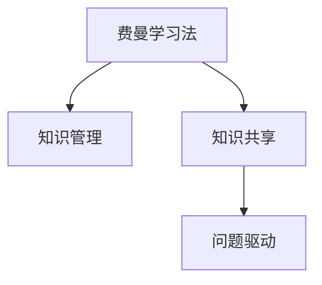

                 

# 费曼提问法促进团队学习与成长

> 关键词：费曼学习法, 团队学习, 知识管理, 知识共享, 问题驱动

## 1. 背景介绍

### 1.1 问题由来

在知识快速更新的今天，团队的学习与成长显得尤为重要。然而，传统的课堂教学、孤立的自主学习等方法往往难以满足快速变化的技术需求。因此，有效的团队学习方式成为科技公司推动技术前沿的关键。

费曼学习法（The Feynman Technique），又称为费曼教学法，源自诺贝尔物理学奖得主理查德·费曼(Richard Feynman)的思考方式，通过自我解释和教学来巩固知识。费曼学习法因其简单易行、效果显著，近年来在各大企业和技术社区中广受推崇。

本文旨在详细探讨费曼学习法在促进团队学习与成长中的应用，分析其核心原理，并结合实践案例给出具体操作指南。

## 2. 核心概念与联系

### 2.1 核心概念概述

- **费曼学习法(The Feynman Technique)**：通过自我解释和教学巩固知识的自学方法。费曼学习法通常包括四个步骤：选择主题、理解概念、以教为学、简化解释。

- **知识管理(Knowledge Management)**：系统化地管理和应用知识的过程。通过有效的方法和工具，对团队所掌握的知识进行收集、整理、共享和再利用。

- **知识共享(Knowledge Sharing)**：将知识传递给他人的行为。知识共享能够帮助团队成员相互学习，快速适应新的技术挑战。

- **问题驱动(Problem-Driven)**：以问题为中心的学习方式。通过解决问题，驱动团队成员主动获取知识、提高技能。

以上概念之间的关系如图示所示：



可以看出，费曼学习法、知识管理、知识共享、问题驱动等概念彼此相连，共同构成了团队学习的完整生态。

## 3. 核心算法原理 & 具体操作步骤
### 3.1 算法原理概述

费曼学习法的核心原理是通过自我解释和教学来促进知识内化。具体包括以下几个步骤：

1. **选择主题**：选择一个感兴趣或需要掌握的知识点。
2. **理解概念**：尽可能深入理解该知识点的核心内容。
3. **以教为学**：尝试用简单的语言向他人解释该知识点，就像你在教一个外行一样。
4. **简化解释**：如果遇到难以解释的复杂概念，进行简化，直到能够清晰、简明地表达出来。

通过这一系列的互动和反思，费曼学习法能够有效提升团队成员的知识掌握能力和理解深度。

### 3.2 算法步骤详解

下面详细介绍费曼学习法的详细步骤：

**Step 1: 选择主题**

- 确定一个你想要深入理解的主题。主题可以来自技术文档、项目需求、团队讨论等。
- 确保选择的主题具有实际意义，能够应用于解决具体问题。

**Step 2: 理解概念**

- 深度阅读相关资料，尽可能理解主题的每一个细节。
- 遇到难点时，进行标记，反复阅读。
- 可以借助在线教程、书籍、论坛讨论等资源，加深理解。

**Step 3: 以教为学**

- 向他人讲解所选主题，就像你在教一个外行一样。
- 讲解过程中，如果遇到无法解释清楚的地方，进行标记。
- 可以通过录制视频、制作PPT、编写博客等方式，记录下讲解内容。

**Step 4: 简化解释**

- 针对讲解过程中标记的难点，进行深入研究。
- 如果可能，尝试用更简单、更易理解的方式表达这些复杂概念。
- 不断重复这一过程，直至能够清晰、简明地表达出来。

通过这一系列的互动和反思，费曼学习法能够有效提升团队成员的知识掌握能力和理解深度。

### 3.3 算法优缺点

费曼学习法具有以下优点：

- **易于实施**：只需要纸笔和基本工具，简单易行。
- **知识内化**：通过自我解释和教学，加深对知识点的理解和记忆。
- **灵活应用**：适用于各种知识类型，从技术到管理，从设计到市场，都能有效应用。

同时，费曼学习法也存在一些缺点：

- **可能耗费时间**：对于复杂主题，深入理解和简明表达可能需要较长时间。
- **依赖讲解对象**：找到合适的讲解对象可能存在难度。
- **质量难以控制**：讲解质量可能受限于个人表达能力和知识深度。

尽管有这些局限，费曼学习法仍是一种高效、实用的学习方式，特别适用于技术团队的学习与成长。

### 3.4 算法应用领域

费曼学习法适用于各种技术团队的学习与成长，具体应用场景包括：

- **技术文档阅读**：通过费曼学习法，可以更深入理解技术文档，掌握核心知识点。
- **技术分享会**：团队内部技术分享会中，成员可以借助费曼学习法准备分享内容，提升分享质量。
- **项目管理**：在项目管理过程中，费曼学习法可以帮助项目组成员深入理解项目需求和核心问题。
- **新技术学习**：面对新技术，通过费曼学习法，可以快速掌握相关知识，跟上技术前沿。

## 4. 数学模型和公式 & 详细讲解 & 举例说明

### 4.1 数学模型构建

费曼学习法虽然不涉及复杂的数学公式，但其核心原理可借助数学模型进行解释。以下是一个简化版的数学模型：

假设有一个知识点 $X$，我们希望通过费曼学习法加深对其理解。该模型包括四个变量：

- $X$：需要理解的知识点。
- $P$：理解程度，初始值为0。
- $Q$：讲解效果，初始值为0。
- $R$：简化效果，初始值为0。

模型中，$X$ 通过 $P$ 进行理解，$P$ 通过 $Q$ 进行讲解，$Q$ 通过 $R$ 进行简化，最终 $X$ 的掌握程度为 $X = P \times Q \times R$。

### 4.2 公式推导过程

- 初始化：$P = 0$，$Q = 0$，$R = 0$。
- 理解阶段：通过不断阅读和研究，$P$ 逐渐增加，直到接近1。
- 讲解阶段：通过向他人讲解，$Q$ 逐渐增加，直到接近1。
- 简化阶段：针对讲解中难以表达的地方，进行简化，$R$ 逐渐增加，直到接近1。
- 最终掌握：$X = P \times Q \times R \approx 1 \times 1 \times 1 = 1$。

### 4.3 案例分析与讲解

以下是一个具体的费曼学习法应用案例：

**案例：理解Kubernetes的分布式架构**

1. **选择主题**：Kubernetes的分布式架构。
2. **理解概念**：通过阅读官方文档、观看在线课程、参加讨论会，深入理解Kubernetes的分布式架构。
3. **以教为学**：在团队内部进行讲解，遇到难以解释的部分进行标记。
4. **简化解释**：针对标记的难点进行深入研究，找到更简单的表达方式，最终能清晰、简明地解释Kubernetes的分布式架构。

通过这一过程，团队成员不仅掌握了Kubernetes的分布式架构，还提升了沟通和表达能力。

## 5. 项目实践：代码实例和详细解释说明

### 5.1 开发环境搭建

在进行费曼学习法实践前，需要准备一些开发工具：

1. **笔记工具**：如Notion、Evernote等，用于记录学习笔记。
2. **视频录制工具**：如OBS Studio、Zoom等，用于录制讲解视频。
3. **版本控制工具**：如Git，用于管理和分享笔记和视频。
4. **项目管理工具**：如Jira、Trello等，用于跟踪学习进度和任务。

完成工具安装后，即可开始实践。

### 5.2 源代码详细实现

以下是一个简单的费曼学习法实践工具示例，使用Python实现：

```python
class FeynmanLearn:
    def __init__(self):
        self.topics = []
        self.notes = {}
    
    def add_topic(self, topic):
        self.topics.append(topic)
    
    def get_notes(self, topic):
        if topic in self.notes:
            return self.notes[topic]
        else:
            return None
    
    def add_note(self, topic, note):
        if topic not in self.notes:
            self.notes[topic] = []
        self.notes[topic].append(note)
    
    def save_notes(self, folder):
        for topic, notes in self.notes.items():
            with open(f"{folder}/{topic}.txt", "w") as file:
                for note in notes:
                    file.write(note + "\n")
    
    def load_notes(self, folder):
        for topic in os.listdir(folder):
            with open(os.path.join(folder, topic), "r") as file:
                notes = file.read().split("\n")
                self.notes[topic] = notes
```

以上代码实现了一个简单的费曼学习法笔记管理系统。

### 5.3 代码解读与分析

让我们逐行解读代码：

**FeynmanLearn类**：
- `__init__`方法：初始化笔记列表和笔记字典。
- `add_topic`方法：向笔记列表添加主题。
- `get_notes`方法：获取指定主题的笔记。
- `add_note`方法：向指定主题添加笔记。
- `save_notes`方法：将笔记保存到文件夹中。
- `load_notes`方法：从文件夹中加载笔记。

该类实现了一个简单的笔记管理系统，支持添加主题、记录笔记、保存和加载笔记等功能。

### 5.4 运行结果展示

运行以上代码，可以创建一个费曼学习法笔记管理系统。例如，可以添加主题“Kubernetes分布式架构”，进行深入学习和讲解，并保存和查看相关笔记。

## 6. 实际应用场景

### 6.1 公司内部培训

在企业内部培训中，费曼学习法能够帮助员工深入理解培训内容，提升培训效果。具体应用场景包括：

- **技术培训**：在技术培训中，员工通过费曼学习法，可以更深入理解培训内容，并主动向同事讲解，加深理解和记忆。
- **新员工入职培训**：新员工通过费曼学习法，可以更快地掌握公司内部知识和流程，提升入职效率。

### 6.2 技术团队交流

在技术团队内部交流中，费曼学习法能够促进知识共享和团队协作。具体应用场景包括：

- **技术分享会**：在技术分享会上，通过费曼学习法准备分享内容，提升分享质量。
- **技术讨论**：在技术讨论中，通过费曼学习法深入理解问题，并探讨解决方案。

### 6.3 项目开发

在项目开发过程中，费曼学习法能够帮助团队成员深入理解项目需求和核心问题。具体应用场景包括：

- **需求分析**：通过费曼学习法，团队成员可以更深入理解项目需求，提出更合理的解决方案。
- **技术调研**：在技术调研中，通过费曼学习法，可以快速掌握相关技术，跟上技术前沿。

## 7. 工具和资源推荐

### 7.1 学习资源推荐

为帮助开发者系统掌握费曼学习法，以下推荐一些优质的学习资源：

1. **《费曼学习法》书籍**：多位专家作者编著，系统介绍了费曼学习法的基本原理和应用方法。
2. **Coursera《设计费曼图》课程**：由密歇根大学提供，介绍了费曼图的绘制方法和应用，适合初学者的入门课程。
3. **TED演讲《The Feynman Technique: How to Learn Anything》**：Richard Feynman本人在TED演讲中介绍了费曼学习法的核心思想和方法。
4. **YouTube频道《Thomas Frank The Feynman Technique》**：Thomas Frank通过视频系列详细讲解了费曼学习法的使用方法和实践技巧。

通过这些资源的学习实践，相信你一定能够快速掌握费曼学习法的精髓，并用于解决实际的团队学习问题。

### 7.2 开发工具推荐

高效的开发离不开优秀的工具支持。以下是几款用于费曼学习法开发的常用工具：

1. **Jupyter Notebook**：免费的交互式编程环境，支持Python代码编写和数据处理，适合科研和教学。
2. **Notion**：集成笔记、任务管理、数据库等功能，方便知识记录和分享。
3. **Zoom**：在线视频会议工具，适合远程交流和视频录制。
4. **Git**：版本控制工具，支持代码版本管理和团队协作。
5. **OBS Studio**：开源的视频录制工具，支持多种输入输出格式，适合录制和编辑视频。

合理利用这些工具，可以显著提升费曼学习法实践的效率，加快知识传播和团队学习的速度。

### 7.3 相关论文推荐

费曼学习法的理论和实践研究在学界和业界都有大量相关文献。以下推荐几篇经典论文：

1. **《The Feynman Technique: How to Learn Anything》**：Richard Feynman本人在TED演讲中介绍了费曼学习法的核心思想和方法。
2. **《The Feynman Technique》**：Thomas Frank详细讲解了费曼学习法的使用方法和实践技巧。
3. **《Using the Feynman Technique to Teach and Learn Math》**：Ximara Karssemeier介绍了费曼学习法在数学教学中的应用。
4. **《Learning to Teach with the Feynman Technique》**：David C. Kingdon介绍了费曼学习法在教师培训中的应用。

这些论文代表了大规模语言模型微调技术的发展脉络。通过学习这些前沿成果，可以帮助研究者把握学科前进方向，激发更多的创新灵感。

## 8. 总结：未来发展趋势与挑战

### 8.1 总结

本文对费曼学习法在促进团队学习与成长中的应用进行了全面系统的介绍。首先阐述了费曼学习法的基本原理和应用场景，明确了费曼学习法在团队学习和知识管理中的独特价值。其次，从原理到实践，详细讲解了费曼学习法的核心步骤，给出了费曼学习法实践的工具和资源。

通过本文的系统梳理，可以看到，费曼学习法在团队学习和知识管理中具有广阔的应用前景，极大地提升了团队成员的知识掌握能力和理解深度。未来，伴随知识管理的持续进步，相信费曼学习法必将在更多企业和技术社区中得到广泛应用。

### 8.2 未来发展趋势

展望未来，费曼学习法将呈现以下几个发展趋势：

1. **知识管理系统智能化**：未来的知识管理系统将更加智能化，通过大数据和人工智能技术，自动推荐相关知识，优化知识管理效率。
2. **学习路径个性化**：通过机器学习算法，为不同背景和需求的学习者推荐个性化的学习路径，提升学习效果。
3. **跨领域应用普及**：费曼学习法不仅限于技术团队，将在更多行业领域推广应用，促进知识共享和团队协作。
4. **社会化学习平台兴起**：社会化学习平台将整合费曼学习法和其他学习方式，构建更加开放、互动的学习生态。

以上趋势凸显了费曼学习法在知识管理中的广阔前景。这些方向的探索发展，必将进一步提升团队学习的效果，加速知识的传播和应用。

### 8.3 面临的挑战

尽管费曼学习法已经取得了显著成效，但在推广应用过程中，仍面临一些挑战：

1. **时间和资源投入**：费曼学习法需要耗费一定的时间和精力，需要团队持续投入。
2. **文化差异**：不同团队的学习习惯和知识管理方式不同，如何推动统一的学习文化，需要更多沟通和引导。
3. **效果评估**：如何量化和评估费曼学习法的效果，需要更多的研究和实践。
4. **隐私和伦理问题**：在团队学习和知识分享过程中，如何保护隐私和伦理，避免信息泄露和滥用，需要更多的规范和机制。

尽管有这些挑战，费曼学习法仍是一种高效、实用的学习方式，特别适用于技术团队的学习与成长。相信随着学界和产业界的共同努力，这些挑战终将一一克服，费曼学习法必将在构建人机协同的智能时代中扮演越来越重要的角色。

### 8.4 研究展望

面对费曼学习法面临的挑战，未来的研究需要在以下几个方面寻求新的突破：

1. **知识管理系统优化**：通过大数据和人工智能技术，优化知识管理系统，提升知识管理的效率和效果。
2. **学习路径推荐算法**：开发推荐算法，根据学习者的背景和需求，推荐个性化的学习路径。
3. **社会化学习平台建设**：构建开放、互动的社会化学习平台，促进知识共享和团队协作。
4. **隐私保护机制**：在团队学习和知识分享过程中，建立隐私保护机制，确保信息安全和隐私保护。

这些研究方向的探索，必将引领费曼学习法走向更加成熟和普及，为团队学习和知识管理提供新的方法论和工具。

## 9. 附录：常见问题与解答

**Q1：费曼学习法是否适用于所有知识领域？**

A: 费曼学习法适用于大多数知识领域，包括技术、管理、设计、营销等。但其应用效果可能因领域特点而有所不同。例如，技术领域可以通过讲解代码、绘制图表等方式进行讲解，而管理领域则可以通过案例分析、角色扮演等方式进行讲解。

**Q2：费曼学习法需要投入多少时间？**

A: 费曼学习法的时间投入因主题复杂度而异，简单的主题可能需要30分钟，复杂的主题可能需要几小时甚至几天。建议根据具体情况，灵活安排学习时间，不必强求在短时间内完成所有学习任务。

**Q3：如何提升费曼学习法的效果？**

A: 提升费曼学习法效果的关键在于深入理解和简洁表达。具体建议包括：
1. 深入理解知识点的核心内容。
2. 选择合适的讲解方式，如图示、图表、代码等。
3. 多向他人讲解，接受反馈，不断改进讲解方式。
4. 简化解释，找到更易理解的方式。

通过持续的实践和改进，可以显著提升费曼学习法的效果。

**Q4：如何平衡费曼学习法和日常工作？**

A: 平衡费曼学习法和日常工作需要合理规划时间。建议将费曼学习法作为日常工作的补充，而不是替代。例如，在通勤、午休等零碎时间进行学习，或在工作间隙向同事讲解相关知识。通过持续的微调，逐步提升费曼学习法的效果。

**Q5：如何评估费曼学习法的效果？**

A: 评估费曼学习法的效果可以从多个角度进行：
1. 知识掌握度：通过自我测试和他人测试，评估对知识点的掌握程度。
2. 讲解清晰度：通过他人反馈，评估讲解内容的清晰度和理解度。
3. 应用效果：通过实际项目和任务，评估知识点的应用效果。

通过这些评估方法，可以持续改进费曼学习法的效果，提升团队学习与成长的效率。

---

作者：禅与计算机程序设计艺术 / Zen and the Art of Computer Programming

