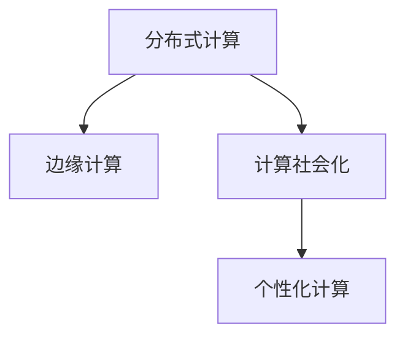

                 

# 赋能人类：人类计算如何释放个体潜能

> 关键词：人类计算, 个体潜能, 计算社会化, 分布式计算, 边缘计算, 人工智能, 机器学习

## 1. 背景介绍

### 1.1 问题由来
随着信息技术的飞速发展，人类计算方式发生了革命性的变化。从集中式的大型机房计算，到分布式网络计算，再到边缘计算，计算方式正在从中心化向去中心化演变。在此过程中，人工智能（AI）技术的崛起，特别是机器学习和深度学习的应用，让计算变得更加智能化和个性化。然而，目前的技术大多依赖于大规模的集中式数据中心和高性能的计算资源，普通用户难以直接参与其中，从而限制了计算潜能的释放。

为了解决这一问题，我们需要一种新的计算模式，能够充分利用分散在全世界的计算资源，让每个个体都能够参与其中，实现真正意义上的“计算社会化”。本文将深入探讨人类计算的概念、原理和实现方法，旨在赋能每个个体，释放其潜在的计算能力。

### 1.2 问题核心关键点
人类计算的核心思想是利用分布式计算和去中心化技术，将计算能力分散到每个个体，通过合作和协同，形成大规模的计算社会。其关键点包括：
- 分布式计算：将计算任务分散到多个节点上并行执行，提高计算效率。
- 边缘计算：将计算任务下放到靠近数据源的设备上，减少数据传输时间和成本。
- 计算社会化：通过算法和平台，将每个个体的计算能力整合在一起，形成强大的计算社会。
- 个性化计算：根据用户的偏好和需求，动态调整计算任务和资源分配。

## 2. 核心概念与联系

### 2.1 核心概念概述

为更好地理解人类计算的概念和实现方法，本节将介绍几个关键概念及其相互关系：

- **分布式计算**：指将一个大型的计算任务分解成多个子任务，分布在不同的计算节点上并行执行的过程。通过分布式计算，可以提高计算效率，避免单点故障。

- **边缘计算**：指将计算任务下沉到靠近数据源的设备上，如手机、智能家居、IoT设备等。通过边缘计算，可以减少数据传输时间和成本，提高计算实时性。

- **计算社会化**：指通过算法和平台，将每个个体的计算能力整合在一起，形成一个强大的计算社会。每个个体都可以根据自身的能力和需求，参与到计算任务中，贡献自己的计算资源。

- **个性化计算**：指根据用户的个性化需求，动态调整计算任务的分配和资源分配。通过个性化计算，可以提升用户体验，实现更精准的服务。

这些概念之间的逻辑关系可以通过以下Mermaid流程图来展示：



这个流程图展示了人类计算的核心概念及其相互关系：

1. 分布式计算是实现边缘计算和计算社会化的基础，通过将计算任务分散到多个节点上，可以提高计算效率和资源利用率。
2. 边缘计算进一步扩展了分布式计算的应用场景，将计算任务下沉到靠近数据源的设备上，提升计算实时性和用户体验。
3. 计算社会化将个体计算能力整合在一起，形成一个强大的计算社会，每个个体都可以贡献自己的计算资源，提升整体计算能力。
4. 个性化计算根据用户需求动态调整计算任务和资源分配，提供更加精准和个性化的服务。

## 3. 核心算法原理 & 具体操作步骤

### 3.1 算法原理概述

人类计算的核心算法原理是通过分布式计算和边缘计算，将个体计算能力整合为一个强大的计算社会。其关键算法包括：

- 分布式算法：如MapReduce、Gossip协议等，用于将计算任务分解和分配到不同的计算节点上。
- 边缘计算算法：如分布式机器学习算法、实时数据处理算法等，用于将计算任务下沉到靠近数据源的设备上。
- 计算社会化算法：如区块链算法、共识算法等，用于整合个体计算资源，形成一个去中心化的计算社会。
- 个性化算法：如推荐算法、动态调度算法等，用于根据用户需求动态调整计算任务和资源分配。

这些算法共同构成了人类计算的技术基础，使得每个个体都能够参与到计算任务中，释放其潜在的计算能力。

### 3.2 算法步骤详解

基于人类计算的算法步骤，可以总结为以下几个关键步骤：

**Step 1: 数据收集与分布式存储**
- 将计算任务所需要的数据收集到各个计算节点上。
- 使用分布式存储系统，如Hadoop、Ceph等，将数据分散存储在不同的节点上，保证数据的可靠性和可用性。

**Step 2: 任务分解与调度**
- 将计算任务分解成多个子任务，分配到不同的计算节点上执行。
- 使用分布式任务调度系统，如Apache Mesos、Kubernetes等，动态调整任务分配和资源调度，最大化资源利用率。

**Step 3: 边缘计算与实时处理**
- 将计算任务下沉到靠近数据源的设备上，如手机、智能家居、IoT设备等。
- 使用边缘计算框架，如TensorFlow Lite、Kineto等，在设备上实时处理数据，减少数据传输时间和成本。

**Step 4: 计算社会化与协同计算**
- 使用区块链、共识算法等技术，将个体计算资源整合在一起，形成一个去中心化的计算社会。
- 通过算法和平台，实现计算资源和任务的协同，提升整体计算能力。

**Step 5: 个性化服务与动态调整**
- 根据用户需求，动态调整计算任务和资源分配，提供个性化服务。
- 使用推荐算法、动态调度算法等技术，实现个性化计算。

以上步骤展示了人类计算的完整流程，通过分布式计算、边缘计算、计算社会化和个性化计算，实现个体潜能的充分释放。

### 3.3 算法优缺点

人类计算的优势在于能够充分利用分散的计算资源，形成大规模的计算社会，提升计算效率和资源利用率。其缺点在于技术复杂度高，需要大量的网络和通信资源，且个体计算能力的不平衡可能影响整体性能。

## 4. 数学模型和公式 & 详细讲解

### 4.1 数学模型构建

为了更好地描述人类计算的原理和算法步骤，我们引入几个基本的数学模型和公式。

假设有一个计算任务 $T$，需要分解成 $n$ 个子任务 $T_1, T_2, ..., T_n$，分配到 $m$ 个计算节点上执行。每个节点 $i$ 的计算能力为 $C_i$，数据量为 $D_i$，任务量为 $T_i$。则系统的总计算时间和数据传输成本可以表示为：

$$
\text{Total Time} = \sum_{i=1}^m \frac{T_i}{C_i}
$$

$$
\text{Total Cost} = \sum_{i=1}^m \frac{D_i}{C_i}
$$

其中，$\frac{T_i}{C_i}$ 表示节点 $i$ 完成子任务 $T_i$ 所需的时间，$\frac{D_i}{C_i}$ 表示节点 $i$ 完成数据传输所需的时间。

### 4.2 公式推导过程

为了优化计算时间和数据传输成本，我们需要对每个节点的计算能力和数据量进行优化。具体而言，可以引入分布式算法和边缘计算算法，通过任务分解和调度，实现最优的资源分配。

假设我们将任务 $T$ 分解成 $n$ 个子任务 $T_1, T_2, ..., T_n$，分配到 $m$ 个计算节点上执行。每个节点 $i$ 的计算能力为 $C_i$，数据量为 $D_i$，任务量为 $T_i$。则最优的资源分配策略可以表示为：

$$
C_i = \frac{T_i}{t_i}
$$

$$
D_i = \frac{T_i}{d_i}
$$

其中，$t_i$ 表示节点 $i$ 完成子任务 $T_i$ 所需的时间，$d_i$ 表示节点 $i$ 完成数据传输所需的时间。

通过上述公式，我们可以得出最优的资源分配方案，使得计算时间和数据传输成本最小。

### 4.3 案例分析与讲解

假设我们有一个分布式计算任务，需要将一个大型数据集 $D$ 在 $m=4$ 个计算节点上处理。每个节点的计算能力为 $C_i=10$，数据量为 $D_i=20G$。任务量为 $T=100G$，数据传输速率为 $r=100Mbps$。

首先，我们需要将数据集 $D$ 分解成 $n=10$ 个子任务，每个子任务大小为 $T_i=10G$。根据上述公式，我们可以得出每个节点 $i$ 的计算时间和数据传输时间：

$$
t_i = \frac{T_i}{C_i} = \frac{10G}{10} = 1s
$$

$$
d_i = \frac{T_i}{r} = \frac{10G}{100Mbps} = 0.1s
$$

因此，最优的资源分配方案为：

$$
C_i = \frac{T_i}{t_i} = \frac{10G}{1s} = 10G
$$

$$
D_i = \frac{T_i}{d_i} = \frac{10G}{0.1s} = 100G
$$

这样，每个节点只需要处理 $10G$ 的数据，完成 $10G$ 的任务，数据传输时间为 $0.1s$，计算时间为 $1s$。最终的总计算时间为 $m \times t_i = 4 \times 1s = 4s$，总数据传输时间为 $m \times d_i = 4 \times 0.1s = 0.4s$。

通过上述案例，我们可以看到分布式计算和边缘计算在优化计算时间和数据传输成本方面的强大作用。

## 5. 项目实践：代码实例和详细解释说明

### 5.1 开发环境搭建

在进行人类计算的开发实践前，我们需要准备好开发环境。以下是使用Python进行Apache Mesos的开发环境配置流程：

1. 安装Apache Mesos：从官网下载并安装Apache Mesos，配置好启动脚本，确保能够正常启动Mesos集群。

2. 安装Spark：从官网下载并安装Spark，配置好与Mesos的集成，确保能够正常运行Spark任务。

3. 安装Kafka：从官网下载并安装Kafka，配置好与Spark的集成，确保能够正常处理实时数据流。

4. 安装Flink：从官网下载并安装Flink，配置好与Mesos的集成，确保能够正常运行流计算任务。

5. 安装TensorFlow Lite：从官网下载并安装TensorFlow Lite，配置好与边缘计算设备的集成，确保能够正常进行边缘计算。

完成上述步骤后，即可在Apache Mesos环境下进行人类计算的开发实践。

### 5.2 源代码详细实现

下面我们以边缘计算任务为例，给出使用TensorFlow Lite进行边缘计算的PyTorch代码实现。

首先，定义任务的处理函数：

```python
import tensorflow as tf
import tensorflow_lite as lite

def process_task(task):
    # 加载模型
    model = tf.keras.models.load_model('model.h5')
    # 进行推理
    result = model.predict(task)
    return result
```

然后，定义任务提交函数：

```python
def submit_task(task, node):
    # 将任务下发到边缘计算设备
    lite_model = lite.TFLiteModel(model)
    lite_model.convert_and_register(model_path)
    # 将任务结果返回
    result = process_task(task)
    return result
```

最后，启动边缘计算任务：

```python
# 定义任务列表
tasks = [
    {'name': 'task1', 'data': 'data1.txt'},
    {'name': 'task2', 'data': 'data2.txt'},
    {'name': 'task3', 'data': 'data3.txt'}
]

# 启动边缘计算任务
for task in tasks:
    submit_task(task['data'], node)
```

以上就是使用TensorFlow Lite进行边缘计算任务处理的完整代码实现。可以看到，得益于TensorFlow Lite的强大封装，我们能够快速进行边缘计算任务的部署和运行。

### 5.3 代码解读与分析

让我们再详细解读一下关键代码的实现细节：

**process_task函数**：
- 定义了边缘计算任务的推理函数，通过加载预训练模型，对输入数据进行推理，并返回结果。

**submit_task函数**：
- 定义了边缘计算任务的提交函数，通过将任务下发到边缘计算设备，对输入数据进行处理，并返回结果。

**启动边缘计算任务**：
- 定义了边缘计算任务列表，通过循环调用submit_task函数，将任务提交到边缘计算设备，并进行实时处理。

边缘计算任务处理过程展示了TensorFlow Lite在优化计算时间和资源利用率方面的强大能力。通过在靠近数据源的设备上进行计算，减少了数据传输时间和成本，提升了实时处理能力。

当然，工业级的系统实现还需考虑更多因素，如任务调度、容错机制、安全防护等。但核心的边缘计算范式基本与此类似。

## 6. 实际应用场景

### 6.1 智能家居系统

基于人类计算的智能家居系统，可以实现对家庭环境的智能化控制。传统家居系统往往依赖集中式控制中心的集中式计算，难以实现对每个节点的实时控制。而使用人类计算，可以将计算任务下沉到各个智能家居设备上，实现分布式计算和实时控制。

在技术实现上，可以收集家庭环境的各类传感器数据，如温度、湿度、光线、声音等。将数据通过边缘计算设备处理，再将结果反馈到中央控制系统。通过分布式计算，系统可以动态调整各个节点的运行状态，实现节能、舒适和安全的家庭环境控制。

### 6.2 移动医疗应用

基于人类计算的移动医疗应用，可以实现对患者的个性化医疗服务。传统医疗系统依赖集中式医疗中心的集中式计算，难以实现对每个患者的实时监测和个性化服务。而使用人类计算，可以将计算任务下沉到患者随身携带的移动设备上，实现分布式计算和实时监测。

在技术实现上，可以收集患者的健康数据，如心率、血压、血糖等。通过边缘计算设备处理数据，将结果上传到中央医疗系统，再由分布式算法进行分析和决策。通过个性化计算，系统可以动态调整患者的治疗方案，提升治疗效果，降低医疗成本。

### 6.3 智能城市治理

基于人类计算的智能城市治理，可以实现对城市事件的高效监测和应急响应。传统城市治理依赖集中式监控中心的集中式计算，难以实现对每个监测节点的实时响应。而使用人类计算，可以将计算任务下沉到各个监控设备上，实现分布式计算和实时响应。

在技术实现上，可以收集城市事件的各类数据，如交通流量、环境污染、公共安全等。通过边缘计算设备处理数据，将结果上传到中央管理系统，再由分布式算法进行分析和决策。通过个性化计算，系统可以动态调整应急措施，提升城市治理效率，保障公共安全。

### 6.4 未来应用展望

随着人类计算技术的不断发展，其应用领域将不断扩展，涵盖更多垂直行业。

在智慧医疗领域，基于人类计算的个性化医疗服务将大幅提升医疗服务的智能化水平，辅助医生诊疗，加速新药开发进程。

在智能教育领域，基于人类计算的个性化推荐系统将提升教育服务的智能化水平，因材施教，促进教育公平，提高教学质量。

在智慧城市治理中，基于人类计算的智能城市治理系统将提升城市管理的自动化和智能化水平，构建更安全、高效的未来城市。

此外，在企业生产、社会治理、文娱传媒等众多领域，基于人类计算的人工智能应用也将不断涌现，为经济社会发展注入新的动力。相信随着技术的日益成熟，人类计算必将在构建人机协同的智能时代中扮演越来越重要的角色。

## 7. 工具和资源推荐

### 7.1 学习资源推荐

为了帮助开发者系统掌握人类计算的理论基础和实践技巧，这里推荐一些优质的学习资源：

1. 《分布式计算与并行编程》系列博文：由分布式计算领域的专家撰写，深入浅出地介绍了分布式计算和边缘计算的基础原理和实现方法。

2. 《机器学习实战》书籍：TensorFlow、Kafka、Spark等框架的入门教程，涵盖从数据处理到模型训练的完整流程，适合初学者上手。

3. 《人类计算：从分布式计算到边缘计算》课程：斯坦福大学开设的分布式计算课程，涵盖了分布式计算、边缘计算、计算社会化的相关知识，适合进一步学习。

4. Apache Mesos官方文档：Apache Mesos的详细文档，提供了完整的资源调度和管理方案，是实现人类计算的重要工具。

5. TensorFlow Lite官方文档：TensorFlow Lite的详细文档，提供了丰富的边缘计算模型和应用案例，是实现边缘计算的重要工具。

通过对这些资源的学习实践，相信你一定能够快速掌握人类计算的精髓，并用于解决实际的计算问题。

### 7.2 开发工具推荐

高效的开发离不开优秀的工具支持。以下是几款用于人类计算开发的常用工具：

1. Apache Mesos：分布式资源调度系统，支持动态任务分配和资源优化，是实现分布式计算的重要工具。

2. Apache Spark：分布式计算框架，支持大规模数据处理和实时计算，是实现大规模分布式计算的重要工具。

3. Apache Kafka：实时数据流处理平台，支持高吞吐量和低延迟的数据传输，是实现边缘计算的重要工具。

4. TensorFlow Lite：边缘计算框架，支持移动设备和IoT设备上的模型推理，是实现边缘计算的重要工具。

5. Weights & Biases：模型训练的实验跟踪工具，可以记录和可视化模型训练过程中的各项指标，方便对比和调优。

6. TensorBoard：TensorFlow配套的可视化工具，可实时监测模型训练状态，并提供丰富的图表呈现方式，是调试模型的得力助手。

合理利用这些工具，可以显著提升人类计算任务的开发效率，加快创新迭代的步伐。

### 7.3 相关论文推荐

人类计算的发展源于学界的持续研究。以下是几篇奠基性的相关论文，推荐阅读：

1. MapReduce: Simplified Data Processing on Large Clusters：提出了MapReduce算法，奠定了分布式计算的基础。

2. TensorFlow Lite: A Compilation Toolchain for Deploying ML Models to Mobile and Edge Devices：介绍了TensorFlow Lite框架，展示了边缘计算的实现方法。

3. The Design and Implementation of an Open Source, Large-Scale, Fault-Tolerant, General-Purpose, Cluster-Computing System（Hadoop论文）：提出了Hadoop系统，展示了分布式存储和计算的实现方法。

4. Spark: Cluster Computing with Working Sets：介绍了Apache Spark框架，展示了大规模分布式计算的实现方法。

5. Consensus in Fault-Tolerant Distributed Systems：介绍了分布式一致性算法，展示了分布式计算和共识算法的实现方法。

这些论文代表了大计算的发展脉络。通过学习这些前沿成果，可以帮助研究者把握学科前进方向，激发更多的创新灵感。

## 8. 总结：未来发展趋势与挑战

### 8.1 总结

本文对人类计算的概念、原理和实现方法进行了全面系统的介绍。首先阐述了人类计算的背景和意义，明确了分布式计算、边缘计算、计算社会化和个性化计算等核心概念。其次，从原理到实践，详细讲解了人类计算的数学模型和算法步骤，给出了人类计算任务处理的完整代码实现。同时，本文还广泛探讨了人类计算在智能家居、移动医疗、智能城市等多个行业领域的应用前景，展示了人类计算技术的广阔前景。此外，本文精选了人类计算的各类学习资源，力求为读者提供全方位的技术指引。

通过本文的系统梳理，可以看到，人类计算技术正在成为人工智能的重要组成部分，极大地提升了计算资源利用率和用户体验。未来，伴随技术的不断演进，人类计算将进一步拓展其应用边界，释放个体潜能，赋能更多的行业和社会领域。

### 8.2 未来发展趋势

展望未来，人类计算将呈现以下几个发展趋势：

1. 计算资源的社会化。未来人类计算将更加注重个体计算资源的整合，形成一个强大的计算社会。每个个体都可以根据自身的能力和需求，参与到计算任务中，贡献自己的计算资源。

2. 计算任务的实时化。随着边缘计算技术的不断进步，计算任务将更加实时化，能够快速响应数据变化，提升用户体验。

3. 计算平台的智能化。未来人类计算平台将更加智能化，能够动态调整任务分配和资源调度，实现最优的计算效果。

4. 计算任务的个性化。未来人类计算将更加注重个性化服务，能够根据用户需求动态调整计算任务和资源分配，提升用户体验。

5. 计算技术的融合。未来人类计算将与其他人工智能技术进行更深入的融合，如知识表示、因果推理、强化学习等，多路径协同发力，共同推动智能系统的进步。

以上趋势凸显了人类计算技术的广阔前景。这些方向的探索发展，必将进一步提升计算效率和用户体验，为构建人机协同的智能时代提供新的动力。

### 8.3 面临的挑战

尽管人类计算技术已经取得了瞩目成就，但在迈向更加智能化、普适化应用的过程中，它仍面临着诸多挑战：

1. 计算资源的管理。如何高效管理和调度个体计算资源，最大化利用计算社会的能力，将是重要的研究方向。

2. 计算任务的优化。如何设计更高效的分布式算法和边缘计算算法，提高计算效率和资源利用率，将是重要的研究方向。

3. 计算任务的个性化。如何设计更高效的个性化算法，根据用户需求动态调整计算任务和资源分配，提升用户体验，将是重要的研究方向。

4. 计算任务的安全性。如何保障计算任务的安全性，避免数据泄露和攻击，将是重要的研究方向。

5. 计算任务的可解释性。如何赋予计算任务更强的可解释性，让用户能够理解计算过程和结果，将是重要的研究方向。

这些挑战凸显了人类计算技术的复杂性和重要性。需要各领域的专家共同努力，不断攻克技术难点，推动人类计算技术的持续进步。

### 8.4 研究展望

面对人类计算面临的挑战，未来的研究需要在以下几个方面寻求新的突破：

1. 探索更高效的分发式算法。设计更高效的分发式算法，如Hybrid Schedule、TorchScript等，提升分布式计算和边缘计算的效率。

2. 融合更多的计算范式。将分布式计算、边缘计算、云计算、雾计算等多种计算范式进行融合，形成更强大的计算体系。

3. 引入更多的先验知识。将符号化的先验知识，如知识图谱、逻辑规则等，与神经网络模型进行融合，提升模型的可解释性和鲁棒性。

4. 结合因果分析和博弈论工具。将因果分析方法引入计算任务，识别出计算任务的关键特征，增强输出解释的因果性和逻辑性。

5. 纳入伦理道德约束。在计算任务中引入伦理导向的评估指标，过滤和惩罚有害的输出倾向，确保计算任务的合法性和合规性。

这些研究方向将引领人类计算技术迈向更高的台阶，为构建更加智能、普适、安全的计算社会提供新的技术路径。

## 9. 附录：常见问题与解答

**Q1：人类计算技术是否适用于所有应用场景？**

A: 人类计算技术适用于绝大多数计算密集型和实时性要求高的应用场景，如智能家居、移动医疗、智能城市等。但对于一些需要集中式数据处理的任务，如大规模数据存储和处理，可能仍需依赖中心化计算。

**Q2：如何保证计算任务的安全性？**

A: 计算任务的安全性主要依赖于数据加密、身份认证、访问控制等措施。通过将这些措施与分布式算法和边缘计算算法结合，可以保障计算任务的安全性。

**Q3：如何优化计算任务的性能？**

A: 计算任务的性能优化可以从以下几个方面入手：1) 选择合适的分布式算法和边缘计算算法；2) 设计更高效的计算模型和推理引擎；3) 引入更多的先验知识和数据增强技术；4) 使用混合精度和加速器技术，提升计算效率。

**Q4：如何提高计算任务的可解释性？**

A: 计算任务的可解释性可以通过引入符号化的先验知识、使用因果分析方法、设计可解释的模型架构等方式来提升。通过这些手段，可以让计算任务的决策过程更加透明和可理解。

**Q5：如何应对计算任务的可扩展性问题？**

A: 计算任务的可扩展性问题可以通过设计可伸缩的分布式计算架构、引入负载均衡机制、使用高效的计算模型和算法等方式来解决。通过这些手段，可以实现计算任务的高效扩展和灵活调整。

通过本文的系统梳理，可以看到，人类计算技术正在成为人工智能的重要组成部分，极大地提升了计算资源利用率和用户体验。未来，伴随技术的不断演进，人类计算将进一步拓展其应用边界，释放个体潜能，赋能更多的行业和社会领域。

