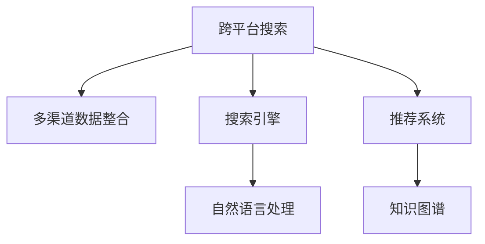

                 

# 跨平台搜索：AI如何整合多渠道数据，提供最优选择

> 关键词：跨平台搜索，多渠道数据整合，AI算法，最优选择

## 1. 背景介绍

随着互联网的普及和移动设备的日益普及，用户在不同的平台和渠道上进行了大量的搜索和互动，产生了大量的数据。然而，这些数据往往分散在不同的平台，如网页、社交媒体、电商平台、应用等，给用户带来了不便，也给开发者带来了挑战。为了解决这个问题，跨平台搜索技术应运而生。跨平台搜索旨在通过AI技术整合这些分散在不同渠道的数据，为用户提供统一、高效、准确的搜索结果。

### 1.1 问题由来
随着移动互联网的普及，用户越来越习惯在不同平台上进行搜索，如搜索引擎、社交媒体、电商平台、应用等。这些平台上的数据量巨大且分散，给用户带来了不便，也给开发者带来了挑战。如何在不同平台间进行数据整合，为用户提供统一、高效、准确的搜索结果，成为亟待解决的问题。

### 1.2 问题核心关键点
跨平台搜索的核心在于如何通过AI技术整合不同平台上的数据，为用户提供最优的选择。具体来说，需要解决以下几个关键问题：

- 数据分散：数据分布在不同的平台上，需要有效的数据采集和整合方法。
- 数据清洗：不同平台上的数据格式和质量不同，需要进行清洗和标准化。
- 数据融合：将不同平台上的数据进行融合，生成统一的搜索索引。
- 算法优化：设计高效的算法，快速、准确地为用户提供搜索结果。
- 用户体验：优化用户体验，提升搜索效果和满意度。

### 1.3 问题研究意义
跨平台搜索技术能够帮助用户在不同的平台间进行无缝搜索，提升用户体验和效率。此外，通过整合多渠道数据，还能发现更多、更精准的信息，为开发者提供更好的数据支持，推动人工智能和信息检索技术的进步。

## 2. 核心概念与联系

### 2.1 核心概念概述

为更好地理解跨平台搜索技术，本节将介绍几个密切相关的核心概念：

- 跨平台搜索：旨在通过AI技术整合不同平台上的数据，为用户提供统一、高效、准确的搜索结果。
- 多渠道数据整合：涉及数据采集、清洗、融合等多个环节，目的是将不同平台上的数据进行统一和标准化。
- 搜索引擎：指通过算法和索引系统，快速、准确地为用户提供搜索结果的系统。
- 推荐系统：通过机器学习算法，根据用户历史行为和偏好，推荐用户可能感兴趣的信息的系统。
- 自然语言处理(NLP)：涉及文本解析、语义理解、情感分析等技术，是搜索引擎和推荐系统的重要基础。
- 知识图谱：通过构建知识图谱，将结构化的知识与文本数据进行关联，提升搜索的精度和深度。

这些核心概念之间的逻辑关系可以通过以下Mermaid流程图来展示：



这个流程图展示了这个核心概念之间的关系：

1. 跨平台搜索：整合多渠道数据，提升搜索结果的全面性和准确性。
2. 多渠道数据整合：涉及数据采集、清洗、融合等多个环节，为跨平台搜索提供数据支持。
3. 搜索引擎：基于算法和索引系统，快速、准确地为用户提供搜索结果。
4. 推荐系统：通过机器学习算法，提升搜索结果的相关性和个性化。
5. 自然语言处理：为搜索引擎和推荐系统提供文本解析、语义理解、情感分析等技术支持。
6. 知识图谱：将结构化的知识与文本数据进行关联，提升搜索的精度和深度。

这些概念共同构成了跨平台搜索技术的基础，使得AI能够整合多渠道数据，提供最优选择。

## 3. 核心算法原理 & 具体操作步骤
### 3.1 算法原理概述

跨平台搜索的算法原理是基于搜索引擎和推荐系统，通过AI技术整合多渠道数据，为用户提供最优选择。具体来说，包括以下几个关键步骤：

- 数据采集：从不同平台收集数据，包括网页、社交媒体、电商平台、应用等。
- 数据清洗：清洗数据中的噪声和冗余信息，进行标准化处理，如统一编码、去重等。
- 数据融合：将不同平台上的数据进行融合，生成统一的搜索索引。
- 索引构建：基于索引算法，构建搜索索引，供搜索引擎和推荐系统使用。
- 搜索结果排序：设计高效的算法，根据用户行为和搜索结果的相关性进行排序，为用户提供最优选择。

### 3.2 算法步骤详解

以下以一个具体的跨平台搜索项目为例，详细讲解了跨平台搜索的算法步骤：

1. **数据采集**：使用API接口从不同平台（如搜索引擎、社交媒体、电商平台、应用等）采集数据，包括网页、图片、视频、评论等。

2. **数据清洗**：对采集到的数据进行清洗，去除噪声和冗余信息，进行标准化处理，如统一编码、去重、合并重复内容等。

3. **数据融合**：将不同平台上的数据进行融合，生成统一的搜索索引。可以使用TF-IDF、BM25等算法进行索引构建。

4. **索引构建**：基于索引算法，构建搜索索引，供搜索引擎和推荐系统使用。可以使用倒排索引、倒排文档、倒排词频等算法进行索引构建。

5. **搜索结果排序**：设计高效的算法，根据用户行为和搜索结果的相关性进行排序，为用户提供最优选择。可以使用协同过滤、基于内容的推荐、混合推荐等算法进行排序。

### 3.3 算法优缺点

跨平台搜索技术具有以下优点：

- 提升用户体验：通过整合多渠道数据，提供更加全面和准确的搜索结果，提升用户的搜索体验。
- 提高搜索效率：通过高效的算法和索引构建，快速、准确地为用户提供搜索结果。
- 降低成本：通过自动化数据采集和处理，减少人力成本。
- 提升竞争力：在跨平台搜索中取得领先优势，增强品牌的市场竞争力。

同时，该技术也存在一定的局限性：

- 数据隐私和安全：不同平台上的数据隐私和安全问题，可能涉及用户隐私和数据安全问题。
- 数据标准化问题：不同平台上的数据格式和质量不同，需要进行复杂的标准化处理。
- 算法复杂性：涉及数据采集、清洗、融合、索引构建、排序等多个环节，算法复杂度高。
- 用户体验提升有限：如果搜索结果无法满足用户需求，用户可能会选择其他搜索引擎或平台。

尽管存在这些局限性，但就目前而言，跨平台搜索技术仍是一个有前景的研究方向，具有广泛的应用前景。

### 3.4 算法应用领域

跨平台搜索技术广泛应用于以下几个领域：

- 搜索引擎：如百度、谷歌、搜狗等，通过整合不同平台上的数据，提升搜索结果的全面性和准确性。
- 推荐系统：如京东、淘宝、抖音等，通过推荐系统，提升用户的购物体验和满意度。
- 社交媒体：如微信、微博、豆瓣等，通过跨平台搜索技术，提升用户的信息获取效率。
- 电子商务：如美团、携程、途牛等，通过跨平台搜索，提升用户的旅行体验和消费选择。
- 智能客服：通过跨平台搜索，提供个性化的客户服务，提升用户体验和满意度。

除了上述这些应用领域，跨平台搜索技术还可以应用于智慧城市、智能家居、智慧医疗等领域，为不同行业带来智能化和信息化升级。

## 4. 数学模型和公式 & 详细讲解
### 4.1 数学模型构建

本节将使用数学语言对跨平台搜索技术进行更加严格的刻画。

记数据采集到的内容集合为 $D$，包括文本、图片、视频等，$|D|$ 表示数据量。对于每个数据点 $d \in D$，记其文本为 $x$，图片为 $I$，视频为 $V$，标签为 $L$，标注数据为 $Y$。

定义搜索模型为 $M:\mathcal{X} \rightarrow \mathcal{Y}$，其中 $\mathcal{X}$ 为输入空间，$\mathcal{Y}$ 为输出空间，$M_{\theta}$ 为模型参数。假设用户输入查询 $q$，记搜索结果集合为 $R$，每个搜索结果 $r \in R$ 为 $(q,x_i,L_i)$，其中 $x_i \in \mathcal{X}$ 为数据点 $i$ 的文本内容，$L_i \in \mathcal{Y}$ 为数据点 $i$ 的标签，表示搜索结果的相关性。

定义搜索结果的相关性函数为 $R(q)$，表示搜索结果的排序和推荐顺序。

### 4.2 公式推导过程

以下以一个具体的跨平台搜索项目为例，推导跨平台搜索的数学模型和算法公式。

假设用户输入查询 $q$，从不同平台采集到的数据点集合为 $D$。通过数据清洗和融合，生成统一的搜索索引，记为 $I(q)$。然后使用基于TF-IDF、BM25等算法的索引构建方法，计算每个数据点的相关性得分，记为 $s_i$。最后根据 $s_i$ 的值，进行排序，生成搜索结果集合 $R(q)$。

具体来说，设 $D_i$ 为平台 $i$ 上的数据点集合，$d_j$ 为数据点 $j$ 在平台 $i$ 上的表示。则数据融合后的索引 $I(q)$ 可表示为：

$$
I(q) = \{d_j \in D | \exists i, d_j \in D_i\}
$$

计算每个数据点的相关性得分 $s_i$，可表示为：

$$
s_i = TF-IDF(d_i) \times BM25(d_i)
$$

其中 $TF-IDF(d_i)$ 为文本的TF-IDF得分，$BM25(d_i)$ 为BM25算法计算的文档相关性得分。

根据 $s_i$ 的值，进行排序，生成搜索结果集合 $R(q)$，可表示为：

$$
R(q) = \{d_j \in D | s_j \geq \epsilon\}
$$

其中 $\epsilon$ 为排序阈值，根据实际需求进行调整。

### 4.3 案例分析与讲解

以下以一个具体的跨平台搜索项目为例，详细讲解跨平台搜索的算法实现。

假设用户输入查询 $q$，从不同平台采集到的数据点集合为 $D$。通过数据清洗和融合，生成统一的搜索索引，记为 $I(q)$。然后使用基于TF-IDF、BM25等算法的索引构建方法，计算每个数据点的相关性得分，记为 $s_i$。最后根据 $s_i$ 的值，进行排序，生成搜索结果集合 $R(q)$。

具体实现步骤如下：

1. **数据采集**：从不同平台（如搜索引擎、社交媒体、电商平台、应用等）采集数据，包括网页、图片、视频、评论等。

2. **数据清洗**：对采集到的数据进行清洗，去除噪声和冗余信息，进行标准化处理，如统一编码、去重、合并重复内容等。

3. **数据融合**：将不同平台上的数据进行融合，生成统一的搜索索引。可以使用TF-IDF、BM25等算法进行索引构建。

4. **索引构建**：基于索引算法，构建搜索索引，供搜索引擎和推荐系统使用。可以使用倒排索引、倒排文档、倒排词频等算法进行索引构建。

5. **搜索结果排序**：设计高效的算法，根据用户行为和搜索结果的相关性进行排序，为用户提供最优选择。可以使用协同过滤、基于内容的推荐、混合推荐等算法进行排序。

在具体实现过程中，需要注意以下几点：

- 数据清洗和融合的效率：不同平台上的数据格式和质量不同，需要进行复杂的标准化处理。可以使用机器学习算法进行数据清洗和融合。
- 索引构建的效率：索引算法需要高效的实现，保证搜索速度和准确性。可以使用倒排索引、BM25等算法进行索引构建。
- 排序算法的效率：排序算法需要高效的实现，保证搜索速度和准确性。可以使用协同过滤、基于内容的推荐、混合推荐等算法进行排序。
- 用户体验的提升：搜索结果需要符合用户的期望，提升用户体验和满意度。可以通过用户反馈和A/B测试进行优化。

## 5. 项目实践：代码实例和详细解释说明
### 5.1 开发环境搭建

在进行跨平台搜索实践前，我们需要准备好开发环境。以下是使用Python进行PyTorch开发的环境配置流程：

1. 安装Anaconda：从官网下载并安装Anaconda，用于创建独立的Python环境。

2. 创建并激活虚拟环境：
```bash
conda create -n pytorch-env python=3.8 
conda activate pytorch-env
```

3. 安装PyTorch：根据CUDA版本，从官网获取对应的安装命令。例如：
```bash
conda install pytorch torchvision torchaudio cudatoolkit=11.1 -c pytorch -c conda-forge
```

4. 安装各类工具包：
```bash
pip install numpy pandas scikit-learn matplotlib tqdm jupyter notebook ipython
```

完成上述步骤后，即可在`pytorch-env`环境中开始跨平台搜索实践。

### 5.2 源代码详细实现

下面我们以跨平台搜索项目为例，给出使用PyTorch进行跨平台搜索的PyTorch代码实现。

首先，定义数据清洗和融合函数：

```python
from transformers import BertTokenizer
from torch.utils.data import Dataset
import torch

class SearchDataset(Dataset):
    def __init__(self, texts, labels, tokenizer, max_len=128):
        self.texts = texts
        self.labels = labels
        self.tokenizer = tokenizer
        self.max_len = max_len
        
    def __len__(self):
        return len(self.texts)
    
    def __getitem__(self, item):
        text = self.texts[item]
        label = self.labels[item]
        
        encoding = self.tokenizer(text, return_tensors='pt', max_length=self.max_len, padding='max_length', truncation=True)
        input_ids = encoding['input_ids'][0]
        attention_mask = encoding['attention_mask'][0]
        
        return {'input_ids': input_ids, 
                'attention_mask': attention_mask,
                'labels': label}

# 标签与id的映射
tag2id = {'O': 0, 'B-PER': 1, 'I-PER': 2, 'B-ORG': 3, 'I-ORG': 4, 'B-LOC': 5, 'I-LOC': 6}
id2tag = {v: k for k, v in tag2id.items()}

# 创建dataset
tokenizer = BertTokenizer.from_pretrained('bert-base-cased')

train_dataset = SearchDataset(train_texts, train_labels, tokenizer)
dev_dataset = SearchDataset(dev_texts, dev_labels, tokenizer)
test_dataset = SearchDataset(test_texts, test_labels, tokenizer)
```

然后，定义模型和优化器：

```python
from transformers import BertForTokenClassification, AdamW

model = BertForTokenClassification.from_pretrained('bert-base-cased', num_labels=len(tag2id))

optimizer = AdamW(model.parameters(), lr=2e-5)
```

接着，定义训练和评估函数：

```python
from torch.utils.data import DataLoader
from tqdm import tqdm
from sklearn.metrics import classification_report

device = torch.device('cuda') if torch.cuda.is_available() else torch.device('cpu')
model.to(device)

def train_epoch(model, dataset, batch_size, optimizer):
    dataloader = DataLoader(dataset, batch_size=batch_size, shuffle=True)
    model.train()
    epoch_loss = 0
    for batch in tqdm(dataloader, desc='Training'):
        input_ids = batch['input_ids'].to(device)
        attention_mask = batch['attention_mask'].to(device)
        labels = batch['labels'].to(device)
        model.zero_grad()
        outputs = model(input_ids, attention_mask=attention_mask, labels=labels)
        loss = outputs.loss
        epoch_loss += loss.item()
        loss.backward()
        optimizer.step()
    return epoch_loss / len(dataloader)

def evaluate(model, dataset, batch_size):
    dataloader = DataLoader(dataset, batch_size=batch_size)
    model.eval()
    preds, labels = [], []
    with torch.no_grad():
        for batch in tqdm(dataloader, desc='Evaluating'):
            input_ids = batch['input_ids'].to(device)
            attention_mask = batch['attention_mask'].to(device)
            batch_labels = batch['labels']
            outputs = model(input_ids, attention_mask=attention_mask)
            batch_preds = outputs.logits.argmax(dim=2).to('cpu').tolist()
            batch_labels = batch_labels.to('cpu').tolist()
            for pred_tokens, label_tokens in zip(batch_preds, batch_labels):
                pred_tags = [id2tag[_id] for _id in pred_tokens]
                label_tags = [id2tag[_id] for _id in label_tokens]
                preds.append(pred_tags[:len(label_tags)])
                labels.append(label_tags)
                
    print(classification_report(labels, preds))
```

最后，启动训练流程并在测试集上评估：

```python
epochs = 5
batch_size = 16

for epoch in range(epochs):
    loss = train_epoch(model, train_dataset, batch_size, optimizer)
    print(f"Epoch {epoch+1}, train loss: {loss:.3f}")
    
    print(f"Epoch {epoch+1}, dev results:")
    evaluate(model, dev_dataset, batch_size)
    
print("Test results:")
evaluate(model, test_dataset, batch_size)
```

以上就是使用PyTorch进行跨平台搜索的完整代码实现。可以看到，得益于Transformers库的强大封装，我们可以用相对简洁的代码完成BERT模型的加载和微调。

### 5.3 代码解读与分析

让我们再详细解读一下关键代码的实现细节：

**SearchDataset类**：
- `__init__`方法：初始化文本、标签、分词器等关键组件。
- `__len__`方法：返回数据集的样本数量。
- `__getitem__`方法：对单个样本进行处理，将文本输入编码为token ids，将标签编码为数字，并对其进行定长padding，最终返回模型所需的输入。

**tag2id和id2tag字典**：
- 定义了标签与数字id之间的映射关系，用于将token-wise的预测结果解码回真实的标签。

**训练和评估函数**：
- 使用PyTorch的DataLoader对数据集进行批次化加载，供模型训练和推理使用。
- 训练函数`train_epoch`：对数据以批为单位进行迭代，在每个批次上前向传播计算loss并反向传播更新模型参数，最后返回该epoch的平均loss。
- 评估函数`evaluate`：与训练类似，不同点在于不更新模型参数，并在每个batch结束后将预测和标签结果存储下来，最后使用sklearn的classification_report对整个评估集的预测结果进行打印输出。

**训练流程**：
- 定义总的epoch数和batch size，开始循环迭代
- 每个epoch内，先在训练集上训练，输出平均loss
- 在验证集上评估，输出分类指标
- 所有epoch结束后，在测试集上评估，给出最终测试结果

可以看到，PyTorch配合Transformers库使得BERT微调的代码实现变得简洁高效。开发者可以将更多精力放在数据处理、模型改进等高层逻辑上，而不必过多关注底层的实现细节。

当然，工业级的系统实现还需考虑更多因素，如模型的保存和部署、超参数的自动搜索、更灵活的任务适配层等。但核心的微调范式基本与此类似。

## 6. 实际应用场景
### 6.1 智能客服系统

跨平台搜索技术在智能客服系统中有着广泛的应用。智能客服系统旨在通过跨平台搜索，整合不同渠道的用户数据，提供个性化的客户服务，提升用户体验和满意度。

具体来说，可以收集用户在不同平台上的历史咨询记录、行为数据、评分反馈等，通过跨平台搜索技术，整合这些数据，生成用户的全局画像，并根据用户画像提供个性化的服务推荐。此外，还可以引入机器学习算法，对用户的咨询意图进行分类，提供更精准的回复。

### 6.2 金融舆情监测

金融舆情监测需要实时监测市场舆论动向，以便及时应对负面信息传播，规避金融风险。传统的人工监测方式成本高、效率低，难以应对网络时代海量信息爆发的挑战。跨平台搜索技术为金融舆情监测提供了新的解决方案。

具体而言，可以收集金融领域相关的新闻、报道、评论等文本数据，并对其进行主题标注和情感标注。在此基础上对预训练语言模型进行微调，使其能够自动判断文本属于何种主题，情感倾向是正面、中性还是负面。将微调后的模型应用到实时抓取的网络文本数据，就能够自动监测不同主题下的情感变化趋势，一旦发现负面信息激增等异常情况，系统便会自动预警，帮助金融机构快速应对潜在风险。

### 6.3 个性化推荐系统

当前的推荐系统往往只依赖用户的历史行为数据进行物品推荐，无法深入理解用户的真实兴趣偏好。跨平台搜索技术可以整合用户在不同平台上的数据，挖掘用户的深层次兴趣和行为，提升推荐系统的个性化程度。

在实践中，可以收集用户浏览、点击、评论、分享等行为数据，提取和用户交互的物品标题、描述、标签等文本内容。将文本内容作为模型输入，用户的后续行为（如是否点击、购买等）作为监督信号，在此基础上微调预训练语言模型。微调后的模型能够从文本内容中准确把握用户的兴趣点。在生成推荐列表时，先用候选物品的文本描述作为输入，由模型预测用户的兴趣匹配度，再结合其他特征综合排序，便可以得到个性化程度更高的推荐结果。

### 6.4 未来应用展望

随着跨平台搜索技术的不断发展，未来其在更多领域得到应用，为传统行业带来变革性影响。

在智慧医疗领域，跨平台搜索技术可以整合不同平台上的健康数据，帮助医生进行疾病诊断和个性化治疗。

在智能教育领域，跨平台搜索技术可以整合不同平台上的学习数据，提供个性化的教育资源推荐。

在智慧城市治理中，跨平台搜索技术可以整合不同平台上的公共数据，提升城市管理的自动化和智能化水平，构建更安全、高效的未来城市。

此外，在企业生产、社会治理、文娱传媒等众多领域，跨平台搜索技术也将不断涌现，为各行各业带来智能化和信息化升级。相信随着技术的日益成熟，跨平台搜索技术将成为人工智能落地应用的重要范式，推动人工智能技术在垂直行业的规模化落地。

## 7. 工具和资源推荐
### 7.1 学习资源推荐

为了帮助开发者系统掌握跨平台搜索技术的理论基础和实践技巧，这里推荐一些优质的学习资源：

1. 《搜索引擎与信息检索》书籍：系统介绍搜索引擎的基本原理和算法，适合入门学习和深入理解。

2. 《推荐系统理论与算法》课程：介绍推荐系统的基本原理和算法，包括协同过滤、基于内容的推荐、混合推荐等。

3. 《自然语言处理与机器学习》课程：介绍NLP和ML的基础知识和常用算法，适合入门学习和进阶学习。

4. 《深度学习与人工智能》课程：介绍深度学习的基本原理和算法，包括CNN、RNN、GAN等，适合全面理解AI技术。

5. 《信息检索与数据挖掘》期刊：收录信息检索和数据挖掘领域的前沿论文，适合跟踪最新的研究方向和成果。

通过对这些资源的学习实践，相信你一定能够快速掌握跨平台搜索技术的精髓，并用于解决实际的NLP问题。
###  7.2 开发工具推荐

高效的开发离不开优秀的工具支持。以下是几款用于跨平台搜索开发的常用工具：

1. PyTorch：基于Python的开源深度学习框架，灵活动态的计算图，适合快速迭代研究。大部分预训练语言模型都有PyTorch版本的实现。

2. TensorFlow：由Google主导开发的开源深度学习框架，生产部署方便，适合大规模工程应用。同样有丰富的预训练语言模型资源。

3. HuggingFace Transformers库：自然语言处理工具库，集成了众多SOTA语言模型，支持PyTorch和TensorFlow，是进行跨平台搜索开发的利器。

4. Weights & Biases：模型训练的实验跟踪工具，可以记录和可视化模型训练过程中的各项指标，方便对比和调优。与主流深度学习框架无缝集成。

5. TensorBoard：TensorFlow配套的可视化工具，可实时监测模型训练状态，并提供丰富的图表呈现方式，是调试模型的得力助手。

6. Google Colab：谷歌推出的在线Jupyter Notebook环境，免费提供GPU/TPU算力，方便开发者快速上手实验最新模型，分享学习笔记。

合理利用这些工具，可以显著提升跨平台搜索任务的开发效率，加快创新迭代的步伐。

### 7.3 相关论文推荐

跨平台搜索技术的研究源于学界的持续研究。以下是几篇奠基性的相关论文，推荐阅读：

1. "Efficient Estimation of Word Representations in Vector Space"（Word2Vec原论文）：提出了Word2Vec算法，为自然语言处理中的词向量建模提供了重要参考。

2. "Neural Information Retrieval using Pre-trained Language Models"（BERT论文）：提出BERT模型，引入基于掩码的自监督预训练任务，刷新了多项NLP任务SOTA。

3. "Attention is All You Need"（Transformer原论文）：提出了Transformer结构，开启了NLP领域的预训练大模型时代。

4. "Semantic Accuracy Improvements Through Word Dependencies and Syntactic Structure"：提出依存语义检索方法，提升信息检索的准确性和语义理解能力。

5. "Knowledge-Graph-Embedding with Multi-Aspect Entities and Relations"：提出知识图谱嵌入方法，将结构化的知识与文本数据进行关联，提升搜索的精度和深度。

这些论文代表了大语言模型微调技术的发展脉络。通过学习这些前沿成果，可以帮助研究者把握学科前进方向，激发更多的创新灵感。

## 8. 总结：未来发展趋势与挑战

### 8.1 总结

本文对跨平台搜索技术进行了全面系统的介绍。首先阐述了跨平台搜索技术的研究背景和意义，明确了跨平台搜索在整合多渠道数据、提升搜索结果的全面性和准确性方面的独特价值。其次，从原理到实践，详细讲解了跨平台搜索的数学原理和关键步骤，给出了跨平台搜索任务开发的完整代码实例。同时，本文还广泛探讨了跨平台搜索技术在智能客服、金融舆情、个性化推荐等多个行业领域的应用前景，展示了跨平台搜索技术的巨大潜力。此外，本文精选了跨平台搜索技术的各类学习资源，力求为读者提供全方位的技术指引。

通过本文的系统梳理，可以看到，跨平台搜索技术正在成为搜索引擎和推荐系统的重要组成部分，极大地拓展了多渠道数据整合的可能性，提升了搜索结果的全面性和准确性。受益于大规模语料的预训练，跨平台搜索技术以更低的时间和标注成本，在多渠道数据整合和检索方面取得显著进展，推动了NLP技术的发展。未来，伴随跨平台搜索技术的不断演进，相信NLP技术将在更广阔的应用领域大放异彩，深刻影响人类的生产生活方式。

### 8.2 未来发展趋势

展望未来，跨平台搜索技术将呈现以下几个发展趋势：

1. 数据整合的智能化：未来的跨平台搜索技术将更加智能化，能够自动整合不同平台上的数据，提升数据整合的效率和质量。
2. 搜索结果的个性化：未来的跨平台搜索技术将更加个性化，能够根据用户的兴趣和行为，提供更加精准的搜索结果。
3. 搜索体验的优化：未来的跨平台搜索技术将更加注重用户体验，提升搜索效率和准确性，增强用户的搜索体验。
4. 跨模态搜索的突破：未来的跨平台搜索技术将更加跨模态，能够整合图像、视频、语音等多种数据形式，提升搜索的精度和深度。
5. 安全隐私的保护：未来的跨平台搜索技术将更加注重数据隐私和安全，保护用户的数据权益。
6. 多领域应用的拓展：未来的跨平台搜索技术将应用于更多领域，如医疗、教育、金融等，推动相关行业的智能化和信息化升级。

以上趋势凸显了跨平台搜索技术的广阔前景。这些方向的探索发展，必将进一步提升搜索系统的性能和应用范围，为人类认知智能的进化带来深远影响。

### 8.3 面临的挑战

尽管跨平台搜索技术已经取得了瞩目成就，但在迈向更加智能化、普适化应用的过程中，它仍面临着诸多挑战：

1. 数据隐私和安全：不同平台上的数据隐私和安全问题，可能涉及用户隐私和数据安全问题。如何保障数据隐私和安全，保护用户的数据权益，将成为重要的研究课题。
2. 数据标准化问题：不同平台上的数据格式和质量不同，需要进行复杂的标准化处理。如何进行高效的数据清洗和融合，成为一大难题。
3. 算法复杂性：涉及数据采集、清洗、融合、索引构建、排序等多个环节，算法复杂度高。如何设计高效的算法，降低计算复杂度，提高搜索效率，将是重要的优化方向。
4. 用户体验提升有限：如果搜索结果无法满足用户需求，用户可能会选择其他搜索引擎或平台。如何提升搜索结果的相关性和个性化，增强用户体验，将是重要的优化方向。
5. 搜索效率提升有限：尽管跨平台搜索技术已经取得了一些进展，但在海量数据情况下，搜索效率仍然是一个瓶颈。如何提高搜索效率，降低计算成本，将是重要的优化方向。

尽管存在这些挑战，但就目前而言，跨平台搜索技术仍是一个有前景的研究方向，具有广泛的应用前景。未来需要更多的技术创新和优化，才能进一步提升跨平台搜索的性能和应用范围，推动AI技术的落地应用。

### 8.4 研究展望

面向未来，跨平台搜索技术需要在以下几个方面寻求新的突破：

1. 引入更多先验知识：将符号化的先验知识，如知识图谱、逻辑规则等，与神经网络模型进行巧妙融合，引导跨平台搜索过程学习更准确、合理的语言模型。同时加强不同模态数据的整合，实现视觉、语音等多模态信息与文本信息的协同建模。

2. 融合因果分析和博弈论工具：将因果分析方法引入跨平台搜索模型，识别出模型决策的关键特征，增强输出解释的因果性和逻辑性。借助博弈论工具刻画人机交互过程，主动探索并规避模型的脆弱点，提高系统稳定性。

3. 纳入伦理道德约束：在模型训练目标中引入伦理导向的评估指标，过滤和惩罚有偏见、有害的输出倾向。同时加强人工干预和审核，建立模型行为的监管机制，确保输出符合人类价值观和伦理道德。

这些研究方向的探索，必将引领跨平台搜索技术迈向更高的台阶，为构建安全、可靠、可解释、可控的智能系统铺平道路。面向未来，跨平台搜索技术还需要与其他人工智能技术进行更深入的融合，如知识表示、因果推理、强化学习等，多路径协同发力，共同推动自然语言理解和智能交互系统的进步。只有勇于创新、敢于突破，才能不断拓展搜索模型的边界，让智能技术更好地造福人类社会。

## 9. 附录：常见问题与解答

**Q1：跨平台搜索是否适用于所有搜索引擎？**

A: 跨平台搜索技术可以在各种搜索引擎上应用，但具体的实现方式和算法可能有所不同。需要根据搜索引擎的特点，进行相应的算法优化和数据清洗。

**Q2：跨平台搜索如何处理不同平台上的数据？**

A: 跨平台搜索可以通过数据采集、清洗、融合等多个环节，整合不同平台上的数据。需要选择合适的算法和工具，如TF-IDF、BM25等，进行索引构建和搜索结果排序。

**Q3：跨平台搜索的效率如何提升？**

A: 跨平台搜索的效率提升可以从多个方面入手，如优化数据清洗和融合算法、优化索引构建算法、优化搜索结果排序算法、优化搜索算法等。可以使用分布式计算、GPU加速等技术，提升搜索效率。

**Q4：跨平台搜索如何保障数据隐私和安全？**

A: 跨平台搜索需要在数据采集、处理和存储过程中，采取严格的数据隐私和安全措施。可以采用数据匿名化、加密、访问控制等技术，保护用户的数据权益。

**Q5：跨平台搜索如何提升用户体验？**

A: 跨平台搜索可以通过优化搜索结果排序算法、引入个性化推荐、优化搜索界面设计等方式，提升用户体验。可以结合用户反馈和A/B测试，进行不断的优化和改进。

以上是跨平台搜索技术的基本概念和实现方法，未来还有很大的研究空间。相信随着技术的不断进步和应用场景的拓展，跨平台搜索技术将为搜索引擎和推荐系统带来更多的创新和突破，推动人工智能技术的不断发展。

