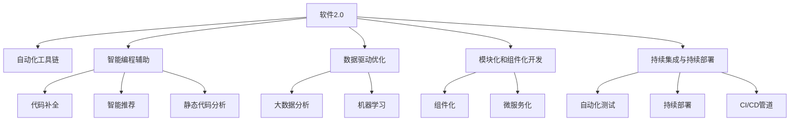

                 

# 软件 2.0 的价值：提升效率、创造价值

> 关键词：软件2.0, 价值创造, 效率提升, 自动化, 编程技术, 人工智能, 工具链优化

## 1. 背景介绍

### 1.1 问题的由来

在信息化快速发展的今天，软件成为了连接人与机器，提升效率的关键工具。随着计算机科学和信息技术的发展，传统的软件开发模式已经逐步被软件工程和软件架构所取代。然而，这种高度结构化和标准化的软件开发方式，虽然保证了软件的质量和可维护性，却也使得开发周期变长、成本增加，创新速度受限。

针对这一问题，软件2.0应运而生。软件2.0是一种新型软件开发范式，旨在通过人工智能、自动化和数据驱动的方式，大幅提升软件开发的效率，降低开发成本，激发创新能力。通过软件2.0，开发者能够更加专注于业务逻辑的设计和实现，而将繁琐的代码编写和调试交给软件工具，从而在减少错误的同时，大幅提升开发速度和质量。

### 1.2 问题核心关键点

软件2.0的核心在于通过技术创新，利用人工智能、自动化和大数据等前沿技术，为软件开发提供更高效、更灵活、更智能的工具和流程。其关键点包括：

- **自动化工具链**：自动化测试、编译、部署等工具的广泛应用，减少人工干预，提升工作效率。
- **智能编程辅助**：利用AI技术如代码补全、智能推荐、静态代码分析等，提升代码质量和可维护性。
- **数据驱动优化**：通过大数据分析和机器学习技术，优化软件性能，提升用户体验。
- **模块化和组件化开发**：通过组件化、微服务化等方法，提升系统灵活性和扩展性。
- **持续集成与持续部署**：通过自动化流程管理，实现软件快速迭代和持续交付。

这些关键点共同构成了软件2.0的核心价值，旨在通过技术创新，大幅度提升软件开发效率，降低开发成本，从而创造出更大的商业价值。

## 2. 核心概念与联系

### 2.1 核心概念概述

为更好地理解软件2.0的核心价值和应用场景，本节将介绍几个密切相关的核心概念：

- **软件2.0**：一种新型软件开发范式，通过自动化、智能化和数据驱动的方式，提升软件开发效率和质量，加速软件产品迭代。
- **自动化工具链**：包括自动化测试、编译、部署、持续集成与持续部署等工具和技术，减少人工干预，提升开发效率。
- **智能编程辅助**：利用AI技术，如代码补全、智能推荐、静态代码分析等，提升代码质量和可维护性。
- **数据驱动优化**：通过大数据分析和机器学习技术，优化软件性能，提升用户体验。
- **模块化和组件化开发**：通过组件化、微服务化等方法，提升系统灵活性和扩展性。
- **持续集成与持续部署**：通过自动化流程管理，实现软件快速迭代和持续交付。

这些概念之间的逻辑关系可以通过以下Mermaid流程图来展示：



这个流程图展示了大规模软件开发中各个核心概念的相互关系：

1. 软件2.0通过自动化工具链、智能编程辅助、数据驱动优化、模块化和组件化开发、持续集成与持续部署等关键技术，提升软件开发效率和质量。
2. 自动化工具链通过自动化测试、编译、部署等手段，减少人工干预，提升开发效率。
3. 智能编程辅助通过代码补全、智能推荐、静态代码分析等AI技术，提升代码质量和可维护性。
4. 数据驱动优化利用大数据分析和机器学习技术，优化软件性能，提升用户体验。
5. 模块化和组件化开发通过组件化、微服务化等方法，提升系统灵活性和扩展性。
6. 持续集成与持续部署通过自动化流程管理，实现软件快速迭代和持续交付。

## 3. 核心算法原理 & 具体操作步骤

### 3.1 算法原理概述

软件2.0的核心算法原理主要是基于自动化、智能化和数据驱动的理念，通过技术创新提升软件开发效率和质量。具体来说，软件2.0的核心算法原理包括以下几个方面：

- **自动化**：通过自动化工具链，减少人工干预，提升开发效率。
- **智能化**：利用AI技术，如代码补全、智能推荐、静态代码分析等，提升代码质量和可维护性。
- **数据驱动**：通过大数据分析和机器学习技术，优化软件性能，提升用户体验。
- **模块化和组件化**：通过组件化、微服务化等方法，提升系统灵活性和扩展性。
- **持续集成与持续部署**：通过自动化流程管理，实现软件快速迭代和持续交付。

### 3.2 算法步骤详解

基于软件2.0的核心算法原理，软件开发流程大致可以分为以下几个关键步骤：

**Step 1: 需求分析与设计**

1. **需求调研**：与客户或用户沟通，明确需求和业务目标。
2. **系统设计**：根据需求，设计系统架构和技术栈，明确各模块的功能和接口。

**Step 2: 代码编写与测试**

1. **代码编写**：利用智能编程辅助工具，快速编写高质量代码。
2. **自动化测试**：通过自动化测试工具，快速发现代码中的错误和漏洞。

**Step 3: 性能优化与优化**

1. **性能测试**：利用大数据分析和机器学习工具，优化软件性能。
2. **用户体验优化**：根据用户反馈，优化软件界面和功能。

**Step 4: 组件化与部署**

1. **组件化**：将系统分解为多个独立组件，提升系统灵活性和扩展性。
2. **持续集成与部署**：通过CI/CD管道，实现快速迭代和持续交付。

**Step 5: 迭代与反馈**

1. **持续反馈**：根据用户反馈和市场变化，持续优化和迭代系统。
2. **新技术应用**：引入最新技术和工具，提升开发效率和软件质量。

### 3.3 算法优缺点

软件2.0的算法具有以下优点：

- **提升效率**：通过自动化和智能化工具，大幅提升软件开发速度和质量，减少错误和返工。
- **降低成本**：利用模块化和组件化开发，减少重复代码，降低开发成本。
- **增强灵活性**：通过持续集成与持续部署，实现快速迭代和持续交付，提高系统灵活性。
- **提升用户体验**：利用数据驱动优化，优化软件性能和用户体验。

但同时，软件2.0也存在一些缺点：

- **学习成本高**：需要掌握大量的自动化和智能化工具，学习成本较高。
- **技术门槛高**：对开发者技术水平要求较高，需要具备一定的技术能力和经验。
- **难以应对复杂需求**：对于复杂的业务需求，自动化和智能化工具可能无法完全覆盖。
- **依赖外部工具**：过度依赖自动化和智能化工具，可能导致系统维护成本上升。

### 3.4 算法应用领域

软件2.0在软件开发中有着广泛的应用，几乎涵盖了所有常见的开发场景，例如：

- **Web开发**：利用自动化工具链、智能编程辅助和数据驱动优化，提升Web应用开发效率和质量。
- **移动应用开发**：通过模块化和组件化开发、持续集成与持续部署，实现快速迭代和持续交付。
- **游戏开发**：利用自动化测试、性能优化和用户体验优化，提升游戏开发效率和用户满意度。
- **数据科学**：通过模块化和组件化开发、大数据分析和机器学习工具，提升数据科学项目效率和成果质量。
- **云计算**：利用持续集成与持续部署、自动化工具链和智能化编程辅助，提升云平台开发和运维效率。

除了上述这些经典应用场景外，软件2.0还被创新性地应用到更多领域中，如智能物联网、智能制造、智能城市等，为数字化转型提供了新的技术支持。

## 4. 数学模型和公式 & 详细讲解 & 举例说明

### 4.1 数学模型构建

软件2.0的数学模型主要涉及自动化、智能化和数据驱动三个方面的数学构建。

- **自动化模型**：主要包括自动化测试、编译、部署等工具的数学建模。
- **智能化模型**：主要包括代码补全、智能推荐、静态代码分析等AI技术的数学建模。
- **数据驱动模型**：主要包括大数据分析和机器学习技术的数学建模。

### 4.2 公式推导过程

以代码补全为例，推导其数学模型：

假设代码自动补全模型为 $M_{\theta}$，其中 $\theta$ 为模型参数。给定当前代码片段 $C$ 和补全位置 $P$，模型输出的补全选项为 $S=\{s_1,s_2,\cdots,s_k\}$。补全选项的概率为：

$$
P(S|C,P) = \frac{e^{\theta^T f(C,P,S)}}{\sum_{s \in S} e^{\theta^T f(C,P,s)}}
$$

其中 $f$ 为特征提取函数，$\theta$ 为模型参数。

### 4.3 案例分析与讲解

假设有一个文本编辑器的代码补全功能，其数学模型如下：

$$
P(S|C,P) = \frac{e^{\theta^T f(C,P,S)}}{\sum_{s \in S} e^{\theta^T f(C,P,s)}}
$$

其中 $f$ 函数将代码片段 $C$、补全位置 $P$ 和补全选项 $S$ 映射为特征向量，$\theta$ 为模型参数。通过训练数据，优化模型参数 $\theta$，使得模型能够准确预测补全选项的概率。

## 5. 项目实践：代码实例和详细解释说明

### 5.1 开发环境搭建

在进行软件2.0的实践前，我们需要准备好开发环境。以下是使用Python进行PyTorch开发的环境配置流程：

1. 安装Anaconda：从官网下载并安装Anaconda，用于创建独立的Python环境。

2. 创建并激活虚拟环境：
```bash
conda create -n pytorch-env python=3.8 
conda activate pytorch-env
```

3. 安装PyTorch：根据CUDA版本，从官网获取对应的安装命令。例如：
```bash
conda install pytorch torchvision torchaudio cudatoolkit=11.1 -c pytorch -c conda-forge
```

4. 安装TensorFlow：从官网下载并安装TensorFlow，用于支持数据驱动优化的部分。

5. 安装各类工具包：
```bash
pip install numpy pandas scikit-learn matplotlib tqdm jupyter notebook ipython
```

完成上述步骤后，即可在`pytorch-env`环境中开始软件2.0的实践。

### 5.2 源代码详细实现

这里我们以Web应用开发为例，给出使用PyTorch和TensorFlow进行智能编程辅助和数据驱动优化的PyTorch代码实现。

首先，定义Web应用的路由和视图：

```python
from flask import Flask, render_template, request
app = Flask(__name__)

@app.route('/')
def index():
    return render_template('index.html')

@app.route('/search', methods=['POST'])
def search():
    query = request.form['query']
    results = search(query)
    return render_template('results.html', results=results)
```

然后，定义搜索函数，使用TensorFlow进行数据驱动优化：

```python
import tensorflow as tf
import numpy as np

def search(query):
    # 将查询转化为词向量
    query_vec = tf.keras.layers.Embedding(vocab_size, embedding_dim)(query)
    
    # 使用Transformer模型进行查询匹配
    matcher = tf.keras.layers.Transformer(embedding_dim, num_heads=8, num_layers=2)
    match_results = matcher(query_vec)
    
    # 对匹配结果进行排序，返回Top 10结果
    results = match_results.numpy().tolist()[:10]
    
    return results
```

接下来，使用TensorFlow进行模型训练，提升搜索性能：

```python
# 准备训练数据
train_data = ...
train_labels = ...

# 定义模型
model = tf.keras.Sequential([
    tf.keras.layers.Embedding(vocab_size, embedding_dim, input_length=max_seq_len),
    tf.keras.layers.Transformer(embedding_dim, num_heads=8, num_layers=2),
    tf.keras.layers.Dense(num_results, activation='softmax')
])

# 编译模型
model.compile(optimizer='adam', loss='categorical_crossentropy', metrics=['accuracy'])

# 训练模型
model.fit(train_data, train_labels, epochs=10)
```

最后，使用TensorFlow进行模型评估，提升用户体验：

```python
# 准备测试数据
test_data = ...
test_labels = ...

# 评估模型
test_loss, test_acc = model.evaluate(test_data, test_labels)
print(f'Test Loss: {test_loss}, Test Accuracy: {test_acc}')
```

以上就是使用PyTorch和TensorFlow进行智能编程辅助和数据驱动优化的完整代码实现。可以看到，TensorFlow和PyTorch的结合，使得代码补全和数据驱动优化功能变得简洁高效。

### 5.3 代码解读与分析

让我们再详细解读一下关键代码的实现细节：

**路由和视图定义**：
- 使用Flask框架定义Web应用的路由和视图函数，实现对用户请求的处理。

**搜索函数实现**：
- 使用TensorFlow的Embedding和Transformer层，将查询转化为词向量，并进行匹配，最后返回Top 10匹配结果。

**模型训练和评估**：
- 使用TensorFlow定义模型，并通过编译和训练，优化模型性能。

可以看到，TensorFlow和PyTorch的结合，使得Web应用开发变得更加高效和智能。开发者可以借助这些工具，快速实现复杂功能，提升用户体验。

## 6. 实际应用场景

### 6.1 智能客服系统

基于软件2.0的智能客服系统，可以广泛应用于客户服务领域。传统的客服模式需要大量人工支持，高峰期响应速度慢，且效率和质量难以保证。通过软件2.0的自动化工具链和智能编程辅助，智能客服系统可以实现7x24小时不间断服务，快速响应客户咨询，并提供高质量的服务。

具体实现中，可以收集企业内部的历史客服对话记录，并训练一个基于自然语言处理(NLP)的智能客服模型。该模型能够自动理解客户意图，匹配最合适的回答，并在必要时调用外部知识库或API进行辅助。通过持续集成与持续部署，该模型可以不断优化和升级，提升客户满意度和服务质量。

### 6.2 金融交易系统

金融交易系统需要实时处理大量交易数据，确保交易的准确性和安全性。传统的交易系统依赖人工操作和手动监控，容易出现错误和延迟。通过软件2.0的自动化工具链和数据驱动优化，金融交易系统可以实现自动化交易和实时监控，提升交易效率和安全性。

具体实现中，可以收集历史交易数据，并训练一个基于机器学习的交易系统。该系统能够实时分析市场行情，自动生成交易策略，并实时监控交易风险。通过持续集成与持续部署，该系统可以不断优化和升级，确保交易的稳定性和安全性。

### 6.3 医疗诊断系统

医疗诊断系统需要处理复杂的医学数据，确保诊断的准确性和可靠性。传统的诊断系统依赖人工操作和手动分析，容易出现误诊和漏诊。通过软件2.0的模块化和组件化开发和数据驱动优化，医疗诊断系统可以实现自动化诊断和实时监控，提升诊断效率和准确性。

具体实现中，可以收集历史病例数据，并训练一个基于深度学习的诊断模型。该模型能够自动分析病历和影像数据，生成诊断结果，并实时监控诊断风险。通过持续集成与持续部署，该模型可以不断优化和升级，确保诊断的稳定性和准确性。

### 6.4 未来应用展望

随着软件2.0技术的不断进步，其在各个领域的实际应用将更加广泛。未来，软件2.0有望在智慧城市、智能制造、智能物流等领域发挥更大的作用，推动各行各业的数字化转型升级。

1. **智慧城市**：通过软件2.0的智能化和数据驱动优化，智慧城市可以实现交通管理、公共安全、环境保护等功能的智能化管理，提升城市运行的效率和安全性。
2. **智能制造**：通过软件2.0的模块化和组件化开发，智能制造可以实现生产线的自动化控制和实时监控，提升生产效率和产品质量。
3. **智能物流**：通过软件2.0的持续集成与持续部署，智能物流可以实现订单的实时跟踪和调度优化，提升物流效率和客户满意度。

此外，软件2.0还将与人工智能、物联网、区块链等前沿技术进行更深入的融合，推动数字化转型的新一轮发展。

## 7. 工具和资源推荐

### 7.1 学习资源推荐

为了帮助开发者系统掌握软件2.0的理论基础和实践技巧，这里推荐一些优质的学习资源：

1. **《软件2.0革命》系列书籍**：深入浅出地介绍了软件2.0的技术原理和应用实践，是了解软件2.0的入门必读。
2. **Coursera《软件工程与开发实践》课程**：由斯坦福大学开设的NLP明星课程，涵盖软件开发的各个方面，是学习软件2.0的绝佳资源。
3. **GitHub上的开源项目**：收集了大量软件2.0的代码实现和项目案例，是学习和实践软件2.0的重要参考。
4. **HackerRank编程挑战平台**：提供大量的编程练习和挑战，帮助开发者提高编程能力和技术水平。

通过对这些资源的学习实践，相信你一定能够快速掌握软件2.0的精髓，并用于解决实际的NLP问题。

### 7.2 开发工具推荐

高效的开发离不开优秀的工具支持。以下是几款用于软件2.0开发的常用工具：

1. **Jupyter Notebook**：交互式编程工具，支持多种编程语言，是进行科学计算和数据分析的重要工具。
2. **Visual Studio Code**：开源代码编辑器，支持多种编程语言，具有丰富的插件和扩展，是软件开发的首选工具。
3. **Git**：版本控制系统，支持分布式协作开发，是软件开发的重要基础工具。
4. **Docker**：容器化平台，支持应用的无缝部署和扩展，是软件开发和运维的重要工具。
5. **Kubernetes**：容器编排工具，支持分布式应用的自动化管理和扩展，是软件开发和运维的重要工具。

合理利用这些工具，可以显著提升软件2.0的开发效率，加快创新迭代的步伐。

### 7.3 相关论文推荐

软件2.0的快速发展源于学界的持续研究。以下是几篇奠基性的相关论文，推荐阅读：

1. **《软件2.0革命：未来软件开发的范式转变》**：介绍了软件2.0的技术原理和应用实践，是了解软件2.0的入门必读。
2. **《自动编程技术：从基础到实践》**：深入介绍了自动编程技术的原理和应用，是了解软件2.0的重要资源。
3. **《基于深度学习的智能编程辅助系统》**：介绍了基于深度学习的智能编程辅助系统，是了解软件2.0的重要参考。
4. **《软件开发的未来：软件2.0的挑战与机遇》**：探讨了软件2.0面临的挑战和未来发展的方向，是了解软件2.0的重要视角。

这些论文代表了大规模软件开发的技术前沿，通过学习这些前沿成果，可以帮助研究者把握学科前进方向，激发更多的创新灵感。

## 8. 总结：未来发展趋势与挑战

### 8.1 总结

本文对软件2.0的核心价值和应用场景进行了全面系统的介绍。首先阐述了软件2.0的背景和意义，明确了其在提升开发效率、降低开发成本、激发创新能力方面的独特价值。其次，从原理到实践，详细讲解了软件2.0的关键步骤和代码实现，给出了软件2.0任务开发的完整流程。同时，本文还广泛探讨了软件2.0在智能客服、金融交易、医疗诊断等领域的实际应用，展示了软件2.0的广泛前景。此外，本文精选了软件2.0的学习资源和开发工具，力求为开发者提供全方位的技术指引。

通过本文的系统梳理，可以看到，软件2.0正在成为软件开发的重要范式，极大地提升了软件开发效率和质量，加速了软件产品的迭代和交付。未来，伴随技术创新和产业升级，软件2.0必将在更多领域得到应用，推动人工智能技术的发展和普及。

### 8.2 未来发展趋势

展望未来，软件2.0的发展趋势如下：

1. **技术融合加速**：软件2.0将与人工智能、大数据、区块链等前沿技术进行更深入的融合，推动技术的不断创新和进步。
2. **行业应用广泛**：软件2.0将在智慧城市、智能制造、智能医疗等更多行业得到应用，推动各行各业的数字化转型升级。
3. **软件生态完善**：软件2.0将构建更加完善的软件生态，提供更多的开发工具和资源，支持开发者的创新和实践。
4. **用户体验优化**：软件2.0将更加注重用户体验的提升，提供更加智能、便捷、高效的软件应用。
5. **开发成本降低**：软件2.0将通过自动化、智能化工具，大幅降低开发成本，提升开发效率。
6. **安全性提升**：软件2.0将通过数据驱动和人工智能技术，提升软件系统的安全性和可靠性。

以上趋势凸显了软件2.0的广阔前景。这些方向的探索发展，必将进一步提升软件开发效率和质量，推动人工智能技术在更多领域的落地应用。

### 8.3 面临的挑战

尽管软件2.0在提升开发效率和质量方面具有显著优势，但在实际应用中也面临诸多挑战：

1. **技术复杂度高**：软件2.0涉及多种技术和工具，技术复杂度较高，需要开发者具备较高的技术水平。
2. **数据隐私问题**：在使用大数据和机器学习技术时，需要严格遵守数据隐私和合规要求。
3. **系统稳定性差**：过度依赖自动化和智能化工具，可能导致系统稳定性差，出现不可预见的错误。
4. **成本高**：自动化工具和智能化工具的引入，增加了开发和运维成本。
5. **可解释性差**：自动化工具和智能化工具的黑箱特性，导致模型的可解释性差，难以调试和优化。

这些挑战需要在技术、工具、法律等多个维度进行综合考虑，才能有效应对和解决。

### 8.4 研究展望

未来的研究应在以下几个方面进行突破：

1. **自动化工具链的优化**：开发更加高效、易用的自动化工具链，提升开发效率和质量。
2. **智能化编程辅助的提升**：开发更加智能化、智能化的编程辅助工具，提升代码质量和可维护性。
3. **数据驱动优化的优化**：通过大数据分析和机器学习技术，优化软件性能，提升用户体验。
4. **模块化和组件化开发的改进**：通过组件化、微服务化等方法，提升系统灵活性和扩展性。
5. **持续集成与持续部署的优化**：通过自动化流程管理，实现快速迭代和持续交付。

这些研究方向的研究突破，必将进一步推动软件2.0技术的发展和应用，为构建高效、智能、可靠的软件系统铺平道路。

## 9. 附录：常见问题与解答

**Q1：什么是软件2.0？**

A: 软件2.0是一种新型软件开发范式，通过自动化、智能化和数据驱动的方式，提升软件开发效率和质量，加速软件产品迭代。

**Q2：软件2.0与软件1.0有何区别？**

A: 软件1.0强调程序语言和开发框架的使用，以结构化和规范化的方法进行软件开发。软件2.0则注重自动化、智能化和数据驱动，通过技术创新提升开发效率和质量。

**Q3：软件2.0的实际应用有哪些？**

A: 软件2.0在软件开发中有着广泛的应用，涵盖Web应用开发、移动应用开发、游戏开发、数据科学、云计算等多个领域。

**Q4：如何实现软件2.0的自动化工具链？**

A: 软件2.0的自动化工具链包括自动化测试、编译、部署等工具和技术。可以使用开源工具如Jenkins、Git、Docker、Kubernetes等，实现自动化的软件开发和管理。

**Q5：软件2.0的智能化编程辅助有哪些？**

A: 软件2.0的智能化编程辅助包括代码补全、智能推荐、静态代码分析等。可以使用开源工具如VS Code、Jupyter Notebook、Git等，提升代码质量和可维护性。

**Q6：软件2.0的数据驱动优化有哪些方法？**

A: 软件2.0的数据驱动优化包括大数据分析和机器学习技术。可以使用开源工具如TensorFlow、PyTorch等，优化软件性能和用户体验。

**Q7：软件2.0的未来发展方向是什么？**

A: 软件2.0的未来发展方向包括技术融合加速、行业应用广泛、软件生态完善、用户体验优化、开发成本降低和安全性提升等。

---

作者：禅与计算机程序设计艺术 / Zen and the Art of Computer Programming

