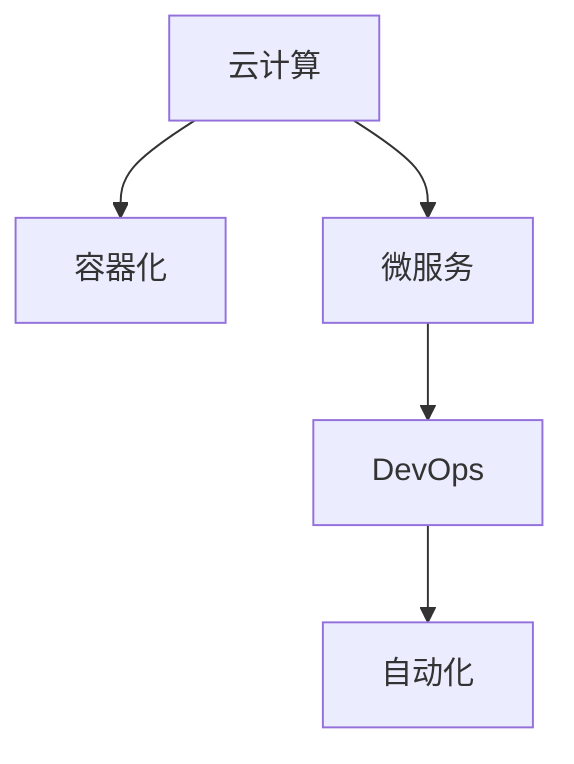

                 

# 软件 2.0 的价值：提升效率、创造价值

> 关键词：软件 2.0, 云计算, 容器化, 微服务, DevOps, 自动化, 软件工程, 价值创造

## 1. 背景介绍

### 1.1 问题由来

软件工程领域正处于一场深刻的变革之中。传统的软件交付模式面临着诸多挑战，如交付周期长、团队协作效率低、维护成本高等问题。这些问题的根源在于，现有的软件工程体系未能充分利用新一代信息技术的发展成果。随着云计算、容器化、微服务、DevOps等技术的成熟，软件工程进入了一个全新的阶段——软件 2.0。

软件 2.0 通过引入云计算、容器化、微服务、DevOps 等先进技术，极大地提升了软件开发的效率和质量。它不仅让软件交付变得更快、更灵活、更稳定，还为软件开发提供了更加可靠、可扩展、易于管理的平台和工具。

### 1.2 问题核心关键点

软件 2.0 的核心价值在于其对软件交付效率和质量的提升。通过云计算、容器化、微服务、DevOps 等技术，软件 2.0 实现了以下几个关键目标：

1. **高效交付**：通过自动化和容器化，软件 2.0 极大地缩短了软件的交付周期，使企业能够快速响应市场变化。
2. **弹性扩展**：基于云平台，软件 2.0 能够动态扩展计算资源，确保应用在高并发场景下的稳定性。
3. **模块化开发**：通过微服务架构，软件 2.0 将应用拆分为独立的小模块，便于独立开发、测试和部署。
4. **持续集成和持续部署**：DevOps 实践推动了持续集成和持续部署的实现，使得软件开发成为一种持续的、迭代的流程。

这些关键目标共同构建了软件 2.0 的价值体系，推动了软件开发模式的革新，使得软件企业能够更快地推出创新产品，满足用户需求，获得市场竞争优势。

### 1.3 问题研究意义

研究软件 2.0 的价值，对于软件企业和开发者具有重要意义：

1. **提升效率**：软件 2.0 通过引入云计算、容器化、微服务、DevOps 等技术，大幅度提升了软件开发和交付的效率，降低了人力成本和开发周期。
2. **创造价值**：软件 2.0 推动了软件产品的快速迭代和创新，使得企业能够更快地满足用户需求，提升用户体验，创造更多商业价值。
3. **技术领先**：掌握软件 2.0 技术，可以帮助企业保持技术领先，提升市场竞争力，赢得更多客户。
4. **可持续发展**：软件 2.0 强调自动化和持续交付，有助于软件企业构建持续的、可扩展的、稳定的开发流程，促进企业长期可持续发展。
5. **创新驱动**：软件 2.0 提供了一个更加灵活、高效、安全的软件开发环境，激发了开发者的创新潜力，推动了更多前沿技术的探索和应用。

## 2. 核心概念与联系

### 2.1 核心概念概述

为更好地理解软件 2.0 的价值，本节将介绍几个密切相关的核心概念：

- **云计算**：一种通过互联网提供计算资源和服务的模式，具有按需扩展、高效利用资源、弹性计算等优点。
- **容器化**：通过容器技术（如 Docker），将应用及其依赖打包在一个标准化的容器内，实现跨平台、环境一致的应用部署。
- **微服务**：将应用拆分为多个独立的小服务，每个服务负责单一的业务功能，能够独立开发、测试和部署。
- **DevOps**：一种以软件开发和运维团队协作为核心的软件开发实践，强调持续集成、持续部署、自动化测试、持续监控等。
- **自动化**：通过工具和脚本实现软件交付流程的自动化，减少人工干预，提升交付效率。

这些核心概念之间的逻辑关系可以通过以下 Mermaid 流程图来展示：



这个流程图展示了几项关键技术的联系：

1. 云计算提供了弹性扩展和按需服务的底层基础设施。
2. 容器化技术封装应用，使其能够在任何环境中运行，提升部署效率。
3. 微服务架构通过独立的服务模块，实现模块化开发和灵活扩展。
4. DevOps 实践通过持续集成和持续部署，提升开发和交付效率。
5. 自动化工具实现了软件开发流程的自动化，进一步提升效率。

这些技术共同构建了软件 2.0 的技术体系，为其提升效率、创造价值提供了坚实的基础。

## 3. 核心算法原理 & 具体操作步骤

### 3.1 算法原理概述

软件 2.0 的实现原理基于一系列先进技术和最佳实践，这些技术和实践能够显著提升软件交付效率和质量。核心算法原理包括以下几个方面：

1. **云计算弹性扩展**：通过云计算平台，软件 2.0 能够根据应用负载动态扩展计算资源，确保应用的稳定性和可用性。
2. **容器化技术封装**：容器技术实现了应用的无状态化和可移植性，简化了应用的部署和维护。
3. **微服务模块化开发**：微服务架构将应用拆分为独立的服务模块，能够独立开发、测试和部署，提高开发效率和系统稳定性。
4. **DevOps 自动化流程**：DevOps 实践通过自动化和持续集成/持续部署流程，实现了软件交付的快速迭代和持续优化。

### 3.2 算法步骤详解

软件 2.0 的实施步骤主要包括以下几个关键环节：

**Step 1: 规划和设计**

- 根据业务需求，确定系统的总体架构和设计方案。
- 确定云计算平台（如 AWS、Azure、Google Cloud）和容器化技术（如 Docker）。
- 设计微服务架构，确定每个服务的功能和接口。

**Step 2: 开发和测试**

- 开发各个微服务模块，并实现它们之间的接口。
- 使用自动化测试工具（如 Jenkins、Travis CI）进行单元测试和集成测试。
- 进行功能验证和性能测试，确保应用满足业务需求。

**Step 3: 部署和运维**

- 使用容器化技术打包应用，部署到云平台。
- 配置自动化部署流程，实现持续集成和持续部署。
- 使用监控工具（如 Prometheus、Grafana）监测应用性能和系统状态，及时发现和解决问题。
- 实施 DevOps 实践，如代码审查、自动化测试、持续集成、持续部署等。

**Step 4: 优化和改进**

- 根据监控数据和用户反馈，持续优化系统性能和功能。
- 定期进行代码重构和架构调整，保持系统的可扩展性和可维护性。
- 引入新的技术和实践，如 Kubernetes、Istio、Helm 等，提升系统的稳定性和效率。

### 3.3 算法优缺点

软件 2.0 的实现基于先进技术和最佳实践，具有以下优点：

1. **高效交付**：云计算和容器化技术使得软件交付变得快速、灵活、稳定，减少了手动操作和部署风险。
2. **弹性扩展**：基于云平台，系统能够根据负载动态扩展资源，确保应用在高峰期稳定运行。
3. **模块化开发**：微服务架构提高了开发效率，使团队能够独立开发和部署，快速响应需求变化。
4. **持续改进**：DevOps 实践推动了持续集成和持续部署，提升了软件的稳定性和可靠性。
5. **技术领先**：通过引入新技术和实践，软件 2.0 在技术上保持领先，赢得更多客户和市场优势。

同时，软件 2.0 也存在一些局限性：

1. **复杂度提升**：微服务架构和 DevOps 流程增加了系统复杂度，需要更高的团队协作能力和技术水平。
2. **成本较高**：云计算和容器化技术的实施需要较高的初始投资和技术门槛。
3. **技能要求高**：软件开发和运维团队需要掌握云计算、容器化、微服务、DevOps 等多项技术，培训成本较高。
4. **学习曲线陡峭**：新技术和最佳实践的引入，需要企业投入大量时间和资源进行学习和实践。

尽管存在这些局限性，但就目前而言，软件 2.0 的实施依然是大势所趋，其带来的效率提升和价值创造能力不可忽视。

### 3.4 算法应用领域

软件 2.0 的应用领域非常广泛，以下是几个典型案例：

**1. 金融行业**

金融行业对系统的高可用性和高安全性要求极高。通过引入云计算和容器化技术，金融企业能够快速部署新系统，快速修复故障，确保业务连续性。同时，通过微服务架构，金融企业能够实现更细粒度的服务拆分和功能升级，提升用户体验。

**2. 电商行业**

电商行业对系统的响应速度和扩展性要求极高。通过云平台和容器化技术，电商企业能够实现大规模应用的弹性扩展和快速部署。通过微服务架构，电商企业能够实现高效的订单处理、库存管理等功能，提升运营效率。

**3. 游戏行业**

游戏行业对系统的高并发和低延迟要求极高。通过云计算和容器化技术，游戏企业能够实现快速部署和高效扩展。通过微服务架构，游戏企业能够实现高效的分布式部署和功能拆分，提升游戏体验。

**4. 教育行业**

教育行业对系统的灵活性和可扩展性要求极高。通过云平台和容器化技术，教育企业能够实现灵活的应用部署和扩展。通过微服务架构，教育企业能够实现高效的内容管理和个性化推荐，提升教学效果。

**5. 医疗行业**

医疗行业对系统的可靠性和安全性要求极高。通过云计算和容器化技术，医疗企业能够实现高效的数据存储和处理。通过微服务架构，医疗企业能够实现高效的健康管理、在线咨询等功能，提升医疗服务水平。

以上案例展示了软件 2.0 在不同行业的应用价值，反映了其广泛的应用潜力和强大的能力。

## 4. 数学模型和公式 & 详细讲解 & 举例说明

### 4.1 数学模型构建

软件 2.0 的实现涉及多个技术的组合和集成，其数学模型可以从不同的维度进行构建。以下是一个简化的数学模型，用于描述软件 2.0 的核心算法：

$$
\text{效率提升} = \frac{\text{交付速度}}{\text{原始交付速度}} - 1
$$

其中，交付速度是采用软件 2.0 技术后，软件的交付周期；原始交付速度是采用传统软件交付模式下的交付周期。

### 4.2 公式推导过程

软件 2.0 技术通过引入云计算、容器化、微服务、DevOps 等技术，实现了交付速度的显著提升。具体来说，云计算技术提供了弹性扩展的计算资源，大大减少了手动操作和部署风险；容器化技术实现了应用的无状态化和可移植性，简化了应用的部署和维护；微服务架构提高了开发效率，使团队能够独立开发和部署，快速响应需求变化；DevOps 实践推动了持续集成和持续部署，提升了软件的稳定性和可靠性。

通过这些技术的综合应用，软件 2.0 能够显著提升交付速度，减少交付周期，实现更高的效率提升。

### 4.3 案例分析与讲解

以金融行业为例，传统的金融系统通常采用单体架构，部署和管理复杂。一旦业务需求发生变化，整个系统需要重新部署，耗时较长，且风险较高。通过引入云计算、容器化、微服务、DevOps 等技术，金融企业可以实现以下改进：

- **云计算弹性扩展**：金融企业可以根据业务负载动态扩展计算资源，确保系统在高并发场景下的稳定运行。
- **容器化技术封装**：金融企业可以将应用打包在容器内，实现跨平台、环境一致的应用部署，减少了手动操作和部署风险。
- **微服务模块化开发**：金融企业将系统拆分为独立的服务模块，能够独立开发和部署，快速响应需求变化。
- **DevOps 自动化流程**：金融企业通过持续集成和持续部署流程，实现了快速迭代和持续优化，提升了系统的稳定性和可靠性。

通过这些改进，金融企业能够实现更高效的交付和更稳定的应用，提升用户体验，赢得更多客户。

## 5. 项目实践：代码实例和详细解释说明

### 5.1 开发环境搭建

在进行软件 2.0 项目实践前，我们需要准备好开发环境。以下是使用 Python 进行 Kubernetes 和 Docker 开发的环境配置流程：

1. 安装 Docker：从官网下载并安装 Docker，用于容器化应用。
2. 安装 Kubernetes：根据平台（如 Linux、Windows），从官网获取对应的安装命令。例如，在 Linux 上，可以使用以下命令安装：
```bash
sudo apt-get update && sudo apt-get install kubectl
```
3. 配置 Kubernetes 集群：在一台或多台服务器上安装 Kubernetes 集群，配置节点和控制节点，确保集群运行正常。
4. 配置 Docker 镜像仓库：将应用镜像推送到容器镜像仓库（如 Docker Hub、GCR），便于后续的部署和分发。

完成上述步骤后，即可在 Kubernetes 和 Docker 环境中开始软件 2.0 项目实践。

### 5.2 源代码详细实现

下面我们以微服务架构的应用为例，给出使用 Kubernetes 和 Docker 进行微服务部署的 PyTorch 代码实现。

首先，定义微服务模块的代码结构：

```bash
my-service/
│
├── Dockerfile
├── requirements.txt
├── main.py
└── app.yaml
```

其中，`Dockerfile` 定义应用镜像的构建过程，`requirements.txt` 列出应用依赖，`main.py` 是应用入口代码，`app.yaml` 是 Kubernetes 服务的配置文件。

在 `main.py` 中，我们可以编写应用逻辑：

```python
from flask import Flask, request, jsonify

app = Flask(__name__)

@app.route('/hello')
def hello():
    name = request.args.get('name')
    return jsonify({'message': f'Hello, {name}!'})

if __name__ == '__main__':
    app.run(host='0.0.0.0', port=5000)
```

在 `app.yaml` 中，我们可以配置 Kubernetes 服务的资源配置：

```yaml
apiVersion: networking.k8s.io/v1
kind: Service
metadata:
  name: my-service
spec:
  selector:
    my-service: "my-service"
  ports:
  - protocol: TCP
    port: 80
    targetPort: 5000
  type: LoadBalancer
```

然后，在 `Dockerfile` 中，我们可以定义应用镜像的构建过程：

```Dockerfile
FROM python:3.8-slim

WORKDIR /app

COPY requirements.txt requirements.txt
RUN pip install -r requirements.txt

COPY . .

EXPOSE 80

CMD ["python", "app.py"]
```

最后，在本地构建和测试应用：

```bash
docker build -t my-service .
docker run -d -p 80:80 my-service
```

通过上述步骤，我们已经构建了一个简单的微服务应用，并实现了 Docker 容器化和 Kubernetes 部署。接下来，我们可以在 Kubernetes 集群中部署该应用，实现微服务架构的落地实践。

### 5.3 代码解读与分析

让我们再详细解读一下关键代码的实现细节：

**my-service 目录**：
- `Dockerfile`：定义应用镜像的构建过程，包括依赖安装、代码复制、暴露端口等。
- `requirements.txt`：列出应用依赖，确保应用能够顺利运行。
- `main.py`：编写应用逻辑，使用 Flask 框架实现 HTTP 请求处理。
- `app.yaml`：配置 Kubernetes 服务的资源配置，确保应用在集群中正确部署。

**Dockerfile**：
- 使用 Python 3.8-slim 镜像作为基础环境。
- 进入应用工作目录。
- 复制依赖文件和应用代码。
- 安装依赖并复制应用代码。
- 暴露应用端口，并设置命令启动应用。

**app.yaml**：
- 配置 Kubernetes 服务的资源配置，包括服务名称、选择器、端口映射等。
- 使用 LoadBalancer 类型的服务，确保应用能够被外部访问。

通过上述代码实现，我们可以看到 Kubernetes 和 Docker 在微服务架构中的应用，从而理解软件 2.0 的核心技术原理和实现细节。

## 6. 实际应用场景

### 6.1 智能客服系统

基于软件 2.0 的智能客服系统，可以大幅提升客户咨询体验和问题解决效率。通过微服务架构，智能客服系统能够实现高并发、高扩展、高可靠的服务部署。通过容器化技术，智能客服系统能够在不同环境中快速部署和运维。通过 DevOps 实践，智能客服系统能够实现持续集成和持续部署，快速迭代和优化服务。

**实现过程**：
1. **需求分析**：分析客户咨询需求，确定智能客服系统的功能需求。
2. **系统设计**：设计微服务架构，确定服务模块和接口。
3. **开发和测试**：开发各个微服务模块，并进行自动化测试和集成测试。
4. **部署和运维**：使用容器化技术打包应用，部署到云平台，并配置 DevOps 自动化流程。
5. **优化和改进**：根据用户反馈和监控数据，持续优化系统性能和功能。

通过这些过程，智能客服系统能够快速响应客户咨询，并提供高效、准确、个性化的服务，提升客户满意度和品牌价值。

### 6.2 电商平台

基于软件 2.0 的电商平台，可以提供高效、灵活、可扩展的购物体验。通过微服务架构，电商平台能够实现细粒度的功能拆分和服务优化。通过容器化技术，电商平台能够在不同环境中快速部署和运维。通过 DevOps 实践，电商平台能够实现持续集成和持续部署，快速迭代和优化服务。

**实现过程**：
1. **需求分析**：分析用户购物需求，确定电商平台的系统需求。
2. **系统设计**：设计微服务架构，确定服务模块和接口。
3. **开发和测试**：开发各个微服务模块，并进行自动化测试和集成测试。
4. **部署和运维**：使用容器化技术打包应用，部署到云平台，并配置 DevOps 自动化流程。
5. **优化和改进**：根据用户反馈和监控数据，持续优化系统性能和功能。

通过这些过程，电商平台能够提供高效、灵活、可靠的购物体验，提升用户满意度和购物转化率，实现持续增长。

### 6.3 金融交易系统

基于软件 2.0 的金融交易系统，可以提供高并发、高可靠性、高安全性的交易服务。通过微服务架构，金融交易系统能够实现细粒度的功能拆分和服务优化。通过容器化技术，金融交易系统能够在不同环境中快速部署和运维。通过 DevOps 实践，金融交易系统能够实现持续集成和持续部署，快速迭代和优化服务。

**实现过程**：
1. **需求分析**：分析交易业务需求，确定金融交易系统的系统需求。
2. **系统设计**：设计微服务架构，确定服务模块和接口。
3. **开发和测试**：开发各个微服务模块，并进行自动化测试和集成测试。
4. **部署和运维**：使用容器化技术打包应用，部署到云平台，并配置 DevOps 自动化流程。
5. **优化和改进**：根据用户反馈和监控数据，持续优化系统性能和功能。

通过这些过程，金融交易系统能够提供高效、可靠、安全的交易服务，提升用户体验和交易效率，保障金融安全。

### 6.4 未来应用展望

随着软件 2.0 技术的不断发展和应用，未来的软件系统将更加高效、灵活、可扩展。以下是一些未来应用展望：

**1. 5G 网络与边缘计算**

5G 网络和边缘计算技术的发展，将进一步提升软件 2.0 的应用场景。通过边缘计算，软件 2.0 能够在本地快速响应数据处理需求，减少延迟和带宽消耗，实现实时性更高的应用场景。

**2. 人工智能与大数据**

人工智能和大数据技术的发展，将推动软件 2.0 在数据分析、机器学习、自然语言处理等领域的应用。通过云计算和大数据平台，软件 2.0 能够高效处理和分析海量数据，提取有价值的信息，实现智能决策和个性化推荐。

**3. 区块链与智能合约**

区块链和智能合约技术的发展，将推动软件 2.0 在金融、供应链、医疗等领域的应用。通过区块链技术，软件 2.0 能够实现去中心化的应用部署和数据存储，保障数据安全和透明性。通过智能合约，软件 2.0 能够实现自动化、智能化的业务逻辑，提升业务效率和安全性。

**4. 物联网与边缘计算**

物联网和边缘计算技术的发展，将推动软件 2.0 在智能家居、智慧城市、工业控制等领域的应用。通过边缘计算，软件 2.0 能够在本地处理和分析传感器数据，实现实时响应和智能决策。

总之，软件 2.0 技术的发展，将推动更多行业领域的数字化转型和智能化升级，带来更高效、灵活、可靠的应用体验，推动社会经济的发展。

## 7. 工具和资源推荐

### 7.1 学习资源推荐

为了帮助开发者系统掌握软件 2.0 技术，以下是一些优质的学习资源：

1. **《软件 2.0 架构设计》**：系统讲解了软件 2.0 架构设计的基础和最佳实践，涵盖云计算、容器化、微服务、DevOps 等多个方面。
2. **《软件工程 2.0》**：介绍软件工程 2.0 的核心理念、技术和实践，帮助开发者提升软件交付效率和质量。
3. **《DevOps 实践指南》**：详细介绍 DevOps 实践，包括持续集成、持续部署、自动化测试、持续监控等。
4. **《云计算架构原理》**：讲解云计算架构的基础和设计原则，帮助开发者构建高效、可靠的云平台。
5. **《Kubernetes 实战》**：详细介绍 Kubernetes 的部署、管理和运维，帮助开发者快速上手 Kubernetes 集群。
6. **《Docker 实战》**：详细介绍 Docker 的部署、管理和运维，帮助开发者实现应用的无状态化和容器化。

通过这些资源的学习实践，相信你一定能够快速掌握软件 2.0 技术的精髓，并用于解决实际的开发问题。

### 7.2 开发工具推荐

高效的开发离不开优秀的工具支持。以下是几款用于软件 2.0 开发的工具：

1. **Jenkins**：开源的持续集成和持续部署工具，支持多种构建和部署流程。
2. **Travis CI**：基于云端的持续集成工具，支持多种编程语言和框架。
3. **Kubernetes**：开源的容器编排工具，支持大规模集群管理和应用部署。
4. **Docker**：开源的容器化工具，支持应用的无状态化和容器化。
5. **Prometheus**：开源的监控工具，支持实时数据采集和告警。
6. **Grafana**：开源的数据可视化工具，支持实时图表展示和数据监控。
7. **Helm**：开源的 Kubernetes 应用包管理工具，支持应用的安装、升级和卸载。
8. **KubeSphere**：开源的企业级 Kubernetes 管理平台，提供集成的 DevOps 工具和应用管理。

合理利用这些工具，可以显著提升软件 2.0 开发的效率和质量，降低开发成本和风险。

### 7.3 相关论文推荐

软件 2.0 技术的发展源于学界的持续研究。以下是几篇奠基性的相关论文，推荐阅读：

1. **《软件工程 2.0: A survey》**：系统回顾了软件工程 2.0 的发展历程、核心理念和实践，为软件 2.0 技术的进一步探索奠定了基础。
2. **《DevOps: A Study of How Twelve Organizations Implement DevOps》**：详细介绍了 DevOps 实践的实施过程和效果，为软件 2.0 的落地应用提供了宝贵经验。
3. **《Cloud Computing: Concepts, Technology and Architecture》**：讲解了云计算技术的基础和应用，为软件 2.0 的云计算架构设计提供了参考。
4. **《Kubernetes: Design and Implementation of a Distributed Production-Grade Container Orchestration System》**：介绍了 Kubernetes 的设计理念和实现原理，为软件 2.0 的容器编排提供了技术支持。
5. **《Docker: The Future of Computing》**：讲解了 Docker 的技术原理和应用场景，为软件 2.0 的容器化提供了重要参考。

通过学习这些前沿成果，可以帮助研究者把握学科前进方向，激发更多的创新灵感。

## 8. 总结：未来发展趋势与挑战

### 8.1 总结

本文对软件 2.0 技术的价值进行了全面系统的介绍。通过云计算、容器化、微服务、DevOps 等技术的综合应用，软件 2.0 实现了高效交付、弹性扩展、模块化开发、持续改进等关键目标，提升了软件交付效率和质量，创造了更多商业价值。

通过本文的系统梳理，可以看到，软件 2.0 技术正在成为软件开发的重要范式，极大地推动了软件开发的现代化和智能化。未来，伴随云计算、容器化、微服务、DevOps 等技术的进一步发展，软件 2.0 必将在更多行业领域落地应用，带来更高效、灵活、可靠的软件交付模式。

### 8.2 未来发展趋势

展望未来，软件 2.0 技术将呈现以下几个发展趋势：

1. **技术融合**：云计算、容器化、微服务、DevOps 等技术将进一步融合，形成更加高效、灵活、可扩展的开发平台。
2. **智能自动化**：通过引入人工智能和大数据技术，软件 2.0 将实现更智能的自动化流程，提升开发效率和质量。
3. **全栈自动化**：软件开发、测试、运维、监控等环节将实现全面自动化，推动持续交付和持续改进。
4. **去中心化**：区块链和智能合约技术将推动软件 2.0 实现去中心化应用部署和数据管理，提升系统的安全性和可靠性。
5. **实时响应**：5G 网络和边缘计算技术将推动软件 2.0 实现实时响应和智能决策，提升应用的响应速度和用户体验。
6. **边缘计算**：通过边缘计算技术，软件 2.0 能够在本地处理和分析数据，实现实时响应和智能决策。

这些趋势凸显了软件 2.0 技术的广阔前景，将进一步推动软件开发模式的创新和升级。

### 8.3 面临的挑战

尽管软件 2.0 技术已经取得了显著进展，但在其发展过程中也面临着诸多挑战：

1. **技术复杂性**：微服务架构和 DevOps 流程增加了系统复杂度，需要更高的团队协作能力和技术水平。
2. **成本较高**：云计算和容器化技术的实施需要较高的初始投资和技术门槛。
3. **技能要求高**：软件开发和运维团队需要掌握云计算、容器化、微服务、DevOps 等多项技术，培训成本较高。
4. **学习曲线陡峭**：新技术和最佳实践的引入，需要企业投入大量时间和资源进行学习和实践。
5. **数据安全和隐私**：微服务架构和 DevOps 实践增加了数据安全和隐私的风险，需要严格的数据管理和保护措施。
6. **监控和故障排查**：大规模系统的监控和故障排查需要高效的工具和技术支持，增加了运维难度。

尽管存在这些挑战，但通过不断的技术改进和实践探索，相信软件 2.0 技术将逐步克服这些障碍，实现更加高效、灵活、可靠的软件交付模式。

### 8.4 研究展望

未来，软件 2.0 技术需要在以下几个方面进行深入研究：

1. **自动化技术**：开发更智能、更自动化的开发工具和流程，提升开发效率和质量。
2. **全栈自动化**：实现软件开发、测试、运维、监控等环节的全面自动化，推动持续交付和持续改进。
3. **智能自动化**：引入人工智能和大数据技术，实现更智能的自动化流程，提升开发效率和质量。
4. **去中心化技术**：探索区块链和智能合约技术，实现去中心化应用部署和数据管理，提升系统的安全性和可靠性。
5. **实时响应技术**：通过5G 网络和边缘计算技术，实现实时响应和智能决策，提升应用的响应速度和用户体验。
6. **边缘计算技术**：探索边缘计算技术，实现本地处理和分析数据，提升应用的实时响应能力和智能决策能力。

这些研究方向将推动软件 2.0 技术的进一步发展和应用，为软件企业的持续创新和升级提供技术支持。

## 9. 附录：常见问题与解答

**Q1: 什么是软件 2.0 技术？**

A: 软件 2.0 技术是基于云计算、容器化、微服务、DevOps 等先进技术，实现高效、灵活、可扩展的软件交付模式。其核心思想是实现软件的持续交付和持续改进，提升软件的交付效率和质量，创造更多商业价值。

**Q2: 软件 2.0 技术在实际应用中有哪些优势？**

A: 软件 2.0 技术在实际应用中具有以下几个优势：
1. **高效交付**：通过云计算和容器化技术，实现快速、灵活、稳定的软件交付。
2. **弹性扩展**：基于云平台，实现动态扩展计算资源，确保应用在高并发场景下的稳定性。
3. **模块化开发**：通过微服务架构，实现独立的服务拆分和功能升级，提升开发效率和系统稳定性。
4. **持续改进**：通过 DevOps 实践，实现持续集成和持续部署，提升软件的稳定性和可靠性。

**Q3: 如何应对软件 2.0 技术带来的挑战？**

A: 应对软件 2.0 技术带来的挑战，可以从以下几个方面入手：
1. **团队培训**：提高团队的技术水平和协作能力，确保技术的顺利实施。
2. **技术优化**：通过技术优化，降低初始投资和实施难度，提高技术可行性和可操作性。
3. **资源投入**：投入更多资源进行技术和工具的学习和实践，逐步克服技术复杂性。
4. **数据保护**：加强数据安全和隐私的保护措施，确保系统的安全性和可靠性。
5. **自动化工具**：引入自动化工具和技术，提高监控和故障排查的效率，降低运维难度。

通过这些措施，可以克服软件 2.0 技术实施过程中的挑战，确保技术顺利落地应用，实现高效的软件交付模式。

**Q4: 软件 2.0 技术在哪些行业领域有应用前景？**

A: 软件 2.0 技术在以下行业领域具有广泛的应用前景：
1. **金融行业**：实现高可用、高可靠的系统部署和快速故障修复。
2. **电商行业**：实现快速、灵活、可扩展的购物体验，提升用户满意度和购物转化率。
3. **医疗行业**：实现高并发、高可靠的系统部署和高效的数据处理。
4. **游戏行业**：实现高并发、低延迟的系统部署和高效的数据处理。
5. **教育行业**：实现灵活、可扩展的系统部署和高效的数据分析。
6. **工业行业**：实现高效、稳定的系统部署和灵活的数据处理。

通过这些应用案例，可以看到软件 2.0 技术在多个行业领域的广泛应用潜力和巨大价值。

---

作者：禅与计算机程序设计艺术 / Zen and the Art of Computer Programming

