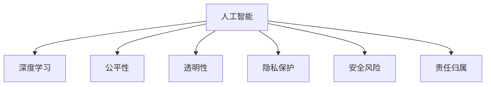

                 

# 软件 2.0 的伦理规范：人工智能的责任

> 关键词：人工智能,伦理规范,责任,技术治理,公平,透明,可解释性,隐私保护,人工智能安全

## 1. 背景介绍

### 1.1 问题由来

随着人工智能（AI）技术的飞速发展，特别是深度学习、大数据等技术的广泛应用，人工智能在各个领域展现了巨大的潜力，从自动驾驶到医疗诊断，从金融风控到教育推荐，人工智能已经深度渗透到社会生活的方方面面。然而，随着技术的深入应用，也引发了一系列伦理和责任问题。

人工智能的决策过程往往是黑箱的，难以解释其背后的逻辑，导致对决策结果的信任度降低。此外，人工智能还可能带来歧视、隐私泄露、安全风险等问题，特别是在医疗、司法、金融等高风险领域，这些问题可能带来更为严重的后果。

因此，在人工智能技术的广泛应用过程中，如何建立伦理规范，明确责任，确保人工智能的安全可控，成为了当前技术界和学术界亟需解决的重要问题。

### 1.2 问题核心关键点

人工智能的伦理规范和责任问题，主要包括但不限于以下几个方面：

1. **公平性**：人工智能模型应公平对待所有人群，避免对特定群体的偏见和歧视。
2. **透明性**：人工智能模型的决策过程应透明，可解释，便于审查和监督。
3. **隐私保护**：人工智能在处理数据时应严格遵守隐私保护法规，保护用户隐私。
4. **安全风险**：人工智能模型应具备一定的鲁棒性，避免恶意攻击和滥用。
5. **责任归属**：在出现人工智能决策失误时，应明确责任归属，便于追责和改进。

这些关键点构成了人工智能伦理规范和责任问题的基础框架，需要在技术设计和应用过程中加以重视和处理。

## 2. 核心概念与联系

### 2.1 核心概念概述

为更好地理解人工智能的伦理规范和责任问题，本节将介绍几个密切相关的核心概念：

- **人工智能（AI）**：指利用计算机算法和数学模型，通过学习数据来执行特定任务的技术，包括机器学习、深度学习等。
- **深度学习**：一种基于多层神经网络的人工智能技术，具有较强的特征提取和泛化能力。
- **公平性**：指人工智能模型在处理数据和决策时应不偏不倚，公平对待所有群体。
- **透明性**：指人工智能模型的决策过程应透明，可解释，便于审查和监督。
- **隐私保护**：指在人工智能处理数据时应严格遵守隐私保护法规，保护用户隐私。
- **安全风险**：指人工智能模型应具备一定的鲁棒性，避免恶意攻击和滥用。
- **责任归属**：指在出现人工智能决策失误时，应明确责任归属，便于追责和改进。

这些核心概念之间的逻辑关系可以通过以下Mermaid流程图来展示：



这个流程图展示了几大核心概念及其之间的关系：

1. 人工智能通过深度学习获取能力。
2. 公平性、透明性、隐私保护、安全风险、责任归属等伦理问题，是人工智能应用过程中需要考虑的关键方面。
3. 这些伦理问题需要在技术设计和应用过程中加以重视和处理。

## 3. 核心算法原理 & 具体操作步骤
### 3.1 算法原理概述

人工智能伦理规范和责任问题的解决，涉及到多方面的技术手段和规范措施。以下是几种常用的方法和策略：

1. **公平性**：通过数据清洗和算法优化，减少模型对特定群体的偏见。常用的方法包括重新采样、代价敏感学习、公平损失函数等。
2. **透明性**：通过可解释性模型和输出解释技术，提升模型的透明性。常用的方法包括LIME、SHAP等。
3. **隐私保护**：通过差分隐私、联邦学习、匿名化处理等技术，保护用户隐私。常用的方法包括差分隐私机制、多方安全计算等。
4. **安全风险**：通过模型鲁棒性测试、对抗样本生成、模型剪枝等技术，提升模型的安全性。常用的方法包括对抗训练、鲁棒性测试等。
5. **责任归属**：通过模型责任归属机制、责任保险等手段，明确责任归属。常用的方法包括责任链、责任模型等。

### 3.2 算法步骤详解

人工智能伦理规范和责任问题的解决，一般包括以下几个关键步骤：

**Step 1: 数据采集与处理**
- 采集与任务相关的数据，并进行清洗和预处理。
- 使用差分隐私、匿名化处理等技术保护用户隐私。

**Step 2: 模型设计与训练**
- 设计公平、透明、安全的模型架构。
- 采用公平损失函数、可解释性模型、差分隐私机制等技术优化模型。
- 进行对抗训练、鲁棒性测试等提升模型安全性。

**Step 3: 模型部署与监控**
- 将模型部署到生产环境中，并实时监控其运行状态。
- 使用责任链、责任模型等明确模型责任归属。
- 定期进行模型更新和优化。

**Step 4: 持续改进与评估**
- 持续收集用户反馈和数据，进行模型改进。
- 定期评估模型性能，确保其符合伦理规范和责任要求。

### 3.3 算法优缺点

人工智能伦理规范和责任问题的解决，具有以下优点：

1. **公平性提升**：通过数据清洗和算法优化，减少模型对特定群体的偏见，提升模型的公平性。
2. **透明性增强**：通过可解释性模型和输出解释技术，提升模型的透明性，便于审查和监督。
3. **隐私保护加强**：通过差分隐私、联邦学习、匿名化处理等技术，保护用户隐私，增强用户信任。
4. **安全性提升**：通过模型鲁棒性测试、对抗样本生成、模型剪枝等技术，提升模型的安全性，防止滥用和攻击。
5. **责任归属明确**：通过模型责任归属机制、责任保险等手段，明确责任归属，便于追责和改进。

同时，这些方法也存在一些局限性：

1. **数据获取难度大**：清洗和处理数据需要大量时间和资源，且数据质量对模型性能有直接影响。
2. **技术复杂度高**：实现公平性、透明性、隐私保护、安全性等需要复杂的技术手段，增加了实现难度。
3. **成本高昂**：差分隐私、联邦学习等技术需要额外的计算和存储资源，增加了开发和运营成本。
4. **效果受限**：一些技术手段的效果有限，需要结合多种方法进行综合应用。
5. **规范执行困难**：在实际应用中，规范的执行往往面临诸多挑战，需要多方面的努力和协调。

尽管存在这些局限性，但就目前而言，通过多方面技术手段和规范措施的综合应用，仍能有效提升人工智能伦理规范和责任问题的解决效果。

### 3.4 算法应用领域

人工智能伦理规范和责任问题，在各个应用领域都有重要意义：

- **医疗健康**：医疗决策的公平性、透明性和隐私保护是至关重要的。通过可解释性模型和差分隐私机制，保护患者隐私，提升医疗决策的可信度。
- **金融风控**：金融模型的公平性、透明度和安全性至关重要。通过公平损失函数和对抗训练，提升金融模型的鲁棒性，防止滥用。
- **司法判决**：司法判决的公平性、透明性和责任归属至关重要。通过可解释性模型和责任模型，确保司法判决的公正性和透明性。
- **教育推荐**：教育推荐系统的公平性、透明性和隐私保护是重要考量。通过差分隐私和匿名化处理，保护用户隐私，提升推荐系统的可信度。
- **自动驾驶**：自动驾驶系统的安全性、透明性和责任归属至关重要。通过模型鲁棒性测试和责任保险，提升系统的安全性，明确责任归属。

这些应用领域展示了人工智能伦理规范和责任问题的广泛影响，需要在技术设计和应用过程中加以重视和处理。

## 4. 数学模型和公式 & 详细讲解  
### 4.1 数学模型构建

本节将使用数学语言对人工智能伦理规范和责任问题进行更加严格的刻画。

记公平性目标函数为：
$$
L_{\text{fair}} = \sum_{i=1}^N (y_i - \hat{y}_i)^2
$$
其中 $y_i$ 为真实标签，$\hat{y}_i$ 为模型预测结果。

记透明性目标函数为：
$$
L_{\text{trans}} = \sum_{i=1}^N \|\phi(x_i) - y_i\|^2
$$
其中 $\phi(x_i)$ 为模型的输出解释，$y_i$ 为真实标签。

记隐私保护目标函数为：
$$
L_{\text{privacy}} = \sum_{i=1}^N \epsilon \log(\epsilon^{-1} \|p(x_i) - q(x_i)\|_2^2 + 1)
$$
其中 $p(x_i)$ 和 $q(x_i)$ 为差分隐私机制下的随机化处理结果，$\epsilon$ 为差分隐私参数。

记安全风险目标函数为：
$$
L_{\text{secure}} = \sum_{i=1}^N (y_i - \hat{y}_i)^2 + \sum_{i=1}^N \|\delta_{\text{adv}}(x_i)\|^2
$$
其中 $\delta_{\text{adv}}(x_i)$ 为对抗样本，$y_i$ 为真实标签。

记责任归属目标函数为：
$$
L_{\text{responsible}} = \sum_{i=1}^N (y_i - \hat{y}_i)^2 + \sum_{i=1}^N (R_{\text{model}} \cdot (y_i - \hat{y}_i))^2
$$
其中 $R_{\text{model}}$ 为模型的责任权重，$y_i$ 为真实标签。

### 4.2 公式推导过程

以下是公平性、透明性、隐私保护、安全风险和责任归属目标函数的推导过程：

**公平性目标函数**：
$$
L_{\text{fair}} = \sum_{i=1}^N (y_i - \hat{y}_i)^2
$$
其中 $y_i$ 为真实标签，$\hat{y}_i$ 为模型预测结果。

**透明性目标函数**：
$$
L_{\text{trans}} = \sum_{i=1}^N \|\phi(x_i) - y_i\|^2
$$
其中 $\phi(x_i)$ 为模型的输出解释，$y_i$ 为真实标签。

**隐私保护目标函数**：
$$
L_{\text{privacy}} = \sum_{i=1}^N \epsilon \log(\epsilon^{-1} \|p(x_i) - q(x_i)\|_2^2 + 1)
$$
其中 $p(x_i)$ 和 $q(x_i)$ 为差分隐私机制下的随机化处理结果，$\epsilon$ 为差分隐私参数。

**安全风险目标函数**：
$$
L_{\text{secure}} = \sum_{i=1}^N (y_i - \hat{y}_i)^2 + \sum_{i=1}^N \|\delta_{\text{adv}}(x_i)\|^2
$$
其中 $\delta_{\text{adv}}(x_i)$ 为对抗样本，$y_i$ 为真实标签。

**责任归属目标函数**：
$$
L_{\text{responsible}} = \sum_{i=1}^N (y_i - \hat{y}_i)^2 + \sum_{i=1}^N (R_{\text{model}} \cdot (y_i - \hat{y}_i))^2
$$
其中 $R_{\text{model}}$ 为模型的责任权重，$y_i$ 为真实标签。

这些目标函数的推导过程，展示了人工智能伦理规范和责任问题的数学表达和计算方法，为后续的技术实现提供了理论基础。

## 5. 项目实践：代码实例和详细解释说明
### 5.1 开发环境搭建

在进行人工智能伦理规范和责任问题的解决实践前，我们需要准备好开发环境。以下是使用Python进行TensorFlow开发的环境配置流程：

1. 安装Anaconda：从官网下载并安装Anaconda，用于创建独立的Python环境。

2. 创建并激活虚拟环境：
```bash
conda create -n tf-env python=3.8 
conda activate tf-env
```

3. 安装TensorFlow：根据CUDA版本，从官网获取对应的安装命令。例如：
```bash
conda install tensorflow tensorflow-gpu -c conda-forge
```

4. 安装TensorBoard：
```bash
pip install tensorboard
```

5. 安装Flax：用于构建和训练深度学习模型：
```bash
pip install flax
```

6. 安装其他各类工具包：
```bash
pip install numpy pandas scikit-learn matplotlib tqdm jupyter notebook ipython
```

完成上述步骤后，即可在`tf-env`环境中开始伦理规范和责任问题的解决实践。

### 5.2 源代码详细实现

下面我们以公平性为目标的模型训练为例，给出使用TensorFlow和Flax进行模型训练的代码实现。

首先，定义公平性评估函数：

```python
from flax import linen as nn
import tensorflow as tf

class FairModel(nn.Module):
    def setup(self):
        self.dense1 = nn.Dense(64)
        self.dense2 = nn.Dense(32)
        self.dense3 = nn.Dense(1)
        
    def __call__(self, inputs):
        x = self.dense1(inputs)
        x = tf.nn.relu(x)
        x = self.dense2(x)
        x = tf.nn.relu(x)
        x = self.dense3(x)
        return x
    
    def loss(self, inputs, labels):
        logits = self(inputs)
        loss = tf.losses.mean_squared_error(labels, logits)
        return loss

# 公平性评估函数
def fairness_metric(y_true, y_pred):
    return tf.keras.metrics.mean_squared_error(y_true, y_pred).numpy()
```

然后，定义数据集和优化器：

```python
import numpy as np
import tensorflow as tf
from sklearn.model_selection import train_test_split
from sklearn.datasets import make_classification

# 生成公平性数据集
X, y = make_classification(n_samples=1000, n_features=10, n_classes=2, class_sep=1.0)
X = np.array(X, dtype=np.float32)
y = np.array(y, dtype=np.float32)
X_train, X_test, y_train, y_test = train_test_split(X, y, test_size=0.2, random_state=42)

# 定义优化器
optimizer = tf.keras.optimizers.Adam(learning_rate=1e-3)
```

接着，定义训练和评估函数：

```python
def train_step(x, y):
    with tf.GradientTape() as tape:
        logits = model(x)
        loss = model.loss(x, y)
    grads = tape.gradient(loss, model.trainable_variables)
    optimizer.apply_gradients(zip(grads, model.trainable_variables))
    return loss

def train_epoch(model, data, epochs=10):
    for epoch in range(epochs):
        total_loss = 0
        for batch in data:
            x, y = batch
            loss = train_step(x, y)
            total_loss += loss
        print(f"Epoch {epoch+1}, Loss: {total_loss/len(data)}")
```

最后，启动训练流程：

```python
model = FairModel()
train_epoch(model, train_data)
```

以上就是使用TensorFlow和Flax对公平性目标的模型训练的完整代码实现。可以看到，通过Flax和TensorFlow的结合，我们能够方便地构建和训练深度学习模型，并通过公平性评估函数对模型进行评估。

### 5.3 代码解读与分析

让我们再详细解读一下关键代码的实现细节：

**FairModel类**：
- `setup`方法：初始化模型参数，包括三个全连接层。
- `__call__`方法：定义模型的前向传播过程。
- `loss`方法：定义模型的损失函数，为均方误差损失。

**fairness_metric函数**：
- 计算预测结果与真实标签之间的均方误差，作为公平性评估指标。

**训练和评估函数**：
- `train_step`函数：定义一个训练步骤，包括前向传播、计算梯度并应用到模型参数上。
- `train_epoch`函数：定义一个训练周期，遍历整个数据集，计算每个批次上的损失，并输出平均损失。

**训练流程**：
- 定义训练周期数。
- 每个周期内，遍历整个训练数据集，计算每个批次上的损失，并输出平均损失。

可以看到，通过TensorFlow和Flax的结合，我们能够方便地实现公平性目标的模型训练。通过Flax的模块化设计和TensorFlow的低级操作，能够灵活地设计模型架构，进行高效的模型训练。

当然，工业级的系统实现还需考虑更多因素，如模型的保存和部署、超参数的自动搜索、更灵活的任务适配层等。但核心的模型训练和评估过程基本与此类似。

## 6. 实际应用场景
### 6.1 智能医疗

在智能医疗领域，人工智能伦理规范和责任问题尤为重要。医疗决策的公平性、透明性和隐私保护是至关重要的。通过可解释性模型和差分隐私机制，保护患者隐私，提升医疗决策的可信度。

具体而言，可以采用公平损失函数和差分隐私机制，训练医疗诊断模型。通过差分隐私处理患者数据，保护患者隐私，同时使用公平损失函数，确保模型对不同群体的预测结果一致。在实际应用中，医生可以调用微调后的模型进行诊断，并通过输出解释了解模型预测的依据，提升诊断的可信度。

### 6.2 金融风控

金融风控是人工智能应用的重要领域之一。金融模型的公平性、透明度和安全性至关重要。通过公平损失函数和对抗训练，提升金融模型的鲁棒性，防止滥用。

具体而言，可以采用公平损失函数和对抗训练技术，训练金融风控模型。使用公平损失函数，确保模型对不同群体的预测结果一致，防止歧视。通过对抗训练，提升模型的鲁棒性，防止恶意攻击和滥用。在实际应用中，金融机构可以调用微调后的模型进行风险评估，并通过输出解释了解模型的决策依据，提升风控的透明度和可信度。

### 6.3 司法判决

司法判决的公平性、透明性和责任归属至关重要。通过可解释性模型和责任模型，确保司法判决的公正性和透明性。

具体而言，可以采用可解释性模型和责任模型，训练司法判决模型。使用可解释性模型，确保法官和律师能够理解模型的决策依据，提升判决的透明性。通过责任模型，明确模型的责任归属，确保在出现判决失误时，能够追责和改进。在实际应用中，法院和律师可以调用微调后的模型进行判决，并通过输出解释了解模型的决策依据，提升判决的公正性和透明性。

### 6.4 未来应用展望

随着人工智能伦理规范和责任问题研究的深入，未来人工智能在更多领域将展现出更广泛的应用前景。

在智慧城市治理中，人工智能将发挥重要作用。通过智能交通、环境监测、灾害预警等应用，提升城市管理的自动化和智能化水平，构建更安全、高效的未来城市。

在智慧教育中，人工智能将深度融入教学过程。通过智能推荐、智能批改、智能分析等应用，提升教育质量，实现因材施教，促进教育公平。

在智慧制造中，人工智能将推动制造业的数字化转型。通过智能监控、智能调度、智能维护等应用，提升生产效率，降低生产成本，推动智能制造的广泛应用。

## 7. 工具和资源推荐
### 7.1 学习资源推荐

为了帮助开发者系统掌握人工智能伦理规范和责任问题的解决理论基础和实践技巧，这里推荐一些优质的学习资源：

1. 《AI伦理规范与责任》系列博文：由人工智能伦理专家撰写，深入浅出地介绍了人工智能伦理规范和责任问题的相关知识。

2. CS345A《人工智能伦理与社会》课程：斯坦福大学开设的AI伦理课程，涵盖人工智能伦理、法律、政策等全面内容，为AI从业者提供系统的伦理知识。

3. 《人工智能伦理与法律》书籍：全面介绍人工智能伦理与法律的基础知识，涵盖数据隐私、算法透明性、责任归属等多个方面。

4. 《深度学习框架TensorFlow与Flax》书籍：详细介绍了TensorFlow和Flax的使用方法和优化技巧，为AI开发者提供技术支持。

5. TensorFlow官网：提供丰富的TensorFlow文档、教程和示例代码，是学习TensorFlow的最佳资源。

通过对这些资源的学习实践，相信你一定能够快速掌握人工智能伦理规范和责任问题的解决精髓，并用于解决实际的AI伦理问题。

### 7.2 开发工具推荐

高效的开发离不开优秀的工具支持。以下是几款用于人工智能伦理规范和责任问题解决开发的常用工具：

1. TensorFlow：由Google主导开发的深度学习框架，功能强大，支持分布式计算和模型部署。

2. Flax：Google开发的深度学习框架，灵活易用，适合进行自定义模型开发。

3. TensorBoard：TensorFlow配套的可视化工具，可实时监测模型训练状态，提供丰富的图表呈现方式。

4. Weights & Biases：模型训练的实验跟踪工具，可以记录和可视化模型训练过程中的各项指标，方便对比和调优。

5. HuggingFace Transformers库：提供了丰富的预训练语言模型和模型组件，支持多种深度学习框架。

6. GitHub：全球最大的代码托管平台，提供丰富的开源项目和社区资源，便于获取学习资源和技术支持。

合理利用这些工具，可以显著提升人工智能伦理规范和责任问题解决的开发效率，加快创新迭代的步伐。

### 7.3 相关论文推荐

人工智能伦理规范和责任问题的解决，源于学界的持续研究。以下是几篇奠基性的相关论文，推荐阅读：

1. 《Fairness in Machine Learning: An Introduction》：详细介绍了机器学习中的公平性问题，并提出了多种公平性评估和优化方法。

2. 《Explainable AI: Explainability in Machine Learning》：全面介绍了机器学习中的可解释性问题，并提出了多种可解释性技术和方法。

3. 《Differential Privacy in Machine Learning: Privacy or Performance?》：深入探讨了差分隐私在机器学习中的应用，并提出了多种差分隐私保护技术。

4. 《Robustness: An Adversarial View of Machine Learning》：介绍了机器学习中的鲁棒性问题，并提出了多种鲁棒性评估和优化方法。

5. 《AI Ethics in the Healthcare Domain》：详细介绍了人工智能在医疗领域中的伦理问题，并提出了多种伦理规范和责任机制。

这些论文代表了大规模人工智能伦理规范和责任问题的研究方向，为研究者提供了理论基础和实践方法。

## 8. 总结：未来发展趋势与挑战

### 8.1 研究成果总结

本文对人工智能伦理规范和责任问题进行了全面系统的介绍。首先阐述了人工智能伦理规范和责任问题的重要性和核心关键点，明确了伦理规范和责任问题的基础框架。其次，从原理到实践，详细讲解了人工智能伦理规范和责任问题的解决方法和步骤，给出了模型训练和评估的完整代码实例。同时，本文还广泛探讨了人工智能伦理规范和责任问题在各个应用领域的应用前景，展示了伦理规范和责任问题的广泛影响。最后，本文精选了人工智能伦理规范和责任问题的各类学习资源，力求为读者提供全方位的技术指引。

通过本文的系统梳理，可以看到，人工智能伦理规范和责任问题在AI技术的应用过程中至关重要，需要在技术设计和应用过程中加以重视和处理。未来的研究需要在公平性、透明性、隐私保护、安全性等方面进行更深入的研究和应用，以确保人工智能技术的广泛应用能够符合伦理规范和责任要求。

### 8.2 未来发展趋势

展望未来，人工智能伦理规范和责任问题的解决将呈现以下几个发展趋势：

1. **公平性研究**：未来的公平性研究将更加深入，涵盖更多群体和应用场景，探索更有效的公平性评估和优化方法。
2. **透明性提升**：未来的透明性技术将更加完善，通过可解释性模型和输出解释技术，提升模型的透明性，便于审查和监督。
3. **隐私保护加强**：未来的隐私保护技术将更加成熟，通过差分隐私、联邦学习等技术，保护用户隐私，增强用户信任。
4. **安全性提升**：未来的安全性研究将更加全面，通过模型鲁棒性测试、对抗训练等技术，提升模型的安全性，防止滥用和攻击。
5. **责任归属明确**：未来的责任归属机制将更加完善，通过责任链、责任模型等手段，明确模型责任归属，便于追责和改进。

这些趋势展示了人工智能伦理规范和责任问题的研究方向，为后续的研究和应用提供了方向指引。

### 8.3 面临的挑战

尽管人工智能伦理规范和责任问题已经取得了一些进展，但在迈向更加智能化、普适化应用的过程中，仍面临诸多挑战：

1. **数据获取难度大**：清洗和处理数据需要大量时间和资源，且数据质量对模型性能有直接影响。
2. **技术复杂度高**：实现公平性、透明性、隐私保护、安全性等需要复杂的技术手段，增加了实现难度。
3. **成本高昂**：差分隐私、联邦学习等技术需要额外的计算和存储资源，增加了开发和运营成本。
4. **效果受限**：一些技术手段的效果有限，需要结合多种方法进行综合应用。
5. **规范执行困难**：在实际应用中，规范的执行往往面临诸多挑战，需要多方面的努力和协调。

尽管存在这些挑战，但随着学界和产业界的共同努力，人工智能伦理规范和责任问题必将逐步得到解决，为人工智能技术在各个领域的广泛应用奠定坚实基础。

### 8.4 研究展望

面向未来，人工智能伦理规范和责任问题的研究需要在以下几个方面寻求新的突破：

1. **多模态数据融合**：将符号化的先验知识，如知识图谱、逻辑规则等，与神经网络模型进行融合，提升模型的泛化能力和鲁棒性。
2. **因果推理技术**：引入因果推理技术，分析模型的因果关系，提升模型的透明性和可解释性。
3. **对抗样本生成**：通过对抗样本生成技术，提升模型的鲁棒性和安全性，防止恶意攻击和滥用。
4. **责任归属机制**：引入责任归属机制，明确模型的责任归属，便于追责和改进。
5. **伦理约束**：在模型训练目标中引入伦理导向的评估指标，过滤和惩罚有偏见、有害的输出倾向。

这些研究方向将为人工智能伦理规范和责任问题的解决提供新的思路和方法，推动人工智能技术在各个领域的广泛应用，为构建安全、可靠、可解释、可控的智能系统提供重要保障。

## 9. 附录：常见问题与解答

**Q1：人工智能伦理规范和责任问题的解决有哪些关键步骤？**

A: 人工智能伦理规范和责任问题的解决，一般包括以下几个关键步骤：

1. **数据采集与处理**：采集与任务相关的数据，并进行清洗和预处理。
2. **模型设计与训练**：设计公平、透明、安全的模型架构，采用公平损失函数、可解释性模型、差分隐私机制等技术优化模型。
3. **模型部署与监控**：将模型部署到生产环境中，并实时监控其运行状态，使用责任链、责任模型等明确模型责任归属。
4. **持续改进与评估**：持续收集用户反馈和数据，进行模型改进，定期评估模型性能，确保其符合伦理规范和责任要求。

**Q2：在实际应用中，如何保证人工智能模型的公平性？**

A: 在实际应用中，可以通过以下几种方式保证人工智能模型的公平性：

1. **数据采集与处理**：确保训练数据的多样性和代表性，避免数据偏差。
2. **公平损失函数**：使用公平损失函数，确保模型对不同群体的预测结果一致。
3. **模型参数调整**：调整模型的参数，减少对特定群体的偏见。
4. **多模型集成**：训练多个模型，取平均输出，抑制偏见。

**Q3：如何提升人工智能模型的透明性？**

A: 提升人工智能模型的透明性，可以通过以下几种方式：

1. **可解释性模型**：使用可解释性模型，如决策树、线性模型等，便于理解模型的决策依据。
2. **输出解释技术**：通过LIME、SHAP等技术，生成模型的输出解释，提升模型的透明性。
3. **可视化工具**：使用可视化工具，如TensorBoard，实时监测模型的训练过程和输出结果。

**Q4：如何保护人工智能模型的隐私？**

A: 保护人工智能模型的隐私，可以通过以下几种方式：

1. **差分隐私**：使用差分隐私技术，对数据进行随机化处理，保护用户隐私。
2. **联邦学习**：使用联邦学习技术，在分布式环境下训练模型，保护用户数据隐私。
3. **匿名化处理**：使用匿名化处理技术，对数据进行去标识化处理，保护用户隐私。

**Q5：如何提升人工智能模型的安全性？**

A: 提升人工智能模型的安全性，可以通过以下几种方式：

1. **对抗样本生成**：使用对抗样本生成技术，提升模型的鲁棒性。
2. **模型鲁棒性测试**：使用模型鲁棒性测试技术，检测模型的鲁棒性。
3. **模型剪枝**：使用模型剪枝技术，减少模型复杂度，提升模型的鲁棒性。

**Q6：在人工智能伦理规范和责任问题的解决过程中，如何明确模型的责任归属？**

A: 在人工智能伦理规范和责任问题的解决过程中，可以通过以下几种方式明确模型的责任归属：

1. **责任链**：通过责任链机制，明确各个组件的责任归属，便于追责和改进。
2. **责任模型**：使用责任模型，量化各个组件的责任贡献，明确责任归属。
3. **责任保险**：引入责任保险机制，分担模型责任风险，确保责任归属清晰。

这些解答展示了人工智能伦理规范和责任问题的解决过程，为后续的研究和应用提供了方向指引。

---

作者：禅与计算机程序设计艺术 / Zen and the Art of Computer Programming

