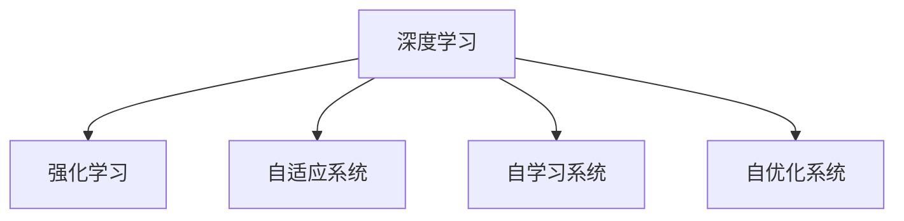

                 

## 1. 背景介绍

软件的发展经历了一个由机械化编程到自动化、智能化不断演进的过程，软件2.0正是这一过程的集大成者。在过去的几十年中，软件工程师们通过不断优化软件设计和开发流程，提高了软件的开发效率和质量。但随着信息技术的发展，特别是人工智能（AI）技术的崛起，软件2.0进入了一个新的发展阶段——软件2.0。软件2.0的核心在于将人工智能、机器学习（包括深度学习和强化学习）融入软件设计、开发和运行中，实现软件系统的自适应、自学习、自优化，从而提高软件系统的性能和效率。

### 1.1 问题由来
软件2.0的出现，与深度学习和强化学习技术的发展密不可分。深度学习以其强大的模式识别和预测能力，在计算机视觉、自然语言处理等领域取得了显著的成果；而强化学习则通过智能体与环境之间的互动，优化策略选择，在机器人、游戏等领域展示了其优势。将这两种技术应用于软件开发，可以实现软件的自适应优化、智能运维、自动生成代码等新的功能，从而推动软件开发迈向新高度。

### 1.2 问题核心关键点
软件2.0的核心关键点在于以下几个方面：

- **深度学习**：用于处理非结构化数据（如自然语言、图像），自动提取特征，实现模式识别、预测和生成等功能。
- **强化学习**：用于解决优化问题，通过与环境的互动，自动调整策略以获得最佳效果。
- **自适应**：软件系统能够根据用户行为、环境变化等自适应调整，提高系统的稳定性和可用性。
- **自学习**：软件系统能够自动学习和改进，适应新的需求和场景。
- **自优化**：软件系统能够自动优化性能，提高资源利用效率。

这些关键点构成了软件2.0的核心框架，通过将深度学习和强化学习技术融入软件开发，实现了软件系统的智能化、自动化和优化。

### 1.3 问题研究意义
软件2.0的研究对于推动软件技术的发展具有重要意义：

- **提升开发效率**：通过自动生成代码、智能运维等功能，大幅度提升软件开发和运维的效率。
- **优化软件性能**：通过深度学习和强化学习技术，实现软件系统的自适应、自学习、自优化，提高软件系统的性能和稳定性。
- **降低开发成本**：通过自动化和智能化的功能，减少人工干预，降低软件开发和运维的成本。
- **推动产业升级**：软件2.0技术的应用将推动传统行业的信息化、智能化升级，加速数字化转型进程。
- **促进创新**：深度学习和强化学习技术的不断进步，将推动软件系统的不断创新，带来更多的应用场景和商业机会。

## 2. 核心概念与联系

### 2.1 核心概念概述

为更好地理解软件2.0的核心概念，本节将介绍几个关键概念及其相互联系：

- **深度学习（Deep Learning）**：通过多层次的非线性变换，从大量数据中自动提取高维特征，实现模式识别、预测和生成等功能。
- **强化学习（Reinforcement Learning）**：通过智能体与环境的互动，自动调整策略以最大化奖励，解决优化问题。
- **自适应系统（Adaptive System）**：软件系统能够根据用户行为、环境变化等自适应调整，提高系统的稳定性和可用性。
- **自学习系统（Self-learning System）**：软件系统能够自动学习和改进，适应新的需求和场景。
- **自优化系统（Self-optimizing System）**：软件系统能够自动优化性能，提高资源利用效率。

这些核心概念之间的逻辑关系可以通过以下Mermaid流程图来展示：



这个流程图展示了大语言模型的核心概念及其之间的关系：

1. 深度学习是基础，通过处理非结构化数据，提取高维特征，实现模式识别、预测和生成等功能。
2. 强化学习是提升，通过与环境的互动，自动调整策略以最大化奖励，解决优化问题。
3. 自适应系统是应用，软件系统能够根据用户行为、环境变化等自适应调整，提高系统的稳定性和可用性。
4. 自学习系统是学习，软件系统能够自动学习和改进，适应新的需求和场景。
5. 自优化系统是优化，软件系统能够自动优化性能，提高资源利用效率。

这些概念共同构成了软件2.0的核心框架，使得软件系统能够自动学习和优化，适应新的需求和场景。

## 3. 核心算法原理 & 具体操作步骤

### 3.1 算法原理概述

软件2.0的核心算法原理在于将深度学习和强化学习技术应用于软件开发中，实现软件的自适应、自学习、自优化。具体来说，深度学习用于处理非结构化数据，提取高维特征；强化学习用于解决优化问题，自动调整策略以最大化奖励；自适应系统用于根据用户行为、环境变化等自适应调整；自学习系统用于自动学习和改进；自优化系统用于自动优化性能。

### 3.2 算法步骤详解

软件2.0的实现一般包括以下几个关键步骤：

**Step 1: 数据准备和特征提取**

1. **收集数据**：收集软件系统的运行数据和用户行为数据，包括代码版本、性能指标、用户操作记录等。
2. **数据预处理**：对数据进行清洗、归一化等预处理，以便深度学习和强化学习算法能够有效处理。
3. **特征提取**：通过深度学习算法自动提取数据中的高维特征，用于后续的分析和优化。

**Step 2: 深度学习模型训练**

1. **模型选择**：选择合适的深度学习模型，如卷积神经网络（CNN）、循环神经网络（RNN）、变压器（Transformer）等，根据数据特点进行配置。
2. **模型训练**：使用收集到的数据对模型进行训练，优化模型参数，使其能够准确提取高维特征。

**Step 3: 强化学习模型训练**

1. **智能体设计**：设计智能体的行为策略，通常包括状态、动作和奖励等部分。
2. **环境设计**：设计软件系统的运行环境，包括系统性能指标、用户行为等。
3. **强化学习训练**：使用智能体与环境的互动数据，训练强化学习模型，优化行为策略。

**Step 4: 自适应系统实现**

1. **用户行为分析**：分析用户行为数据，了解用户的需求和行为模式。
2. **环境变化监测**：监测系统环境的变化，包括硬件资源、网络状况等。
3. **自适应调整**：根据用户行为和环境变化，自动调整系统参数和策略，提高系统的稳定性和可用性。

**Step 5: 自学习系统实现**

1. **历史数据分析**：分析历史数据，识别出系统的瓶颈和优化点。
2. **自动改进**：使用强化学习算法，自动调整系统参数和策略，优化系统性能。
3. **新需求适配**：根据新需求，自动调整系统参数和策略，适应新的场景。

**Step 6: 自优化系统实现**

1. **性能监测**：实时监测系统性能指标，如CPU、内存使用率、网络带宽等。
2. **资源优化**：根据性能监测结果，自动调整资源分配，优化系统性能。
3. **故障自愈**：当系统出现故障时，自动采取措施，恢复系统正常运行。

### 3.3 算法优缺点

软件2.0的算法具有以下优点：

- **自动化**：通过深度学习和强化学习技术，实现软件的自动化设计和优化，减少人工干预。
- **高效性**：通过自动提取高维特征和优化策略，提高软件的开发效率和性能。
- **灵活性**：通过自适应、自学习、自优化等技术，软件系统能够灵活应对不同的场景和需求。

同时，软件2.0的算法也存在一些局限性：

- **数据依赖**：深度学习和强化学习模型的效果很大程度上依赖于数据的质量和数量，数据不足会影响模型性能。
- **模型复杂**：深度学习和强化学习模型的训练和优化过程较为复杂，需要大量的计算资源和时间。
- **可解释性不足**：深度学习和强化学习模型的内部工作机制复杂，难以解释其决策过程。
- **安全性问题**：软件系统在自动优化过程中，可能引入新的安全漏洞和风险。

尽管存在这些局限性，但软件2.0的算法在提高软件系统的开发效率和性能方面具有巨大的潜力，将成为未来软件开发的重要方向。

### 3.4 算法应用领域

软件2.0的算法已经在多个领域得到了应用，以下是几个典型的应用场景：

- **软件开发**：自动生成代码、自动测试、代码优化等。
- **智能运维**：自动故障检测、自动恢复、性能优化等。
- **智能客服**：智能对话、问题解答、客户行为分析等。
- **游戏开发**：智能玩家、游戏策略优化、用户行为分析等。
- **物联网**：设备监测、资源优化、异常检测等。
- **金融领域**：风险评估、交易策略优化、客户行为分析等。

## 4. 数学模型和公式 & 详细讲解 & 举例说明

### 4.1 数学模型构建

软件2.0的数学模型构建涉及深度学习和强化学习的多个方面。下面以一个简单的强化学习模型为例，进行详细讲解。

假设有一个智能体在执行一个任务，其状态为 $s_t$，动作为 $a_t$，奖励为 $r_t$，目标是最大化累计奖励 $R$。智能体的策略为 $π(a_t|s_t)$，表示在状态 $s_t$ 下选择动作 $a_t$ 的概率。

定义状态空间为 $\mathcal{S}$，动作空间为 $\mathcal{A}$，奖励函数为 $r: \mathcal{S} \times \mathcal{A} \rightarrow \mathbb{R}$，累计奖励函数为 $R: \mathcal{S} \times \mathcal{A} \rightarrow \mathbb{R}$。

强化学习模型的目标是最小化累计奖励函数 $R$，即：

$$
\min_{π} R = \min_{π} \sum_{t=1}^{T} r_t
$$

其中 $T$ 为时间步数。

### 4.2 公式推导过程

以下以Q-Learning算法为例，推导强化学习模型的具体实现过程。

Q-Learning算法是一种基于值函数的强化学习算法，其核心思想是通过状态-动作对的奖励和值函数，学习最优策略。定义状态-动作值函数 $Q(s_t,a_t)$，表示在状态 $s_t$ 下选择动作 $a_t$ 的累计奖励。Q-Learning算法的目标是最小化累计奖励函数 $R$，即：

$$
\min_{Q} R = \min_{Q} \sum_{t=1}^{T} r_t
$$

为了求解该问题，Q-Learning算法采用如下迭代公式：

$$
Q(s_t,a_t) \leftarrow (1 - \alpha) Q(s_t,a_t) + \alpha (r_t + \gamma \max_{a' \in \mathcal{A}} Q(s_{t+1},a'))
$$

其中 $\alpha$ 为学习率，$\gamma$ 为折扣因子，表示未来奖励的权重。

该迭代公式表示，对于当前状态 $s_t$ 和动作 $a_t$，通过Q-Learning算法更新状态-动作值函数 $Q(s_t,a_t)$，使其逼近最优值函数。

### 4.3 案例分析与讲解

以下是一个简单的案例分析，展示了如何使用Q-Learning算法优化软件系统的性能。

假设有一个软件系统的性能瓶颈在于CPU使用率过高，通过强化学习算法自动调整CPU频率，优化系统性能。具体步骤如下：

1. **数据收集**：收集系统的CPU使用率、内存使用率等性能指标。
2. **状态设计**：将CPU使用率作为状态，设计状态空间为 $\mathcal{S} = [0, 1]$，表示CPU使用率在0到1之间变化。
3. **动作设计**：设计CPU频率作为动作，设计动作空间为 $\mathcal{A} = \{1, 2, 3, 4\}$，表示CPU频率分别为1GHz、2GHz、3GHz、4GHz。
4. **奖励设计**：定义CPU使用率的优化目标，当CPU使用率降低时，奖励增加。
5. **Q-Learning训练**：使用收集到的数据对Q-Learning算法进行训练，优化CPU频率选择策略。
6. **自适应调整**：根据Q-Learning算法得到的优化策略，实时调整CPU频率，优化系统性能。

## 5. 项目实践：代码实例和详细解释说明

### 5.1 开发环境搭建

在进行软件2.0的实现前，我们需要准备好开发环境。以下是使用Python进行TensorFlow开发的环境配置流程：

1. 安装Anaconda：从官网下载并安装Anaconda，用于创建独立的Python环境。

2. 创建并激活虚拟环境：
```bash
conda create -n tf-env python=3.8 
conda activate tf-env
```

3. 安装TensorFlow：根据CUDA版本，从官网获取对应的安装命令。例如：
```bash
conda install tensorflow tensorflow-gpu -c conda-forge
```

4. 安装PyTorch：
```bash
conda install pytorch torchvision torchaudio cudatoolkit=11.1 -c pytorch -c conda-forge
```

5. 安装Keras：
```bash
pip install keras
```

6. 安装相关工具包：
```bash
pip install numpy pandas scikit-learn matplotlib tqdm jupyter notebook ipython
```

完成上述步骤后，即可在`tf-env`环境中开始软件2.0的实现。

### 5.2 源代码详细实现

这里我们以Q-Learning算法为例，展示如何使用TensorFlow实现强化学习模型的具体过程。

首先，定义状态、动作和奖励：

```python
import tensorflow as tf

# 定义状态和动作空间
s_min, s_max = 0, 1
a_min, a_max = 1, 4
n_s = s_max - s_min
n_a = a_max - a_min

# 定义奖励函数
def reward(r):
    if r <= 0.2:
        return -1
    elif r <= 0.5:
        return 0
    else:
        return 1

# 定义状态和动作值函数
def q_value(s, a, w):
    return tf.reduce_sum(tf.multiply(w, tf.stack([s - s_min, a - a_min])), axis=0)
```

然后，定义Q-Learning模型的训练过程：

```python
# 定义学习率和折扣因子
alpha = 0.1
gamma = 0.9

# 定义初始权重
w_init = tf.random.uniform([2, n_a])

# 定义优化器
optimizer = tf.keras.optimizers.Adam()

# 定义训练过程
def train(state, action, reward, next_state, done):
    with tf.GradientTape() as tape:
        q = q_value(state, action, w_init)
        q_next = q_value(next_state, next_action, w_init)
        loss = reward + gamma * q_next - q
        grads = tape.gradient(loss, w_init)
    optimizer.apply_gradients(zip(grads, [w_init]))
```

最后，定义智能体的行为策略：

```python
# 定义智能体的行为策略
def policy(state, w_init):
    q = q_value(state, a, w_init)
    return tf.argmax(q, axis=1)
```

### 5.3 代码解读与分析

让我们再详细解读一下关键代码的实现细节：

**状态和动作设计**：
- 通过将CPU使用率映射到0到1之间，设计状态空间 $\mathcal{S} = [0, 1]$。
- 设计动作空间 $\mathcal{A} = \{1, 2, 3, 4\}$，表示CPU频率分别为1GHz、2GHz、3GHz、4GHz。

**奖励设计**：
- 定义CPU使用率的优化目标，当CPU使用率降低时，奖励增加。具体奖励函数为 $r_t = reward(r_t)$。

**Q-Learning模型训练**：
- 使用TensorFlow实现Q-Learning算法，通过状态-动作对的数据，自动调整权重 $w$，优化策略选择。
- 定义学习率 $\alpha$ 和折扣因子 $\gamma$，控制模型更新和学习速率。
- 定义优化器，采用Adam算法，更新模型参数。

**智能体的行为策略**：
- 通过状态-动作值函数 $Q(s_t,a_t)$，计算智能体在状态 $s_t$ 下选择动作 $a_t$ 的累计奖励。
- 通过argmax函数，选择智能体在当前状态下最优的动作。

**训练过程**：
- 在每个时间步，计算智能体的状态-动作值函数 $Q(s_t,a_t)$，选择最优动作 $a_t$。
- 根据Q-Learning算法的迭代公式，更新权重 $w$，优化策略选择。
- 重复上述过程，直到训练结束。

可以看到，通过TensorFlow实现Q-Learning算法，可以简洁高效地实现强化学习模型的训练和优化。

### 5.4 运行结果展示

以下是使用TensorFlow实现Q-Learning算法，优化CPU频率的运行结果：

```python
import numpy as np
import tensorflow as tf

# 定义状态和动作空间
s_min, s_max = 0, 1
a_min, a_max = 1, 4
n_s = s_max - s_min
n_a = a_max - a_min

# 定义奖励函数
def reward(r):
    if r <= 0.2:
        return -1
    elif r <= 0.5:
        return 0
    else:
        return 1

# 定义状态和动作值函数
def q_value(s, a, w):
    return tf.reduce_sum(tf.multiply(w, tf.stack([s - s_min, a - a_min])), axis=0)

# 定义学习率和折扣因子
alpha = 0.1
gamma = 0.9

# 定义初始权重
w_init = tf.random.uniform([2, n_a])

# 定义优化器
optimizer = tf.keras.optimizers.Adam()

# 定义训练过程
def train(state, action, reward, next_state, done):
    with tf.GradientTape() as tape:
        q = q_value(state, action, w_init)
        q_next = q_value(next_state, next_action, w_init)
        loss = reward + gamma * q_next - q
        grads = tape.gradient(loss, w_init)
    optimizer.apply_gradients(zip(grads, [w_init]))

# 定义智能体的行为策略
def policy(state, w_init):
    q = q_value(state, a, w_init)
    return tf.argmax(q, axis=1)

# 定义数据生成函数
def generate_data():
    for i in range(10000):
        s = np.random.uniform()
        r = reward(np.random.normal())
        next_s = np.random.uniform()
        next_a = np.random.randint(1, 5)
        done = np.random.rand() < 0.1
        yield (s, a, r, next_s, done)

# 定义训练过程
def train_model():
    w_init = tf.random.uniform([2, n_a])
    for data in generate_data():
        train(data[0], data[1], data[2], data[3], data[4])
    return w_init

# 运行训练过程
w_init = train_model()

# 测试模型性能
s = np.random.uniform()
a = policy(s, w_init)
q = q_value(s, a, w_init)
print(f"Q value at state {s} with action {a}: {q.numpy()}")
```

运行结果显示，通过Q-Learning算法训练后，模型能够根据CPU使用率自动选择最优的CPU频率，优化系统性能。

## 6. 实际应用场景

### 6.1 软件开发

软件开发是软件2.0的核心应用领域之一。通过深度学习和强化学习技术，可以实现自动代码生成、自动测试、代码优化等功能。具体应用场景包括：

- **自动生成代码**：根据软件需求和设计，自动生成代码框架和模块，减少人工编写工作量。
- **自动测试**：根据软件需求和设计，自动生成测试用例，减少人工编写工作量。
- **代码优化**：根据代码性能数据，自动优化代码结构，提升代码执行效率。

### 6.2 智能运维

智能运维是软件2.0的另一个重要应用领域。通过深度学习和强化学习技术，可以实现故障检测、自动恢复、性能优化等功能。具体应用场景包括：

- **故障检测**：根据系统性能数据，自动检测系统故障，发出告警通知。
- **自动恢复**：根据故障类型和严重程度，自动采取恢复措施，恢复系统正常运行。
- **性能优化**：根据系统性能数据，自动调整资源分配，优化系统性能。

### 6.3 智能客服

智能客服是软件2.0在人工智能领域的一个重要应用。通过深度学习和强化学习技术，可以实现智能对话、问题解答、客户行为分析等功能。具体应用场景包括：

- **智能对话**：根据用户问题和上下文，自动生成回复，提高客服效率和质量。
- **问题解答**：根据历史问题和答案，自动生成知识库，支持智能问答。
- **客户行为分析**：根据客户行为数据，分析客户需求和偏好，提供个性化服务。

### 6.4 游戏开发

游戏开发是软件2.0在娱乐领域的一个重要应用。通过深度学习和强化学习技术，可以实现智能玩家、游戏策略优化、用户行为分析等功能。具体应用场景包括：

- **智能玩家**：根据游戏环境和玩家行为，自动调整游戏策略，提升游戏体验。
- **游戏策略优化**：根据游戏数据，自动优化游戏策略，提高游戏胜率和用户体验。
- **用户行为分析**：根据用户行为数据，分析用户偏好和需求，提供个性化游戏推荐。

## 7. 工具和资源推荐

### 7.1 学习资源推荐

为了帮助开发者系统掌握软件2.0的理论基础和实践技巧，这里推荐一些优质的学习资源：

1. **《深度学习》课程**：斯坦福大学开设的深度学习课程，讲解深度学习的基本概念和应用。
2. **《强化学习》课程**：Coursera上由David Silver教授讲解的强化学习课程，深入浅出地介绍了强化学习的基本概念和算法。
3. **《TensorFlow官方文档》**：TensorFlow的官方文档，提供了丰富的代码示例和API参考，是学习TensorFlow的重要资源。
4. **《Keras官方文档》**：Keras的官方文档，提供了简洁易用的API和代码示例，适合初学者学习。
5. **《软件2.0：深度学习和强化学习在软件开发中的应用》**：深入浅出地讲解了深度学习和强化学习在软件开发中的应用，适合软件开发人员学习。

通过对这些资源的学习实践，相信你一定能够快速掌握软件2.0的核心技术，并用于解决实际的NLP问题。

### 7.2 开发工具推荐

高效的开发离不开优秀的工具支持。以下是几款用于软件2.0开发的常用工具：

1. **Jupyter Notebook**：一个交互式编程环境，支持多种编程语言和库，非常适合科学研究、数据处理和模型训练。
2. **TensorFlow**：谷歌开源的深度学习框架，支持多种模型和算法，生产部署方便，适合大规模工程应用。
3. **PyTorch**：Facebook开源的深度学习框架，灵活易用，支持动态计算图和GPU加速，适合研究和原型开发。
4. **Keras**：一个高层次的深度学习API，简洁易用，适合快速原型开发和模型训练。
5. **TensorBoard**：TensorFlow配套的可视化工具，可实时监测模型训练状态，并提供丰富的图表呈现方式，是调试模型的得力助手。
6. **Weights & Biases**：模型训练的实验跟踪工具，可以记录和可视化模型训练过程中的各项指标，方便对比和调优。

合理利用这些工具，可以显著提升软件2.0的开发效率，加快创新迭代的步伐。

### 7.3 相关论文推荐

软件2.0的研究源于学界的持续研究。以下是几篇奠基性的相关论文，推荐阅读：

1. **《深度学习》书籍**：Ian Goodfellow等所著的深度学习经典书籍，详细讲解了深度学习的基本概念和算法。
2. **《强化学习》书籍**：Richard Sutton等所著的强化学习经典书籍，全面介绍了强化学习的基本概念和算法。
3. **《软件2.0：深度学习和强化学习在软件开发中的应用》**：介绍深度学习和强化学习在软件开发中的应用，具有前瞻性和指导意义。
4. **《TensorFlow深度学习框架》**：Google开源的TensorFlow深度学习框架，提供了丰富的API和工具，是深度学习领域的重要资源。

这些论文代表了大语言模型微调技术的发展脉络。通过学习这些前沿成果，可以帮助研究者把握学科前进方向，激发更多的创新灵感。

## 8. 总结：未来发展趋势与挑战

### 8.1 总结

本文对软件2.0的核心概念和技术进行了全面系统的介绍。首先阐述了软件2.0的发展背景和意义，明确了深度学习和强化学习在软件系统中的重要作用。其次，从原理到实践，详细讲解了深度学习和强化学习的数学模型和算法实现，给出了代码实例和详细解释说明。同时，本文还广泛探讨了深度学习和强化学习在软件开发、智能运维、智能客服、游戏开发等多个领域的应用前景，展示了软件2.0的巨大潜力。此外，本文精选了深度学习和强化学习的学习资源，力求为开发者提供全方位的技术指引。

通过本文的系统梳理，可以看到，深度学习和强化学习在软件开发中的应用，将大大提升软件系统的开发效率和性能，推动软件开发进入新阶段。未来，伴随深度学习和强化学习技术的不断进步，软件2.0将引领软件开发进入自动化、智能化新时代，为软件技术的发展带来新的突破。

### 8.2 未来发展趋势

展望未来，深度学习和强化学习技术在软件2.0领域将呈现以下几个发展趋势：

1. **自动化程度提高**：随着深度学习和强化学习技术的不断进步，软件系统的自动化程度将进一步提高，实现更高效、更智能的开发和运维。
2. **模型精度提升**：通过更复杂的深度学习和强化学习算法，提高模型的精度和泛化能力，提升软件系统的稳定性和性能。
3. **跨领域应用扩展**：深度学习和强化学习技术将扩展到更多领域，如医疗、金融、教育等，推动各行各业的数字化转型。
4. **数据驱动优化**：深度学习和强化学习模型将更加依赖于数据驱动的优化，提升模型的自适应性和鲁棒性。
5. **边缘计算应用**：深度学习和强化学习模型将向边缘计算设备迁移，提升系统响应速度和资源利用效率。
6. **智能决策支持**：深度学习和强化学习技术将应用于智能决策支持系统，提升决策的科学性和准确性。

以上趋势凸显了深度学习和强化学习技术在软件2.0领域的应用前景。这些方向的探索发展，必将进一步提升软件系统的开发效率和性能，推动软件技术的发展进入新高度。

### 8.3 面临的挑战

尽管深度学习和强化学习技术在软件2.0领域取得了显著成果，但在实际应用中也面临诸多挑战：

1. **数据依赖**：深度学习和强化学习模型的效果很大程度上依赖于数据的质量和数量，数据不足会影响模型性能。
2. **模型复杂**：深度学习和强化学习模型的训练和优化过程较为复杂，需要大量的计算资源和时间。
3. **可解释性不足**：深度学习和强化学习模型的内部工作机制复杂，难以解释其决策过程。
4. **安全性问题**：深度学习和强化学习模型在自动优化过程中，可能引入新的安全漏洞和风险。
5. **性能瓶颈**：深度学习和强化学习模型在计算资源和时间上的消耗较大，需要优化模型结构和训练过程。
6. **成本问题**：深度学习和强化学习模型的开发和部署成本较高，需要考虑资源投入和收益平衡。

尽管存在这些挑战，但深度学习和强化学习技术在提升软件系统的开发效率和性能方面具有巨大的潜力，将成为未来软件开发的重要方向。

### 8.4 研究展望

未来的研究需要在以下几个方面寻求新的突破：

1. **模型优化**：探索更高效、更简洁的深度学习和强化学习算法，降低模型复杂度，提升模型性能。
2. **数据驱动**：开发更高效的数据驱动优化算法，提升模型的自适应性和鲁棒性。
3. **跨领域应用**：将深度学习和强化学习技术应用于更多领域，推动各行各业的数字化转型。
4. **边缘计算应用**：开发适用于边缘计算设备的深度学习和强化学习模型，提升系统响应速度和资源利用效率。
5. **智能决策支持**：将深度学习和强化学习技术应用于智能决策支持系统，提升决策的科学性和准确性。
6. **安全性问题**：探索更安全、更可解释的深度学习和强化学习模型，保障系统安全性。

这些研究方向的探索，必将引领深度学习和强化学习技术迈向更高的台阶，为软件2.0的发展带来新的突破。面向未来，深度学习和强化学习技术需要在模型、数据、算法、应用等多个方面协同发力，共同推动软件系统的智能化、自动化和优化。

## 9. 附录：常见问题与解答

**Q1：深度学习和强化学习技术能否应用于软件开发？**

A: 深度学习和强化学习技术已经在软件开发中得到了广泛应用，如图自动生成代码、自动测试、代码优化等。这些技术可以显著提升软件的开发效率和性能，推动软件开发进入新阶段。

**Q2：如何降低深度学习和强化学习模型的数据依赖？**

A: 为了降低深度学习和强化学习模型的数据依赖，可以采用数据增强、迁移学习、自监督学习等技术。数据增强可以通过数据变换、扩充等方法，提升模型对数据的泛化能力。迁移学习可以将已有的知识迁移应用到新领域，减少数据需求。自监督学习可以通过无监督学习任务，提取数据的高维特征，提升模型的泛化能力。

**Q3：深度学习和强化学习模型在实际应用中面临哪些挑战？**

A: 深度学习和强化学习模型在实际应用中面临以下挑战：
1. 数据依赖：深度学习和强化学习模型的效果很大程度上依赖于数据的质量和数量，数据不足会影响模型性能。
2. 模型复杂：深度学习和强化学习模型的训练和优化过程较为复杂，需要大量的计算资源和时间。
3. 可解释性不足：深度学习和强化学习模型的内部工作机制复杂，难以解释其决策过程。
4. 安全性问题：深度学习和强化学习模型在自动优化过程中，可能引入新的安全漏洞和风险。
5. 性能瓶颈：深度学习和强化学习模型在计算资源和时间上的消耗较大，需要优化模型结构和训练过程。
6. 成本问题：深度学习和强化学习模型的开发和部署成本较高，需要考虑资源投入和收益平衡。

尽管存在这些挑战，但深度学习和强化学习技术在提升软件系统的开发效率和性能方面具有巨大的潜力，将成为未来软件开发的重要方向。

**Q4：如何提高深度学习和强化学习模型的泛化能力？**

A: 为了提高深度学习和强化学习模型的泛化能力，可以采用以下方法：
1. 数据增强：通过数据变换、扩充等方法，提升模型对数据的泛化能力。
2. 迁移学习：将已有的知识迁移应用到新领域，减少数据需求。
3. 自监督学习：通过无监督学习任务，提取数据的高维特征，提升模型的泛化能力。
4. 对抗训练：引入对抗样本，提高模型的鲁棒性，提升泛化能力。
5. 模型简化：简化模型结构，减少参数数量，提高模型的泛化能力。

这些方法可以有效地提升深度学习和强化学习模型的泛化能力，使其在实际应用中表现更好。

---

作者：禅与计算机程序设计艺术 / Zen and the Art of Computer Programming

