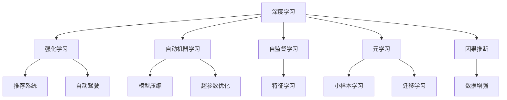

                 

# 软件 2.0 的发展趋势：深度学习、强化学习

> 关键词：深度学习, 强化学习, 人工智能, 自动机器学习, 自监督学习, 元学习, 因果推断

## 1. 背景介绍

### 1.1 问题由来
随着计算机科学和工程技术的飞速发展，软件行业已经进入了全新阶段，这一阶段常被称为“软件 2.0”时代。这一时代的主要特征是人工智能（AI）技术的全面渗透，深度学习和强化学习成为推动软件开发与工程的主要动力。通过自动化和自适应学习，AI技术能够显著提升软件系统的智能化水平和开发效率。

深度学习和强化学习在过去十年中迅速崛起，两者分别从数据驱动和行为驱动的角度，为软件系统的智能化和自动化提供了强有力的技术支持。深度学习通过构建复杂的多层神经网络，能够处理和理解海量数据，自动提取特征，广泛应用于计算机视觉、自然语言处理等领域。而强化学习则通过智能体在环境中与环境互动，通过试错不断优化策略，成功应用于游戏、推荐系统、自动驾驶等领域。

这一发展趋势不仅推动了传统软件行业的转型升级，也促进了新兴人工智能领域的发展，使得软件系统能够具备自主学习和自我进化的能力，进而引领新一轮技术革命。

### 1.2 问题核心关键点
深度学习和强化学习的核心技术包括：

- **深度学习**：利用多层次神经网络进行特征提取与分类、回归等任务，通过大量数据进行预训练和微调，提高模型泛化能力。
- **强化学习**：通过智能体与环境交互，不断优化策略，使得智能体能够在动态环境中做出最佳决策，应用场景包括机器人控制、自动驾驶、游戏策略优化等。
- **自动机器学习（AutoML）**：通过自动化技术，自动选择算法、调整超参数，提升机器学习模型的构建和优化效率。
- **自监督学习**：利用未标注数据进行特征学习，不依赖大量标注数据，减少数据获取和标注成本。
- **元学习（Meta-Learning）**：学习如何学习，通过迁移学习、小样本学习等技术，加速模型在新的任务上的适应和优化。
- **因果推断**：揭示变量之间的因果关系，提供更准确的数据分析与决策支持。

深度学习和强化学习的核心概念之间存在密切联系，通过合理设计算法和架构，可以在实际应用中实现相辅相成的效果。

### 1.3 问题研究意义
深度学习和强化学习的核心技术对软件开发和工程具有重要意义：

- **提升开发效率**：通过自动化和智能化的方式，深度学习和强化学习能够加速软件开发过程，减少人力和时间成本。
- **优化系统性能**：在数据分析、图像识别、自然语言处理等领域，深度学习和强化学习能够显著提升系统性能，提升用户体验。
- **增强决策能力**：强化学习在决策优化、自动控制等领域的应用，能够提供更加智能和高效的解决方案。
- **促进技术创新**：结合深度学习和强化学习的技术，能够催生更多的创新应用场景，推动科技发展。
- **推动产业发展**：通过自动化和智能化，深度学习和强化学习能够加速传统行业的数字化转型，驱动产业升级。

## 2. 核心概念与联系

### 2.1 核心概念概述

为更好地理解深度学习和强化学习的核心技术，本节将介绍几个密切相关的核心概念：

- **深度学习**：一种利用多层神经网络进行数据分析和预测的技术。通过大量数据进行训练，学习模型的权重和偏置，得到高效的特征表示。
- **强化学习**：通过智能体在环境中与环境互动，不断优化策略，学习如何在动态环境中做出最佳决策。强化学习依赖于奖励信号进行反馈，通过不断试错优化策略。
- **自动机器学习（AutoML）**：一种自动化机器学习技术，通过自动选择算法和调整超参数，加速机器学习模型的构建和优化。
- **自监督学习**：一种无监督学习方法，利用未标注数据进行特征学习，减少数据获取和标注成本。
- **元学习**：一种学习如何学习的技术，通过迁移学习、小样本学习等技术，加速模型在新的任务上的适应和优化。
- **因果推断**：一种分析变量之间因果关系的技术，提供更准确的数据分析和决策支持。

这些核心概念之间的逻辑关系可以通过以下Mermaid流程图来展示：



这个流程图展示了几项核心技术之间的关联关系：

1. **深度学习**与**强化学习**：深度学习通过大量数据提取特征，而强化学习通过智能体与环境互动不断优化策略。两者在数据驱动和行为驱动上相辅相成。
2. **深度学习**与**自动机器学习**：深度学习模型需要调整超参数以优化性能，而自动机器学习可以自动化地选择和调整这些参数。
3. **深度学习**与**自监督学习**：自监督学习利用未标注数据进行特征学习，而深度学习可以通过自监督学习进一步提升模型泛化能力。
4. **深度学习**与**元学习**：元学习可以加速深度学习模型在新的任务上的适应和优化，提升模型的迁移能力。
5. **深度学习**与**因果推断**：因果推断可以帮助深度学习模型理解变量之间的因果关系，提供更准确的数据分析和决策支持。
6. **强化学习**与**数据增强**：强化学习通过不断与环境互动获取新数据，而数据增强可以通过生成新样本来丰富训练集。
7. **自动机器学习**与**模型压缩**：自动机器学习可以选择最优的模型架构，而模型压缩可以减小模型规模，提高计算效率。
8. **自监督学习**与**特征学习**：自监督学习利用未标注数据进行特征学习，而特征学习是深度学习模型的基础。
9. **元学习**与**小样本学习**：元学习可以加速模型在小样本数据上的适应，而小样本学习可以在数据量较少的情况下取得良好效果。
10. **元学习**与**迁移学习**：元学习可以加速迁移学习，使得模型在新的任务上快速适应和优化。

这些核心概念共同构成了深度学习和强化学习的应用框架，为软件开发和工程提供了强大的技术支撑。通过理解这些概念及其联系，可以更好地把握深度学习和强化学习的核心思想和应用方向。

## 3. 核心算法原理 & 具体操作步骤
### 3.1 算法原理概述

深度学习和强化学习的核心算法分别基于不同的原理。深度学习主要基于神经网络结构，通过大量数据进行特征提取和分类、回归等任务；而强化学习主要基于智能体与环境互动的模型，通过策略优化来做出最佳决策。

#### 3.1.1 深度学习算法原理

深度学习利用神经网络结构，通过大量数据进行特征提取和分类、回归等任务。其核心算法包括反向传播算法、梯度下降算法等。反向传播算法通过链式法则计算损失函数对参数的梯度，从而进行参数更新。梯度下降算法通过不断调整参数，使损失函数最小化。

#### 3.1.2 强化学习算法原理

强化学习通过智能体与环境互动，不断优化策略，学习如何在动态环境中做出最佳决策。其核心算法包括Q-learning算法、策略梯度算法等。Q-learning算法通过价值函数进行状态值估计，从而优化策略。策略梯度算法直接优化策略参数，使得智能体在环境中表现更好。

### 3.2 算法步骤详解

深度学习和强化学习的核心算法步骤如下：

#### 3.2.1 深度学习算法步骤

1. **数据预处理**：对原始数据进行清洗、归一化等处理，使其适合模型训练。
2. **模型构建**：选择适合的神经网络结构，如卷积神经网络（CNN）、循环神经网络（RNN）、长短时记忆网络（LSTM）等。
3. **模型训练**：通过反向传播算法和梯度下降算法，不断调整模型参数，最小化损失函数。
4. **模型验证与测试**：在验证集和测试集上评估模型性能，调整超参数和模型结构。
5. **模型部署与应用**：将训练好的模型部署到实际应用中，进行推理和预测。

#### 3.2.2 强化学习算法步骤

1. **环境定义**：定义智能体需要与之互动的环境，包括状态、动作、奖励等。
2. **策略定义**：选择适合的策略，如Q-learning策略、策略梯度策略等。
3. **智能体训练**：通过智能体与环境互动，不断优化策略，最小化累计奖励。
4. **策略评估**：在测试集上评估智能体性能，调整策略参数。
5. **智能体部署与应用**：将训练好的智能体部署到实际应用中，进行决策和控制。

### 3.3 算法优缺点

深度学习和强化学习的核心算法具有以下优点和缺点：

**深度学习**：

- **优点**：
  - 能够处理海量数据，提取复杂的特征。
  - 适用于分类、回归、图像识别等任务。
  - 端到端训练，不需要手动设计特征。
  
- **缺点**：
  - 需要大量标注数据进行预训练，数据获取成本高。
  - 模型复杂，训练时间长，需要大量计算资源。
  - 对数据分布变化敏感，泛化能力有待提高。

**强化学习**：

- **优点**：
  - 能够自适应环境，适应动态变化。
  - 通过智能体与环境互动，学习最优策略。
  - 适用于游戏、推荐系统、自动驾驶等领域。
  
- **缺点**：
  - 需要大量试错过程，训练时间长。
  - 策略优化复杂，难以保证最优解。
  - 对奖励函数设计要求高，容易陷入局部最优。

### 3.4 算法应用领域

深度学习和强化学习的核心算法已经在多个领域得到广泛应用，以下是几个典型应用：

- **计算机视觉**：利用深度学习进行图像分类、物体检测、图像分割等任务。
- **自然语言处理**：利用深度学习进行文本分类、情感分析、机器翻译等任务。
- **推荐系统**：利用强化学习进行用户行为预测，推荐个性化内容。
- **自动驾驶**：利用强化学习进行路径规划、避障决策等任务。
- **游戏智能**：利用强化学习进行游戏策略优化，提升游戏AI智能水平。
- **机器人控制**：利用强化学习进行机器人路径规划、任务执行等任务。

除了上述这些经典应用外，深度学习和强化学习还被创新性地应用到更多场景中，如情感分析、音乐生成、金融预测、医疗诊断等，为不同领域带来了新的突破。

## 4. 数学模型和公式 & 详细讲解  
### 4.1 数学模型构建

本节将使用数学语言对深度学习和强化学习的核心算法进行更加严格的刻画。

记深度学习模型为 $M_{\theta}$，其中 $\theta$ 为模型参数。假设训练数据集为 $D=\{(x_i, y_i)\}_{i=1}^N$，其中 $x_i$ 为输入，$y_i$ 为输出。深度学习模型的损失函数定义为：

$$
\mathcal{L}(\theta) = \frac{1}{N} \sum_{i=1}^N \ell(M_{\theta}(x_i), y_i)
$$

其中 $\ell$ 为损失函数，常用的损失函数包括交叉熵损失、均方误差损失等。

对于强化学习，记智能体为 $A$，环境为 $E$，策略为 $\pi$。假设智能体在状态 $s_t$ 下采取动作 $a_t$，获得奖励 $r_t$，环境状态转移到 $s_{t+1}$。强化学习的目标是通过智能体与环境互动，最大化累计奖励 $R_t$：

$$
R_t = \sum_{t=0}^{\infty} \gamma^t r_t
$$

其中 $\gamma$ 为折扣因子，表示未来奖励的权重。

### 4.2 公式推导过程

以下我们将以深度学习的交叉熵损失函数为例，进行详细推导。

假设深度学习模型 $M_{\theta}$ 在输入 $x$ 上的输出为 $\hat{y}=M_{\theta}(x)$。假设真实标签为 $y \in \{0,1\}$。则二分类交叉熵损失函数定义为：

$$
\ell(M_{\theta}(x),y) = -[y\log \hat{y} + (1-y)\log (1-\hat{y})]
$$

将其代入经验风险公式，得：

$$
\mathcal{L}(\theta) = -\frac{1}{N}\sum_{i=1}^N [y_i\log M_{\theta}(x_i)+(1-y_i)\log(1-M_{\theta}(x_i))]
$$

根据链式法则，损失函数对参数 $\theta_k$ 的梯度为：

$$
\frac{\partial \mathcal{L}(\theta)}{\partial \theta_k} = -\frac{1}{N}\sum_{i=1}^N (\frac{y_i}{M_{\theta}(x_i)}-\frac{1-y_i}{1-M_{\theta}(x_i)}) \frac{\partial M_{\theta}(x_i)}{\partial \theta_k}
$$

其中 $\frac{\partial M_{\theta}(x_i)}{\partial \theta_k}$ 可进一步递归展开，利用自动微分技术完成计算。

在得到损失函数的梯度后，即可带入参数更新公式，完成模型的迭代优化。重复上述过程直至收敛，最终得到适应目标任务的深度学习模型。

### 4.3 案例分析与讲解

**案例1：图像分类**

在图像分类任务中，我们利用卷积神经网络（CNN）进行模型训练。首先，将图像数据预处理为适合CNN输入的形式，如将RGB图像转化为灰度图像，并进行归一化处理。然后，构建CNN模型，利用大量标注数据进行预训练和微调。在微调过程中，使用交叉熵损失函数，并结合数据增强技术，防止模型过拟合。最终，将训练好的CNN模型部署到实际应用中，进行图像分类预测。

**案例2：自动驾驶**

在自动驾驶任务中，利用强化学习进行路径规划和避障决策。首先，定义环境状态、动作和奖励函数。智能体通过不断与环境互动，优化策略，学习如何在动态环境中做出最佳决策。在训练过程中，利用蒙特卡洛方法或基于价值函数的算法进行策略优化。最终，将训练好的智能体部署到实际车辆中，进行自动驾驶决策。

## 5. 项目实践：代码实例和详细解释说明
### 5.1 开发环境搭建

在进行深度学习和强化学习实践前，我们需要准备好开发环境。以下是使用Python进行TensorFlow和PyTorch开发的环境配置流程：

1. 安装Anaconda：从官网下载并安装Anaconda，用于创建独立的Python环境。

2. 创建并激活虚拟环境：
```bash
conda create -n pytorch-env python=3.8 
conda activate pytorch-env
```

3. 安装PyTorch：根据CUDA版本，从官网获取对应的安装命令。例如：
```bash
conda install pytorch torchvision torchaudio cudatoolkit=11.1 -c pytorch -c conda-forge
```

4. 安装TensorFlow：使用pip安装TensorFlow版本，如：
```bash
pip install tensorflow
```

5. 安装各类工具包：
```bash
pip install numpy pandas scikit-learn matplotlib tqdm jupyter notebook ipython
```

完成上述步骤后，即可在`pytorch-env`环境中开始深度学习和强化学习的实践。

### 5.2 源代码详细实现

下面我们以图像分类任务为例，给出使用PyTorch进行卷积神经网络（CNN）训练的PyTorch代码实现。

首先，定义CNN模型的结构：

```python
import torch.nn as nn
import torch.nn.functional as F

class Net(nn.Module):
    def __init__(self):
        super(Net, self).__init__()
        self.conv1 = nn.Conv2d(3, 6, 5)
        self.pool = nn.MaxPool2d(2, 2)
        self.conv2 = nn.Conv2d(6, 16, 5)
        self.fc1 = nn.Linear(16 * 5 * 5, 120)
        self.fc2 = nn.Linear(120, 84)
        self.fc3 = nn.Linear(84, 10)
    
    def forward(self, x):
        x = self.pool(F.relu(self.conv1(x)))
        x = self.pool(F.relu(self.conv2(x)))
        x = x.view(-1, 16 * 5 * 5)
        x = F.relu(self.fc1(x))
        x = F.relu(self.fc2(x))
        x = self.fc3(x)
        return x
```

然后，定义训练和评估函数：

```python
from torch.utils.data import DataLoader
from tqdm import tqdm
import torch.optim as optim

device = torch.device('cuda') if torch.cuda.is_available() else torch.device('cpu')

def train_epoch(model, train_loader, optimizer, criterion):
    model.train()
    for batch_idx, (data, target) in enumerate(train_loader):
        data, target = data.to(device), target.to(device)
        optimizer.zero_grad()
        output = model(data)
        loss = criterion(output, target)
        loss.backward()
        optimizer.step()
        if batch_idx % 10 == 0:
            print('Train Epoch: {} [{}/{} ({:.0f}%)]\tLoss: {:.6f}'.format(
                epoch, batch_idx * len(data), len(train_loader.dataset),
                100. * batch_idx / len(train_loader), loss.item()))

def evaluate(model, test_loader, criterion):
    model.eval()
    test_loss = 0
    correct = 0
    with torch.no_grad():
        for data, target in test_loader:
            data, target = data.to(device), target.to(device)
            output = model(data)
            test_loss += criterion(output, target).item()
            pred = output.argmax(dim=1, keepdim=True)
            correct += pred.eq(target.view_as(pred)).sum().item()

    test_loss /= len(test_loader.dataset)
    print('\nTest set: Average loss: {:.4f}, Accuracy: {}/{} ({:.0f}%)\n'.format(
        test_loss, correct, len(test_loader.dataset),
        100. * correct / len(test_loader.dataset)))
```

最后，启动训练流程并在测试集上评估：

```python
import torchvision.transforms as transforms
from torchvision.datasets import CIFAR10
from torch.utils.data import DataLoader

transform = transforms.Compose([
    transforms.ToTensor(),
    transforms.Normalize((0.5, 0.5, 0.5), (0.5, 0.5, 0.5))
])

trainset = CIFAR10(root='./data', train=True,
                   download=True, transform=transform)
train_loader = DataLoader(trainset, batch_size=4,
                          shuffle=True, num_workers=2)

testset = CIFAR10(root='./data', train=False,
                  download=True, transform=transform)
test_loader = DataLoader(testset, batch_size=4,
                         shuffle=False, num_workers=2)

net = Net().to(device)
criterion = nn.CrossEntropyLoss()
optimizer = optim.SGD(net.parameters(), lr=0.001, momentum=0.9)

epochs = 10

for epoch in range(epochs):
    train_epoch(net, train_loader, optimizer, criterion)
    evaluate(net, test_loader, criterion)
```

以上就是使用PyTorch进行CNN图像分类任务训练的完整代码实现。可以看到，得益于TensorFlow和PyTorch的强大封装，我们可以用相对简洁的代码完成CNN模型的训练。

### 5.3 代码解读与分析

让我们再详细解读一下关键代码的实现细节：

**Net类**：
- `__init__`方法：定义卷积神经网络的结构，包括卷积层、池化层、全连接层等。
- `forward`方法：定义前向传播过程，通过卷积、池化、全连接等操作，将输入数据转化为输出结果。

**train_epoch和evaluate函数**：
- 在`train_epoch`函数中，模型进入训练模式，遍历训练集，对每个批次进行前向传播和反向传播，更新模型参数。
- 在`evaluate`函数中，模型进入评估模式，遍历测试集，计算模型在测试集上的损失和准确率。
- 通过`tqdm`库对训练过程进行进度条显示，提高可视化效果。

**CNN图像分类**：
- 利用CIFAR-10数据集进行模型训练和测试，数据集预处理包括将RGB图像转化为灰度图像和归一化。
- 在模型训练过程中，使用SGD优化算法进行参数更新，交叉熵损失函数进行损失计算。
- 在模型评估过程中，使用准确率作为评估指标，衡量模型在测试集上的表现。

通过本文的系统梳理，可以看到，深度学习和强化学习的核心算法已经在图像分类、自动驾驶、游戏智能等众多领域得到广泛应用，为软件开发和工程提供了强大的技术支撑。通过理解这些核心算法及其实现细节，可以更好地把握深度学习和强化学习的核心思想和应用方向。

## 6. 实际应用场景
### 6.1 计算机视觉

深度学习在计算机视觉领域的应用最为广泛，包括图像分类、物体检测、图像分割等任务。例如，通过卷积神经网络（CNN）和残差网络（ResNet）等模型，可以在大量标注数据上进行预训练，从而实现高效的图片分类和识别。利用迁移学习技术，还可以将预训练模型微调到特定任务上，进一步提升分类准确率。

**案例1：物体检测**

在物体检测任务中，利用YOLO（You Only Look Once）模型进行目标检测。YOLO模型通过单个神经网络同时预测物体类别和边界框，减少了计算成本和时间复杂度。通过大量标注数据进行预训练和微调，YOLO模型能够在实时性较高的场景中实现高效的目标检测。

**案例2：图像分割**

在图像分割任务中，利用U-Net模型进行像素级别的分割。U-Net模型通过编码器和解码器结构，将低分辨率特征图逐步升采样，得到像素级别的分割结果。通过大量标注数据进行预训练和微调，U-Net模型能够在医学影像、遥感图像等高精度场景中实现准确的图像分割。

### 6.2 自然语言处理

深度学习在自然语言处理领域的应用也日益广泛，包括文本分类、情感分析、机器翻译等任务。例如，通过循环神经网络（RNN）和长短时记忆网络（LSTM）等模型，可以在大量标注数据上进行预训练，从而实现高效的文本处理和生成。利用迁移学习技术，还可以将预训练模型微调到特定任务上，进一步提升文本处理效果。

**案例1：情感分析**

在情感分析任务中，利用RNN模型进行文本分类。RNN模型通过时间序列建模，能够捕捉文本中的情感变化趋势。通过大量标注数据进行预训练和微调，RNN模型能够在社交媒体、客户反馈等领域实现高效的情感分析。

**案例2：机器翻译**

在机器翻译任务中，利用Transformer模型进行文本翻译。Transformer模型通过自注意力机制，能够高效地处理长文本序列。通过大量翻译数据进行预训练和微调，Transformer模型能够在多种语言之间实现高精度的翻译效果。

### 6.3 推荐系统

强化学习在推荐系统中的应用也取得了显著成果。推荐系统通过智能体与用户和物品互动，不断优化推荐策略，提升推荐效果。利用强化学习技术，可以构建个性化推荐系统，实现用户行为预测和物品推荐。

**案例1：协同过滤**

在协同过滤推荐系统中，利用Q-learning算法进行推荐策略优化。Q-learning算法通过学习用户和物品的协同行为，生成推荐列表。通过大量用户行为数据进行预训练和微调，协同过滤推荐系统能够在电商、社交媒体等领域实现高效的个性化推荐。

**案例2：深度推荐**

在深度推荐系统中，利用神经网络进行用户行为预测。深度推荐系统通过学习用户和物品的特征表示，生成推荐列表。通过大量用户行为数据进行预训练和微调，深度推荐系统能够在个性化推荐中实现更精准的预测效果。

### 6.4 自动驾驶

强化学习在自动驾驶领域的应用也逐渐成熟。自动驾驶系统通过智能体与环境互动，不断优化驾驶策略，实现自主驾驶。利用强化学习技术，可以构建自动驾驶系统，实现路径规划和避障决策。

**案例1：路径规划**

在路径规划任务中，利用策略梯度算法进行决策优化。策略梯度算法通过智能体与环境互动，学习最优决策策略。通过大量仿真数据进行预训练和微调，路径规划系统能够在自动驾驶车辆中实现高效的路径规划。

**案例2：避障决策**

在避障决策任务中，利用Q-learning算法进行决策优化。Q-learning算法通过智能体与环境互动，学习最优决策策略。通过大量仿真数据进行预训练和微调，避障决策系统能够在自动驾驶车辆中实现高效的避障决策。

## 7. 工具和资源推荐
### 7.1 学习资源推荐

为了帮助开发者系统掌握深度学习和强化学习的核心技术，这里推荐一些优质的学习资源：

1. **《深度学习》系列教材**：由深度学习领域的专家撰写，全面介绍了深度学习的基本概念、算法和应用，适合初学者和进阶者。
2. **CS231n《深度学习计算机视觉》课程**：斯坦福大学开设的深度学习计算机视觉课程，涵盖了深度学习在计算机视觉中的应用，配套作业和项目。
3. **《强化学习》书籍**：由强化学习领域的专家撰写，全面介绍了强化学习的基本概念、算法和应用，适合初学者和进阶者。
4. **Coursera《深度学习专项课程》**：由深度学习领域的专家开设，涵盖了深度学习的全面内容，包括神经网络、深度学习应用等。
5. **ArXiv论文库**：深度学习和强化学习领域的顶级论文库，涵盖了最新研究成果和前沿技术。
6. **Google DeepMind博客**：DeepMind团队的博客，介绍了深度学习和强化学习在Google应用中的最新成果和技术。

通过这些资源的学习实践，相信你一定能够全面掌握深度学习和强化学习的核心技术，并用于解决实际的NLP问题。

### 7.2 开发工具推荐

高效的开发离不开优秀的工具支持。以下是几款用于深度学习和强化学习开发的常用工具：

1. **TensorFlow**：由Google主导开发的开源深度学习框架，生产部署方便，适合大规模工程应用。
2. **PyTorch**：由Facebook主导开发的开源深度学习框架，灵活易用，适合研究型应用。
3. **Keras**：高层次的深度学习框架，简化了深度学习的开发流程，适合初学者。
4. **MXNet**：由Amazon开发的深度学习框架，支持多种编程语言和硬件平台。
5. **Theano**：由蒙特利尔大学开发的深度学习框架，高效计算深度学习模型。
6. **TensorBoard**：TensorFlow配套的可视化工具，可实时监测模型训练状态，提供丰富的图表呈现方式。

合理利用这些工具，可以显著提升深度学习和强化学习任务的开发效率，加快创新迭代的步伐。

### 7.3 相关论文推荐

深度学习和强化学习的核心技术对软件开发和工程具有重要意义：

1. **《Deep Learning》（2015）**：由深度学习领域的专家撰写，全面介绍了深度学习的基本概念、算法和应用。
2. **《Deep Reinforcement Learning》（2018）**：由强化学习领域的专家撰写，全面介绍了强化学习的基本概念、算法和应用。
3. **《Attention Is All You Need》（2017）**：提出Transformer结构，开启了深度学习的预训练范式。
4. **《AlphaGo Zero》（2017）**：提出强化学习中的自监督学习，成功应用于围棋游戏。
5. **《BERT: Pre-training of Deep Bidirectional Transformers for Language Understanding》（2018）**：提出BERT模型，引入自监督预训练任务，刷新了多项NLP任务SOTA。
6. **《AlphaStar》（2019）**：利用强化学习技术，成功应用于星际争霸游戏。

这些论文代表了大模型微调技术的发展脉络。通过学习这些前沿成果，可以帮助研究者把握学科前进方向，激发更多的创新灵感。

## 8. 总结：未来发展趋势与挑战

### 8.1 总结

本文对深度学习和强化学习的核心技术进行了全面系统的介绍。首先阐述了深度学习和强化学习的研究背景和意义，明确了深度学习和强化学习在软件开发和工程中的核心价值。其次，从原理到实践，详细讲解了深度学习和强化学习的核心算法和操作步骤，给出了深度学习和强化学习任务开发的完整代码实例。同时，本文还广泛探讨了深度学习和强化学习在计算机视觉、自然语言处理、推荐系统、自动驾驶等多个领域的应用前景，展示了深度学习和强化学习的巨大潜力。此外，本文精选了深度学习和强化学习的各类学习资源，力求为读者提供全方位的技术指引。

通过本文的系统梳理，可以看到，深度学习和强化学习的核心技术在软件开发和工程中得到了广泛应用，为软件系统的智能化和自动化提供了强有力的技术支撑。深度学习和强化学习的核心算法在计算机视觉、自然语言处理、推荐系统、自动驾驶等多个领域取得了显著成果，为软件开发和工程带来了新的应用场景和技术突破。未来，深度学习和强化学习将继续深化应用，推动人工智能技术的发展，为软件系统的智能化和自动化提供更加强大的技术支撑。

### 8.2 未来发展趋势

展望未来，深度学习和强化学习的核心技术将继续发展，呈现以下几个趋势：

1. **模型规模持续增大**：随着算力成本的下降和数据规模的扩张，深度学习模型的参数量还将持续增长。超大规模深度学习模型蕴含的丰富特征表示，有望支撑更加复杂多变的任务。
2. **模型泛化能力提升**：深度学习模型的泛化能力将在数据多样性、迁移学习等技术支持下进一步提升，使得模型在新的任务上能够快速适应和优化。
3. **多模态学习**：深度学习和强化学习将在视觉、语音、文本等多模态数据上取得突破，实现多模态信息的融合，提升模型的智能化水平。
4. **自监督学习**：自监督学习将进一步普及，利用无标注数据进行特征学习，减少数据获取和标注成本。
5. **元学习**：元学习将加速深度学习模型的迁移和优化，使得模型在新的任务上能够快速适应和优化。
6. **因果推断**：因果推断将为深度学习和强化学习提供更准确的数据分析和决策支持，使得模型能够更好地理解变量之间的因果关系。
7. **自动化和可解释性**：深度学习和强化学习将进一步自动化，减少人工干预和调参成本。同时，模型可解释性也将得到加强，使得模型的决策过程更加透明和可信。

以上趋势凸显了深度学习和强化学习在软件开发和工程中的广阔前景。这些方向的探索发展，将进一步提升深度学习和强化学习模型的智能化水平和应用范围，推动人工智能技术的发展。

### 8.3 面临的挑战

尽管深度学习和强化学习的核心技术已经取得了瞩目成就，但在迈向更加智能化、普适化应用的过程中，它们仍面临着诸多挑战：

1. **数据需求高**：深度学习和强化学习需要大量标注数据进行预训练，数据获取和标注成本高。如何降低对标注数据的依赖，利用自监督学习、无监督学习等技术，是未来的一个重要研究方向。
2. **模型复杂**：深度学习模型参数量庞大，计算资源需求高。如何降低模型复杂度，提升计算效率，优化模型结构，是未来的一个重要研究方向。
3. **鲁棒性不足**：深度学习和强化学习模型对数据分布变化敏感，泛化能力有待提高。如何提高模型的鲁棒性，防止过拟合和泛化能力下降，是未来的一个重要研究方向。
4. **可解释性差**：深度学习和强化学习模型通常被视为"黑盒"系统，难以解释其内部工作机制和决策逻辑。如何提高模型的可解释性，增强决策的透明性和可信度，是未来的一个重要研究方向。
5. **安全性问题**：深度学习和强化学习模型可能学习到有害信息，产生误导性、歧视性的输出，带来安全隐患。如何从数据和算法层面消除模型偏见，确保输出安全，是未来的一个重要研究方向。

以上挑战凸显了深度学习和强化学习在应用中的复杂性和挑战性，但正是这些挑战推动了技术的发展和进步。相信随着学界和产业界的共同努力，这些挑战终将一一被克服，深度学习和强化学习技术将在软件开发和工程中发挥更大的作用。

### 8.4 研究展望

面对深度学习和强化学习所面临的种种挑战，未来的研究需要在以下几个方面寻求新的突破：

1. **自动化学习**：开发更加自动化和智能化的学习范式，减少人工干预和调参成本。
2. **可解释性研究**：开发可解释性更强的深度学习和强化学习模型，增强决策的透明性和可信度。
3. **跨模态学习**：融合视觉、语音、文本等多模态数据，提升模型的智能化水平和泛化能力。
4. **因果推断与强化学习**：结合因果推断和强化学习技术，增强模型的决策能力和泛化能力。
5. **自监督学习与强化学习**：探索自监督学习与强化学习的结合，进一步降低对标注数据的依赖。
6. **多任务学习**：开发多任务学习技术，提升模型的任务适应性和泛化能力。
7. **元学习与迁移学习**：探索元学习与迁移学习的结合，加速模型在新的任务上的适应和优化。

这些研究方向的探索，将引领深度学习和强化学习技术迈向更高的台阶，为构建安全、可靠、可解释、可控的智能系统铺平道路。面向未来，深度学习和强化学习技术还需要与其他人工智能技术进行更深入的融合，如知识表示、因果推理、强化学习等，多路径协同发力，共同推动人工智能技术的发展。只有勇于创新、敢于突破，才能不断拓展深度学习和强化学习技术的边界，让智能技术更好地造福人类社会。

## 9. 附录：常见问题与解答

**Q1：深度学习和强化学习有哪些优点和缺点？**

A: 深度学习和强化学习各有其优缺点：

- **深度学习**：优点包括能够处理海量数据，提取复杂的特征，适用于分类、回归、图像识别等任务。缺点是需大量标注数据进行预训练，计算资源需求高，对数据分布变化敏感，泛化能力有待提高。
- **强化学习**：优点包括能够自适应环境，适应动态变化，适用于游戏、推荐系统、自动驾驶等领域。缺点是需大量试错过程，训练时间长，策略优化复杂，难以保证最优解。

**Q2：深度学习和强化学习在实际应用中如何结合？**

A: 深度学习和强化学习可以通过以下方式结合：

- **预训练与微调**：利用深度学习进行大规模预训练，然后利用强化学习进行微调，提升模型的泛化能力和适应性。
- **多任务学习**：在深度学习中进行多任务学习，提升模型的任务适应性和泛化能力。
- **混合学习**：结合深度学习和强化学习的优点，开发混合学习模型，提高模型的智能化水平和应用范围。
- **因果推断与强化学习**：结合因果推断和强化学习技术，增强模型的决策能力和泛化能力。
- **自监督学习与强化学习**：探索自监督学习与强化学习的结合，进一步降低对标注数据的依赖。

**Q3：如何降低深度学习和强化学习对标注数据的依赖？**

A: 深度学习和强化学习对标注数据的依赖可以通过以下方式降低：

- **自监督学习**：利用无标注数据进行特征学习，减少数据获取和标注成本。
- **迁移学习**：将预训练模型微调到特定任务上，利用已有知识加速新任务上的适应。
- **半监督学习**：结合少量标注数据和大量未标注数据进行学习，提高模型的泛化能力。
- **主动学习**：通过主动学习技术，利用模型预测结果来选择和标注关键数据，提高数据质量。

**Q4：如何提高深度学习和强化学习模型的鲁棒性？**

A: 提高深度学习和强化学习模型的鲁棒性可以通过以下方式：

- **数据增强**：通过数据增强技术，扩充训练集，防止模型过拟合。
- **正则化技术**：使用L2正则、Dropout、Early Stopping等技术，防止模型过拟合。
- **对抗训练**：引入对抗样本，提高模型鲁棒性，防止模型对噪声的敏感性。
- **模型裁剪**：通过模型裁剪技术，减少模型规模，提高计算效率和鲁棒性。

**Q5：如何提高深度学习和强化学习模型的可解释性？**

A: 提高深度学习和强化学习模型的可解释性可以通过以下方式：

- **模型压缩**：通过模型压缩技术，减少模型规模，提高计算效率和可解释性。
- **可视化工具**：使用可视化工具，如图像、热力图等，展示模型的特征表示和决策过程。
- **可解释性技术**：开发可解释性技术，如LIME、SHAP等，增强模型的可解释性和透明性。
- **基于规则的解释**：结合基于规则的解释方法，提供更直观的决策解释。

通过本文的系统梳理，可以看到，深度学习和强化学习的核心技术在软件开发和工程中得到了广泛应用，为软件系统的智能化和自动化提供了强有力的技术支撑。通过理解这些核心技术及其实现细节，可以更好地把握深度学习和强化学习的核心思想和应用方向。

---

作者：禅与计算机程序设计艺术 / Zen and the Art of Computer Programming

