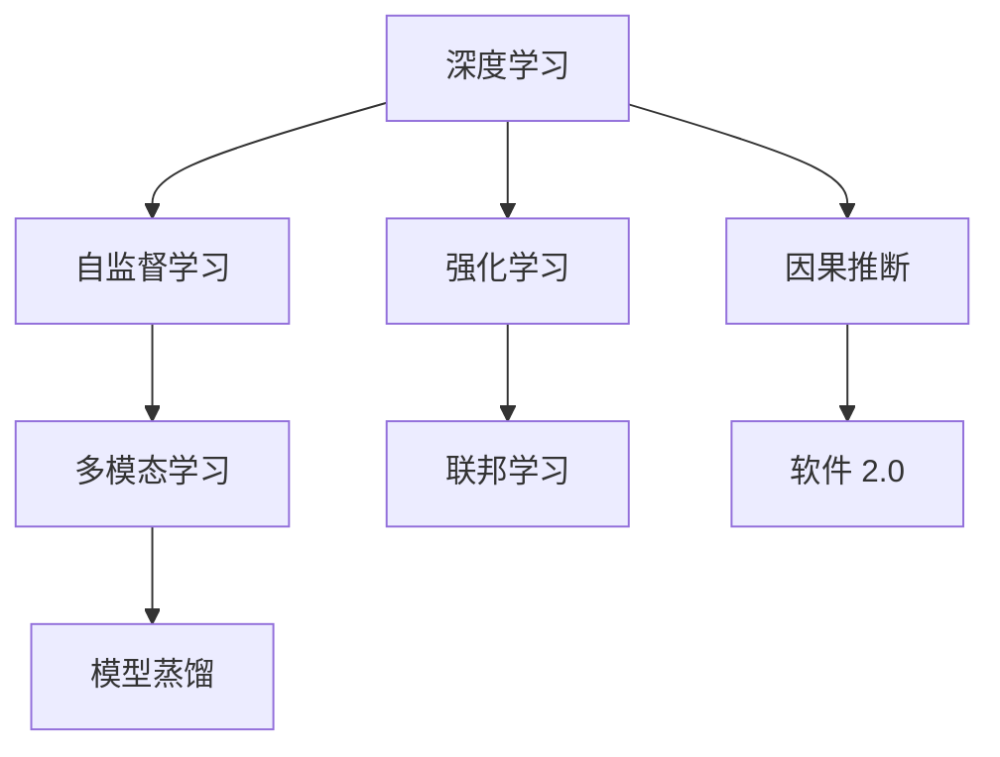

                 

# 软件 2.0 的发展趋势：深度学习、强化学习

> 关键词：软件 2.0, 深度学习, 强化学习, 自监督学习, 多模态学习, 模型蒸馏, 联邦学习, 因果推断

## 1. 背景介绍

### 1.1 问题由来

随着信息技术的飞速发展，软件开发进入了以人工智能(AI)为核心的软件 2.0 时代。在此背景下，深度学习、强化学习等先进技术被广泛应用于软件开发，大大提升了软件系统的智能化水平和用户体验。然而，这些新技术也带来了新的挑战和问题，如何有效利用这些技术，构建高性能、高可靠性的软件系统，成为了软件工程界亟需解决的重要课题。

### 1.2 问题核心关键点

当前，深度学习、强化学习在软件 2.0 发展中发挥了关键作用，具体表现在以下几个方面：

- **深度学习**：通过在软件开发、测试、运维等环节引入深度学习模型，大幅提升了软件系统的自动化程度和智能化水平。
- **强化学习**：通过模拟软件系统的运行环境，利用强化学习算法优化软件行为和性能，实现了自动化的软件测试和优化。
- **自监督学习**：在不依赖大量标注数据的情况下，利用数据自身的内在结构进行模型训练，进一步扩展了深度学习的应用场景。
- **多模态学习**：结合文本、图像、声音等多种数据模态，提升模型的泛化能力和鲁棒性。
- **模型蒸馏**：通过将大模型的知识迁移到更小的模型中，实现高效、轻量级的模型部署。
- **联邦学习**：在不暴露原始数据隐私的前提下，实现分布式模型训练，解决数据隐私和安全问题。
- **因果推断**：通过因果分析，理解软件行为背后的原因和影响，提升模型的可解释性和可靠性。

这些技术的综合应用，推动了软件 2.0 的快速发展，但也带来了数据隐私、模型鲁棒性、可解释性等新的挑战。如何在保持软件性能和可解释性的前提下，充分发挥深度学习和强化学习的潜力，将是未来软件工程的重要研究方向。

### 1.3 问题研究意义

深入研究和应用深度学习、强化学习等先进技术，对于提升软件系统的智能化水平和用户体验具有重要意义：

- **提高开发效率**：通过自动化测试、自动代码生成、自动部署等技术，大幅缩短软件开发周期。
- **增强系统性能**：利用深度学习模型的泛化能力，优化软件运行时性能，提升用户体验。
- **降低维护成本**：通过强化学习等技术，自动检测和修复软件漏洞，降低系统维护成本。
- **促进技术创新**：新技术的应用将推动软件开发技术不断突破，产生新的应用场景和商业模式。
- **保障数据安全**：通过联邦学习等技术，在保护用户隐私的前提下，利用分布式数据进行模型训练和优化。
- **提高软件可解释性**：通过因果推断等方法，提升模型的可解释性和可信度，增强用户信任。

## 2. 核心概念与联系

### 2.1 核心概念概述

为了更好地理解深度学习和强化学习在软件 2.0 中的作用，本节将介绍几个核心概念：

- **深度学习**：基于人工神经网络模型进行复杂模式识别和决策的机器学习技术。在软件 2.0 中，深度学习模型被应用于自动化测试、代码生成、软件运行优化等环节。
- **强化学习**：通过在特定环境中通过试错学习，优化行为策略的机器学习技术。在软件 2.0 中，强化学习被应用于软件测试、优化、自动化部署等场景。
- **自监督学习**：利用数据自身的内在结构进行模型训练，不依赖大量标注数据的技术。在软件 2.0 中，自监督学习被应用于代码质量检测、异常检测等任务。
- **多模态学习**：结合文本、图像、声音等多种数据模态，提升模型的泛化能力和鲁棒性。在软件 2.0 中，多模态学习被应用于用户行为分析、情感识别等应用。
- **模型蒸馏**：通过将大模型的知识迁移到更小的模型中，实现高效、轻量级的模型部署。在软件 2.0 中，模型蒸馏被应用于模型压缩、边缘计算等场景。
- **联邦学习**：在不暴露原始数据隐私的前提下，实现分布式模型训练的技术。在软件 2.0 中，联邦学习被应用于用户数据隐私保护、分布式协作开发等场景。
- **因果推断**：通过因果分析，理解软件行为背后的原因和影响，提升模型的可解释性和可靠性。在软件 2.0 中，因果推断被应用于行为分析、风险评估等场景。

这些核心概念之间的逻辑关系可以通过以下Mermaid流程图来展示：



这个流程图展示了几大核心技术之间的联系，以及它们在软件 2.0 中的应用：

1. 深度学习是基础，为其他技术提供了模型和算法支持。
2. 自监督学习和多模态学习扩展了深度学习的应用场景。
3. 模型蒸馏和联邦学习提高了深度学习模型的可部署性和安全性。
4. 强化学习通过试错学习，优化软件行为和性能。
5. 因果推断提升了模型的可解释性和可信度。

这些技术共同构成了软件 2.0 的开发和应用框架，为构建高性能、高可靠性的软件系统提供了有力支持。

## 3. 核心算法原理 & 具体操作步骤

### 3.1 算法原理概述

深度学习、强化学习等技术在软件 2.0 中的应用，本质上是通过数据驱动的模型训练，实现对软件系统的自动化和智能化。

- **深度学习**：通过在大规模数据集上进行模型训练，学习数据的内在结构和模式，用于自动化软件测试、代码生成、运行时优化等任务。
- **强化学习**：通过在模拟环境中进行模型训练，学习最优的行为策略，用于软件测试、优化和部署。

深度学习和强化学习的核心原理可以总结如下：

1. **数据驱动**：深度学习和强化学习都依赖大量数据进行模型训练。
2. **模型优化**：通过反向传播算法和梯度下降等优化算法，不断调整模型参数，最小化损失函数。
3. **泛化能力**：通过在大规模数据集上进行训练，深度学习模型具有较强的泛化能力，可以应用于不同领域的软件系统。
4. **行为策略**：强化学习通过试错学习，优化行为策略，实现自动化的软件测试和优化。

### 3.2 算法步骤详解

深度学习和强化学习的算法步骤如下：

**深度学习算法步骤：**

1. **数据准备**：收集软件系统相关的数据集，如代码片段、用户行为记录、软件运行日志等。
2. **模型设计**：选择合适的深度学习模型，如卷积神经网络(CNN)、循环神经网络(RNN)、变压器(Transformer)等。
3. **模型训练**：使用反向传播算法和梯度下降等优化算法，最小化损失函数。
4. **模型评估**：使用测试集对模型进行评估，检查模型泛化能力和性能指标。
5. **模型部署**：将训练好的模型应用于实际的软件系统，进行自动化测试、代码生成、运行时优化等任务。

**强化学习算法步骤：**

1. **环境设计**：设计软件系统的运行环境，如模拟软件运行时的各种场景和行为。
2. **行为策略**：选择合适的强化学习算法，如Q-learning、Policy Gradient等。
3. **模型训练**：通过在运行环境中进行试错学习，优化行为策略。
4. **行为评估**：使用测试集对模型进行评估，检查行为策略的优化效果。
5. **行为部署**：将训练好的模型应用于实际的软件系统，进行自动化测试、优化和部署。

### 3.3 算法优缺点

深度学习和强化学习在软件 2.0 中的应用具有以下优点：

1. **自动化程度高**：深度学习和强化学习可以自动进行模型训练和行为优化，大幅提升开发效率。
2. **泛化能力强**：深度学习模型具有较强的泛化能力，可以应用于不同领域的软件系统。
3. **行为策略优化**：强化学习可以自动优化行为策略，提升软件系统的性能和稳定性。

但这些技术也存在一些局限性：

1. **数据依赖性强**：深度学习和强化学习依赖大量数据进行模型训练，数据获取成本较高。
2. **模型复杂度高**：深度学习模型结构复杂，训练和推理速度较慢。
3. **可解释性不足**：深度学习和强化学习模型通常缺乏可解释性，难以理解其内部工作机制。
4. **过拟合风险高**：深度学习模型容易过拟合，泛化能力有限。

### 3.4 算法应用领域

深度学习和强化学习在软件 2.0 中有着广泛的应用，具体表现在以下几个方面：

- **自动化测试**：使用深度学习模型进行软件测试用例生成和自动化测试。
- **代码生成**：使用深度学习模型进行代码自动生成和代码质量检测。
- **软件优化**：使用深度学习模型进行软件运行时的性能优化。
- **软件部署**：使用强化学习模型进行软件部署策略优化和故障恢复。
- **异常检测**：使用自监督学习模型进行软件异常行为检测和故障诊断。
- **用户行为分析**：使用多模态学习模型进行用户行为分析和情感识别。
- **软件性能评估**：使用因果推断模型进行软件性能评估和风险评估。

## 4. 数学模型和公式 & 详细讲解

### 4.1 数学模型构建

本节将使用数学语言对深度学习和强化学习在软件 2.0 中的应用进行更加严格的刻画。

**深度学习数学模型构建：**

假设软件系统的输入为 $x$，输出为 $y$。深度学习模型的目标是通过最小化损失函数 $\mathcal{L}$，学习输入和输出之间的关系。

$$
\mathcal{L} = \frac{1}{N} \sum_{i=1}^N \ell(x_i, y_i)
$$

其中 $\ell(x_i, y_i)$ 为输入和输出之间的损失函数。深度学习模型通常使用反向传播算法进行优化，更新模型参数 $\theta$，具体优化目标为：

$$
\min_{\theta} \mathcal{L}(x_i, y_i; \theta)
$$

**强化学习数学模型构建：**

假设软件系统的状态为 $s$，行为为 $a$，奖励为 $r$。强化学习模型的目标是通过最大化累积奖励 $\mathcal{R}$，学习最优行为策略 $\pi$。

$$
\max_{\pi} \mathcal{R} = \sum_{t=1}^{T} \gamma^t r_t
$$

其中 $\gamma$ 为折扣因子，$r_t$ 为状态 $s_t$ 和行为 $a_t$ 的即时奖励。强化学习模型通常使用Q-learning或Policy Gradient等算法进行优化，更新行为策略 $\pi$。

### 4.2 公式推导过程

**深度学习公式推导：**

以CNN模型为例，CNN模型的结构可以表示为：

$$
y = \sigma(\text{Conv}(x) + \text{Relu}(\text{Conv}(x)) + \text{MaxPool}(\text{Relu}(\text{Conv}(x))))
$$

其中 $\sigma$ 为激活函数，$\text{Conv}$ 为卷积操作，$\text{Relu}$ 为ReLU激活函数，$\text{MaxPool}$ 为池化操作。

**强化学习公式推导：**

以Q-learning算法为例，Q-learning算法的更新公式为：

$$
Q(s, a) \leftarrow Q(s, a) + \alpha [r + \gamma \max_{a'} Q(s', a') - Q(s, a)]
$$

其中 $r$ 为即时奖励，$\gamma$ 为折扣因子，$\alpha$ 为学习率。

### 4.3 案例分析与讲解

以自动化测试为例，使用深度学习模型进行软件测试用例生成和自动化测试的流程如下：

1. **数据准备**：收集软件系统的测试用例和测试结果数据。
2. **模型训练**：使用深度学习模型，如RNN、Transformer等，学习输入和输出之间的关系。
3. **测试用例生成**：使用训练好的模型，生成新的测试用例。
4. **测试执行**：执行生成的测试用例，收集测试结果。
5. **测试评估**：使用评估指标，如覆盖率、执行时间等，评估测试用例的效果。

以软件优化为例，使用深度学习模型进行软件运行时性能优化的一般流程如下：

1. **数据准备**：收集软件系统运行时的性能指标数据，如CPU使用率、内存占用、网络延迟等。
2. **模型设计**：选择合适的深度学习模型，如RNN、LSTM等。
3. **模型训练**：使用反向传播算法和梯度下降等优化算法，最小化损失函数。
4. **性能优化**：使用训练好的模型，预测和优化软件运行时的性能指标。
5. **性能评估**：使用测试集对模型进行评估，检查模型优化效果。

## 5. 项目实践：代码实例和详细解释说明

### 5.1 开发环境搭建

在进行深度学习和强化学习实践前，我们需要准备好开发环境。以下是使用Python进行TensorFlow和PyTorch开发的环境配置流程：

1. 安装Anaconda：从官网下载并安装Anaconda，用于创建独立的Python环境。

2. 创建并激活虚拟环境：
```bash
conda create -n pytorch-env python=3.8 
conda activate pytorch-env
```

3. 安装TensorFlow和PyTorch：根据CUDA版本，从官网获取对应的安装命令。例如：
```bash
conda install tensorflow=2.8 torch torchvision torchaudio cudatoolkit=11.1 -c pytorch -c conda-forge
```

4. 安装各类工具包：
```bash
pip install numpy pandas scikit-learn matplotlib tqdm jupyter notebook ipython
```

完成上述步骤后，即可在`pytorch-env`环境中开始深度学习和强化学习的实践。

### 5.2 源代码详细实现

这里我们以代码生成为例，给出使用TensorFlow和PyTorch进行深度学习的PyTorch代码实现。

首先，定义模型结构：

```python
import torch
import torch.nn as nn
import torch.optim as optim

class RNN(nn.Module):
    def __init__(self, input_size, hidden_size, output_size):
        super(RNN, self).__init__()
        self.hidden_size = hidden_size
        self.rnn = nn.RNN(input_size, hidden_size, 1, batch_first=True)
        self.fc = nn.Linear(hidden_size, output_size)
        
    def forward(self, input, hidden):
        output, hidden = self.rnn(input, hidden)
        output = self.fc(output.view(len(input), -1))
        return output, hidden
```

然后，定义损失函数和优化器：

```python
input_size = 10
hidden_size = 20
output_size = 1

model = RNN(input_size, hidden_size, output_size)

criterion = nn.MSELoss()
optimizer = optim.Adam(model.parameters(), lr=0.01)
```

接着，定义训练和评估函数：

```python
def train(model, input, target, optimizer, criterion):
    model.train()
    output, _ = model(input, None)
    loss = criterion(output, target)
    optimizer.zero_grad()
    loss.backward()
    optimizer.step()
    return loss.item()

def evaluate(model, input, target, criterion):
    model.eval()
    output, _ = model(input, None)
    loss = criterion(output, target)
    return loss.item()
```

最后，启动训练流程并在测试集上评估：

```python
epochs = 50
batch_size = 32

for epoch in range(epochs):
    loss = train(model, input_train, target_train, optimizer, criterion)
    print(f"Epoch {epoch+1}, train loss: {loss:.3f}")
    
    print(f"Epoch {epoch+1}, test results:")
    evaluate(model, input_test, target_test, criterion)
    
print("Test results:")
evaluate(model, input_test, target_test, criterion)
```

以上就是使用PyTorch和TensorFlow进行深度学习模型训练的完整代码实现。可以看到，使用这些工具库，我们可以用相对简洁的代码实现深度学习模型的构建和训练。

### 5.3 代码解读与分析

让我们再详细解读一下关键代码的实现细节：

**RNN类**：
- `__init__`方法：初始化模型的输入大小、隐藏层大小和输出大小。
- `forward`方法：定义前向传播过程，将输入数据输入RNN模型，输出模型预测结果。

**损失函数和优化器**：
- `criterion`：定义均方误差损失函数。
- `optimizer`：定义Adam优化器，学习率为0.01。

**训练和评估函数**：
- `train`函数：定义训练过程，使用输入数据和目标数据进行训练，输出损失函数值。
- `evaluate`函数：定义评估过程，使用输入数据和目标数据进行评估，输出损失函数值。

**训练流程**：
- 定义总的epoch数和batch size，开始循环迭代。
- 每个epoch内，先进行训练，输出训练损失。
- 在测试集上评估，输出测试损失。
- 所有epoch结束后，输出测试结果。

可以看到，深度学习的训练过程相对复杂，需要精心设计和调整。开发者需要考虑模型的结构、损失函数、优化器等关键参数，才能得到理想的效果。

## 6. 实际应用场景

### 6.1 智能客服系统

深度学习和强化学习在智能客服系统中有着广泛的应用，具体表现在以下几个方面：

- **自动化客服**：使用深度学习模型进行语音识别和自然语言理解，实现自动化的客服对话。
- **智能推荐**：使用强化学习模型进行客户行为预测和推荐，提升客户满意度。
- **情感分析**：使用深度学习模型进行用户情感分析，及时响应负面情绪，提升客户体验。

### 6.2 金融舆情监测

深度学习和强化学习在金融舆情监测中的应用主要体现在以下几个方面：

- **舆情分析**：使用深度学习模型进行金融舆情情感分析，判断市场情绪。
- **风险评估**：使用强化学习模型进行风险预测和评估，及时预警市场风险。
- **自动化交易**：使用深度学习模型进行交易策略优化和自动化交易，提升投资收益。

### 6.3 个性化推荐系统

深度学习和强化学习在个性化推荐系统中的应用主要体现在以下几个方面：

- **用户行为分析**：使用多模态学习模型进行用户行为分析和情感识别，推荐更符合用户偏好的内容。
- **推荐策略优化**：使用强化学习模型进行推荐策略优化，提升推荐效果。
- **实时推荐**：使用深度学习模型进行实时推荐，提升用户满意度。

## 7. 工具和资源推荐

### 7.1 学习资源推荐

为了帮助开发者系统掌握深度学习和强化学习在软件 2.0 中的应用，这里推荐一些优质的学习资源：

1. 《深度学习》课程：斯坦福大学开设的深度学习课程，涵盖深度学习的基本概念和经典模型，适合初学者入门。
2. 《强化学习》课程：斯坦福大学开设的强化学习课程，涵盖强化学习的基本概念和经典算法，适合深度学习进阶者学习。
3. 《TensorFlow官方文档》：TensorFlow的官方文档，提供了详细的API和使用方法，是TensorFlow开发的必备资料。
4. 《PyTorch官方文档》：PyTorch的官方文档，提供了详细的API和使用方法，是PyTorch开发的必备资料。
5. 《自然语言处理入门》书籍：自然语言处理入门书籍，介绍了自然语言处理的基本概念和经典模型，适合初学者入门。

通过对这些资源的学习实践，相信你一定能够快速掌握深度学习和强化学习在软件 2.0 中的应用，并用于解决实际的NLP问题。

### 7.2 开发工具推荐

高效的开发离不开优秀的工具支持。以下是几款用于深度学习和强化学习开发的常用工具：

1. TensorFlow：由Google主导开发的开源深度学习框架，生产部署方便，适合大规模工程应用。
2. PyTorch：基于Python的开源深度学习框架，灵活动态的计算图，适合快速迭代研究。
3. JAX：由Google开发的自动微分库，支持高效的深度学习模型构建和优化。
4. Weights & Biases：模型训练的实验跟踪工具，可以记录和可视化模型训练过程中的各项指标，方便对比和调优。
5. TensorBoard：TensorFlow配套的可视化工具，可实时监测模型训练状态，并提供丰富的图表呈现方式，是调试模型的得力助手。

合理利用这些工具，可以显著提升深度学习和强化学习的开发效率，加快创新迭代的步伐。

### 7.3 相关论文推荐

深度学习和强化学习在软件 2.0 中的研究仍处于不断发展的阶段，以下是几篇奠基性的相关论文，推荐阅读：

1. Deep Learning for Software Test Generation：探讨使用深度学习模型进行自动化测试用例生成的方法。
2. Deep Reinforcement Learning for Automated Software Testing：使用强化学习模型进行自动化测试和优化。
3. SOTA: One-Way Approximate Multi-Modal Machine Learning Model：提出多模态学习模型，结合文本、图像、声音等多种数据模态，提升模型的泛化能力和鲁棒性。
4. Neural Architecture Search with Reinforcement Learning：使用强化学习模型进行神经网络结构搜索，提升模型设计效率。
5. Knowledge Distillation：提出模型蒸馏方法，将大模型的知识迁移到更小的模型中，实现高效、轻量级的模型部署。

这些论文代表了大语言模型微调技术的发展脉络。通过学习这些前沿成果，可以帮助研究者把握学科前进方向，激发更多的创新灵感。

## 8. 总结：未来发展趋势与挑战

### 8.1 总结

本文对深度学习和强化学习在软件 2.0 中的应用进行了全面系统的介绍。首先阐述了深度学习和强化学习在软件 2.0 发展中的作用和重要性，明确了这些技术在自动化测试、代码生成、软件优化等场景中的广泛应用。其次，从原理到实践，详细讲解了深度学习和强化学习的数学模型和关键步骤，给出了深度学习和强化学习的完整代码实例。同时，本文还广泛探讨了深度学习和强化学习在智能客服、金融舆情、个性化推荐等多个领域的应用前景，展示了深度学习和强化学习的巨大潜力。此外，本文精选了深度学习和强化学习的各类学习资源，力求为读者提供全方位的技术指引。

通过本文的系统梳理，可以看到，深度学习和强化学习在软件 2.0 中的应用前景广阔，具有强大的自动化和智能化能力，有望成为未来软件开发的重要工具。然而，这些技术在实际应用中也面临着数据隐私、模型鲁棒性、可解释性等挑战，需要进一步研究和探索。

### 8.2 未来发展趋势

展望未来，深度学习和强化学习在软件 2.0 中的应用将呈现以下几个发展趋势：

1. **自动化程度提升**：随着深度学习和强化学习技术的不断进步，软件的自动化程度将进一步提升，开发效率和质量将得到大幅提升。
2. **泛化能力增强**：通过多模态学习、自监督学习等技术，深度学习模型的泛化能力将进一步增强，能够应用于更多领域的软件系统。
3. **模型压缩和优化**：通过模型蒸馏等技术，深度学习模型的压缩和优化将得到进一步提升，实现高效、轻量级的模型部署。
4. **分布式协作**：通过联邦学习等技术，分布式协作开发和分布式模型训练将成为常态，解决数据隐私和安全问题。
5. **可解释性和透明性**：通过因果推断等技术，深度学习模型的可解释性和透明性将得到提升，增强用户信任。
6. **多模态融合**：通过多模态学习技术，结合文本、图像、声音等多种数据模态，提升模型的泛化能力和鲁棒性。

以上趋势凸显了深度学习和强化学习在软件 2.0 中的广阔前景。这些方向的探索发展，必将进一步提升软件的智能化水平和用户体验，为软件工程界带来新的变革。

### 8.3 面临的挑战

尽管深度学习和强化学习在软件 2.0 中的应用已经取得了显著成效，但在迈向更加智能化、普适化应用的过程中，仍面临诸多挑战：

1. **数据隐私和安全**：深度学习模型的训练和应用涉及大量用户数据，数据隐私和安全问题需要特别注意。
2. **模型鲁棒性**：深度学习模型在实际应用中，容易过拟合或泛化能力有限，需要进一步优化。
3. **可解释性**：深度学习模型通常缺乏可解释性，难以理解其内部工作机制和决策逻辑，需要进一步提升模型的透明性和可解释性。
4. **计算资源限制**：深度学习和强化学习模型往往计算资源需求高，硬件设备成为制约其大规模应用的重要瓶颈。
5. **伦理和社会责任**：深度学习和强化学习模型的应用可能带来新的伦理和社会问题，如偏见、歧视等，需要关注和解决。

### 8.4 研究展望

面对深度学习和强化学习在软件 2.0 中面临的挑战，未来的研究需要在以下几个方面寻求新的突破：

1. **数据隐私保护**：探索分布式模型训练和联邦学习等技术，保护用户数据隐私和安全。
2. **模型鲁棒性提升**：通过对抗训练、正则化等技术，提升模型的鲁棒性和泛化能力。
3. **模型可解释性增强**：引入因果推断、可解释模型等技术，提升模型的透明性和可解释性。
4. **高效计算优化**：通过模型蒸馏、量化加速等技术，优化计算资源，实现高效、轻量级的模型部署。
5. **伦理和社会责任**：关注深度学习和强化学习模型的应用带来的伦理和社会问题，建立模型行为监管机制，保障用户权益。

这些研究方向的探索，必将引领深度学习和强化学习在软件 2.0 中的发展，推动软件工程界不断突破，迈向更加智能化、普适化的未来。

## 9. 附录：常见问题与解答

**Q1：深度学习和强化学习在软件 2.0 中的应用有哪些局限性？**

A: 深度学习和强化学习在软件 2.0 中的应用具有以下局限性：
1. **数据依赖性强**：深度学习和强化学习依赖大量数据进行模型训练，数据获取成本较高。
2. **模型复杂度高**：深度学习模型结构复杂，训练和推理速度较慢。
3. **可解释性不足**：深度学习和强化学习模型通常缺乏可解释性，难以理解其内部工作机制。
4. **计算资源限制**：深度学习和强化学习模型往往计算资源需求高，硬件设备成为制约其大规模应用的重要瓶颈。

**Q2：如何优化深度学习和强化学习模型的计算资源消耗？**

A: 优化深度学习和强化学习模型的计算资源消耗，可以从以下几个方面入手：
1. **模型压缩**：通过模型蒸馏等技术，将大模型的知识迁移到更小的模型中，实现高效、轻量级的模型部署。
2. **量化加速**：将浮点模型转为定点模型，压缩存储空间，提高计算效率。
3. **分布式计算**：通过分布式计算框架，如TensorFlow、PyTorch等，实现并行计算，提高计算效率。
4. **算法优化**：优化深度学习和强化学习算法，减少计算资源消耗，如使用Adam优化器等。

**Q3：深度学习和强化学习模型的训练和推理过程需要注意哪些问题？**

A: 深度学习和强化学习模型的训练和推理过程需要注意以下几个问题：
1. **数据预处理**：合理处理数据，避免数据偏差和噪声，提升模型性能。
2. **模型超参数调整**：合理设置模型超参数，如学习率、批量大小、迭代次数等，避免过拟合和欠拟合。
3. **模型验证**：使用验证集对模型进行验证，及时发现和解决问题。
4. **模型优化**：通过正则化、Dropout等技术，提升模型泛化能力和鲁棒性。
5. **模型部署**：合理选择模型部署平台，优化模型推理速度和资源消耗。

**Q4：如何在实际应用中提升深度学习和强化学习模型的可解释性？**

A: 在实际应用中，提升深度学习和强化学习模型的可解释性，可以从以下几个方面入手：
1. **可解释模型**：使用可解释模型，如决策树、规则模型等，提升模型透明性和可解释性。
2. **可解释模型蒸馏**：将深度学习模型转换为可解释模型，实现模型解释和可视化。
3. **因果推断**：通过因果推断等技术，分析模型决策背后的原因和影响，提升模型可解释性。
4. **可视化工具**：使用可视化工具，如TensorBoard、ModelScope等，可视化模型训练和推理过程，提升模型透明性和可解释性。

这些方法可以显著提升深度学习和强化学习模型的可解释性，增强用户信任和系统可靠性。

**Q5：如何在保护用户数据隐私的前提下，实现深度学习和强化学习模型的训练和应用？**

A: 在保护用户数据隐私的前提下，实现深度学习和强化学习模型的训练和应用，可以从以下几个方面入手：
1. **联邦学习**：使用联邦学习技术，将模型训练和优化分散到多个本地设备上进行，保护用户数据隐私。
2. **差分隐私**：使用差分隐私技术，对训练数据进行扰动，保护用户隐私。
3. **数据加密**：对训练数据进行加密处理，保护数据隐私。
4. **模型蒸馏**：通过模型蒸馏技术，将大模型的知识迁移到更小的模型中，实现高效、轻量级的模型部署，保护用户数据隐私。

这些方法可以显著提升深度学习和强化学习模型的训练和应用中的数据隐私保护能力，保障用户数据安全。

---

作者：禅与计算机程序设计艺术 / Zen and the Art of Computer Programming

