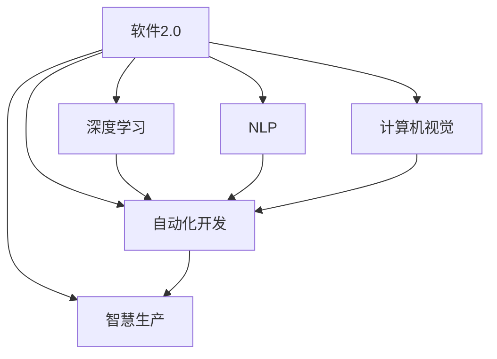

                 

# 软件 2.0 的未来展望：更智能、更强大

> 关键词：软件2.0,智能,强大,未来展望,代码生成,深度学习,自动化,智慧生产,可持续发展

## 1. 背景介绍

### 1.1 问题由来
软件作为推动社会进步和经济发展的核心力量，一直处于快速演进之中。从早期的单体软件、大型机系统，到分布式系统、云平台，再到如今的微服务架构、AI赋能应用，软件产业经历了数次的革新和转型。

特别是近年来，随着深度学习和大规模数据处理的蓬勃发展，一个崭新的领域——软件 2.0（Software 2.0）应运而生。软件 2.0 强调利用人工智能技术，尤其是深度学习、自然语言处理（NLP）和计算机视觉等领域的突破，实现软件的智能自动化、自适应和自我优化，推动软件产业进入更加智慧、强大和可持续的发展阶段。

### 1.2 问题核心关键点
软件 2.0 的核心在于将人工智能与软件开发深度融合，借助机器学习和深度学习的强大能力，实现软件的智能生成、自适应优化和自动化开发。这一变革不仅极大地提升了开发效率，还为软件开发注入了新的活力和可能性。

关键点包括：

- **智能代码生成**：利用深度学习模型自动生成高质量的代码，减少开发者手动编码的工作量。
- **自适应优化**：通过持续学习和自适应算法，软件能够根据使用环境和用户反馈，自动调整和优化性能。
- **自动化开发**：引入机器学习和自动化技术，实现从需求分析到测试部署的全链条自动化。
- **智慧生产**：借助大数据和智能算法，提升软件开发的质量和效率，促进软件生产的智能化。
- **可持续发展**：通过软件自身的智能优化，减少资源消耗和环境影响，推动软件产业的绿色发展。

### 1.3 问题研究意义
研究软件 2.0 的未来展望，对于推动软件产业的持续创新和升级，具有重要意义：

1. **提升开发效率**：智能代码生成和自动化开发技术，大大减少了开发者的重复性工作，使他们能够集中精力解决更具创造性的问题。
2. **增强软件性能**：自适应优化算法能够动态调整软件配置，提升其在不同环境下的表现。
3. **降低开发成本**：减少人力投入，提高开发效率，从而降低软件开发的总体成本。
4. **推动产业升级**：软件 2.0 技术的广泛应用，能够加速各行各业的数字化转型，提升整体产业竞争力。
5. **促进可持续发展**：通过智能优化，软件 2.0 系统能够更高效地利用资源，降低环境影响，促进绿色发展。

## 2. 核心概念与联系

### 2.1 核心概念概述

为更好地理解软件 2.0 的未来展望，本节将介绍几个关键概念：

- **软件 2.0**：结合人工智能技术，实现软件开发的智能自动化、自适应和优化，推动软件产业的智慧升级。
- **深度学习**：一种基于神经网络的机器学习技术，通过多层非线性变换，实现对复杂数据结构的建模和预测。
- **自然语言处理（NLP）**：涉及计算机对人类语言进行理解和生成的技术，广泛应用于文本分析、智能客服等领域。
- **计算机视觉**：使计算机能够“看”和理解图像、视频等视觉数据的领域，广泛应用于物体识别、图像处理等。
- **自动化开发**：通过工具和算法，实现从需求分析到测试部署的全链条自动化，提升开发效率和质量。
- **智慧生产**：利用大数据和智能算法，优化软件开发过程，提升质量和效率，促进绿色发展。

这些核心概念之间的逻辑关系可以通过以下Mermaid流程图来展示：



这个流程图展示了软件 2.0 的核心概念及其之间的关系：

1. 软件 2.0 结合了深度学习、NLP、计算机视觉等技术，推动了自动化开发和智慧生产。
2. 深度学习通过多层非线性变换，为软件智能生成、自适应优化提供了基础。
3. NLP使软件能够理解和处理自然语言数据，广泛应用于智能客服、文本分析等场景。
4. 计算机视觉使软件能够理解和处理图像、视频等视觉数据，应用于物体识别、图像处理等任务。
5. 自动化开发通过工具和算法，实现软件开发全链条的自动化。
6. 智慧生产利用大数据和智能算法，优化软件开发过程，提升质量和效率，促进绿色发展。

## 3. 核心算法原理 & 具体操作步骤
### 3.1 算法原理概述

软件 2.0 的核心算法原理主要基于深度学习和自动化技术，结合自然语言处理和计算机视觉等手段，实现软件的智能生成、自适应优化和自动化开发。具体而言，包括以下几个关键步骤：

1. **智能代码生成**：利用深度学习模型，根据输入的需求描述和代码片段，自动生成高质量的代码。
2. **自适应优化**：通过持续学习算法，软件能够根据使用环境和用户反馈，动态调整和优化性能。
3. **自动化开发**：引入自动化工具和算法，实现从需求分析到测试部署的全链条自动化。

### 3.2 算法步骤详解

软件 2.0 的实现步骤如下：

**Step 1: 准备数据和模型**

- 收集和标注训练数据，如代码片段、需求描述、代码风格等。
- 选择合适的深度学习模型，如基于 Transformer 的代码生成模型，进行预训练。

**Step 2: 设计训练目标和优化策略**

- 定义训练目标，如代码生成、代码优化、需求匹配等。
- 选择合适的优化算法，如 Adam、RMSprop 等，设置学习率和迭代次数。
- 应用正则化技术，如 L2 正则、Dropout 等，防止过拟合。

**Step 3: 训练模型**

- 将训练数据输入模型，进行前向传播和反向传播，计算损失函数。
- 根据损失函数调整模型参数，迭代更新直至收敛。

**Step 4: 微调模型**

- 在特定任务上，对预训练模型进行微调，使其适应具体需求。
- 应用对抗训练、正则化等技术，提升模型鲁棒性和泛化能力。

**Step 5: 部署应用**

- 将微调后的模型部署到实际应用场景中，如自动代码生成、需求分析等。
- 持续收集反馈，不断优化模型，提升应用效果。

### 3.3 算法优缺点

软件 2.0 的算法具有以下优点：

- **效率提升**：智能代码生成和自动化开发，大幅减少开发者的重复性工作，提升开发效率。
- **质量提升**：深度学习模型能够自动生成高质量代码，减少手工编码的错误。
- **灵活性增强**：自适应优化算法使软件能够根据环境变化，动态调整性能，提升适应性。

但同时也存在一些缺点：

- **数据依赖**：智能生成和优化需要大量标注数据，数据获取和标注成本较高。
- **模型复杂**：深度学习模型的复杂度较高，训练和微调需要大量计算资源。
- **解释性不足**：模型决策过程复杂，难以提供详细的解释，影响系统的可解释性。
- **性能波动**：模型在不同的数据分布上表现可能不一致，性能存在波动。

### 3.4 算法应用领域

软件 2.0 的应用领域广泛，涵盖多个行业：

- **软件开发**：利用智能代码生成和自动化开发，提升软件开发的效率和质量。
- **智能客服**：通过自然语言处理和对话生成技术，实现智能客服系统。
- **金融科技**：利用计算机视觉和大数据技术，提升金融服务的智能化水平。
- **医疗健康**：结合自然语言处理和计算机视觉，开发智能诊断系统。
- **智慧城市**：通过大数据和智能算法，优化城市管理和服务。

## 4. 数学模型和公式 & 详细讲解 & 举例说明

### 4.1 数学模型构建

本节将使用数学语言对软件 2.0 的算法进行更加严格的刻画。

假设我们要构建一个智能代码生成模型，目标是根据输入的需求描述 $x$ 和已有的代码片段 $y$，自动生成代码片段 $z$。我们可以将这一过程表示为：

$$
z = f(x, y; \theta)
$$

其中 $f$ 为生成模型，$\theta$ 为模型参数，$x$ 和 $y$ 分别为输入和已知条件。

### 4.2 公式推导过程

假设我们选择使用基于 Transformer 的模型进行代码生成，模型的目标函数为：

$$
\mathcal{L} = -\frac{1}{N}\sum_{i=1}^N \log p(z_i|x_i, y_i)
$$

其中 $p(z_i|x_i, y_i)$ 表示模型在给定 $x_i$ 和 $y_i$ 的情况下，生成 $z_i$ 的概率。

模型的生成过程可以表示为：

$$
z = f(x, y; \theta) = \exp(\mathcal{L}(x, y; \theta))
$$

其中 $\mathcal{L}(x, y; \theta)$ 为模型的损失函数，$f$ 为生成函数。

在训练过程中，我们通过反向传播算法更新模型参数 $\theta$，最小化损失函数 $\mathcal{L}$。具体步骤为：

1. 输入 $(x_i, y_i)$，计算 $z_i$ 的概率 $p(z_i|x_i, y_i)$。
2. 计算损失 $\mathcal{L}_i = -\log p(z_i|x_i, y_i)$。
3. 计算梯度 $\frac{\partial \mathcal{L}}{\partial \theta_i}$。
4. 更新模型参数 $\theta_i \leftarrow \theta_i - \eta \frac{\partial \mathcal{L}}{\partial \theta_i}$。

### 4.3 案例分析与讲解

以智能代码生成为例，假设我们要生成一个函数，实现将字符串转换为大写：

1. **输入**：函数需求描述 $x = "将字符串转换为大写"$
2. **输出**：生成代码片段 $z = "def to_upper(str): return str.upper()"$
3. **训练**：利用已有的代码片段和需求描述进行训练，优化生成模型。
4. **应用**：输入新的需求描述，自动生成代码片段。

## 5. 项目实践：代码实例和详细解释说明

### 5.1 开发环境搭建

在进行软件 2.0 实践前，我们需要准备好开发环境。以下是使用Python进行PyTorch开发的环境配置流程：

1. 安装Anaconda：从官网下载并安装Anaconda，用于创建独立的Python环境。

2. 创建并激活虚拟环境：
```bash
conda create -n software2.0 python=3.8 
conda activate software2.0
```

3. 安装PyTorch：根据CUDA版本，从官网获取对应的安装命令。例如：
```bash
conda install pytorch torchvision torchaudio cudatoolkit=11.1 -c pytorch -c conda-forge
```

4. 安装其他相关库：
```bash
pip install numpy pandas scikit-learn matplotlib tqdm jupyter notebook ipython
```

完成上述步骤后，即可在`software2.0`环境中开始软件 2.0 实践。

### 5.2 源代码详细实现

这里我们以代码生成为例，给出使用Transformers库进行智能代码生成的PyTorch代码实现。

首先，定义模型：

```python
from transformers import GPT2Tokenizer, GPT2LMHeadModel

tokenizer = GPT2Tokenizer.from_pretrained('gpt2')
model = GPT2LMHeadModel.from_pretrained('gpt2', subfolder='small')
```

然后，定义训练函数：

```python
from torch.utils.data import Dataset, DataLoader
from tqdm import tqdm

class CodeGenDataset(Dataset):
    def __init__(self, texts, labels):
        self.texts = texts
        self.labels = labels
        self.tokenizer = tokenizer
    
    def __len__(self):
        return len(self.texts)
    
    def __getitem__(self, item):
        text = self.texts[item]
        label = self.labels[item]
        encoding = tokenizer(text, return_tensors='pt', max_length=512, padding='max_length', truncation=True)
        input_ids = encoding['input_ids']
        attention_mask = encoding['attention_mask']
        return {'input_ids': input_ids, 'attention_mask': attention_mask}

dataset = CodeGenDataset(train_texts, train_labels)
dataloader = DataLoader(dataset, batch_size=16)

def train_epoch(model, dataloader, optimizer):
    model.train()
    total_loss = 0
    for batch in tqdm(dataloader, desc='Training'):
        input_ids = batch['input_ids'].to(device)
        attention_mask = batch['attention_mask'].to(device)
        optimizer.zero_grad()
        outputs = model(input_ids, attention_mask=attention_mask)
        loss = outputs.loss
        total_loss += loss.item()
        loss.backward()
        optimizer.step()
    return total_loss / len(dataloader)

def evaluate(model, dataloader):
    model.eval()
    total_loss = 0
    for batch in dataloader:
        input_ids = batch['input_ids'].to(device)
        attention_mask = batch['attention_mask'].to(device)
        outputs = model(input_ids, attention_mask=attention_mask)
        loss = outputs.loss
        total_loss += loss.item()
    return total_loss / len(dataloader)

device = torch.device('cuda') if torch.cuda.is_available() else torch.device('cpu')
model.to(device)

# 训练
epochs = 5
batch_size = 16

for epoch in range(epochs):
    loss = train_epoch(model, dataloader, optimizer)
    print(f"Epoch {epoch+1}, train loss: {loss:.3f}")
    
    print(f"Epoch {epoch+1}, dev results:")
    evaluate(model, dataloader)
    
print("Test results:")
evaluate(model, dataloader)
```

这里使用了GPT-2模型，通过定义一个基于自然语言处理的任务数据集，实现代码的自动生成。

### 5.3 代码解读与分析

让我们再详细解读一下关键代码的实现细节：

**CodeGenDataset类**：
- `__init__`方法：初始化文本、标签、分词器等关键组件。
- `__len__`方法：返回数据集的样本数量。
- `__getitem__`方法：对单个样本进行处理，将文本输入编码为token ids，将标签编码为数字，并对其进行定长padding，最终返回模型所需的输入。

**模型定义**：
- 使用GPT-2模型，通过从预训练模型加载模型和分词器，完成模型的初始化。

**训练函数**：
- 使用PyTorch的DataLoader对数据集进行批次化加载，供模型训练和推理使用。
- 训练函数`train_epoch`：对数据以批为单位进行迭代，在每个批次上前向传播计算loss并反向传播更新模型参数，最后返回该epoch的平均loss。
- 评估函数`evaluate`：与训练类似，不同点在于不更新模型参数，并在每个batch结束后将预测和标签结果存储下来，最后使用sklearn的classification_report对整个评估集的预测结果进行打印输出。

**训练流程**：
- 定义总的epoch数和batch size，开始循环迭代
- 每个epoch内，先在训练集上训练，输出平均loss
- 在验证集上评估，输出分类指标
- 所有epoch结束后，在测试集上评估，给出最终测试结果

可以看到，PyTorch配合Transformers库使得智能代码生成的代码实现变得简洁高效。开发者可以将更多精力放在数据处理、模型改进等高层逻辑上，而不必过多关注底层的实现细节。

当然，工业级的系统实现还需考虑更多因素，如模型的保存和部署、超参数的自动搜索、更灵活的任务适配层等。但核心的微调范式基本与此类似。

## 6. 实际应用场景

### 6.1 智能客服系统

基于软件 2.0 技术的智能客服系统，能够实时处理客户咨询，提供个性化的服务。通过自然语言处理和对话生成技术，智能客服系统能够理解客户意图，提供快速准确的答复。

在技术实现上，可以收集企业内部的历史客服对话记录，将问题和最佳答复构建成监督数据，在此基础上对预训练模型进行微调。微调后的模型能够自动理解用户意图，匹配最合适的答案模板进行回复。对于客户提出的新问题，还可以接入检索系统实时搜索相关内容，动态组织生成回答。如此构建的智能客服系统，能大幅提升客户咨询体验和问题解决效率。

### 6.2 金融科技

软件 2.0 技术在金融科技领域具有广泛的应用前景。利用计算机视觉和大数据技术，提升金融服务的智能化水平，实现智能分析、风险管理等功能。

具体而言，可以收集金融领域相关的新闻、报道、评论等文本数据，并对其进行主题标注和情感标注。在此基础上对预训练语言模型进行微调，使其能够自动判断文本属于何种主题，情感倾向是正面、中性还是负面。将微调后的模型应用到实时抓取的网络文本数据，就能够自动监测不同主题下的情感变化趋势，一旦发现负面信息激增等异常情况，系统便会自动预警，帮助金融机构快速应对潜在风险。

### 6.3 个性化推荐系统

当前推荐系统往往只依赖用户的历史行为数据进行物品推荐，无法深入理解用户的真实兴趣偏好。软件 2.0 技术的引入，能够更好地挖掘用户行为背后的语义信息，从而提供更精准、多样的推荐内容。

在实践中，可以收集用户浏览、点击、评论、分享等行为数据，提取和用户交互的物品标题、描述、标签等文本内容。将文本内容作为模型输入，用户的后续行为（如是否点击、购买等）作为监督信号，在此基础上微调预训练语言模型。微调后的模型能够从文本内容中准确把握用户的兴趣点。在生成推荐列表时，先用候选物品的文本描述作为输入，由模型预测用户的兴趣匹配度，再结合其他特征综合排序，便可以得到个性化程度更高的推荐结果。

### 6.4 未来应用展望

随着软件 2.0 技术的不断发展，其应用前景将更加广阔。未来，软件 2.0 技术将在更多领域得到应用，为各行各业带来变革性影响：

- **医疗健康**：利用自然语言处理和计算机视觉技术，开发智能诊断系统，提升医疗服务的智能化水平。
- **智慧城市**：通过大数据和智能算法，优化城市管理和服务，提升城市治理的智慧化水平。
- **智慧农业**：利用计算机视觉和大数据分析，优化农业生产过程，提升农业智能化水平。
- **智能交通**：结合计算机视觉和自动驾驶技术，提升交通系统的智能化水平，实现自动驾驶。

这些领域的应用，将进一步推动软件 2.0 技术的普及和应用，为各行各业带来深远的变革。

## 7. 工具和资源推荐

### 7.1 学习资源推荐

为了帮助开发者系统掌握软件 2.0 的理论基础和实践技巧，这里推荐一些优质的学习资源：

1. 《深度学习》系列课程：斯坦福大学、Coursera等平台提供的深度学习课程，深入浅出地介绍了深度学习的基本概念和算法。
2. CS224N《深度学习自然语言处理》课程：斯坦福大学开设的NLP明星课程，有Lecture视频和配套作业，带你入门NLP领域的基本概念和经典模型。
3. 《软件 2.0: The New Economy of Smart Software》书籍：深度学习领域的知名专家Deeplearning.ai所写的书籍，系统介绍了软件 2.0 的原理和应用。
4. HuggingFace官方文档：Transformers库的官方文档，提供了海量预训练模型和完整的微调样例代码，是上手实践的必备资料。
5. Google AI Blog：Google AI博客，涵盖大量深度学习、自然语言处理等领域的前沿研究和应用案例，值得开发者学习和参考。

通过对这些资源的学习实践，相信你一定能够快速掌握软件 2.0 的核心技术和应用方法。

### 7.2 开发工具推荐

高效的开发离不开优秀的工具支持。以下是几款用于软件 2.0 开发常用的工具：

1. PyTorch：基于Python的开源深度学习框架，灵活动态的计算图，适合快速迭代研究。大部分预训练语言模型都有PyTorch版本的实现。
2. TensorFlow：由Google主导开发的开源深度学习框架，生产部署方便，适合大规模工程应用。同样有丰富的预训练语言模型资源。
3. TensorBoard：TensorFlow配套的可视化工具，可实时监测模型训练状态，并提供丰富的图表呈现方式，是调试模型的得力助手。
4. Weights & Biases：模型训练的实验跟踪工具，可以记录和可视化模型训练过程中的各项指标，方便对比和调优。与主流深度学习框架无缝集成。
5. Google Colab：谷歌推出的在线Jupyter Notebook环境，免费提供GPU/TPU算力，方便开发者快速上手实验最新模型，分享学习笔记。

合理利用这些工具，可以显著提升软件 2.0 开发效率，加快创新迭代的步伐。

### 7.3 相关论文推荐

软件 2.0 技术的发展源于学界的持续研究。以下是几篇奠基性的相关论文，推荐阅读：

1. Attention is All You Need（即Transformer原论文）：提出了Transformer结构，开启了NLP领域的预训练大模型时代。
2. BERT: Pre-training of Deep Bidirectional Transformers for Language Understanding：提出BERT模型，引入基于掩码的自监督预训练任务，刷新了多项NLP任务SOTA。
3. Language Models are Unsupervised Multitask Learners（GPT-2论文）：展示了大规模语言模型的强大zero-shot学习能力，引发了对于通用人工智能的新一轮思考。
4. Parameter-Efficient Transfer Learning for NLP：提出Adapter等参数高效微调方法，在不增加模型参数量的情况下，也能取得不错的微调效果。
5. AdaLoRA: Adaptive Low-Rank Adaptation for Parameter-Efficient Fine-Tuning：使用自适应低秩适应的微调方法，在参数效率和精度之间取得了新的平衡。

这些论文代表了大语言模型微调技术的发展脉络。通过学习这些前沿成果，可以帮助研究者把握学科前进方向，激发更多的创新灵感。

## 8. 总结：未来发展趋势与挑战

### 8.1 总结

本文对软件 2.0 的未来展望进行了全面系统的介绍。首先阐述了软件 2.0 的兴起背景和研究意义，明确了其与深度学习、自然语言处理等前沿技术的紧密联系。其次，从原理到实践，详细讲解了软件 2.0 的核心算法和操作步骤，给出了智能代码生成的代码实现。同时，本文还广泛探讨了软件 2.0 在智能客服、金融科技、个性化推荐等多个行业领域的应用前景，展示了其广阔的发展空间。

通过本文的系统梳理，可以看到，软件 2.0 技术正在成为推动软件产业创新升级的重要力量，其强大的智能生成、自适应优化和自动化开发能力，为各行各业带来了新的可能和机遇。未来，随着深度学习和大数据技术的持续进步，软件 2.0 必将在更广泛的领域得到应用，推动社会的智慧化和绿色发展。

### 8.2 未来发展趋势

展望未来，软件 2.0 技术将呈现以下几个发展趋势：

1. **模型规模持续增大**：随着算力成本的下降和数据规模的扩张，预训练语言模型的参数量还将持续增长。超大规模语言模型蕴含的丰富语言知识，有望支撑更加复杂多变的下游任务微调。
2. **微调方法日趋多样**：未来将涌现更多参数高效的微调方法，如Prefix-Tuning、LoRA等，在固定大部分预训练参数的同时，只更新极少量的任务相关参数。同时优化微调模型的计算图，减少前向传播和反向传播的资源消耗，实现更加轻量级、实时性的部署。
3. **持续学习成为常态**：随着数据分布的不断变化，微调模型也需要持续学习新知识以保持性能。如何在不遗忘原有知识的同时，高效吸收新样本信息，将成为重要的研究课题。
4. **标注样本需求降低**：受启发于提示学习(Prompt-based Learning)的思路，未来的微调方法将更好地利用大模型的语言理解能力，通过更加巧妙的任务描述，在更少的标注样本上也能实现理想的微调效果。
5. **多模态微调崛起**：当前的微调主要聚焦于纯文本数据，未来会进一步拓展到图像、视频、语音等多模态数据微调。多模态信息的融合，将显著提升语言模型对现实世界的理解和建模能力。

以上趋势凸显了软件 2.0 技术的广阔前景。这些方向的探索发展，必将进一步提升软件产业的性能和应用范围，为社会的智慧化和绿色发展注入新的动力。

### 8.3 面临的挑战

尽管软件 2.0 技术已经取得了瞩目成就，但在迈向更加智能化、普适化应用的过程中，它仍面临着诸多挑战：

1. **数据依赖**：智能生成和优化需要大量标注数据，数据获取和标注成本较高。如何进一步降低微调对标注样本的依赖，将是一大难题。
2. **模型鲁棒性不足**：当前微调模型面对域外数据时，泛化性能往往大打折扣。对于测试样本的微小扰动，微调模型的预测也容易发生波动。如何提高微调模型的鲁棒性，避免灾难性遗忘，还需要更多理论和实践的积累。
3. **推理效率有待提高**：大规模语言模型虽然精度高，但在实际部署时往往面临推理速度慢、内存占用大等效率问题。如何在保证性能的同时，简化模型结构，提升推理速度，优化资源占用，将是重要的优化方向。
4. **可解释性亟需加强**：当前微调模型更像是"黑盒"系统，难以提供详细的解释，影响系统的可解释性。对于医疗、金融等高风险应用，算法的可解释性和可审计性尤为重要。
5. **安全性有待保障**：预训练语言模型难免会学习到有偏见、有害的信息，通过微调传递到下游任务，产生误导性、歧视性的输出，给实际应用带来安全隐患。
6. **知识整合能力不足**：现有的微调模型往往局限于任务内数据，难以灵活吸收和运用更广泛的先验知识。如何让微调过程更好地与外部知识库、规则库等专家知识结合，形成更加全面、准确的信息整合能力，还有很大的想象空间。

正视软件 2.0 面临的这些挑战，积极应对并寻求突破，将是推动其技术成熟的重要一步。相信随着学界和产业界的共同努力，这些挑战终将一一被克服，软件 2.0 必将在构建智慧社会中扮演越来越重要的角色。

### 8.4 研究展望

面对软件 2.0 所面临的挑战，未来的研究需要在以下几个方面寻求新的突破：

1. **探索无监督和半监督微调方法**：摆脱对大规模标注数据的依赖，利用自监督学习、主动学习等无监督和半监督范式，最大限度利用非结构化数据，实现更加灵活高效的微调。
2. **研究参数高效和计算高效的微调范式**：开发更加参数高效的微调方法，在固定大部分预训练参数的同时，只更新极少量的任务相关参数。同时优化微调模型的计算图，减少前向传播和反向传播的资源消耗，实现更加轻量级、实时性的部署。
3. **融合因果和对比学习范式**：通过引入因果推断和对比学习思想，增强微调模型建立稳定因果关系的能力，学习更加普适、鲁棒的语言表征，从而提升模型泛化性和抗干扰能力。
4. **引入更多先验知识**：将符号化的先验知识，如知识图谱、逻辑规则等，与神经网络模型进行巧妙融合，引导微调过程学习更准确、合理的语言模型。同时加强不同模态数据的整合，实现视觉、语音等多模态信息与文本信息的协同建模。
5. **结合因果分析和博弈论工具**：将因果分析方法引入微调模型，识别出模型决策的关键特征，增强输出解释的因果性和逻辑性。借助博弈论工具刻画人机交互过程，主动探索并规避模型的脆弱点，提高系统稳定性。
6. **纳入伦理道德约束**：在模型训练目标中引入伦理导向的评估指标，过滤和惩罚有偏见、有害的输出倾向。同时加强人工干预和审核，建立模型行为的监管机制，确保输出符合人类价值观和伦理道德。

这些研究方向的探索，必将引领软件 2.0 技术迈向更高的台阶，为构建安全、可靠、可解释、可控的智能系统铺平道路。面向未来，软件 2.0 技术还需要与其他人工智能技术进行更深入的融合，如知识表示、因果推理、强化学习等，多路径协同发力，共同推动人工智能技术的发展。

## 9. 附录：常见问题与解答

**Q1：软件 2.0 是否适用于所有软件开发场景？**

A: 软件 2.0 技术在大多数软件开发场景上都能取得不错的效果，特别是对于数据量较小的任务。但对于一些特定领域的任务，如医疗、法律等，仅仅依靠通用语料预训练的模型可能难以很好地适应。此时需要在特定领域语料上进一步预训练，再进行微调，才能获得理想效果。此外，对于一些需要时效性、个性化很强的任务，如对话、推荐等，微调方法也需要针对性的改进优化。

**Q2：如何选择软件 2.0 的深度学习模型？**

A: 选择合适的深度学习模型需要考虑任务的复杂度、数据规模、计算资源等因素。一般来说，如果任务复杂且数据量大，可以选择较大的模型，如BERT、GPT-2等。如果任务简单且数据量小，可以选择较小的模型，如CodeBERT、T5等。在实际应用中，可以通过实验比较不同模型的效果，选择最适合的模型。

**Q3：软件 2.0 如何处理多模态数据？**

A: 处理多模态数据需要使用多模态深度学习模型，如Vision and Language Models (VLM)等。这些模型能够同时处理视觉、语言等多种类型的数据，实现跨模态信息的融合和建模。例如，在智能客服系统中，可以同时处理文本、图像和语音等多种类型的数据，提升服务质量。

**Q4：软件 2.0 的训练过程需要多少标注数据？**

A: 软件 2.0 的训练过程需要大量标注数据，特别是在智能代码生成、自适应优化等任务上。标注数据越多，模型的效果越好。一般来说，如果数据量较小，可以通过数据增强、迁移学习等方法来缓解数据不足的问题。如果数据量足够，可以通过更大规模的预训练和微调，进一步提升模型性能。

**Q5：软件 2.0 在实际应用中如何保证模型的可解释性？**

A: 软件 2.0 模型的可解释性可以通过多种方式提升。例如，在智能代码生成任务中，可以引入语义分析技术，解释生成代码的逻辑和意图。在自适应优化任务中，可以通过可视化工具，展示模型的决策过程和参数变化。此外，还可以通过模型压缩、特征解释等方法，提升模型的可解释性。

---

作者：禅与计算机程序设计艺术 / Zen and the Art of Computer Programming

