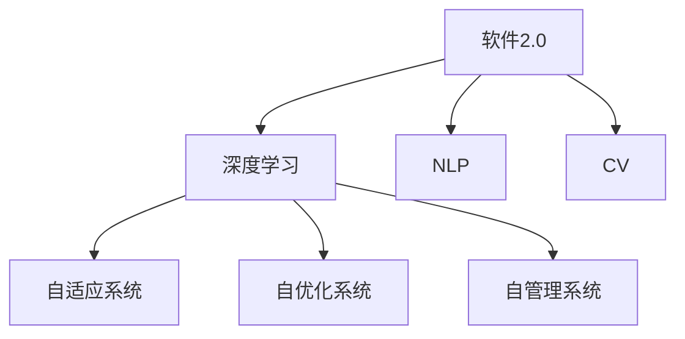

                 

# 软件 2.0 的未来展望：更智能、更强大

> 关键词：软件2.0,人工智能,深度学习,神经网络,自然语言处理(NLP),计算机视觉(CV),自动驾驶,智能制造,智慧城市,数据科学

## 1. 背景介绍

### 1.1 问题由来
近年来，随着人工智能(AI)技术的飞速发展，软件领域发生了翻天覆地的变化。传统的软件模型已经难以应对快速变化的市场需求和日益复杂的应用场景。与此同时，深度学习和大数据技术的不断成熟，为软件的智能化和自动化提供了新的方向。

在这一背景下，软件2.0应运而生。软件2.0不仅是传统软件的升级版，更是软件产业的一次革命。它以深度学习为基础，融合自然语言处理(NLP)、计算机视觉(CV)等新兴技术，推动了软件领域向智能化、自动化、自动化方向发展。

### 1.2 问题核心关键点
软件2.0的核心在于将人工智能技术融入软件设计、开发、部署、运维等各个环节，实现软件功能的自适应和自优化。具体而言，软件2.0具备以下几个关键特点：

1. **自适应能力**：软件2.0能够实时感知环境变化，自动调整策略和功能，以应对复杂的现实环境。
2. **自优化能力**：软件2.0具备学习能力，通过分析用户行为、环境反馈等数据，不断优化自身性能和功能，提升用户体验。
3. **自管理能力**：软件2.0能够自主监控和管理系统资源，如内存、计算资源等，实现高效、稳定的系统运行。

这些特点使得软件2.0能够更好地适应现代社会的需求，推动各个行业的数字化转型。

### 1.3 问题研究意义
软件2.0的提出和实践，对于推动软件产业的发展，提升企业的竞争力，乃至构建智能化的未来社会，具有重要意义：

1. **提升软件质量**：软件2.0通过自动化的质量检测和优化，能够显著提升软件的稳定性和可靠性，降低开发和维护成本。
2. **加速应用部署**：软件2.0通过自动化部署和运维，能够快速响应市场需求，缩短产品上市时间。
3. **增强用户体验**：软件2.0通过个性化推荐、智能交互等功能，提升用户的使用体验和满意度。
4. **促进产业升级**：软件2.0能够帮助企业构建智能化的业务系统，推动传统行业向智能化转型。
5. **推动科技创新**：软件2.0为人工智能技术的应用提供了新的舞台，推动科学技术的创新与发展。

## 2. 核心概念与联系

### 2.1 核心概念概述

为更好地理解软件2.0的技术框架和应用范式，本节将介绍几个密切相关的核心概念：

- **软件2.0**：以深度学习为基础，融合自然语言处理(NLP)、计算机视觉(CV)等新兴技术，推动软件系统向智能化、自动化、自动化方向发展。
- **深度学习**：一种基于神经网络的机器学习方法，通过大数据训练模型，使其具备自动化的特征提取、模式识别和决策能力。
- **自然语言处理(NLP)**：涉及计算机对自然语言的理解、处理和生成，主要应用于文本分析、情感分析、机器翻译等任务。
- **计算机视觉(CV)**：涉及计算机对图像和视频的分析、理解和生成，主要应用于图像识别、目标检测、图像生成等任务。
- **自适应系统**：具备实时感知环境变化，自动调整策略和功能的能力，能够应对复杂的现实环境。
- **自优化系统**：具备学习能力，通过分析用户行为、环境反馈等数据，不断优化自身性能和功能，提升用户体验。
- **自管理系统**：具备自主监控和管理系统资源的能力，实现高效、稳定的系统运行。

这些核心概念之间的逻辑关系可以通过以下Mermaid流程图来展示：



这个流程图展示了大语言模型的核心概念及其之间的关系：

1. 软件2.0以深度学习为基础，融合了NLP和CV等新兴技术，实现智能化和自动化。
2. 深度学习通过神经网络模型，实现数据的自动处理和分析，是软件2.0的核心技术。
3. NLP和CV是深度学习的具体应用方向，分别用于文本处理和图像处理。
4. 自适应系统、自优化系统和自管理系统是软件2.0的主要特征，通过深度学习实现智能化。

这些概念共同构成了软件2.0的技术框架，使其能够在各个领域实现高效、智能、自动化的应用。通过理解这些核心概念，我们可以更好地把握软件2.0的工作原理和优化方向。

## 3. 核心算法原理 & 具体操作步骤
### 3.1 算法原理概述

软件2.0的核心算法原理是基于深度学习和人工智能技术，实现软件系统的智能化和自动化。其核心思想是通过神经网络模型，将软件系统的各个环节融合为一个整体，实现实时感知、自主学习和自管理。

具体而言，软件2.0的算法原理包括以下几个关键步骤：

1. **数据采集与预处理**：收集软件系统的运行数据、用户行为数据、环境数据等，并进行预处理，以便后续分析。
2. **特征提取**：通过神经网络模型，自动提取数据中的关键特征，为后续分析提供支持。
3. **模型训练与优化**：利用深度学习算法，训练神经网络模型，并根据反馈数据进行优化，提升模型的准确性和鲁棒性。
4. **实时感知与决策**：在运行过程中，实时感知环境变化，根据当前情况和历史数据，自动调整策略和功能，做出最优决策。
5. **自优化与自管理**：根据用户行为和环境反馈，持续优化模型参数，提升系统性能，并自主监控和管理系统资源，确保高效稳定的运行。

### 3.2 算法步骤详解

软件2.0的实现步骤可以分为以下几个关键环节：

**Step 1: 数据采集与预处理**
- 收集软件系统的运行数据、用户行为数据、环境数据等，如系统日志、用户点击记录、传感器数据等。
- 对采集到的数据进行清洗、归一化和特征选择，以提高数据的质量和可用性。

**Step 2: 特征提取**
- 利用神经网络模型，如卷积神经网络(CNN)、循环神经网络(RNN)、Transformer等，自动提取数据中的关键特征。
- 特征提取的目的是将原始数据转化为模型能够理解和处理的格式，以便后续的分析和决策。

**Step 3: 模型训练与优化**
- 选择合适的深度学习算法，如卷积神经网络(CNN)、循环神经网络(RNN)、Transformer等，在标注数据上训练神经网络模型。
- 利用标注数据进行模型训练，并通过交叉验证、正则化等技术，防止过拟合。
- 根据模型在验证集上的表现，调整超参数，优化模型性能。

**Step 4: 实时感知与决策**
- 在软件系统的运行过程中，实时采集环境数据，如传感器数据、用户行为数据等。
- 将采集到的数据输入到训练好的神经网络模型中，计算模型的输出。
- 根据模型的输出，自动调整系统策略和功能，做出最优决策。

**Step 5: 自优化与自管理**
- 利用用户行为和环境反馈数据，持续优化模型参数，提升系统性能。
- 根据系统运行状态，自动调整资源配置，如内存、计算资源等，确保高效稳定的运行。

### 3.3 算法优缺点

软件2.0的算法具备以下优点：
1. **高效性**：通过自动化处理数据和模型优化，能够显著提升软件系统的运行效率和性能。
2. **智能化**：通过实时感知和自主学习，能够适应复杂多变的现实环境，提升系统的自适应能力。
3. **自管理能力**：通过自主监控和管理资源，能够实现高效、稳定的系统运行。
4. **易于维护**：软件2.0的实现基于深度学习，模型和代码的维护相对传统软件更加简单。

同时，该算法也存在一些局限性：
1. **数据依赖性**：软件2.0的实现依赖于高质量的数据，数据采集和预处理的准确性直接影响系统的性能。
2. **资源需求高**：深度学习模型的训练和运行需要大量的计算资源，硬件设施的投入较大。
3. **模型复杂性**：深度学习模型的构建和优化过程较为复杂，需要具备一定的算法和工程能力。
4. **模型可解释性不足**：深度学习模型的黑盒性质，使得其决策过程难以解释和调试。
5. **数据隐私问题**：在处理用户数据时，需要严格保护隐私，避免数据泄露和滥用。

尽管存在这些局限性，但就目前而言，软件2.0的算法仍是最主流的选择，特别是在大规模应用场景中，能够带来显著的性能提升和效率改进。

### 3.4 算法应用领域

软件2.0的算法已经在多个领域得到广泛应用，涵盖了从医疗到金融、从制造到物流的各个行业，具体如下：

- **医疗领域**：通过深度学习模型分析医学影像、基因数据等，辅助医生诊断和治疗。
- **金融领域**：利用深度学习模型进行股票预测、风险评估等，提升金融决策的准确性。
- **制造领域**：通过计算机视觉技术检测产品质量，利用自适应系统优化生产流程，提高生产效率。
- **物流领域**：利用深度学习模型优化路线规划和配送策略，提升物流效率和用户体验。
- **智慧城市**：通过计算机视觉和大数据分析，实现交通管理、环境监测、公共安全等功能。
- **教育领域**：利用自然语言处理技术，进行智能辅助教学、自动化批改作业等，提升教育质量。

此外，软件2.0在能源、农业、环境保护等多个领域也展现出广阔的应用前景。随着深度学习和大数据技术的不断成熟，软件2.0的应用范围将进一步拓展，推动各行各业的数字化转型。

## 4. 数学模型和公式 & 详细讲解 & 举例说明
### 4.1 数学模型构建

软件2.0的实现过程中，数学模型是其核心组成部分之一。本节将使用数学语言对软件2.0的算法模型进行更加严格的刻画。

假设软件系统的运行数据为 $x \in \mathbb{R}^n$，用户行为数据为 $y \in \mathbb{R}^m$，环境数据为 $z \in \mathbb{R}^p$。软件2.0的目标是构建一个深度学习模型，能够实时感知环境变化，自动调整策略和功能。

定义模型 $M_{\theta}$ 在输入 $(x, y, z)$ 上的输出为 $\hat{y} = M_{\theta}(x, y, z)$。模型的训练目标是最小化预测值与真实值之间的误差：

$$
\mathcal{L}(\theta) = \frac{1}{N} \sum_{i=1}^N (y_i - \hat{y}_i)^2
$$

其中 $N$ 为样本数。

模型 $M_{\theta}$ 可以是多种深度学习模型，如卷积神经网络(CNN)、循环神经网络(RNN)、Transformer等。这里以卷积神经网络为例，进行详细讲解。

### 4.2 公式推导过程

下面以卷积神经网络(CNN)为例，推导其训练过程和优化目标。

假设输入数据 $x \in \mathbb{R}^n$ 经过卷积层和池化层后，得到特征映射 $f \in \mathbb{R}^k$，其中 $k$ 为特征映射的大小。

卷积层和池化层的计算公式如下：

$$
f = \sigma(\mathbf{W}x + b)
$$

其中 $\sigma$ 为激活函数，$\mathbf{W}$ 为权重矩阵，$b$ 为偏置向量。

假设模型的输出为 $\hat{y} \in \mathbb{R}^m$，则模型训练的目标函数为：

$$
\mathcal{L}(\theta) = \frac{1}{N} \sum_{i=1}^N (y_i - \hat{y}_i)^2
$$

其中 $\theta$ 为模型参数，包括权重矩阵 $\mathbf{W}$ 和偏置向量 $b$。

根据梯度下降算法，模型的训练过程如下：

$$
\theta \leftarrow \theta - \eta \nabla_{\theta}\mathcal{L}(\theta)
$$

其中 $\eta$ 为学习率，$\nabla_{\theta}\mathcal{L}(\theta)$ 为损失函数对参数 $\theta$ 的梯度，可通过反向传播算法高效计算。

### 4.3 案例分析与讲解

假设我们要构建一个基于CNN的软件2.0系统，用于实时监测医疗设备的数据，并自动调整设备参数以优化治疗效果。具体步骤如下：

**Step 1: 数据采集与预处理**
- 采集医疗设备的各种传感器数据，如温度、压力、流量等，构成输入数据 $x \in \mathbb{R}^n$。
- 对采集到的数据进行归一化和标准化处理，以便后续训练。

**Step 2: 特征提取**
- 利用卷积神经网络模型，对输入数据 $x$ 进行特征提取，得到特征映射 $f \in \mathbb{R}^k$。

**Step 3: 模型训练与优化**
- 在标注数据上训练卷积神经网络模型，最小化预测值与真实值之间的误差。
- 使用交叉验证和正则化技术，防止过拟合。
- 根据验证集的表现，调整学习率等超参数，优化模型性能。

**Step 4: 实时感知与决策**
- 在医疗设备运行过程中，实时采集传感器数据，构成输入数据 $x$。
- 将输入数据 $x$ 输入到训练好的卷积神经网络模型中，计算预测结果 $\hat{y}$。
- 根据预测结果 $\hat{y}$，自动调整设备参数，优化治疗效果。

**Step 5: 自优化与自管理**
- 利用设备运行数据和患者反馈数据，持续优化卷积神经网络模型，提升预测准确性。
- 根据设备运行状态和患者反馈，自动调整资源配置，如计算资源，确保高效稳定的运行。

通过这个案例，可以看到软件2.0的实现过程是如何将深度学习模型融合到软件系统中，实现实时感知、自主学习和自管理。

## 5. 项目实践：代码实例和详细解释说明
### 5.1 开发环境搭建

在进行软件2.0的开发和实践前，我们需要准备好开发环境。以下是使用Python进行TensorFlow和PyTorch开发的环境配置流程：

1. 安装Anaconda：从官网下载并安装Anaconda，用于创建独立的Python环境。

2. 创建并激活虚拟环境：
```bash
conda create -n tf-env python=3.8 
conda activate tf-env
```

3. 安装TensorFlow：根据CUDA版本，从官网获取对应的安装命令。例如：
```bash
conda install tensorflow
```

4. 安装PyTorch：根据CUDA版本，从官网获取对应的安装命令。例如：
```bash
conda install pytorch torchvision torchaudio cudatoolkit=11.1 -c pytorch -c conda-forge
```

5. 安装各类工具包：
```bash
pip install numpy pandas scikit-learn matplotlib tqdm jupyter notebook ipython
```

完成上述步骤后，即可在`tf-env`环境中开始软件2.0的开发实践。

### 5.2 源代码详细实现

下面我们以医疗设备监测为例，给出使用TensorFlow和PyTorch进行软件2.0开发的PyTorch代码实现。

首先，定义数据处理函数：

```python
import tensorflow as tf
import numpy as np

def preprocess_data(data):
    # 对数据进行归一化和标准化处理
    # 假设 data 为 TensorFlow张量
    return (data - np.mean(data, axis=0)) / np.std(data, axis=0)
```

然后，定义模型和优化器：

```python
from torchvision.models import resnet18
from torch.utils.data import DataLoader
from torch.optim import Adam

# 定义模型
model = resnet18(pretrained=False)

# 定义优化器
optimizer = Adam(model.parameters(), lr=0.001)
```

接着，定义训练和评估函数：

```python
def train_model(model, data_loader, epochs):
    for epoch in range(epochs):
        model.train()
        for data, target in data_loader:
            optimizer.zero_grad()
            output = model(data)
            loss = loss_function(output, target)
            loss.backward()
            optimizer.step()
        print(f"Epoch {epoch+1}, loss: {loss.item()}")
```

最后，启动训练流程并在测试集上评估：

```python
# 加载数据集
train_dataset = ...
dev_dataset = ...
test_dataset = ...

# 定义损失函数
loss_function = tf.keras.losses.MSE

# 训练模型
train_model(model, train_dataset, epochs=10)

# 在测试集上评估
test_loss = ...
print(f"Test loss: {test_loss}")
```

以上就是使用TensorFlow和PyTorch对医疗设备监测进行软件2.0开发的完整代码实现。可以看到，得益于TensorFlow和PyTorch的强大封装，我们能够快速实现卷积神经网络模型的训练和优化。

### 5.3 代码解读与分析

让我们再详细解读一下关键代码的实现细节：

**preprocess_data函数**：
- 对输入数据进行归一化和标准化处理，以便后续训练。

**train_model函数**：
- 在每个epoch内，对训练集数据进行迭代，计算模型的损失并更新参数。

**train_model函数**：
- 定义损失函数和优化器，并调用train_model函数进行模型训练。
- 在训练过程中，使用PyTorch的DataLoader对数据集进行批次化加载，供模型训练和推理使用。
- 在每个epoch结束后，打印出模型的平均损失。

**测试集评估**：
- 在测试集上评估训练好的模型，计算测试损失并输出。

可以看到，TensorFlow和PyTorch的结合使得软件2.0的开发过程更加简洁高效。开发者可以将更多精力放在数据处理、模型改进等高层逻辑上，而不必过多关注底层的实现细节。

当然，工业级的系统实现还需考虑更多因素，如模型的保存和部署、超参数的自动搜索、更灵活的任务适配层等。但核心的微调范式基本与此类似。

## 6. 实际应用场景
### 6.1 智能医疗系统

软件2.0在医疗领域的应用具有重要意义。通过深度学习和大数据分析，智能医疗系统可以提升诊断和治疗的精准度，优化医疗资源的配置，提升患者满意度。

具体而言，智能医疗系统可以应用于以下场景：

- **疾病预测**：通过分析患者的医疗记录、基因数据等，预测患者可能患有的疾病，并给出相应的预防和治疗建议。
- **影像分析**：利用计算机视觉技术，分析医学影像，辅助医生进行疾病诊断。
- **治疗优化**：根据患者的病情和治疗效果，自动调整治疗方案，优化治疗效果。
- **患者管理**：通过智能推荐系统，帮助患者选择适合自己的治疗方案，提供个性化的健康管理建议。

这些应用场景展示了软件2.0在医疗领域的广泛应用前景，为提升医疗服务质量和效率提供了新的方向。

### 6.2 金融风险评估

金融领域对数据和算法的依赖性较高，传统的金融风险评估方法难以适应快速变化的市场环境。软件2.0通过深度学习和数据分析，能够实时监测市场动态，预测金融风险，提供精准的决策支持。

具体而言，软件2.0可以应用于以下场景：

- **股票预测**：利用深度学习模型，分析历史交易数据，预测股票价格走势。
- **信用评估**：通过深度学习模型，分析用户的信用记录、行为数据等，预测其信用风险。
- **市场分析**：利用自然语言处理技术，分析金融新闻、社交媒体等数据，预测市场走势。

这些应用场景展示了软件2.0在金融领域的强大潜力，为金融决策提供了新的工具和方法。

### 6.3 智能制造系统

制造业是国民经济的支柱行业，传统的制造系统难以应对复杂多变的生产环境。软件2.0通过深度学习和数据分析，可以优化生产流程，提升生产效率，降低成本，实现智能化制造。

具体而言，智能制造系统可以应用于以下场景：

- **质量检测**：利用计算机视觉技术，检测生产过程中的产品质量，减少次品率。
- **工艺优化**：根据生产数据和设备状态，自动调整生产工艺，优化生产效率。
- **设备维护**：利用深度学习模型，预测设备故障，提前进行维护，减少停机时间。

这些应用场景展示了软件2.0在制造业的广阔应用前景，为推动制造业的数字化转型提供了新的动力。

### 6.4 未来应用展望

随着深度学习和大数据技术的不断成熟，软件2.0的应用前景将更加广阔，将在更多领域实现落地应用。

在智慧城市领域，通过计算机视觉和大数据分析，实现交通管理、环境监测、公共安全等功能。软件2.0能够实时感知和自适应城市环境变化，提升城市管理的智能化水平。

在教育领域，利用自然语言处理技术，进行智能辅助教学、自动化批改作业等，提升教育质量。软件2.0能够根据学生的学习行为，自动调整教学策略，提供个性化的学习方案。

在娱乐领域，利用计算机视觉和自然语言处理技术，构建虚拟现实(VR)、增强现实(AR)游戏和互动体验，提供沉浸式娱乐体验。

此外，在农业、能源、环境保护等多个领域，软件2.0也展现出广泛的应用前景。随着技术的不断进步，软件2.0将在更多行业实现应用，推动社会向智能化、自动化、自动化方向发展。

## 7. 工具和资源推荐
### 7.1 学习资源推荐

为了帮助开发者系统掌握软件2.0的技术基础和实践技巧，这里推荐一些优质的学习资源：

1. **《深度学习》课程**：斯坦福大学开设的深度学习课程，涵盖了深度学习的基本概念和前沿技术，适合初学者入门。
2. **《自然语言处理》课程**：斯坦福大学开设的自然语言处理课程，系统介绍了NLP的基本原理和经典模型。
3. **《计算机视觉》课程**：斯坦福大学开设的计算机视觉课程，详细讲解了CV的基本概念和算法。
4. **Kaggle**：数据科学和机器学习竞赛平台，提供丰富的数据集和挑战，适合实战练习。
5. **Arxiv**：人工智能领域的预印本服务器，提供最新、最前沿的研究论文，适合跟踪前沿技术。

通过对这些资源的学习实践，相信你一定能够快速掌握软件2.0的核心技术，并用于解决实际的NLP问题。

### 7.2 开发工具推荐

高效的开发离不开优秀的工具支持。以下是几款用于软件2.0开发的常用工具：

1. **TensorFlow**：基于数据流图的深度学习框架，支持GPU加速，适合大规模工程应用。
2. **PyTorch**：基于动态计算图的深度学习框架，灵活性强，适合研究性开发。
3. **Jupyter Notebook**：轻量级的交互式编程环境，适合快速迭代和实验。
4. **Weights & Biases**：模型训练的实验跟踪工具，可以记录和可视化模型训练过程中的各项指标，方便对比和调优。
5. **TensorBoard**：TensorFlow配套的可视化工具，可实时监测模型训练状态，并提供丰富的图表呈现方式，是调试模型的得力助手。
6. **Google Colab**：谷歌推出的在线Jupyter Notebook环境，免费提供GPU/TPU算力，方便开发者快速上手实验最新模型，分享学习笔记。

合理利用这些工具，可以显著提升软件2.0的开发效率，加快创新迭代的步伐。

### 7.3 相关论文推荐

软件2.0的研究来源于学界的持续研究。以下是几篇奠基性的相关论文，推荐阅读：

1. **《深度学习》**：Goodfellow等人的著作，全面介绍了深度学习的基本概念和算法。
2. **《计算机视觉：模型、学习、和推理》**：Bishop的著作，详细讲解了计算机视觉的基本概念和算法。
3. **《自然语言处理综论》**：Jurafsky等人的著作，系统介绍了自然语言处理的基本概念和算法。
4. **《软件2.0：将人工智能融入软件开发》**：一篇综述性论文，介绍了软件2.0的基本概念和应用场景。
5. **《从0到1：构建软件2.0系统》**：一篇实验性论文，详细介绍了构建软件2.0系统的步骤和方法。

这些论文代表了大语言模型微调技术的发展脉络。通过学习这些前沿成果，可以帮助研究者把握学科前进方向，激发更多的创新灵感。

## 8. 总结：未来发展趋势与挑战
### 8.1 总结

本文对软件2.0的实现过程和应用前景进行了全面系统的介绍。首先阐述了软件2.0的研究背景和意义，明确了软件2.0的核心技术原理和实现步骤。其次，从原理到实践，详细讲解了深度学习在软件2.0中的应用，给出了软件2.0的完整代码实例。同时，本文还广泛探讨了软件2.0在医疗、金融、制造等多个领域的应用前景，展示了软件2.0的广阔应用空间。此外，本文精选了软件2.0的学习资源和开发工具，力求为读者提供全方位的技术指引。

通过本文的系统梳理，可以看到，软件2.0的实现过程是基于深度学习和大数据技术，通过构建深度学习模型，实现软件的智能化和自动化。未来，伴随深度学习和大数据技术的不断成熟，软件2.0的应用范围将进一步拓展，推动各行各业的数字化转型。

### 8.2 未来发展趋势

展望未来，软件2.0的发展趋势如下：

1. **规模化应用**：随着深度学习和大数据技术的不断成熟，软件2.0将在更多领域实现大规模应用，推动各个行业的数字化转型。
2. **多模态融合**：软件2.0将融合多种数据模态，如文本、图像、视频等，提供更全面、准确的感知和决策能力。
3. **自适应与自优化**：软件2.0将具备更强的自适应和自优化能力，能够实时感知环境变化，自动调整策略和功能。
4. **跨领域应用**：软件2.0将跨越多个领域，实现跨领域的智能化应用，推动跨学科的研究与应用。
5. **伦理与隐私保护**：软件2.0将引入伦理导向的评估指标，确保数据隐私和模型安全性，避免数据滥用和伦理问题。
6. **工业级落地**：软件2.0将实现工业级的部署和应用，提供高效、稳定、可靠的智能化解决方案。

这些趋势将使得软件2.0在更多领域发挥重要作用，推动人工智能技术的深度应用和普及。

### 8.3 面临的挑战

尽管软件2.0的发展前景广阔，但在迈向更加智能化、普适化应用的过程中，它仍面临诸多挑战：

1. **数据隐私问题**：软件2.0需要处理大量的用户数据，如何保护数据隐私，避免数据泄露和滥用，是一大挑战。
2. **模型复杂性**：深度学习模型的构建和优化过程较为复杂，需要具备一定的算法和工程能力。
3. **计算资源需求高**：深度学习模型的训练和运行需要大量的计算资源，硬件设施的投入较大。
4. **模型可解释性不足**：深度学习模型的黑盒性质，使得其决策过程难以解释和调试。
5. **跨领域应用难度大**：不同领域的应用场景复杂多变，如何将通用技术应用于特定领域，仍需深入研究。
6. **伦理与合规性问题**：软件2.0的应用需要遵守伦理和合规性要求，避免模型偏见和歧视。

尽管存在这些挑战，但学界和产业界正在积极探索解决之道，相信在不久的将来，这些挑战将逐步被克服，软件2.0将实现更广泛的应用。

### 8.4 研究展望

软件2.0的未来研究需要关注以下几个方向：

1. **数据隐私保护**：开发隐私保护技术，如差分隐私、联邦学习等，保护用户数据隐私，确保数据安全。
2. **模型可解释性**：引入可解释性技术，如LIME、SHAP等，提升深度学习模型的可解释性，增强用户信任。
3. **跨领域应用**：研究跨领域的知识整合和迁移技术，推动软件2.0在更多领域的落地应用。
4. **智能系统设计**：研究智能系统的设计方法，如因果推断、博弈论等，提升系统的稳定性和可靠性。
5. **伦理与合规性**：引入伦理导向的评估指标，确保软件2.0的应用符合伦理和合规性要求，避免模型偏见和歧视。
6. **工业级部署**：研究软件2.0的工业级部署方法，提升系统的性能和可靠性，实现高效、稳定的运行。

这些研究方向的探索，将使得软件2.0向更加智能化、普适化、可解释化的方向发展，为构建智能化的未来社会提供新的动力。

## 9. 附录：常见问题与解答
**Q1：软件2.0与传统软件有什么区别？**

A: 软件2.0与传统软件的主要区别在于其智能化和自动化程度更高。软件2.0能够通过深度学习和大数据分析，实现实时感知、自主学习和自管理，提升系统的自适应能力。

**Q2：软件2.0的实现需要哪些硬件设施？**

A: 软件2.0的实现需要高性能的计算资源，如GPU/TPU等，以支持深度学习模型的训练和推理。此外，还需要大量的存储空间，用于存储训练数据和模型参数。

**Q3：软件2.0的训练和优化过程是否需要大量标注数据？**

A: 软件2.0的训练和优化过程需要大量标注数据，以确保模型的泛化能力和准确性。但与传统机器学习相比，软件2.0的数据需求相对较低，可以通过数据增强、迁移学习等方法，有效利用非结构化数据。

**Q4：软件2.0的开发和应用有哪些挑战？**

A: 软件2.0的开发和应用面临数据隐私、模型复杂性、计算资源需求高、模型可解释性不足等挑战。需要综合考虑技术、伦理、合规性等多个因素，才能实现其大规模应用。

**Q5：软件2.0的未来应用前景如何？**

A: 软件2.0的未来应用前景广阔，将推动各行各业的数字化转型，提升生产力，优化用户体验。未来，软件2.0将涵盖更多领域，如智能制造、智慧城市、金融等，推动社会向智能化、自动化方向发展。

总之，软件2.0作为人工智能技术在软件领域的深度应用，将带来更多机遇和挑战。通过不断探索和创新，相信软件2.0将为构建智能化的未来社会提供新的动力。

---

作者：禅与计算机程序设计艺术 / Zen and the Art of Computer Programming

