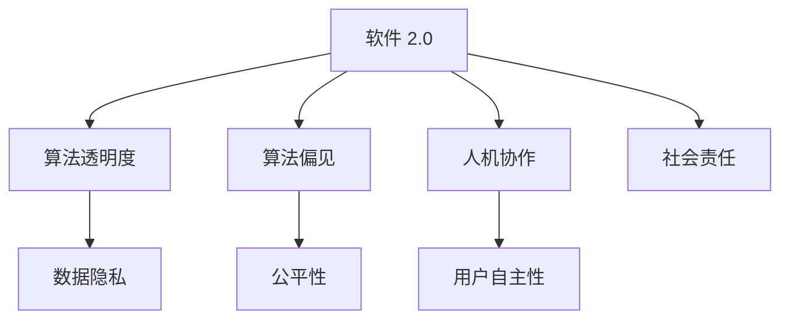

                 

# 软件 2.0 的社会责任：科技向善

> 关键词：软件 2.0, 社会责任, 科技向善, 人工智能, 算法伦理, 人机协作

## 1. 背景介绍

### 1.1 问题由来
随着科技的飞速发展，软件技术已经从以功能为核心的"软件 1.0"时代，进入了以智能和用户体验为核心的"软件 2.0"时代。这一转变不仅提升了产品的智能化程度，也为社会带来了深刻的影响。然而，随着软件技术的日益普及，其潜在的社会责任和伦理问题也引起了广泛的关注。科技向善，即如何在技术进步的同时，实现社会的福祉和公正，成为了一个亟待解决的重大课题。

### 1.2 问题核心关键点
当前，科技向善的问题核心在于以下几个方面：
- **数据隐私与安全**：软件应用广泛涉及个人隐私数据，如何保护用户隐私，防止数据滥用，是科技向善的重要目标。
- **算法透明度与可解释性**：复杂算法往往被视为"黑盒"系统，难以解释其内部决策过程，影响用户的信任和接受度。
- **伦理决策与公平性**：算法决策可能带有偏见，如何保证公平性，避免歧视，是科技向善必须解决的问题。
- **人机协作与用户自主性**：软件系统应尊重用户自主权，确保人机协作的合理性，避免对用户的过度干预。
- **社会责任与可持续发展**：软件技术应服务于社会福祉，促进可持续发展，避免对环境和社会造成负面影响。

### 1.3 问题研究意义
探讨软件 2.0 的社会责任，对于提升技术伦理标准、推动科技可持续发展、构建和谐人机关系具有重要意义：
- 提高用户信任度：增强算法透明度和可解释性，使用户更加信任和依赖科技产品。
- 促进公平与包容：减少算法偏见，确保技术对所有群体公平适用，促进社会公正。
- 强化社会责任：引导科技公司关注社会福祉，实现可持续发展，避免技术滥用。
- 激发创新思维：构建伦理导向的科技创新环境，鼓励更多的正向社会效益项目。

## 2. 核心概念与联系

### 2.1 核心概念概述

为更好地理解软件 2.0 的社会责任，本节将介绍几个密切相关的核心概念：

- **软件 2.0**：以智能化和用户体验为核心的新一代软件技术，通过深度学习、自然语言处理等前沿技术，实现对复杂问题的精准处理和高效解决。

- **算法透明度与可解释性**：指算法决策过程的透明性和用户可理解性，使用户能够理解和信任算法输出的结果。

- **算法偏见与公平性**：指算法在训练和应用过程中可能引入的偏见，如何确保算法在各种应用场景中对所有群体公平适用。

- **人机协作与用户自主性**：指软件系统如何与用户进行合理互动，既提供智能辅助，又尊重用户自主权。

- **数据隐私与安全**：指在数据采集、存储、处理等各个环节，如何确保用户数据的安全性和隐私保护。

- **社会责任与可持续发展**：指软件技术如何对社会福祉和可持续发展作出贡献，避免对环境和社会造成负面影响。

这些核心概念之间的逻辑关系可以通过以下Mermaid流程图来展示：



这个流程图展示了大语言模型的核心概念及其之间的关系：

1. 软件 2.0 通过深度学习、自然语言处理等技术，实现对复杂问题的处理。
2. 算法的透明度与可解释性，保证了用户对决策过程的理解。
3. 算法偏见与公平性，确保算法对所有群体的适用性。
4. 人机协作与用户自主性，平衡系统智能辅助和用户自主选择。
5. 数据隐私与安全，保护用户数据的权利。
6. 社会责任与可持续发展，指导软件技术的社会伦理应用。

这些概念共同构成了软件 2.0 的社会责任框架，为技术发展提供伦理指导和行为规范。

## 3. 核心算法原理 & 具体操作步骤
### 3.1 算法原理概述

软件 2.0 的社会责任，需要依托于一系列核心算法和操作流程。核心算法包括：
- 深度学习与神经网络：通过多层次的非线性映射，实现对复杂数据的抽象与处理。
- 自然语言处理：实现对自然语言的理解与生成，提升人机交互的智能化水平。
- 机器学习与强化学习：通过学习算法优化模型，实现对数据的智能处理和决策。

具体操作步骤包括：
- 数据收集与预处理：获取高质量的数据，并进行清洗和标注。
- 模型训练与验证：使用深度学习模型进行训练，并在验证集上评估性能。
- 算法优化与迭代：根据反馈优化模型，提升性能和可靠性。
- 用户反馈与调整：收集用户反馈，进一步优化模型和用户体验。

### 3.2 算法步骤详解

1. **数据收集与预处理**：
   - 数据收集：通过在线爬虫、API接口等方式，获取大规模数据集。
   - 数据清洗：去除噪声和异常值，保证数据质量。
   - 数据标注：对数据进行人工标注，确保数据集的可利用性。

2. **模型训练与验证**：
   - 选择合适的深度学习模型，如卷积神经网络、循环神经网络、Transformer等。
   - 定义损失函数和优化器，如交叉熵损失、Adam优化器等。
   - 划分训练集、验证集和测试集，使用交叉验证评估模型性能。

3. **算法优化与迭代**：
   - 根据验证集上的性能指标，调整模型超参数，如学习率、批大小等。
   - 应用正则化技术，如L2正则、Dropout等，防止过拟合。
   - 使用对抗训练，引入对抗样本，提高模型的鲁棒性。
   - 应用迁移学习，将预训练模型应用于新任务，提升性能。

4. **用户反馈与调整**：
   - 收集用户反馈，了解用户需求和体验。
   - 根据反馈调整模型，提升用户体验。
   - 定期更新模型，保持性能和可靠性。

### 3.3 算法优缺点

软件 2.0 的社会责任算法具有以下优点：
- 高效处理复杂问题：深度学习、自然语言处理等技术，提升了处理复杂问题的能力。
- 提升用户体验：智能化交互和个性化推荐，提升了用户的满意度和黏性。
- 促进社会公平：公平性算法和透明性设计，减少了算法偏见，提升了社会公正性。

同时，该算法也存在一些局限性：
- 数据依赖性强：依赖于高质量的数据集，数据不足可能导致性能下降。
- 模型复杂度高：深度学习模型参数量大，训练和推理需要较高的计算资源。
- 缺乏可解释性：复杂模型难以解释内部决策过程，影响用户信任。

### 3.4 算法应用领域

软件 2.0 的社会责任算法已经广泛应用于多个领域，包括但不限于：
- **医疗健康**：通过深度学习模型进行疾病诊断、治疗方案推荐等。
- **金融服务**：使用算法进行信用评估、风险管理、个性化理财等。
- **教育培训**：利用自然语言处理技术进行智能批改、个性化学习路径推荐等。
- **智能交通**：通过算法优化交通信号控制、自动驾驶等。
- **环境保护**：使用算法进行环境监测、资源优化等。

## 4. 数学模型和公式 & 详细讲解 & 举例说明
### 4.1 数学模型构建

软件 2.0 的社会责任涉及多个数学模型，以下以深度学习模型为例，展示其数学模型构建过程。

假设深度学习模型为 $M_{\theta}$，其中 $\theta$ 为模型参数。给定训练集 $D=\{(x_i,y_i)\}_{i=1}^N$，其中 $x_i$ 为输入数据，$y_i$ 为标签。模型的损失函数为交叉熵损失函数 $\ell(M_{\theta}(x),y)$，优化目标是最小化经验风险：

$$
\mathcal{L}(\theta) = \frac{1}{N} \sum_{i=1}^N \ell(M_{\theta}(x_i),y_i)
$$

优化算法一般采用梯度下降法，更新公式为：

$$
\theta \leftarrow \theta - \eta \nabla_{\theta}\mathcal{L}(\theta)
$$

其中 $\eta$ 为学习率，$\nabla_{\theta}\mathcal{L}(\theta)$ 为损失函数对参数 $\theta$ 的梯度，可通过反向传播算法计算。

### 4.2 公式推导过程

以二分类问题为例，展示交叉熵损失函数及其梯度的计算过程：

假设模型 $M_{\theta}$ 在输入 $x$ 上的输出为 $\hat{y}=M_{\theta}(x) \in [0,1]$，表示样本属于正类的概率。真实标签 $y \in \{0,1\}$。则二分类交叉熵损失函数定义为：

$$
\ell(M_{\theta}(x),y) = -[y\log \hat{y} + (1-y)\log (1-\hat{y})]
$$

将其代入经验风险公式，得：

$$
\mathcal{L}(\theta) = -\frac{1}{N}\sum_{i=1}^N [y_i\log M_{\theta}(x_i)+(1-y_i)\log(1-M_{\theta}(x_i))]
$$

根据链式法则，损失函数对参数 $\theta_k$ 的梯度为：

$$
\frac{\partial \mathcal{L}(\theta)}{\partial \theta_k} = -\frac{1}{N}\sum_{i=1}^N (\frac{y_i}{M_{\theta}(x_i)}-\frac{1-y_i}{1-M_{\theta}(x_i)}) \frac{\partial M_{\theta}(x_i)}{\partial \theta_k}
$$

其中 $\frac{\partial M_{\theta}(x_i)}{\partial \theta_k}$ 可进一步递归展开，利用自动微分技术完成计算。

### 4.3 案例分析与讲解

以医疗健康领域为例，展示深度学习在疾病诊断中的应用。

假设医疗数据集 $D=\{(x_i,y_i)\}_{i=1}^N$，其中 $x_i$ 为患者的各项检测结果，$y_i$ 为疾病诊断标签。模型 $M_{\theta}$ 的输出 $\hat{y}=M_{\theta}(x) \in [0,1]$ 表示该患者患病的概率。交叉熵损失函数为：

$$
\ell(M_{\theta}(x),y) = -[y\log \hat{y} + (1-y)\log (1-\hat{y})]
$$

在训练过程中，使用梯度下降法更新模型参数，以最小化交叉熵损失：

$$
\theta \leftarrow \theta - \eta \nabla_{\theta}\mathcal{L}(\theta)
$$

其中 $\eta$ 为学习率，$\nabla_{\theta}\mathcal{L}(\theta)$ 为损失函数对参数 $\theta$ 的梯度。

通过大量数据训练后，得到的模型可以在新患者的数据上进行疾病预测，提升诊断的准确性和效率。

## 5. 项目实践：代码实例和详细解释说明
### 5.1 开发环境搭建

在进行项目实践前，我们需要准备好开发环境。以下是使用Python进行PyTorch开发的环境配置流程：

1. 安装Anaconda：从官网下载并安装Anaconda，用于创建独立的Python环境。

2. 创建并激活虚拟环境：
```bash
conda create -n pytorch-env python=3.8 
conda activate pytorch-env
```

3. 安装PyTorch：根据CUDA版本，从官网获取对应的安装命令。例如：
```bash
conda install pytorch torchvision torchaudio cudatoolkit=11.1 -c pytorch -c conda-forge
```

4. 安装TensorFlow：
```bash
pip install tensorflow
```

5. 安装各类工具包：
```bash
pip install numpy pandas scikit-learn matplotlib tqdm jupyter notebook ipython
```

完成上述步骤后，即可在`pytorch-env`环境中开始项目实践。

### 5.2 源代码详细实现

这里我们以图像分类任务为例，给出使用PyTorch进行深度学习模型的代码实现。

首先，定义模型和优化器：

```python
import torch
from torch import nn, optim
from torchvision import datasets, transforms

class Net(nn.Module):
    def __init__(self):
        super(Net, self).__init__()
        self.conv1 = nn.Conv2d(1, 32, kernel_size=3, padding=1)
        self.conv2 = nn.Conv2d(32, 64, kernel_size=3, padding=1)
        self.fc1 = nn.Linear(64 * 14 * 14, 128)
        self.fc2 = nn.Linear(128, 10)

    def forward(self, x):
        x = nn.functional.relu(self.conv1(x))
        x = nn.functional.max_pool2d(x, 2)
        x = nn.functional.relu(self.conv2(x))
        x = nn.functional.max_pool2d(x, 2)
        x = x.view(-1, 64 * 7 * 7)
        x = nn.functional.relu(self.fc1(x))
        x = self.fc2(x)
        return x

model = Net()
optimizer = optim.Adam(model.parameters(), lr=0.001)

```

然后，定义训练和评估函数：

```python
def train(model, device, train_loader, optimizer, epoch):
    model.train()
    for batch_idx, (data, target) in enumerate(train_loader):
        data, target = data.to(device), target.to(device)
        optimizer.zero_grad()
        output = model(data)
        loss = nn.functional.cross_entropy(output, target)
        loss.backward()
        optimizer.step()
        if batch_idx % 100 == 0:
            print(f'Train Epoch: {epoch} [{batch_idx*len(data)}/{len(train_loader.dataset)} '
                  f'({100. * batch_idx / len(train_loader):.0f}%)]\tLoss: {loss.item():.6f}')

def test(model, device, test_loader):
    model.eval()
    test_loss = 0
    correct = 0
    with torch.no_grad():
        for data, target in test_loader:
            data, target = data.to(device), target.to(device)
            output = model(data)
            test_loss += nn.functional.cross_entropy(output, target, reduction='sum').item()
            pred = output.argmax(dim=1, keepdim=True)
            correct += pred.eq(target.view_as(pred)).sum().item()

    test_loss /= len(test_loader.dataset)

    print(f'\nTest set: Average loss: {test_loss:.4f}, Accuracy: {100 * correct / len(test_loader.dataset):.2f}%\n')
```

最后，启动训练流程并在测试集上评估：

```python
batch_size = 64
train_loader = torch.utils.data.DataLoader(train_dataset, batch_size=batch_size, shuffle=True)
test_loader = torch.utils.data.DataLoader(test_dataset, batch_size=batch_size, shuffle=False)

device = torch.device('cuda' if torch.cuda.is_available() else 'cpu')
model.to(device)

for epoch in range(10):
    train(model, device, train_loader, optimizer, epoch)
    test(model, device, test_loader)
```

以上就是使用PyTorch进行图像分类任务训练的完整代码实现。可以看到，通过简单的定义模型、优化器、训练函数和测试函数，即可轻松实现深度学习模型的训练和评估。

### 5.3 代码解读与分析

让我们再详细解读一下关键代码的实现细节：

**Net类**：
- `__init__`方法：定义模型的网络结构，包括卷积层、全连接层等。
- `forward`方法：定义前向传播过程，将输入数据传递给模型，输出预测结果。

**train和test函数**：
- 使用DataLoader对数据集进行批处理，方便模型训练和推理。
- 在训练函数中，将模型设置为训练模式，计算损失并反向传播更新参数。
- 在测试函数中，将模型设置为评估模式，计算损失和精度。

**模型训练与评估**：
- 定义模型结构，选择合适的优化器和损失函数。
- 使用train_loader和test_loader加载训练集和测试集数据。
- 在每个epoch内，先进行训练，后进行测试，记录训练和测试的loss和精度。
- 通过多次epoch训练，不断优化模型，提升性能。

## 6. 实际应用场景
### 6.1 智能医疗

在智能医疗领域，深度学习模型可以辅助医生进行疾病诊断和治疗方案推荐，提高医疗服务的智能化水平。

例如，利用深度学习模型对患者的医疗记录进行学习，可以自动识别出可能的疾病类型和风险因素。结合临床数据和患者病史，模型可以给出个性化的治疗方案推荐，辅助医生进行精准治疗。

### 6.2 金融风控

金融领域需要实时监测用户的信用风险和市场波动，深度学习模型可以帮助金融机构进行风险管理和信用评估，提升金融服务的智能化水平。

例如，通过深度学习模型对用户的消费记录、交易行为等数据进行分析，可以识别出高风险用户和潜在欺诈行为。结合市场数据和模型预测，金融机构可以制定更为精准的信贷策略，降低风险损失。

### 6.3 智能教育

教育领域需要个性化的教学和智能化的学习评估，深度学习模型可以帮助教育机构进行智能批改、个性化学习路径推荐等，提升教育服务的智能化水平。

例如，利用深度学习模型对学生的作业和测试答案进行智能批改，可以节省大量教师时间，提升批改的准确性和及时性。同时，模型可以根据学生的学习行为和知识掌握情况，推荐个性化的学习内容和路径，提升学习效果。

### 6.4 未来应用展望

随着深度学习技术的不断发展，软件 2.0 的社会责任应用将更加广泛，涵盖更多领域。

在智慧城市治理中，深度学习模型可以帮助政府进行城市事件监测、舆情分析、应急指挥等，提升城市管理的自动化和智能化水平，构建更安全、高效的未来城市。

在环保领域，深度学习模型可以进行环境监测和资源优化，提升环境保护的效果，促进可持续发展。

在智能交通中，深度学习模型可以进行交通信号优化、自动驾驶等，提升交通系统的效率和安全性。

未来，随着深度学习技术的不断进步，软件 2.0 的社会责任应用将不断拓展，为社会福祉和可持续发展作出更大的贡献。

## 7. 工具和资源推荐
### 7.1 学习资源推荐

为了帮助开发者系统掌握深度学习技术的社会责任应用，这里推荐一些优质的学习资源：

1. **《深度学习》**系列课程：由斯坦福大学Andrew Ng教授主讲的深度学习课程，系统讲解深度学习的基本原理和应用。
2. **《TensorFlow》官方文档**：谷歌开发的深度学习框架TensorFlow的官方文档，详细介绍了TensorFlow的API和使用方法。
3. **Kaggle**：全球最大的数据科学竞赛平台，提供丰富的深度学习竞赛项目和数据集，可以帮助开发者提升实战能力。
4. **《Python深度学习》**书籍：由Francois Chollet所著，系统讲解深度学习在Python中的实现和应用。
5. **Coursera**：与多所顶尖大学合作，提供深度学习相关的在线课程和项目，帮助开发者提升学习效果。

通过对这些资源的学习实践，相信你一定能够快速掌握深度学习技术的社会责任应用，并用于解决实际的科技问题。

### 7.2 开发工具推荐

高效的开发离不开优秀的工具支持。以下是几款用于深度学习开发和应用的常用工具：

1. **PyTorch**：由Facebook开发的深度学习框架，具有动态计算图和高效的模型定义，适合快速迭代研究。
2. **TensorFlow**：由谷歌主导开发的深度学习框架，支持分布式训练和生产部署，适合大规模工程应用。
3. **Jupyter Notebook**：交互式的编程环境，支持多种编程语言和工具，适合进行深度学习研究和应用。
4. **Keras**：高层次的深度学习API，易于上手，支持TensorFlow、Theano等后端，适合快速开发原型。
5. **TensorBoard**：谷歌开发的可视化工具，可实时监测模型训练状态，提供丰富的图表呈现方式，是调试模型的得力助手。

合理利用这些工具，可以显著提升深度学习模型的开发效率，加速科技创新和应用落地。

### 7.3 相关论文推荐

深度学习技术的社会责任应用得益于学界的持续研究。以下是几篇奠基性的相关论文，推荐阅读：

1. **《Deep Learning》**：Goodfellow等著，全面介绍了深度学习的基本原理和应用，是深度学习领域的经典著作。
2. **《ImageNet Classification with Deep Convolutional Neural Networks》**：Alex Krizhevsky等，介绍了深度卷积神经网络在图像分类中的应用，刷新了图像分类任务的SOTA。
3. **《Natural Language Processing with Transformers》**：Jamal Huszar等，详细介绍了Transformer模型的原理和应用，是自然语言处理领域的经典著作。
4. **《Human-Computer Interaction with Deep Learning》**：Yann LeCun等，介绍了深度学习在智能交互中的应用，展示了深度学习技术对HCI的革命性影响。
5. **《Towards More Reliable and Ethical AI》**：AI领域多位专家合著，探讨了深度学习技术的伦理和安全问题，提出了未来发展的方向。

这些论文代表了大语言模型微调技术的发展脉络。通过学习这些前沿成果，可以帮助研究者把握学科前进方向，激发更多的创新灵感。

## 8. 总结：未来发展趋势与挑战
### 8.1 总结

本文对软件 2.0 的社会责任进行了全面系统的介绍。首先阐述了软件 2.0 技术的社会责任背景和意义，明确了技术进步在社会福祉和公正方面的重要价值。其次，从原理到实践，详细讲解了深度学习模型的构建和训练过程，展示了技术在实际应用中的广泛可能性。

通过本文的系统梳理，可以看到，软件 2.0 技术已经广泛应用于各个领域，提升了产品智能化水平，带来了社会效益。未来，随着技术的不断演进，软件 2.0 的社会责任应用将更加广泛，为社会福祉和可持续发展作出更大的贡献。

### 8.2 未来发展趋势

展望未来，软件 2.0 的社会责任技术将呈现以下几个发展趋势：

1. **技术普及与创新加速**：深度学习技术将更加普及，更多行业和企业将采用深度学习技术，提升产品和服务水平。同时，深度学习领域的技术创新将加速，推动技术的快速迭代和应用拓展。

2. **算法透明性与可解释性提升**：随着用户对算法透明性和可解释性的需求增加，未来深度学习模型将更加注重算法的透明性和可解释性，提升用户信任度。

3. **算法公平性与伦理标准加强**：深度学习模型将进一步提升公平性和伦理标准，减少算法偏见和歧视，确保技术对所有群体的适用性。

4. **人机协作与用户自主性优化**：未来软件 2.0 技术将更加注重人机协作与用户自主性，提升用户体验，确保系统智能辅助和用户自主选择的平衡。

5. **数据隐私与安全保障**：深度学习技术将更加注重数据隐私与安全，采用先进的数据加密和隐私保护技术，确保用户数据的安全性和隐私保护。

6. **可持续发展与社会责任强化**：深度学习技术将更加注重社会责任和可持续发展，积极参与社会公益和环保活动，为社会福祉和可持续发展作出贡献。

以上趋势凸显了软件 2.0 技术在社会责任方面的广阔前景，为技术发展提供了明确的指导方向。

### 8.3 面临的挑战

尽管软件 2.0 技术在社会责任方面已经取得了诸多进展，但在迈向更加智能化、普适化应用的过程中，仍面临诸多挑战：

1. **算法透明度与可解释性不足**：深度学习模型的复杂性使得算法难以解释，影响用户信任度。
2. **算法偏见与公平性问题**：深度学习模型可能带有数据偏见，需要进一步提升公平性和伦理标准。
3. **数据隐私与安全风险**：深度学习模型涉及大量用户数据，需要采用先进的数据加密和隐私保护技术。
4. **人机协作与用户自主性失衡**：深度学习模型可能过度干预用户，需要平衡智能辅助和用户自主选择。
5. **可持续发展与社会责任挑战**：深度学习技术可能带来资源浪费和环境污染，需要注重可持续发展。

解决这些问题需要技术、政策和社会多方面的共同努力，才能实现软件 2.0 技术的社会责任应用。

### 8.4 研究展望

面向未来，深度学习技术的社会责任研究需要在以下几个方面寻求新的突破：

1. **提升算法透明性与可解释性**：开发更加透明和可解释的深度学习模型，使用户能够理解算法的决策过程。
2. **加强算法公平性与伦理标准**：设计更加公平和伦理的深度学习模型，减少算法偏见和歧视。
3. **采用数据加密和隐私保护技术**：开发先进的数据加密和隐私保护技术，确保用户数据的安全性和隐私保护。
4. **优化人机协作与用户自主性**：设计更加平衡的人机协作模型，提升用户自主性和满意度。
5. **注重可持续发展与社会责任**：开发注重可持续发展的深度学习技术，减少对环境和社会的负面影响。

这些研究方向的探索，必将引领深度学习技术迈向更高的台阶，为构建安全、可靠、可解释、可控的智能系统铺平道路。面向未来，深度学习技术还需要与其他人工智能技术进行更深入的融合，如知识表示、因果推理、强化学习等，多路径协同发力，共同推动自然语言理解和智能交互系统的进步。只有勇于创新、敢于突破，才能不断拓展语言模型的边界，让智能技术更好地造福人类社会。

## 9. 附录：常见问题与解答

**Q1：深度学习模型在实际应用中存在哪些潜在风险？**

A: 深度学习模型在实际应用中存在以下潜在风险：
1. **算法透明性与可解释性不足**：深度学习模型往往被视为"黑盒"系统，难以解释其内部决策过程，影响用户信任度。
2. **算法偏见与公平性问题**：深度学习模型可能带有数据偏见，需要进一步提升公平性和伦理标准。
3. **数据隐私与安全风险**：深度学习模型涉及大量用户数据，需要采用先进的数据加密和隐私保护技术。
4. **人机协作与用户自主性失衡**：深度学习模型可能过度干预用户，需要平衡智能辅助和用户自主选择。
5. **可持续发展与社会责任挑战**：深度学习技术可能带来资源浪费和环境污染，需要注重可持续发展。

**Q2：如何应对深度学习模型的算法偏见问题？**

A: 应对深度学习模型的算法偏见问题，可以从以下几个方面进行：
1. **数据集多样性**：在数据集构建过程中，确保数据集的多样性，涵盖不同背景和特征的人群。
2. **公平性算法**：设计公平性算法，减少模型在训练和应用过程中引入的偏见。
3. **偏见检测与纠正**：使用偏见检测工具，识别模型中的偏见，并采取相应措施进行纠正。
4. **伦理导向设计**：在模型设计过程中，引入伦理导向的评估指标，确保模型对所有群体公平适用。
5. **持续监控与优化**：在模型应用过程中，持续监控模型的输出，及时发现和纠正偏见问题。

**Q3：深度学习模型如何提升算法透明性与可解释性？**

A: 提升深度学习模型的算法透明性与可解释性，可以从以下几个方面进行：
1. **可解释性模型**：使用可解释性模型，如决策树、线性模型等，提升模型输出的可解释性。
2. **可视化工具**：使用可视化工具，如注意力机制、可解释性特征提取等，展示模型内部的决策过程。
3. **特征重要性分析**：分析模型中各个特征的重要性，解释模型输出的关键因素。
4. **用户友好的界面**：设计用户友好的界面，让用户能够直观地理解模型的输出。
5. **透明性报告**：生成透明性报告，记录模型训练和应用的各个环节，便于用户理解和审查。

通过这些方法，可以显著提升深度学习模型的透明性和可解释性，增强用户信任度和接受度。

**Q4：深度学习模型在实际应用中如何保护用户隐私？**

A: 深度学习模型在实际应用中保护用户隐私，可以从以下几个方面进行：
1. **数据加密**：对用户数据进行加密，确保数据在传输和存储过程中的安全性。
2. **隐私保护技术**：采用隐私保护技术，如差分隐私、联邦学习等，保护用户隐私。
3. **数据匿名化**：对用户数据进行匿名化处理，防止个人隐私泄露。
4. **用户授权与控制**：设计用户授权机制，让用户自主决定是否共享数据，并能够控制数据的访问和使用。
5. **合规审查**：确保深度学习模型的应用符合相关法律法规，保护用户隐私。

通过这些措施，可以有效保护用户隐私，提升用户信任度和满意度。

**Q5：深度学习模型如何提升算法公平性？**

A: 提升深度学习模型的算法公平性，可以从以下几个方面进行：
1. **多样性数据集**：在数据集构建过程中，确保数据集的多样性，涵盖不同背景和特征的人群。
2. **公平性算法**：设计公平性算法，如公平性约束、公平性优化等，减少模型在训练和应用过程中引入的偏见。
3. **偏见检测与纠正**：使用偏见检测工具，识别模型中的偏见，并采取相应措施进行纠正。
4. **伦理导向设计**：在模型设计过程中，引入伦理导向的评估指标，确保模型对所有群体公平适用。
5. **持续监控与优化**：在模型应用过程中，持续监控模型的输出，及时发现和纠正偏见问题。

通过这些方法，可以有效提升深度学习模型的公平性，确保技术对所有群体的适用性，促进社会公正。

---

作者：禅与计算机程序设计艺术 / Zen and the Art of Computer Programming

