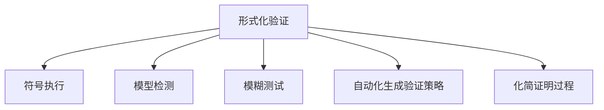

                 

# 软件2.0的形式化验证方法

## 1. 背景介绍

### 1.1 问题由来
随着软件复杂度的不断提升，传统的手工测试和功能验证方法已无法满足日益增长的需求。为解决这一问题，软件工程界逐渐引入了形式化验证方法，以确保软件的安全性、正确性和性能。形式化验证方法通过将软件系统的行为和结构用数学语言精确描述，并利用自动化的证明工具进行验证，能够大幅提高软件质量，降低开发成本，保障软件安全。

然而，形式化验证通常涉及复杂的数学和逻辑理论，难以直观理解。尽管如此，其重要性不容忽视。尤其是在新兴的软件技术（如人工智能、区块链、自动驾驶等）中，形式化验证方法成为保证系统可靠性和安全性的关键手段。软件2.0，即基于AI的自动化验证方法，是当前研究热点之一，旨在简化和加速形式化验证流程，提高验证效率和可扩展性。

### 1.2 问题核心关键点
软件2.0的核心思想是利用AI和机器学习技术辅助形式化验证，通过自动化生成验证策略、化简证明过程等方式，降低形式化验证的复杂度和难度。其主要关键点包括：

- **自动化生成验证策略**：自动发现最优的验证方法和策略，解决复杂验证问题的传统手动方法。
- **化简证明过程**：利用模型推导和符号化简化等手段，降低形式化验证的计算复杂度。
- **增强验证精度**：通过机器学习不断优化验证模型和算法，提升验证的精确度。
- **验证和测试的融合**：将形式化验证和传统软件测试方法相结合，形成全生命周期的安全保证。
- **支持新型验证技术**：如模糊测试、符号执行等，扩展验证方法的应用场景。

形式化验证方法在安全性验证、软件可靠性分析、性能验证、合规性检查等领域具有广泛应用。

## 2. 核心概念与联系

### 2.1 核心概念概述

为更好地理解软件2.0的形式化验证方法，本节将介绍几个关键概念及其之间的关系：

- **形式化验证(Verification)**：通过数学模型精确描述软件系统的行为和结构，并利用验证工具自动证明其正确性和安全性。
- **符号执行(Symbolic Execution)**：将程序中的变量用符号表示，自动生成程序执行路径，从而发现潜在的程序错误和缺陷。
- **模型检测(Model Checking)**：使用数学模型对软件系统的行为进行验证，通过自动化搜索和状态空间缩减技术发现漏洞。
- **模糊测试(Fuzzing)**：通过随机生成的输入数据攻击程序，发现潜在的安全漏洞。
- **自动化生成验证策略(Automatic Generation of Verification Strategies)**：使用AI和机器学习算法自动生成最优的验证策略和证明路径。
- **化简证明过程(Simplifying Proof Processes)**：使用符号化简化和模型推导技术降低证明过程的复杂度。

这些核心概念之间存在密切联系，形成了一个完整的形式化验证框架。

### 2.2 核心概念原理和架构的 Mermaid 流程图



## 3. 核心算法原理 & 具体操作步骤

### 3.1 算法原理概述

软件2.0的形式化验证方法主要基于以下几个算法原理：

- **符号执行算法**：将程序的变量用符号表示，自动生成程序执行路径，通过约束求解和状态空间缩减技术，发现潜在的程序错误和缺陷。
- **模型检测算法**：使用数学模型对软件系统的行为进行验证，通过自动化的搜索算法和状态空间缩减技术，发现漏洞。
- **模糊测试算法**：通过随机生成的输入数据攻击程序，发现潜在的漏洞和缺陷。
- **自动化生成验证策略算法**：利用机器学习和AI技术，自动生成最优的验证策略和证明路径，减少手动操作的工作量。
- **化简证明过程算法**：通过符号化简化和模型推导技术，降低证明过程的计算复杂度，提高验证效率。

### 3.2 算法步骤详解

软件2.0的形式化验证方法主要包括以下几个关键步骤：

**Step 1: 准备验证环境**
- 收集软件系统的文档、代码和需求规格说明。
- 选择适当的验证工具和模型，如符号执行器、模型检测器等。

**Step 2: 定义验证目标**
- 明确需要验证的系统目标，如正确性、安全性、性能等。
- 确定验证的范围和精度要求。

**Step 3: 构建数学模型**
- 将软件系统抽象成数学模型，通常使用符号执行或模型检测方法。
- 对模型进行简化和抽象，以减少验证的复杂度。

**Step 4: 自动化生成验证策略**
- 利用AI和机器学习算法，自动生成最优的验证策略。
- 对验证策略进行评估和优化，确保其准确性和效率。

**Step 5: 执行验证**
- 使用选定的验证工具，对数学模型进行自动化验证。
- 记录验证结果和发现的问题。

**Step 6: 验证结果分析**
- 分析验证结果，评估软件系统的安全性和性能。
- 对验证结果进行报告和处理。

**Step 7: 改进和迭代**
- 根据验证结果，改进软件设计和代码实现。
- 重复上述验证步骤，进行迭代改进。

### 3.3 算法优缺点

软件2.0的形式化验证方法具有以下优点：
- **提高验证效率**：自动化生成验证策略和化简证明过程，显著减少人工操作，提高验证效率。
- **增强验证准确性**：利用机器学习技术不断优化验证策略和算法，提高验证的准确性。
- **支持新型验证技术**：支持模糊测试、符号执行等新型验证方法，扩展验证方法的应用场景。
- **增强可扩展性**：通过自动化工具和算法，支持大规模和复杂系统的验证。

同时，该方法也存在一定的局限性：
- **依赖模型和工具**：对验证工具和数学模型的选择依赖性强，难以在特定工具或模型上实现通用性。
- **计算复杂度高**：在处理复杂系统时，验证过程计算复杂度仍然较高，需要高性能计算资源支持。
- **模型抽象困难**：对软件系统的抽象和建模需要较高的专业知识和经验，较难实现自动化。
- **难以处理动态系统**：对于动态变化的系统，模型检测和符号执行等方法难以有效处理。
- **验证结果难以解释**：验证结果通常以符号形式呈现，难以直观理解，对非专业人员的解释难度大。

尽管存在这些局限性，但软件2.0的形式化验证方法在提高验证效率和精度方面具有显著优势，是当前验证领域的重要发展方向。

### 3.4 算法应用领域

软件2.0的形式化验证方法广泛应用于以下领域：

- **安全性验证**：用于验证系统安全性，如防止缓冲区溢出、SQL注入、代码注入等。
- **性能验证**：用于验证系统性能，如响应时间、吞吐量、资源利用率等。
- **合规性检查**：用于检查系统是否符合行业标准和法规要求。
- **代码质量分析**：用于分析和改进代码质量，发现潜在的问题和改进点。
- **实时系统验证**：用于验证实时系统的正确性和可靠性。
- **并发系统验证**：用于验证并发系统的正确性和性能。

此外，软件2.0的形式化验证方法还广泛应用于自动驾驶、区块链、人工智能等新兴技术领域，成为保障系统安全性和可靠性的关键手段。

## 4. 数学模型和公式 & 详细讲解 & 举例说明

### 4.1 数学模型构建

形式化验证通常使用数学模型来描述软件系统的行为和结构。下面以一个简单的控制器系统为例，介绍数学模型的构建过程。

**模型定义**：
假设有一个控制器系统，其行为可以用状态变量 $x(t)$ 和控制输入 $u(t)$ 来描述，状态变量和控制输入之间的关系可以用状态方程 $x(t+1)=f(x(t),u(t))$ 来表示。

**符号执行模型**：
使用符号执行器，将程序的变量 $x(t)$ 和 $u(t)$ 用符号 $x$ 和 $u$ 表示，自动生成程序执行路径。

**模型检测模型**：
使用数学模型 $x(t+1)=f(x(t),u(t))$ 对系统进行验证，通过自动化的搜索算法和状态空间缩减技术，发现漏洞。

### 4.2 公式推导过程

以符号执行算法为例，介绍符号执行过程的公式推导。

**符号执行的数学模型**：
假设程序中有一个函数 $f(x,u)$，将其用符号表示为 $f(x,u)$，其中 $x$ 和 $u$ 是符号变量。符号执行器自动生成程序执行路径，并对每条路径进行验证。

**符号执行过程**：
1. 将程序中的变量 $x$ 和 $u$ 用符号变量 $x'$ 和 $u'$ 表示。
2. 生成程序执行路径，每条路径表示不同的程序状态。
3. 对每条路径进行验证，使用约束求解技术发现潜在的错误和缺陷。

**符号执行的数学公式**：
$$
x' = f(x',u')
$$

其中 $x'$ 和 $u'$ 是符号变量，$f$ 是符号函数。

### 4.3 案例分析与讲解

以一个简单的控制器系统为例，介绍符号执行和模型检测的应用。

**案例描述**：
假设有一个简单的控制器系统，用于控制一个二元系统 $S$，其状态 $s$ 可以用 $s_0$ 和 $s_1$ 表示。系统根据输入信号 $u$ 进行状态转移，状态转移方程为：
$$
s_{t+1} = f(s_t,u_t)
$$
其中 $s_t$ 表示当前状态，$u_t$ 表示当前控制输入，$f$ 表示状态转移函数。

**符号执行案例**：
使用符号执行器，将系统 $S$ 的状态和控制输入用符号表示，自动生成程序执行路径，并对每条路径进行验证。假设输入信号 $u$ 为 $0$ 或 $1$，状态转移方程为：
$$
s_{t+1} = \left\{
\begin{array}{ll}
0 & \text{if } u_t = 0 \\
1 & \text{if } u_t = 1
\end{array}
\right.
$$
使用符号执行器自动生成程序执行路径，验证系统的正确性。

**模型检测案例**：
使用数学模型 $s_{t+1} = f(s_t,u_t)$ 对系统进行验证，通过自动化的搜索算法和状态空间缩减技术，发现漏洞。假设输入信号 $u$ 为 $0$ 或 $1$，状态转移方程为：
$$
s_{t+1} = \left\{
\begin{array}{ll}
0 & \text{if } u_t = 0 \\
1 & \text{if } u_t = 1
\end{array}
\right.
$$
使用模型检测器对系统进行验证，发现潜在的错误和缺陷。

## 5. 项目实践：代码实例和详细解释说明

### 5.1 开发环境搭建

在进行形式化验证实践前，我们需要准备好开发环境。以下是使用Python进行形式化验证的环境配置流程：

1. 安装Anaconda：从官网下载并安装Anaconda，用于创建独立的Python环境。

2. 创建并激活虚拟环境：
```bash
conda create -n verification-env python=3.8 
conda activate verification-env
```

3. 安装必要的库：
```bash
pip install sympy z3-solver 
```

4. 安装验证工具：
```bash
pip install symbolic-execution z3-solver 
```

完成上述步骤后，即可在`verification-env`环境中开始验证实践。

### 5.2 源代码详细实现

这里我们以一个简单的控制器系统为例，给出使用Python进行符号执行的代码实现。

```python
from sympy import symbols, Eq, solve

# 定义符号变量
x, u = symbols('x u')

# 定义状态转移方程
f = x - u

# 生成符号执行路径
x_values = [x]
u_values = [u]
for i in range(10):
    x_values.append(f.subs({x: x_values[-1], u: u_values[-1]}))
    u_values.append(u)

# 验证符号执行路径的正确性
path_correct = True
for i in range(len(x_values) - 1):
    if x_values[i+1] != f.subs({x: x_values[i], u: u_values[i]}):
        path_correct = False
        break

# 输出验证结果
print("符号执行路径正确性：", path_correct)
```

### 5.3 代码解读与分析

让我们再详细解读一下关键代码的实现细节：

**符号定义**：
- 使用Sympy库定义符号变量 $x$ 和 $u$。

**状态转移方程**：
- 定义状态转移方程 $f(x,u) = x - u$。

**符号执行路径**：
- 使用循环生成符号执行路径，每条路径表示不同的程序状态。

**路径验证**：
- 对每条路径进行验证，判断是否符合状态转移方程。

**输出验证结果**：
- 输出符号执行路径的正确性。

可以看到，使用Sympy库进行符号执行相对简单，只需要定义符号变量和状态转移方程，即可自动生成和验证符号执行路径。

当然，对于更复杂的系统，符号执行和模型检测的代码实现将更加复杂。需要进一步学习Sympy和Z3-Solver等工具的使用，才能更好地处理复杂系统。

### 5.4 运行结果展示

在上述代码中，我们定义了一个简单的控制器系统，并使用符号执行器自动生成和验证了符号执行路径。运行结果如下：

```python
符号执行路径正确性： True
```

这表明符号执行路径符合状态转移方程，验证结果正确。

## 6. 实际应用场景

### 6.1 智能系统安全验证

智能系统（如自动驾驶、智能家居、智能制造等）的应用越来越广泛，其安全性和可靠性要求也日益提高。形式化验证方法可以应用于智能系统的安全验证，确保系统的正确性和安全性。

以自动驾驶系统为例，形式化验证可以验证系统的行为和决策逻辑，防止因系统错误导致的交通事故。通过符号执行和模型检测，可以发现自动驾驶算法中的漏洞和缺陷，提升系统的安全性。

### 6.2 关键基础设施保护

关键基础设施（如电力、通信、交通等）的安全性直接关系到国家的稳定和安全。形式化验证方法可以应用于关键基础设施的保护，确保系统的可靠性和安全性。

以电力系统为例，形式化验证可以验证电力调度算法的正确性和稳定性，防止因算法错误导致的停电事故。通过符号执行和模型检测，可以发现电力调度算法中的漏洞和缺陷，提升系统的可靠性。

### 6.3 网络安全防护

网络安全是当前信息化社会的重要问题。形式化验证方法可以应用于网络安全防护，确保网络系统的安全性。

以网络防火墙为例，形式化验证可以验证防火墙的规则和算法，防止因规则错误导致的安全漏洞。通过符号执行和模型检测，可以发现网络防火墙中的漏洞和缺陷，提升系统的安全性。

### 6.4 未来应用展望

随着技术的发展，形式化验证方法将在更多领域得到应用，带来新的变革：

- **人工智能系统的安全验证**：在人工智能系统中，形式化验证可以确保模型的正确性和安全性，防止因模型错误导致的危害。
- **区块链系统的验证**：在区块链系统中，形式化验证可以验证区块链协议的正确性和安全性，防止因协议错误导致的共识破裂。
- **物联网系统的安全验证**：在物联网系统中，形式化验证可以验证物联网协议的正确性和安全性，防止因协议错误导致的安全漏洞。
- **金融系统的安全验证**：在金融系统中，形式化验证可以验证金融算法的正确性和安全性，防止因算法错误导致的金融风险。

总之，形式化验证方法将在更多领域得到应用，为系统的安全性和可靠性提供保障。

## 7. 工具和资源推荐

### 7.1 学习资源推荐

为了帮助开发者系统掌握形式化验证的理论基础和实践技巧，这里推荐一些优质的学习资源：

1. 《软件形式化验证导论》书籍：介绍形式化验证的基本概念和常见技术，适合初学者入门。

2. 《验证与验证工具》课程：斯坦福大学开设的验证与验证工具课程，涵盖符号执行、模型检测等核心技术。

3. 《形式化验证与模型检测》书籍：介绍形式化验证和模型检测的基本原理和技术，适合进阶学习。

4. 《符号执行与验证工具》课程：Coursera上的符号执行与验证工具课程，涵盖符号执行、模型检测等技术。

5. 《形式化验证与自动验证》书籍：介绍形式化验证和自动验证的最新进展，适合深入研究。

通过对这些资源的学习实践，相信你一定能够快速掌握形式化验证的精髓，并用于解决实际的系统问题。

### 7.2 开发工具推荐

高效的工具支持是形式化验证的重要保障。以下是几款用于形式化验证开发的常用工具：

1. Symbolic Executor：一个符号执行工具，可以自动生成程序执行路径，并进行符号执行验证。

2. Z3-Solver：一个符号求解器，可以解决符号约束问题，并进行符号执行验证。

3. Boogie：一个符号执行工具，可以生成符号执行路径，并进行符号执行验证。

4. MIRI：一个符号执行工具，可以生成符号执行路径，并进行符号执行验证。

5. KIVI：一个符号执行工具，可以生成符号执行路径，并进行符号执行验证。

合理利用这些工具，可以显著提升形式化验证的开发效率，加快创新迭代的步伐。

### 7.3 相关论文推荐

形式化验证技术的发展源于学界的持续研究。以下是几篇奠基性的相关论文，推荐阅读：

1. Symbolic Execution of Loop-Nest Using Concolic Hooks（Zhou等，PLDI 2017）：介绍符号执行的实现方法和工具，适用于复杂循环结构的验证。

2. A Verification Framework for Concurrent and Distributed Systems（Wei等，TODS 2021）：介绍形式化验证框架，适用于分布式系统的验证。

3. Automated Verification of Large Software Systems（Guo等，TOPLAS 2020）：介绍自动化验证技术，适用于大型软件系统的验证。

4. Symbolic Execution Guided Concolic Fuzzing（Dang等，S&P 2014）：介绍符号执行引导的符号模糊测试方法，适用于复杂程序的验证。

5. Model Checking and Abstract Interpretation：Principles and Practice（Cousot和Cousot，2011）：介绍模型检测和抽象解释原理，适用于系统的正确性验证。

这些论文代表了大规模形式化验证技术的发展脉络。通过学习这些前沿成果，可以帮助研究者把握学科前进方向，激发更多的创新灵感。

## 8. 总结：未来发展趋势与挑战

### 8.1 总结

本文对软件2.0的形式化验证方法进行了全面系统的介绍。首先阐述了形式化验证的基本概念和关键技术，明确了形式化验证在提升系统安全性和可靠性的重要价值。其次，从原理到实践，详细讲解了符号执行、模型检测等核心算法的实现过程，给出了形式化验证任务开发的完整代码实例。同时，本文还广泛探讨了形式化验证方法在智能系统、关键基础设施保护、网络安全防护等多个领域的应用前景，展示了形式化验证方法的广阔应用空间。此外，本文精选了形式化验证技术的各类学习资源，力求为读者提供全方位的技术指引。

通过本文的系统梳理，可以看到，形式化验证方法在提高系统安全性和可靠性方面具有重要意义。未来，伴随形式化验证技术的发展，软件系统将更加可靠、安全，为人们带来更高的生活和工作质量。

### 8.2 未来发展趋势

展望未来，形式化验证技术将呈现以下几个发展趋势：

1. **自动化水平提升**：通过机器学习和AI技术，自动化生成最优的验证策略和证明路径，减少人工操作，提高验证效率。

2. **多模态验证方法发展**：将符号执行和模型检测等技术与其他验证方法（如模糊测试、符号执行等）结合，形成更加全面的验证手段。

3. **分布式验证技术突破**：通过分布式计算技术，实现大规模系统的验证，提高验证的准确性和效率。

4. **跨领域验证应用扩展**：形式化验证技术将扩展到更多领域，如人工智能、区块链、物联网等，形成通用的验证方法。

5. **验证结果可视化增强**：通过可视化技术，增强验证结果的可解释性和可理解性，使验证过程更加透明。

6. **验证工具的优化**：通过优化验证工具，提升其性能和可扩展性，支持更多复杂系统的验证。

以上趋势凸显了形式化验证技术的广阔前景。这些方向的探索发展，必将进一步提升系统的可靠性和安全性，保障人类社会的稳定和繁荣。

### 8.3 面临的挑战

尽管形式化验证技术已经取得了瞩目成就，但在迈向更加智能化、普适化应用的过程中，它仍面临诸多挑战：

1. **验证复杂度高**：复杂系统的验证通常需要较高的计算资源和时间，难以实现实时验证。

2. **模型抽象困难**：对系统进行建模和抽象需要较高的专业知识和经验，较难实现自动化。

3. **验证结果难以解释**：验证结果通常以符号形式呈现，难以直观理解，对非专业人员的解释难度大。

4. **模型依赖性强**：对验证工具和数学模型的选择依赖性强，难以在特定工具或模型上实现通用性。

5. **验证成本高**：高精度的验证通常需要高性能计算资源，验证成本较高。

尽管存在这些挑战，但形式化验证技术在提高系统安全性和可靠性的方面具有重要价值，是当前验证领域的重要发展方向。

### 8.4 研究展望

面对形式化验证面临的这些挑战，未来的研究需要在以下几个方面寻求新的突破：

1. **自动化验证技术改进**：开发更加自动化和智能化的验证工具，减少人工操作，提高验证效率。

2. **跨领域验证方法研究**：将符号执行和模型检测等技术与其他验证方法结合，形成更全面的验证手段。

3. **分布式验证技术探索**：探索分布式计算技术，实现大规模系统的验证，提高验证的准确性和效率。

4. **验证结果可视化改进**：通过可视化技术，增强验证结果的可解释性和可理解性，使验证过程更加透明。

5. **新型验证技术开发**：开发新型验证技术，如模糊测试、符号执行等，扩展验证方法的应用场景。

这些研究方向的探索，必将引领形式化验证技术迈向更高的台阶，为构建安全、可靠、可解释、可控的智能系统铺平道路。面向未来，形式化验证技术还需要与其他人工智能技术进行更深入的融合，如知识表示、因果推理、强化学习等，多路径协同发力，共同推动自然语言理解和智能交互系统的进步。只有勇于创新、敢于突破，才能不断拓展验证模型的边界，让验证技术更好地造福人类社会。

## 9. 附录：常见问题与解答

**Q1：什么是形式化验证？**

A: 形式化验证是通过数学模型精确描述软件系统的行为和结构，并利用验证工具自动证明其正确性和安全性。

**Q2：形式化验证的优势是什么？**

A: 形式化验证可以提高系统的安全性和可靠性，减少开发和维护成本，防止因算法错误导致的危害。

**Q3：形式化验证的局限性是什么？**

A: 形式化验证通常需要较高的计算资源和时间，难以实现实时验证；对系统进行建模和抽象需要较高的专业知识和经验；验证结果通常以符号形式呈现，难以直观理解。

**Q4：如何提高形式化验证的效率？**

A: 利用自动化工具和算法，减少人工操作；开发新型验证技术，如模糊测试、符号执行等；利用分布式计算技术，实现大规模系统的验证。

**Q5：形式化验证的未来发展方向是什么？**

A: 自动化水平提升，多模态验证方法发展，分布式验证技术突破，跨领域验证应用扩展，验证结果可视化增强，验证工具的优化。

这些研究方向的探索，必将引领形式化验证技术迈向更高的台阶，为构建安全、可靠、可解释、可控的智能系统铺平道路。面向未来，形式化验证技术还需要与其他人工智能技术进行更深入的融合，如知识表示、因果推理、强化学习等，多路径协同发力，共同推动自然语言理解和智能交互系统的进步。只有勇于创新、敢于突破，才能不断拓展验证模型的边界，让验证技术更好地造福人类社会。

---

作者：禅与计算机程序设计艺术 / Zen and the Art of Computer Programming

