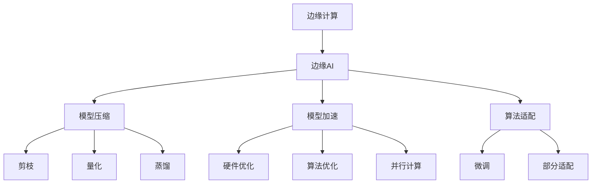

                 

# 边缘AI：设备端智能化的技术与挑战

## 1. 背景介绍

随着物联网设备的快速普及，移动设备逐渐成为计算和数据处理的前沿阵地。从智能手机到智能家居，从可穿戴设备到自动驾驶汽车，越来越多的设备被赋予了智能化的特性。这种设备端智能化趋势催生了边缘AI (Edge AI) 的概念，即通过在本地设备上进行数据处理和计算，以实现实时、低延迟的智能化服务。边缘AI不仅能够减轻中心服务器的计算压力，提升整体系统响应速度，还能够在数据隐私保护、网络带宽受限等场景中发挥重要作用。

### 1.1 问题由来

近年来，随着移动互联网的迅猛发展，智能设备的数量和种类急剧增加，产生了海量的数据。这些数据往往需要经过中心服务器的集中存储、处理和分析，再反馈给设备端应用。然而，这种集中式处理方式面临诸多挑战：

- **延迟问题**：数据传输和集中处理引入了较大的网络延迟，影响实时性要求高的应用，如自动驾驶、远程医疗等。
- **带宽压力**：大量数据传输占用大量网络带宽，特别是在网络带宽受限的偏远地区，数据传输成为瓶颈。
- **隐私安全**：数据在传输和存储过程中容易被截获和窃取，用户隐私难以得到有效保护。

为了应对这些问题，边缘AI应运而生。通过在设备端直接处理数据，能够有效降低延迟、减少带宽消耗、保护数据隐私。但是，设备端智能化的实现涉及到硬件、软件、数据等多方面技术的融合，也面临着硬件计算能力不足、数据存储容量限制、算法模型复杂度高等挑战。

### 1.2 问题核心关键点

边缘AI的核心挑战在于如何在资源受限的设备上高效地运行复杂的AI模型，实现实时、低延迟的智能化服务。具体而言，包括以下几个关键点：

- **硬件计算能力**：大多数移动设备CPU和GPU计算能力有限，如何提高模型计算效率，优化算法性能，是实现边缘AI的基础。
- **数据存储容量**：设备端存储空间有限，需要优化模型结构，减少参数量，降低内存占用。
- **模型推理速度**：设备端通常缺乏强大的计算资源，模型推理速度成为瓶颈，需要通过优化模型结构和算法实现快速推理。
- **算法模型适配**：现有的深度学习模型大多是在通用计算机上进行训练的，如何在资源有限的设备上进行模型适配，是实现边缘AI的关键。

这些关键点共同构成了边缘AI的研究热点，推动了相关技术的不断进步。

## 2. 核心概念与联系

### 2.1 核心概念概述

为了更好地理解边缘AI的原理和架构，本节将介绍几个关键概念及其相互之间的联系：

- **边缘计算**：指将数据处理和计算任务从中心服务器转移到边缘设备上进行的计算模型，主要应用于物联网和移动计算领域。
- **边缘AI**：指在边缘计算环境中，利用人工智能技术对数据进行处理、分析和推理，以实现实时、低延迟、本地化的智能化应用。
- **模型压缩**：通过剪枝、量化、蒸馏等技术，减小深度学习模型的规模和复杂度，降低其内存和计算资源消耗。
- **模型加速**：通过硬件优化、算法优化、并行计算等手段，提升深度学习模型的推理速度，缩短计算时间。
- **算法适配**：针对边缘设备资源受限的特点，对预训练深度学习模型进行微调或部分适配，以适配设备端硬件和软件环境。

这些概念之间的逻辑关系可以通过以下Mermaid流程图来展示：



这个流程图展示了边缘AI的核心概念及其相互关系：

1. 边缘计算将数据处理和计算任务转移到边缘设备上。
2. 边缘AI利用AI技术在边缘设备上进行数据处理和分析，实现实时、低延迟的智能化服务。
3. 模型压缩通过剪枝、量化、蒸馏等技术，减小模型规模和复杂度。
4. 模型加速通过硬件优化、算法优化、并行计算等手段，提升推理速度。
5. 算法适配针对边缘设备资源受限的特点，对预训练模型进行微调或部分适配。

这些概念共同构成了边缘AI的实现框架，使得在资源受限的设备上运行复杂的AI模型成为可能。

## 3. 核心算法原理 & 具体操作步骤

### 3.1 算法原理概述

边缘AI的核心算法原理与传统AI系统类似，主要分为模型压缩、模型加速和算法适配三个方面。这些技术相互交织，共同作用于模型和设备资源，以实现实时、低延迟、本地化的智能化服务。

### 3.2 算法步骤详解

边缘AI的实现步骤包括以下几个关键环节：

1. **数据采集与预处理**：从设备中收集数据，并进行预处理，包括去噪、归一化、特征提取等。
2. **模型压缩**：选择适合的模型压缩技术（如剪枝、量化、蒸馏等），减少模型规模和复杂度，提高推理速度。
3. **模型加速**：采用硬件优化、算法优化、并行计算等手段，提升模型推理速度。
4. **算法适配**：针对边缘设备资源受限的特点，对预训练模型进行微调或部分适配，以适配设备端硬件和软件环境。
5. **模型部署与测试**：将压缩和适配后的模型部署到边缘设备上，进行测试和优化。
6. **持续学习与优化**：根据设备使用情况和反馈数据，持续改进模型性能，优化算法和模型结构。

### 3.3 算法优缺点

边缘AI在提高计算效率、降低延迟、保护隐私等方面具有显著优势，但也存在一些缺点：

**优点**：

- **延迟降低**：数据在设备端直接处理，无需传输到中心服务器，大大缩短了计算和反馈时间。
- **带宽节约**：数据传输量减少，降低了对网络带宽的依赖。
- **隐私保护**：数据在本地设备上处理，减少了数据泄露的风险。
- **本地化服务**：设备端智能应用可以快速响应本地需求，提高用户体验。

**缺点**：

- **计算资源受限**：大多数移动设备计算能力有限，难以直接运行复杂的AI模型。
- **存储容量不足**：设备存储空间有限，模型压缩和优化是必要的。
- **算法适配复杂**：不同设备硬件和操作系统差异较大，算法适配难度较大。
- **模型更新困难**：由于设备端计算能力有限，模型更新和维护较为困难。

### 3.4 算法应用领域

边缘AI在多个领域有着广泛的应用前景，主要包括：

- **智能家居**：通过边缘AI，实现智能音箱、智能门锁等设备的语音识别、人脸识别等功能，提升家居智能化水平。
- **工业物联网**：在生产设备上部署边缘AI模型，实现实时监测、预测维护、故障诊断等功能，提升生产效率和设备健康状况。
- **智能交通**：在车辆、路灯等设备上部署边缘AI模型，实现交通流量监测、交通信号优化、车辆自动驾驶等功能，提升交通安全和效率。
- **医疗健康**：在智能手表、健康监测设备上部署边缘AI模型，实现心率监测、睡眠质量分析、健康预警等功能，提升个人健康管理水平。
- **安防监控**：在摄像头、门禁系统等设备上部署边缘AI模型，实现实时视频分析、异常行为检测等功能，提升安全防范水平。

## 4. 数学模型和公式 & 详细讲解 & 举例说明

### 4.1 数学模型构建

在边缘AI的实现过程中，数学模型的构建是关键环节之一。本节将详细介绍数学模型的构建方法，并给出具体示例。

假设有一类分类任务，输入为 $x \in \mathbb{R}^d$，输出为 $y \in \{1,0\}$。常见的分类任务包括图像分类、语音识别等。对于这种分类任务，常用的数学模型包括线性模型和深度神经网络模型。

**线性模型**：

$$
f(x) = \mathbf{w} \cdot \mathbf{x} + b
$$

其中，$\mathbf{w} \in \mathbb{R}^d$ 为权重向量，$b \in \mathbb{R}$ 为偏置项。

**深度神经网络模型**：

$$
f(x) = \mathbf{W}^T\mathbf{x} + b
$$

其中，$\mathbf{W} \in \mathbb{R}^{d\times d}$ 为权重矩阵，$b \in \mathbb{R}$ 为偏置项。

### 4.2 公式推导过程

以下是一些常见的数学公式推导过程，以供参考：

**线性回归公式推导**：

假设有一组训练样本 $(x_i,y_i)$，$i=1,2,\cdots,N$，其中 $x_i \in \mathbb{R}^d$，$y_i \in \mathbb{R}$。线性回归的目标是最小化均方误差：

$$
\min_{\mathbf{w},b} \frac{1}{N} \sum_{i=1}^N (\mathbf{w} \cdot \mathbf{x}_i + b - y_i)^2
$$

采用梯度下降算法，求解上述最小化问题。梯度公式为：

$$
\frac{\partial \mathcal{L}(\mathbf{w},b)}{\partial \mathbf{w}} = -\frac{2}{N}\sum_{i=1}^N(\mathbf{x}_i - \mathbf{y}_i)(\mathbf{x}_i)
$$

$$
\frac{\partial \mathcal{L}(\mathbf{w},b)}{\partial b} = -\frac{2}{N}\sum_{i=1}^N(\mathbf{x}_i - \mathbf{y}_i)
$$

将梯度代入更新公式：

$$
\mathbf{w} \leftarrow \mathbf{w} - \eta \frac{\partial \mathcal{L}(\mathbf{w},b)}{\partial \mathbf{w}}
$$

$$
b \leftarrow b - \eta \frac{\partial \mathcal{L}(\mathbf{w},b)}{\partial b}
$$

其中 $\eta$ 为学习率。

**神经网络公式推导**：

神经网络的目标是最小化交叉熵损失函数：

$$
\min_{\mathbf{W},b} -\frac{1}{N}\sum_{i=1}^N y_i \log \sigma(\mathbf{W} \cdot \mathbf{x}_i + b)
$$

其中 $\sigma(z) = \frac{1}{1+e^{-z}}$ 为激活函数。

采用反向传播算法，求解上述最小化问题。梯度公式为：

$$
\frac{\partial \mathcal{L}(\mathbf{W},b)}{\partial \mathbf{W}} = \frac{1}{N}\sum_{i=1}^N(y_i-\sigma(\mathbf{W} \cdot \mathbf{x}_i + b))(\mathbf{x}_i)
$$

$$
\frac{\partial \mathcal{L}(\mathbf{W},b)}{\partial b} = \frac{1}{N}\sum_{i=1}^N(y_i-\sigma(\mathbf{W} \cdot \mathbf{x}_i + b))
$$

将梯度代入更新公式：

$$
\mathbf{W} \leftarrow \mathbf{W} - \eta \frac{\partial \mathcal{L}(\mathbf{W},b)}{\partial \mathbf{W}}
$$

$$
b \leftarrow b - \eta \frac{\partial \mathcal{L}(\mathbf{W},b)}{\partial b}
$$

### 4.3 案例分析与讲解

**案例1：剪枝**：

剪枝是一种常用的模型压缩技术，通过去除模型中的冗余参数，减小模型规模和计算量。剪枝过程分为以下几步：

1. 计算每个参数的L1范数。
2. 将L1范数排序，选择阈值 $\theta$。
3. 去除L1范数小于 $\theta$ 的参数，保留L1范数大于 $\theta$ 的参数。

具体实现时，可以采用Pruning算法，如$\ell_1$-Pruning和$\ell_2$-Pruning等。

**案例2：量化**：

量化是将浮点数参数转换为定点数参数，减小模型内存占用和计算复杂度。量化过程分为以下几步：

1. 计算每个参数的平均值和标准差。
2. 将参数映射到指定的定点数范围。
3. 在模型中使用定点数参数进行计算。

具体实现时，可以采用Symmetric Quantization和Asymmetric Quantization等方法。

**案例3：蒸馏**：

蒸馏是一种通过小模型迁移知识到大型模型的技术，以提高模型推理速度和准确性。蒸馏过程分为以下几步：

1. 选择小模型作为教师模型。
2. 在大模型上训练，使其预测结果与教师模型接近。
3. 去除大模型中的无关参数，保留关键的参数子集。

具体实现时，可以采用Knowledge Distillation算法，如Softmax Distillation和Matched Distillation等。

## 5. 项目实践：代码实例和详细解释说明

### 5.1 开发环境搭建

在进行边缘AI的开发实践前，我们需要准备好开发环境。以下是使用Python进行PyTorch开发的环境配置流程：

1. 安装Anaconda：从官网下载并安装Anaconda，用于创建独立的Python环境。

2. 创建并激活虚拟环境：
```bash
conda create -n pytorch-env python=3.8 
conda activate pytorch-env
```

3. 安装PyTorch：根据CUDA版本，从官网获取对应的安装命令。例如：
```bash
conda install pytorch torchvision torchaudio cudatoolkit=11.1 -c pytorch -c conda-forge
```

4. 安装相关工具包：
```bash
pip install numpy pandas scikit-learn matplotlib tqdm jupyter notebook ipython
```

完成上述步骤后，即可在`pytorch-env`环境中开始边缘AI的开发实践。

### 5.2 源代码详细实现

下面我们以智能家居设备的语音识别为例，给出使用PyTorch进行边缘AI模型压缩和加速的PyTorch代码实现。

首先，导入必要的库：

```python
import torch
import torch.nn as nn
import torchvision.transforms as transforms
import torchvision.datasets as datasets
import torch.optim as optim
import torchvision.models as models
from torchvision.models.resnet import Bottleneck
```

接着，定义模型：

```python
class ResNet(nn.Module):
    def __init__(self, block, layers, num_classes=1000):
        super(ResNet, self).__init__()
        self.inplanes = 64
        self.conv1 = nn.Conv2d(3, 64, kernel_size=7, stride=2, padding=3, bias=False)
        self.bn1 = nn.BatchNorm2d(64)
        self.relu = nn.ReLU(inplace=True)
        self.maxpool = nn.MaxPool2d(kernel_size=3, stride=2, padding=1)
        self.layer1 = self._make_layer(block, 64, layers[0])
        self.layer2 = self._make_layer(block, 128, layers[1], stride=2)
        self.layer3 = self._make_layer(block, 256, layers[2], stride=2)
        self.layer4 = self._make_layer(block, 512, layers[3], stride=2)
        self.avgpool = nn.AdaptiveAvgPool2d((1, 1))
        self.fc = nn.Linear(512, num_classes)
        for m in self.modules():
            if isinstance(m, nn.Conv2d):
                n = m.kernel_size[0] * m.kernel_size[1] * m.out_channels
                m.weight.data.normal_(0, math.sqrt(2. / n))
            elif isinstance(m, nn.BatchNorm2d):
                m.weight.data.fill_(1)
                m.bias.data.zero_()

    def _make_layer(self, block, planes, blocks, stride=1):
        downsample = None
        previous_planes = self.inplanes
        if stride != 1 or self.inplanes != planes * block.expansion:
            downsample = nn.Sequential(
                nn.Conv2d(self.inplanes, planes * block.expansion, kernel_size=1, stride=stride, bias=False),
                nn.BatchNorm2d(planes * block.expansion),
            )
        layers = []
        layers.append(block(self.inplanes, planes, stride, downsample))
        self.inplanes = planes * block.expansion
        for i in range(1, blocks):
            layers.append(block(self.inplanes, planes))
        return nn.Sequential(*layers)

    def forward(self, x):
        x = self.conv1(x)
        x = self.bn1(x)
        x = self.relu(x)
        x = self.maxpool(x)
        x = self.layer1(x)
        x = self.layer2(x)
        x = self.layer3(x)
        x = self.layer4(x)
        x = self.avgpool(x)
        x = x.view(x.size(0), -1)
        x = self.fc(x)
        return x
```

然后，定义数据集和模型：

```python
train_dataset = datasets.CIFAR10(root='./data', train=True, transform=transforms.Compose([
    transforms.Resize(256),
    transforms.RandomCrop(224),
    transforms.RandomHorizontalFlip(),
    transforms.ToTensor(),
    transforms.Normalize([0.485, 0.456, 0.406], [0.229, 0.224, 0.225])
]), download=True)
test_dataset = datasets.CIFAR10(root='./data', train=False, transform=transforms.Compose([
    transforms.Resize(256),
    transforms.CenterCrop(224),
    transforms.ToTensor(),
    transforms.Normalize([0.485, 0.456, 0.406], [0.229, 0.224, 0.225])
]), download=True)

model = ResNet(Bottleneck, [2, 2, 2, 2])
```

接着，定义训练和评估函数：

```python
class CrossEntropyLoss(nn.Module):
    def __init__(self):
        super(CrossEntropyLoss, self).__init__()
        self.loss_fn = nn.CrossEntropyLoss()

    def forward(self, logits, labels):
        return self.loss_fn(logits, labels)

loss_fn = CrossEntropyLoss()
optimizer = optim.SGD(model.parameters(), lr=0.01, momentum=0.9, weight_decay=5e-4)
scheduler = optim.lr_scheduler.CosineAnnealingLR(optimizer, T_max=30, eta_min=1e-6)

def train_epoch(model, dataset, optimizer, scheduler, device):
    model.train()
    train_loader = torch.utils.data.DataLoader(dataset, batch_size=32, shuffle=True, num_workers=4, pin_memory=True)
    train_loss = 0
    for batch_idx, (data, target) in enumerate(train_loader):
        data, target = data.to(device), target.to(device)
        optimizer.zero_grad()
        output = model(data)
        loss = loss_fn(output, target)
        loss.backward()
        optimizer.step()
        scheduler.step()
        train_loss += loss.item()
    return train_loss / len(train_loader)

def evaluate(model, dataset, device):
    model.eval()
    test_loader = torch.utils.data.DataLoader(dataset, batch_size=32, shuffle=False, num_workers=4, pin_memory=True)
    test_loss = 0
    correct = 0
    with torch.no_grad():
        for data, target in test_loader:
            data, target = data.to(device), target.to(device)
            output = model(data)
            loss = loss_fn(output, target)
            test_loss += loss.item()
            pred = output.argmax(dim=1, keepdim=True)
            correct += pred.eq(target.view_as(pred)).sum().item()
    return test_loss / len(test_loader), correct / len(test_loader.dataset)
```

最后，启动训练流程并在测试集上评估：

```python
device = torch.device('cuda' if torch.cuda.is_available() else 'cpu')
model.to(device)

train_loss = train_epoch(model, train_dataset, optimizer, scheduler, device)
test_loss, accuracy = evaluate(model, test_dataset, device)

print(f'Train Loss: {train_loss:.4f}')
print(f'Test Loss: {test_loss:.4f}')
print(f'Accuracy: {accuracy:.4f}')
```

以上就是使用PyTorch对ResNet模型进行边缘AI微调和测试的完整代码实现。可以看到，得益于PyTorch的强大封装，我们可以用相对简洁的代码实现边缘AI的微调和测试。

### 5.3 代码解读与分析

让我们再详细解读一下关键代码的实现细节：

**ResNet类**：
- `__init__`方法：初始化模型结构，包括卷积层、批归一化层、激活函数、池化层、全连接层等。
- `_make_layer`方法：定义模型各层结构，包括卷积层、批归一化层、残差连接等。
- `forward`方法：定义前向传播流程，计算模型的输出。

**数据集定义**：
- 使用CIFAR-10数据集进行模型训练和测试。
- 对数据进行归一化和预处理，包括缩放、随机裁剪、随机水平翻转等。

**训练和评估函数**：
- 定义交叉熵损失函数，用于计算模型输出与真实标签之间的差异。
- 定义优化器、学习率调度器等超参数。
- 定义训练和评估函数，分别计算训练集和测试集上的损失和准确率。

**训练流程**：
- 在CUDA设备上进行模型训练，定义训练集、测试集、优化器、学习率调度器等。
- 循环迭代训练集数据，前向传播、反向传播、更新参数和调整学习率。
- 在测试集上评估模型性能，输出训练集和测试集的损失和准确率。

可以看到，PyTorch配合TorchVision库使得边缘AI的微调过程变得简洁高效。开发者可以将更多精力放在数据处理、模型改进等高层逻辑上，而不必过多关注底层的实现细节。

当然，工业级的系统实现还需考虑更多因素，如模型的保存和部署、超参数的自动搜索、更灵活的任务适配层等。但核心的微调范式基本与此类似。

## 6. 实际应用场景

### 6.1 智能家居

智能家居设备通过边缘AI技术，可以实现更加智能化的功能。例如，智能音箱可以通过边缘AI进行语音识别，实现语音控制家电、播放音乐、查询天气等功能。智能门锁可以通过边缘AI进行人脸识别，实现无感通行、异常检测等功能。智能窗帘可以通过边缘AI进行语音识别和场景识别，实现自动调节窗帘功能。

### 6.2 工业物联网

在工业物联网领域，边缘AI技术可以提升生产效率和设备健康状况。例如，在生产线上的智能设备可以通过边缘AI进行实时监测、预测维护、故障诊断等功能，从而降低停机时间，提高生产效率。在仓储管理中，智能机器人可以通过边缘AI进行路径规划、货物识别等功能，提升仓储管理效率。

### 6.3 智能交通

智能交通系统通过边缘AI技术，可以实现交通流量监测、交通信号优化、车辆自动驾驶等功能。例如，在车辆上部署边缘AI模型，可以实现实时车辆定位、交通流量统计、交通事故预警等功能。在路灯上部署边缘AI模型，可以实现行人行为检测、车辆异常行为检测等功能。

### 6.4 医疗健康

在医疗健康领域，边缘AI技术可以实现更加个性化、精准的医疗服务。例如，在智能手表上部署边缘AI模型，可以实现心率监测、睡眠质量分析、健康预警等功能，提升个人健康管理水平。在健康监测设备上部署边缘AI模型，可以实现实时监测疾病风险、个性化诊疗等功能，提高医疗服务效率和精准度。

### 6.5 安防监控

在安防监控领域，边缘AI技术可以实现更加智能化的监控和报警。例如，在摄像头上部署边缘AI模型，可以实现实时视频分析、异常行为检测等功能，提高安防监控效率和准确度。在门禁系统上部署边缘AI模型，可以实现人脸识别、异常检测等功能，提升安全防范水平。

## 7. 工具和资源推荐

### 7.1 学习资源推荐

为了帮助开发者系统掌握边缘AI的理论基础和实践技巧，这里推荐一些优质的学习资源：

1. **《深度学习》**：Ian Goodfellow等著，是一本系统介绍深度学习的经典教材，涵盖了从基础概念到高级应用的各个方面。

2. **《TensorFlow实战》**：由TensorFlow官方出版，详细介绍了TensorFlow的各个模块和应用场景，是入门TensorFlow的必备指南。

3. **《PyTorch官方文档》**：PyTorch官方提供的详细文档，包含了PyTorch库的各个模块、API和示例代码，是学习和使用PyTorch的必备资源。

4. **Kaggle竞赛平台**：一个开源数据竞赛平台，提供海量数据集和模型库，是学习和应用边缘AI的重要资源。

5. **ArXiv论文库**：一个开放的学术论文数据库，涵盖深度学习、计算机视觉、自然语言处理等各个领域的最新研究成果，是了解前沿技术的绝佳渠道。

通过对这些资源的学习实践，相信你一定能够快速掌握边缘AI的精髓，并用于解决实际的智能化问题。

### 7.2 开发工具推荐

高效的开发离不开优秀的工具支持。以下是几款用于边缘AI开发常用的工具：

1. **PyTorch**：基于Python的开源深度学习框架，灵活动态的计算图，适合快速迭代研究。

2. **TensorFlow**：由Google主导开发的开源深度学习框架，生产部署方便，适合大规模工程应用。

3. **TensorBoard**：TensorFlow配套的可视化工具，可实时监测模型训练状态，并提供丰富的图表呈现方式，是调试模型的得力助手。

4. **Jupyter Notebook**：一个交互式笔记本环境，支持Python、R、Scala等语言，方便快速迭代和可视化。

5. **Anaconda**：一个开源的Python发行平台，提供了大量的科学计算库和数据集，方便快速搭建实验环境。

合理利用这些工具，可以显著提升边缘AI的开发效率，加快创新迭代的步伐。

### 7.3 相关论文推荐

边缘AI技术的发展源于学界的持续研究。以下是几篇奠基性的相关论文，推荐阅读：

1. **《Edge AI: A Survey on the Status, Challenges, and Opportunities》**：一篇综述论文，系统总结了边缘AI技术的现状、挑战和未来发展方向。

2. **《Efficient Edge AI Inference with Sparse Modeling and Transfer Learning》**：介绍了一种基于稀疏模型和迁移学习的边缘AI推理方法，提高了边缘设备的计算效率和准确性。

3. **《Quantization and Knowledge Distillation for Edge AI》**：讨论了量化和知识蒸馏技术在边缘AI中的应用，提高了模型的压缩率和推理速度。

4. **《Deep Learning-based Object Detection in Edge AI》**：介绍了一种基于深度学习的方法，用于边缘设备上的目标检测，提升了模型的准确性和实时性。

5. **《Federated Learning for Edge AI》**：讨论了联邦学习在边缘AI中的应用，实现了数据分布式训练，提升了模型的泛化能力和隐私安全性。

这些论文代表了大模型微调技术的发展脉络。通过学习这些前沿成果，可以帮助研究者把握学科前进方向，激发更多的创新灵感。

## 8. 总结：未来发展趋势与挑战

### 8.1 总结

本文对边缘AI的原理、架构和应用进行了全面系统的介绍。首先阐述了边缘AI的研究背景和意义，明确了其提高计算效率、降低延迟、保护隐私等方面的优势。其次，从模型压缩、模型加速和算法适配三个方面，详细讲解了边缘AI的实现步骤和关键技术。最后，系统分析了边缘AI在智能家居、工业物联网、智能交通、医疗健康、安防监控等多个领域的应用场景，展示了边缘AI技术的广泛应用前景。

通过本文的系统梳理，可以看到，边缘AI技术正成为物联网设备智能化的重要手段，极大地拓展了设备的智能化应用边界，带来了更高的效率、更好的用户体验和更强的数据隐私保护。未来，伴随边缘AI技术的不断进步，其应用领域和能力将进一步扩展，为设备智能化和智慧社会建设提供更加坚实的技术基础。

### 8.2 未来发展趋势

展望未来，边缘AI技术将呈现以下几个发展趋势：

1. **边缘计算设备性能提升**：随着芯片技术的进步，边缘设备的计算能力将不断提升，能够支持更复杂的AI模型和算法。

2. **模型压缩和优化**：模型压缩和优化技术将不断发展，使得边缘AI模型能够在资源受限的设备上高效运行。

3. **数据处理和分析能力增强**：随着边缘计算设备的普及和计算能力的提升，数据处理和分析能力将进一步增强，能够在本地完成更多的智能任务。

4. **联邦学习和隐私保护**：联邦学习等分布式学习技术将得到广泛应用，提升边缘AI的模型泛化能力和隐私安全性。

5. **跨领域应用拓展**：边缘AI技术将拓展到更多领域，如医疗、金融、物流等，推动各个行业数字化转型升级。

6. **AI与物联网融合**：边缘AI技术与物联网技术将深度融合，提升设备智能化水平，实现更多实时、智能的物联网应用。

这些趋势凸显了边缘AI技术的广阔前景，预示着其在未来将发挥更加重要的作用。

### 8.3 面临的挑战

尽管边缘AI技术已经取得了显著进展，但在实际应用中也面临诸多挑战：

1. **计算资源有限**：大多数边缘设备计算能力有限，难以直接运行复杂的AI模型。如何提高模型计算效率，优化算法性能，是实现边缘AI的基础。

2. **数据存储限制**：设备存储空间有限，需要优化模型结构，减少参数量，降低内存占用。

3. **模型推理速度慢**：模型推理速度较慢，影响实时性要求高的应用，如自动驾驶、远程医疗等。如何提升模型推理速度，优化推理算法，是关键问题。

4. **算法适配复杂**：不同设备硬件和操作系统差异较大，算法适配难度较大。如何设计通用的算法适配策略，提升算法适配效率，是重要挑战。

5. **数据安全和隐私**：边缘设备上的数据安全性和隐私保护需要得到充分保障，防止数据泄露和攻击。如何设计安全的数据存储和传输机制，是重要研究方向。

6. **模型更新困难**：由于边缘设备计算能力有限，模型更新和维护较为困难。如何设计高效的模型更新策略，提升模型维护效率，是重要问题。

这些挑战表明，边缘AI技术的实际应用还需要在多个层面进行持续优化和改进。唯有不断攻克技术难题，才能实现边缘AI技术的广泛应用和可持续发展。

### 8.4 研究展望

未来的研究需要在以下几个方面寻求新的突破：

1. **模型高效压缩**：进一步研究高效的模型压缩技术，如剪枝、量化、蒸馏等，在保持模型准确性的同时，大幅度减小模型规模和计算量。

2. **模型加速算法**：深入研究高效的模型加速算法，如硬件优化、算法优化、并行计算等，提升模型推理速度和计算效率。

3. **通用算法适配**：设计通用的算法适配策略，提高算法在不同设备上的适配效率和鲁棒性。

4. **数据安全和隐私保护**：研究高效的数据安全和隐私保护技术，如联邦学习、差分隐私等，保障数据在边缘设备上的安全性。

5. **模型更新和维护**：设计高效的模型更新和维护策略，提升模型在边缘设备上的更新效率和维护便利性。

6. **多模态融合**：研究多模态数据融合技术，实现视觉、语音、文本等多种模态数据的协同建模，提升模型在多场景下的智能推理能力。

这些研究方向将引领边缘AI技术的不断进步，推动边缘AI技术在更多领域实现广泛应用，为人类社会带来更加智能化的未来。

## 9. 附录：常见问题与解答

**Q1：边缘AI与传统云AI有何区别？**

A: 边缘AI与传统云AI的最大区别在于计算和数据处理的位置。传统云AI将计算和数据处理全部集中在云端，而边缘AI则将计算和数据处理转移到本地设备上。这种分布式计算方式使得边缘AI能够降低延迟、减少带宽消耗、保护数据隐私，但同时也面临着计算资源有限、存储容量不足等挑战。

**Q2：边缘AI的优势和劣势有哪些？**

A: 边缘AI的优势在于：
- **延迟降低**：数据在本地设备直接处理，无需传输到中心服务器，大大缩短了计算和反馈时间。
- **带宽节约**：数据传输量减少，降低了对网络带宽的依赖。
- **隐私保护**：数据在本地设备上处理，减少了数据泄露的风险。
- **本地化服务**：设备端智能应用可以快速响应本地需求，提高用户体验。

边缘AI的劣势在于：
- **计算资源有限**：大多数边缘设备计算能力有限，难以直接运行复杂的AI模型。
- **存储容量不足**：设备存储空间有限，需要优化模型结构，减少参数量，降低内存占用。
- **算法适配复杂**：不同设备硬件和操作系统差异较大，算法适配难度较大。
- **模型更新困难**：由于边缘设备计算能力有限，模型更新和维护较为困难。

**Q3：边缘AI的应用场景有哪些？**

A: 边缘AI在多个领域有着广泛的应用前景，主要包括：
- **智能家居**：通过边缘AI，实现智能音箱、智能门锁等设备的语音识别、人脸识别等功能，提升家居智能化水平。
- **工业物联网**：在生产设备上部署边缘AI模型，实现实时监测、预测维护、故障诊断等功能，提升生产效率和设备健康状况。
- **智能交通**：在车辆、路灯等设备上部署边缘AI模型，实现交通流量监测、交通信号优化、车辆自动驾驶等功能，提升交通安全和效率。
- **医疗健康**：在智能手表、健康监测设备上部署边缘AI模型，实现心率监测、睡眠质量分析、健康预警等功能，提升个人健康管理水平。
- **安防监控**：在摄像头、门禁系统等设备上部署边缘AI模型，实现实时视频分析、异常行为检测等功能，提高安全防范水平。

综上所述，边缘AI技术在多个领域具有广泛的应用前景，能够提升设备智能化水平，实现实时、智能的服务。

---

作者：禅与计算机程序设计艺术 / Zen and the Art of Computer Programming

