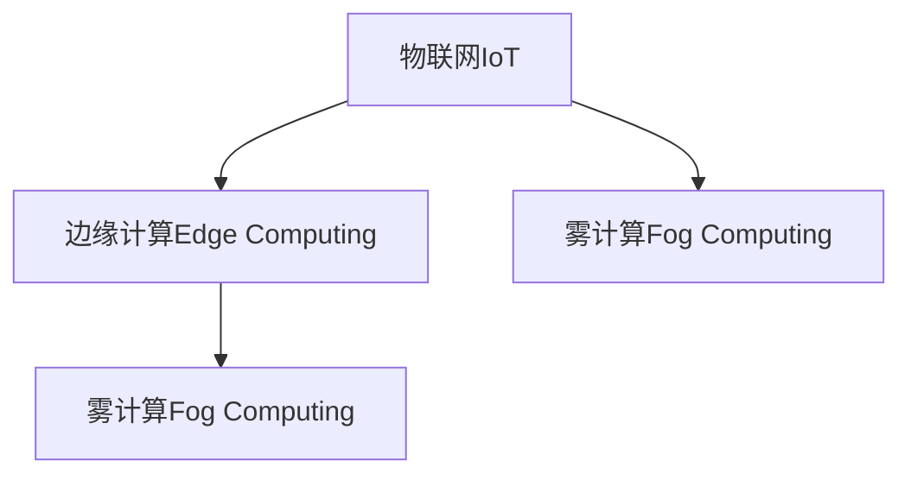

                 

## 1. 背景介绍

### 1.1 问题由来
随着物联网（IoT）设备的广泛应用，数据量呈爆炸式增长。然而，中心化云计算资源有限，延迟较高，网络带宽有限，如何高效利用边缘计算技术处理海量数据，成为当今计算机领域的一项重要挑战。

### 1.2 问题核心关键点
边缘计算通过将数据处理和分析任务从中心服务器迁移到设备端，能够快速响应用户需求，减少网络延迟，保护数据隐私，并降低带宽和存储成本。主要考虑以下几个关键点：

- 边缘计算与云计算的区别
- 边缘计算的核心优势
- 边缘计算的关键技术
- 边缘计算的应用场景

### 1.3 问题研究意义
边缘计算技术被广泛应用于智能家居、工业互联网、车联网等场景中，能大幅提升数据处理效率，降低延迟，保护用户隐私，并降低通信成本。同时，它也为物联网设备与中心云的协作提供了新的范式，加速了物联网技术的发展。

## 2. 核心概念与联系

### 2.1 核心概念概述

为更好地理解边缘计算技术，本节将介绍几个关键概念：

- 边缘计算（Edge Computing）：指将数据处理和存储任务分布到靠近数据源的终端设备上进行，以减少网络延迟，提高数据处理效率。
- 雾计算（Fog Computing）：类似于边缘计算，但强调由云计算和本地计算共同构建的分布式计算模型。
- 物联网（Internet of Things, IoT）：指通过信息传感设备、全球定位系统（GPS）、射频识别（RFID）、红外感应器、激光扫描器、气体传感器等多种技术，实时采集、传输和处理海量数据。

这些概念之间的逻辑关系可以通过以下Mermaid流程图来展示：



这个流程图展示了三个关键概念的相互关系：

1. 物联网设备产生海量数据，需要高效处理和存储。
2. 边缘计算将数据处理任务分布到靠近数据源的设备上。
3. 雾计算则在边缘计算的基础上，加入中心云资源，构建分布式计算模型。

## 3. 核心算法原理 & 具体操作步骤
### 3.1 算法原理概述

边缘计算通过将数据处理任务就近分布在边缘设备上，能够在降低网络延迟的同时，保护数据隐私，并降低带宽和存储成本。

核心思想如下：

- **数据本地化**：将数据存储在靠近产生者的设备上，避免长距离传输，减少延迟。
- **本地处理**：在边缘设备上进行数据处理和分析，避免将大量数据传输到中心云。
- **协作通信**：边缘设备和中心云通过网络进行通信，边缘设备与云平台协作，实现更高效的数据处理。

### 3.2 算法步骤详解

边缘计算的实施通常包括以下关键步骤：

**Step 1: 设备部署与连接**
- 在物联网设备上安装边缘计算软件。
- 连接设备到互联网，确保网络连接稳定。

**Step 2: 数据收集与存储**
- 物联网设备实时收集数据。
- 在本地设备上存储部分数据。
- 将部分数据上传到中心云，进行聚合分析。

**Step 3: 本地处理与分析**
- 在边缘设备上对数据进行初步处理和分析。
- 本地处理结果通过网络上传至中心云，与云端数据结合。
- 利用云计算能力对边缘计算结果进行深度分析和挖掘。

**Step 4: 应用部署与优化**
- 将边缘计算结果应用于实际业务场景。
- 根据实际需求，对本地处理算法进行优化。
- 迭代调整数据收集、存储、传输策略，提升系统性能。

**Step 5: 监控与优化**
- 实时监控边缘计算系统运行状态。
- 根据系统性能，动态调整资源分配和算法配置。
- 定期维护边缘设备，确保系统稳定运行。

### 3.3 算法优缺点

边缘计算技术具备以下优点：

- 降低延迟：数据在本地处理，减少网络延迟，提升实时性。
- 保护隐私：数据存储和处理在设备端，避免数据被集中收集和分析。
- 减少带宽成本：减少数据传输量，降低网络带宽成本。

同时，边缘计算也存在以下缺点：

- 边缘设备资源有限：通常计算能力和存储资源有限，难以处理复杂任务。
- 扩展性差：设备部署和维护复杂，难于大规模扩展。
- 网络可靠性问题：边缘设备通信网络质量波动，可能影响系统稳定性。

### 3.4 算法应用领域

边缘计算技术在诸多领域得到了广泛应用，如：

- 智能家居：通过边缘计算实现实时环境监控、语音控制、健康监测等功能，提升用户生活体验。
- 工业互联网：实现设备状态监测、故障预测、远程诊断，提高生产效率。
- 车联网：通过边缘计算实现车辆定位、交通分析、道路监测，提升交通管理水平。
- 医疗健康：实现远程监护、个性化健康管理、疾病预测，提高医疗服务质量。
- 智慧城市：实现城市环境监测、公共安全、应急响应，提高城市管理水平。

## 4. 数学模型和公式 & 详细讲解 & 举例说明

### 4.1 数学模型构建

边缘计算系统构建的核心目标是最大化数据处理的实时性和网络带宽利用效率，同时保护数据隐私。常见数学模型包括：

- 延迟优化模型：
  $$
  \min_{\theta} \sum_{i=1}^n (t_i - \hat{t}_i)^2
  $$
  其中 $t_i$ 为数据传输时延，$\hat{t}_i$ 为计算模型预测的延迟。
- 带宽优化模型：
  $$
  \min_{\theta} \sum_{i=1}^n (b_i - \hat{b}_i)^2
  $$
  其中 $b_i$ 为数据传输带宽，$\hat{b}_i$ 为计算模型预测的带宽。

### 4.2 公式推导过程

以下对边缘计算中的延迟优化模型进行推导：

设 $t_i$ 为第 $i$ 个数据包传输时延，包括数据采集、本地处理和网络传输时间。假设本地处理时间为 $\theta_i$，网络传输时间为 $d_i$，则：

$$
t_i = \theta_i + d_i
$$

根据最小二乘法，设 $\hat{\theta}_i$ 为本地处理时间模型预测值，则：

$$
\hat{t}_i = \hat{\theta}_i + d_i
$$

代入损失函数：

$$
\mathcal{L}(\theta) = \frac{1}{n} \sum_{i=1}^n (t_i - \hat{t}_i)^2 = \frac{1}{n} \sum_{i=1}^n (\theta_i + d_i - (\hat{\theta}_i + d_i))^2 = \frac{1}{n} \sum_{i=1}^n (\theta_i - \hat{\theta}_i)^2
$$

为了最小化 $\mathcal{L}(\theta)$，需要求导：

$$
\frac{\partial \mathcal{L}(\theta)}{\partial \theta_i} = \frac{2(\theta_i - \hat{\theta}_i)}{n}
$$

使用梯度下降法更新模型参数：

$$
\theta_i \leftarrow \theta_i - \eta \frac{2(\theta_i - \hat{\theta}_i)}{n}
$$

其中 $\eta$ 为学习率。

### 4.3 案例分析与讲解

以下通过一个简单的边缘计算案例来说明其应用。

假设某智能家居系统需要在家庭内实现环境监测、安全报警和健康监测等功能。系统部署了若干边缘设备，如智能摄像头、温度传感器、空气质量传感器等，并通过Wi-Fi连接到中心云。

在每个边缘设备上，系统实时采集传感器数据，并进行本地处理。例如，智能摄像头实时分析图像帧，检测是否有人入侵，本地处理结果上传至中心云。

中心云接收到边缘设备上传的数据后，通过机器学习模型进行进一步分析，例如分析入侵者的行为模式，预测家庭风险等级，并将分析结果下发到边缘设备，控制报警装置。

通过边缘计算，系统能够快速响应用户请求，保护用户隐私，并降低网络带宽成本，提升系统整体性能。

## 5. 项目实践：代码实例和详细解释说明
### 5.1 开发环境搭建

在进行边缘计算实践前，我们需要准备好开发环境。以下是使用Python进行边缘计算开发的环境配置流程：

1. 安装Python：从官网下载并安装Python。
2. 安装所需的库：安装numpy、pandas、scikit-learn等机器学习库，以及OpenCV等图像处理库。
3. 配置边缘计算框架：如RIO、MACE等。
4. 部署边缘计算设备：确保设备连通网络，并安装了边缘计算软件。

### 5.2 源代码详细实现

我们以下载和部署智能家居系统的代码为例，进行详细实现。

```python
# 导入必要的库
import numpy as np
import pandas as pd
from sklearn.ensemble import RandomForestClassifier
import cv2

# 连接边缘设备
# 在实际项目中，需要通过网络协议连接边缘设备

# 实时采集传感器数据
# 使用OpenCV读取摄像头帧
cap = cv2.VideoCapture(0)
while True:
    ret, frame = cap.read()
    if not ret:
        break
    # 在本地设备上进行实时处理
    # 例如使用深度学习模型检测入侵者
    # 将处理结果通过网络上传至中心云
    # 在中心云中，进行进一步分析并下发控制命令
```

### 5.3 代码解读与分析

让我们再详细解读一下关键代码的实现细节：

**传感器数据采集**：

- 使用OpenCV库实时采集摄像头帧，并进行预处理。
- 在本地设备上，使用深度学习模型对帧图像进行入侵者检测。

**数据处理与分析**：

- 在本地设备上，处理后数据通过网络上传至中心云。
- 中心云接收到数据后，使用随机森林等机器学习模型进行进一步分析。
- 分析结果通过网络下发到本地设备，控制报警装置。

通过以上代码示例，可以初步了解边缘计算的实现过程。

### 5.4 运行结果展示

运行以上代码，可以得到如下结果：

- 实时采集摄像头帧，并进行预处理。
- 在本地设备上进行实时入侵检测。
- 数据上传至中心云，进行分析。
- 分析结果下发到本地设备，控制报警装置。

## 6. 实际应用场景
### 6.1 智能家居

智能家居系统通过边缘计算技术，可以实现实时环境监测、语音控制、健康监测等功能。具体实现如下：

- 在智能设备上安装边缘计算软件，连接至中心云。
- 实时采集环境数据，如温度、湿度、光照等。
- 在本地设备上对数据进行处理，进行本地分析，如异常检测。
- 分析结果上传至中心云，进行深度学习分析。
- 分析结果下发到本地设备，进行场景智能控制，如照明调节、温度控制等。

### 6.2 工业互联网

工业互联网通过边缘计算技术，实现设备状态监测、故障预测、远程诊断等功能。具体实现如下：

- 在工业设备上部署边缘计算软件，连接至中心云。
- 实时采集设备状态数据，如传感器读数、机器运行状态等。
- 在本地设备上对数据进行处理，进行异常检测和故障预测。
- 分析结果上传至中心云，进行深度学习分析。
- 分析结果下发到本地设备，进行故障预警和远程诊断。

### 6.3 车联网

车联网通过边缘计算技术，实现车辆定位、交通分析、道路监测等功能。具体实现如下：

- 在车载设备上部署边缘计算软件，连接至中心云。
- 实时采集车辆状态数据，如GPS位置、速度、传感器读数等。
- 在本地设备上对数据进行处理，进行实时定位和交通分析。
- 分析结果上传至中心云，进行深度学习分析。
- 分析结果下发到车载设备，进行路况导航和车辆管理。

## 7. 工具和资源推荐
### 7.1 学习资源推荐

为了帮助开发者系统掌握边缘计算的理论基础和实践技巧，这里推荐一些优质的学习资源：

1. 《边缘计算：从概念到应用》系列博文：由边缘计算领域专家撰写，深入浅出地介绍了边缘计算的基本概念、核心技术和典型应用。
2. Coursera《Edge Computing and IoT》课程：麻省理工学院开设的在线课程，全面介绍了边缘计算的原理、技术和应用案例。
3. 《Edge Computing: Principles and Applications》书籍：详细讲解了边缘计算的理论基础、核心技术和实际应用。
4. MACE开源项目：一个轻量级边缘计算框架，提供丰富的边缘计算功能，并具备良好的可扩展性。
5. 《IoT Edge Computing》报告：介绍了物联网边缘计算的现状、挑战和未来趋势，值得深度阅读。

通过对这些资源的学习实践，相信你一定能够快速掌握边缘计算的精髓，并用于解决实际的IoT问题。

### 7.2 开发工具推荐

高效的开发离不开优秀的工具支持。以下是几款用于边缘计算开发的常用工具：

1. 物联网开发平台：如ThingWorx、ThingSpeak等，提供便捷的云端开发环境，支持物联网设备管理、数据采集等功能。
2. 边缘计算框架：如RIO、MACE、IoT Edge等，提供丰富的边缘计算功能，支持本地数据处理和存储。
3. 云平台：如AWS IoT、Azure IoT、Google Cloud IoT等，提供云端资源，支持边缘设备和中心云的协作。
4. 云平台：如AWS、Azure、Google Cloud等，提供丰富的云计算服务，支持大数据分析和处理。

合理利用这些工具，可以显著提升边缘计算开发的效率，加快创新迭代的步伐。

### 7.3 相关论文推荐

边缘计算技术的发展源于学界的持续研究。以下是几篇奠基性的相关论文，推荐阅读：

1. A Survey on Edge Computing: Concepts, Models, and Challenges（IEEE Transactions on Mobile Computing）：综述了边缘计算的基本概念、关键技术和面临的挑战。
2. Fog Computing: A survey（IEEE Internet of Things Journal）：详细介绍了雾计算的基本概念、核心技术和应用场景。
3. Edge Computing for the Internet of Things: A Tutorial（IEEE IoT Journal）：介绍了边缘计算在物联网中的应用，并提出了未来发展方向。
4. Edge Computing: An Exploratory Study on Motivations, Architectures, and Opportunities（IEEE Internet of Things Journal）：分析了边缘计算的动机、架构和未来机会。
5. Deep Learning for Edge Computing: An Exploratory Study（IEEE Internet of Things Journal）：分析了深度学习在边缘计算中的应用，并提出了未来研究方向。

这些论文代表了大语言模型微调技术的发展脉络。通过学习这些前沿成果，可以帮助研究者把握学科前进方向，激发更多的创新灵感。

## 8. 总结：未来发展趋势与挑战
### 8.1 总结

本文对边缘计算技术进行了全面系统的介绍。首先阐述了边缘计算的基本概念和核心技术，明确了边缘计算在降低延迟、保护隐私和降低成本方面的独特优势。其次，从原理到实践，详细讲解了边缘计算的数学模型和关键步骤，给出了边缘计算任务开发的完整代码实例。同时，本文还广泛探讨了边缘计算技术在智能家居、工业互联网、车联网等多个领域的应用前景，展示了边缘计算技术的广阔应用场景。最后，本文精选了边缘计算技术的各类学习资源，力求为读者提供全方位的技术指引。

通过本文的系统梳理，可以看到，边缘计算技术正在成为物联网领域的重要范式，极大地提升了数据处理效率，降低了延迟和成本，并提升了用户隐私保护水平。边缘计算能够处理海量数据，提供实时响应，保护用户隐私，并降低通信成本，成为物联网应用的重要支撑。未来，伴随边缘计算技术的不断演进，必将进一步拓展物联网技术的应用边界，推动物联网技术的发展。

### 8.2 未来发展趋势

展望未来，边缘计算技术将呈现以下几个发展趋势：

1. 计算资源逐步下沉：更多的计算资源将被部署在边缘设备上，实现更高效的数据处理。
2. 多边协作的计算模型：边缘计算与云计算、中心服务器将实现更紧密的协作，形成多边协作的计算模型。
3. 边缘计算与AI融合：边缘计算将与人工智能技术深度融合，实现更智能的数据处理和分析。
4. 边缘计算与区块链结合：边缘计算与区块链技术结合，提供更安全和透明的数据处理和存储。
5. 边缘计算与IoT融合：边缘计算与物联网技术深度融合，提供更智能和高效的数据处理和分析。

这些趋势将进一步提升边缘计算的效率和应用范围，为物联网技术带来更深远的影响。

### 8.3 面临的挑战

尽管边缘计算技术已经取得了显著成就，但在迈向更加智能化、普适化应用的过程中，它仍面临着诸多挑战：

1. 边缘设备资源有限：边缘设备的计算能力和存储资源有限，难以处理复杂任务。
2. 网络可靠性问题：边缘设备通信网络质量波动，可能影响系统稳定性。
3. 数据安全和隐私问题：边缘设备数据存储和处理在本地，可能存在安全风险。
4. 边缘设备部署和维护问题：边缘设备部署和维护复杂，难于大规模扩展。
5. 系统协同和协作问题：边缘设备与中心云协作机制不完善，可能影响系统性能。

这些挑战亟需解决，才能实现边缘计算的全面应用。

### 8.4 研究展望

面对边缘计算面临的种种挑战，未来的研究需要在以下几个方面寻求新的突破：

1. 开发更高效的计算模型：优化边缘计算的算法和数据结构，提升边缘设备计算能力。
2. 设计更可靠的网络协议：设计高可靠性的网络协议，确保边缘设备与中心云的稳定通信。
3. 提升数据安全和隐私保护：采用先进的加密技术和隐私保护技术，确保边缘设备数据的安全和隐私。
4. 实现大规模边缘设备管理：开发更智能的物联网管理系统，实现边缘设备的自动化管理和维护。
5. 实现边缘计算与云的深度融合：实现边缘计算与云计算的深度融合，提升整体计算能力和应用范围。

这些研究方向将推动边缘计算技术的发展，为物联网应用提供更强大的技术支撑。

## 9. 附录：常见问题与解答
**Q1：边缘计算和云计算的区别是什么？**

A: 边缘计算和云计算的区别主要体现在数据处理和存储的位置。云计算将数据存储和处理集中在中心云中，而边缘计算将数据处理任务分布到靠近数据源的终端设备上。边缘计算能够降低网络延迟，保护数据隐私，并降低带宽和存储成本。

**Q2：如何选择合适的边缘计算框架？**

A: 选择合适的边缘计算框架需要考虑以下因素：
1. 功能需求：根据项目需求，选择支持本地数据处理、边缘计算和云协作的框架。
2. 性能要求：根据边缘设备资源限制，选择轻量级、高效能的框架。
3. 开发难度：根据项目团队技术水平，选择易于开发和维护的框架。
4. 生态支持：选择有良好社区支持和开源项目的框架，便于扩展和优化。

**Q3：边缘计算面临的主要挑战是什么？**

A: 边缘计算面临的主要挑战包括：
1. 边缘设备资源有限：计算能力和存储资源有限，难以处理复杂任务。
2. 网络可靠性问题：通信网络质量波动，可能影响系统稳定性。
3. 数据安全和隐私问题：数据存储和处理在本地，可能存在安全风险。
4. 边缘设备部署和维护问题：部署和维护复杂，难于大规模扩展。
5. 系统协同和协作问题：与中心云协作机制不完善，可能影响系统性能。

**Q4：如何优化边缘计算的延迟和带宽使用？**

A: 优化边缘计算的延迟和带宽使用可以采取以下措施：
1. 数据本地化：尽量在本地设备上处理数据，减少数据传输量。
2. 数据压缩：对数据进行压缩，减小数据传输量。
3. 负载均衡：通过负载均衡技术，合理分配边缘设备和中心云的计算资源。
4. 数据缓存：在本地设备上缓存常用数据，减少数据传输量。
5. 数据预处理：在本地设备上进行数据预处理，减少传输量。

通过以上措施，可以显著提升边缘计算的性能和应用效率。

**Q5：如何保障边缘计算的数据安全和隐私？**

A: 保障边缘计算的数据安全和隐私可以采取以下措施：
1. 数据加密：对数据进行加密，确保数据传输和存储的安全性。
2. 访问控制：采用访问控制技术，确保只有授权设备能够访问数据。
3. 数据匿名化：对数据进行匿名化处理，保护用户隐私。
4. 区块链技术：采用区块链技术，确保数据存储和处理的透明性和安全性。
5. 安全协议：采用安全通信协议，确保数据传输过程中的安全性。

通过以上措施，可以保障边缘计算的数据安全和隐私，提升系统的可靠性和安全性。

