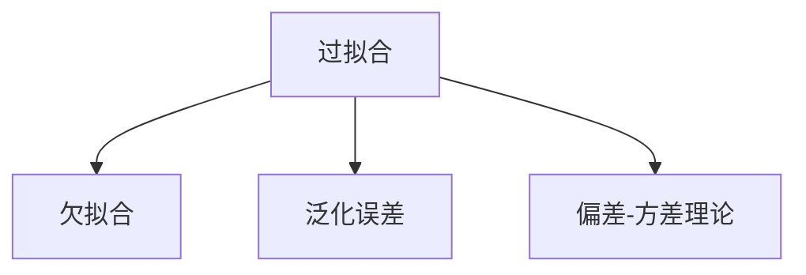
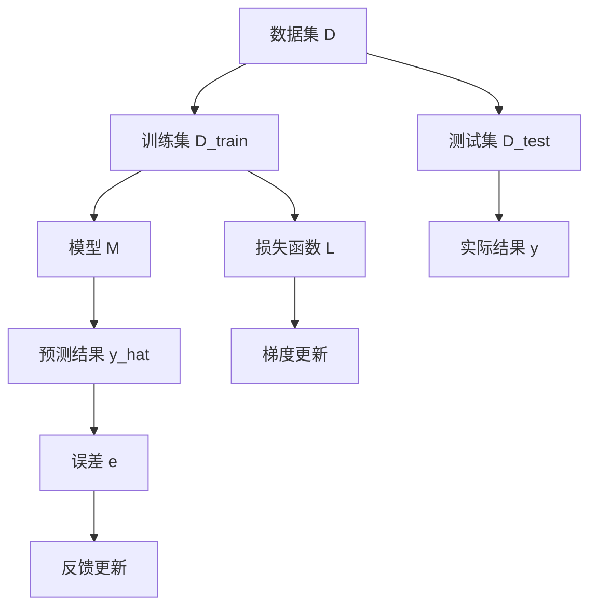

                 

## 1. 背景介绍

### 1.1 问题由来
在机器学习领域，过拟合 (Overfitting) 是一个常见且关键的问题。它指的是模型在训练数据上表现得很好，但在测试数据上却严重欠拟合的现象。当模型过于复杂或者数据量不足时，过拟合问题尤为突出。过拟合不仅会导致模型泛化性能差，还可能导致训练效率低下，甚至无法得到有效的预测结果。因此，过拟合是机器学习中必须克服的重要挑战之一。

### 1.2 问题核心关键点
过拟合问题的核心在于模型在训练数据上过度学习了数据中的噪声和随机因素，而未能真正学习到数据的本质特征。其具体表现包括模型在训练集上的精度很高，但在测试集上的精度显著下降。

## 2. 核心概念与联系

### 2.1 核心概念概述

过拟合的核心概念包括：

- **过拟合**：模型在训练集上表现很好，但在测试集上表现很差的现象。
- **欠拟合**：模型无法很好地拟合训练数据，导致在训练集和测试集上表现均较差。
- **泛化误差**：模型在新数据上的预测误差，是评估模型泛化能力的重要指标。
- **偏差-方差理论**：一种用于解释模型过拟合和欠拟合现象的统计学理论。

这些概念之间的联系可以通过以下Mermaid流程图来展示：



### 2.2 核心概念原理和架构的 Mermaid 流程图



这个流程图展示了过拟合问题中的主要组件：数据集D被分为训练集D_train和测试集D_test，模型M在训练集上学习，通过损失函数L计算误差e，并根据梯度更新进行反馈更新。

## 3. 核心算法原理 & 具体操作步骤

### 3.1 算法原理概述

过拟合问题的原因在于模型过度学习了训练集中的噪声和细节，使得模型过于复杂，无法泛化到新数据上。解决过拟合的方法通常包括数据增强、正则化、交叉验证等。

### 3.2 算法步骤详解

以下详细介绍过拟合问题的解决步骤：

**Step 1: 数据增强**
- 增加数据的多样性，如随机裁剪、旋转、翻转等，增强模型的泛化能力。
- 使用生成式对抗网络(GAN)生成更多的合成数据，丰富数据集的样本。

**Step 2: 正则化**
- L1、L2正则化：在损失函数中添加正则化项，限制模型参数的大小，避免过度拟合。
- Dropout：在训练过程中随机丢弃部分神经元，减少模型复杂度。

**Step 3: 交叉验证**
- 将数据集划分为K个子集，每次使用K-1个子集进行训练，剩余一个子集进行验证，重复K次，取平均值作为最终评估指标。
- 留出法(Leave-one-out)：每次使用单个样本作为验证集，其余样本用于训练，重复N次，取平均值作为最终评估指标。

### 3.3 算法优缺点

过拟合解决方法的优点包括：

- **增强泛化能力**：通过增加数据多样性和正则化，使得模型更加稳定，能够更好地泛化到新数据上。
- **降低计算复杂度**：正则化和Dropout等方法可以减少模型参数，加速训练过程。

缺点包括：

- **增加训练难度**：数据增强和正则化会增加训练难度，需要更多的计算资源和时间。
- **过度简化模型**：正则化和Dropout等方法可能会过度简化模型，导致欠拟合。

### 3.4 算法应用领域

过拟合解决方法在机器学习中的各个领域都有广泛应用，包括但不限于：

- **计算机视觉**：图像分类、目标检测、图像分割等任务。
- **自然语言处理**：文本分类、语言模型、机器翻译等任务。
- **语音识别**：声学模型、语言模型等任务。
- **推荐系统**：用户画像、物品推荐等任务。

## 4. 数学模型和公式 & 详细讲解

### 4.1 数学模型构建

过拟合问题的核心在于模型在训练集上过度学习了数据中的噪声，导致泛化误差增加。设训练集为D_train，测试集为D_test，模型为M，损失函数为L，则泛化误差为：

$$
\epsilon = \mathbb{E}[\|y - M(x)\|^2]
$$

其中，y为实际标签，M(x)为模型预测标签。

### 4.2 公式推导过程

设模型M的损失函数为L(y, M(x))，则泛化误差可以表示为：

$$
\epsilon = \mathbb{E}_{x}[\|y - M(x)\|^2]
$$

假设模型M可以分解为两部分：偏差项B和方差项V：

$$
\epsilon = B^2 + V^2
$$

偏差项B表示模型对数据的拟合程度，方差项V表示模型预测的稳定性。通常情况下，偏差和方差呈现反比关系，即B减小V增加，V减小B增加。

### 4.3 案例分析与讲解

以下以一个简单的线性回归模型为例，分析过拟合现象和解决方法：

- 假设训练集D_train包含N个样本(x_i, y_i)，其中x为特征，y为标签。
- 模型M为线性回归模型：$y = wx + b$，其中w和b为模型参数。
- 损失函数L为均方误差损失：$L = \frac{1}{N}\sum_{i=1}^N (y_i - wx_i - b)^2$。

假设模型在训练集D_train上进行了100次迭代，得到最优参数w和b。然后，用测试集D_test对模型进行评估：

- 假设测试集D_test包含M个样本(x_j, y_j)，模型预测为：$\hat{y} = wx_j + b$。
- 测试集上模型的损失函数为：$L_{test} = \frac{1}{M}\sum_{j=1}^M (y_j - wx_j - b)^2$。

如果模型在训练集上表现很好，但在测试集上表现很差，则说明模型可能过拟合了训练数据。

为了解决过拟合问题，可以采用以下方法：

- **增加数据多样性**：通过随机裁剪、旋转、翻转等操作，增加训练集D_train的多样性，使得模型学习到更多的特征。
- **正则化**：在损失函数L中添加L2正则项：$\frac{\lambda}{2}\|w\|^2$，限制模型参数的大小，避免过度拟合。
- **交叉验证**：将数据集划分为K个子集，每次使用K-1个子集进行训练，剩余一个子集进行验证，重复K次，取平均值作为最终评估指标。

## 5. 项目实践：代码实例和详细解释说明

### 5.1 开发环境搭建

在进行过拟合解决实践前，需要准备好开发环境。以下是使用Python进行TensorFlow开发的环境配置流程：

1. 安装Anaconda：从官网下载并安装Anaconda，用于创建独立的Python环境。

2. 创建并激活虚拟环境：
```bash
conda create -n tf-env python=3.8 
conda activate tf-env
```

3. 安装TensorFlow：根据CUDA版本，从官网获取对应的安装命令。例如：
```bash
conda install tensorflow==2.5 -c tensorflow -c conda-forge
```

4. 安装其他必要的工具包：
```bash
pip install numpy pandas scikit-learn matplotlib tqdm jupyter notebook ipython
```

完成上述步骤后，即可在`tf-env`环境中开始过拟合解决实践。

### 5.2 源代码详细实现

以下是一个简单的线性回归模型的Python代码，用于分析过拟合现象和解决方法：

```python
import numpy as np
import tensorflow as tf
import matplotlib.pyplot as plt

# 定义训练集和测试集
X_train = np.array([1, 2, 3, 4, 5])
y_train = np.array([2, 4, 6, 8, 10])
X_test = np.array([6, 7, 8, 9, 10])
y_test = np.array([12, 14, 16, 18, 20])

# 定义模型参数
w = tf.Variable(tf.random.normal([1]))
b = tf.Variable(tf.random.normal([1]))

# 定义模型和损失函数
model = tf.keras.Sequential([tf.keras.layers.Dense(1, input_shape=(1,))])
loss_fn = tf.keras.losses.MeanSquaredError()

# 定义优化器
optimizer = tf.keras.optimizers.SGD(learning_rate=0.01)

# 训练模型
for i in range(100):
    with tf.GradientTape() as tape:
        predictions = model(X_train)
        loss = loss_fn(y_train, predictions)
    gradients = tape.gradient(loss, [w, b])
    optimizer.apply_gradients(zip(gradients, [w, b]))

# 评估模型
predictions_test = model(X_test)
loss_test = loss_fn(y_test, predictions_test)

# 绘制训练和测试损失曲线
plt.plot(range(100), [loss], label='Training Loss')
plt.plot(range(100), [loss_test], label='Test Loss')
plt.legend()
plt.show()
```

### 5.3 代码解读与分析

让我们再详细解读一下关键代码的实现细节：

**训练集和测试集定义**：
- 定义训练集X_train和标签y_train，测试集X_test和标签y_test。

**模型定义**：
- 定义线性回归模型，包含一个Dense层。
- 使用均方误差损失函数。
- 定义优化器为随机梯度下降。

**训练过程**：
- 在每次迭代中，计算损失函数对模型参数的梯度，并使用优化器更新参数。
- 迭代100次后，得到模型在训练集和测试集上的预测和损失。

**测试集评估**：
- 使用测试集评估模型，计算损失。
- 使用Matplotlib绘制训练和测试损失曲线。

可以看到，TensorFlow提供的高层API使得构建和训练模型变得简单高效。通过不断迭代训练过程，可以观察到模型在训练集和测试集上的损失变化，从而分析过拟合现象。

## 6. 实际应用场景

### 6.1 智能推荐系统

智能推荐系统通常面临数据稀疏性问题，推荐模型的过拟合现象尤为严重。为了缓解过拟合，可以采用以下方法：

- **数据增强**：通过生成合成数据，如随机打乱用户历史行为，增加数据的多样性。
- **正则化**：在损失函数中添加L2正则项，限制模型参数的大小。
- **模型集成**：使用多个模型进行集成学习，取平均或投票结果作为最终推荐。

### 6.2 金融风险管理

金融风险管理中，模型需要具备对异常数据的鲁棒性和泛化能力。为了解决过拟合问题，可以采用以下方法：

- **数据增强**：通过生成合成数据，如历史回溯测试，增加数据的多样性。
- **正则化**：在损失函数中添加L1或L2正则项，限制模型参数的大小。
- **模型集成**：使用多个模型进行集成学习，取平均或投票结果作为最终预测。

### 6.3 医疗诊断系统

医疗诊断系统需要具备对新病例的适应性和泛化能力。为了解决过拟合问题，可以采用以下方法：

- **数据增强**：通过生成合成数据，如图像旋转、翻转等，增加数据的多样性。
- **正则化**：在损失函数中添加L2正则项，限制模型参数的大小。
- **模型集成**：使用多个模型进行集成学习，取平均或投票结果作为最终诊断。

## 7. 工具和资源推荐

### 7.1 学习资源推荐

为了帮助开发者系统掌握过拟合问题的解决理论基础和实践技巧，这里推荐一些优质的学习资源：

1. 《深度学习》系列书籍：由Ian Goodfellow、Yoshua Bengio和Aaron Courville合著，系统介绍了深度学习的理论基础和应用实践。
2. Coursera《机器学习》课程：斯坦福大学Andrew Ng开设的机器学习课程，讲解了机器学习的基本概念和算法。
3. Kaggle机器学习竞赛平台：提供了大量的机器学习实践案例和竞赛，可以在实战中提升解决过拟合问题的能力。

通过对这些资源的学习实践，相信你一定能够快速掌握过拟合问题的解决精髓，并用于解决实际的机器学习问题。

### 7.2 开发工具推荐

高效的开发离不开优秀的工具支持。以下是几款用于过拟合解决开发的常用工具：

1. TensorFlow：由Google主导开发的深度学习框架，支持分布式训练，适用于大规模数据集和高并发场景。
2. PyTorch：由Facebook开发的深度学习框架，易于使用，支持动态图和静态图，适用于快速迭代研究。
3. Scikit-learn：Python的机器学习库，提供了多种算法和工具，适用于数据预处理和特征工程。
4. Keras：基于TensorFlow和Theano的高级API，易于使用，适用于快速原型开发。

合理利用这些工具，可以显著提升过拟合解决任务的开发效率，加快创新迭代的步伐。

### 7.3 相关论文推荐

过拟合问题的解决源于学界的持续研究。以下是几篇奠基性的相关论文，推荐阅读：

1. Bias, Variance and Scaling Complexity in Neural Networks（Kearns et al.，1994）：讨论了神经网络中的偏差-方差理论，奠定了过拟合问题研究的理论基础。
2. Early Stopping and Regularization Techniques in Neural Networks（Solla et al.，1995）：介绍了Early Stopping、L1、L2正则化等方法，为解决过拟合问题提供了实用的方法。
3. Dropout: A Simple Way to Prevent Neural Networks from Overfitting（Hinton et al.，2012）：提出了Dropout方法，通过随机丢弃神经元，有效缓解过拟合问题。
4. Data Augmentation for Generalization in Deep Neural Networks（Arjovsky et al.，2016）：讨论了数据增强方法，通过增加数据的多样性，提升模型的泛化能力。

这些论文代表了大规模语言模型微调技术的发展脉络。通过学习这些前沿成果，可以帮助研究者把握学科前进方向，激发更多的创新灵感。

## 8. 总结：未来发展趋势与挑战

### 8.1 总结

本文对过拟合问题的解决进行了全面系统的介绍。首先阐述了过拟合问题的研究背景和意义，明确了过拟合问题的核心在于模型在训练集上过度学习了数据中的噪声和随机因素。其次，从原理到实践，详细讲解了过拟合问题的解决步骤和解决方法，给出了过拟合解决任务开发的完整代码实例。同时，本文还广泛探讨了过拟合问题在各个领域的应用场景，展示了过拟合问题的广泛影响。

通过本文的系统梳理，可以看到，过拟合问题是机器学习中必须克服的重要挑战之一，掌握其解决方法对于构建高性能、高泛化能力的模型至关重要。

### 8.2 未来发展趋势

展望未来，过拟合问题的解决将呈现以下几个发展趋势：

1. **深度学习模型的规模化**：随着硬件设备的不断进步，深度学习模型的参数规模将持续增大，过拟合问题将更加显著。
2. **多模态数据融合**：未来的过拟合解决方法将更多地考虑多模态数据的融合，如图像、语音、文本等，提升模型的泛化能力。
3. **分布式训练技术**：随着数据集的不断增大，分布式训练技术将成为解决过拟合问题的重要手段，通过并行计算提高模型的训练效率。
4. **自适应学习方法**：未来的过拟合解决方法将更加注重自适应学习，通过动态调整模型参数，提升模型的泛化能力。
5. **自动化超参数优化**：未来的过拟合解决方法将更多地利用自动化技术，通过智能搜索最优超参数组合，提升模型的泛化能力。

以上趋势凸显了过拟合问题解决的广阔前景。这些方向的探索发展，必将进一步提升机器学习模型的性能和应用范围，为人工智能技术带来更多的创新突破。

### 8.3 面临的挑战

尽管过拟合问题的解决已经取得了一定进展，但在迈向更加智能化、普适化应用的过程中，仍面临诸多挑战：

1. **计算资源限制**：过拟合问题的解决方法往往需要更多的计算资源，如GPU、TPU等高性能设备，这对于小型团队或个人开发者是一个障碍。
2. **数据隐私和安全**：在解决过拟合问题时，可能需要收集和处理大量的用户数据，如何保护用户隐私和安全是一个重要的挑战。
3. **模型的可解释性**：过拟合问题的解决方法通常比较复杂，模型的决策过程难以解释，这限制了其在某些关键应用场景中的应用。
4. **算法的复杂度**：一些过拟合解决方法，如生成式对抗网络(GAN)，虽然能够生成高质量的合成数据，但算法复杂度高，计算成本高。

### 8.4 研究展望

面对过拟合问题解决的诸多挑战，未来的研究需要在以下几个方面寻求新的突破：

1. **自动化超参数优化**：通过自动化技术，智能搜索最优超参数组合，提升模型的泛化能力。
2. **分布式训练技术**：利用分布式训练技术，提高模型的训练效率，缓解计算资源的限制。
3. **多模态数据融合**：通过融合多模态数据，提升模型的泛化能力，更好地适应真实世界的多样性。
4. **模型的可解释性**：研究可解释性强的过拟合解决方法，增强模型的透明性和可信度。
5. **数据隐私和安全保护**：研究数据隐私保护技术，确保数据的安全性和隐私性。

这些研究方向的探索，必将引领过拟合问题解决技术迈向更高的台阶，为构建高性能、高泛化能力的机器学习模型提供更多支持。总之，过拟合问题解决需要从数据、算法、工程、伦理等多个维度协同发力，方能真正实现人工智能技术的智能化和普适化。

## 9. 附录：常见问题与解答

**Q1：什么是过拟合问题？**

A: 过拟合问题指的是模型在训练集上表现很好，但在测试集上表现很差的现象。通常情况下，过拟合问题会导致模型泛化能力差，难以在新数据上获得好的预测结果。

**Q2：如何解决过拟合问题？**

A: 解决过拟合问题的方法包括：

- 数据增强：增加数据的多样性，如随机裁剪、旋转、翻转等。
- 正则化：在损失函数中添加L1、L2正则项，限制模型参数的大小。
- Dropout：在训练过程中随机丢弃部分神经元，减少模型复杂度。
- Early Stopping：在模型训练过程中，当验证集误差不再下降时停止训练。
- 模型集成：使用多个模型进行集成学习，取平均或投票结果作为最终预测。

**Q3：如何评估模型的泛化能力？**

A: 评估模型的泛化能力通常使用测试集上的误差作为指标，如均方误差、交叉熵等。通过对比训练集和测试集的误差，可以判断模型是否存在过拟合现象。

**Q4：生成式对抗网络(GAN)如何解决过拟合问题？**

A: 生成式对抗网络(GAN)通过生成合成数据，增加数据的多样性，缓解过拟合问题。具体来说，GAN由一个生成器和一个判别器组成，生成器生成合成数据，判别器判断生成数据是否真实，两者通过对抗训练提升生成数据的质量，从而增加数据的多样性。

通过本文的系统梳理，可以看到，过拟合问题是机器学习中必须克服的重要挑战之一，掌握其解决方法对于构建高性能、高泛化能力的模型至关重要。希望本文能够为机器学习开发者提供有价值的指导，帮助他们解决实际问题，提升模型性能。

