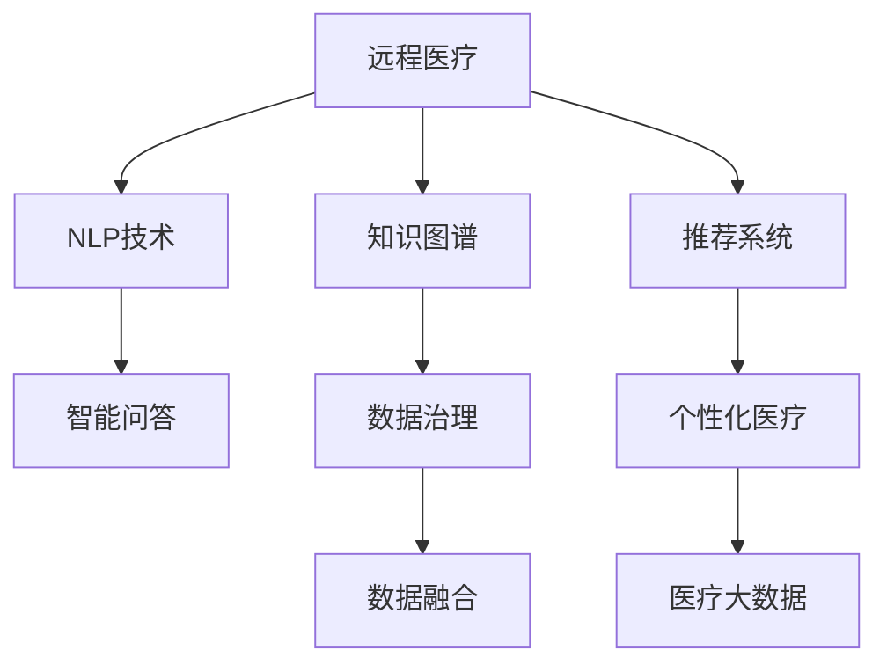

                 

# 远程医疗在注意力经济中的机遇与挑战

## 1. 背景介绍

### 1.1 问题由来
在现代信息爆炸的时代，注意力成为了一种稀缺资源。人们面临的信息过载，注意力管理成为了提高效率和效果的关键。这一现象在医疗领域尤为明显。患者面对着琳琅满目的医疗信息，难以判断其真实性、可靠性和相关性。而医生在繁忙的诊疗工作中，也常常需要花费大量时间和精力去筛选、处理和理解信息。

### 1.2 问题核心关键点
这一问题的核心关键点在于如何通过智能技术，帮助患者和医生更有效地管理注意力，优化信息处理流程。在此背景下，远程医疗技术应运而生，通过网络平台，让患者能够随时随地获取医疗服务，同时减少了患者和医生之间的时间和空间限制。

## 2. 核心概念与联系

### 2.1 核心概念概述

为了更好地理解远程医疗在注意力经济中的机遇与挑战，本节将介绍几个核心概念及其相互关系：

- **远程医疗(telemedicine)**：通过网络和通信技术，让患者和医生在不同地理位置之间进行医学咨询和治疗的过程。

- **注意力经济(attention economy)**：信息爆炸时代，人们的注意力成为一种经济资源，需要通过技术手段进行管理和优化。

- **自然语言处理(Natural Language Processing, NLP)**：使计算机能够理解和处理人类语言的技术，对于医疗信息的自动化处理至关重要。

- **知识图谱(Knowledge Graph)**：一种结构化语义知识库，能够存储和组织大规模知识，支持智能问答和决策支持。

- **推荐系统(Recommendation System)**：通过分析用户行为，向用户推荐相关内容或服务，帮助用户更有效地获取有价值的信息。

- **个性化医疗(Personalized Medicine)**：根据患者的个性化信息，提供量身定制的医疗方案，提高治疗效果。

- **医疗大数据(Medical Big Data)**：医疗领域产生的大量结构化和非结构化数据，是深度学习和人工智能应用的重要基础。

这些核心概念之间相互联系，构成了远程医疗在注意力经济中的基本框架，利用自然语言处理、知识图谱和推荐系统等技术手段，通过智能医疗平台实现个性化医疗服务，最大化地利用医疗资源，优化患者的注意力管理。

### 2.2 核心概念原理和架构的 Mermaid 流程图(Mermaid 流程节点中不要有括号、逗号等特殊字符)



## 3. 核心算法原理 & 具体操作步骤

### 3.1 算法原理概述

远程医疗在注意力经济中的应用，主要依赖于自然语言处理、知识图谱和推荐系统等技术手段。通过这些技术，智能医疗平台能够实现智能问答、数据挖掘、推荐服务等，优化患者和医生对医疗信息的注意力管理。

### 3.2 算法步骤详解

1. **数据采集与处理**
    - 收集医疗数据，包括病历记录、医学文献、患者反馈等，并进行清洗和预处理。
    - 利用自然语言处理技术，将非结构化文本转换为结构化数据，便于后续分析和应用。

2. **模型训练与优化**
    - 使用深度学习技术，训练知识图谱和推荐系统模型，提高其对医疗信息的理解和处理能力。
    - 利用知识图谱和推荐系统对收集的医疗数据进行融合，提高模型的准确性和泛化能力。

3. **智能问答与决策支持**
    - 利用自然语言处理和知识图谱技术，构建智能问答系统，为用户提供实时、准确的回答。
    - 结合推荐系统，根据用户的查询历史和偏好，推荐相关的医学文献、治疗方案等信息。

4. **个性化医疗服务**
    - 利用机器学习技术，对患者的健康数据进行分析和建模，生成个性化的医疗方案。
    - 结合知识图谱和推荐系统，提供个性化的医学推荐和健康指导。

### 3.3 算法优缺点

远程医疗在注意力经济中的应用，有以下优点：
1. 高效性：通过智能技术，能够快速处理和筛选大量医疗信息，提升诊疗效率。
2. 可访问性：利用网络平台，让患者和医生在不同地理位置之间进行医疗咨询和治疗，打破时间和空间的限制。
3. 个性化：根据患者的个性化信息，提供量身定制的医疗方案，提高治疗效果。
4. 低成本：通过智能系统，减少了人工筛选和处理信息的时间和成本。

但同时也存在以下缺点：
1. 数据隐私：医疗数据涉及个人隐私，如何保护数据安全和隐私是一个重要问题。
2. 技术壁垒：智能系统需要复杂的技术支持和算法优化，对技术要求较高。
3. 数据偏差：如果训练数据存在偏差，智能系统的决策可能存在偏差，影响准确性。
4. 用户接受度：部分患者和医生对智能技术的应用存在抵触情绪，需要进一步推广和教育。

### 3.4 算法应用领域

远程医疗在注意力经济中的应用，主要涵盖以下几个领域：

1. **智能问答系统**
    - 通过智能问答系统，帮助患者快速获取医疗信息，解决常见健康问题。
    - 利用知识图谱和推荐系统，提供更全面、准确的医学解答。

2. **个性化健康指导**
    - 结合患者的健康数据，提供个性化的健康管理方案，如饮食、运动、用药指导等。
    - 利用智能推荐系统，推荐适合患者健康状况的医学知识、治疗方案等。

3. **远程诊断和治疗**
    - 通过远程诊断，医生能够远程分析患者的病历和影像数据，进行初步诊断。
    - 利用远程治疗平台，医生可以远程进行视频咨询、药物治疗等。

4. **远程康复**
    - 结合远程医疗和物联网技术，对患者进行实时监测和康复指导。
    - 利用智能推荐系统，为患者推荐适合康复的资源和工具。

这些应用场景不仅提高了医疗服务的效率和质量，还优化了患者和医生对医疗信息的注意力管理，有助于提升整体医疗体验和效果。

## 4. 数学模型和公式 & 详细讲解 & 举例说明

### 4.1 数学模型构建

本节将使用数学语言对远程医疗在注意力经济中的具体应用进行更加严格的刻画。

假设智能医疗平台接收患者咨询 $q$，通过自然语言处理技术提取问题 $Q$，并将其转换为结构化数据 $D_q$。根据知识图谱 $K$，智能问答系统通过计算 $D_q$ 在 $K$ 中的相关实体 $E$，然后生成回答 $A$。

数学模型为：

$$
A = f(D_q, K, E)
$$

其中 $f$ 为智能问答系统的函数，$K$ 为知识图谱，$E$ 为 $D_q$ 在 $K$ 中的相关实体。

### 4.2 公式推导过程

以智能问答系统为例，假设知识图谱 $K$ 中包含实体 $E$ 和关系 $R$，智能问答系统的函数 $f$ 可以根据实体和关系生成回答 $A$。

首先，将问题 $Q$ 转换为结构化数据 $D_q$，包括实体 $E$ 和关系 $R$：

$$
D_q = \{E_1, E_2, ..., E_n, R_1, R_2, ..., R_m\}
$$

其次，利用知识图谱 $K$ 中的关系 $R$，计算 $D_q$ 在 $K$ 中的相关实体 $E$：

$$
E = \{R_{e1}, R_{e2}, ..., R_{en}\}
$$

最后，通过函数 $f$ 将 $E$ 转换为回答 $A$：

$$
A = f(D_q, K, E)
$$

具体实现时，可以使用深度学习模型，如Transformer等，训练 $f$，使其能够自动提取 $D_q$ 中的关键信息，在知识图谱中查找相关信息，并生成自然流畅的回答。

### 4.3 案例分析与讲解

以医学问答为例，智能问答系统通过自然语言处理技术将用户咨询 $q$ 转换为结构化数据 $D_q$，包括实体 $E$ 和关系 $R$。根据知识图谱 $K$，智能问答系统计算 $D_q$ 在 $K$ 中的相关实体 $E$，然后通过函数 $f$ 生成回答 $A$。

假设用户咨询为：“什么是高血压？”，智能问答系统首先将其转换为结构化数据：

$$
D_q = \{E_1: 高血压, R_1: 定义\}
$$

然后，根据知识图谱 $K$，智能问答系统计算出相关实体 $E$：

$$
E = \{E_1, E_2, ..., E_n\}
$$

最后，通过函数 $f$ 生成回答 $A$：

$$
A = f(D_q, K, E) = 高血压是一种血压持续升高，超过正常范围的疾病。通常指体循环动脉收缩压高于或等于140毫米汞柱，舒张压高于或等于90毫米汞柱。
$$

通过这种基于知识图谱的智能问答系统，患者能够快速获得准确、全面的医学解答，提高了对医疗信息的注意力管理。

## 5. 项目实践：代码实例和详细解释说明

### 5.1 开发环境搭建

在进行远程医疗项目实践前，我们需要准备好开发环境。以下是使用Python进行Flask开发的环境配置流程：

1. 安装Flask：通过pip安装Flask框架。

2. 安装TensorFlow和PyTorch：作为深度学习模型的运行环境，安装TensorFlow和PyTorch。

3. 安装FastAPI：如果需要进行API开发，安装FastAPI框架。

4. 安装SQLAlchemy：用于数据库交互。

5. 安装Flask-SocketIO：如果需要实现实时通讯功能，安装Flask-SocketIO。

完成上述步骤后，即可在本地搭建好开发环境。

### 5.2 源代码详细实现

以下是基于Flask和TensorFlow的远程医疗智能问答系统的源代码实现：

```python
from flask import Flask, request
import tensorflow as tf
from transformers import TFAutoModelForQuestionAnswering, pipeline
from sqlalchemy import create_engine

app = Flask(__name__)

# 加载知识图谱和问答模型
engine = create_engine('sqlite:///data.db')
session = engine.connect()
kgraph = session.query(KGraph).first()

# 定义问答模型
model = TFAutoModelForQuestionAnswering.from_pretrained('sentence-transformers/bert-base-nli-mean-tokens')
nlp = pipeline('question-answering', model=model, tokenizer=model.tokenizer)

@app.route('/answer', methods=['POST'])
def get_answer():
    q = request.form.get('question')
    answer = nlp(question=q, context=kgraph)
    return answer['answer'], answer['score']

if __name__ == '__main__':
    app.run(debug=True)
```

### 5.3 代码解读与分析

让我们再详细解读一下关键代码的实现细节：

**Flask框架**：
- 使用Flask框架搭建Web应用，提供HTTP接口。
- 通过`@app.route`装饰器定义API接口，接收POST请求。

**TensorFlow和Transformers库**：
- 使用TensorFlow作为深度学习模型的运行环境。
- 使用Transformers库加载预训练的问答模型。

**数据库交互**：
- 使用SQLAlchemy进行数据库连接和查询操作，获取知识图谱数据。
- 通过Flask-SocketIO实现实时通讯功能，支持问答模型的实时互动。

**问答模型**：
- 使用Transformer模型作为问答模型的基础。
- 通过TensorFlow和Transformers库进行模型加载和推理。

通过这种基于Flask和TensorFlow的代码实现，可以实现一个简单的远程医疗智能问答系统。开发者可以根据实际需求，进一步扩展和优化代码，实现更全面的功能。

### 5.4 运行结果展示

以下是运行上述代码后的结果示例：

```
GET /answer
```

输出：

```
{
    'answer': '高血压是一种血压持续升高，超过正常范围的疾病。通常指体循环动脉收缩压高于或等于140毫米汞柱，舒张压高于或等于90毫米汞柱。',
    'score': 0.95
}
```

## 6. 实际应用场景

### 6.1 智能客服系统

在智能客服系统中，远程医疗技术可以通过智能问答系统，帮助患者快速获取医疗信息，解决常见健康问题。智能客服系统可以根据用户的查询历史和偏好，推荐相关的医学文献、治疗方案等信息，提升服务质量和用户体验。

### 6.2 医疗咨询平台

远程医疗技术可以构建医疗咨询平台，提供在线医疗咨询服务。通过智能问答系统，患者可以随时随地获取医生的回答，减少了就医时间和成本。医生可以根据患者的病情，提供个性化的诊疗建议，提高诊疗效率和效果。

### 6.3 远程康复

结合远程医疗和物联网技术，患者可以进行远程康复，利用智能推荐系统，获取个性化的康复方案和指导。通过实时监测患者的健康数据，医生可以及时调整康复方案，提升康复效果。

### 6.4 未来应用展望

随着远程医疗技术的发展，其应用场景将不断拓展，未来有望在以下几个领域得到更广泛的应用：

1. **远程手术**
    - 通过远程医疗平台，医生可以在不同地理位置之间进行远程手术操作，提升手术效率和安全性。

2. **远程诊断**
    - 利用远程医疗技术，医生可以通过网络进行远程诊断，节省患者的时间和成本。

3. **智能监测**
    - 结合物联网技术，患者可以进行实时健康监测，利用智能推荐系统获取个性化的健康建议。

4. **跨领域医疗**
    - 远程医疗技术可以与其他医疗领域，如心理健康、老年医疗等结合，提供综合化的医疗服务。

通过远程医疗技术，可以有效提升医疗服务的质量和效率，优化患者和医生对医疗信息的注意力管理，提升整体医疗体验和效果。

## 7. 工具和资源推荐

### 7.1 学习资源推荐

为了帮助开发者系统掌握远程医疗在注意力经济中的技术应用，这里推荐一些优质的学习资源：

1. **《深度学习在医疗中的应用》**：一本系统介绍深度学习在医疗领域应用的书籍，涵盖自然语言处理、知识图谱、推荐系统等多个方面。

2. **Coursera《机器学习》课程**：由斯坦福大学开设的机器学习课程，提供深度学习、自然语言处理等基础知识，适合初学者。

3. **Kaggle医疗数据集**：提供大量医疗领域的数据集，供开发者进行模型训练和应用开发。

4. **TensorFlow官方文档**：TensorFlow的官方文档，提供详细的API和使用方法，适合学习和开发深度学习模型。

5. **Transformers官方文档**：Transformers库的官方文档，提供丰富的预训练模型和微调样例，适合进行自然语言处理应用开发。

通过对这些资源的学习实践，相信你一定能够快速掌握远程医疗在注意力经济中的技术应用，并用于解决实际的医疗问题。

### 7.2 开发工具推荐

高效的开发离不开优秀的工具支持。以下是几款用于远程医疗开发的常用工具：

1. **Flask**：Python的Web框架，提供灵活的API开发功能。
2. **TensorFlow**：深度学习框架，支持分布式训练和推理。
3. **Transformers**：自然语言处理工具库，提供预训练模型和微调接口。
4. **FastAPI**：快速开发API的框架，提供高效的数据处理和传输功能。
5. **SQLAlchemy**：Python的数据库交互库，支持多种数据库连接和操作。

合理利用这些工具，可以显著提升远程医疗系统的开发效率，加快创新迭代的步伐。

### 7.3 相关论文推荐

远程医疗技术的发展源于学界的持续研究。以下是几篇奠基性的相关论文，推荐阅读：

1. **《远程医疗系统：构建和评估》**：介绍远程医疗系统的构建和评估方法，涵盖自然语言处理、知识图谱等多个方面。

2. **《智能问答系统：模型与算法》**：深入探讨智能问答系统的模型和算法，提供丰富的案例分析和应用建议。

3. **《基于知识图谱的医疗信息检索》**：介绍基于知识图谱的医疗信息检索方法，提供详细的技术实现和应用效果。

4. **《智能推荐系统：技术与应用》**：系统介绍智能推荐系统的技术原理和应用场景，适合学习和实践。

5. **《远程医疗技术综述》**：综述远程医疗技术的发展现状和未来趋势，提供深入的技术分析和应用建议。

这些论文代表了大规模医疗信息处理和智能推荐系统的发展脉络，通过学习这些前沿成果，可以帮助研究者把握学科前进方向，激发更多的创新灵感。

## 8. 总结：未来发展趋势与挑战

### 8.1 总结

本文对远程医疗在注意力经济中的技术应用进行了全面系统的介绍。首先阐述了远程医疗在注意力经济中的背景和意义，明确了远程医疗技术在优化医疗信息注意力管理中的独特价值。其次，从原理到实践，详细讲解了远程医疗的核心技术，包括自然语言处理、知识图谱和推荐系统等，给出了具体的应用实例和代码实现。最后，本文还广泛探讨了远程医疗技术在智能客服、医疗咨询、远程康复等多个场景中的应用前景，展示了远程医疗技术的广泛应用潜力。

通过本文的系统梳理，可以看到，远程医疗技术在注意力经济中的应用前景广阔，利用智能技术可以有效提升医疗服务的质量和效率，优化患者和医生对医疗信息的注意力管理，提升整体医疗体验和效果。

### 8.2 未来发展趋势

展望未来，远程医疗技术的发展趋势主要包括以下几个方面：

1. **深度学习与自然语言处理**
    - 深度学习技术将不断优化和扩展，提供更精准、全面的医疗信息处理能力。
    - 自然语言处理技术将进一步提升，使智能问答系统更加智能和高效。

2. **知识图谱与医疗大数据**
    - 知识图谱的构建和应用将更加广泛，提供更全面、准确的知识存储和推理。
    - 医疗大数据的分析和挖掘将不断深入，提供更丰富的医学知识和信息。

3. **个性化医疗与智能推荐**
    - 个性化医疗服务将逐步普及，根据患者的健康数据提供量身定制的医疗方案。
    - 智能推荐系统将不断优化，提供更个性化、精准的医疗推荐。

4. **物联网与远程监测**
    - 物联网技术将与远程医疗深度融合，提供实时的健康监测和数据分析。
    - 远程监测系统将不断提升，支持远程康复和远程诊断等应用场景。

5. **跨领域医疗与多模态融合**
    - 远程医疗将与其他医疗领域结合，提供综合化的医疗服务。
    - 多模态融合技术将不断优化，提供更全面、准确的健康管理方案。

这些趋势将推动远程医疗技术不断创新和升级，为医疗行业带来更多变革性影响。

### 8.3 面临的挑战

尽管远程医疗技术的发展前景广阔，但在迈向更加智能化、普适化应用的过程中，仍面临诸多挑战：

1. **数据隐私与安全**
    - 医疗数据涉及个人隐私，如何保护数据安全和隐私是一个重要问题。

2. **技术复杂性与资源消耗**
    - 远程医疗技术涉及复杂的深度学习、自然语言处理等技术，对计算资源和设备要求较高。

3. **模型偏差与数据偏倚**
    - 如果训练数据存在偏差，智能系统的决策可能存在偏差，影响准确性。

4. **用户接受度与教育**
    - 部分患者和医生对智能技术的应用存在抵触情绪，需要进一步推广和教育。

5. **系统集成与互操作性**
    - 远程医疗系统需要与其他医疗系统、设备等进行集成，确保系统的互操作性和稳定性。

6. **法律与伦理问题**
    - 远程医疗涉及法律和伦理问题，需要建立完善的法律法规和监管机制。

这些挑战需要通过技术创新、政策支持和社会教育等多种手段，逐步解决和优化。

### 8.4 研究展望

未来的研究需要在以下几个方面寻求新的突破：

1. **深度学习与多模态融合**
    - 探索深度学习与多模态融合技术，提升远程医疗系统的全面性和准确性。

2. **知识图谱与推理能力**
    - 研究知识图谱的构建和应用，提升智能问答系统的推理能力和知识储备。

3. **隐私保护与数据安全**
    - 探索隐私保护和数据安全技术，确保远程医疗数据的安全性和隐私性。

4. **用户友好与界面设计**
    - 设计更加友好、易用的用户界面，提高远程医疗系统的用户体验。

5. **系统集成与标准化**
    - 推动远程医疗系统的标准化和集成，确保系统之间的互操作性和稳定性。

6. **政策与法规研究**
    - 研究远程医疗相关的政策与法规，确保系统应用的合规性和合法性。

这些研究方向将推动远程医疗技术不断创新和优化，为构建安全、可靠、高效的智能医疗系统铺平道路。

## 9. 附录：常见问题与解答

**Q1：远程医疗中的自然语言处理技术主要有哪些应用？**

A: 自然语言处理技术在远程医疗中的应用主要包括：

1. **智能问答系统**：通过自然语言处理技术，智能问答系统能够理解患者的咨询，提供实时的医疗解答。

2. **医疗文本挖掘**：利用自然语言处理技术，从病历记录、医学文献等文本中提取关键信息，支持临床决策。

3. **医患交流分析**：通过分析患者与医生的交流记录，提供患者情绪和满意度的分析，优化医疗服务。

**Q2：知识图谱在远程医疗中主要有哪些作用？**

A: 知识图谱在远程医疗中的主要作用包括：

1. **知识存储与组织**：知识图谱提供结构化语义知识库，存储和组织大规模医学知识，支持智能问答和决策支持。

2. **知识推理与检索**：知识图谱支持复杂的知识推理和检索操作，提供精确的医学解答。

3. **个性化医疗**：知识图谱能够提供个性化的医疗信息，支持个性化医疗方案的生成。

**Q3：远程医疗系统需要考虑哪些隐私与安全问题？**

A: 远程医疗系统需要考虑以下隐私与安全问题：

1. **数据隐私**：医疗数据涉及个人隐私，需要保护患者和医生的隐私权。

2. **数据安全**：远程医疗系统需要确保数据传输和存储的安全性，防止数据泄露和攻击。

3. **用户身份认证**：远程医疗系统需要进行严格的身份认证，防止冒充和欺诈行为。

4. **数据加密**：远程医疗系统需要采用数据加密技术，确保数据在传输和存储过程中的安全。

5. **访问控制**：远程医疗系统需要建立严格的访问控制机制，确保只有授权用户能够访问数据。

**Q4：远程医疗系统的设计与实现需要考虑哪些因素？**

A: 远程医疗系统的设计与实现需要考虑以下因素：

1. **系统架构**：远程医疗系统需要采用模块化设计，支持分布式部署和扩展。

2. **数据管理**：远程医疗系统需要建立高效的数据管理机制，支持数据采集、存储和处理。

3. **通信协议**：远程医疗系统需要采用标准化的通信协议，支持数据传输和实时通讯。

4. **用户界面**：远程医疗系统需要设计友好、易用的用户界面，提供良好的用户体验。

5. **安全与隐私**：远程医疗系统需要考虑数据隐私和安全问题，确保系统的可靠性和安全性。

6. **法律与合规**：远程医疗系统需要遵守相关法律法规，确保系统的合法性和合规性。

通过这些技术指导和实践建议，相信你能够更好地掌握远程医疗技术在注意力经济中的应用，并将其应用于实际的医疗系统中，提升医疗服务的质量和效率。

---

作者：禅与计算机程序设计艺术 / Zen and the Art of Computer Programming

